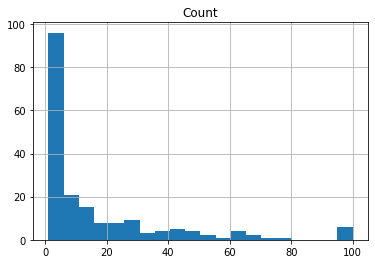
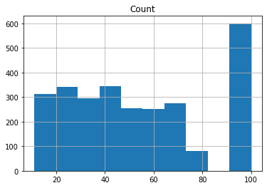
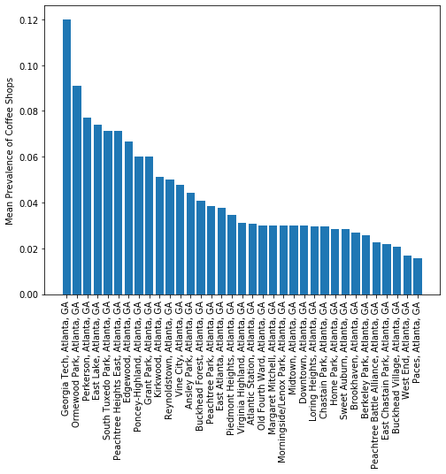
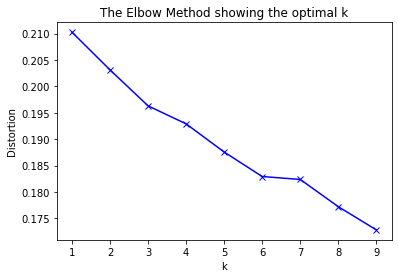
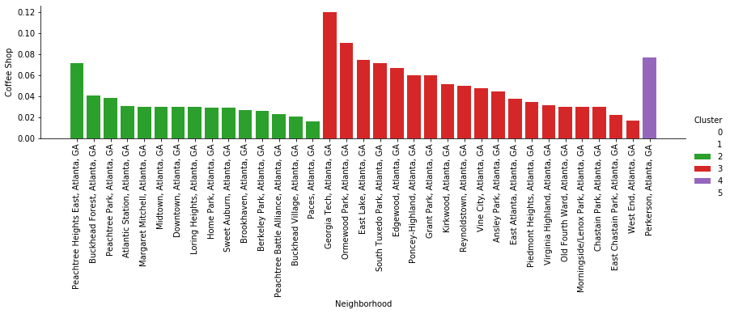

# Capstone Business Problem - Week 2

### Applied Data Science Capstone by IBM/Coursera

## Introduction/Business Problem

I am a huge connoisseur of coffee and have always harbored a pipe dream of opening a coffee shop focused on simple, but elevated coffee. The suggested prompt for the assignment got me thinking about where I could open a coffee shop in the city of Atlanta, where I live. Atlanta has some decent coffee, especially within the city limits. However, there are some areas which are devoid of good coffee and therefore could be a good location to open a shop.

Atlanta as a city is vast. The only public transportation runs through the heart of the city, and therefore some of the neighborhoods would only be accessible by car. Therefore, it would be beneficial to cluster neighborhoods to examine locations within the city which have a thriving coffee scene and where similar-minded neighborhoods would fill a need. Therefore, this project will allow me to conduct a city-wide search and find where a hypothetical coffee shop could be located.

Therefore, **my business problem is**: Where is the best place to open a coffee shop in metro Atlanta?


## Atlanta actually provides really nice documentation about all of the 244 official neighborhoods, so I am simply going to use that.


```python
import requests
import pandas as pd
import numpy as np
import geocoder
```


```python
import math

# Read in CSV
d = pd.read_csv('atl_neighborhoods.csv')[['NAME','SQMILES']]

### Need to add 'GA' for location search
d['NAME'] = d['NAME'] + ', Atlanta, GA'
```

### Secondly, I want to constrain the Foursquare search to only the neighborhood, so I am computing a customized radius based on the square miles for each neighborhood.


```python
custom_radius = []
for ii in range(len(d)):
    #print(d.loc[ii,'SQMILES'])
    custom_radius.append(math.sqrt(d.loc[ii,'SQMILES']/3.14)*1609) #conversion from miles to meters

d['RADIUS'] = custom_radius

print('The custom radius calculation had a minimum distance of {}m and maximum of {}m'.format(min(d['RADIUS']), max(d['RADIUS'])))

d.head()
```

    The custom radius calculation had a minimum distance of 128.4121797108404m and maximum of 1575.3406071902102m
    


<div>
<style scoped>
    .dataframe tbody tr th:only-of-type {
        vertical-align: middle;
    }

    .dataframe tbody tr th {
        vertical-align: top;
    }

    .dataframe thead th {
        text-align: right;
    }
</style>
<table border="1" class="dataframe">
  <thead>
    <tr style="text-align: right;">
      <th></th>
      <th>NAME</th>
      <th>SQMILES</th>
      <th>RADIUS</th>
    </tr>
  </thead>
  <tbody>
    <tr>
      <th>0</th>
      <td>Atlanta University Center, Atlanta, GA</td>
      <td>0.52</td>
      <td>654.776210</td>
    </tr>
    <tr>
      <th>1</th>
      <td>Hunter Hills, Atlanta, GA</td>
      <td>0.50</td>
      <td>642.060899</td>
    </tr>
    <tr>
      <th>2</th>
      <td>Bankhead, Atlanta, GA</td>
      <td>0.65</td>
      <td>732.062058</td>
    </tr>
    <tr>
      <th>3</th>
      <td>English Avenue, Atlanta, GA</td>
      <td>0.81</td>
      <td>817.210108</td>
    </tr>
    <tr>
      <th>4</th>
      <td>Adair Park, Atlanta, GA</td>
      <td>0.45</td>
      <td>609.112451</td>
    </tr>
  </tbody>
</table>
</div>


### This function takes a neighborhood and, using geocoder, finds the associated latitutde and longitude of the centroid


```python
def get_lat_long(name):
    
    # Returning search for zipcode
    g = geocoder.arcgis(name)
    
    # Latitude
    lati = g.lat
    
    # Longitude
    longi = g.lng
    
    return(lati,longi)
```

### Add longitude and latitutde to dataframe


```python
lat_lookup = []
lng_lookup = []

for n in d['NAME']:
    lati,longi = get_lat_long(n)
    
    lat_lookup.append(lati)
    lng_lookup.append(longi)
    
d['LATITUDE'] = lat_lookup
d['LONGITUDE'] = lng_lookup
d.head() 
```


<div>
<style scoped>
    .dataframe tbody tr th:only-of-type {
        vertical-align: middle;
    }

    .dataframe tbody tr th {
        vertical-align: top;
    }

    .dataframe thead th {
        text-align: right;
    }
</style>
<table border="1" class="dataframe">
  <thead>
    <tr style="text-align: right;">
      <th></th>
      <th>NAME</th>
      <th>SQMILES</th>
      <th>RADIUS</th>
      <th>LATITUDE</th>
      <th>LONGITUDE</th>
    </tr>
  </thead>
  <tbody>
    <tr>
      <th>0</th>
      <td>Atlanta University Center, Atlanta, GA</td>
      <td>0.52</td>
      <td>654.776210</td>
      <td>33.75092</td>
      <td>-84.41234</td>
    </tr>
    <tr>
      <th>1</th>
      <td>Hunter Hills, Atlanta, GA</td>
      <td>0.50</td>
      <td>642.060899</td>
      <td>33.75848</td>
      <td>-84.43129</td>
    </tr>
    <tr>
      <th>2</th>
      <td>Bankhead, Atlanta, GA</td>
      <td>0.65</td>
      <td>732.062058</td>
      <td>33.76827</td>
      <td>-84.42642</td>
    </tr>
    <tr>
      <th>3</th>
      <td>English Avenue, Atlanta, GA</td>
      <td>0.81</td>
      <td>817.210108</td>
      <td>33.76821</td>
      <td>-84.41051</td>
    </tr>
    <tr>
      <th>4</th>
      <td>Adair Park, Atlanta, GA</td>
      <td>0.45</td>
      <td>609.112451</td>
      <td>33.72997</td>
      <td>-84.41044</td>
    </tr>
  </tbody>
</table>
</div>


### Plotting the locations of the neighborhoods


```python
## Looking at where the locations are
import folium

# create map of New York using latitude and longitude values
map_atl = folium.Map(location=[33.7868002,-84.3970265], zoom_start=10)

# add markers to map
for lat, lng, borough in zip(d['LATITUDE'], d['LONGITUDE'], d['NAME']):
    #label = str(borough)
    #label = folium.Popup(label, parse_html=True)
    folium.CircleMarker(
        [lat, lng],
        radius=5,
        popup=borough,
        color='blue',
        fill=True,
        fill_color='#3186cc',
        fill_opacity=0.7,
        parse_html=False).add_to(map_atl)  
    
map_atl
```


<div style="width:100%;"><div style="position:relative;width:100%;height:0;padding-bottom:60%;"><iframe src="data:text/html;charset=utf-8;base64,PCFET0NUWVBFIGh0bWw+CjxoZWFkPiAgICAKICAgIDxtZXRhIGh0dHAtZXF1aXY9ImNvbnRlbnQtdHlwZSIgY29udGVudD0idGV4dC9odG1sOyBjaGFyc2V0PVVURi04IiAvPgogICAgPHNjcmlwdD5MX1BSRUZFUl9DQU5WQVMgPSBmYWxzZTsgTF9OT19UT1VDSCA9IGZhbHNlOyBMX0RJU0FCTEVfM0QgPSBmYWxzZTs8L3NjcmlwdD4KICAgIDxzY3JpcHQgc3JjPSJodHRwczovL2Nkbi5qc2RlbGl2ci5uZXQvbnBtL2xlYWZsZXRAMS4yLjAvZGlzdC9sZWFmbGV0LmpzIj48L3NjcmlwdD4KICAgIDxzY3JpcHQgc3JjPSJodHRwczovL2FqYXguZ29vZ2xlYXBpcy5jb20vYWpheC9saWJzL2pxdWVyeS8xLjExLjEvanF1ZXJ5Lm1pbi5qcyI+PC9zY3JpcHQ+CiAgICA8c2NyaXB0IHNyYz0iaHR0cHM6Ly9tYXhjZG4uYm9vdHN0cmFwY2RuLmNvbS9ib290c3RyYXAvMy4yLjAvanMvYm9vdHN0cmFwLm1pbi5qcyI+PC9zY3JpcHQ+CiAgICA8c2NyaXB0IHNyYz0iaHR0cHM6Ly9jZG5qcy5jbG91ZGZsYXJlLmNvbS9hamF4L2xpYnMvTGVhZmxldC5hd2Vzb21lLW1hcmtlcnMvMi4wLjIvbGVhZmxldC5hd2Vzb21lLW1hcmtlcnMuanMiPjwvc2NyaXB0PgogICAgPGxpbmsgcmVsPSJzdHlsZXNoZWV0IiBocmVmPSJodHRwczovL2Nkbi5qc2RlbGl2ci5uZXQvbnBtL2xlYWZsZXRAMS4yLjAvZGlzdC9sZWFmbGV0LmNzcyIvPgogICAgPGxpbmsgcmVsPSJzdHlsZXNoZWV0IiBocmVmPSJodHRwczovL21heGNkbi5ib290c3RyYXBjZG4uY29tL2Jvb3RzdHJhcC8zLjIuMC9jc3MvYm9vdHN0cmFwLm1pbi5jc3MiLz4KICAgIDxsaW5rIHJlbD0ic3R5bGVzaGVldCIgaHJlZj0iaHR0cHM6Ly9tYXhjZG4uYm9vdHN0cmFwY2RuLmNvbS9ib290c3RyYXAvMy4yLjAvY3NzL2Jvb3RzdHJhcC10aGVtZS5taW4uY3NzIi8+CiAgICA8bGluayByZWw9InN0eWxlc2hlZXQiIGhyZWY9Imh0dHBzOi8vbWF4Y2RuLmJvb3RzdHJhcGNkbi5jb20vZm9udC1hd2Vzb21lLzQuNi4zL2Nzcy9mb250LWF3ZXNvbWUubWluLmNzcyIvPgogICAgPGxpbmsgcmVsPSJzdHlsZXNoZWV0IiBocmVmPSJodHRwczovL2NkbmpzLmNsb3VkZmxhcmUuY29tL2FqYXgvbGlicy9MZWFmbGV0LmF3ZXNvbWUtbWFya2Vycy8yLjAuMi9sZWFmbGV0LmF3ZXNvbWUtbWFya2Vycy5jc3MiLz4KICAgIDxsaW5rIHJlbD0ic3R5bGVzaGVldCIgaHJlZj0iaHR0cHM6Ly9yYXdnaXQuY29tL3B5dGhvbi12aXN1YWxpemF0aW9uL2ZvbGl1bS9tYXN0ZXIvZm9saXVtL3RlbXBsYXRlcy9sZWFmbGV0LmF3ZXNvbWUucm90YXRlLmNzcyIvPgogICAgPHN0eWxlPmh0bWwsIGJvZHkge3dpZHRoOiAxMDAlO2hlaWdodDogMTAwJTttYXJnaW46IDA7cGFkZGluZzogMDt9PC9zdHlsZT4KICAgIDxzdHlsZT4jbWFwIHtwb3NpdGlvbjphYnNvbHV0ZTt0b3A6MDtib3R0b206MDtyaWdodDowO2xlZnQ6MDt9PC9zdHlsZT4KICAgIAogICAgICAgICAgICA8c3R5bGU+ICNtYXBfMjNlY2YzZTJiNzkxNGRhMWFkYmM1ZjBlYjllNjdhOTcgewogICAgICAgICAgICAgICAgcG9zaXRpb24gOiByZWxhdGl2ZTsKICAgICAgICAgICAgICAgIHdpZHRoIDogMTAwLjAlOwogICAgICAgICAgICAgICAgaGVpZ2h0OiAxMDAuMCU7CiAgICAgICAgICAgICAgICBsZWZ0OiAwLjAlOwogICAgICAgICAgICAgICAgdG9wOiAwLjAlOwogICAgICAgICAgICAgICAgfQogICAgICAgICAgICA8L3N0eWxlPgogICAgICAgIAo8L2hlYWQ+Cjxib2R5PiAgICAKICAgIAogICAgICAgICAgICA8ZGl2IGNsYXNzPSJmb2xpdW0tbWFwIiBpZD0ibWFwXzIzZWNmM2UyYjc5MTRkYTFhZGJjNWYwZWI5ZTY3YTk3IiA+PC9kaXY+CiAgICAgICAgCjwvYm9keT4KPHNjcmlwdD4gICAgCiAgICAKCiAgICAgICAgICAgIAogICAgICAgICAgICAgICAgdmFyIGJvdW5kcyA9IG51bGw7CiAgICAgICAgICAgIAoKICAgICAgICAgICAgdmFyIG1hcF8yM2VjZjNlMmI3OTE0ZGExYWRiYzVmMGViOWU2N2E5NyA9IEwubWFwKAogICAgICAgICAgICAgICAgICAgICAgICAgICAgICAgICAgJ21hcF8yM2VjZjNlMmI3OTE0ZGExYWRiYzVmMGViOWU2N2E5NycsCiAgICAgICAgICAgICAgICAgICAgICAgICAgICAgICAgICB7Y2VudGVyOiBbMzMuNzg2ODAwMiwtODQuMzk3MDI2NV0sCiAgICAgICAgICAgICAgICAgICAgICAgICAgICAgICAgICB6b29tOiAxMCwKICAgICAgICAgICAgICAgICAgICAgICAgICAgICAgICAgIG1heEJvdW5kczogYm91bmRzLAogICAgICAgICAgICAgICAgICAgICAgICAgICAgICAgICAgbGF5ZXJzOiBbXSwKICAgICAgICAgICAgICAgICAgICAgICAgICAgICAgICAgIHdvcmxkQ29weUp1bXA6IGZhbHNlLAogICAgICAgICAgICAgICAgICAgICAgICAgICAgICAgICAgY3JzOiBMLkNSUy5FUFNHMzg1NwogICAgICAgICAgICAgICAgICAgICAgICAgICAgICAgICB9KTsKICAgICAgICAgICAgCiAgICAgICAgCiAgICAKICAgICAgICAgICAgdmFyIHRpbGVfbGF5ZXJfYjIxMjcxY2ZkZjM0NGIyMmIxNTgyNDk2ZDEzZDc3OTYgPSBMLnRpbGVMYXllcigKICAgICAgICAgICAgICAgICdodHRwczovL3tzfS50aWxlLm9wZW5zdHJlZXRtYXAub3JnL3t6fS97eH0ve3l9LnBuZycsCiAgICAgICAgICAgICAgICB7CiAgImF0dHJpYnV0aW9uIjogbnVsbCwKICAiZGV0ZWN0UmV0aW5hIjogZmFsc2UsCiAgIm1heFpvb20iOiAxOCwKICAibWluWm9vbSI6IDEsCiAgIm5vV3JhcCI6IGZhbHNlLAogICJzdWJkb21haW5zIjogImFiYyIKfQogICAgICAgICAgICAgICAgKS5hZGRUbyhtYXBfMjNlY2YzZTJiNzkxNGRhMWFkYmM1ZjBlYjllNjdhOTcpOwogICAgICAgIAogICAgCiAgICAgICAgICAgIHZhciBjaXJjbGVfbWFya2VyXzU0OTU2YWFhZGM3YTQ4YTc5NzkzZTU2ZTdlY2Y0ZjlmID0gTC5jaXJjbGVNYXJrZXIoCiAgICAgICAgICAgICAgICBbMzMuNzUwOTIwMDAwMDAwMDY1LC04NC40MTIzMzk5OTk5OTk5N10sCiAgICAgICAgICAgICAgICB7CiAgImJ1YmJsaW5nTW91c2VFdmVudHMiOiB0cnVlLAogICJjb2xvciI6ICJibHVlIiwKICAiZGFzaEFycmF5IjogbnVsbCwKICAiZGFzaE9mZnNldCI6IG51bGwsCiAgImZpbGwiOiB0cnVlLAogICJmaWxsQ29sb3IiOiAiIzMxODZjYyIsCiAgImZpbGxPcGFjaXR5IjogMC43LAogICJmaWxsUnVsZSI6ICJldmVub2RkIiwKICAibGluZUNhcCI6ICJyb3VuZCIsCiAgImxpbmVKb2luIjogInJvdW5kIiwKICAib3BhY2l0eSI6IDEuMCwKICAicmFkaXVzIjogNSwKICAic3Ryb2tlIjogdHJ1ZSwKICAid2VpZ2h0IjogMwp9CiAgICAgICAgICAgICAgICApLmFkZFRvKG1hcF8yM2VjZjNlMmI3OTE0ZGExYWRiYzVmMGViOWU2N2E5Nyk7CiAgICAgICAgICAgIAogICAgCiAgICAgICAgICAgIHZhciBwb3B1cF8xMGQ2MzQwMDIzMDU0M2YxOWE4MTFkYzFkMDdiOGJkZCA9IEwucG9wdXAoe21heFdpZHRoOiAnMzAwJ30pOwoKICAgICAgICAgICAgCiAgICAgICAgICAgICAgICB2YXIgaHRtbF85MTk5MDk3YWEzZDA0NWM0ODM3ZTg0ZjM4OWVhYzc4OSA9ICQoJzxkaXYgaWQ9Imh0bWxfOTE5OTA5N2FhM2QwNDVjNDgzN2U4NGYzODllYWM3ODkiIHN0eWxlPSJ3aWR0aDogMTAwLjAlOyBoZWlnaHQ6IDEwMC4wJTsiPkF0bGFudGEgVW5pdmVyc2l0eSBDZW50ZXIsIEF0bGFudGEsIEdBPC9kaXY+JylbMF07CiAgICAgICAgICAgICAgICBwb3B1cF8xMGQ2MzQwMDIzMDU0M2YxOWE4MTFkYzFkMDdiOGJkZC5zZXRDb250ZW50KGh0bWxfOTE5OTA5N2FhM2QwNDVjNDgzN2U4NGYzODllYWM3ODkpOwogICAgICAgICAgICAKCiAgICAgICAgICAgIGNpcmNsZV9tYXJrZXJfNTQ5NTZhYWFkYzdhNDhhNzk3OTNlNTZlN2VjZjRmOWYuYmluZFBvcHVwKHBvcHVwXzEwZDYzNDAwMjMwNTQzZjE5YTgxMWRjMWQwN2I4YmRkKTsKCiAgICAgICAgICAgIAogICAgICAgIAogICAgCiAgICAgICAgICAgIHZhciBjaXJjbGVfbWFya2VyXzAxYWNmYTY1NDYxNzQ3MzRhMTJiNjI0NTdkYzYyNWFjID0gTC5jaXJjbGVNYXJrZXIoCiAgICAgICAgICAgICAgICBbMzMuNzU4NDgwMDAwMDAwMDgsLTg0LjQzMTI4OTk5OTk5OTk5XSwKICAgICAgICAgICAgICAgIHsKICAiYnViYmxpbmdNb3VzZUV2ZW50cyI6IHRydWUsCiAgImNvbG9yIjogImJsdWUiLAogICJkYXNoQXJyYXkiOiBudWxsLAogICJkYXNoT2Zmc2V0IjogbnVsbCwKICAiZmlsbCI6IHRydWUsCiAgImZpbGxDb2xvciI6ICIjMzE4NmNjIiwKICAiZmlsbE9wYWNpdHkiOiAwLjcsCiAgImZpbGxSdWxlIjogImV2ZW5vZGQiLAogICJsaW5lQ2FwIjogInJvdW5kIiwKICAibGluZUpvaW4iOiAicm91bmQiLAogICJvcGFjaXR5IjogMS4wLAogICJyYWRpdXMiOiA1LAogICJzdHJva2UiOiB0cnVlLAogICJ3ZWlnaHQiOiAzCn0KICAgICAgICAgICAgICAgICkuYWRkVG8obWFwXzIzZWNmM2UyYjc5MTRkYTFhZGJjNWYwZWI5ZTY3YTk3KTsKICAgICAgICAgICAgCiAgICAKICAgICAgICAgICAgdmFyIHBvcHVwXzEwNmJkNmFjY2VmMDRkNjNhMDQ1NzI2ZDRiMGE1ZWQyID0gTC5wb3B1cCh7bWF4V2lkdGg6ICczMDAnfSk7CgogICAgICAgICAgICAKICAgICAgICAgICAgICAgIHZhciBodG1sXzViN2M1Mzk2NzY1ODQyMWNhYTI5ZjNjNWU2YmU0MDI3ID0gJCgnPGRpdiBpZD0iaHRtbF81YjdjNTM5Njc2NTg0MjFjYWEyOWYzYzVlNmJlNDAyNyIgc3R5bGU9IndpZHRoOiAxMDAuMCU7IGhlaWdodDogMTAwLjAlOyI+SHVudGVyIEhpbGxzLCBBdGxhbnRhLCBHQTwvZGl2PicpWzBdOwogICAgICAgICAgICAgICAgcG9wdXBfMTA2YmQ2YWNjZWYwNGQ2M2EwNDU3MjZkNGIwYTVlZDIuc2V0Q29udGVudChodG1sXzViN2M1Mzk2NzY1ODQyMWNhYTI5ZjNjNWU2YmU0MDI3KTsKICAgICAgICAgICAgCgogICAgICAgICAgICBjaXJjbGVfbWFya2VyXzAxYWNmYTY1NDYxNzQ3MzRhMTJiNjI0NTdkYzYyNWFjLmJpbmRQb3B1cChwb3B1cF8xMDZiZDZhY2NlZjA0ZDYzYTA0NTcyNmQ0YjBhNWVkMik7CgogICAgICAgICAgICAKICAgICAgICAKICAgIAogICAgICAgICAgICB2YXIgY2lyY2xlX21hcmtlcl81NzI3ZmQ2NTU3OWM0ZmU2OTNlYTNjNzczZjc2NDA2ZSA9IEwuY2lyY2xlTWFya2VyKAogICAgICAgICAgICAgICAgWzMzLjc2ODI3MDAwMDAwMDAzLC04NC40MjY0MTk5OTk5OTk5NV0sCiAgICAgICAgICAgICAgICB7CiAgImJ1YmJsaW5nTW91c2VFdmVudHMiOiB0cnVlLAogICJjb2xvciI6ICJibHVlIiwKICAiZGFzaEFycmF5IjogbnVsbCwKICAiZGFzaE9mZnNldCI6IG51bGwsCiAgImZpbGwiOiB0cnVlLAogICJmaWxsQ29sb3IiOiAiIzMxODZjYyIsCiAgImZpbGxPcGFjaXR5IjogMC43LAogICJmaWxsUnVsZSI6ICJldmVub2RkIiwKICAibGluZUNhcCI6ICJyb3VuZCIsCiAgImxpbmVKb2luIjogInJvdW5kIiwKICAib3BhY2l0eSI6IDEuMCwKICAicmFkaXVzIjogNSwKICAic3Ryb2tlIjogdHJ1ZSwKICAid2VpZ2h0IjogMwp9CiAgICAgICAgICAgICAgICApLmFkZFRvKG1hcF8yM2VjZjNlMmI3OTE0ZGExYWRiYzVmMGViOWU2N2E5Nyk7CiAgICAgICAgICAgIAogICAgCiAgICAgICAgICAgIHZhciBwb3B1cF85NmRjYWM3MDM2NTY0ZjY1YjFhZGM5MmZlZjZiOTdjOCA9IEwucG9wdXAoe21heFdpZHRoOiAnMzAwJ30pOwoKICAgICAgICAgICAgCiAgICAgICAgICAgICAgICB2YXIgaHRtbF83MGYyYzg1NDM3MDg0N2Q1Yjk3MGM1YTg3NDlkMDI1NiA9ICQoJzxkaXYgaWQ9Imh0bWxfNzBmMmM4NTQzNzA4NDdkNWI5NzBjNWE4NzQ5ZDAyNTYiIHN0eWxlPSJ3aWR0aDogMTAwLjAlOyBoZWlnaHQ6IDEwMC4wJTsiPkJhbmtoZWFkLCBBdGxhbnRhLCBHQTwvZGl2PicpWzBdOwogICAgICAgICAgICAgICAgcG9wdXBfOTZkY2FjNzAzNjU2NGY2NWIxYWRjOTJmZWY2Yjk3Yzguc2V0Q29udGVudChodG1sXzcwZjJjODU0MzcwODQ3ZDViOTcwYzVhODc0OWQwMjU2KTsKICAgICAgICAgICAgCgogICAgICAgICAgICBjaXJjbGVfbWFya2VyXzU3MjdmZDY1NTc5YzRmZTY5M2VhM2M3NzNmNzY0MDZlLmJpbmRQb3B1cChwb3B1cF85NmRjYWM3MDM2NTY0ZjY1YjFhZGM5MmZlZjZiOTdjOCk7CgogICAgICAgICAgICAKICAgICAgICAKICAgIAogICAgICAgICAgICB2YXIgY2lyY2xlX21hcmtlcl81YTQzNjQyNDJkNDU0ZGJlYWNkYWJhM2Y1NzUxOTA1MiA9IEwuY2lyY2xlTWFya2VyKAogICAgICAgICAgICAgICAgWzMzLjc2ODIxMDAwMDAwMDA3LC04NC40MTA1MDk5OTk5OTk5OV0sCiAgICAgICAgICAgICAgICB7CiAgImJ1YmJsaW5nTW91c2VFdmVudHMiOiB0cnVlLAogICJjb2xvciI6ICJibHVlIiwKICAiZGFzaEFycmF5IjogbnVsbCwKICAiZGFzaE9mZnNldCI6IG51bGwsCiAgImZpbGwiOiB0cnVlLAogICJmaWxsQ29sb3IiOiAiIzMxODZjYyIsCiAgImZpbGxPcGFjaXR5IjogMC43LAogICJmaWxsUnVsZSI6ICJldmVub2RkIiwKICAibGluZUNhcCI6ICJyb3VuZCIsCiAgImxpbmVKb2luIjogInJvdW5kIiwKICAib3BhY2l0eSI6IDEuMCwKICAicmFkaXVzIjogNSwKICAic3Ryb2tlIjogdHJ1ZSwKICAid2VpZ2h0IjogMwp9CiAgICAgICAgICAgICAgICApLmFkZFRvKG1hcF8yM2VjZjNlMmI3OTE0ZGExYWRiYzVmMGViOWU2N2E5Nyk7CiAgICAgICAgICAgIAogICAgCiAgICAgICAgICAgIHZhciBwb3B1cF9kMzlmYTRmN2Q5ZTI0YTAxOWJhNDRhODUyODkwZjdkYyA9IEwucG9wdXAoe21heFdpZHRoOiAnMzAwJ30pOwoKICAgICAgICAgICAgCiAgICAgICAgICAgICAgICB2YXIgaHRtbF8wN2FmMjQ1NmFjY2Q0YzM1ODFhMzBlMWI1ODEzODM2NSA9ICQoJzxkaXYgaWQ9Imh0bWxfMDdhZjI0NTZhY2NkNGMzNTgxYTMwZTFiNTgxMzgzNjUiIHN0eWxlPSJ3aWR0aDogMTAwLjAlOyBoZWlnaHQ6IDEwMC4wJTsiPkVuZ2xpc2ggQXZlbnVlLCBBdGxhbnRhLCBHQTwvZGl2PicpWzBdOwogICAgICAgICAgICAgICAgcG9wdXBfZDM5ZmE0ZjdkOWUyNGEwMTliYTQ0YTg1Mjg5MGY3ZGMuc2V0Q29udGVudChodG1sXzA3YWYyNDU2YWNjZDRjMzU4MWEzMGUxYjU4MTM4MzY1KTsKICAgICAgICAgICAgCgogICAgICAgICAgICBjaXJjbGVfbWFya2VyXzVhNDM2NDI0MmQ0NTRkYmVhY2RhYmEzZjU3NTE5MDUyLmJpbmRQb3B1cChwb3B1cF9kMzlmYTRmN2Q5ZTI0YTAxOWJhNDRhODUyODkwZjdkYyk7CgogICAgICAgICAgICAKICAgICAgICAKICAgIAogICAgICAgICAgICB2YXIgY2lyY2xlX21hcmtlcl84ODNhMjA1ZTdjNGM0MDQ3OWU3M2NkMWU1M2VlYWIwZiA9IEwuY2lyY2xlTWFya2VyKAogICAgICAgICAgICAgICAgWzMzLjcyOTk3MDAwMDAwMDA0LC04NC40MTA0Mzk5OTk5OTk5NF0sCiAgICAgICAgICAgICAgICB7CiAgImJ1YmJsaW5nTW91c2VFdmVudHMiOiB0cnVlLAogICJjb2xvciI6ICJibHVlIiwKICAiZGFzaEFycmF5IjogbnVsbCwKICAiZGFzaE9mZnNldCI6IG51bGwsCiAgImZpbGwiOiB0cnVlLAogICJmaWxsQ29sb3IiOiAiIzMxODZjYyIsCiAgImZpbGxPcGFjaXR5IjogMC43LAogICJmaWxsUnVsZSI6ICJldmVub2RkIiwKICAibGluZUNhcCI6ICJyb3VuZCIsCiAgImxpbmVKb2luIjogInJvdW5kIiwKICAib3BhY2l0eSI6IDEuMCwKICAicmFkaXVzIjogNSwKICAic3Ryb2tlIjogdHJ1ZSwKICAid2VpZ2h0IjogMwp9CiAgICAgICAgICAgICAgICApLmFkZFRvKG1hcF8yM2VjZjNlMmI3OTE0ZGExYWRiYzVmMGViOWU2N2E5Nyk7CiAgICAgICAgICAgIAogICAgCiAgICAgICAgICAgIHZhciBwb3B1cF8zYjNiZDFlODY3Mzc0OTkyODhmOTk2M2YwMThmY2EyMCA9IEwucG9wdXAoe21heFdpZHRoOiAnMzAwJ30pOwoKICAgICAgICAgICAgCiAgICAgICAgICAgICAgICB2YXIgaHRtbF83OTZhNDc1NDk2NzE0ZGE3YjRiOGRkNzVjNzBlNWIyMCA9ICQoJzxkaXYgaWQ9Imh0bWxfNzk2YTQ3NTQ5NjcxNGRhN2I0YjhkZDc1YzcwZTViMjAiIHN0eWxlPSJ3aWR0aDogMTAwLjAlOyBoZWlnaHQ6IDEwMC4wJTsiPkFkYWlyIFBhcmssIEF0bGFudGEsIEdBPC9kaXY+JylbMF07CiAgICAgICAgICAgICAgICBwb3B1cF8zYjNiZDFlODY3Mzc0OTkyODhmOTk2M2YwMThmY2EyMC5zZXRDb250ZW50KGh0bWxfNzk2YTQ3NTQ5NjcxNGRhN2I0YjhkZDc1YzcwZTViMjApOwogICAgICAgICAgICAKCiAgICAgICAgICAgIGNpcmNsZV9tYXJrZXJfODgzYTIwNWU3YzRjNDA0NzllNzNjZDFlNTNlZWFiMGYuYmluZFBvcHVwKHBvcHVwXzNiM2JkMWU4NjczNzQ5OTI4OGY5OTYzZjAxOGZjYTIwKTsKCiAgICAgICAgICAgIAogICAgICAgIAogICAgCiAgICAgICAgICAgIHZhciBjaXJjbGVfbWFya2VyXzgwMDZmMTZjOTllNzRlNTM4ZThiZGE3ZmE4NmU3MWNmID0gTC5jaXJjbGVNYXJrZXIoCiAgICAgICAgICAgICAgICBbMzMuNzM4MTEwMDAwMDAwMDYsLTg0LjM5NzY0OTk5OTk5OTk0XSwKICAgICAgICAgICAgICAgIHsKICAiYnViYmxpbmdNb3VzZUV2ZW50cyI6IHRydWUsCiAgImNvbG9yIjogImJsdWUiLAogICJkYXNoQXJyYXkiOiBudWxsLAogICJkYXNoT2Zmc2V0IjogbnVsbCwKICAiZmlsbCI6IHRydWUsCiAgImZpbGxDb2xvciI6ICIjMzE4NmNjIiwKICAiZmlsbE9wYWNpdHkiOiAwLjcsCiAgImZpbGxSdWxlIjogImV2ZW5vZGQiLAogICJsaW5lQ2FwIjogInJvdW5kIiwKICAibGluZUpvaW4iOiAicm91bmQiLAogICJvcGFjaXR5IjogMS4wLAogICJyYWRpdXMiOiA1LAogICJzdHJva2UiOiB0cnVlLAogICJ3ZWlnaHQiOiAzCn0KICAgICAgICAgICAgICAgICkuYWRkVG8obWFwXzIzZWNmM2UyYjc5MTRkYTFhZGJjNWYwZWI5ZTY3YTk3KTsKICAgICAgICAgICAgCiAgICAKICAgICAgICAgICAgdmFyIHBvcHVwXzYyM2E2NWVkMjQxNjQ1MTU4ZjExNjJkNTYyODYyYTczID0gTC5wb3B1cCh7bWF4V2lkdGg6ICczMDAnfSk7CgogICAgICAgICAgICAKICAgICAgICAgICAgICAgIHZhciBodG1sXzc2Y2MzYmQ0NTM1MjRhYWNiYjVjN2M1NjVkM2JhNTIyID0gJCgnPGRpdiBpZD0iaHRtbF83NmNjM2JkNDUzNTI0YWFjYmI1YzdjNTY1ZDNiYTUyMiIgc3R5bGU9IndpZHRoOiAxMDAuMCU7IGhlaWdodDogMTAwLjAlOyI+TWVjaGFuaWNzdmlsbGUsIEF0bGFudGEsIEdBPC9kaXY+JylbMF07CiAgICAgICAgICAgICAgICBwb3B1cF82MjNhNjVlZDI0MTY0NTE1OGYxMTYyZDU2Mjg2MmE3My5zZXRDb250ZW50KGh0bWxfNzZjYzNiZDQ1MzUyNGFhY2JiNWM3YzU2NWQzYmE1MjIpOwogICAgICAgICAgICAKCiAgICAgICAgICAgIGNpcmNsZV9tYXJrZXJfODAwNmYxNmM5OWU3NGU1MzhlOGJkYTdmYTg2ZTcxY2YuYmluZFBvcHVwKHBvcHVwXzYyM2E2NWVkMjQxNjQ1MTU4ZjExNjJkNTYyODYyYTczKTsKCiAgICAgICAgICAgIAogICAgICAgIAogICAgCiAgICAgICAgICAgIHZhciBjaXJjbGVfbWFya2VyX2I2MGM5M2Q2NjQyNTRhMWNiNDdhNzlmMGEyYTg4N2M4ID0gTC5jaXJjbGVNYXJrZXIoCiAgICAgICAgICAgICAgICBbMzMuNzQ1OTMyOTU3MTU5LC04NC4zODc3NTQ3OTIwNDg2N10sCiAgICAgICAgICAgICAgICB7CiAgImJ1YmJsaW5nTW91c2VFdmVudHMiOiB0cnVlLAogICJjb2xvciI6ICJibHVlIiwKICAiZGFzaEFycmF5IjogbnVsbCwKICAiZGFzaE9mZnNldCI6IG51bGwsCiAgImZpbGwiOiB0cnVlLAogICJmaWxsQ29sb3IiOiAiIzMxODZjYyIsCiAgImZpbGxPcGFjaXR5IjogMC43LAogICJmaWxsUnVsZSI6ICJldmVub2RkIiwKICAibGluZUNhcCI6ICJyb3VuZCIsCiAgImxpbmVKb2luIjogInJvdW5kIiwKICAib3BhY2l0eSI6IDEuMCwKICAicmFkaXVzIjogNSwKICAic3Ryb2tlIjogdHJ1ZSwKICAid2VpZ2h0IjogMwp9CiAgICAgICAgICAgICAgICApLmFkZFRvKG1hcF8yM2VjZjNlMmI3OTE0ZGExYWRiYzVmMGViOWU2N2E5Nyk7CiAgICAgICAgICAgIAogICAgCiAgICAgICAgICAgIHZhciBwb3B1cF8yMzFjNTk1MmY1OWI0YjExOTQwNzJhY2E5ZTc4ZjRlMyA9IEwucG9wdXAoe21heFdpZHRoOiAnMzAwJ30pOwoKICAgICAgICAgICAgCiAgICAgICAgICAgICAgICB2YXIgaHRtbF8yMTZkNzdmYjQ4Yzk0YWMyOTRlOTVjZGQwNTYzZGFlOSA9ICQoJzxkaXYgaWQ9Imh0bWxfMjE2ZDc3ZmI0OGM5NGFjMjk0ZTk1Y2RkMDU2M2RhZTkiIHN0eWxlPSJ3aWR0aDogMTAwLjAlOyBoZWlnaHQ6IDEwMC4wJTsiPkNhcGl0b2wgR2F0ZXdheSwgQXRsYW50YSwgR0E8L2Rpdj4nKVswXTsKICAgICAgICAgICAgICAgIHBvcHVwXzIzMWM1OTUyZjU5YjRiMTE5NDA3MmFjYTllNzhmNGUzLnNldENvbnRlbnQoaHRtbF8yMTZkNzdmYjQ4Yzk0YWMyOTRlOTVjZGQwNTYzZGFlOSk7CiAgICAgICAgICAgIAoKICAgICAgICAgICAgY2lyY2xlX21hcmtlcl9iNjBjOTNkNjY0MjU0YTFjYjQ3YTc5ZjBhMmE4ODdjOC5iaW5kUG9wdXAocG9wdXBfMjMxYzU5NTJmNTliNGIxMTk0MDcyYWNhOWU3OGY0ZTMpOwoKICAgICAgICAgICAgCiAgICAgICAgCiAgICAKICAgICAgICAgICAgdmFyIGNpcmNsZV9tYXJrZXJfNWQ3ZWZmMTA0ZjA3NDM1ODgzODAxN2Q4YTAyNjFiNzkgPSBMLmNpcmNsZU1hcmtlcigKICAgICAgICAgICAgICAgIFszMy43MzkyMDAwMDAwMDAwNCwtODQuMzY5NzU5OTk5OTk5OTldLAogICAgICAgICAgICAgICAgewogICJidWJibGluZ01vdXNlRXZlbnRzIjogdHJ1ZSwKICAiY29sb3IiOiAiYmx1ZSIsCiAgImRhc2hBcnJheSI6IG51bGwsCiAgImRhc2hPZmZzZXQiOiBudWxsLAogICJmaWxsIjogdHJ1ZSwKICAiZmlsbENvbG9yIjogIiMzMTg2Y2MiLAogICJmaWxsT3BhY2l0eSI6IDAuNywKICAiZmlsbFJ1bGUiOiAiZXZlbm9kZCIsCiAgImxpbmVDYXAiOiAicm91bmQiLAogICJsaW5lSm9pbiI6ICJyb3VuZCIsCiAgIm9wYWNpdHkiOiAxLjAsCiAgInJhZGl1cyI6IDUsCiAgInN0cm9rZSI6IHRydWUsCiAgIndlaWdodCI6IDMKfQogICAgICAgICAgICAgICAgKS5hZGRUbyhtYXBfMjNlY2YzZTJiNzkxNGRhMWFkYmM1ZjBlYjllNjdhOTcpOwogICAgICAgICAgICAKICAgIAogICAgICAgICAgICB2YXIgcG9wdXBfOTU5ODk1MDY5MDZmNGExN2FmNTEyZWQwZmYyN2Q4MTAgPSBMLnBvcHVwKHttYXhXaWR0aDogJzMwMCd9KTsKCiAgICAgICAgICAgIAogICAgICAgICAgICAgICAgdmFyIGh0bWxfZWJjZWM2NTc2NWUzNDE5YjkyNjM1MzE4NDkxNGFhMzEgPSAkKCc8ZGl2IGlkPSJodG1sX2ViY2VjNjU3NjVlMzQxOWI5MjYzNTMxODQ5MTRhYTMxIiBzdHlsZT0id2lkdGg6IDEwMC4wJTsgaGVpZ2h0OiAxMDAuMCU7Ij5HcmFudCBQYXJrLCBBdGxhbnRhLCBHQTwvZGl2PicpWzBdOwogICAgICAgICAgICAgICAgcG9wdXBfOTU5ODk1MDY5MDZmNGExN2FmNTEyZWQwZmYyN2Q4MTAuc2V0Q29udGVudChodG1sX2ViY2VjNjU3NjVlMzQxOWI5MjYzNTMxODQ5MTRhYTMxKTsKICAgICAgICAgICAgCgogICAgICAgICAgICBjaXJjbGVfbWFya2VyXzVkN2VmZjEwNGYwNzQzNTg4MzgwMTdkOGEwMjYxYjc5LmJpbmRQb3B1cChwb3B1cF85NTk4OTUwNjkwNmY0YTE3YWY1MTJlZDBmZjI3ZDgxMCk7CgogICAgICAgICAgICAKICAgICAgICAKICAgIAogICAgICAgICAgICB2YXIgY2lyY2xlX21hcmtlcl80MWM1MTE2OGJiZGM0NmIxOWRkZDk5NGZkNTQ0MTc4YiA9IEwuY2lyY2xlTWFya2VyKAogICAgICAgICAgICAgICAgWzMzLjY3NjQxMDAwMDAwMDAzLC04NC40MDg0Njk5OTk5OTk5N10sCiAgICAgICAgICAgICAgICB7CiAgImJ1YmJsaW5nTW91c2VFdmVudHMiOiB0cnVlLAogICJjb2xvciI6ICJibHVlIiwKICAiZGFzaEFycmF5IjogbnVsbCwKICAiZGFzaE9mZnNldCI6IG51bGwsCiAgImZpbGwiOiB0cnVlLAogICJmaWxsQ29sb3IiOiAiIzMxODZjYyIsCiAgImZpbGxPcGFjaXR5IjogMC43LAogICJmaWxsUnVsZSI6ICJldmVub2RkIiwKICAibGluZUNhcCI6ICJyb3VuZCIsCiAgImxpbmVKb2luIjogInJvdW5kIiwKICAib3BhY2l0eSI6IDEuMCwKICAicmFkaXVzIjogNSwKICAic3Ryb2tlIjogdHJ1ZSwKICAid2VpZ2h0IjogMwp9CiAgICAgICAgICAgICAgICApLmFkZFRvKG1hcF8yM2VjZjNlMmI3OTE0ZGExYWRiYzVmMGViOWU2N2E5Nyk7CiAgICAgICAgICAgIAogICAgCiAgICAgICAgICAgIHZhciBwb3B1cF83ZDQyNDM4ODdmYzU0YmNlOWJlM2ExNTRlZTZmMDYyYiA9IEwucG9wdXAoe21heFdpZHRoOiAnMzAwJ30pOwoKICAgICAgICAgICAgCiAgICAgICAgICAgICAgICB2YXIgaHRtbF9lMjgwNjU3ZTA2MjM0YzVkOWI5M2IyMDNmNDViNDBmMSA9ICQoJzxkaXYgaWQ9Imh0bWxfZTI4MDY1N2UwNjIzNGM1ZDliOTNiMjAzZjQ1YjQwZjEiIHN0eWxlPSJ3aWR0aDogMTAwLjAlOyBoZWlnaHQ6IDEwMC4wJTsiPkhhbW1vbmQgUGFyaywgQXRsYW50YSwgR0E8L2Rpdj4nKVswXTsKICAgICAgICAgICAgICAgIHBvcHVwXzdkNDI0Mzg4N2ZjNTRiY2U5YmUzYTE1NGVlNmYwNjJiLnNldENvbnRlbnQoaHRtbF9lMjgwNjU3ZTA2MjM0YzVkOWI5M2IyMDNmNDViNDBmMSk7CiAgICAgICAgICAgIAoKICAgICAgICAgICAgY2lyY2xlX21hcmtlcl80MWM1MTE2OGJiZGM0NmIxOWRkZDk5NGZkNTQ0MTc4Yi5iaW5kUG9wdXAocG9wdXBfN2Q0MjQzODg3ZmM1NGJjZTliZTNhMTU0ZWU2ZjA2MmIpOwoKICAgICAgICAgICAgCiAgICAgICAgCiAgICAKICAgICAgICAgICAgdmFyIGNpcmNsZV9tYXJrZXJfZjY0ZjM4OGY5OTE1NDE3MWI1ZmVkZDM2Mzg0NTdiNWQgPSBMLmNpcmNsZU1hcmtlcigKICAgICAgICAgICAgICAgIFszMy43MTgyOTAwMDAwMDAwMjUsLTg0LjQxMjMxOTk5OTk5OTk3XSwKICAgICAgICAgICAgICAgIHsKICAiYnViYmxpbmdNb3VzZUV2ZW50cyI6IHRydWUsCiAgImNvbG9yIjogImJsdWUiLAogICJkYXNoQXJyYXkiOiBudWxsLAogICJkYXNoT2Zmc2V0IjogbnVsbCwKICAiZmlsbCI6IHRydWUsCiAgImZpbGxDb2xvciI6ICIjMzE4NmNjIiwKICAiZmlsbE9wYWNpdHkiOiAwLjcsCiAgImZpbGxSdWxlIjogImV2ZW5vZGQiLAogICJsaW5lQ2FwIjogInJvdW5kIiwKICAibGluZUpvaW4iOiAicm91bmQiLAogICJvcGFjaXR5IjogMS4wLAogICJyYWRpdXMiOiA1LAogICJzdHJva2UiOiB0cnVlLAogICJ3ZWlnaHQiOiAzCn0KICAgICAgICAgICAgICAgICkuYWRkVG8obWFwXzIzZWNmM2UyYjc5MTRkYTFhZGJjNWYwZWI5ZTY3YTk3KTsKICAgICAgICAgICAgCiAgICAKICAgICAgICAgICAgdmFyIHBvcHVwX2M4N2Q3ZTdiZjNiNjRiNDE5ZWY3ODhlYzM3NTBkZDRmID0gTC5wb3B1cCh7bWF4V2lkdGg6ICczMDAnfSk7CgogICAgICAgICAgICAKICAgICAgICAgICAgICAgIHZhciBodG1sX2I2ZjZmOGFjYTBiMDQ2NTdiZDM5ZDc4NGI4NzU1ZWVkID0gJCgnPGRpdiBpZD0iaHRtbF9iNmY2ZjhhY2EwYjA0NjU3YmQzOWQ3ODRiODc1NWVlZCIgc3R5bGU9IndpZHRoOiAxMDAuMCU7IGhlaWdodDogMTAwLjAlOyI+Q2FwaXRvbCBWaWV3LCBBdGxhbnRhLCBHQTwvZGl2PicpWzBdOwogICAgICAgICAgICAgICAgcG9wdXBfYzg3ZDdlN2JmM2I2NGI0MTllZjc4OGVjMzc1MGRkNGYuc2V0Q29udGVudChodG1sX2I2ZjZmOGFjYTBiMDQ2NTdiZDM5ZDc4NGI4NzU1ZWVkKTsKICAgICAgICAgICAgCgogICAgICAgICAgICBjaXJjbGVfbWFya2VyX2Y2NGYzODhmOTkxNTQxNzFiNWZlZGQzNjM4NDU3YjVkLmJpbmRQb3B1cChwb3B1cF9jODdkN2U3YmYzYjY0YjQxOWVmNzg4ZWMzNzUwZGQ0Zik7CgogICAgICAgICAgICAKICAgICAgICAKICAgIAogICAgICAgICAgICB2YXIgY2lyY2xlX21hcmtlcl9mZjA1OTVhM2Y0MWI0Yjg0OGVmOWNlZWFhOWE1OTk4NiA9IEwuY2lyY2xlTWFya2VyKAogICAgICAgICAgICAgICAgWzMzLjcxNjQxMDAwMDAwMDA1LC04NC4zOTUzMjk5OTk5OTk5NF0sCiAgICAgICAgICAgICAgICB7CiAgImJ1YmJsaW5nTW91c2VFdmVudHMiOiB0cnVlLAogICJjb2xvciI6ICJibHVlIiwKICAiZGFzaEFycmF5IjogbnVsbCwKICAiZGFzaE9mZnNldCI6IG51bGwsCiAgImZpbGwiOiB0cnVlLAogICJmaWxsQ29sb3IiOiAiIzMxODZjYyIsCiAgImZpbGxPcGFjaXR5IjogMC43LAogICJmaWxsUnVsZSI6ICJldmVub2RkIiwKICAibGluZUNhcCI6ICJyb3VuZCIsCiAgImxpbmVKb2luIjogInJvdW5kIiwKICAib3BhY2l0eSI6IDEuMCwKICAicmFkaXVzIjogNSwKICAic3Ryb2tlIjogdHJ1ZSwKICAid2VpZ2h0IjogMwp9CiAgICAgICAgICAgICAgICApLmFkZFRvKG1hcF8yM2VjZjNlMmI3OTE0ZGExYWRiYzVmMGViOWU2N2E5Nyk7CiAgICAgICAgICAgIAogICAgCiAgICAgICAgICAgIHZhciBwb3B1cF8zNjAzOTE0MjJmYmI0OWJhYjMwMmRjYmQ0ZDgzNzhhNiA9IEwucG9wdXAoe21heFdpZHRoOiAnMzAwJ30pOwoKICAgICAgICAgICAgCiAgICAgICAgICAgICAgICB2YXIgaHRtbF8wYzQ2NGExMWE5MDU0YmEzOTYzNjFmOTU2NTI4OWIwMSA9ICQoJzxkaXYgaWQ9Imh0bWxfMGM0NjRhMTFhOTA1NGJhMzk2MzYxZjk1NjUyODliMDEiIHN0eWxlPSJ3aWR0aDogMTAwLjAlOyBoZWlnaHQ6IDEwMC4wJTsiPkhpZ2ggUG9pbnQsIEF0bGFudGEsIEdBPC9kaXY+JylbMF07CiAgICAgICAgICAgICAgICBwb3B1cF8zNjAzOTE0MjJmYmI0OWJhYjMwMmRjYmQ0ZDgzNzhhNi5zZXRDb250ZW50KGh0bWxfMGM0NjRhMTFhOTA1NGJhMzk2MzYxZjk1NjUyODliMDEpOwogICAgICAgICAgICAKCiAgICAgICAgICAgIGNpcmNsZV9tYXJrZXJfZmYwNTk1YTNmNDFiNGI4NDhlZjljZWVhYTlhNTk5ODYuYmluZFBvcHVwKHBvcHVwXzM2MDM5MTQyMmZiYjQ5YmFiMzAyZGNiZDRkODM3OGE2KTsKCiAgICAgICAgICAgIAogICAgICAgIAogICAgCiAgICAgICAgICAgIHZhciBjaXJjbGVfbWFya2VyXzI4NWZjYTUxNTgwYjQwOWZiMzAzNTRmNTI1Y2YyN2M4ID0gTC5jaXJjbGVNYXJrZXIoCiAgICAgICAgICAgICAgICBbMzMuNzExNzIwMDAwMDAwMDcsLTg0LjM5Njk2OTk5OTk5OTk1XSwKICAgICAgICAgICAgICAgIHsKICAiYnViYmxpbmdNb3VzZUV2ZW50cyI6IHRydWUsCiAgImNvbG9yIjogImJsdWUiLAogICJkYXNoQXJyYXkiOiBudWxsLAogICJkYXNoT2Zmc2V0IjogbnVsbCwKICAiZmlsbCI6IHRydWUsCiAgImZpbGxDb2xvciI6ICIjMzE4NmNjIiwKICAiZmlsbE9wYWNpdHkiOiAwLjcsCiAgImZpbGxSdWxlIjogImV2ZW5vZGQiLAogICJsaW5lQ2FwIjogInJvdW5kIiwKICAibGluZUpvaW4iOiAicm91bmQiLAogICJvcGFjaXR5IjogMS4wLAogICJyYWRpdXMiOiA1LAogICJzdHJva2UiOiB0cnVlLAogICJ3ZWlnaHQiOiAzCn0KICAgICAgICAgICAgICAgICkuYWRkVG8obWFwXzIzZWNmM2UyYjc5MTRkYTFhZGJjNWYwZWI5ZTY3YTk3KTsKICAgICAgICAgICAgCiAgICAKICAgICAgICAgICAgdmFyIHBvcHVwXzZjOTdhYzY5ZmViMjQzNGNiZTliMzU1MjE3MTZmOTI5ID0gTC5wb3B1cCh7bWF4V2lkdGg6ICczMDAnfSk7CgogICAgICAgICAgICAKICAgICAgICAgICAgICAgIHZhciBodG1sXzZhMjQxM2M2MzRiOTQ3MDlhYmVjNWNkYjc4OTFiOGVhID0gJCgnPGRpdiBpZD0iaHRtbF82YTI0MTNjNjM0Yjk0NzA5YWJlYzVjZGI3ODkxYjhlYSIgc3R5bGU9IndpZHRoOiAxMDAuMCU7IGhlaWdodDogMTAwLjAlOyI+Sm95bGFuZCwgQXRsYW50YSwgR0E8L2Rpdj4nKVswXTsKICAgICAgICAgICAgICAgIHBvcHVwXzZjOTdhYzY5ZmViMjQzNGNiZTliMzU1MjE3MTZmOTI5LnNldENvbnRlbnQoaHRtbF82YTI0MTNjNjM0Yjk0NzA5YWJlYzVjZGI3ODkxYjhlYSk7CiAgICAgICAgICAgIAoKICAgICAgICAgICAgY2lyY2xlX21hcmtlcl8yODVmY2E1MTU4MGI0MDlmYjMwMzU0ZjUyNWNmMjdjOC5iaW5kUG9wdXAocG9wdXBfNmM5N2FjNjlmZWIyNDM0Y2JlOWIzNTUyMTcxNmY5MjkpOwoKICAgICAgICAgICAgCiAgICAgICAgCiAgICAKICAgICAgICAgICAgdmFyIGNpcmNsZV9tYXJrZXJfNTdmMDkxOGYyOWRkNGU3ODliOTcxYzE0ZGQ2ZDBkODkgPSBMLmNpcmNsZU1hcmtlcigKICAgICAgICAgICAgICAgIFszMy43MDYyNjAwMDAwMDAwNCwtODQuMzk4MDA5OTk5OTk5OTRdLAogICAgICAgICAgICAgICAgewogICJidWJibGluZ01vdXNlRXZlbnRzIjogdHJ1ZSwKICAiY29sb3IiOiAiYmx1ZSIsCiAgImRhc2hBcnJheSI6IG51bGwsCiAgImRhc2hPZmZzZXQiOiBudWxsLAogICJmaWxsIjogdHJ1ZSwKICAiZmlsbENvbG9yIjogIiMzMTg2Y2MiLAogICJmaWxsT3BhY2l0eSI6IDAuNywKICAiZmlsbFJ1bGUiOiAiZXZlbm9kZCIsCiAgImxpbmVDYXAiOiAicm91bmQiLAogICJsaW5lSm9pbiI6ICJyb3VuZCIsCiAgIm9wYWNpdHkiOiAxLjAsCiAgInJhZGl1cyI6IDUsCiAgInN0cm9rZSI6IHRydWUsCiAgIndlaWdodCI6IDMKfQogICAgICAgICAgICAgICAgKS5hZGRUbyhtYXBfMjNlY2YzZTJiNzkxNGRhMWFkYmM1ZjBlYjllNjdhOTcpOwogICAgICAgICAgICAKICAgIAogICAgICAgICAgICB2YXIgcG9wdXBfNDFjZDgxODgwMTJmNDU0ZWE1MjVjNGNjODk1YjkzMzEgPSBMLnBvcHVwKHttYXhXaWR0aDogJzMwMCd9KTsKCiAgICAgICAgICAgIAogICAgICAgICAgICAgICAgdmFyIGh0bWxfMGM1OTNkZGQxYjJjNDMxNmE1MGE3ZTFhMjE5MjQ2M2YgPSAkKCc8ZGl2IGlkPSJodG1sXzBjNTkzZGRkMWIyYzQzMTZhNTBhN2UxYTIxOTI0NjNmIiBzdHlsZT0id2lkdGg6IDEwMC4wJTsgaGVpZ2h0OiAxMDAuMCU7Ij5CZXRtYXIgTGFWaWxsYSwgQXRsYW50YSwgR0E8L2Rpdj4nKVswXTsKICAgICAgICAgICAgICAgIHBvcHVwXzQxY2Q4MTg4MDEyZjQ1NGVhNTI1YzRjYzg5NWI5MzMxLnNldENvbnRlbnQoaHRtbF8wYzU5M2RkZDFiMmM0MzE2YTUwYTdlMWEyMTkyNDYzZik7CiAgICAgICAgICAgIAoKICAgICAgICAgICAgY2lyY2xlX21hcmtlcl81N2YwOTE4ZjI5ZGQ0ZTc4OWI5NzFjMTRkZDZkMGQ4OS5iaW5kUG9wdXAocG9wdXBfNDFjZDgxODgwMTJmNDU0ZWE1MjVjNGNjODk1YjkzMzEpOwoKICAgICAgICAgICAgCiAgICAgICAgCiAgICAKICAgICAgICAgICAgdmFyIGNpcmNsZV9tYXJrZXJfYjJlYjRjNzdkZjFlNDFhNGFhMmNjOGZkMzZmYjA1YWYgPSBMLmNpcmNsZU1hcmtlcigKICAgICAgICAgICAgICAgIFszMy43MTc0ODMsLTg0LjM5MjgzMDc3ODAzNjA3XSwKICAgICAgICAgICAgICAgIHsKICAiYnViYmxpbmdNb3VzZUV2ZW50cyI6IHRydWUsCiAgImNvbG9yIjogImJsdWUiLAogICJkYXNoQXJyYXkiOiBudWxsLAogICJkYXNoT2Zmc2V0IjogbnVsbCwKICAiZmlsbCI6IHRydWUsCiAgImZpbGxDb2xvciI6ICIjMzE4NmNjIiwKICAiZmlsbE9wYWNpdHkiOiAwLjcsCiAgImZpbGxSdWxlIjogImV2ZW5vZGQiLAogICJsaW5lQ2FwIjogInJvdW5kIiwKICAibGluZUpvaW4iOiAicm91bmQiLAogICJvcGFjaXR5IjogMS4wLAogICJyYWRpdXMiOiA1LAogICJzdHJva2UiOiB0cnVlLAogICJ3ZWlnaHQiOiAzCn0KICAgICAgICAgICAgICAgICkuYWRkVG8obWFwXzIzZWNmM2UyYjc5MTRkYTFhZGJjNWYwZWI5ZTY3YTk3KTsKICAgICAgICAgICAgCiAgICAKICAgICAgICAgICAgdmFyIHBvcHVwX2FjMWExN2Y5MjFmYTQwZDhiZGZhZjRlZTYxZjVkNjdlID0gTC5wb3B1cCh7bWF4V2lkdGg6ICczMDAnfSk7CgogICAgICAgICAgICAKICAgICAgICAgICAgICAgIHZhciBodG1sXzk4ODM2MTg0MDhiOTQxMzBhZTQ1ZmU3ZDE0ODIyZTVhID0gJCgnPGRpdiBpZD0iaHRtbF85ODgzNjE4NDA4Yjk0MTMwYWU0NWZlN2QxNDgyMmU1YSIgc3R5bGU9IndpZHRoOiAxMDAuMCU7IGhlaWdodDogMTAwLjAlOyI+VGhlIFZpbGxhZ2VzIGF0IENhcnZlciwgQXRsYW50YSwgR0E8L2Rpdj4nKVswXTsKICAgICAgICAgICAgICAgIHBvcHVwX2FjMWExN2Y5MjFmYTQwZDhiZGZhZjRlZTYxZjVkNjdlLnNldENvbnRlbnQoaHRtbF85ODgzNjE4NDA4Yjk0MTMwYWU0NWZlN2QxNDgyMmU1YSk7CiAgICAgICAgICAgIAoKICAgICAgICAgICAgY2lyY2xlX21hcmtlcl9iMmViNGM3N2RmMWU0MWE0YWEyY2M4ZmQzNmZiMDVhZi5iaW5kUG9wdXAocG9wdXBfYWMxYTE3ZjkyMWZhNDBkOGJkZmFmNGVlNjFmNWQ2N2UpOwoKICAgICAgICAgICAgCiAgICAgICAgCiAgICAKICAgICAgICAgICAgdmFyIGNpcmNsZV9tYXJrZXJfNDY1YTY4MjYzMTM2NGQ0ZjliZDhhOTI4NTBlMzI4Y2UgPSBMLmNpcmNsZU1hcmtlcigKICAgICAgICAgICAgICAgIFszMy43MDgxMTAwMDAwMDAwMywtODQuNDQxMjU5OTk5OTk5OTRdLAogICAgICAgICAgICAgICAgewogICJidWJibGluZ01vdXNlRXZlbnRzIjogdHJ1ZSwKICAiY29sb3IiOiAiYmx1ZSIsCiAgImRhc2hBcnJheSI6IG51bGwsCiAgImRhc2hPZmZzZXQiOiBudWxsLAogICJmaWxsIjogdHJ1ZSwKICAiZmlsbENvbG9yIjogIiMzMTg2Y2MiLAogICJmaWxsT3BhY2l0eSI6IDAuNywKICAiZmlsbFJ1bGUiOiAiZXZlbm9kZCIsCiAgImxpbmVDYXAiOiAicm91bmQiLAogICJsaW5lSm9pbiI6ICJyb3VuZCIsCiAgIm9wYWNpdHkiOiAxLjAsCiAgInJhZGl1cyI6IDUsCiAgInN0cm9rZSI6IHRydWUsCiAgIndlaWdodCI6IDMKfQogICAgICAgICAgICAgICAgKS5hZGRUbyhtYXBfMjNlY2YzZTJiNzkxNGRhMWFkYmM1ZjBlYjllNjdhOTcpOwogICAgICAgICAgICAKICAgIAogICAgICAgICAgICB2YXIgcG9wdXBfMmE0MmUyN2YyODUxNGM0N2E0MmQ4ZDkxODY0MGYzNjIgPSBMLnBvcHVwKHttYXhXaWR0aDogJzMwMCd9KTsKCiAgICAgICAgICAgIAogICAgICAgICAgICAgICAgdmFyIGh0bWxfNDU2MjcxMDA2NWY1NDY0ZjlkNDg4OGNlNDU2NjY2YWQgPSAkKCc8ZGl2IGlkPSJodG1sXzQ1NjI3MTAwNjVmNTQ2NGY5ZDQ4ODhjZTQ1NjY2NmFkIiBzdHlsZT0id2lkdGg6IDEwMC4wJTsgaGVpZ2h0OiAxMDAuMCU7Ij5Gb3J0IE1jUGhlcnNvbiwgQXRsYW50YSwgR0E8L2Rpdj4nKVswXTsKICAgICAgICAgICAgICAgIHBvcHVwXzJhNDJlMjdmMjg1MTRjNDdhNDJkOGQ5MTg2NDBmMzYyLnNldENvbnRlbnQoaHRtbF80NTYyNzEwMDY1ZjU0NjRmOWQ0ODg4Y2U0NTY2NjZhZCk7CiAgICAgICAgICAgIAoKICAgICAgICAgICAgY2lyY2xlX21hcmtlcl80NjVhNjgyNjMxMzY0ZDRmOWJkOGE5Mjg1MGUzMjhjZS5iaW5kUG9wdXAocG9wdXBfMmE0MmUyN2YyODUxNGM0N2E0MmQ4ZDkxODY0MGYzNjIpOwoKICAgICAgICAgICAgCiAgICAgICAgCiAgICAKICAgICAgICAgICAgdmFyIGNpcmNsZV9tYXJrZXJfZjM0ZGY3YTM5YWZjNGY5YmE5NWI5Mjc5MTFkMzcwZWIgPSBMLmNpcmNsZU1hcmtlcigKICAgICAgICAgICAgICAgIFszMy43MTcwMTAwMDAwMDAwNywtODQuNDQzOTA5OTk5OTk5OTZdLAogICAgICAgICAgICAgICAgewogICJidWJibGluZ01vdXNlRXZlbnRzIjogdHJ1ZSwKICAiY29sb3IiOiAiYmx1ZSIsCiAgImRhc2hBcnJheSI6IG51bGwsCiAgImRhc2hPZmZzZXQiOiBudWxsLAogICJmaWxsIjogdHJ1ZSwKICAiZmlsbENvbG9yIjogIiMzMTg2Y2MiLAogICJmaWxsT3BhY2l0eSI6IDAuNywKICAiZmlsbFJ1bGUiOiAiZXZlbm9kZCIsCiAgImxpbmVDYXAiOiAicm91bmQiLAogICJsaW5lSm9pbiI6ICJyb3VuZCIsCiAgIm9wYWNpdHkiOiAxLjAsCiAgInJhZGl1cyI6IDUsCiAgInN0cm9rZSI6IHRydWUsCiAgIndlaWdodCI6IDMKfQogICAgICAgICAgICAgICAgKS5hZGRUbyhtYXBfMjNlY2YzZTJiNzkxNGRhMWFkYmM1ZjBlYjllNjdhOTcpOwogICAgICAgICAgICAKICAgIAogICAgICAgICAgICB2YXIgcG9wdXBfMDYxMDhjMjk5ZGRhNDdmZTgzMWNlY2EzZWE0M2VlM2QgPSBMLnBvcHVwKHttYXhXaWR0aDogJzMwMCd9KTsKCiAgICAgICAgICAgIAogICAgICAgICAgICAgICAgdmFyIGh0bWxfNjcxM2VhN2M3MmIzNDlmZThjZWI5MDU3MzVmMTJhZWMgPSAkKCc8ZGl2IGlkPSJodG1sXzY3MTNlYTdjNzJiMzQ5ZmU4Y2ViOTA1NzM1ZjEyYWVjIiBzdHlsZT0id2lkdGg6IDEwMC4wJTsgaGVpZ2h0OiAxMDAuMCU7Ij5WZW5ldGlhbiBIaWxscywgQXRsYW50YSwgR0E8L2Rpdj4nKVswXTsKICAgICAgICAgICAgICAgIHBvcHVwXzA2MTA4YzI5OWRkYTQ3ZmU4MzFjZWNhM2VhNDNlZTNkLnNldENvbnRlbnQoaHRtbF82NzEzZWE3YzcyYjM0OWZlOGNlYjkwNTczNWYxMmFlYyk7CiAgICAgICAgICAgIAoKICAgICAgICAgICAgY2lyY2xlX21hcmtlcl9mMzRkZjdhMzlhZmM0ZjliYTk1YjkyNzkxMWQzNzBlYi5iaW5kUG9wdXAocG9wdXBfMDYxMDhjMjk5ZGRhNDdmZTgzMWNlY2EzZWE0M2VlM2QpOwoKICAgICAgICAgICAgCiAgICAgICAgCiAgICAKICAgICAgICAgICAgdmFyIGNpcmNsZV9tYXJrZXJfNTU0NzQ3YjIwYjdkNDY3ZTlhZjgzZDljOTY0NDQ4ZGIgPSBMLmNpcmNsZU1hcmtlcigKICAgICAgICAgICAgICAgIFszMy43MDU5NTAwMDAwMDAwMywtODQuNDUwODY5OTk5OTk5OTVdLAogICAgICAgICAgICAgICAgewogICJidWJibGluZ01vdXNlRXZlbnRzIjogdHJ1ZSwKICAiY29sb3IiOiAiYmx1ZSIsCiAgImRhc2hBcnJheSI6IG51bGwsCiAgImRhc2hPZmZzZXQiOiBudWxsLAogICJmaWxsIjogdHJ1ZSwKICAiZmlsbENvbG9yIjogIiMzMTg2Y2MiLAogICJmaWxsT3BhY2l0eSI6IDAuNywKICAiZmlsbFJ1bGUiOiAiZXZlbm9kZCIsCiAgImxpbmVDYXAiOiAicm91bmQiLAogICJsaW5lSm9pbiI6ICJyb3VuZCIsCiAgIm9wYWNpdHkiOiAxLjAsCiAgInJhZGl1cyI6IDUsCiAgInN0cm9rZSI6IHRydWUsCiAgIndlaWdodCI6IDMKfQogICAgICAgICAgICAgICAgKS5hZGRUbyhtYXBfMjNlY2YzZTJiNzkxNGRhMWFkYmM1ZjBlYjllNjdhOTcpOwogICAgICAgICAgICAKICAgIAogICAgICAgICAgICB2YXIgcG9wdXBfMGM5MGFmOTk3YzVjNDUyMjkzMWRjMmQ4YTM2NDNkYzUgPSBMLnBvcHVwKHttYXhXaWR0aDogJzMwMCd9KTsKCiAgICAgICAgICAgIAogICAgICAgICAgICAgICAgdmFyIGh0bWxfZjczNDEzOWMyM2VkNDg1NjgxMDc2ZjBkZTQ5MzhmMTcgPSAkKCc8ZGl2IGlkPSJodG1sX2Y3MzQxMzljMjNlZDQ4NTY4MTA3NmYwZGU0OTM4ZjE3IiBzdHlsZT0id2lkdGg6IDEwMC4wJTsgaGVpZ2h0OiAxMDAuMCU7Ij5Qb21vbmEgUGFyaywgQXRsYW50YSwgR0E8L2Rpdj4nKVswXTsKICAgICAgICAgICAgICAgIHBvcHVwXzBjOTBhZjk5N2M1YzQ1MjI5MzFkYzJkOGEzNjQzZGM1LnNldENvbnRlbnQoaHRtbF9mNzM0MTM5YzIzZWQ0ODU2ODEwNzZmMGRlNDkzOGYxNyk7CiAgICAgICAgICAgIAoKICAgICAgICAgICAgY2lyY2xlX21hcmtlcl81NTQ3NDdiMjBiN2Q0NjdlOWFmODNkOWM5NjQ0NDhkYi5iaW5kUG9wdXAocG9wdXBfMGM5MGFmOTk3YzVjNDUyMjkzMWRjMmQ4YTM2NDNkYzUpOwoKICAgICAgICAgICAgCiAgICAgICAgCiAgICAKICAgICAgICAgICAgdmFyIGNpcmNsZV9tYXJrZXJfN2I5YTM1OGRkNzA3NDEwMDhiYjQwNmE4YjNjZjhjZmQgPSBMLmNpcmNsZU1hcmtlcigKICAgICAgICAgICAgICAgIFszMy43MDIyOTU2MDIwMzY3NiwtODQuNDQ4NjQzMzAxNjE1MjhdLAogICAgICAgICAgICAgICAgewogICJidWJibGluZ01vdXNlRXZlbnRzIjogdHJ1ZSwKICAiY29sb3IiOiAiYmx1ZSIsCiAgImRhc2hBcnJheSI6IG51bGwsCiAgImRhc2hPZmZzZXQiOiBudWxsLAogICJmaWxsIjogdHJ1ZSwKICAiZmlsbENvbG9yIjogIiMzMTg2Y2MiLAogICJmaWxsT3BhY2l0eSI6IDAuNywKICAiZmlsbFJ1bGUiOiAiZXZlbm9kZCIsCiAgImxpbmVDYXAiOiAicm91bmQiLAogICJsaW5lSm9pbiI6ICJyb3VuZCIsCiAgIm9wYWNpdHkiOiAxLjAsCiAgInJhZGl1cyI6IDUsCiAgInN0cm9rZSI6IHRydWUsCiAgIndlaWdodCI6IDMKfQogICAgICAgICAgICAgICAgKS5hZGRUbyhtYXBfMjNlY2YzZTJiNzkxNGRhMWFkYmM1ZjBlYjllNjdhOTcpOwogICAgICAgICAgICAKICAgIAogICAgICAgICAgICB2YXIgcG9wdXBfOTFlZGNjOGM0NWJhNGRjMGJkMjY1MzZhM2UwMzM2MmIgPSBMLnBvcHVwKHttYXhXaWR0aDogJzMwMCd9KTsKCiAgICAgICAgICAgIAogICAgICAgICAgICAgICAgdmFyIGh0bWxfYjY2OGNiYmFiNmM1NGEzMzhhZDk0YjE5YjIzNTdlMTggPSAkKCc8ZGl2IGlkPSJodG1sX2I2NjhjYmJhYjZjNTRhMzM4YWQ5NGIxOWIyMzU3ZTE4IiBzdHlsZT0id2lkdGg6IDEwMC4wJTsgaGVpZ2h0OiAxMDAuMCU7Ij5Gb3J0IFZhbGxleSwgQXRsYW50YSwgR0E8L2Rpdj4nKVswXTsKICAgICAgICAgICAgICAgIHBvcHVwXzkxZWRjYzhjNDViYTRkYzBiZDI2NTM2YTNlMDMzNjJiLnNldENvbnRlbnQoaHRtbF9iNjY4Y2JiYWI2YzU0YTMzOGFkOTRiMTliMjM1N2UxOCk7CiAgICAgICAgICAgIAoKICAgICAgICAgICAgY2lyY2xlX21hcmtlcl83YjlhMzU4ZGQ3MDc0MTAwOGJiNDA2YThiM2NmOGNmZC5iaW5kUG9wdXAocG9wdXBfOTFlZGNjOGM0NWJhNGRjMGJkMjY1MzZhM2UwMzM2MmIpOwoKICAgICAgICAgICAgCiAgICAgICAgCiAgICAKICAgICAgICAgICAgdmFyIGNpcmNsZV9tYXJrZXJfOWYzZDg3M2I2NmIzNDBkMzhkMjE0NTU0NmI5ODVlYTkgPSBMLmNpcmNsZU1hcmtlcigKICAgICAgICAgICAgICAgIFszMy42ODQ5OTAwMDAwMDAwMywtODQuNDkyMzQ5OTk5OTk5OTldLAogICAgICAgICAgICAgICAgewogICJidWJibGluZ01vdXNlRXZlbnRzIjogdHJ1ZSwKICAiY29sb3IiOiAiYmx1ZSIsCiAgImRhc2hBcnJheSI6IG51bGwsCiAgImRhc2hPZmZzZXQiOiBudWxsLAogICJmaWxsIjogdHJ1ZSwKICAiZmlsbENvbG9yIjogIiMzMTg2Y2MiLAogICJmaWxsT3BhY2l0eSI6IDAuNywKICAiZmlsbFJ1bGUiOiAiZXZlbm9kZCIsCiAgImxpbmVDYXAiOiAicm91bmQiLAogICJsaW5lSm9pbiI6ICJyb3VuZCIsCiAgIm9wYWNpdHkiOiAxLjAsCiAgInJhZGl1cyI6IDUsCiAgInN0cm9rZSI6IHRydWUsCiAgIndlaWdodCI6IDMKfQogICAgICAgICAgICAgICAgKS5hZGRUbyhtYXBfMjNlY2YzZTJiNzkxNGRhMWFkYmM1ZjBlYjllNjdhOTcpOwogICAgICAgICAgICAKICAgIAogICAgICAgICAgICB2YXIgcG9wdXBfMmI5NjZhOWY5OWIxNDkxOGJiMWFhZDI0NGU0N2NlNmUgPSBMLnBvcHVwKHttYXhXaWR0aDogJzMwMCd9KTsKCiAgICAgICAgICAgIAogICAgICAgICAgICAgICAgdmFyIGh0bWxfMjgyNTJkYzUwOTA3NDJkZmE4MWNiZTljNjgzMGE3MTcgPSAkKCc8ZGl2IGlkPSJodG1sXzI4MjUyZGM1MDkwNzQyZGZhODFjYmU5YzY4MzBhNzE3IiBzdHlsZT0id2lkdGg6IDEwMC4wJTsgaGVpZ2h0OiAxMDAuMCU7Ij5HcmVlbmJyaWFyLCBBdGxhbnRhLCBHQTwvZGl2PicpWzBdOwogICAgICAgICAgICAgICAgcG9wdXBfMmI5NjZhOWY5OWIxNDkxOGJiMWFhZDI0NGU0N2NlNmUuc2V0Q29udGVudChodG1sXzI4MjUyZGM1MDkwNzQyZGZhODFjYmU5YzY4MzBhNzE3KTsKICAgICAgICAgICAgCgogICAgICAgICAgICBjaXJjbGVfbWFya2VyXzlmM2Q4NzNiNjZiMzQwZDM4ZDIxNDU1NDZiOTg1ZWE5LmJpbmRQb3B1cChwb3B1cF8yYjk2NmE5Zjk5YjE0OTE4YmIxYWFkMjQ0ZTQ3Y2U2ZSk7CgogICAgICAgICAgICAKICAgICAgICAKICAgIAogICAgICAgICAgICB2YXIgY2lyY2xlX21hcmtlcl8yMjAwNTM3MDNmZDc0MjVlODBlMzRmMjhhYWFhZjcyNiA9IEwuY2lyY2xlTWFya2VyKAogICAgICAgICAgICAgICAgWzMzLjcwOTY2MDAwMDAwMDA0LC04NC40ODA0Njk5OTk5OTk5N10sCiAgICAgICAgICAgICAgICB7CiAgImJ1YmJsaW5nTW91c2VFdmVudHMiOiB0cnVlLAogICJjb2xvciI6ICJibHVlIiwKICAiZGFzaEFycmF5IjogbnVsbCwKICAiZGFzaE9mZnNldCI6IG51bGwsCiAgImZpbGwiOiB0cnVlLAogICJmaWxsQ29sb3IiOiAiIzMxODZjYyIsCiAgImZpbGxPcGFjaXR5IjogMC43LAogICJmaWxsUnVsZSI6ICJldmVub2RkIiwKICAibGluZUNhcCI6ICJyb3VuZCIsCiAgImxpbmVKb2luIjogInJvdW5kIiwKICAib3BhY2l0eSI6IDEuMCwKICAicmFkaXVzIjogNSwKICAic3Ryb2tlIjogdHJ1ZSwKICAid2VpZ2h0IjogMwp9CiAgICAgICAgICAgICAgICApLmFkZFRvKG1hcF8yM2VjZjNlMmI3OTE0ZGExYWRiYzVmMGViOWU2N2E5Nyk7CiAgICAgICAgICAgIAogICAgCiAgICAgICAgICAgIHZhciBwb3B1cF9lOTFkY2ZmODg5N2I0MzkyYmU2NzM2ZTE3OTUxYjJiYyA9IEwucG9wdXAoe21heFdpZHRoOiAnMzAwJ30pOwoKICAgICAgICAgICAgCiAgICAgICAgICAgICAgICB2YXIgaHRtbF85MzMwNTIzNDVmZjg0ZWY0YmNjNzZkYjc1ZDIzNWEyOSA9ICQoJzxkaXYgaWQ9Imh0bWxfOTMzMDUyMzQ1ZmY4NGVmNGJjYzc2ZGI3NWQyMzVhMjkiIHN0eWxlPSJ3aWR0aDogMTAwLjAlOyBoZWlnaHQ6IDEwMC4wJTsiPkxhdXJlbnMgVmFsbGV5LCBBdGxhbnRhLCBHQTwvZGl2PicpWzBdOwogICAgICAgICAgICAgICAgcG9wdXBfZTkxZGNmZjg4OTdiNDM5MmJlNjczNmUxNzk1MWIyYmMuc2V0Q29udGVudChodG1sXzkzMzA1MjM0NWZmODRlZjRiY2M3NmRiNzVkMjM1YTI5KTsKICAgICAgICAgICAgCgogICAgICAgICAgICBjaXJjbGVfbWFya2VyXzIyMDA1MzcwM2ZkNzQyNWU4MGUzNGYyOGFhYWFmNzI2LmJpbmRQb3B1cChwb3B1cF9lOTFkY2ZmODg5N2I0MzkyYmU2NzM2ZTE3OTUxYjJiYyk7CgogICAgICAgICAgICAKICAgICAgICAKICAgIAogICAgICAgICAgICB2YXIgY2lyY2xlX21hcmtlcl9iMzJhMzkxMjBjYTQ0MWNmOThiOGQ5ZTVjNWVlY2E3NyA9IEwuY2lyY2xlTWFya2VyKAogICAgICAgICAgICAgICAgWzMzLjcwNTc4MDAwMDAwMDA2LC04NC41MDI5Nzk5OTk5OTk5OF0sCiAgICAgICAgICAgICAgICB7CiAgImJ1YmJsaW5nTW91c2VFdmVudHMiOiB0cnVlLAogICJjb2xvciI6ICJibHVlIiwKICAiZGFzaEFycmF5IjogbnVsbCwKICAiZGFzaE9mZnNldCI6IG51bGwsCiAgImZpbGwiOiB0cnVlLAogICJmaWxsQ29sb3IiOiAiIzMxODZjYyIsCiAgImZpbGxPcGFjaXR5IjogMC43LAogICJmaWxsUnVsZSI6ICJldmVub2RkIiwKICAibGluZUNhcCI6ICJyb3VuZCIsCiAgImxpbmVKb2luIjogInJvdW5kIiwKICAib3BhY2l0eSI6IDEuMCwKICAicmFkaXVzIjogNSwKICAic3Ryb2tlIjogdHJ1ZSwKICAid2VpZ2h0IjogMwp9CiAgICAgICAgICAgICAgICApLmFkZFRvKG1hcF8yM2VjZjNlMmI3OTE0ZGExYWRiYzVmMGViOWU2N2E5Nyk7CiAgICAgICAgICAgIAogICAgCiAgICAgICAgICAgIHZhciBwb3B1cF83ZWJmZTdiZjhkNDE0ZGRjOTI5NzkzNjMwNmFjZGE1ZiA9IEwucG9wdXAoe21heFdpZHRoOiAnMzAwJ30pOwoKICAgICAgICAgICAgCiAgICAgICAgICAgICAgICB2YXIgaHRtbF82YjBjOTMyMDdlMjM0MTcyYmRjYjNkODM4NDcwZTBlNCA9ICQoJzxkaXYgaWQ9Imh0bWxfNmIwYzkzMjA3ZTIzNDE3MmJkY2IzZDgzODQ3MGUwZTQiIHN0eWxlPSJ3aWR0aDogMTAwLjAlOyBoZWlnaHQ6IDEwMC4wJTsiPkhlcml0YWdlIFZhbGxleSwgQXRsYW50YSwgR0E8L2Rpdj4nKVswXTsKICAgICAgICAgICAgICAgIHBvcHVwXzdlYmZlN2JmOGQ0MTRkZGM5Mjk3OTM2MzA2YWNkYTVmLnNldENvbnRlbnQoaHRtbF82YjBjOTMyMDdlMjM0MTcyYmRjYjNkODM4NDcwZTBlNCk7CiAgICAgICAgICAgIAoKICAgICAgICAgICAgY2lyY2xlX21hcmtlcl9iMzJhMzkxMjBjYTQ0MWNmOThiOGQ5ZTVjNWVlY2E3Ny5iaW5kUG9wdXAocG9wdXBfN2ViZmU3YmY4ZDQxNGRkYzkyOTc5MzYzMDZhY2RhNWYpOwoKICAgICAgICAgICAgCiAgICAgICAgCiAgICAKICAgICAgICAgICAgdmFyIGNpcmNsZV9tYXJrZXJfMDc5Yzc1NDMxOWM3NGUzNmI3YzQyYjFiMjc5Yzg5MjggPSBMLmNpcmNsZU1hcmtlcigKICAgICAgICAgICAgICAgIFszMy42OTM3MDAwMDAwMDAwMzUsLTg0LjUwODE2OTk5OTk5OTk1XSwKICAgICAgICAgICAgICAgIHsKICAiYnViYmxpbmdNb3VzZUV2ZW50cyI6IHRydWUsCiAgImNvbG9yIjogImJsdWUiLAogICJkYXNoQXJyYXkiOiBudWxsLAogICJkYXNoT2Zmc2V0IjogbnVsbCwKICAiZmlsbCI6IHRydWUsCiAgImZpbGxDb2xvciI6ICIjMzE4NmNjIiwKICAiZmlsbE9wYWNpdHkiOiAwLjcsCiAgImZpbGxSdWxlIjogImV2ZW5vZGQiLAogICJsaW5lQ2FwIjogInJvdW5kIiwKICAibGluZUpvaW4iOiAicm91bmQiLAogICJvcGFjaXR5IjogMS4wLAogICJyYWRpdXMiOiA1LAogICJzdHJva2UiOiB0cnVlLAogICJ3ZWlnaHQiOiAzCn0KICAgICAgICAgICAgICAgICkuYWRkVG8obWFwXzIzZWNmM2UyYjc5MTRkYTFhZGJjNWYwZWI5ZTY3YTk3KTsKICAgICAgICAgICAgCiAgICAKICAgICAgICAgICAgdmFyIHBvcHVwXzM0N2QzNDIyNGM0ZjQzMWQ5MTQ0OTQwZDViNmJlNzU5ID0gTC5wb3B1cCh7bWF4V2lkdGg6ICczMDAnfSk7CgogICAgICAgICAgICAKICAgICAgICAgICAgICAgIHZhciBodG1sX2JjODYxYmVkYWNkYzRjNGY4YjEwMmY4NjE3ZTZlMTUyID0gJCgnPGRpdiBpZD0iaHRtbF9iYzg2MWJlZGFjZGM0YzRmOGIxMDJmODYxN2U2ZTE1MiIgc3R5bGU9IndpZHRoOiAxMDAuMCU7IGhlaWdodDogMTAwLjAlOyI+QmVuIEhpbGwgQWNyZXMsIEF0bGFudGEsIEdBPC9kaXY+JylbMF07CiAgICAgICAgICAgICAgICBwb3B1cF8zNDdkMzQyMjRjNGY0MzFkOTE0NDk0MGQ1YjZiZTc1OS5zZXRDb250ZW50KGh0bWxfYmM4NjFiZWRhY2RjNGM0ZjhiMTAyZjg2MTdlNmUxNTIpOwogICAgICAgICAgICAKCiAgICAgICAgICAgIGNpcmNsZV9tYXJrZXJfMDc5Yzc1NDMxOWM3NGUzNmI3YzQyYjFiMjc5Yzg5MjguYmluZFBvcHVwKHBvcHVwXzM0N2QzNDIyNGM0ZjQzMWQ5MTQ0OTQwZDViNmJlNzU5KTsKCiAgICAgICAgICAgIAogICAgICAgIAogICAgCiAgICAgICAgICAgIHZhciBjaXJjbGVfbWFya2VyX2ZjMTQ1MDZlMDA0ODQ0ODA4OTRlMzE5N2FlYWE4ZjA1ID0gTC5jaXJjbGVNYXJrZXIoCiAgICAgICAgICAgICAgICBbMzMuNjg1MTYwMDAwMDAwMDUsLTg0LjUwNTcxOTk5OTk5OTk0XSwKICAgICAgICAgICAgICAgIHsKICAiYnViYmxpbmdNb3VzZUV2ZW50cyI6IHRydWUsCiAgImNvbG9yIjogImJsdWUiLAogICJkYXNoQXJyYXkiOiBudWxsLAogICJkYXNoT2Zmc2V0IjogbnVsbCwKICAiZmlsbCI6IHRydWUsCiAgImZpbGxDb2xvciI6ICIjMzE4NmNjIiwKICAiZmlsbE9wYWNpdHkiOiAwLjcsCiAgImZpbGxSdWxlIjogImV2ZW5vZGQiLAogICJsaW5lQ2FwIjogInJvdW5kIiwKICAibGluZUpvaW4iOiAicm91bmQiLAogICJvcGFjaXR5IjogMS4wLAogICJyYWRpdXMiOiA1LAogICJzdHJva2UiOiB0cnVlLAogICJ3ZWlnaHQiOiAzCn0KICAgICAgICAgICAgICAgICkuYWRkVG8obWFwXzIzZWNmM2UyYjc5MTRkYTFhZGJjNWYwZWI5ZTY3YTk3KTsKICAgICAgICAgICAgCiAgICAKICAgICAgICAgICAgdmFyIHBvcHVwXzc2ZjNhMTQ5MGJlNTRhMjFhZGEzNThiNDIwMjNlMWNiID0gTC5wb3B1cCh7bWF4V2lkdGg6ICczMDAnfSk7CgogICAgICAgICAgICAKICAgICAgICAgICAgICAgIHZhciBodG1sX2MzMjUyMjhjMDdiZjQ1NzliZWFhYWM5ZjEwNDkzMzk2ID0gJCgnPGRpdiBpZD0iaHRtbF9jMzI1MjI4YzA3YmY0NTc5YmVhYWFjOWYxMDQ5MzM5NiIgc3R5bGU9IndpZHRoOiAxMDAuMCU7IGhlaWdodDogMTAwLjAlOyI+UnVlIFJveWFsLCBBdGxhbnRhLCBHQTwvZGl2PicpWzBdOwogICAgICAgICAgICAgICAgcG9wdXBfNzZmM2ExNDkwYmU1NGEyMWFkYTM1OGI0MjAyM2UxY2Iuc2V0Q29udGVudChodG1sX2MzMjUyMjhjMDdiZjQ1NzliZWFhYWM5ZjEwNDkzMzk2KTsKICAgICAgICAgICAgCgogICAgICAgICAgICBjaXJjbGVfbWFya2VyX2ZjMTQ1MDZlMDA0ODQ0ODA4OTRlMzE5N2FlYWE4ZjA1LmJpbmRQb3B1cChwb3B1cF83NmYzYTE0OTBiZTU0YTIxYWRhMzU4YjQyMDIzZTFjYik7CgogICAgICAgICAgICAKICAgICAgICAKICAgIAogICAgICAgICAgICB2YXIgY2lyY2xlX21hcmtlcl9iMzAyNGVkYmRhNWQ0MjIwYjRiNmMxZWJjYjVkNjJlNiA9IEwuY2lyY2xlTWFya2VyKAogICAgICAgICAgICAgICAgWzMzLjY4Mjg2MDAwMDAwMDA2LC04NC41MDcyODk5OTk5OTk5NV0sCiAgICAgICAgICAgICAgICB7CiAgImJ1YmJsaW5nTW91c2VFdmVudHMiOiB0cnVlLAogICJjb2xvciI6ICJibHVlIiwKICAiZGFzaEFycmF5IjogbnVsbCwKICAiZGFzaE9mZnNldCI6IG51bGwsCiAgImZpbGwiOiB0cnVlLAogICJmaWxsQ29sb3IiOiAiIzMxODZjYyIsCiAgImZpbGxPcGFjaXR5IjogMC43LAogICJmaWxsUnVsZSI6ICJldmVub2RkIiwKICAibGluZUNhcCI6ICJyb3VuZCIsCiAgImxpbmVKb2luIjogInJvdW5kIiwKICAib3BhY2l0eSI6IDEuMCwKICAicmFkaXVzIjogNSwKICAic3Ryb2tlIjogdHJ1ZSwKICAid2VpZ2h0IjogMwp9CiAgICAgICAgICAgICAgICApLmFkZFRvKG1hcF8yM2VjZjNlMmI3OTE0ZGExYWRiYzVmMGViOWU2N2E5Nyk7CiAgICAgICAgICAgIAogICAgCiAgICAgICAgICAgIHZhciBwb3B1cF9lNTkzZTQyNTJkZjA0Mjc3ODIwMTRmNjk4MWIxNjg5ZiA9IEwucG9wdXAoe21heFdpZHRoOiAnMzAwJ30pOwoKICAgICAgICAgICAgCiAgICAgICAgICAgICAgICB2YXIgaHRtbF8xNWJhOTVmZDVjOGM0YzM1YmRmZTVkODhjZGJjOTFlYiA9ICQoJzxkaXYgaWQ9Imh0bWxfMTViYTk1ZmQ1YzhjNGMzNWJkZmU1ZDg4Y2RiYzkxZWIiIHN0eWxlPSJ3aWR0aDogMTAwLjAlOyBoZWlnaHQ6IDEwMC4wJTsiPkJlbiBIaWxsIFBpbmVzLCBBdGxhbnRhLCBHQTwvZGl2PicpWzBdOwogICAgICAgICAgICAgICAgcG9wdXBfZTU5M2U0MjUyZGYwNDI3NzgyMDE0ZjY5ODFiMTY4OWYuc2V0Q29udGVudChodG1sXzE1YmE5NWZkNWM4YzRjMzViZGZlNWQ4OGNkYmM5MWViKTsKICAgICAgICAgICAgCgogICAgICAgICAgICBjaXJjbGVfbWFya2VyX2IzMDI0ZWRiZGE1ZDQyMjBiNGI2YzFlYmNiNWQ2MmU2LmJpbmRQb3B1cChwb3B1cF9lNTkzZTQyNTJkZjA0Mjc3ODIwMTRmNjk4MWIxNjg5Zik7CgogICAgICAgICAgICAKICAgICAgICAKICAgIAogICAgICAgICAgICB2YXIgY2lyY2xlX21hcmtlcl9kZmU2ZjUwYmM3Mzk0ZGVhYmVmZmVhMDhhZGVhYzNjMyA9IEwuY2lyY2xlTWFya2VyKAogICAgICAgICAgICAgICAgWzMzLjY3NjA1MDAwMDAwMDAzLC04NC41MDExMzk5OTk5OTk5Nl0sCiAgICAgICAgICAgICAgICB7CiAgImJ1YmJsaW5nTW91c2VFdmVudHMiOiB0cnVlLAogICJjb2xvciI6ICJibHVlIiwKICAiZGFzaEFycmF5IjogbnVsbCwKICAiZGFzaE9mZnNldCI6IG51bGwsCiAgImZpbGwiOiB0cnVlLAogICJmaWxsQ29sb3IiOiAiIzMxODZjYyIsCiAgImZpbGxPcGFjaXR5IjogMC43LAogICJmaWxsUnVsZSI6ICJldmVub2RkIiwKICAibGluZUNhcCI6ICJyb3VuZCIsCiAgImxpbmVKb2luIjogInJvdW5kIiwKICAib3BhY2l0eSI6IDEuMCwKICAicmFkaXVzIjogNSwKICAic3Ryb2tlIjogdHJ1ZSwKICAid2VpZ2h0IjogMwp9CiAgICAgICAgICAgICAgICApLmFkZFRvKG1hcF8yM2VjZjNlMmI3OTE0ZGExYWRiYzVmMGViOWU2N2E5Nyk7CiAgICAgICAgICAgIAogICAgCiAgICAgICAgICAgIHZhciBwb3B1cF82ZGU3OWM4MmU4MWU0ZDdkOWQzMDUwZjU0YTdlMjhlYyA9IEwucG9wdXAoe21heFdpZHRoOiAnMzAwJ30pOwoKICAgICAgICAgICAgCiAgICAgICAgICAgICAgICB2YXIgaHRtbF8yY2Y3MTZjOTY1MjM0NDlhYmJhYTM0MzcxODJiOTZiMyA9ICQoJzxkaXYgaWQ9Imh0bWxfMmNmNzE2Yzk2NTIzNDQ5YWJiYWEzNDM3MTgyYjk2YjMiIHN0eWxlPSJ3aWR0aDogMTAwLjAlOyBoZWlnaHQ6IDEwMC4wJTsiPkJlbiBIaWxsIEZvcmVzdCwgQXRsYW50YSwgR0E8L2Rpdj4nKVswXTsKICAgICAgICAgICAgICAgIHBvcHVwXzZkZTc5YzgyZTgxZTRkN2Q5ZDMwNTBmNTRhN2UyOGVjLnNldENvbnRlbnQoaHRtbF8yY2Y3MTZjOTY1MjM0NDlhYmJhYTM0MzcxODJiOTZiMyk7CiAgICAgICAgICAgIAoKICAgICAgICAgICAgY2lyY2xlX21hcmtlcl9kZmU2ZjUwYmM3Mzk0ZGVhYmVmZmVhMDhhZGVhYzNjMy5iaW5kUG9wdXAocG9wdXBfNmRlNzljODJlODFlNGQ3ZDlkMzA1MGY1NGE3ZTI4ZWMpOwoKICAgICAgICAgICAgCiAgICAgICAgCiAgICAKICAgICAgICAgICAgdmFyIGNpcmNsZV9tYXJrZXJfMGY0MmJkZTc0ZDljNDkwMWIxMzU0ZjdlYzUwYjBlODcgPSBMLmNpcmNsZU1hcmtlcigKICAgICAgICAgICAgICAgIFszMy42NzUzNTAwMDAwMDAwNCwtODQuNTExMjI5OTk5OTk5OTVdLAogICAgICAgICAgICAgICAgewogICJidWJibGluZ01vdXNlRXZlbnRzIjogdHJ1ZSwKICAiY29sb3IiOiAiYmx1ZSIsCiAgImRhc2hBcnJheSI6IG51bGwsCiAgImRhc2hPZmZzZXQiOiBudWxsLAogICJmaWxsIjogdHJ1ZSwKICAiZmlsbENvbG9yIjogIiMzMTg2Y2MiLAogICJmaWxsT3BhY2l0eSI6IDAuNywKICAiZmlsbFJ1bGUiOiAiZXZlbm9kZCIsCiAgImxpbmVDYXAiOiAicm91bmQiLAogICJsaW5lSm9pbiI6ICJyb3VuZCIsCiAgIm9wYWNpdHkiOiAxLjAsCiAgInJhZGl1cyI6IDUsCiAgInN0cm9rZSI6IHRydWUsCiAgIndlaWdodCI6IDMKfQogICAgICAgICAgICAgICAgKS5hZGRUbyhtYXBfMjNlY2YzZTJiNzkxNGRhMWFkYmM1ZjBlYjllNjdhOTcpOwogICAgICAgICAgICAKICAgIAogICAgICAgICAgICB2YXIgcG9wdXBfODMzNWQxZmZhZmUxNGMwN2JmYTkzNzBkOTQxZmNhYWQgPSBMLnBvcHVwKHttYXhXaWR0aDogJzMwMCd9KTsKCiAgICAgICAgICAgIAogICAgICAgICAgICAgICAgdmFyIGh0bWxfZDdhODlkZmZlMDhhNGRmOTlmYTEyYjExNWY2ZTc5MTQgPSAkKCc8ZGl2IGlkPSJodG1sX2Q3YTg5ZGZmZTA4YTRkZjk5ZmExMmIxMTVmNmU3OTE0IiBzdHlsZT0id2lkdGg6IDEwMC4wJTsgaGVpZ2h0OiAxMDAuMCU7Ij5EZWVyd29vZCwgQXRsYW50YSwgR0E8L2Rpdj4nKVswXTsKICAgICAgICAgICAgICAgIHBvcHVwXzgzMzVkMWZmYWZlMTRjMDdiZmE5MzcwZDk0MWZjYWFkLnNldENvbnRlbnQoaHRtbF9kN2E4OWRmZmUwOGE0ZGY5OWZhMTJiMTE1ZjZlNzkxNCk7CiAgICAgICAgICAgIAoKICAgICAgICAgICAgY2lyY2xlX21hcmtlcl8wZjQyYmRlNzRkOWM0OTAxYjEzNTRmN2VjNTBiMGU4Ny5iaW5kUG9wdXAocG9wdXBfODMzNWQxZmZhZmUxNGMwN2JmYTkzNzBkOTQxZmNhYWQpOwoKICAgICAgICAgICAgCiAgICAgICAgCiAgICAKICAgICAgICAgICAgdmFyIGNpcmNsZV9tYXJrZXJfMGQ1YzA2N2M5MzNmNGUwMmE2OGNmMzY0YjMzYTllMDAgPSBMLmNpcmNsZU1hcmtlcigKICAgICAgICAgICAgICAgIFszMy42ODMwNTAwMDAwMDAwNCwtODQuNTM5NjY5OTk5OTk5OTRdLAogICAgICAgICAgICAgICAgewogICJidWJibGluZ01vdXNlRXZlbnRzIjogdHJ1ZSwKICAiY29sb3IiOiAiYmx1ZSIsCiAgImRhc2hBcnJheSI6IG51bGwsCiAgImRhc2hPZmZzZXQiOiBudWxsLAogICJmaWxsIjogdHJ1ZSwKICAiZmlsbENvbG9yIjogIiMzMTg2Y2MiLAogICJmaWxsT3BhY2l0eSI6IDAuNywKICAiZmlsbFJ1bGUiOiAiZXZlbm9kZCIsCiAgImxpbmVDYXAiOiAicm91bmQiLAogICJsaW5lSm9pbiI6ICJyb3VuZCIsCiAgIm9wYWNpdHkiOiAxLjAsCiAgInJhZGl1cyI6IDUsCiAgInN0cm9rZSI6IHRydWUsCiAgIndlaWdodCI6IDMKfQogICAgICAgICAgICAgICAgKS5hZGRUbyhtYXBfMjNlY2YzZTJiNzkxNGRhMWFkYmM1ZjBlYjllNjdhOTcpOwogICAgICAgICAgICAKICAgIAogICAgICAgICAgICB2YXIgcG9wdXBfYzE1MjRkNjc0NTk0NDFjMGJlOWJmZThkMTFkMzMyZDUgPSBMLnBvcHVwKHttYXhXaWR0aDogJzMwMCd9KTsKCiAgICAgICAgICAgIAogICAgICAgICAgICAgICAgdmFyIGh0bWxfZWZiNWU0ZWVjMDJiNGY0ZWI0ZmFiY2JkOTIwODUwMGEgPSAkKCc8ZGl2IGlkPSJodG1sX2VmYjVlNGVlYzAyYjRmNGViNGZhYmNiZDkyMDg1MDBhIiBzdHlsZT0id2lkdGg6IDEwMC4wJTsgaGVpZ2h0OiAxMDAuMCU7Ij5XaWxkd29vZCBGb3Jlc3QsIEF0bGFudGEsIEdBPC9kaXY+JylbMF07CiAgICAgICAgICAgICAgICBwb3B1cF9jMTUyNGQ2NzQ1OTQ0MWMwYmU5YmZlOGQxMWQzMzJkNS5zZXRDb250ZW50KGh0bWxfZWZiNWU0ZWVjMDJiNGY0ZWI0ZmFiY2JkOTIwODUwMGEpOwogICAgICAgICAgICAKCiAgICAgICAgICAgIGNpcmNsZV9tYXJrZXJfMGQ1YzA2N2M5MzNmNGUwMmE2OGNmMzY0YjMzYTllMDAuYmluZFBvcHVwKHBvcHVwX2MxNTI0ZDY3NDU5NDQxYzBiZTliZmU4ZDExZDMzMmQ1KTsKCiAgICAgICAgICAgIAogICAgICAgIAogICAgCiAgICAgICAgICAgIHZhciBjaXJjbGVfbWFya2VyX2ZkYzYwMmU1ODNlMTQ2MDc5YWRmYmE1YmMwNzY5NDM5ID0gTC5jaXJjbGVNYXJrZXIoCiAgICAgICAgICAgICAgICBbMzMuNjU3NDQwODIyNzM2MzMsLTg0LjQ2Njg4NTA0MTMzODhdLAogICAgICAgICAgICAgICAgewogICJidWJibGluZ01vdXNlRXZlbnRzIjogdHJ1ZSwKICAiY29sb3IiOiAiYmx1ZSIsCiAgImRhc2hBcnJheSI6IG51bGwsCiAgImRhc2hPZmZzZXQiOiBudWxsLAogICJmaWxsIjogdHJ1ZSwKICAiZmlsbENvbG9yIjogIiMzMTg2Y2MiLAogICJmaWxsT3BhY2l0eSI6IDAuNywKICAiZmlsbFJ1bGUiOiAiZXZlbm9kZCIsCiAgImxpbmVDYXAiOiAicm91bmQiLAogICJsaW5lSm9pbiI6ICJyb3VuZCIsCiAgIm9wYWNpdHkiOiAxLjAsCiAgInJhZGl1cyI6IDUsCiAgInN0cm9rZSI6IHRydWUsCiAgIndlaWdodCI6IDMKfQogICAgICAgICAgICAgICAgKS5hZGRUbyhtYXBfMjNlY2YzZTJiNzkxNGRhMWFkYmM1ZjBlYjllNjdhOTcpOwogICAgICAgICAgICAKICAgIAogICAgICAgICAgICB2YXIgcG9wdXBfNDZmNDJhYzYzOTIzNDNhZGIyMzRiZDEyZTE5YzI2YjggPSBMLnBvcHVwKHttYXhXaWR0aDogJzMwMCd9KTsKCiAgICAgICAgICAgIAogICAgICAgICAgICAgICAgdmFyIGh0bWxfN2Y5NjJkN2JjNDg0NDdmYjk5MTE2OGM2YTA1YTgyZmMgPSAkKCc8ZGl2IGlkPSJodG1sXzdmOTYyZDdiYzQ4NDQ3ZmI5OTExNjhjNmEwNWE4MmZjIiBzdHlsZT0id2lkdGg6IDEwMC4wJTsgaGVpZ2h0OiAxMDAuMCU7Ij5GYWlyd2F5IEFjcmVzLCBBdGxhbnRhLCBHQTwvZGl2PicpWzBdOwogICAgICAgICAgICAgICAgcG9wdXBfNDZmNDJhYzYzOTIzNDNhZGIyMzRiZDEyZTE5YzI2Yjguc2V0Q29udGVudChodG1sXzdmOTYyZDdiYzQ4NDQ3ZmI5OTExNjhjNmEwNWE4MmZjKTsKICAgICAgICAgICAgCgogICAgICAgICAgICBjaXJjbGVfbWFya2VyX2ZkYzYwMmU1ODNlMTQ2MDc5YWRmYmE1YmMwNzY5NDM5LmJpbmRQb3B1cChwb3B1cF80NmY0MmFjNjM5MjM0M2FkYjIzNGJkMTJlMTljMjZiOCk7CgogICAgICAgICAgICAKICAgICAgICAKICAgIAogICAgICAgICAgICB2YXIgY2lyY2xlX21hcmtlcl8zYWYxM2E3OTU0YmI0ZjhhYTlmNDY0YTlmMGY0MGJiNSA9IEwuY2lyY2xlTWFya2VyKAogICAgICAgICAgICAgICAgWzMzLjcwNDU1MDAwMDAwMDA0LC04NC41NDA5OTk5OTk5OTk5NF0sCiAgICAgICAgICAgICAgICB7CiAgImJ1YmJsaW5nTW91c2VFdmVudHMiOiB0cnVlLAogICJjb2xvciI6ICJibHVlIiwKICAiZGFzaEFycmF5IjogbnVsbCwKICAiZGFzaE9mZnNldCI6IG51bGwsCiAgImZpbGwiOiB0cnVlLAogICJmaWxsQ29sb3IiOiAiIzMxODZjYyIsCiAgImZpbGxPcGFjaXR5IjogMC43LAogICJmaWxsUnVsZSI6ICJldmVub2RkIiwKICAibGluZUNhcCI6ICJyb3VuZCIsCiAgImxpbmVKb2luIjogInJvdW5kIiwKICAib3BhY2l0eSI6IDEuMCwKICAicmFkaXVzIjogNSwKICAic3Ryb2tlIjogdHJ1ZSwKICAid2VpZ2h0IjogMwp9CiAgICAgICAgICAgICAgICApLmFkZFRvKG1hcF8yM2VjZjNlMmI3OTE0ZGExYWRiYzVmMGViOWU2N2E5Nyk7CiAgICAgICAgICAgIAogICAgCiAgICAgICAgICAgIHZhciBwb3B1cF9jYWY1OTViYTZmYjM0YmMzYWVkOTk3NzRjYjI5ZGE0YSA9IEwucG9wdXAoe21heFdpZHRoOiAnMzAwJ30pOwoKICAgICAgICAgICAgCiAgICAgICAgICAgICAgICB2YXIgaHRtbF9iOGU1N2RiZjBkOWU0MmRhODI0NjdjN2RhMzRjMzc4MiA9ICQoJzxkaXYgaWQ9Imh0bWxfYjhlNTdkYmYwZDllNDJkYTgyNDY3YzdkYTM0YzM3ODIiIHN0eWxlPSJ3aWR0aDogMTAwLjAlOyBoZWlnaHQ6IDEwMC4wJTsiPkdyZWVuYnJpYXIgVmlsbGFnZSwgQXRsYW50YSwgR0E8L2Rpdj4nKVswXTsKICAgICAgICAgICAgICAgIHBvcHVwX2NhZjU5NWJhNmZiMzRiYzNhZWQ5OTc3NGNiMjlkYTRhLnNldENvbnRlbnQoaHRtbF9iOGU1N2RiZjBkOWU0MmRhODI0NjdjN2RhMzRjMzc4Mik7CiAgICAgICAgICAgIAoKICAgICAgICAgICAgY2lyY2xlX21hcmtlcl8zYWYxM2E3OTU0YmI0ZjhhYTlmNDY0YTlmMGY0MGJiNS5iaW5kUG9wdXAocG9wdXBfY2FmNTk1YmE2ZmIzNGJjM2FlZDk5Nzc0Y2IyOWRhNGEpOwoKICAgICAgICAgICAgCiAgICAgICAgCiAgICAKICAgICAgICAgICAgdmFyIGNpcmNsZV9tYXJrZXJfY2Y3NGU0YmRlYjk2NDY0ZGJlNTAzNzAyZDUyNDZmMzIgPSBMLmNpcmNsZU1hcmtlcigKICAgICAgICAgICAgICAgIFszMy43MTcwOTAwMDAwMDAwNCwtODQuNTMxODU5OTk5OTk5OTRdLAogICAgICAgICAgICAgICAgewogICJidWJibGluZ01vdXNlRXZlbnRzIjogdHJ1ZSwKICAiY29sb3IiOiAiYmx1ZSIsCiAgImRhc2hBcnJheSI6IG51bGwsCiAgImRhc2hPZmZzZXQiOiBudWxsLAogICJmaWxsIjogdHJ1ZSwKICAiZmlsbENvbG9yIjogIiMzMTg2Y2MiLAogICJmaWxsT3BhY2l0eSI6IDAuNywKICAiZmlsbFJ1bGUiOiAiZXZlbm9kZCIsCiAgImxpbmVDYXAiOiAicm91bmQiLAogICJsaW5lSm9pbiI6ICJyb3VuZCIsCiAgIm9wYWNpdHkiOiAxLjAsCiAgInJhZGl1cyI6IDUsCiAgInN0cm9rZSI6IHRydWUsCiAgIndlaWdodCI6IDMKfQogICAgICAgICAgICAgICAgKS5hZGRUbyhtYXBfMjNlY2YzZTJiNzkxNGRhMWFkYmM1ZjBlYjllNjdhOTcpOwogICAgICAgICAgICAKICAgIAogICAgICAgICAgICB2YXIgcG9wdXBfMTQxNDM3NzBhYWI5NDE2MGJjMmNmNDY3OWI2ZWVjOWQgPSBMLnBvcHVwKHttYXhXaWR0aDogJzMwMCd9KTsKCiAgICAgICAgICAgIAogICAgICAgICAgICAgICAgdmFyIGh0bWxfYmY2MTYwYzQzZjBlNGZmNWFlNjIyYWU3OWI3Mjc1NjkgPSAkKCc8ZGl2IGlkPSJodG1sX2JmNjE2MGM0M2YwZTRmZjVhZTYyMmFlNzliNzI3NTY5IiBzdHlsZT0id2lkdGg6IDEwMC4wJTsgaGVpZ2h0OiAxMDAuMCU7Ij5OaXNrZXkgTGFrZSwgQXRsYW50YSwgR0E8L2Rpdj4nKVswXTsKICAgICAgICAgICAgICAgIHBvcHVwXzE0MTQzNzcwYWFiOTQxNjBiYzJjZjQ2NzliNmVlYzlkLnNldENvbnRlbnQoaHRtbF9iZjYxNjBjNDNmMGU0ZmY1YWU2MjJhZTc5YjcyNzU2OSk7CiAgICAgICAgICAgIAoKICAgICAgICAgICAgY2lyY2xlX21hcmtlcl9jZjc0ZTRiZGViOTY0NjRkYmU1MDM3MDJkNTI0NmYzMi5iaW5kUG9wdXAocG9wdXBfMTQxNDM3NzBhYWI5NDE2MGJjMmNmNDY3OWI2ZWVjOWQpOwoKICAgICAgICAgICAgCiAgICAgICAgCiAgICAKICAgICAgICAgICAgdmFyIGNpcmNsZV9tYXJrZXJfZWY2NTE2OTRkOWI0NDU1ZmJlNWFiYTk3ZTZkYTYwZmYgPSBMLmNpcmNsZU1hcmtlcigKICAgICAgICAgICAgICAgIFszMy43MDIwNDAwMDAwMDAwNywtODQuNTExNzY5OTk5OTk5OTZdLAogICAgICAgICAgICAgICAgewogICJidWJibGluZ01vdXNlRXZlbnRzIjogdHJ1ZSwKICAiY29sb3IiOiAiYmx1ZSIsCiAgImRhc2hBcnJheSI6IG51bGwsCiAgImRhc2hPZmZzZXQiOiBudWxsLAogICJmaWxsIjogdHJ1ZSwKICAiZmlsbENvbG9yIjogIiMzMTg2Y2MiLAogICJmaWxsT3BhY2l0eSI6IDAuNywKICAiZmlsbFJ1bGUiOiAiZXZlbm9kZCIsCiAgImxpbmVDYXAiOiAicm91bmQiLAogICJsaW5lSm9pbiI6ICJyb3VuZCIsCiAgIm9wYWNpdHkiOiAxLjAsCiAgInJhZGl1cyI6IDUsCiAgInN0cm9rZSI6IHRydWUsCiAgIndlaWdodCI6IDMKfQogICAgICAgICAgICAgICAgKS5hZGRUbyhtYXBfMjNlY2YzZTJiNzkxNGRhMWFkYmM1ZjBlYjllNjdhOTcpOwogICAgICAgICAgICAKICAgIAogICAgICAgICAgICB2YXIgcG9wdXBfZWZjNDhmN2ZhYTcyNGRhZDhmYjAzNTdmOTI2ZDhjYTkgPSBMLnBvcHVwKHttYXhXaWR0aDogJzMwMCd9KTsKCiAgICAgICAgICAgIAogICAgICAgICAgICAgICAgdmFyIGh0bWxfOGJmMmVhNGU1MjIxNGI5OWFjOTFmNTE0OWFhNDdmN2YgPSAkKCc8ZGl2IGlkPSJodG1sXzhiZjJlYTRlNTIyMTRiOTlhYzkxZjUxNDlhYTQ3ZjdmIiBzdHlsZT0id2lkdGg6IDEwMC4wJTsgaGVpZ2h0OiAxMDAuMCU7Ij5LaW5ncyBGb3Jlc3QsIEF0bGFudGEsIEdBPC9kaXY+JylbMF07CiAgICAgICAgICAgICAgICBwb3B1cF9lZmM0OGY3ZmFhNzI0ZGFkOGZiMDM1N2Y5MjZkOGNhOS5zZXRDb250ZW50KGh0bWxfOGJmMmVhNGU1MjIxNGI5OWFjOTFmNTE0OWFhNDdmN2YpOwogICAgICAgICAgICAKCiAgICAgICAgICAgIGNpcmNsZV9tYXJrZXJfZWY2NTE2OTRkOWI0NDU1ZmJlNWFiYTk3ZTZkYTYwZmYuYmluZFBvcHVwKHBvcHVwX2VmYzQ4ZjdmYWE3MjRkYWQ4ZmIwMzU3ZjkyNmQ4Y2E5KTsKCiAgICAgICAgICAgIAogICAgICAgIAogICAgCiAgICAgICAgICAgIHZhciBjaXJjbGVfbWFya2VyXzI2NmFkY2Y0MTA0NzQ4OTk4ZTFlYzkyYjEzYjdlNWFiID0gTC5jaXJjbGVNYXJrZXIoCiAgICAgICAgICAgICAgICBbMzMuODA5MTQwMDAwMDAwMDcsLTg0LjQ4MjQwOTk5OTk5OTk2XSwKICAgICAgICAgICAgICAgIHsKICAiYnViYmxpbmdNb3VzZUV2ZW50cyI6IHRydWUsCiAgImNvbG9yIjogImJsdWUiLAogICJkYXNoQXJyYXkiOiBudWxsLAogICJkYXNoT2Zmc2V0IjogbnVsbCwKICAiZmlsbCI6IHRydWUsCiAgImZpbGxDb2xvciI6ICIjMzE4NmNjIiwKICAiZmlsbE9wYWNpdHkiOiAwLjcsCiAgImZpbGxSdWxlIjogImV2ZW5vZGQiLAogICJsaW5lQ2FwIjogInJvdW5kIiwKICAibGluZUpvaW4iOiAicm91bmQiLAogICJvcGFjaXR5IjogMS4wLAogICJyYWRpdXMiOiA1LAogICJzdHJva2UiOiB0cnVlLAogICJ3ZWlnaHQiOiAzCn0KICAgICAgICAgICAgICAgICkuYWRkVG8obWFwXzIzZWNmM2UyYjc5MTRkYTFhZGJjNWYwZWI5ZTY3YTk3KTsKICAgICAgICAgICAgCiAgICAKICAgICAgICAgICAgdmFyIHBvcHVwXzZmNTg1ZGVmNGUwOTRkMTRhNTliOGJiYjE4ODUwOGE3ID0gTC5wb3B1cCh7bWF4V2lkdGg6ICczMDAnfSk7CgogICAgICAgICAgICAKICAgICAgICAgICAgICAgIHZhciBodG1sX2VlOTVlOTYyNTI4MzQ5YjZhYWIxM2RlZWJlZGQ2NDI3ID0gJCgnPGRpdiBpZD0iaHRtbF9lZTk1ZTk2MjUyODM0OWI2YWFiMTNkZWViZWRkNjQyNyIgc3R5bGU9IndpZHRoOiAxMDAuMCU7IGhlaWdodDogMTAwLjAlOyI+V2hpdHRpZXIgTWlsbCBWaWxsYWdlLCBBdGxhbnRhLCBHQTwvZGl2PicpWzBdOwogICAgICAgICAgICAgICAgcG9wdXBfNmY1ODVkZWY0ZTA5NGQxNGE1OWI4YmJiMTg4NTA4YTcuc2V0Q29udGVudChodG1sX2VlOTVlOTYyNTI4MzQ5YjZhYWIxM2RlZWJlZGQ2NDI3KTsKICAgICAgICAgICAgCgogICAgICAgICAgICBjaXJjbGVfbWFya2VyXzI2NmFkY2Y0MTA0NzQ4OTk4ZTFlYzkyYjEzYjdlNWFiLmJpbmRQb3B1cChwb3B1cF82ZjU4NWRlZjRlMDk0ZDE0YTU5YjhiYmIxODg1MDhhNyk7CgogICAgICAgICAgICAKICAgICAgICAKICAgIAogICAgICAgICAgICB2YXIgY2lyY2xlX21hcmtlcl8yMzNjNjE2OGFhYTk0ZWVmYTdlOGZhODdlOGFlYTkxMiA9IEwuY2lyY2xlTWFya2VyKAogICAgICAgICAgICAgICAgWzMzLjgwNTc1MDAwMDAwMDA0NiwtODQuNDM0MTU5OTk5OTk5OTZdLAogICAgICAgICAgICAgICAgewogICJidWJibGluZ01vdXNlRXZlbnRzIjogdHJ1ZSwKICAiY29sb3IiOiAiYmx1ZSIsCiAgImRhc2hBcnJheSI6IG51bGwsCiAgImRhc2hPZmZzZXQiOiBudWxsLAogICJmaWxsIjogdHJ1ZSwKICAiZmlsbENvbG9yIjogIiMzMTg2Y2MiLAogICJmaWxsT3BhY2l0eSI6IDAuNywKICAiZmlsbFJ1bGUiOiAiZXZlbm9kZCIsCiAgImxpbmVDYXAiOiAicm91bmQiLAogICJsaW5lSm9pbiI6ICJyb3VuZCIsCiAgIm9wYWNpdHkiOiAxLjAsCiAgInJhZGl1cyI6IDUsCiAgInN0cm9rZSI6IHRydWUsCiAgIndlaWdodCI6IDMKfQogICAgICAgICAgICAgICAgKS5hZGRUbyhtYXBfMjNlY2YzZTJiNzkxNGRhMWFkYmM1ZjBlYjllNjdhOTcpOwogICAgICAgICAgICAKICAgIAogICAgICAgICAgICB2YXIgcG9wdXBfMDM4ZjFjYWNhNmRiNDFkMDkyMDVkOTcwY2E5NDA4NmQgPSBMLnBvcHVwKHttYXhXaWR0aDogJzMwMCd9KTsKCiAgICAgICAgICAgIAogICAgICAgICAgICAgICAgdmFyIGh0bWxfMGZkNWFmOWIxODMwNDE2MGEyYmEyZDA0YmZjZjMxNTYgPSAkKCc8ZGl2IGlkPSJodG1sXzBmZDVhZjliMTgzMDQxNjBhMmJhMmQwNGJmY2YzMTU2IiBzdHlsZT0id2lkdGg6IDEwMC4wJTsgaGVpZ2h0OiAxMDAuMCU7Ij5IaWxscyBQYXJrLCBBdGxhbnRhLCBHQTwvZGl2PicpWzBdOwogICAgICAgICAgICAgICAgcG9wdXBfMDM4ZjFjYWNhNmRiNDFkMDkyMDVkOTcwY2E5NDA4NmQuc2V0Q29udGVudChodG1sXzBmZDVhZjliMTgzMDQxNjBhMmJhMmQwNGJmY2YzMTU2KTsKICAgICAgICAgICAgCgogICAgICAgICAgICBjaXJjbGVfbWFya2VyXzIzM2M2MTY4YWFhOTRlZWZhN2U4ZmE4N2U4YWVhOTEyLmJpbmRQb3B1cChwb3B1cF8wMzhmMWNhY2E2ZGI0MWQwOTIwNWQ5NzBjYTk0MDg2ZCk7CgogICAgICAgICAgICAKICAgICAgICAKICAgIAogICAgICAgICAgICB2YXIgY2lyY2xlX21hcmtlcl80NGM5YjM2OTY5MmU0ODI0OWFkZTM2NjgyYmY0OTgzOCA9IEwuY2lyY2xlTWFya2VyKAogICAgICAgICAgICAgICAgWzMzLjgwMTAxMDAwMDAwMDA3NiwtODQuNDg1MjI5OTk5OTk5OTRdLAogICAgICAgICAgICAgICAgewogICJidWJibGluZ01vdXNlRXZlbnRzIjogdHJ1ZSwKICAiY29sb3IiOiAiYmx1ZSIsCiAgImRhc2hBcnJheSI6IG51bGwsCiAgImRhc2hPZmZzZXQiOiBudWxsLAogICJmaWxsIjogdHJ1ZSwKICAiZmlsbENvbG9yIjogIiMzMTg2Y2MiLAogICJmaWxsT3BhY2l0eSI6IDAuNywKICAiZmlsbFJ1bGUiOiAiZXZlbm9kZCIsCiAgImxpbmVDYXAiOiAicm91bmQiLAogICJsaW5lSm9pbiI6ICJyb3VuZCIsCiAgIm9wYWNpdHkiOiAxLjAsCiAgInJhZGl1cyI6IDUsCiAgInN0cm9rZSI6IHRydWUsCiAgIndlaWdodCI6IDMKfQogICAgICAgICAgICAgICAgKS5hZGRUbyhtYXBfMjNlY2YzZTJiNzkxNGRhMWFkYmM1ZjBlYjllNjdhOTcpOwogICAgICAgICAgICAKICAgIAogICAgICAgICAgICB2YXIgcG9wdXBfMDVjMDlkNzAzZWYwNDM1NmE2YjdkZGUwMTM0MjEwNTEgPSBMLnBvcHVwKHttYXhXaWR0aDogJzMwMCd9KTsKCiAgICAgICAgICAgIAogICAgICAgICAgICAgICAgdmFyIGh0bWxfZTBkNWE4MGFiMWQ0NDkwOTgyZGE5NGVlZWYwYWJjNDggPSAkKCc8ZGl2IGlkPSJodG1sX2UwZDVhODBhYjFkNDQ5MDk4MmRhOTRlZWVmMGFiYzQ4IiBzdHlsZT0id2lkdGg6IDEwMC4wJTsgaGVpZ2h0OiAxMDAuMCU7Ij5Cb2x0b24gSGlsbHMsIEF0bGFudGEsIEdBPC9kaXY+JylbMF07CiAgICAgICAgICAgICAgICBwb3B1cF8wNWMwOWQ3MDNlZjA0MzU2YTZiN2RkZTAxMzQyMTA1MS5zZXRDb250ZW50KGh0bWxfZTBkNWE4MGFiMWQ0NDkwOTgyZGE5NGVlZWYwYWJjNDgpOwogICAgICAgICAgICAKCiAgICAgICAgICAgIGNpcmNsZV9tYXJrZXJfNDRjOWIzNjk2OTJlNDgyNDlhZGUzNjY4MmJmNDk4MzguYmluZFBvcHVwKHBvcHVwXzA1YzA5ZDcwM2VmMDQzNTZhNmI3ZGRlMDEzNDIxMDUxKTsKCiAgICAgICAgICAgIAogICAgICAgIAogICAgCiAgICAgICAgICAgIHZhciBjaXJjbGVfbWFya2VyXzBiODlmNGYxZWNjODRmNWFhYmFhMWY1ZmM4Zjk4MTc5ID0gTC5jaXJjbGVNYXJrZXIoCiAgICAgICAgICAgICAgICBbMzMuODAxNzQwMDAwMDAwMDUsLTg0LjQ2MjAyOTk5OTk5OTk3XSwKICAgICAgICAgICAgICAgIHsKICAiYnViYmxpbmdNb3VzZUV2ZW50cyI6IHRydWUsCiAgImNvbG9yIjogImJsdWUiLAogICJkYXNoQXJyYXkiOiBudWxsLAogICJkYXNoT2Zmc2V0IjogbnVsbCwKICAiZmlsbCI6IHRydWUsCiAgImZpbGxDb2xvciI6ICIjMzE4NmNjIiwKICAiZmlsbE9wYWNpdHkiOiAwLjcsCiAgImZpbGxSdWxlIjogImV2ZW5vZGQiLAogICJsaW5lQ2FwIjogInJvdW5kIiwKICAibGluZUpvaW4iOiAicm91bmQiLAogICJvcGFjaXR5IjogMS4wLAogICJyYWRpdXMiOiA1LAogICJzdHJva2UiOiB0cnVlLAogICJ3ZWlnaHQiOiAzCn0KICAgICAgICAgICAgICAgICkuYWRkVG8obWFwXzIzZWNmM2UyYjc5MTRkYTFhZGJjNWYwZWI5ZTY3YTk3KTsKICAgICAgICAgICAgCiAgICAKICAgICAgICAgICAgdmFyIHBvcHVwXzZiNDMxNDE5OGJhMTQ0ZGM4NWU5OGZlNDA1YjZiZWJiID0gTC5wb3B1cCh7bWF4V2lkdGg6ICczMDAnfSk7CgogICAgICAgICAgICAKICAgICAgICAgICAgICAgIHZhciBodG1sX2ZhYWI0M2JiMjQ0NDRjNWZhOTA2ZjM4NTAyNjJjMTk2ID0gJCgnPGRpdiBpZD0iaHRtbF9mYWFiNDNiYjI0NDQ0YzVmYTkwNmYzODUwMjYyYzE5NiIgc3R5bGU9IndpZHRoOiAxMDAuMCU7IGhlaWdodDogMTAwLjAlOyI+Q2FydmVyIEhpbGxzLCBBdGxhbnRhLCBHQTwvZGl2PicpWzBdOwogICAgICAgICAgICAgICAgcG9wdXBfNmI0MzE0MTk4YmExNDRkYzg1ZTk4ZmU0MDViNmJlYmIuc2V0Q29udGVudChodG1sX2ZhYWI0M2JiMjQ0NDRjNWZhOTA2ZjM4NTAyNjJjMTk2KTsKICAgICAgICAgICAgCgogICAgICAgICAgICBjaXJjbGVfbWFya2VyXzBiODlmNGYxZWNjODRmNWFhYmFhMWY1ZmM4Zjk4MTc5LmJpbmRQb3B1cChwb3B1cF82YjQzMTQxOThiYTE0NGRjODVlOThmZTQwNWI2YmViYik7CgogICAgICAgICAgICAKICAgICAgICAKICAgIAogICAgICAgICAgICB2YXIgY2lyY2xlX21hcmtlcl82Zjc3ZDE5ODFhOTE0ZDAzOWM5OTUzNzM5YTdjNjY0ZiA9IEwuY2lyY2xlTWFya2VyKAogICAgICAgICAgICAgICAgWzMzLjc4ODAzMDAwMDAwMDA1LC04NC40NjM3NTk5OTk5OTk5OF0sCiAgICAgICAgICAgICAgICB7CiAgImJ1YmJsaW5nTW91c2VFdmVudHMiOiB0cnVlLAogICJjb2xvciI6ICJibHVlIiwKICAiZGFzaEFycmF5IjogbnVsbCwKICAiZGFzaE9mZnNldCI6IG51bGwsCiAgImZpbGwiOiB0cnVlLAogICJmaWxsQ29sb3IiOiAiIzMxODZjYyIsCiAgImZpbGxPcGFjaXR5IjogMC43LAogICJmaWxsUnVsZSI6ICJldmVub2RkIiwKICAibGluZUNhcCI6ICJyb3VuZCIsCiAgImxpbmVKb2luIjogInJvdW5kIiwKICAib3BhY2l0eSI6IDEuMCwKICAicmFkaXVzIjogNSwKICAic3Ryb2tlIjogdHJ1ZSwKICAid2VpZ2h0IjogMwp9CiAgICAgICAgICAgICAgICApLmFkZFRvKG1hcF8yM2VjZjNlMmI3OTE0ZGExYWRiYzVmMGViOWU2N2E5Nyk7CiAgICAgICAgICAgIAogICAgCiAgICAgICAgICAgIHZhciBwb3B1cF9hNmYzNGFmODZhMGU0ZmZlOTE1M2I5N2RhYTA4MGRlZCA9IEwucG9wdXAoe21heFdpZHRoOiAnMzAwJ30pOwoKICAgICAgICAgICAgCiAgICAgICAgICAgICAgICB2YXIgaHRtbF85YmNjOGQ3MTRjOGY0MTRhOGUxMmYwYmFhZWM4ODVhOCA9ICQoJzxkaXYgaWQ9Imh0bWxfOWJjYzhkNzE0YzhmNDE0YThlMTJmMGJhYWVjODg1YTgiIHN0eWxlPSJ3aWR0aDogMTAwLjAlOyBoZWlnaHQ6IDEwMC4wJTsiPkFsbW9uZCBQYXJrLCBBdGxhbnRhLCBHQTwvZGl2PicpWzBdOwogICAgICAgICAgICAgICAgcG9wdXBfYTZmMzRhZjg2YTBlNGZmZTkxNTNiOTdkYWEwODBkZWQuc2V0Q29udGVudChodG1sXzliY2M4ZDcxNGM4ZjQxNGE4ZTEyZjBiYWFlYzg4NWE4KTsKICAgICAgICAgICAgCgogICAgICAgICAgICBjaXJjbGVfbWFya2VyXzZmNzdkMTk4MWE5MTRkMDM5Yzk5NTM3MzlhN2M2NjRmLmJpbmRQb3B1cChwb3B1cF9hNmYzNGFmODZhMGU0ZmZlOTE1M2I5N2RhYTA4MGRlZCk7CgogICAgICAgICAgICAKICAgICAgICAKICAgIAogICAgICAgICAgICB2YXIgY2lyY2xlX21hcmtlcl9mNTg4Mzg1NjBjMGI0ZjM2ODEwZTNhMDRkODVlZDdjZiA9IEwuY2lyY2xlTWFya2VyKAogICAgICAgICAgICAgICAgWzMzLjY2ODk5NjI4MTAwOTg0NiwtODQuMzc5ODEwNzcyNzQwNTZdLAogICAgICAgICAgICAgICAgewogICJidWJibGluZ01vdXNlRXZlbnRzIjogdHJ1ZSwKICAiY29sb3IiOiAiYmx1ZSIsCiAgImRhc2hBcnJheSI6IG51bGwsCiAgImRhc2hPZmZzZXQiOiBudWxsLAogICJmaWxsIjogdHJ1ZSwKICAiZmlsbENvbG9yIjogIiMzMTg2Y2MiLAogICJmaWxsT3BhY2l0eSI6IDAuNywKICAiZmlsbFJ1bGUiOiAiZXZlbm9kZCIsCiAgImxpbmVDYXAiOiAicm91bmQiLAogICJsaW5lSm9pbiI6ICJyb3VuZCIsCiAgIm9wYWNpdHkiOiAxLjAsCiAgInJhZGl1cyI6IDUsCiAgInN0cm9rZSI6IHRydWUsCiAgIndlaWdodCI6IDMKfQogICAgICAgICAgICAgICAgKS5hZGRUbyhtYXBfMjNlY2YzZTJiNzkxNGRhMWFkYmM1ZjBlYjllNjdhOTcpOwogICAgICAgICAgICAKICAgIAogICAgICAgICAgICB2YXIgcG9wdXBfNWY4Y2RhZjU2MmI1NDZiMTk4YjlhNGE2YmUxMDAzMTkgPSBMLnBvcHVwKHttYXhXaWR0aDogJzMwMCd9KTsKCiAgICAgICAgICAgIAogICAgICAgICAgICAgICAgdmFyIGh0bWxfYTQyOTk3YWM0YWI2NDQ3MDhkMGQxMmI0OTM1MWI0ZDUgPSAkKCc8ZGl2IGlkPSJodG1sX2E0Mjk5N2FjNGFiNjQ0NzA4ZDBkMTJiNDkzNTFiNGQ1IiBzdHlsZT0id2lkdGg6IDEwMC4wJTsgaGVpZ2h0OiAxMDAuMCU7Ij5Ccm93bnMgTWlsbCBQYXJrLCBBdGxhbnRhLCBHQTwvZGl2PicpWzBdOwogICAgICAgICAgICAgICAgcG9wdXBfNWY4Y2RhZjU2MmI1NDZiMTk4YjlhNGE2YmUxMDAzMTkuc2V0Q29udGVudChodG1sX2E0Mjk5N2FjNGFiNjQ0NzA4ZDBkMTJiNDkzNTFiNGQ1KTsKICAgICAgICAgICAgCgogICAgICAgICAgICBjaXJjbGVfbWFya2VyX2Y1ODgzODU2MGMwYjRmMzY4MTBlM2EwNGQ4NWVkN2NmLmJpbmRQb3B1cChwb3B1cF81ZjhjZGFmNTYyYjU0NmIxOThiOWE0YTZiZTEwMDMxOSk7CgogICAgICAgICAgICAKICAgICAgICAKICAgIAogICAgICAgICAgICB2YXIgY2lyY2xlX21hcmtlcl8yZDY3YTc5MTA5M2E0MjYwOTM4MTc0YmJmNzQyYWE1NCA9IEwuY2lyY2xlTWFya2VyKAogICAgICAgICAgICAgICAgWzMzLjY5NTAxMDAwMDAwMDAyNSwtODQuMzg1Njg5OTk5OTk5OTVdLAogICAgICAgICAgICAgICAgewogICJidWJibGluZ01vdXNlRXZlbnRzIjogdHJ1ZSwKICAiY29sb3IiOiAiYmx1ZSIsCiAgImRhc2hBcnJheSI6IG51bGwsCiAgImRhc2hPZmZzZXQiOiBudWxsLAogICJmaWxsIjogdHJ1ZSwKICAiZmlsbENvbG9yIjogIiMzMTg2Y2MiLAogICJmaWxsT3BhY2l0eSI6IDAuNywKICAiZmlsbFJ1bGUiOiAiZXZlbm9kZCIsCiAgImxpbmVDYXAiOiAicm91bmQiLAogICJsaW5lSm9pbiI6ICJyb3VuZCIsCiAgIm9wYWNpdHkiOiAxLjAsCiAgInJhZGl1cyI6IDUsCiAgInN0cm9rZSI6IHRydWUsCiAgIndlaWdodCI6IDMKfQogICAgICAgICAgICAgICAgKS5hZGRUbyhtYXBfMjNlY2YzZTJiNzkxNGRhMWFkYmM1ZjBlYjllNjdhOTcpOwogICAgICAgICAgICAKICAgIAogICAgICAgICAgICB2YXIgcG9wdXBfYTEwZTZlMTVmZjk0NDgxZThiZDUwNDkwMzg4NmIxYTggPSBMLnBvcHVwKHttYXhXaWR0aDogJzMwMCd9KTsKCiAgICAgICAgICAgIAogICAgICAgICAgICAgICAgdmFyIGh0bWxfNDEyZDFlYzE1ODc0NDkwMTljZjBhYWVlYjUwMWE5MzYgPSAkKCc8ZGl2IGlkPSJodG1sXzQxMmQxZWMxNTg3NDQ5MDE5Y2YwYWFlZWI1MDFhOTM2IiBzdHlsZT0id2lkdGg6IDEwMC4wJTsgaGVpZ2h0OiAxMDAuMCU7Ij5Td2FsbG93IENpcmNsZS9CYXl3b29kLCBBdGxhbnRhLCBHQTwvZGl2PicpWzBdOwogICAgICAgICAgICAgICAgcG9wdXBfYTEwZTZlMTVmZjk0NDgxZThiZDUwNDkwMzg4NmIxYTguc2V0Q29udGVudChodG1sXzQxMmQxZWMxNTg3NDQ5MDE5Y2YwYWFlZWI1MDFhOTM2KTsKICAgICAgICAgICAgCgogICAgICAgICAgICBjaXJjbGVfbWFya2VyXzJkNjdhNzkxMDkzYTQyNjA5MzgxNzRiYmY3NDJhYTU0LmJpbmRQb3B1cChwb3B1cF9hMTBlNmUxNWZmOTQ0ODFlOGJkNTA0OTAzODg2YjFhOCk7CgogICAgICAgICAgICAKICAgICAgICAKICAgIAogICAgICAgICAgICB2YXIgY2lyY2xlX21hcmtlcl84NjlkNzUyMzEzMWE0YTA3YmM3ZTYyZTIwN2ViNGJkZiA9IEwuY2lyY2xlTWFya2VyKAogICAgICAgICAgICAgICAgWzMzLjY5MzU5MDAwMDAwMDAzLC04NC4zOTg4Mzk5OTk5OTk5NV0sCiAgICAgICAgICAgICAgICB7CiAgImJ1YmJsaW5nTW91c2VFdmVudHMiOiB0cnVlLAogICJjb2xvciI6ICJibHVlIiwKICAiZGFzaEFycmF5IjogbnVsbCwKICAiZGFzaE9mZnNldCI6IG51bGwsCiAgImZpbGwiOiB0cnVlLAogICJmaWxsQ29sb3IiOiAiIzMxODZjYyIsCiAgImZpbGxPcGFjaXR5IjogMC43LAogICJmaWxsUnVsZSI6ICJldmVub2RkIiwKICAibGluZUNhcCI6ICJyb3VuZCIsCiAgImxpbmVKb2luIjogInJvdW5kIiwKICAib3BhY2l0eSI6IDEuMCwKICAicmFkaXVzIjogNSwKICAic3Ryb2tlIjogdHJ1ZSwKICAid2VpZ2h0IjogMwp9CiAgICAgICAgICAgICAgICApLmFkZFRvKG1hcF8yM2VjZjNlMmI3OTE0ZGExYWRiYzVmMGViOWU2N2E5Nyk7CiAgICAgICAgICAgIAogICAgCiAgICAgICAgICAgIHZhciBwb3B1cF8wMWJkNzIxMWY0YTk0MWY1YTI1YTg1MjVkNGMyNzQyNiA9IEwucG9wdXAoe21heFdpZHRoOiAnMzAwJ30pOwoKICAgICAgICAgICAgCiAgICAgICAgICAgICAgICB2YXIgaHRtbF9lZDk5ZjE3NzRhMWY0OWNkYmVmMWY3ZDE3N2ZlOWUyYyA9ICQoJzxkaXYgaWQ9Imh0bWxfZWQ5OWYxNzc0YTFmNDljZGJlZjFmN2QxNzdmZTllMmMiIHN0eWxlPSJ3aWR0aDogMTAwLjAlOyBoZWlnaHQ6IDEwMC4wJTsiPlBvbGFyIFJvY2ssIEF0bGFudGEsIEdBPC9kaXY+JylbMF07CiAgICAgICAgICAgICAgICBwb3B1cF8wMWJkNzIxMWY0YTk0MWY1YTI1YTg1MjVkNGMyNzQyNi5zZXRDb250ZW50KGh0bWxfZWQ5OWYxNzc0YTFmNDljZGJlZjFmN2QxNzdmZTllMmMpOwogICAgICAgICAgICAKCiAgICAgICAgICAgIGNpcmNsZV9tYXJrZXJfODY5ZDc1MjMxMzFhNGEwN2JjN2U2MmUyMDdlYjRiZGYuYmluZFBvcHVwKHBvcHVwXzAxYmQ3MjExZjRhOTQxZjVhMjVhODUyNWQ0YzI3NDI2KTsKCiAgICAgICAgICAgIAogICAgICAgIAogICAgCiAgICAgICAgICAgIHZhciBjaXJjbGVfbWFya2VyX2Y5ZWE3NTQ3MmU4ODRiZWVhYjNjNzgzYzJjNmQ1ODlkID0gTC5jaXJjbGVNYXJrZXIoCiAgICAgICAgICAgICAgICBbMzMuNzA3MjUwMDAwMDAwMDQ1LC04NC40MjEwMTk5OTk5OTk5NF0sCiAgICAgICAgICAgICAgICB7CiAgImJ1YmJsaW5nTW91c2VFdmVudHMiOiB0cnVlLAogICJjb2xvciI6ICJibHVlIiwKICAiZGFzaEFycmF5IjogbnVsbCwKICAiZGFzaE9mZnNldCI6IG51bGwsCiAgImZpbGwiOiB0cnVlLAogICJmaWxsQ29sb3IiOiAiIzMxODZjYyIsCiAgImZpbGxPcGFjaXR5IjogMC43LAogICJmaWxsUnVsZSI6ICJldmVub2RkIiwKICAibGluZUNhcCI6ICJyb3VuZCIsCiAgImxpbmVKb2luIjogInJvdW5kIiwKICAib3BhY2l0eSI6IDEuMCwKICAicmFkaXVzIjogNSwKICAic3Ryb2tlIjogdHJ1ZSwKICAid2VpZ2h0IjogMwp9CiAgICAgICAgICAgICAgICApLmFkZFRvKG1hcF8yM2VjZjNlMmI3OTE0ZGExYWRiYzVmMGViOWU2N2E5Nyk7CiAgICAgICAgICAgIAogICAgCiAgICAgICAgICAgIHZhciBwb3B1cF9hZDgzZWM2ZTY2MmU0OTg5YmZhODg5OTk2NDg0OWQ5ZCA9IEwucG9wdXAoe21heFdpZHRoOiAnMzAwJ30pOwoKICAgICAgICAgICAgCiAgICAgICAgICAgICAgICB2YXIgaHRtbF80YTlhOGM0ZjliNzU0YmU5YmU3NDA5YmUyODIxMzE5NSA9ICQoJzxkaXYgaWQ9Imh0bWxfNGE5YThjNGY5Yjc1NGJlOWJlNzQwOWJlMjgyMTMxOTUiIHN0eWxlPSJ3aWR0aDogMTAwLjAlOyBoZWlnaHQ6IDEwMC4wJTsiPlN5bHZhbiBIaWxscywgQXRsYW50YSwgR0E8L2Rpdj4nKVswXTsKICAgICAgICAgICAgICAgIHBvcHVwX2FkODNlYzZlNjYyZTQ5ODliZmE4ODk5OTY0ODQ5ZDlkLnNldENvbnRlbnQoaHRtbF80YTlhOGM0ZjliNzU0YmU5YmU3NDA5YmUyODIxMzE5NSk7CiAgICAgICAgICAgIAoKICAgICAgICAgICAgY2lyY2xlX21hcmtlcl9mOWVhNzU0NzJlODg0YmVlYWIzYzc4M2MyYzZkNTg5ZC5iaW5kUG9wdXAocG9wdXBfYWQ4M2VjNmU2NjJlNDk4OWJmYTg4OTk5NjQ4NDlkOWQpOwoKICAgICAgICAgICAgCiAgICAgICAgCiAgICAKICAgICAgICAgICAgdmFyIGNpcmNsZV9tYXJrZXJfMWRhMGQ5NThhOGY2NDVjZWFlZjQ3NWM5MzgzNmMzODcgPSBMLmNpcmNsZU1hcmtlcigKICAgICAgICAgICAgICAgIFszMy43MTcyNTAwMDAwMDAwMzUsLTg0LjQwNDA0OTk5OTk5OTk4XSwKICAgICAgICAgICAgICAgIHsKICAiYnViYmxpbmdNb3VzZUV2ZW50cyI6IHRydWUsCiAgImNvbG9yIjogImJsdWUiLAogICJkYXNoQXJyYXkiOiBudWxsLAogICJkYXNoT2Zmc2V0IjogbnVsbCwKICAiZmlsbCI6IHRydWUsCiAgImZpbGxDb2xvciI6ICIjMzE4NmNjIiwKICAiZmlsbE9wYWNpdHkiOiAwLjcsCiAgImZpbGxSdWxlIjogImV2ZW5vZGQiLAogICJsaW5lQ2FwIjogInJvdW5kIiwKICAibGluZUpvaW4iOiAicm91bmQiLAogICJvcGFjaXR5IjogMS4wLAogICJyYWRpdXMiOiA1LAogICJzdHJva2UiOiB0cnVlLAogICJ3ZWlnaHQiOiAzCn0KICAgICAgICAgICAgICAgICkuYWRkVG8obWFwXzIzZWNmM2UyYjc5MTRkYTFhZGJjNWYwZWI5ZTY3YTk3KTsKICAgICAgICAgICAgCiAgICAKICAgICAgICAgICAgdmFyIHBvcHVwXzA0ZDNhM2I5YzdlZDRmZTRhYWY2ZjY4ZTlhZGEwMGE2ID0gTC5wb3B1cCh7bWF4V2lkdGg6ICczMDAnfSk7CgogICAgICAgICAgICAKICAgICAgICAgICAgICAgIHZhciBodG1sXzMxNzg4MDkwMjA1MzQ3OGJhMDY5YTg3NjNhNjM2NDlkID0gJCgnPGRpdiBpZD0iaHRtbF8zMTc4ODA5MDIwNTM0NzhiYTA2OWE4NzYzYTYzNjQ5ZCIgc3R5bGU9IndpZHRoOiAxMDAuMCU7IGhlaWdodDogMTAwLjAlOyI+Q2FwaXRvbCBWaWV3IE1hbm9yLCBBdGxhbnRhLCBHQTwvZGl2PicpWzBdOwogICAgICAgICAgICAgICAgcG9wdXBfMDRkM2EzYjljN2VkNGZlNGFhZjZmNjhlOWFkYTAwYTYuc2V0Q29udGVudChodG1sXzMxNzg4MDkwMjA1MzQ3OGJhMDY5YTg3NjNhNjM2NDlkKTsKICAgICAgICAgICAgCgogICAgICAgICAgICBjaXJjbGVfbWFya2VyXzFkYTBkOTU4YThmNjQ1Y2VhZWY0NzVjOTM4MzZjMzg3LmJpbmRQb3B1cChwb3B1cF8wNGQzYTNiOWM3ZWQ0ZmU0YWFmNmY2OGU5YWRhMDBhNik7CgogICAgICAgICAgICAKICAgICAgICAKICAgIAogICAgICAgICAgICB2YXIgY2lyY2xlX21hcmtlcl9jZGUxZWM5YjRkNjE0YzI5YWQwNzU2NmI1YjYyYzAyMyA9IEwuY2lyY2xlTWFya2VyKAogICAgICAgICAgICAgICAgWzMzLjcwOTA2MDAwMDAwMDA4LC04NC4zOTg5NTk5OTk5OTk5OV0sCiAgICAgICAgICAgICAgICB7CiAgImJ1YmJsaW5nTW91c2VFdmVudHMiOiB0cnVlLAogICJjb2xvciI6ICJibHVlIiwKICAiZGFzaEFycmF5IjogbnVsbCwKICAiZGFzaE9mZnNldCI6IG51bGwsCiAgImZpbGwiOiB0cnVlLAogICJmaWxsQ29sb3IiOiAiIzMxODZjYyIsCiAgImZpbGxPcGFjaXR5IjogMC43LAogICJmaWxsUnVsZSI6ICJldmVub2RkIiwKICAibGluZUNhcCI6ICJyb3VuZCIsCiAgImxpbmVKb2luIjogInJvdW5kIiwKICAib3BhY2l0eSI6IDEuMCwKICAicmFkaXVzIjogNSwKICAic3Ryb2tlIjogdHJ1ZSwKICAid2VpZ2h0IjogMwp9CiAgICAgICAgICAgICAgICApLmFkZFRvKG1hcF8yM2VjZjNlMmI3OTE0ZGExYWRiYzVmMGViOWU2N2E5Nyk7CiAgICAgICAgICAgIAogICAgCiAgICAgICAgICAgIHZhciBwb3B1cF9iZWI0MmViMjQ4NTY0YmMwYWI1NmRmZGRiN2IyYTg2MiA9IEwucG9wdXAoe21heFdpZHRoOiAnMzAwJ30pOwoKICAgICAgICAgICAgCiAgICAgICAgICAgICAgICB2YXIgaHRtbF83YzhlNmMwMzNkY2Y0NzkwOTg1YWY4YThkYTk4YWI0OCA9ICQoJzxkaXYgaWQ9Imh0bWxfN2M4ZTZjMDMzZGNmNDc5MDk4NWFmOGE4ZGE5OGFiNDgiIHN0eWxlPSJ3aWR0aDogMTAwLjAlOyBoZWlnaHQ6IDEwMC4wJTsiPkFtYWwgSGVpZ2h0cywgQXRsYW50YSwgR0E8L2Rpdj4nKVswXTsKICAgICAgICAgICAgICAgIHBvcHVwX2JlYjQyZWIyNDg1NjRiYzBhYjU2ZGZkZGI3YjJhODYyLnNldENvbnRlbnQoaHRtbF83YzhlNmMwMzNkY2Y0NzkwOTg1YWY4YThkYTk4YWI0OCk7CiAgICAgICAgICAgIAoKICAgICAgICAgICAgY2lyY2xlX21hcmtlcl9jZGUxZWM5YjRkNjE0YzI5YWQwNzU2NmI1YjYyYzAyMy5iaW5kUG9wdXAocG9wdXBfYmViNDJlYjI0ODU2NGJjMGFiNTZkZmRkYjdiMmE4NjIpOwoKICAgICAgICAgICAgCiAgICAgICAgCiAgICAKICAgICAgICAgICAgdmFyIGNpcmNsZV9tYXJrZXJfNDg1NjZjMDZiMDY2NDE5OWEwMThjYjQyYTExMmNjYWQgPSBMLmNpcmNsZU1hcmtlcigKICAgICAgICAgICAgICAgIFszMy43NTk5ODAwMDAwMDAwNCwtODQuNDQzNDU5OTk5OTk5OTZdLAogICAgICAgICAgICAgICAgewogICJidWJibGluZ01vdXNlRXZlbnRzIjogdHJ1ZSwKICAiY29sb3IiOiAiYmx1ZSIsCiAgImRhc2hBcnJheSI6IG51bGwsCiAgImRhc2hPZmZzZXQiOiBudWxsLAogICJmaWxsIjogdHJ1ZSwKICAiZmlsbENvbG9yIjogIiMzMTg2Y2MiLAogICJmaWxsT3BhY2l0eSI6IDAuNywKICAiZmlsbFJ1bGUiOiAiZXZlbm9kZCIsCiAgImxpbmVDYXAiOiAicm91bmQiLAogICJsaW5lSm9pbiI6ICJyb3VuZCIsCiAgIm9wYWNpdHkiOiAxLjAsCiAgInJhZGl1cyI6IDUsCiAgInN0cm9rZSI6IHRydWUsCiAgIndlaWdodCI6IDMKfQogICAgICAgICAgICAgICAgKS5hZGRUbyhtYXBfMjNlY2YzZTJiNzkxNGRhMWFkYmM1ZjBlYjllNjdhOTcpOwogICAgICAgICAgICAKICAgIAogICAgICAgICAgICB2YXIgcG9wdXBfNjU0ZDBjODAwMjE4NGQzZGI2ZmNkNWRkMzAzNWVlNjUgPSBMLnBvcHVwKHttYXhXaWR0aDogJzMwMCd9KTsKCiAgICAgICAgICAgIAogICAgICAgICAgICAgICAgdmFyIGh0bWxfNTA5YTRiMjMzOGQwNDkxMTlkYWYzOTliMGQ4NDRhOGYgPSAkKCc8ZGl2IGlkPSJodG1sXzUwOWE0YjIzMzhkMDQ5MTE5ZGFmMzk5YjBkODQ0YThmIiBzdHlsZT0id2lkdGg6IDEwMC4wJTsgaGVpZ2h0OiAxMDAuMCU7Ij5XZXN0IExha2UsIEF0bGFudGEsIEdBPC9kaXY+JylbMF07CiAgICAgICAgICAgICAgICBwb3B1cF82NTRkMGM4MDAyMTg0ZDNkYjZmY2Q1ZGQzMDM1ZWU2NS5zZXRDb250ZW50KGh0bWxfNTA5YTRiMjMzOGQwNDkxMTlkYWYzOTliMGQ4NDRhOGYpOwogICAgICAgICAgICAKCiAgICAgICAgICAgIGNpcmNsZV9tYXJrZXJfNDg1NjZjMDZiMDY2NDE5OWEwMThjYjQyYTExMmNjYWQuYmluZFBvcHVwKHBvcHVwXzY1NGQwYzgwMDIxODRkM2RiNmZjZDVkZDMwMzVlZTY1KTsKCiAgICAgICAgICAgIAogICAgICAgIAogICAgCiAgICAgICAgICAgIHZhciBjaXJjbGVfbWFya2VyXzczODIxMzlmOWY5YTQxYTM5ODA3YTZmZmYxYjVhNjRiID0gTC5jaXJjbGVNYXJrZXIoCiAgICAgICAgICAgICAgICBbMzMuNzA0ODgwMDAwMDAwMDYsLTg0LjM3ODQ1OTk5OTk5OTk2XSwKICAgICAgICAgICAgICAgIHsKICAiYnViYmxpbmdNb3VzZUV2ZW50cyI6IHRydWUsCiAgImNvbG9yIjogImJsdWUiLAogICJkYXNoQXJyYXkiOiBudWxsLAogICJkYXNoT2Zmc2V0IjogbnVsbCwKICAiZmlsbCI6IHRydWUsCiAgImZpbGxDb2xvciI6ICIjMzE4NmNjIiwKICAiZmlsbE9wYWNpdHkiOiAwLjcsCiAgImZpbGxSdWxlIjogImV2ZW5vZGQiLAogICJsaW5lQ2FwIjogInJvdW5kIiwKICAibGluZUpvaW4iOiAicm91bmQiLAogICJvcGFjaXR5IjogMS4wLAogICJyYWRpdXMiOiA1LAogICJzdHJva2UiOiB0cnVlLAogICJ3ZWlnaHQiOiAzCn0KICAgICAgICAgICAgICAgICkuYWRkVG8obWFwXzIzZWNmM2UyYjc5MTRkYTFhZGJjNWYwZWI5ZTY3YTk3KTsKICAgICAgICAgICAgCiAgICAKICAgICAgICAgICAgdmFyIHBvcHVwXzkxZTVmYjJkNGZmZjQzM2U4YzVlNjU5NzJlMzY0OTQ5ID0gTC5wb3B1cCh7bWF4V2lkdGg6ICczMDAnfSk7CgogICAgICAgICAgICAKICAgICAgICAgICAgICAgIHZhciBodG1sXzQ5NTkxNmZmMDNmYzQ4MDc4ZDkxOTRlN2FhZmJhMjgwID0gJCgnPGRpdiBpZD0iaHRtbF80OTU5MTZmZjAzZmM0ODA3OGQ5MTk0ZTdhYWZiYTI4MCIgc3R5bGU9IndpZHRoOiAxMDAuMCU7IGhlaWdodDogMTAwLjAlOyI+TGFrZXdvb2QgSGVpZ2h0cywgQXRsYW50YSwgR0E8L2Rpdj4nKVswXTsKICAgICAgICAgICAgICAgIHBvcHVwXzkxZTVmYjJkNGZmZjQzM2U4YzVlNjU5NzJlMzY0OTQ5LnNldENvbnRlbnQoaHRtbF80OTU5MTZmZjAzZmM0ODA3OGQ5MTk0ZTdhYWZiYTI4MCk7CiAgICAgICAgICAgIAoKICAgICAgICAgICAgY2lyY2xlX21hcmtlcl83MzgyMTM5ZjlmOWE0MWEzOTgwN2E2ZmZmMWI1YTY0Yi5iaW5kUG9wdXAocG9wdXBfOTFlNWZiMmQ0ZmZmNDMzZThjNWU2NTk3MmUzNjQ5NDkpOwoKICAgICAgICAgICAgCiAgICAgICAgCiAgICAKICAgICAgICAgICAgdmFyIGNpcmNsZV9tYXJrZXJfZDUzODg5MmJhYzI4NGY0NGFlYzRmNjY1Zjc5YTdhMmEgPSBMLmNpcmNsZU1hcmtlcigKICAgICAgICAgICAgICAgIFszMy43MTUwMDAwMDAwMDAwMywtODQuMzg3MDg5OTk5OTk5OTRdLAogICAgICAgICAgICAgICAgewogICJidWJibGluZ01vdXNlRXZlbnRzIjogdHJ1ZSwKICAiY29sb3IiOiAiYmx1ZSIsCiAgImRhc2hBcnJheSI6IG51bGwsCiAgImRhc2hPZmZzZXQiOiBudWxsLAogICJmaWxsIjogdHJ1ZSwKICAiZmlsbENvbG9yIjogIiMzMTg2Y2MiLAogICJmaWxsT3BhY2l0eSI6IDAuNywKICAiZmlsbFJ1bGUiOiAiZXZlbm9kZCIsCiAgImxpbmVDYXAiOiAicm91bmQiLAogICJsaW5lSm9pbiI6ICJyb3VuZCIsCiAgIm9wYWNpdHkiOiAxLjAsCiAgInJhZGl1cyI6IDUsCiAgInN0cm9rZSI6IHRydWUsCiAgIndlaWdodCI6IDMKfQogICAgICAgICAgICAgICAgKS5hZGRUbyhtYXBfMjNlY2YzZTJiNzkxNGRhMWFkYmM1ZjBlYjllNjdhOTcpOwogICAgICAgICAgICAKICAgIAogICAgICAgICAgICB2YXIgcG9wdXBfNzA3NmQxNTZlMTUxNGJlNjlkMGFmY2NlODdjYjNhZmEgPSBMLnBvcHVwKHttYXhXaWR0aDogJzMwMCd9KTsKCiAgICAgICAgICAgIAogICAgICAgICAgICAgICAgdmFyIGh0bWxfNjU2MTlhOTlmNGE5NGI4M2E3M2FhMDI0YTcwM2I1NWIgPSAkKCc8ZGl2IGlkPSJodG1sXzY1NjE5YTk5ZjRhOTRiODNhNzNhYTAyNGE3MDNiNTViIiBzdHlsZT0id2lkdGg6IDEwMC4wJTsgaGVpZ2h0OiAxMDAuMCU7Ij5Tb3V0aCBBdGxhbnRhLCBBdGxhbnRhLCBHQTwvZGl2PicpWzBdOwogICAgICAgICAgICAgICAgcG9wdXBfNzA3NmQxNTZlMTUxNGJlNjlkMGFmY2NlODdjYjNhZmEuc2V0Q29udGVudChodG1sXzY1NjE5YTk5ZjRhOTRiODNhNzNhYTAyNGE3MDNiNTViKTsKICAgICAgICAgICAgCgogICAgICAgICAgICBjaXJjbGVfbWFya2VyX2Q1Mzg4OTJiYWMyODRmNDRhZWM0ZjY2NWY3OWE3YTJhLmJpbmRQb3B1cChwb3B1cF83MDc2ZDE1NmUxNTE0YmU2OWQwYWZjY2U4N2NiM2FmYSk7CgogICAgICAgICAgICAKICAgICAgICAKICAgIAogICAgICAgICAgICB2YXIgY2lyY2xlX21hcmtlcl9kNDY3MzY0ZWY1NGM0NzYxOWMwZTg2ODVmMzhlMWY1NiA9IEwuY2lyY2xlTWFya2VyKAogICAgICAgICAgICAgICAgWzMzLjc4Njk5MDg2MDg3MTYwNSwtODQuMzgzMjczNTcyODI2ODVdLAogICAgICAgICAgICAgICAgewogICJidWJibGluZ01vdXNlRXZlbnRzIjogdHJ1ZSwKICAiY29sb3IiOiAiYmx1ZSIsCiAgImRhc2hBcnJheSI6IG51bGwsCiAgImRhc2hPZmZzZXQiOiBudWxsLAogICJmaWxsIjogdHJ1ZSwKICAiZmlsbENvbG9yIjogIiMzMTg2Y2MiLAogICJmaWxsT3BhY2l0eSI6IDAuNywKICAiZmlsbFJ1bGUiOiAiZXZlbm9kZCIsCiAgImxpbmVDYXAiOiAicm91bmQiLAogICJsaW5lSm9pbiI6ICJyb3VuZCIsCiAgIm9wYWNpdHkiOiAxLjAsCiAgInJhZGl1cyI6IDUsCiAgInN0cm9rZSI6IHRydWUsCiAgIndlaWdodCI6IDMKfQogICAgICAgICAgICAgICAgKS5hZGRUbyhtYXBfMjNlY2YzZTJiNzkxNGRhMWFkYmM1ZjBlYjllNjdhOTcpOwogICAgICAgICAgICAKICAgIAogICAgICAgICAgICB2YXIgcG9wdXBfNmQzYTdjNDc5MGIxNGUxOTliM2E2YTNjNDkzMDY4M2EgPSBMLnBvcHVwKHttYXhXaWR0aDogJzMwMCd9KTsKCiAgICAgICAgICAgIAogICAgICAgICAgICAgICAgdmFyIGh0bWxfNDRhY2I1Yjg1NDczNDU1ZGI5NThmNTJiOTRmMjM3NjkgPSAkKCc8ZGl2IGlkPSJodG1sXzQ0YWNiNWI4NTQ3MzQ1NWRiOTU4ZjUyYjk0ZjIzNzY5IiBzdHlsZT0id2lkdGg6IDEwMC4wJTsgaGVpZ2h0OiAxMDAuMCU7Ij5QZWFjaHRyZWUgSGVpZ2h0cyBFYXN0LCBBdGxhbnRhLCBHQTwvZGl2PicpWzBdOwogICAgICAgICAgICAgICAgcG9wdXBfNmQzYTdjNDc5MGIxNGUxOTliM2E2YTNjNDkzMDY4M2Euc2V0Q29udGVudChodG1sXzQ0YWNiNWI4NTQ3MzQ1NWRiOTU4ZjUyYjk0ZjIzNzY5KTsKICAgICAgICAgICAgCgogICAgICAgICAgICBjaXJjbGVfbWFya2VyX2Q0NjczNjRlZjU0YzQ3NjE5YzBlODY4NWYzOGUxZjU2LmJpbmRQb3B1cChwb3B1cF82ZDNhN2M0NzkwYjE0ZTE5OWIzYTZhM2M0OTMwNjgzYSk7CgogICAgICAgICAgICAKICAgICAgICAKICAgIAogICAgICAgICAgICB2YXIgY2lyY2xlX21hcmtlcl85ZmUwZjk1ODMzNjY0M2E3YTI4ZDk1NjlkMDJjZmNhOSA9IEwuY2lyY2xlTWFya2VyKAogICAgICAgICAgICAgICAgWzMzLjY5OTM1MDAwMDAwMDA0LC04NC41MDQ4Mzk5OTk5OTk5NF0sCiAgICAgICAgICAgICAgICB7CiAgImJ1YmJsaW5nTW91c2VFdmVudHMiOiB0cnVlLAogICJjb2xvciI6ICJibHVlIiwKICAiZGFzaEFycmF5IjogbnVsbCwKICAiZGFzaE9mZnNldCI6IG51bGwsCiAgImZpbGwiOiB0cnVlLAogICJmaWxsQ29sb3IiOiAiIzMxODZjYyIsCiAgImZpbGxPcGFjaXR5IjogMC43LAogICJmaWxsUnVsZSI6ICJldmVub2RkIiwKICAibGluZUNhcCI6ICJyb3VuZCIsCiAgImxpbmVKb2luIjogInJvdW5kIiwKICAib3BhY2l0eSI6IDEuMCwKICAicmFkaXVzIjogNSwKICAic3Ryb2tlIjogdHJ1ZSwKICAid2VpZ2h0IjogMwp9CiAgICAgICAgICAgICAgICApLmFkZFRvKG1hcF8yM2VjZjNlMmI3OTE0ZGExYWRiYzVmMGViOWU2N2E5Nyk7CiAgICAgICAgICAgIAogICAgCiAgICAgICAgICAgIHZhciBwb3B1cF9hNjNjZmFmZTQ1N2M0M2JkODE5NGMwY2I2ODk4NDBjMyA9IEwucG9wdXAoe21heFdpZHRoOiAnMzAwJ30pOwoKICAgICAgICAgICAgCiAgICAgICAgICAgICAgICB2YXIgaHRtbF9kNmI0MzllZjQzMjA0YTM2OGVhYmNlMTZjNDcyZWE2MiA9ICQoJzxkaXYgaWQ9Imh0bWxfZDZiNDM5ZWY0MzIwNGEzNjhlYWJjZTE2YzQ3MmVhNjIiIHN0eWxlPSJ3aWR0aDogMTAwLjAlOyBoZWlnaHQ6IDEwMC4wJTsiPk10LiBHaWxlYWQgV29vZHMsIEF0bGFudGEsIEdBPC9kaXY+JylbMF07CiAgICAgICAgICAgICAgICBwb3B1cF9hNjNjZmFmZTQ1N2M0M2JkODE5NGMwY2I2ODk4NDBjMy5zZXRDb250ZW50KGh0bWxfZDZiNDM5ZWY0MzIwNGEzNjhlYWJjZTE2YzQ3MmVhNjIpOwogICAgICAgICAgICAKCiAgICAgICAgICAgIGNpcmNsZV9tYXJrZXJfOWZlMGY5NTgzMzY2NDNhN2EyOGQ5NTY5ZDAyY2ZjYTkuYmluZFBvcHVwKHBvcHVwX2E2M2NmYWZlNDU3YzQzYmQ4MTk0YzBjYjY4OTg0MGMzKTsKCiAgICAgICAgICAgIAogICAgICAgIAogICAgCiAgICAgICAgICAgIHZhciBjaXJjbGVfbWFya2VyX2ExNDJkM2VjMzY3YzRjZThhZWRhYzE3OGRhZTFkYWY5ID0gTC5jaXJjbGVNYXJrZXIoCiAgICAgICAgICAgICAgICBbMzMuNjkyMzMwMDAwMDAwMDMsLTg0LjUwMzE0OTk5OTk5OTk1XSwKICAgICAgICAgICAgICAgIHsKICAiYnViYmxpbmdNb3VzZUV2ZW50cyI6IHRydWUsCiAgImNvbG9yIjogImJsdWUiLAogICJkYXNoQXJyYXkiOiBudWxsLAogICJkYXNoT2Zmc2V0IjogbnVsbCwKICAiZmlsbCI6IHRydWUsCiAgImZpbGxDb2xvciI6ICIjMzE4NmNjIiwKICAiZmlsbE9wYWNpdHkiOiAwLjcsCiAgImZpbGxSdWxlIjogImV2ZW5vZGQiLAogICJsaW5lQ2FwIjogInJvdW5kIiwKICAibGluZUpvaW4iOiAicm91bmQiLAogICJvcGFjaXR5IjogMS4wLAogICJyYWRpdXMiOiA1LAogICJzdHJva2UiOiB0cnVlLAogICJ3ZWlnaHQiOiAzCn0KICAgICAgICAgICAgICAgICkuYWRkVG8obWFwXzIzZWNmM2UyYjc5MTRkYTFhZGJjNWYwZWI5ZTY3YTk3KTsKICAgICAgICAgICAgCiAgICAKICAgICAgICAgICAgdmFyIHBvcHVwX2QwYjg5ZGJmMjNmZTQwYjA4MDUzZGRiMmE2ZTc4YmM4ID0gTC5wb3B1cCh7bWF4V2lkdGg6ICczMDAnfSk7CgogICAgICAgICAgICAKICAgICAgICAgICAgICAgIHZhciBodG1sX2U0YmM1ZmMwZDRjMDQ1Mjg5NDhlM2I4YzFiMGVhODY3ID0gJCgnPGRpdiBpZD0iaHRtbF9lNGJjNWZjMGQ0YzA0NTI4OTQ4ZTNiOGMxYjBlYTg2NyIgc3R5bGU9IndpZHRoOiAxMDAuMCU7IGhlaWdodDogMTAwLjAlOyI+TWVhZG93YnJvb2sgRm9yZXN0LCBBdGxhbnRhLCBHQTwvZGl2PicpWzBdOwogICAgICAgICAgICAgICAgcG9wdXBfZDBiODlkYmYyM2ZlNDBiMDgwNTNkZGIyYTZlNzhiYzguc2V0Q29udGVudChodG1sX2U0YmM1ZmMwZDRjMDQ1Mjg5NDhlM2I4YzFiMGVhODY3KTsKICAgICAgICAgICAgCgogICAgICAgICAgICBjaXJjbGVfbWFya2VyX2ExNDJkM2VjMzY3YzRjZThhZWRhYzE3OGRhZTFkYWY5LmJpbmRQb3B1cChwb3B1cF9kMGI4OWRiZjIzZmU0MGIwODA1M2RkYjJhNmU3OGJjOCk7CgogICAgICAgICAgICAKICAgICAgICAKICAgIAogICAgICAgICAgICB2YXIgY2lyY2xlX21hcmtlcl81NzYxYjU2NmRkYmQ0ZTQ5ODg0MDQzNGMzYjkyMDQ3OSA9IEwuY2lyY2xlTWFya2VyKAogICAgICAgICAgICAgICAgWzMzLjcwODg5MDAwMDAwMDA1LC04NC41Mjc2Mzk5OTk5OTk5Nl0sCiAgICAgICAgICAgICAgICB7CiAgImJ1YmJsaW5nTW91c2VFdmVudHMiOiB0cnVlLAogICJjb2xvciI6ICJibHVlIiwKICAiZGFzaEFycmF5IjogbnVsbCwKICAiZGFzaE9mZnNldCI6IG51bGwsCiAgImZpbGwiOiB0cnVlLAogICJmaWxsQ29sb3IiOiAiIzMxODZjYyIsCiAgImZpbGxPcGFjaXR5IjogMC43LAogICJmaWxsUnVsZSI6ICJldmVub2RkIiwKICAibGluZUNhcCI6ICJyb3VuZCIsCiAgImxpbmVKb2luIjogInJvdW5kIiwKICAib3BhY2l0eSI6IDEuMCwKICAicmFkaXVzIjogNSwKICAic3Ryb2tlIjogdHJ1ZSwKICAid2VpZ2h0IjogMwp9CiAgICAgICAgICAgICAgICApLmFkZFRvKG1hcF8yM2VjZjNlMmI3OTE0ZGExYWRiYzVmMGViOWU2N2E5Nyk7CiAgICAgICAgICAgIAogICAgCiAgICAgICAgICAgIHZhciBwb3B1cF9iZDZmNmVkMTViNGE0MGNmODRmYjg1Zjg2ZDQ2NDcyZCA9IEwucG9wdXAoe21heFdpZHRoOiAnMzAwJ30pOwoKICAgICAgICAgICAgCiAgICAgICAgICAgICAgICB2YXIgaHRtbF83N2JmNzNhYzdjNWE0OTQ2YmQ1ZDdlMmEyOTVlNmQzNiA9ICQoJzxkaXYgaWQ9Imh0bWxfNzdiZjczYWM3YzVhNDk0NmJkNWQ3ZTJhMjk1ZTZkMzYiIHN0eWxlPSJ3aWR0aDogMTAwLjAlOyBoZWlnaHQ6IDEwMC4wJTsiPk5pc2tleSBDb3ZlLCBBdGxhbnRhLCBHQTwvZGl2PicpWzBdOwogICAgICAgICAgICAgICAgcG9wdXBfYmQ2ZjZlZDE1YjRhNDBjZjg0ZmI4NWY4NmQ0NjQ3MmQuc2V0Q29udGVudChodG1sXzc3YmY3M2FjN2M1YTQ5NDZiZDVkN2UyYTI5NWU2ZDM2KTsKICAgICAgICAgICAgCgogICAgICAgICAgICBjaXJjbGVfbWFya2VyXzU3NjFiNTY2ZGRiZDRlNDk4ODQwNDM0YzNiOTIwNDc5LmJpbmRQb3B1cChwb3B1cF9iZDZmNmVkMTViNGE0MGNmODRmYjg1Zjg2ZDQ2NDcyZCk7CgogICAgICAgICAgICAKICAgICAgICAKICAgIAogICAgICAgICAgICB2YXIgY2lyY2xlX21hcmtlcl9jOWQzMmIwOTNiMDg0ZGZiODVhN2YxNmQ1OWMwZWVhZCA9IEwuY2lyY2xlTWFya2VyKAogICAgICAgICAgICAgICAgWzMzLjc2MTcyMDAwMDAwMDAyNSwtODQuNDk5MjM5OTk5OTk5OTldLAogICAgICAgICAgICAgICAgewogICJidWJibGluZ01vdXNlRXZlbnRzIjogdHJ1ZSwKICAiY29sb3IiOiAiYmx1ZSIsCiAgImRhc2hBcnJheSI6IG51bGwsCiAgImRhc2hPZmZzZXQiOiBudWxsLAogICJmaWxsIjogdHJ1ZSwKICAiZmlsbENvbG9yIjogIiMzMTg2Y2MiLAogICJmaWxsT3BhY2l0eSI6IDAuNywKICAiZmlsbFJ1bGUiOiAiZXZlbm9kZCIsCiAgImxpbmVDYXAiOiAicm91bmQiLAogICJsaW5lSm9pbiI6ICJyb3VuZCIsCiAgIm9wYWNpdHkiOiAxLjAsCiAgInJhZGl1cyI6IDUsCiAgInN0cm9rZSI6IHRydWUsCiAgIndlaWdodCI6IDMKfQogICAgICAgICAgICAgICAgKS5hZGRUbyhtYXBfMjNlY2YzZTJiNzkxNGRhMWFkYmM1ZjBlYjllNjdhOTcpOwogICAgICAgICAgICAKICAgIAogICAgICAgICAgICB2YXIgcG9wdXBfYTk3Y2IyNWJiMzQ3NGI1ZDhhODk4ODk3ZDllYzU0NzggPSBMLnBvcHVwKHttYXhXaWR0aDogJzMwMCd9KTsKCiAgICAgICAgICAgIAogICAgICAgICAgICAgICAgdmFyIGh0bWxfOWRkMzZiYWRjNzhmNDY0Y2I5NGY5YThlNGVjZmRiNGIgPSAkKCc8ZGl2IGlkPSJodG1sXzlkZDM2YmFkYzc4ZjQ2NGNiOTRmOWE4ZTRlY2ZkYjRiIiBzdHlsZT0id2lkdGg6IDEwMC4wJTsgaGVpZ2h0OiAxMDAuMCU7Ij5PYWtjbGlmZiwgQXRsYW50YSwgR0E8L2Rpdj4nKVswXTsKICAgICAgICAgICAgICAgIHBvcHVwX2E5N2NiMjViYjM0NzRiNWQ4YTg5ODg5N2Q5ZWM1NDc4LnNldENvbnRlbnQoaHRtbF85ZGQzNmJhZGM3OGY0NjRjYjk0ZjlhOGU0ZWNmZGI0Yik7CiAgICAgICAgICAgIAoKICAgICAgICAgICAgY2lyY2xlX21hcmtlcl9jOWQzMmIwOTNiMDg0ZGZiODVhN2YxNmQ1OWMwZWVhZC5iaW5kUG9wdXAocG9wdXBfYTk3Y2IyNWJiMzQ3NGI1ZDhhODk4ODk3ZDllYzU0NzgpOwoKICAgICAgICAgICAgCiAgICAgICAgCiAgICAKICAgICAgICAgICAgdmFyIGNpcmNsZV9tYXJrZXJfYTVkMDc0ZTk4OWQ3NDMzMWE2ZWE1NmU4NjlmODcwOTUgPSBMLmNpcmNsZU1hcmtlcigKICAgICAgICAgICAgICAgIFszMy43NTI3ODAwMDAwMDAwMywtODQuNDI0ODM5OTk5OTk5OTZdLAogICAgICAgICAgICAgICAgewogICJidWJibGluZ01vdXNlRXZlbnRzIjogdHJ1ZSwKICAiY29sb3IiOiAiYmx1ZSIsCiAgImRhc2hBcnJheSI6IG51bGwsCiAgImRhc2hPZmZzZXQiOiBudWxsLAogICJmaWxsIjogdHJ1ZSwKICAiZmlsbENvbG9yIjogIiMzMTg2Y2MiLAogICJmaWxsT3BhY2l0eSI6IDAuNywKICAiZmlsbFJ1bGUiOiAiZXZlbm9kZCIsCiAgImxpbmVDYXAiOiAicm91bmQiLAogICJsaW5lSm9pbiI6ICJyb3VuZCIsCiAgIm9wYWNpdHkiOiAxLjAsCiAgInJhZGl1cyI6IDUsCiAgInN0cm9rZSI6IHRydWUsCiAgIndlaWdodCI6IDMKfQogICAgICAgICAgICAgICAgKS5hZGRUbyhtYXBfMjNlY2YzZTJiNzkxNGRhMWFkYmM1ZjBlYjllNjdhOTcpOwogICAgICAgICAgICAKICAgIAogICAgICAgICAgICB2YXIgcG9wdXBfODUwYWZmNzE3ZTBkNDU3Y2IxNDc5ZWNlYjJmODMwMDcgPSBMLnBvcHVwKHttYXhXaWR0aDogJzMwMCd9KTsKCiAgICAgICAgICAgIAogICAgICAgICAgICAgICAgdmFyIGh0bWxfNjc4YmMzYzU3MzdkNDlkZmE1YmEyZmNjNmFlZDY2NTQgPSAkKCc8ZGl2IGlkPSJodG1sXzY3OGJjM2M1NzM3ZDQ5ZGZhNWJhMmZjYzZhZWQ2NjU0IiBzdHlsZT0id2lkdGg6IDEwMC4wJTsgaGVpZ2h0OiAxMDAuMCU7Ij5KdXN0IFVzLCBBdGxhbnRhLCBHQTwvZGl2PicpWzBdOwogICAgICAgICAgICAgICAgcG9wdXBfODUwYWZmNzE3ZTBkNDU3Y2IxNDc5ZWNlYjJmODMwMDcuc2V0Q29udGVudChodG1sXzY3OGJjM2M1NzM3ZDQ5ZGZhNWJhMmZjYzZhZWQ2NjU0KTsKICAgICAgICAgICAgCgogICAgICAgICAgICBjaXJjbGVfbWFya2VyX2E1ZDA3NGU5ODlkNzQzMzFhNmVhNTZlODY5Zjg3MDk1LmJpbmRQb3B1cChwb3B1cF84NTBhZmY3MTdlMGQ0NTdjYjE0NzllY2ViMmY4MzAwNyk7CgogICAgICAgICAgICAKICAgICAgICAKICAgIAogICAgICAgICAgICB2YXIgY2lyY2xlX21hcmtlcl9mNjNhNGJhYmIwNTg0YTYyODk3NTA1YWQ3MmJlM2UzYSA9IEwuY2lyY2xlTWFya2VyKAogICAgICAgICAgICAgICAgWzMzLjcyNzMxMDAwMDAwMDA0NSwtODQuNDMxNzE5OTk5OTk5OThdLAogICAgICAgICAgICAgICAgewogICJidWJibGluZ01vdXNlRXZlbnRzIjogdHJ1ZSwKICAiY29sb3IiOiAiYmx1ZSIsCiAgImRhc2hBcnJheSI6IG51bGwsCiAgImRhc2hPZmZzZXQiOiBudWxsLAogICJmaWxsIjogdHJ1ZSwKICAiZmlsbENvbG9yIjogIiMzMTg2Y2MiLAogICJmaWxsT3BhY2l0eSI6IDAuNywKICAiZmlsbFJ1bGUiOiAiZXZlbm9kZCIsCiAgImxpbmVDYXAiOiAicm91bmQiLAogICJsaW5lSm9pbiI6ICJyb3VuZCIsCiAgIm9wYWNpdHkiOiAxLjAsCiAgInJhZGl1cyI6IDUsCiAgInN0cm9rZSI6IHRydWUsCiAgIndlaWdodCI6IDMKfQogICAgICAgICAgICAgICAgKS5hZGRUbyhtYXBfMjNlY2YzZTJiNzkxNGRhMWFkYmM1ZjBlYjllNjdhOTcpOwogICAgICAgICAgICAKICAgIAogICAgICAgICAgICB2YXIgcG9wdXBfNDBhMzI5MTkwYTRlNGExNzk5M2MxM2I2N2Y4NThlZjkgPSBMLnBvcHVwKHttYXhXaWR0aDogJzMwMCd9KTsKCiAgICAgICAgICAgIAogICAgICAgICAgICAgICAgdmFyIGh0bWxfNGY3MmE2ZWY0YmNmNDQ5MDgyYzZkOTI3MWU4YjA2MjMgPSAkKCc8ZGl2IGlkPSJodG1sXzRmNzJhNmVmNGJjZjQ0OTA4MmM2ZDkyNzFlOGIwNjIzIiBzdHlsZT0id2lkdGg6IDEwMC4wJTsgaGVpZ2h0OiAxMDAuMCU7Ij5CdXNoIE1vdW50YWluLCBBdGxhbnRhLCBHQTwvZGl2PicpWzBdOwogICAgICAgICAgICAgICAgcG9wdXBfNDBhMzI5MTkwYTRlNGExNzk5M2MxM2I2N2Y4NThlZjkuc2V0Q29udGVudChodG1sXzRmNzJhNmVmNGJjZjQ0OTA4MmM2ZDkyNzFlOGIwNjIzKTsKICAgICAgICAgICAgCgogICAgICAgICAgICBjaXJjbGVfbWFya2VyX2Y2M2E0YmFiYjA1ODRhNjI4OTc1MDVhZDcyYmUzZTNhLmJpbmRQb3B1cChwb3B1cF80MGEzMjkxOTBhNGU0YTE3OTkzYzEzYjY3Zjg1OGVmOSk7CgogICAgICAgICAgICAKICAgICAgICAKICAgIAogICAgICAgICAgICB2YXIgY2lyY2xlX21hcmtlcl9hYmQ0NWZjZGE4NWM0MWFlOTlmMDhkNzc3MDE3NDUzMyA9IEwuY2lyY2xlTWFya2VyKAogICAgICAgICAgICAgICAgWzMzLjY5NzU2MDAwMDAwMDA3LC04NC41MDA5MDk5OTk5OTk5OF0sCiAgICAgICAgICAgICAgICB7CiAgImJ1YmJsaW5nTW91c2VFdmVudHMiOiB0cnVlLAogICJjb2xvciI6ICJibHVlIiwKICAiZGFzaEFycmF5IjogbnVsbCwKICAiZGFzaE9mZnNldCI6IG51bGwsCiAgImZpbGwiOiB0cnVlLAogICJmaWxsQ29sb3IiOiAiIzMxODZjYyIsCiAgImZpbGxPcGFjaXR5IjogMC43LAogICJmaWxsUnVsZSI6ICJldmVub2RkIiwKICAibGluZUNhcCI6ICJyb3VuZCIsCiAgImxpbmVKb2luIjogInJvdW5kIiwKICAib3BhY2l0eSI6IDEuMCwKICAicmFkaXVzIjogNSwKICAic3Ryb2tlIjogdHJ1ZSwKICAid2VpZ2h0IjogMwp9CiAgICAgICAgICAgICAgICApLmFkZFRvKG1hcF8yM2VjZjNlMmI3OTE0ZGExYWRiYzVmMGViOWU2N2E5Nyk7CiAgICAgICAgICAgIAogICAgCiAgICAgICAgICAgIHZhciBwb3B1cF8xNThjOTY5ZGU3NjA0OTJhYTdjYmQwNTk5N2I1MGNjMSA9IEwucG9wdXAoe21heFdpZHRoOiAnMzAwJ30pOwoKICAgICAgICAgICAgCiAgICAgICAgICAgICAgICB2YXIgaHRtbF8zOTJlMjg1NzE1ZDc0MmI4OTQyZTBkNDc1NGY1YWNmNCA9ICQoJzxkaXYgaWQ9Imh0bWxfMzkyZTI4NTcxNWQ3NDJiODk0MmUwZDQ3NTRmNWFjZjQiIHN0eWxlPSJ3aWR0aDogMTAwLjAlOyBoZWlnaHQ6IDEwMC4wJTsiPkJyaWFyIEdsZW4sIEF0bGFudGEsIEdBPC9kaXY+JylbMF07CiAgICAgICAgICAgICAgICBwb3B1cF8xNThjOTY5ZGU3NjA0OTJhYTdjYmQwNTk5N2I1MGNjMS5zZXRDb250ZW50KGh0bWxfMzkyZTI4NTcxNWQ3NDJiODk0MmUwZDQ3NTRmNWFjZjQpOwogICAgICAgICAgICAKCiAgICAgICAgICAgIGNpcmNsZV9tYXJrZXJfYWJkNDVmY2RhODVjNDFhZTk5ZjA4ZDc3NzAxNzQ1MzMuYmluZFBvcHVwKHBvcHVwXzE1OGM5NjlkZTc2MDQ5MmFhN2NiZDA1OTk3YjUwY2MxKTsKCiAgICAgICAgICAgIAogICAgICAgIAogICAgCiAgICAgICAgICAgIHZhciBjaXJjbGVfbWFya2VyX2RjZThjMTgzNjY4YTQ0ZDliYTU5MTQ0MjkyNGFkZDNlID0gTC5jaXJjbGVNYXJrZXIoCiAgICAgICAgICAgICAgICBbMzMuNjkyMjcwMDAwMDAwMDY1LC04NC41MjA2MDk5OTk5OTk5OF0sCiAgICAgICAgICAgICAgICB7CiAgImJ1YmJsaW5nTW91c2VFdmVudHMiOiB0cnVlLAogICJjb2xvciI6ICJibHVlIiwKICAiZGFzaEFycmF5IjogbnVsbCwKICAiZGFzaE9mZnNldCI6IG51bGwsCiAgImZpbGwiOiB0cnVlLAogICJmaWxsQ29sb3IiOiAiIzMxODZjYyIsCiAgImZpbGxPcGFjaXR5IjogMC43LAogICJmaWxsUnVsZSI6ICJldmVub2RkIiwKICAibGluZUNhcCI6ICJyb3VuZCIsCiAgImxpbmVKb2luIjogInJvdW5kIiwKICAib3BhY2l0eSI6IDEuMCwKICAicmFkaXVzIjogNSwKICAic3Ryb2tlIjogdHJ1ZSwKICAid2VpZ2h0IjogMwp9CiAgICAgICAgICAgICAgICApLmFkZFRvKG1hcF8yM2VjZjNlMmI3OTE0ZGExYWRiYzVmMGViOWU2N2E5Nyk7CiAgICAgICAgICAgIAogICAgCiAgICAgICAgICAgIHZhciBwb3B1cF8zOWE2YmRlMzc2NjM0MzU4YjU1NzM3ZmM5OTVjNDdiZCA9IEwucG9wdXAoe21heFdpZHRoOiAnMzAwJ30pOwoKICAgICAgICAgICAgCiAgICAgICAgICAgICAgICB2YXIgaHRtbF85NTQ1YWMxYzM0ZTY0OWZjOGU5ZGJlMmZlMTdmM2Y0NSA9ICQoJzxkaXYgaWQ9Imh0bWxfOTU0NWFjMWMzNGU2NDlmYzhlOWRiZTJmZTE3ZjNmNDUiIHN0eWxlPSJ3aWR0aDogMTAwLjAlOyBoZWlnaHQ6IDEwMC4wJTsiPkZhaXJidXJuLCBBdGxhbnRhLCBHQTwvZGl2PicpWzBdOwogICAgICAgICAgICAgICAgcG9wdXBfMzlhNmJkZTM3NjYzNDM1OGI1NTczN2ZjOTk1YzQ3YmQuc2V0Q29udGVudChodG1sXzk1NDVhYzFjMzRlNjQ5ZmM4ZTlkYmUyZmUxN2YzZjQ1KTsKICAgICAgICAgICAgCgogICAgICAgICAgICBjaXJjbGVfbWFya2VyX2RjZThjMTgzNjY4YTQ0ZDliYTU5MTQ0MjkyNGFkZDNlLmJpbmRQb3B1cChwb3B1cF8zOWE2YmRlMzc2NjM0MzU4YjU1NzM3ZmM5OTVjNDdiZCk7CgogICAgICAgICAgICAKICAgICAgICAKICAgIAogICAgICAgICAgICB2YXIgY2lyY2xlX21hcmtlcl82MTYzZDVjZmM5NGM0ZmYwOWQ5OWI4ZmJkMDVhMjY1OCA9IEwuY2lyY2xlTWFya2VyKAogICAgICAgICAgICAgICAgWzMzLjY5ODMyMDAwMDAwMDAyNCwtODQuNTIwNDQ5OTk5OTk5OThdLAogICAgICAgICAgICAgICAgewogICJidWJibGluZ01vdXNlRXZlbnRzIjogdHJ1ZSwKICAiY29sb3IiOiAiYmx1ZSIsCiAgImRhc2hBcnJheSI6IG51bGwsCiAgImRhc2hPZmZzZXQiOiBudWxsLAogICJmaWxsIjogdHJ1ZSwKICAiZmlsbENvbG9yIjogIiMzMTg2Y2MiLAogICJmaWxsT3BhY2l0eSI6IDAuNywKICAiZmlsbFJ1bGUiOiAiZXZlbm9kZCIsCiAgImxpbmVDYXAiOiAicm91bmQiLAogICJsaW5lSm9pbiI6ICJyb3VuZCIsCiAgIm9wYWNpdHkiOiAxLjAsCiAgInJhZGl1cyI6IDUsCiAgInN0cm9rZSI6IHRydWUsCiAgIndlaWdodCI6IDMKfQogICAgICAgICAgICAgICAgKS5hZGRUbyhtYXBfMjNlY2YzZTJiNzkxNGRhMWFkYmM1ZjBlYjllNjdhOTcpOwogICAgICAgICAgICAKICAgIAogICAgICAgICAgICB2YXIgcG9wdXBfMzg4ODIzNDA0NmQ0NGI5M2JmNzUzZmIwNWUwZjY5NGMgPSBMLnBvcHVwKHttYXhXaWR0aDogJzMwMCd9KTsKCiAgICAgICAgICAgIAogICAgICAgICAgICAgICAgdmFyIGh0bWxfZWMyYTcwNjRkODg2NDdiODkyMDBhZTU3MjRkYmI3ZDAgPSAkKCc8ZGl2IGlkPSJodG1sX2VjMmE3MDY0ZDg4NjQ3Yjg5MjAwYWU1NzI0ZGJiN2QwIiBzdHlsZT0id2lkdGg6IDEwMC4wJTsgaGVpZ2h0OiAxMDAuMCU7Ij5CZW4gSGlsbCBUZXJyYWNlLCBBdGxhbnRhLCBHQTwvZGl2PicpWzBdOwogICAgICAgICAgICAgICAgcG9wdXBfMzg4ODIzNDA0NmQ0NGI5M2JmNzUzZmIwNWUwZjY5NGMuc2V0Q29udGVudChodG1sX2VjMmE3MDY0ZDg4NjQ3Yjg5MjAwYWU1NzI0ZGJiN2QwKTsKICAgICAgICAgICAgCgogICAgICAgICAgICBjaXJjbGVfbWFya2VyXzYxNjNkNWNmYzk0YzRmZjA5ZDk5YjhmYmQwNWEyNjU4LmJpbmRQb3B1cChwb3B1cF8zODg4MjM0MDQ2ZDQ0YjkzYmY3NTNmYjA1ZTBmNjk0Yyk7CgogICAgICAgICAgICAKICAgICAgICAKICAgIAogICAgICAgICAgICB2YXIgY2lyY2xlX21hcmtlcl83ZTMzNGNhNmY0Yzk0ZDlmOGY1ZDJjZGYzMmZjZDg5MyA9IEwuY2lyY2xlTWFya2VyKAogICAgICAgICAgICAgICAgWzMzLjYzMzkwOTE4NjIxNjYyLC04NC40NzUwMjUwNjkyNjk1Ml0sCiAgICAgICAgICAgICAgICB7CiAgImJ1YmJsaW5nTW91c2VFdmVudHMiOiB0cnVlLAogICJjb2xvciI6ICJibHVlIiwKICAiZGFzaEFycmF5IjogbnVsbCwKICAiZGFzaE9mZnNldCI6IG51bGwsCiAgImZpbGwiOiB0cnVlLAogICJmaWxsQ29sb3IiOiAiIzMxODZjYyIsCiAgImZpbGxPcGFjaXR5IjogMC43LAogICJmaWxsUnVsZSI6ICJldmVub2RkIiwKICAibGluZUNhcCI6ICJyb3VuZCIsCiAgImxpbmVKb2luIjogInJvdW5kIiwKICAib3BhY2l0eSI6IDEuMCwKICAicmFkaXVzIjogNSwKICAic3Ryb2tlIjogdHJ1ZSwKICAid2VpZ2h0IjogMwp9CiAgICAgICAgICAgICAgICApLmFkZFRvKG1hcF8yM2VjZjNlMmI3OTE0ZGExYWRiYzVmMGViOWU2N2E5Nyk7CiAgICAgICAgICAgIAogICAgCiAgICAgICAgICAgIHZhciBwb3B1cF9hZjliZDExMWE1MGU0YjZhOTIyMGViNzdkMjIwMjZjYyA9IEwucG9wdXAoe21heFdpZHRoOiAnMzAwJ30pOwoKICAgICAgICAgICAgCiAgICAgICAgICAgICAgICB2YXIgaHRtbF81ZWQxOGIyYzA3ZDQ0YjI2ODkxNWU0YjUxNjcwYzA3YSA9ICQoJzxkaXYgaWQ9Imh0bWxfNWVkMThiMmMwN2Q0NGIyNjg5MTVlNGI1MTY3MGMwN2EiIHN0eWxlPSJ3aWR0aDogMTAwLjAlOyBoZWlnaHQ6IDEwMC4wJTsiPkJyYW5kb24sIEF0bGFudGEsIEdBPC9kaXY+JylbMF07CiAgICAgICAgICAgICAgICBwb3B1cF9hZjliZDExMWE1MGU0YjZhOTIyMGViNzdkMjIwMjZjYy5zZXRDb250ZW50KGh0bWxfNWVkMThiMmMwN2Q0NGIyNjg5MTVlNGI1MTY3MGMwN2EpOwogICAgICAgICAgICAKCiAgICAgICAgICAgIGNpcmNsZV9tYXJrZXJfN2UzMzRjYTZmNGM5NGQ5ZjhmNWQyY2RmMzJmY2Q4OTMuYmluZFBvcHVwKHBvcHVwX2FmOWJkMTExYTUwZTRiNmE5MjIwZWI3N2QyMjAyNmNjKTsKCiAgICAgICAgICAgIAogICAgICAgIAogICAgCiAgICAgICAgICAgIHZhciBjaXJjbGVfbWFya2VyXzE4YzYxYzg5ODNhNTQ2MDBiZTVkMzY2MDcxMGM0YzBiID0gTC5jaXJjbGVNYXJrZXIoCiAgICAgICAgICAgICAgICBbMzMuNzY5MjQwMDAwMDAwMDI1LC04NC4zNTU4Njk5OTk5OTk5OF0sCiAgICAgICAgICAgICAgICB7CiAgImJ1YmJsaW5nTW91c2VFdmVudHMiOiB0cnVlLAogICJjb2xvciI6ICJibHVlIiwKICAiZGFzaEFycmF5IjogbnVsbCwKICAiZGFzaE9mZnNldCI6IG51bGwsCiAgImZpbGwiOiB0cnVlLAogICJmaWxsQ29sb3IiOiAiIzMxODZjYyIsCiAgImZpbGxPcGFjaXR5IjogMC43LAogICJmaWxsUnVsZSI6ICJldmVub2RkIiwKICAibGluZUNhcCI6ICJyb3VuZCIsCiAgImxpbmVKb2luIjogInJvdW5kIiwKICAib3BhY2l0eSI6IDEuMCwKICAicmFkaXVzIjogNSwKICAic3Ryb2tlIjogdHJ1ZSwKICAid2VpZ2h0IjogMwp9CiAgICAgICAgICAgICAgICApLmFkZFRvKG1hcF8yM2VjZjNlMmI3OTE0ZGExYWRiYzVmMGViOWU2N2E5Nyk7CiAgICAgICAgICAgIAogICAgCiAgICAgICAgICAgIHZhciBwb3B1cF9iZTNjNzE2ZmM4OWQ0NDM4OGFkNGI0ODZkYWVlOWJmNSA9IEwucG9wdXAoe21heFdpZHRoOiAnMzAwJ30pOwoKICAgICAgICAgICAgCiAgICAgICAgICAgICAgICB2YXIgaHRtbF9mYTM4MDhmYjIzZmI0ZDk2OGMzYTg2NzIxY2RhZmYwZSA9ICQoJzxkaXYgaWQ9Imh0bWxfZmEzODA4ZmIyM2ZiNGQ5NjhjM2E4NjcyMWNkYWZmMGUiIHN0eWxlPSJ3aWR0aDogMTAwLjAlOyBoZWlnaHQ6IDEwMC4wJTsiPlBvbmNleS1IaWdobGFuZCwgQXRsYW50YSwgR0E8L2Rpdj4nKVswXTsKICAgICAgICAgICAgICAgIHBvcHVwX2JlM2M3MTZmYzg5ZDQ0Mzg4YWQ0YjQ4NmRhZWU5YmY1LnNldENvbnRlbnQoaHRtbF9mYTM4MDhmYjIzZmI0ZDk2OGMzYTg2NzIxY2RhZmYwZSk7CiAgICAgICAgICAgIAoKICAgICAgICAgICAgY2lyY2xlX21hcmtlcl8xOGM2MWM4OTgzYTU0NjAwYmU1ZDM2NjA3MTBjNGMwYi5iaW5kUG9wdXAocG9wdXBfYmUzYzcxNmZjODlkNDQzODhhZDRiNDg2ZGFlZTliZjUpOwoKICAgICAgICAgICAgCiAgICAgICAgCiAgICAKICAgICAgICAgICAgdmFyIGNpcmNsZV9tYXJrZXJfZjk3MTI0MzRmZmFkNDRlMjlkNTBjMjJmMWJiNmQyY2QgPSBMLmNpcmNsZU1hcmtlcigKICAgICAgICAgICAgICAgIFszMy43NTU1NDAwMDAwMDAwNSwtODQuMzU5OTc5OTk5OTk5OTVdLAogICAgICAgICAgICAgICAgewogICJidWJibGluZ01vdXNlRXZlbnRzIjogdHJ1ZSwKICAiY29sb3IiOiAiYmx1ZSIsCiAgImRhc2hBcnJheSI6IG51bGwsCiAgImRhc2hPZmZzZXQiOiBudWxsLAogICJmaWxsIjogdHJ1ZSwKICAiZmlsbENvbG9yIjogIiMzMTg2Y2MiLAogICJmaWxsT3BhY2l0eSI6IDAuNywKICAiZmlsbFJ1bGUiOiAiZXZlbm9kZCIsCiAgImxpbmVDYXAiOiAicm91bmQiLAogICJsaW5lSm9pbiI6ICJyb3VuZCIsCiAgIm9wYWNpdHkiOiAxLjAsCiAgInJhZGl1cyI6IDUsCiAgInN0cm9rZSI6IHRydWUsCiAgIndlaWdodCI6IDMKfQogICAgICAgICAgICAgICAgKS5hZGRUbyhtYXBfMjNlY2YzZTJiNzkxNGRhMWFkYmM1ZjBlYjllNjdhOTcpOwogICAgICAgICAgICAKICAgIAogICAgICAgICAgICB2YXIgcG9wdXBfYWNlZGI4YWE1MjNiNGIwMGE1MzM4NWYwYjY3MGZkMDIgPSBMLnBvcHVwKHttYXhXaWR0aDogJzMwMCd9KTsKCiAgICAgICAgICAgIAogICAgICAgICAgICAgICAgdmFyIGh0bWxfYmNhYjcxOGVlYjFkNDY0YTlhY2IxYzRhODBhYjQ4YTcgPSAkKCc8ZGl2IGlkPSJodG1sX2JjYWI3MThlZWIxZDQ2NGE5YWNiMWM0YTgwYWI0OGE3IiBzdHlsZT0id2lkdGg6IDEwMC4wJTsgaGVpZ2h0OiAxMDAuMCU7Ij5Jbm1hbiBQYXJrLCBBdGxhbnRhLCBHQTwvZGl2PicpWzBdOwogICAgICAgICAgICAgICAgcG9wdXBfYWNlZGI4YWE1MjNiNGIwMGE1MzM4NWYwYjY3MGZkMDIuc2V0Q29udGVudChodG1sX2JjYWI3MThlZWIxZDQ2NGE5YWNiMWM0YTgwYWI0OGE3KTsKICAgICAgICAgICAgCgogICAgICAgICAgICBjaXJjbGVfbWFya2VyX2Y5NzEyNDM0ZmZhZDQ0ZTI5ZDUwYzIyZjFiYjZkMmNkLmJpbmRQb3B1cChwb3B1cF9hY2VkYjhhYTUyM2I0YjAwYTUzMzg1ZjBiNjcwZmQwMik7CgogICAgICAgICAgICAKICAgICAgICAKICAgIAogICAgICAgICAgICB2YXIgY2lyY2xlX21hcmtlcl85MWJlZDQ0Y2FkNGE0NWM5OTdkNzEzZmVlZGIxZmI5OSA9IEwuY2lyY2xlTWFya2VyKAogICAgICAgICAgICAgICAgWzMzLjc2NTk5MDAwMDAwMDA0NSwtODQuMzQxMDY5OTk5OTk5OTVdLAogICAgICAgICAgICAgICAgewogICJidWJibGluZ01vdXNlRXZlbnRzIjogdHJ1ZSwKICAiY29sb3IiOiAiYmx1ZSIsCiAgImRhc2hBcnJheSI6IG51bGwsCiAgImRhc2hPZmZzZXQiOiBudWxsLAogICJmaWxsIjogdHJ1ZSwKICAiZmlsbENvbG9yIjogIiMzMTg2Y2MiLAogICJmaWxsT3BhY2l0eSI6IDAuNywKICAiZmlsbFJ1bGUiOiAiZXZlbm9kZCIsCiAgImxpbmVDYXAiOiAicm91bmQiLAogICJsaW5lSm9pbiI6ICJyb3VuZCIsCiAgIm9wYWNpdHkiOiAxLjAsCiAgInJhZGl1cyI6IDUsCiAgInN0cm9rZSI6IHRydWUsCiAgIndlaWdodCI6IDMKfQogICAgICAgICAgICAgICAgKS5hZGRUbyhtYXBfMjNlY2YzZTJiNzkxNGRhMWFkYmM1ZjBlYjllNjdhOTcpOwogICAgICAgICAgICAKICAgIAogICAgICAgICAgICB2YXIgcG9wdXBfMmE2ZGQxYzU1NjEzNGZmNmI0NzYzM2UxNzdkYTFkNzMgPSBMLnBvcHVwKHttYXhXaWR0aDogJzMwMCd9KTsKCiAgICAgICAgICAgIAogICAgICAgICAgICAgICAgdmFyIGh0bWxfNjUyNjY3ZmE5NzhhNDVkOGFhZDFlODI5OTY4MDhkY2UgPSAkKCc8ZGl2IGlkPSJodG1sXzY1MjY2N2ZhOTc4YTQ1ZDhhYWQxZTgyOTk2ODA4ZGNlIiBzdHlsZT0id2lkdGg6IDEwMC4wJTsgaGVpZ2h0OiAxMDAuMCU7Ij5DYW5kbGVyIFBhcmssIEF0bGFudGEsIEdBPC9kaXY+JylbMF07CiAgICAgICAgICAgICAgICBwb3B1cF8yYTZkZDFjNTU2MTM0ZmY2YjQ3NjMzZTE3N2RhMWQ3My5zZXRDb250ZW50KGh0bWxfNjUyNjY3ZmE5NzhhNDVkOGFhZDFlODI5OTY4MDhkY2UpOwogICAgICAgICAgICAKCiAgICAgICAgICAgIGNpcmNsZV9tYXJrZXJfOTFiZWQ0NGNhZDRhNDVjOTk3ZDcxM2ZlZWRiMWZiOTkuYmluZFBvcHVwKHBvcHVwXzJhNmRkMWM1NTYxMzRmZjZiNDc2MzNlMTc3ZGExZDczKTsKCiAgICAgICAgICAgIAogICAgICAgIAogICAgCiAgICAgICAgICAgIHZhciBjaXJjbGVfbWFya2VyXzQxYWFlMmUzMzZjNjRmZWRhYjU2ZDRlMDY5MGJmMGNhID0gTC5jaXJjbGVNYXJrZXIoCiAgICAgICAgICAgICAgICBbMzMuNzUzNDQwMDAwMDAwMDcsLTg0LjM0MTQwOTk5OTk5OTk0XSwKICAgICAgICAgICAgICAgIHsKICAiYnViYmxpbmdNb3VzZUV2ZW50cyI6IHRydWUsCiAgImNvbG9yIjogImJsdWUiLAogICJkYXNoQXJyYXkiOiBudWxsLAogICJkYXNoT2Zmc2V0IjogbnVsbCwKICAiZmlsbCI6IHRydWUsCiAgImZpbGxDb2xvciI6ICIjMzE4NmNjIiwKICAiZmlsbE9wYWNpdHkiOiAwLjcsCiAgImZpbGxSdWxlIjogImV2ZW5vZGQiLAogICJsaW5lQ2FwIjogInJvdW5kIiwKICAibGluZUpvaW4iOiAicm91bmQiLAogICJvcGFjaXR5IjogMS4wLAogICJyYWRpdXMiOiA1LAogICJzdHJva2UiOiB0cnVlLAogICJ3ZWlnaHQiOiAzCn0KICAgICAgICAgICAgICAgICkuYWRkVG8obWFwXzIzZWNmM2UyYjc5MTRkYTFhZGJjNWYwZWI5ZTY3YTk3KTsKICAgICAgICAgICAgCiAgICAKICAgICAgICAgICAgdmFyIHBvcHVwXzJlMzI5MzA3NTljNjQxM2FhMWMzOGM4Y2I1Zjk5MWZjID0gTC5wb3B1cCh7bWF4V2lkdGg6ICczMDAnfSk7CgogICAgICAgICAgICAKICAgICAgICAgICAgICAgIHZhciBodG1sXzQzMjgyMzJkZmYwMzQzZjBhMzYwY2EyOTk1NDU2MDkwID0gJCgnPGRpdiBpZD0iaHRtbF80MzI4MjMyZGZmMDM0M2YwYTM2MGNhMjk5NTQ1NjA5MCIgc3R5bGU9IndpZHRoOiAxMDAuMCU7IGhlaWdodDogMTAwLjAlOyI+RWRnZXdvb2QsIEF0bGFudGEsIEdBPC9kaXY+JylbMF07CiAgICAgICAgICAgICAgICBwb3B1cF8yZTMyOTMwNzU5YzY0MTNhYTFjMzhjOGNiNWY5OTFmYy5zZXRDb250ZW50KGh0bWxfNDMyODIzMmRmZjAzNDNmMGEzNjBjYTI5OTU0NTYwOTApOwogICAgICAgICAgICAKCiAgICAgICAgICAgIGNpcmNsZV9tYXJrZXJfNDFhYWUyZTMzNmM2NGZlZGFiNTZkNGUwNjkwYmYwY2EuYmluZFBvcHVwKHBvcHVwXzJlMzI5MzA3NTljNjQxM2FhMWMzOGM4Y2I1Zjk5MWZjKTsKCiAgICAgICAgICAgIAogICAgICAgIAogICAgCiAgICAgICAgICAgIHZhciBjaXJjbGVfbWFya2VyX2U4YjBiZjkyNjc1MTRhZDI5YzgzMzU4MzkyODM4ZGJjID0gTC5jaXJjbGVNYXJrZXIoCiAgICAgICAgICAgICAgICBbMzMuNzEyNTIwMDAwMDAwMDQsLTg0LjM1NTk0OTk5OTk5OTk1XSwKICAgICAgICAgICAgICAgIHsKICAiYnViYmxpbmdNb3VzZUV2ZW50cyI6IHRydWUsCiAgImNvbG9yIjogImJsdWUiLAogICJkYXNoQXJyYXkiOiBudWxsLAogICJkYXNoT2Zmc2V0IjogbnVsbCwKICAiZmlsbCI6IHRydWUsCiAgImZpbGxDb2xvciI6ICIjMzE4NmNjIiwKICAiZmlsbE9wYWNpdHkiOiAwLjcsCiAgImZpbGxSdWxlIjogImV2ZW5vZGQiLAogICJsaW5lQ2FwIjogInJvdW5kIiwKICAibGluZUpvaW4iOiAicm91bmQiLAogICJvcGFjaXR5IjogMS4wLAogICJyYWRpdXMiOiA1LAogICJzdHJva2UiOiB0cnVlLAogICJ3ZWlnaHQiOiAzCn0KICAgICAgICAgICAgICAgICkuYWRkVG8obWFwXzIzZWNmM2UyYjc5MTRkYTFhZGJjNWYwZWI5ZTY3YTk3KTsKICAgICAgICAgICAgCiAgICAKICAgICAgICAgICAgdmFyIHBvcHVwX2E0ZDZjMmIxNjdlNDRjZTFhZmUxM2U3MWRmMGZlYjA1ID0gTC5wb3B1cCh7bWF4V2lkdGg6ICczMDAnfSk7CgogICAgICAgICAgICAKICAgICAgICAgICAgICAgIHZhciBodG1sX2NmYTM3Mzg4MjFkMzQ0YTU4ZmY1NjZjM2MyNmJlZDA1ID0gJCgnPGRpdiBpZD0iaHRtbF9jZmEzNzM4ODIxZDM0NGE1OGZmNTY2YzNjMjZiZWQwNSIgc3R5bGU9IndpZHRoOiAxMDAuMCU7IGhlaWdodDogMTAwLjAlOyI+Q3VzdGVyL01jRG9ub3VnaC9HdWljZSwgQXRsYW50YSwgR0E8L2Rpdj4nKVswXTsKICAgICAgICAgICAgICAgIHBvcHVwX2E0ZDZjMmIxNjdlNDRjZTFhZmUxM2U3MWRmMGZlYjA1LnNldENvbnRlbnQoaHRtbF9jZmEzNzM4ODIxZDM0NGE1OGZmNTY2YzNjMjZiZWQwNSk7CiAgICAgICAgICAgIAoKICAgICAgICAgICAgY2lyY2xlX21hcmtlcl9lOGIwYmY5MjY3NTE0YWQyOWM4MzM1ODM5MjgzOGRiYy5iaW5kUG9wdXAocG9wdXBfYTRkNmMyYjE2N2U0NGNlMWFmZTEzZTcxZGYwZmViMDUpOwoKICAgICAgICAgICAgCiAgICAgICAgCiAgICAKICAgICAgICAgICAgdmFyIGNpcmNsZV9tYXJrZXJfYWQyYjE2YWNkNTYzNDNlZGI3ZmFkMDQzNDUxODEzZmQgPSBMLmNpcmNsZU1hcmtlcigKICAgICAgICAgICAgICAgIFszMy43MDQwMDAwMDAwMDAwNjUsLTg0LjM1ODI1OTk5OTk5OTk3XSwKICAgICAgICAgICAgICAgIHsKICAiYnViYmxpbmdNb3VzZUV2ZW50cyI6IHRydWUsCiAgImNvbG9yIjogImJsdWUiLAogICJkYXNoQXJyYXkiOiBudWxsLAogICJkYXNoT2Zmc2V0IjogbnVsbCwKICAiZmlsbCI6IHRydWUsCiAgImZpbGxDb2xvciI6ICIjMzE4NmNjIiwKICAiZmlsbE9wYWNpdHkiOiAwLjcsCiAgImZpbGxSdWxlIjogImV2ZW5vZGQiLAogICJsaW5lQ2FwIjogInJvdW5kIiwKICAibGluZUpvaW4iOiAicm91bmQiLAogICJvcGFjaXR5IjogMS4wLAogICJyYWRpdXMiOiA1LAogICJzdHJva2UiOiB0cnVlLAogICJ3ZWlnaHQiOiAzCn0KICAgICAgICAgICAgICAgICkuYWRkVG8obWFwXzIzZWNmM2UyYjc5MTRkYTFhZGJjNWYwZWI5ZTY3YTk3KTsKICAgICAgICAgICAgCiAgICAKICAgICAgICAgICAgdmFyIHBvcHVwX2RjOWQ3MWI3OTgzYjRjMjlhZDgyNTMyYzc0ZmQ5MDAyID0gTC5wb3B1cCh7bWF4V2lkdGg6ICczMDAnfSk7CgogICAgICAgICAgICAKICAgICAgICAgICAgICAgIHZhciBodG1sXzdmZmE3NTNlN2IxNDRjNzdiYzY2Y2MzNTNhMzc3MmZiID0gJCgnPGRpdiBpZD0iaHRtbF83ZmZhNzUzZTdiMTQ0Yzc3YmM2NmNjMzUzYTM3NzJmYiIgc3R5bGU9IndpZHRoOiAxMDAuMCU7IGhlaWdodDogMTAwLjAlOyI+VGhvbWFzdmlsbGUgSGVpZ2h0cywgQXRsYW50YSwgR0E8L2Rpdj4nKVswXTsKICAgICAgICAgICAgICAgIHBvcHVwX2RjOWQ3MWI3OTgzYjRjMjlhZDgyNTMyYzc0ZmQ5MDAyLnNldENvbnRlbnQoaHRtbF83ZmZhNzUzZTdiMTQ0Yzc3YmM2NmNjMzUzYTM3NzJmYik7CiAgICAgICAgICAgIAoKICAgICAgICAgICAgY2lyY2xlX21hcmtlcl9hZDJiMTZhY2Q1NjM0M2VkYjdmYWQwNDM0NTE4MTNmZC5iaW5kUG9wdXAocG9wdXBfZGM5ZDcxYjc5ODNiNGMyOWFkODI1MzJjNzRmZDkwMDIpOwoKICAgICAgICAgICAgCiAgICAgICAgCiAgICAKICAgICAgICAgICAgdmFyIGNpcmNsZV9tYXJrZXJfZjVlMTg4ODcyYTI3NDYwYTgyOGExMTNhZjc2OTU5NWQgPSBMLmNpcmNsZU1hcmtlcigKICAgICAgICAgICAgICAgIFszMy42OTY5NzAwMDAwMDAwOCwtODQuMzYyOTU5OTk5OTk5OTldLAogICAgICAgICAgICAgICAgewogICJidWJibGluZ01vdXNlRXZlbnRzIjogdHJ1ZSwKICAiY29sb3IiOiAiYmx1ZSIsCiAgImRhc2hBcnJheSI6IG51bGwsCiAgImRhc2hPZmZzZXQiOiBudWxsLAogICJmaWxsIjogdHJ1ZSwKICAiZmlsbENvbG9yIjogIiMzMTg2Y2MiLAogICJmaWxsT3BhY2l0eSI6IDAuNywKICAiZmlsbFJ1bGUiOiAiZXZlbm9kZCIsCiAgImxpbmVDYXAiOiAicm91bmQiLAogICJsaW5lSm9pbiI6ICJyb3VuZCIsCiAgIm9wYWNpdHkiOiAxLjAsCiAgInJhZGl1cyI6IDUsCiAgInN0cm9rZSI6IHRydWUsCiAgIndlaWdodCI6IDMKfQogICAgICAgICAgICAgICAgKS5hZGRUbyhtYXBfMjNlY2YzZTJiNzkxNGRhMWFkYmM1ZjBlYjllNjdhOTcpOwogICAgICAgICAgICAKICAgIAogICAgICAgICAgICB2YXIgcG9wdXBfMWU3NTljZmU0OGRiNDgyYmI1OGI0MTM0MDJjNTBmNTkgPSBMLnBvcHVwKHttYXhXaWR0aDogJzMwMCd9KTsKCiAgICAgICAgICAgIAogICAgICAgICAgICAgICAgdmFyIGh0bWxfN2M5NzVjYjY3MGJmNDliODk4OTQxMDFhNTUxNmVkZGEgPSAkKCc8ZGl2IGlkPSJodG1sXzdjOTc1Y2I2NzBiZjQ5Yjg5ODk0MTAxYTU1MTZlZGRhIiBzdHlsZT0id2lkdGg6IDEwMC4wJTsgaGVpZ2h0OiAxMDAuMCU7Ij5Ob3J3b29kIE1hbm9yLCBBdGxhbnRhLCBHQTwvZGl2PicpWzBdOwogICAgICAgICAgICAgICAgcG9wdXBfMWU3NTljZmU0OGRiNDgyYmI1OGI0MTM0MDJjNTBmNTkuc2V0Q29udGVudChodG1sXzdjOTc1Y2I2NzBiZjQ5Yjg5ODk0MTAxYTU1MTZlZGRhKTsKICAgICAgICAgICAgCgogICAgICAgICAgICBjaXJjbGVfbWFya2VyX2Y1ZTE4ODg3MmEyNzQ2MGE4MjhhMTEzYWY3Njk1OTVkLmJpbmRQb3B1cChwb3B1cF8xZTc1OWNmZTQ4ZGI0ODJiYjU4YjQxMzQwMmM1MGY1OSk7CgogICAgICAgICAgICAKICAgICAgICAKICAgIAogICAgICAgICAgICB2YXIgY2lyY2xlX21hcmtlcl9lOTdhZmE2ZWM3MmU0NmEyYWU5Zjg2ODI0ZjcyNTY5MSA9IEwuY2lyY2xlTWFya2VyKAogICAgICAgICAgICAgICAgWzMzLjY2OTk5MDAwMDAwMDA0LC04NC4zNTY3MDk5OTk5OTk5Nl0sCiAgICAgICAgICAgICAgICB7CiAgImJ1YmJsaW5nTW91c2VFdmVudHMiOiB0cnVlLAogICJjb2xvciI6ICJibHVlIiwKICAiZGFzaEFycmF5IjogbnVsbCwKICAiZGFzaE9mZnNldCI6IG51bGwsCiAgImZpbGwiOiB0cnVlLAogICJmaWxsQ29sb3IiOiAiIzMxODZjYyIsCiAgImZpbGxPcGFjaXR5IjogMC43LAogICJmaWxsUnVsZSI6ICJldmVub2RkIiwKICAibGluZUNhcCI6ICJyb3VuZCIsCiAgImxpbmVKb2luIjogInJvdW5kIiwKICAib3BhY2l0eSI6IDEuMCwKICAicmFkaXVzIjogNSwKICAic3Ryb2tlIjogdHJ1ZSwKICAid2VpZ2h0IjogMwp9CiAgICAgICAgICAgICAgICApLmFkZFRvKG1hcF8yM2VjZjNlMmI3OTE0ZGExYWRiYzVmMGViOWU2N2E5Nyk7CiAgICAgICAgICAgIAogICAgCiAgICAgICAgICAgIHZhciBwb3B1cF82MzEzOGEzMGI3ZmI0Nzg1ODdjMDkxYWI4MjM2ZGVkMiA9IEwucG9wdXAoe21heFdpZHRoOiAnMzAwJ30pOwoKICAgICAgICAgICAgCiAgICAgICAgICAgICAgICB2YXIgaHRtbF9jMjM5NTBhZjlmYWQ0NGVjYWU2MDUzN2U4NDk2YzgzMCA9ICQoJzxkaXYgaWQ9Imh0bWxfYzIzOTUwYWY5ZmFkNDRlY2FlNjA1MzdlODQ5NmM4MzAiIHN0eWxlPSJ3aWR0aDogMTAwLjAlOyBoZWlnaHQ6IDEwMC4wJTsiPlNvdXRoIFJpdmVyIEdhcmRlbnMsIEF0bGFudGEsIEdBPC9kaXY+JylbMF07CiAgICAgICAgICAgICAgICBwb3B1cF82MzEzOGEzMGI3ZmI0Nzg1ODdjMDkxYWI4MjM2ZGVkMi5zZXRDb250ZW50KGh0bWxfYzIzOTUwYWY5ZmFkNDRlY2FlNjA1MzdlODQ5NmM4MzApOwogICAgICAgICAgICAKCiAgICAgICAgICAgIGNpcmNsZV9tYXJrZXJfZTk3YWZhNmVjNzJlNDZhMmFlOWY4NjgyNGY3MjU2OTEuYmluZFBvcHVwKHBvcHVwXzYzMTM4YTMwYjdmYjQ3ODU4N2MwOTFhYjgyMzZkZWQyKTsKCiAgICAgICAgICAgIAogICAgICAgIAogICAgCiAgICAgICAgICAgIHZhciBjaXJjbGVfbWFya2VyX2I2Yzg3NTQ5OWMxZTRhOWRhOTFjMWQ3YWVlOTk5NDk2ID0gTC5jaXJjbGVNYXJrZXIoCiAgICAgICAgICAgICAgICBbMzMuNjU1NDYwMDAwMDAwMDYsLTg0LjM4MDQ5OTk5OTk5OTk4XSwKICAgICAgICAgICAgICAgIHsKICAiYnViYmxpbmdNb3VzZUV2ZW50cyI6IHRydWUsCiAgImNvbG9yIjogImJsdWUiLAogICJkYXNoQXJyYXkiOiBudWxsLAogICJkYXNoT2Zmc2V0IjogbnVsbCwKICAiZmlsbCI6IHRydWUsCiAgImZpbGxDb2xvciI6ICIjMzE4NmNjIiwKICAiZmlsbE9wYWNpdHkiOiAwLjcsCiAgImZpbGxSdWxlIjogImV2ZW5vZGQiLAogICJsaW5lQ2FwIjogInJvdW5kIiwKICAibGluZUpvaW4iOiAicm91bmQiLAogICJvcGFjaXR5IjogMS4wLAogICJyYWRpdXMiOiA1LAogICJzdHJva2UiOiB0cnVlLAogICJ3ZWlnaHQiOiAzCn0KICAgICAgICAgICAgICAgICkuYWRkVG8obWFwXzIzZWNmM2UyYjc5MTRkYTFhZGJjNWYwZWI5ZTY3YTk3KTsKICAgICAgICAgICAgCiAgICAKICAgICAgICAgICAgdmFyIHBvcHVwXzRiMWVhYzU0M2UyYjRiZGI4MmNmOTMyYjhhYzA2M2E4ID0gTC5wb3B1cCh7bWF4V2lkdGg6ICczMDAnfSk7CgogICAgICAgICAgICAKICAgICAgICAgICAgICAgIHZhciBodG1sX2M3MzgyOGExM2ZiNjRiMTFhYTNiNDgwMGE1ZTU1ZWY3ID0gJCgnPGRpdiBpZD0iaHRtbF9jNzM4MjhhMTNmYjY0YjExYWEzYjQ4MDBhNWU1NWVmNyIgc3R5bGU9IndpZHRoOiAxMDAuMCU7IGhlaWdodDogMTAwLjAlOyI+QmxhaXIgVmlsbGEvUG9vbGUgQ3JlZWssIEF0bGFudGEsIEdBPC9kaXY+JylbMF07CiAgICAgICAgICAgICAgICBwb3B1cF80YjFlYWM1NDNlMmI0YmRiODJjZjkzMmI4YWMwNjNhOC5zZXRDb250ZW50KGh0bWxfYzczODI4YTEzZmI2NGIxMWFhM2I0ODAwYTVlNTVlZjcpOwogICAgICAgICAgICAKCiAgICAgICAgICAgIGNpcmNsZV9tYXJrZXJfYjZjODc1NDk5YzFlNGE5ZGE5MWMxZDdhZWU5OTk0OTYuYmluZFBvcHVwKHBvcHVwXzRiMWVhYzU0M2UyYjRiZGI4MmNmOTMyYjhhYzA2M2E4KTsKCiAgICAgICAgICAgIAogICAgICAgIAogICAgCiAgICAgICAgICAgIHZhciBjaXJjbGVfbWFya2VyX2UzNTFhNjliNzZiMTQ4NTg5Njg0MTFiY2U1ODg0MmY4ID0gTC5jaXJjbGVNYXJrZXIoCiAgICAgICAgICAgICAgICBbMzMuNjgwNjQwMDAwMDAwMDQsLTg0LjM4MTAxOTk5OTk5OTk4XSwKICAgICAgICAgICAgICAgIHsKICAiYnViYmxpbmdNb3VzZUV2ZW50cyI6IHRydWUsCiAgImNvbG9yIjogImJsdWUiLAogICJkYXNoQXJyYXkiOiBudWxsLAogICJkYXNoT2Zmc2V0IjogbnVsbCwKICAiZmlsbCI6IHRydWUsCiAgImZpbGxDb2xvciI6ICIjMzE4NmNjIiwKICAiZmlsbE9wYWNpdHkiOiAwLjcsCiAgImZpbGxSdWxlIjogImV2ZW5vZGQiLAogICJsaW5lQ2FwIjogInJvdW5kIiwKICAibGluZUpvaW4iOiAicm91bmQiLAogICJvcGFjaXR5IjogMS4wLAogICJyYWRpdXMiOiA1LAogICJzdHJva2UiOiB0cnVlLAogICJ3ZWlnaHQiOiAzCn0KICAgICAgICAgICAgICAgICkuYWRkVG8obWFwXzIzZWNmM2UyYjc5MTRkYTFhZGJjNWYwZWI5ZTY3YTk3KTsKICAgICAgICAgICAgCiAgICAKICAgICAgICAgICAgdmFyIHBvcHVwX2YyZDRkMjM2NDNiZTQ1MjNhNzI4OThiMjgwNDJmYjVmID0gTC5wb3B1cCh7bWF4V2lkdGg6ICczMDAnfSk7CgogICAgICAgICAgICAKICAgICAgICAgICAgICAgIHZhciBodG1sXzkyZWU1OTUyNjZhNDRhOWE4ZmE1ZWQyNTMxOGUwYWM5ID0gJCgnPGRpdiBpZD0iaHRtbF85MmVlNTk1MjY2YTQ0YTlhOGZhNWVkMjUzMThlMGFjOSIgc3R5bGU9IndpZHRoOiAxMDAuMCU7IGhlaWdodDogMTAwLjAlOyI+Um9zZWRhbGUgSGVpZ2h0cywgQXRsYW50YSwgR0E8L2Rpdj4nKVswXTsKICAgICAgICAgICAgICAgIHBvcHVwX2YyZDRkMjM2NDNiZTQ1MjNhNzI4OThiMjgwNDJmYjVmLnNldENvbnRlbnQoaHRtbF85MmVlNTk1MjY2YTQ0YTlhOGZhNWVkMjUzMThlMGFjOSk7CiAgICAgICAgICAgIAoKICAgICAgICAgICAgY2lyY2xlX21hcmtlcl9lMzUxYTY5Yjc2YjE0ODU4OTY4NDExYmNlNTg4NDJmOC5iaW5kUG9wdXAocG9wdXBfZjJkNGQyMzY0M2JlNDUyM2E3Mjg5OGIyODA0MmZiNWYpOwoKICAgICAgICAgICAgCiAgICAgICAgCiAgICAKICAgICAgICAgICAgdmFyIGNpcmNsZV9tYXJrZXJfM2M4MTFiODU1ZTdhNDIzZmE3NWM1YzcxYjljZTM3NGIgPSBMLmNpcmNsZU1hcmtlcigKICAgICAgICAgICAgICAgIFszMy42OTM2NTAwMDAwMDAwNSwtODQuMzczMTU5OTk5OTk5OThdLAogICAgICAgICAgICAgICAgewogICJidWJibGluZ01vdXNlRXZlbnRzIjogdHJ1ZSwKICAiY29sb3IiOiAiYmx1ZSIsCiAgImRhc2hBcnJheSI6IG51bGwsCiAgImRhc2hPZmZzZXQiOiBudWxsLAogICJmaWxsIjogdHJ1ZSwKICAiZmlsbENvbG9yIjogIiMzMTg2Y2MiLAogICJmaWxsT3BhY2l0eSI6IDAuNywKICAiZmlsbFJ1bGUiOiAiZXZlbm9kZCIsCiAgImxpbmVDYXAiOiAicm91bmQiLAogICJsaW5lSm9pbiI6ICJyb3VuZCIsCiAgIm9wYWNpdHkiOiAxLjAsCiAgInJhZGl1cyI6IDUsCiAgInN0cm9rZSI6IHRydWUsCiAgIndlaWdodCI6IDMKfQogICAgICAgICAgICAgICAgKS5hZGRUbyhtYXBfMjNlY2YzZTJiNzkxNGRhMWFkYmM1ZjBlYjllNjdhOTcpOwogICAgICAgICAgICAKICAgIAogICAgICAgICAgICB2YXIgcG9wdXBfZWQ4YzBmMWMxZTQ4NDMxZDkzZTA3MzZhZGM5OGVhMGQgPSBMLnBvcHVwKHttYXhXaWR0aDogJzMwMCd9KTsKCiAgICAgICAgICAgIAogICAgICAgICAgICAgICAgdmFyIGh0bWxfMjNhNmRkMWE2Mzc0NDQ0YWI4ZDE1NTg2NTQwZTJlMjAgPSAkKCc8ZGl2IGlkPSJodG1sXzIzYTZkZDFhNjM3NDQ0NGFiOGQxNTU4NjU0MGUyZTIwIiBzdHlsZT0id2lkdGg6IDEwMC4wJTsgaGVpZ2h0OiAxMDAuMCU7Ij5MYWtld29vZCwgQXRsYW50YSwgR0E8L2Rpdj4nKVswXTsKICAgICAgICAgICAgICAgIHBvcHVwX2VkOGMwZjFjMWU0ODQzMWQ5M2UwNzM2YWRjOThlYTBkLnNldENvbnRlbnQoaHRtbF8yM2E2ZGQxYTYzNzQ0NDRhYjhkMTU1ODY1NDBlMmUyMCk7CiAgICAgICAgICAgIAoKICAgICAgICAgICAgY2lyY2xlX21hcmtlcl8zYzgxMWI4NTVlN2E0MjNmYTc1YzVjNzFiOWNlMzc0Yi5iaW5kUG9wdXAocG9wdXBfZWQ4YzBmMWMxZTQ4NDMxZDkzZTA3MzZhZGM5OGVhMGQpOwoKICAgICAgICAgICAgCiAgICAgICAgCiAgICAKICAgICAgICAgICAgdmFyIGNpcmNsZV9tYXJrZXJfZmZiMmVlNzMyZTYwNDViZGJmNTI5MGVkYWI1MmM0ZGUgPSBMLmNpcmNsZU1hcmtlcigKICAgICAgICAgICAgICAgIFszMy44NTIzMTAwMDAwMDAwNDUsLTg0LjM1MjIwOTk5OTk5OTk2XSwKICAgICAgICAgICAgICAgIHsKICAiYnViYmxpbmdNb3VzZUV2ZW50cyI6IHRydWUsCiAgImNvbG9yIjogImJsdWUiLAogICJkYXNoQXJyYXkiOiBudWxsLAogICJkYXNoT2Zmc2V0IjogbnVsbCwKICAiZmlsbCI6IHRydWUsCiAgImZpbGxDb2xvciI6ICIjMzE4NmNjIiwKICAiZmlsbE9wYWNpdHkiOiAwLjcsCiAgImZpbGxSdWxlIjogImV2ZW5vZGQiLAogICJsaW5lQ2FwIjogInJvdW5kIiwKICAibGluZUpvaW4iOiAicm91bmQiLAogICJvcGFjaXR5IjogMS4wLAogICJyYWRpdXMiOiA1LAogICJzdHJva2UiOiB0cnVlLAogICJ3ZWlnaHQiOiAzCn0KICAgICAgICAgICAgICAgICkuYWRkVG8obWFwXzIzZWNmM2UyYjc5MTRkYTFhZGJjNWYwZWI5ZTY3YTk3KTsKICAgICAgICAgICAgCiAgICAKICAgICAgICAgICAgdmFyIHBvcHVwXzdkMGMyMDMyZTU3OTRmMDRhNmI4ZmZiNzk3M2I2N2FhID0gTC5wb3B1cCh7bWF4V2lkdGg6ICczMDAnfSk7CgogICAgICAgICAgICAKICAgICAgICAgICAgICAgIHZhciBodG1sXzViNzBjNTRhYjQyMTRjYjBiMjdkOTcxNzMxYmU5NTQ5ID0gJCgnPGRpdiBpZD0iaHRtbF81YjcwYzU0YWI0MjE0Y2IwYjI3ZDk3MTczMWJlOTU0OSIgc3R5bGU9IndpZHRoOiAxMDAuMCU7IGhlaWdodDogMTAwLjAlOyI+UmlkZ2VkYWxlIFBhcmssIEF0bGFudGEsIEdBPC9kaXY+JylbMF07CiAgICAgICAgICAgICAgICBwb3B1cF83ZDBjMjAzMmU1Nzk0ZjA0YTZiOGZmYjc5NzNiNjdhYS5zZXRDb250ZW50KGh0bWxfNWI3MGM1NGFiNDIxNGNiMGIyN2Q5NzE3MzFiZTk1NDkpOwogICAgICAgICAgICAKCiAgICAgICAgICAgIGNpcmNsZV9tYXJrZXJfZmZiMmVlNzMyZTYwNDViZGJmNTI5MGVkYWI1MmM0ZGUuYmluZFBvcHVwKHBvcHVwXzdkMGMyMDMyZTU3OTRmMDRhNmI4ZmZiNzk3M2I2N2FhKTsKCiAgICAgICAgICAgIAogICAgICAgIAogICAgCiAgICAgICAgICAgIHZhciBjaXJjbGVfbWFya2VyXzZlMmNlMGMyZTBkNjRhMDdiNmFlOGZmODA1ZjViYWUxID0gTC5jaXJjbGVNYXJrZXIoCiAgICAgICAgICAgICAgICBbMzMuODIyODEwMDAwMDAwMDA0LC04NC4zNzk3NTIyMzMzMDY2NV0sCiAgICAgICAgICAgICAgICB7CiAgImJ1YmJsaW5nTW91c2VFdmVudHMiOiB0cnVlLAogICJjb2xvciI6ICJibHVlIiwKICAiZGFzaEFycmF5IjogbnVsbCwKICAiZGFzaE9mZnNldCI6IG51bGwsCiAgImZpbGwiOiB0cnVlLAogICJmaWxsQ29sb3IiOiAiIzMxODZjYyIsCiAgImZpbGxPcGFjaXR5IjogMC43LAogICJmaWxsUnVsZSI6ICJldmVub2RkIiwKICAibGluZUNhcCI6ICJyb3VuZCIsCiAgImxpbmVKb2luIjogInJvdW5kIiwKICAib3BhY2l0eSI6IDEuMCwKICAicmFkaXVzIjogNSwKICAic3Ryb2tlIjogdHJ1ZSwKICAid2VpZ2h0IjogMwp9CiAgICAgICAgICAgICAgICApLmFkZFRvKG1hcF8yM2VjZjNlMmI3OTE0ZGExYWRiYzVmMGViOWU2N2E5Nyk7CiAgICAgICAgICAgIAogICAgCiAgICAgICAgICAgIHZhciBwb3B1cF83MmU3NTFhMWUxZGI0MTdlYmJkMDE5ZGRjMjhjZjYzZCA9IEwucG9wdXAoe21heFdpZHRoOiAnMzAwJ30pOwoKICAgICAgICAgICAgCiAgICAgICAgICAgICAgICB2YXIgaHRtbF8wZjJhY2U1OWM2NGY0MWI0Yjg1MDg0ZmZiYjk0YWVkYiA9ICQoJzxkaXYgaWQ9Imh0bWxfMGYyYWNlNTljNjRmNDFiNGI4NTA4NGZmYmI5NGFlZGIiIHN0eWxlPSJ3aWR0aDogMTAwLjAlOyBoZWlnaHQ6IDEwMC4wJTsiPkxpbmRiZXJnaC9Nb3Jvc2dvLCBBdGxhbnRhLCBHQTwvZGl2PicpWzBdOwogICAgICAgICAgICAgICAgcG9wdXBfNzJlNzUxYTFlMWRiNDE3ZWJiZDAxOWRkYzI4Y2Y2M2Quc2V0Q29udGVudChodG1sXzBmMmFjZTU5YzY0ZjQxYjRiODUwODRmZmJiOTRhZWRiKTsKICAgICAgICAgICAgCgogICAgICAgICAgICBjaXJjbGVfbWFya2VyXzZlMmNlMGMyZTBkNjRhMDdiNmFlOGZmODA1ZjViYWUxLmJpbmRQb3B1cChwb3B1cF83MmU3NTFhMWUxZGI0MTdlYmJkMDE5ZGRjMjhjZjYzZCk7CgogICAgICAgICAgICAKICAgICAgICAKICAgIAogICAgICAgICAgICB2YXIgY2lyY2xlX21hcmtlcl81MTJjNTM1ZDIxNTA0MDYzOWM1MzI1MDk5ZDRjMzA5ZiA9IEwuY2lyY2xlTWFya2VyKAogICAgICAgICAgICAgICAgWzMzLjg0NTYxMDAwMDAwMDA4LC04NC4zODc5ODk5OTk5OTk5NV0sCiAgICAgICAgICAgICAgICB7CiAgImJ1YmJsaW5nTW91c2VFdmVudHMiOiB0cnVlLAogICJjb2xvciI6ICJibHVlIiwKICAiZGFzaEFycmF5IjogbnVsbCwKICAiZGFzaE9mZnNldCI6IG51bGwsCiAgImZpbGwiOiB0cnVlLAogICJmaWxsQ29sb3IiOiAiIzMxODZjYyIsCiAgImZpbGxPcGFjaXR5IjogMC43LAogICJmaWxsUnVsZSI6ICJldmVub2RkIiwKICAibGluZUNhcCI6ICJyb3VuZCIsCiAgImxpbmVKb2luIjogInJvdW5kIiwKICAib3BhY2l0eSI6IDEuMCwKICAicmFkaXVzIjogNSwKICAic3Ryb2tlIjogdHJ1ZSwKICAid2VpZ2h0IjogMwp9CiAgICAgICAgICAgICAgICApLmFkZFRvKG1hcF8yM2VjZjNlMmI3OTE0ZGExYWRiYzVmMGViOWU2N2E5Nyk7CiAgICAgICAgICAgIAogICAgCiAgICAgICAgICAgIHZhciBwb3B1cF84YTQzOGYxMjUxNDc0ZjFkODg2NjhmMzBlOWE2MDA2ZiA9IEwucG9wdXAoe21heFdpZHRoOiAnMzAwJ30pOwoKICAgICAgICAgICAgCiAgICAgICAgICAgICAgICB2YXIgaHRtbF80NjlmYjU3M2Q0NzQ0NmE1OTUxZjliOTdkMzZmMTE4YSA9ICQoJzxkaXYgaWQ9Imh0bWxfNDY5ZmI1NzNkNDc0NDZhNTk1MWY5Yjk3ZDM2ZjExOGEiIHN0eWxlPSJ3aWR0aDogMTAwLjAlOyBoZWlnaHQ6IDEwMC4wJTsiPlNvdXRoIFR1eGVkbyBQYXJrLCBBdGxhbnRhLCBHQTwvZGl2PicpWzBdOwogICAgICAgICAgICAgICAgcG9wdXBfOGE0MzhmMTI1MTQ3NGYxZDg4NjY4ZjMwZTlhNjAwNmYuc2V0Q29udGVudChodG1sXzQ2OWZiNTczZDQ3NDQ2YTU5NTFmOWI5N2QzNmYxMThhKTsKICAgICAgICAgICAgCgogICAgICAgICAgICBjaXJjbGVfbWFya2VyXzUxMmM1MzVkMjE1MDQwNjM5YzUzMjUwOTlkNGMzMDlmLmJpbmRQb3B1cChwb3B1cF84YTQzOGYxMjUxNDc0ZjFkODg2NjhmMzBlOWE2MDA2Zik7CgogICAgICAgICAgICAKICAgICAgICAKICAgIAogICAgICAgICAgICB2YXIgY2lyY2xlX21hcmtlcl81MzdmYzljNWY5MGM0MjMyOWUxYTc2MWYyZGRjMzdhNiA9IEwuY2lyY2xlTWFya2VyKAogICAgICAgICAgICAgICAgWzMzLjgzODM5MDAwMDAwMDA2LC04NC4zODA3MDk5OTk5OTk5N10sCiAgICAgICAgICAgICAgICB7CiAgImJ1YmJsaW5nTW91c2VFdmVudHMiOiB0cnVlLAogICJjb2xvciI6ICJibHVlIiwKICAiZGFzaEFycmF5IjogbnVsbCwKICAiZGFzaE9mZnNldCI6IG51bGwsCiAgImZpbGwiOiB0cnVlLAogICJmaWxsQ29sb3IiOiAiIzMxODZjYyIsCiAgImZpbGxPcGFjaXR5IjogMC43LAogICJmaWxsUnVsZSI6ICJldmVub2RkIiwKICAibGluZUNhcCI6ICJyb3VuZCIsCiAgImxpbmVKb2luIjogInJvdW5kIiwKICAib3BhY2l0eSI6IDEuMCwKICAicmFkaXVzIjogNSwKICAic3Ryb2tlIjogdHJ1ZSwKICAid2VpZ2h0IjogMwp9CiAgICAgICAgICAgICAgICApLmFkZFRvKG1hcF8yM2VjZjNlMmI3OTE0ZGExYWRiYzVmMGViOWU2N2E5Nyk7CiAgICAgICAgICAgIAogICAgCiAgICAgICAgICAgIHZhciBwb3B1cF84ZWExYzJkMTk4NzE0Yjc2ODYyYTNhMmUzYmEyZDQzOSA9IEwucG9wdXAoe21heFdpZHRoOiAnMzAwJ30pOwoKICAgICAgICAgICAgCiAgICAgICAgICAgICAgICB2YXIgaHRtbF8yNTk2MjVlOWE4OWY0MDg1ODEwMjhkNDcwY2YxZjBiMyA9ICQoJzxkaXYgaWQ9Imh0bWxfMjU5NjI1ZTlhODlmNDA4NTgxMDI4ZDQ3MGNmMWYwYjMiIHN0eWxlPSJ3aWR0aDogMTAwLjAlOyBoZWlnaHQ6IDEwMC4wJTsiPkJ1Y2toZWFkIFZpbGxhZ2UsIEF0bGFudGEsIEdBPC9kaXY+JylbMF07CiAgICAgICAgICAgICAgICBwb3B1cF84ZWExYzJkMTk4NzE0Yjc2ODYyYTNhMmUzYmEyZDQzOS5zZXRDb250ZW50KGh0bWxfMjU5NjI1ZTlhODlmNDA4NTgxMDI4ZDQ3MGNmMWYwYjMpOwogICAgICAgICAgICAKCiAgICAgICAgICAgIGNpcmNsZV9tYXJrZXJfNTM3ZmM5YzVmOTBjNDIzMjllMWE3NjFmMmRkYzM3YTYuYmluZFBvcHVwKHBvcHVwXzhlYTFjMmQxOTg3MTRiNzY4NjJhM2EyZTNiYTJkNDM5KTsKCiAgICAgICAgICAgIAogICAgICAgIAogICAgCiAgICAgICAgICAgIHZhciBjaXJjbGVfbWFya2VyXzE0MTIzNzVkOTljYjRkMTg4ZGUxM2I3ZjljNjdmZGJjID0gTC5jaXJjbGVNYXJrZXIoCiAgICAgICAgICAgICAgICBbMzMuODE2NjkwMDAwMDAwMDUsLTg0LjM1ODAxOTk5OTk5OTk1XSwKICAgICAgICAgICAgICAgIHsKICAiYnViYmxpbmdNb3VzZUV2ZW50cyI6IHRydWUsCiAgImNvbG9yIjogImJsdWUiLAogICJkYXNoQXJyYXkiOiBudWxsLAogICJkYXNoT2Zmc2V0IjogbnVsbCwKICAiZmlsbCI6IHRydWUsCiAgImZpbGxDb2xvciI6ICIjMzE4NmNjIiwKICAiZmlsbE9wYWNpdHkiOiAwLjcsCiAgImZpbGxSdWxlIjogImV2ZW5vZGQiLAogICJsaW5lQ2FwIjogInJvdW5kIiwKICAibGluZUpvaW4iOiAicm91bmQiLAogICJvcGFjaXR5IjogMS4wLAogICJyYWRpdXMiOiA1LAogICJzdHJva2UiOiB0cnVlLAogICJ3ZWlnaHQiOiAzCn0KICAgICAgICAgICAgICAgICkuYWRkVG8obWFwXzIzZWNmM2UyYjc5MTRkYTFhZGJjNWYwZWI5ZTY3YTk3KTsKICAgICAgICAgICAgCiAgICAKICAgICAgICAgICAgdmFyIHBvcHVwXzZhZjFhNDNlNTEzNDRiZGNhM2UyOWMyN2RmZDZiMjRjID0gTC5wb3B1cCh7bWF4V2lkdGg6ICczMDAnfSk7CgogICAgICAgICAgICAKICAgICAgICAgICAgICAgIHZhciBodG1sX2I3YTNmNDc0YmE3NDQ0ZGJiYzc4MjVjNGQ0YjhkZDg5ID0gJCgnPGRpdiBpZD0iaHRtbF9iN2EzZjQ3NGJhNzQ0NGRiYmM3ODI1YzRkNGI4ZGQ4OSIgc3R5bGU9IndpZHRoOiAxMDAuMCU7IGhlaWdodDogMTAwLjAlOyI+TGluZHJpZGdlL01hcnRpbiBNYW5vciwgQXRsYW50YSwgR0E8L2Rpdj4nKVswXTsKICAgICAgICAgICAgICAgIHBvcHVwXzZhZjFhNDNlNTEzNDRiZGNhM2UyOWMyN2RmZDZiMjRjLnNldENvbnRlbnQoaHRtbF9iN2EzZjQ3NGJhNzQ0NGRiYmM3ODI1YzRkNGI4ZGQ4OSk7CiAgICAgICAgICAgIAoKICAgICAgICAgICAgY2lyY2xlX21hcmtlcl8xNDEyMzc1ZDk5Y2I0ZDE4OGRlMTNiN2Y5YzY3ZmRiYy5iaW5kUG9wdXAocG9wdXBfNmFmMWE0M2U1MTM0NGJkY2EzZTI5YzI3ZGZkNmIyNGMpOwoKICAgICAgICAgICAgCiAgICAgICAgCiAgICAKICAgICAgICAgICAgdmFyIGNpcmNsZV9tYXJrZXJfMzI5MzNjMzBmMzMyNDNhODk2NWM4NTQ5MWMwMGYxMmQgPSBMLmNpcmNsZU1hcmtlcigKICAgICAgICAgICAgICAgIFszMy43NzYwNTAwMDAwMDAwNTUsLTg0LjM1NTUzOTk5OTk5OTk2XSwKICAgICAgICAgICAgICAgIHsKICAiYnViYmxpbmdNb3VzZUV2ZW50cyI6IHRydWUsCiAgImNvbG9yIjogImJsdWUiLAogICJkYXNoQXJyYXkiOiBudWxsLAogICJkYXNoT2Zmc2V0IjogbnVsbCwKICAiZmlsbCI6IHRydWUsCiAgImZpbGxDb2xvciI6ICIjMzE4NmNjIiwKICAiZmlsbE9wYWNpdHkiOiAwLjcsCiAgImZpbGxSdWxlIjogImV2ZW5vZGQiLAogICJsaW5lQ2FwIjogInJvdW5kIiwKICAibGluZUpvaW4iOiAicm91bmQiLAogICJvcGFjaXR5IjogMS4wLAogICJyYWRpdXMiOiA1LAogICJzdHJva2UiOiB0cnVlLAogICJ3ZWlnaHQiOiAzCn0KICAgICAgICAgICAgICAgICkuYWRkVG8obWFwXzIzZWNmM2UyYjc5MTRkYTFhZGJjNWYwZWI5ZTY3YTk3KTsKICAgICAgICAgICAgCiAgICAKICAgICAgICAgICAgdmFyIHBvcHVwXzc1ODI1ODUyYWMxOTRjYjE5OTYwMGUwNjJmMDQzNDRjID0gTC5wb3B1cCh7bWF4V2lkdGg6ICczMDAnfSk7CgogICAgICAgICAgICAKICAgICAgICAgICAgICAgIHZhciBodG1sXzA2MjhiMWIwNzI4YTQ2OTRiZWUwYWY2Y2MxZDFiYmM5ID0gJCgnPGRpdiBpZD0iaHRtbF8wNjI4YjFiMDcyOGE0Njk0YmVlMGFmNmNjMWQxYmJjOSIgc3R5bGU9IndpZHRoOiAxMDAuMCU7IGhlaWdodDogMTAwLjAlOyI+QXRraW5zIFBhcmssIEF0bGFudGEsIEdBPC9kaXY+JylbMF07CiAgICAgICAgICAgICAgICBwb3B1cF83NTgyNTg1MmFjMTk0Y2IxOTk2MDBlMDYyZjA0MzQ0Yy5zZXRDb250ZW50KGh0bWxfMDYyOGIxYjA3MjhhNDY5NGJlZTBhZjZjYzFkMWJiYzkpOwogICAgICAgICAgICAKCiAgICAgICAgICAgIGNpcmNsZV9tYXJrZXJfMzI5MzNjMzBmMzMyNDNhODk2NWM4NTQ5MWMwMGYxMmQuYmluZFBvcHVwKHBvcHVwXzc1ODI1ODUyYWMxOTRjYjE5OTYwMGUwNjJmMDQzNDRjKTsKCiAgICAgICAgICAgIAogICAgICAgIAogICAgCiAgICAgICAgICAgIHZhciBjaXJjbGVfbWFya2VyXzNmYjk1YTZkMmU1MTQ0MzJhNjNlODYwNWU1ZjJiYzBiID0gTC5jaXJjbGVNYXJrZXIoCiAgICAgICAgICAgICAgICBbMzMuODA2NzMwMDAwMDAwMDcsLTg0LjM3MTc2OTk5OTk5OTk3XSwKICAgICAgICAgICAgICAgIHsKICAiYnViYmxpbmdNb3VzZUV2ZW50cyI6IHRydWUsCiAgImNvbG9yIjogImJsdWUiLAogICJkYXNoQXJyYXkiOiBudWxsLAogICJkYXNoT2Zmc2V0IjogbnVsbCwKICAiZmlsbCI6IHRydWUsCiAgImZpbGxDb2xvciI6ICIjMzE4NmNjIiwKICAiZmlsbE9wYWNpdHkiOiAwLjcsCiAgImZpbGxSdWxlIjogImV2ZW5vZGQiLAogICJsaW5lQ2FwIjogInJvdW5kIiwKICAibGluZUpvaW4iOiAicm91bmQiLAogICJvcGFjaXR5IjogMS4wLAogICJyYWRpdXMiOiA1LAogICJzdHJva2UiOiB0cnVlLAogICJ3ZWlnaHQiOiAzCn0KICAgICAgICAgICAgICAgICkuYWRkVG8obWFwXzIzZWNmM2UyYjc5MTRkYTFhZGJjNWYwZWI5ZTY3YTk3KTsKICAgICAgICAgICAgCiAgICAKICAgICAgICAgICAgdmFyIHBvcHVwX2Y1ZWExNDRmMDY1ODQ0NGE5ZTYxOTVjZjJmMTVmZmY0ID0gTC5wb3B1cCh7bWF4V2lkdGg6ICczMDAnfSk7CgogICAgICAgICAgICAKICAgICAgICAgICAgICAgIHZhciBodG1sXzdkZmFiNzVmNDdlZDQyMmM5YWQxZDliMWZiMTQwZjA2ID0gJCgnPGRpdiBpZD0iaHRtbF83ZGZhYjc1ZjQ3ZWQ0MjJjOWFkMWQ5YjFmYjE0MGYwNiIgc3R5bGU9IndpZHRoOiAxMDAuMCU7IGhlaWdodDogMTAwLjAlOyI+UGllZG1vbnQgSGVpZ2h0cywgQXRsYW50YSwgR0E8L2Rpdj4nKVswXTsKICAgICAgICAgICAgICAgIHBvcHVwX2Y1ZWExNDRmMDY1ODQ0NGE5ZTYxOTVjZjJmMTVmZmY0LnNldENvbnRlbnQoaHRtbF83ZGZhYjc1ZjQ3ZWQ0MjJjOWFkMWQ5YjFmYjE0MGYwNik7CiAgICAgICAgICAgIAoKICAgICAgICAgICAgY2lyY2xlX21hcmtlcl8zZmI5NWE2ZDJlNTE0NDMyYTYzZTg2MDVlNWYyYmMwYi5iaW5kUG9wdXAocG9wdXBfZjVlYTE0NGYwNjU4NDQ0YTllNjE5NWNmMmYxNWZmZjQpOwoKICAgICAgICAgICAgCiAgICAgICAgCiAgICAKICAgICAgICAgICAgdmFyIGNpcmNsZV9tYXJrZXJfNmFjMmVkZjBlNDg4NDI1ZmEwOGVhZmJkNGYzNTM1MjMgPSBMLmNpcmNsZU1hcmtlcigKICAgICAgICAgICAgICAgIFszMy44NzQ0OTAwMDAwMDAwNCwtODQuNDQzNjE5OTk5OTk5OTVdLAogICAgICAgICAgICAgICAgewogICJidWJibGluZ01vdXNlRXZlbnRzIjogdHJ1ZSwKICAiY29sb3IiOiAiYmx1ZSIsCiAgImRhc2hBcnJheSI6IG51bGwsCiAgImRhc2hPZmZzZXQiOiBudWxsLAogICJmaWxsIjogdHJ1ZSwKICAiZmlsbENvbG9yIjogIiMzMTg2Y2MiLAogICJmaWxsT3BhY2l0eSI6IDAuNywKICAiZmlsbFJ1bGUiOiAiZXZlbm9kZCIsCiAgImxpbmVDYXAiOiAicm91bmQiLAogICJsaW5lSm9pbiI6ICJyb3VuZCIsCiAgIm9wYWNpdHkiOiAxLjAsCiAgInJhZGl1cyI6IDUsCiAgInN0cm9rZSI6IHRydWUsCiAgIndlaWdodCI6IDMKfQogICAgICAgICAgICAgICAgKS5hZGRUbyhtYXBfMjNlY2YzZTJiNzkxNGRhMWFkYmM1ZjBlYjllNjdhOTcpOwogICAgICAgICAgICAKICAgIAogICAgICAgICAgICB2YXIgcG9wdXBfMDVkY2MyNTk2ZDEyNGMxM2EwNTViZTYyYzE2ZmMzZGYgPSBMLnBvcHVwKHttYXhXaWR0aDogJzMwMCd9KTsKCiAgICAgICAgICAgIAogICAgICAgICAgICAgICAgdmFyIGh0bWxfYWMyNTY1ZTdmZjg3NDYyOTk3MTg1MWQ3YmRmMDRmNWEgPSAkKCc8ZGl2IGlkPSJodG1sX2FjMjU2NWU3ZmY4NzQ2Mjk5NzE4NTFkN2JkZjA0ZjVhIiBzdHlsZT0id2lkdGg6IDEwMC4wJTsgaGVpZ2h0OiAxMDAuMCU7Ij5XaGl0ZXdhdGVyIENyZWVrLCBBdGxhbnRhLCBHQTwvZGl2PicpWzBdOwogICAgICAgICAgICAgICAgcG9wdXBfMDVkY2MyNTk2ZDEyNGMxM2EwNTViZTYyYzE2ZmMzZGYuc2V0Q29udGVudChodG1sX2FjMjU2NWU3ZmY4NzQ2Mjk5NzE4NTFkN2JkZjA0ZjVhKTsKICAgICAgICAgICAgCgogICAgICAgICAgICBjaXJjbGVfbWFya2VyXzZhYzJlZGYwZTQ4ODQyNWZhMDhlYWZiZDRmMzUzNTIzLmJpbmRQb3B1cChwb3B1cF8wNWRjYzI1OTZkMTI0YzEzYTA1NWJlNjJjMTZmYzNkZik7CgogICAgICAgICAgICAKICAgICAgICAKICAgIAogICAgICAgICAgICB2YXIgY2lyY2xlX21hcmtlcl8xODM1NjEwMmI0ODY0NjI2YTM0Y2Q5NjIxNDM0Y2M5MSA9IEwuY2lyY2xlTWFya2VyKAogICAgICAgICAgICAgICAgWzMzLjg0NDEzNTg0ODE2NTM4LC04NC4zOTMwNjU1NDkxMzQzOV0sCiAgICAgICAgICAgICAgICB7CiAgImJ1YmJsaW5nTW91c2VFdmVudHMiOiB0cnVlLAogICJjb2xvciI6ICJibHVlIiwKICAiZGFzaEFycmF5IjogbnVsbCwKICAiZGFzaE9mZnNldCI6IG51bGwsCiAgImZpbGwiOiB0cnVlLAogICJmaWxsQ29sb3IiOiAiIzMxODZjYyIsCiAgImZpbGxPcGFjaXR5IjogMC43LAogICJmaWxsUnVsZSI6ICJldmVub2RkIiwKICAibGluZUNhcCI6ICJyb3VuZCIsCiAgImxpbmVKb2luIjogInJvdW5kIiwKICAib3BhY2l0eSI6IDEuMCwKICAicmFkaXVzIjogNSwKICAic3Ryb2tlIjogdHJ1ZSwKICAid2VpZ2h0IjogMwp9CiAgICAgICAgICAgICAgICApLmFkZFRvKG1hcF8yM2VjZjNlMmI3OTE0ZGExYWRiYzVmMGViOWU2N2E5Nyk7CiAgICAgICAgICAgIAogICAgCiAgICAgICAgICAgIHZhciBwb3B1cF82ODdlNDMzYzM1MTk0NDY2ODQ0YWZmYzU4YzMyZDA5NSA9IEwucG9wdXAoe21heFdpZHRoOiAnMzAwJ30pOwoKICAgICAgICAgICAgCiAgICAgICAgICAgICAgICB2YXIgaHRtbF8wNzlhODA5MWRmNzM0NDQ3ODMxYWY0MmVlOGFlZjNjOCA9ICQoJzxkaXYgaWQ9Imh0bWxfMDc5YTgwOTFkZjczNDQ0NzgzMWFmNDJlZThhZWYzYzgiIHN0eWxlPSJ3aWR0aDogMTAwLjAlOyBoZWlnaHQ6IDEwMC4wJTsiPldlc3QgUGFjZXMgRmVycnkvTm9ydGhzaWRlLCBBdGxhbnRhLCBHQTwvZGl2PicpWzBdOwogICAgICAgICAgICAgICAgcG9wdXBfNjg3ZTQzM2MzNTE5NDQ2Njg0NGFmZmM1OGMzMmQwOTUuc2V0Q29udGVudChodG1sXzA3OWE4MDkxZGY3MzQ0NDc4MzFhZjQyZWU4YWVmM2M4KTsKICAgICAgICAgICAgCgogICAgICAgICAgICBjaXJjbGVfbWFya2VyXzE4MzU2MTAyYjQ4NjQ2MjZhMzRjZDk2MjE0MzRjYzkxLmJpbmRQb3B1cChwb3B1cF82ODdlNDMzYzM1MTk0NDY2ODQ0YWZmYzU4YzMyZDA5NSk7CgogICAgICAgICAgICAKICAgICAgICAKICAgIAogICAgICAgICAgICB2YXIgY2lyY2xlX21hcmtlcl8xODY4OGU1YTg5OGE0N2NlYjBmOTMxMGQ3Y2U2MGViOCA9IEwuY2lyY2xlTWFya2VyKAogICAgICAgICAgICAgICAgWzMzLjYwMDA1MDIyNjQxOTgsLTg0LjQ2NjE3MTMzMDM3MjZdLAogICAgICAgICAgICAgICAgewogICJidWJibGluZ01vdXNlRXZlbnRzIjogdHJ1ZSwKICAiY29sb3IiOiAiYmx1ZSIsCiAgImRhc2hBcnJheSI6IG51bGwsCiAgImRhc2hPZmZzZXQiOiBudWxsLAogICJmaWxsIjogdHJ1ZSwKICAiZmlsbENvbG9yIjogIiMzMTg2Y2MiLAogICJmaWxsT3BhY2l0eSI6IDAuNywKICAiZmlsbFJ1bGUiOiAiZXZlbm9kZCIsCiAgImxpbmVDYXAiOiAicm91bmQiLAogICJsaW5lSm9pbiI6ICJyb3VuZCIsCiAgIm9wYWNpdHkiOiAxLjAsCiAgInJhZGl1cyI6IDUsCiAgInN0cm9rZSI6IHRydWUsCiAgIndlaWdodCI6IDMKfQogICAgICAgICAgICAgICAgKS5hZGRUbyhtYXBfMjNlY2YzZTJiNzkxNGRhMWFkYmM1ZjBlYjllNjdhOTcpOwogICAgICAgICAgICAKICAgIAogICAgICAgICAgICB2YXIgcG9wdXBfYTI3Y2M2NjNhNzExNDEwMmI1NGUyNDJmNmNiYzJiOTAgPSBMLnBvcHVwKHttYXhXaWR0aDogJzMwMCd9KTsKCiAgICAgICAgICAgIAogICAgICAgICAgICAgICAgdmFyIGh0bWxfN2JhMTMzZDFlNzUwNGMyM2I5NWFjY2MzZjA5MWFjZTUgPSAkKCc8ZGl2IGlkPSJodG1sXzdiYTEzM2QxZTc1MDRjMjNiOTVhY2NjM2YwOTFhY2U1IiBzdHlsZT0id2lkdGg6IDEwMC4wJTsgaGVpZ2h0OiAxMDAuMCU7Ij5QbGVhc2FudCBIaWxsLCBBdGxhbnRhLCBHQTwvZGl2PicpWzBdOwogICAgICAgICAgICAgICAgcG9wdXBfYTI3Y2M2NjNhNzExNDEwMmI1NGUyNDJmNmNiYzJiOTAuc2V0Q29udGVudChodG1sXzdiYTEzM2QxZTc1MDRjMjNiOTVhY2NjM2YwOTFhY2U1KTsKICAgICAgICAgICAgCgogICAgICAgICAgICBjaXJjbGVfbWFya2VyXzE4Njg4ZTVhODk4YTQ3Y2ViMGY5MzEwZDdjZTYwZWI4LmJpbmRQb3B1cChwb3B1cF9hMjdjYzY2M2E3MTE0MTAyYjU0ZTI0MmY2Y2JjMmI5MCk7CgogICAgICAgICAgICAKICAgICAgICAKICAgIAogICAgICAgICAgICB2YXIgY2lyY2xlX21hcmtlcl9kMzM5YTg0NzBjNTU0Yjg3YTAyNjgzODE2OTM4NGRlZCA9IEwuY2lyY2xlTWFya2VyKAogICAgICAgICAgICAgICAgWzMzLjgyNTMyMDAwMDAwMDAzLC04NC40NDYzNDk5OTk5OTk5NF0sCiAgICAgICAgICAgICAgICB7CiAgImJ1YmJsaW5nTW91c2VFdmVudHMiOiB0cnVlLAogICJjb2xvciI6ICJibHVlIiwKICAiZGFzaEFycmF5IjogbnVsbCwKICAiZGFzaE9mZnNldCI6IG51bGwsCiAgImZpbGwiOiB0cnVlLAogICJmaWxsQ29sb3IiOiAiIzMxODZjYyIsCiAgImZpbGxPcGFjaXR5IjogMC43LAogICJmaWxsUnVsZSI6ICJldmVub2RkIiwKICAibGluZUNhcCI6ICJyb3VuZCIsCiAgImxpbmVKb2luIjogInJvdW5kIiwKICAib3BhY2l0eSI6IDEuMCwKICAicmFkaXVzIjogNSwKICAic3Ryb2tlIjogdHJ1ZSwKICAid2VpZ2h0IjogMwp9CiAgICAgICAgICAgICAgICApLmFkZFRvKG1hcF8yM2VjZjNlMmI3OTE0ZGExYWRiYzVmMGViOWU2N2E5Nyk7CiAgICAgICAgICAgIAogICAgCiAgICAgICAgICAgIHZhciBwb3B1cF81NmE3ZDAzYzgxOTI0N2JhOTVlMDczOTEyNDgwNWJmNSA9IEwucG9wdXAoe21heFdpZHRoOiAnMzAwJ30pOwoKICAgICAgICAgICAgCiAgICAgICAgICAgICAgICB2YXIgaHRtbF8yN2UyOGYzNDRmZjM0M2U2YWM4YjE1MGZmMmUyZmU2NyA9ICQoJzxkaXYgaWQ9Imh0bWxfMjdlMjhmMzQ0ZmYzNDNlNmFjOGIxNTBmZjJlMmZlNjciIHN0eWxlPSJ3aWR0aDogMTAwLjAlOyBoZWlnaHQ6IDEwMC4wJTsiPlJpZGdld29vZCBIZWlnaHRzLCBBdGxhbnRhLCBHQTwvZGl2PicpWzBdOwogICAgICAgICAgICAgICAgcG9wdXBfNTZhN2QwM2M4MTkyNDdiYTk1ZTA3MzkxMjQ4MDViZjUuc2V0Q29udGVudChodG1sXzI3ZTI4ZjM0NGZmMzQzZTZhYzhiMTUwZmYyZTJmZTY3KTsKICAgICAgICAgICAgCgogICAgICAgICAgICBjaXJjbGVfbWFya2VyX2QzMzlhODQ3MGM1NTRiODdhMDI2ODM4MTY5Mzg0ZGVkLmJpbmRQb3B1cChwb3B1cF81NmE3ZDAzYzgxOTI0N2JhOTVlMDczOTEyNDgwNWJmNSk7CgogICAgICAgICAgICAKICAgICAgICAKICAgIAogICAgICAgICAgICB2YXIgY2lyY2xlX21hcmtlcl9jZjQzNTBjZGYyYjE0YzBiODBkOTIzZWEyMGQwNzc1ZiA9IEwuY2lyY2xlTWFya2VyKAogICAgICAgICAgICAgICAgWzMzLjgyMTE1MDAwMDAwMDA0NiwtODQuNDQwMTk5OTk5OTk5OTVdLAogICAgICAgICAgICAgICAgewogICJidWJibGluZ01vdXNlRXZlbnRzIjogdHJ1ZSwKICAiY29sb3IiOiAiYmx1ZSIsCiAgImRhc2hBcnJheSI6IG51bGwsCiAgImRhc2hPZmZzZXQiOiBudWxsLAogICJmaWxsIjogdHJ1ZSwKICAiZmlsbENvbG9yIjogIiMzMTg2Y2MiLAogICJmaWxsT3BhY2l0eSI6IDAuNywKICAiZmlsbFJ1bGUiOiAiZXZlbm9kZCIsCiAgImxpbmVDYXAiOiAicm91bmQiLAogICJsaW5lSm9pbiI6ICJyb3VuZCIsCiAgIm9wYWNpdHkiOiAxLjAsCiAgInJhZGl1cyI6IDUsCiAgInN0cm9rZSI6IHRydWUsCiAgIndlaWdodCI6IDMKfQogICAgICAgICAgICAgICAgKS5hZGRUbyhtYXBfMjNlY2YzZTJiNzkxNGRhMWFkYmM1ZjBlYjllNjdhOTcpOwogICAgICAgICAgICAKICAgIAogICAgICAgICAgICB2YXIgcG9wdXBfZWVmNzQ3MTRlZDc4NGRkOGFmNDI4OWI0ODIxOGU5ZjYgPSBMLnBvcHVwKHttYXhXaWR0aDogJzMwMCd9KTsKCiAgICAgICAgICAgIAogICAgICAgICAgICAgICAgdmFyIGh0bWxfNjFkNzIzYjhkZDFiNDc5ZmIxMjUzZDk1MGVmYmY5OWMgPSAkKCc8ZGl2IGlkPSJodG1sXzYxZDcyM2I4ZGQxYjQ3OWZiMTI1M2Q5NTBlZmJmOTljIiBzdHlsZT0id2lkdGg6IDEwMC4wJTsgaGVpZ2h0OiAxMDAuMCU7Ij5GZXJubGVhZiwgQXRsYW50YSwgR0E8L2Rpdj4nKVswXTsKICAgICAgICAgICAgICAgIHBvcHVwX2VlZjc0NzE0ZWQ3ODRkZDhhZjQyODliNDgyMThlOWY2LnNldENvbnRlbnQoaHRtbF82MWQ3MjNiOGRkMWI0NzlmYjEyNTNkOTUwZWZiZjk5Yyk7CiAgICAgICAgICAgIAoKICAgICAgICAgICAgY2lyY2xlX21hcmtlcl9jZjQzNTBjZGYyYjE0YzBiODBkOTIzZWEyMGQwNzc1Zi5iaW5kUG9wdXAocG9wdXBfZWVmNzQ3MTRlZDc4NGRkOGFmNDI4OWI0ODIxOGU5ZjYpOwoKICAgICAgICAgICAgCiAgICAgICAgCiAgICAKICAgICAgICAgICAgdmFyIGNpcmNsZV9tYXJrZXJfYmYwYTBkZjQ3MjQ1NGY2NzhlMDJjYWNkMzg1ODAwY2YgPSBMLmNpcmNsZU1hcmtlcigKICAgICAgICAgICAgICAgIFszMy44MzM4MjQzNTEzOTU2OSwtODQuNDI5MzkyMzcwNTUyNzZdLAogICAgICAgICAgICAgICAgewogICJidWJibGluZ01vdXNlRXZlbnRzIjogdHJ1ZSwKICAiY29sb3IiOiAiYmx1ZSIsCiAgImRhc2hBcnJheSI6IG51bGwsCiAgImRhc2hPZmZzZXQiOiBudWxsLAogICJmaWxsIjogdHJ1ZSwKICAiZmlsbENvbG9yIjogIiMzMTg2Y2MiLAogICJmaWxsT3BhY2l0eSI6IDAuNywKICAiZmlsbFJ1bGUiOiAiZXZlbm9kZCIsCiAgImxpbmVDYXAiOiAicm91bmQiLAogICJsaW5lSm9pbiI6ICJyb3VuZCIsCiAgIm9wYWNpdHkiOiAxLjAsCiAgInJhZGl1cyI6IDUsCiAgInN0cm9rZSI6IHRydWUsCiAgIndlaWdodCI6IDMKfQogICAgICAgICAgICAgICAgKS5hZGRUbyhtYXBfMjNlY2YzZTJiNzkxNGRhMWFkYmM1ZjBlYjllNjdhOTcpOwogICAgICAgICAgICAKICAgIAogICAgICAgICAgICB2YXIgcG9wdXBfOGRhZjk0ZWE5YmRmNDA5NGIxMjM5MGE0ZDVjODVhMGYgPSBMLnBvcHVwKHttYXhXaWR0aDogJzMwMCd9KTsKCiAgICAgICAgICAgIAogICAgICAgICAgICAgICAgdmFyIGh0bWxfMzVlMmFjOWQwMTE1NGMxOTk0OGFmZTZjYzhjOTdjNzMgPSAkKCc8ZGl2IGlkPSJodG1sXzM1ZTJhYzlkMDExNTRjMTk5NDhhZmU2Y2M4Yzk3YzczIiBzdHlsZT0id2lkdGg6IDEwMC4wJTsgaGVpZ2h0OiAxMDAuMCU7Ij5XZXN0bWluc3Rlci9NaWxtYXIsIEF0bGFudGEsIEdBPC9kaXY+JylbMF07CiAgICAgICAgICAgICAgICBwb3B1cF84ZGFmOTRlYTliZGY0MDk0YjEyMzkwYTRkNWM4NWEwZi5zZXRDb250ZW50KGh0bWxfMzVlMmFjOWQwMTE1NGMxOTk0OGFmZTZjYzhjOTdjNzMpOwogICAgICAgICAgICAKCiAgICAgICAgICAgIGNpcmNsZV9tYXJrZXJfYmYwYTBkZjQ3MjQ1NGY2NzhlMDJjYWNkMzg1ODAwY2YuYmluZFBvcHVwKHBvcHVwXzhkYWY5NGVhOWJkZjQwOTRiMTIzOTBhNGQ1Yzg1YTBmKTsKCiAgICAgICAgICAgIAogICAgICAgIAogICAgCiAgICAgICAgICAgIHZhciBjaXJjbGVfbWFya2VyXzQ0NDUxZDUwMzE5OTRlOWViMWQzYWY2ZGUzN2ExOTEzID0gTC5jaXJjbGVNYXJrZXIoCiAgICAgICAgICAgICAgICBbMzMuODM4NTk5NjUyMjkwMDUsLTg0LjM4NDQ5MDY5NTU4Njg1XSwKICAgICAgICAgICAgICAgIHsKICAiYnViYmxpbmdNb3VzZUV2ZW50cyI6IHRydWUsCiAgImNvbG9yIjogImJsdWUiLAogICJkYXNoQXJyYXkiOiBudWxsLAogICJkYXNoT2Zmc2V0IjogbnVsbCwKICAiZmlsbCI6IHRydWUsCiAgImZpbGxDb2xvciI6ICIjMzE4NmNjIiwKICAiZmlsbE9wYWNpdHkiOiAwLjcsCiAgImZpbGxSdWxlIjogImV2ZW5vZGQiLAogICJsaW5lQ2FwIjogInJvdW5kIiwKICAibGluZUpvaW4iOiAicm91bmQiLAogICJvcGFjaXR5IjogMS4wLAogICJyYWRpdXMiOiA1LAogICJzdHJva2UiOiB0cnVlLAogICJ3ZWlnaHQiOiAzCn0KICAgICAgICAgICAgICAgICkuYWRkVG8obWFwXzIzZWNmM2UyYjc5MTRkYTFhZGJjNWYwZWI5ZTY3YTk3KTsKICAgICAgICAgICAgCiAgICAKICAgICAgICAgICAgdmFyIHBvcHVwXzI3YTdmM2YxODE2MjRmODZhYWViYzQ3OWNiMWMxZDE2ID0gTC5wb3B1cCh7bWF4V2lkdGg6ICczMDAnfSk7CgogICAgICAgICAgICAKICAgICAgICAgICAgICAgIHZhciBodG1sXzFiMWZkMWZkM2NkYzQzNDg5MmM1ZDdhMTNhOGIzNWZlID0gJCgnPGRpdiBpZD0iaHRtbF8xYjFmZDFmZDNjZGM0MzQ4OTJjNWQ3YTEzYThiMzVmZSIgc3R5bGU9IndpZHRoOiAxMDAuMCU7IGhlaWdodDogMTAwLjAlOyI+QXJkZW4vSGFiZXJzaGFtLCBBdGxhbnRhLCBHQTwvZGl2PicpWzBdOwogICAgICAgICAgICAgICAgcG9wdXBfMjdhN2YzZjE4MTYyNGY4NmFhZWJjNDc5Y2IxYzFkMTYuc2V0Q29udGVudChodG1sXzFiMWZkMWZkM2NkYzQzNDg5MmM1ZDdhMTNhOGIzNWZlKTsKICAgICAgICAgICAgCgogICAgICAgICAgICBjaXJjbGVfbWFya2VyXzQ0NDUxZDUwMzE5OTRlOWViMWQzYWY2ZGUzN2ExOTEzLmJpbmRQb3B1cChwb3B1cF8yN2E3ZjNmMTgxNjI0Zjg2YWFlYmM0NzljYjFjMWQxNik7CgogICAgICAgICAgICAKICAgICAgICAKICAgIAogICAgICAgICAgICB2YXIgY2lyY2xlX21hcmtlcl9lY2I4YTQ3ZTVjYWM0Y2U2YWVmOTZhYzgwOThhYTA0MCA9IEwuY2lyY2xlTWFya2VyKAogICAgICAgICAgICAgICAgWzMzLjY3MjUwMDAwMDAwMDA3LC04NC40NzcyMjk5OTk5OTk5Nl0sCiAgICAgICAgICAgICAgICB7CiAgImJ1YmJsaW5nTW91c2VFdmVudHMiOiB0cnVlLAogICJjb2xvciI6ICJibHVlIiwKICAiZGFzaEFycmF5IjogbnVsbCwKICAiZGFzaE9mZnNldCI6IG51bGwsCiAgImZpbGwiOiB0cnVlLAogICJmaWxsQ29sb3IiOiAiIzMxODZjYyIsCiAgImZpbGxPcGFjaXR5IjogMC43LAogICJmaWxsUnVsZSI6ICJldmVub2RkIiwKICAibGluZUNhcCI6ICJyb3VuZCIsCiAgImxpbmVKb2luIjogInJvdW5kIiwKICAib3BhY2l0eSI6IDEuMCwKICAicmFkaXVzIjogNSwKICAic3Ryb2tlIjogdHJ1ZSwKICAid2VpZ2h0IjogMwp9CiAgICAgICAgICAgICAgICApLmFkZFRvKG1hcF8yM2VjZjNlMmI3OTE0ZGExYWRiYzVmMGViOWU2N2E5Nyk7CiAgICAgICAgICAgIAogICAgCiAgICAgICAgICAgIHZhciBwb3B1cF9iZTYwYzRlNGQ1ZWE0N2EwOTZlMWQ5NzE1Y2I3ZmNmYSA9IEwucG9wdXAoe21heFdpZHRoOiAnMzAwJ30pOwoKICAgICAgICAgICAgCiAgICAgICAgICAgICAgICB2YXIgaHRtbF9iNTkzMDc1NmZjNWI0MGQwYmU5ZGQ1M2YyODZkYWE4YyA9ICQoJzxkaXYgaWQ9Imh0bWxfYjU5MzA3NTZmYzViNDBkMGJlOWRkNTNmMjg2ZGFhOGMiIHN0eWxlPSJ3aWR0aDogMTAwLjAlOyBoZWlnaHQ6IDEwMC4wJTsiPldvb2RmaWVsZCwgQXRsYW50YSwgR0E8L2Rpdj4nKVswXTsKICAgICAgICAgICAgICAgIHBvcHVwX2JlNjBjNGU0ZDVlYTQ3YTA5NmUxZDk3MTVjYjdmY2ZhLnNldENvbnRlbnQoaHRtbF9iNTkzMDc1NmZjNWI0MGQwYmU5ZGQ1M2YyODZkYWE4Yyk7CiAgICAgICAgICAgIAoKICAgICAgICAgICAgY2lyY2xlX21hcmtlcl9lY2I4YTQ3ZTVjYWM0Y2U2YWVmOTZhYzgwOThhYTA0MC5iaW5kUG9wdXAocG9wdXBfYmU2MGM0ZTRkNWVhNDdhMDk2ZTFkOTcxNWNiN2ZjZmEpOwoKICAgICAgICAgICAgCiAgICAgICAgCiAgICAKICAgICAgICAgICAgdmFyIGNpcmNsZV9tYXJrZXJfMzcwY2RlZDMyMTgwNGEzMzliNjZlYjgyYjc5ZGQ1NjcgPSBMLmNpcmNsZU1hcmtlcigKICAgICAgICAgICAgICAgIFszMy42MjIxMjMxODY4NzAzNywtODQuNDY4MDk3NzI2NjQxMl0sCiAgICAgICAgICAgICAgICB7CiAgImJ1YmJsaW5nTW91c2VFdmVudHMiOiB0cnVlLAogICJjb2xvciI6ICJibHVlIiwKICAiZGFzaEFycmF5IjogbnVsbCwKICAiZGFzaE9mZnNldCI6IG51bGwsCiAgImZpbGwiOiB0cnVlLAogICJmaWxsQ29sb3IiOiAiIzMxODZjYyIsCiAgImZpbGxPcGFjaXR5IjogMC43LAogICJmaWxsUnVsZSI6ICJldmVub2RkIiwKICAibGluZUNhcCI6ICJyb3VuZCIsCiAgImxpbmVKb2luIjogInJvdW5kIiwKICAib3BhY2l0eSI6IDEuMCwKICAicmFkaXVzIjogNSwKICAic3Ryb2tlIjogdHJ1ZSwKICAid2VpZ2h0IjogMwp9CiAgICAgICAgICAgICAgICApLmFkZFRvKG1hcF8yM2VjZjNlMmI3OTE0ZGExYWRiYzVmMGViOWU2N2E5Nyk7CiAgICAgICAgICAgIAogICAgCiAgICAgICAgICAgIHZhciBwb3B1cF9kNzYxMWM4ZWIzYWQ0MjRmYmMwMmEzNGQ5NTBjMjA1YSA9IEwucG9wdXAoe21heFdpZHRoOiAnMzAwJ30pOwoKICAgICAgICAgICAgCiAgICAgICAgICAgICAgICB2YXIgaHRtbF8wYzRkNTdkOGJjNTI0NThhOTQzNjVlOTc2NjJjZmE5ZCA9ICQoJzxkaXYgaWQ9Imh0bWxfMGM0ZDU3ZDhiYzUyNDU4YTk0MzY1ZTk3NjYyY2ZhOWQiIHN0eWxlPSJ3aWR0aDogMTAwLjAlOyBoZWlnaHQ6IDEwMC4wJTsiPlNwcmluZ2xha2UsIEF0bGFudGEsIEdBPC9kaXY+JylbMF07CiAgICAgICAgICAgICAgICBwb3B1cF9kNzYxMWM4ZWIzYWQ0MjRmYmMwMmEzNGQ5NTBjMjA1YS5zZXRDb250ZW50KGh0bWxfMGM0ZDU3ZDhiYzUyNDU4YTk0MzY1ZTk3NjYyY2ZhOWQpOwogICAgICAgICAgICAKCiAgICAgICAgICAgIGNpcmNsZV9tYXJrZXJfMzcwY2RlZDMyMTgwNGEzMzliNjZlYjgyYjc5ZGQ1NjcuYmluZFBvcHVwKHBvcHVwX2Q3NjExYzhlYjNhZDQyNGZiYzAyYTM0ZDk1MGMyMDVhKTsKCiAgICAgICAgICAgIAogICAgICAgIAogICAgCiAgICAgICAgICAgIHZhciBjaXJjbGVfbWFya2VyXzdmMDJmYmJhMmZiNTRkMmJhN2VkZmJlNTU1MzVhOGU0ID0gTC5jaXJjbGVNYXJrZXIoCiAgICAgICAgICAgICAgICBbMzMuODA2OTk2NjQxMjM3MjUsLTg0LjQwOTYyNzQ3MjQwMjg2XSwKICAgICAgICAgICAgICAgIHsKICAiYnViYmxpbmdNb3VzZUV2ZW50cyI6IHRydWUsCiAgImNvbG9yIjogImJsdWUiLAogICJkYXNoQXJyYXkiOiBudWxsLAogICJkYXNoT2Zmc2V0IjogbnVsbCwKICAiZmlsbCI6IHRydWUsCiAgImZpbGxDb2xvciI6ICIjMzE4NmNjIiwKICAiZmlsbE9wYWNpdHkiOiAwLjcsCiAgImZpbGxSdWxlIjogImV2ZW5vZGQiLAogICJsaW5lQ2FwIjogInJvdW5kIiwKICAibGluZUpvaW4iOiAicm91bmQiLAogICJvcGFjaXR5IjogMS4wLAogICJyYWRpdXMiOiA1LAogICJzdHJva2UiOiB0cnVlLAogICJ3ZWlnaHQiOiAzCn0KICAgICAgICAgICAgICAgICkuYWRkVG8obWFwXzIzZWNmM2UyYjc5MTRkYTFhZGJjNWYwZWI5ZTY3YTk3KTsKICAgICAgICAgICAgCiAgICAKICAgICAgICAgICAgdmFyIHBvcHVwX2FjOGEwYWM1YTE2YzQxMTA4NmVjMjhkNWEyN2M0M2ZiID0gTC5wb3B1cCh7bWF4V2lkdGg6ICczMDAnfSk7CgogICAgICAgICAgICAKICAgICAgICAgICAgICAgIHZhciBodG1sX2QwOTMyNDE2OTQyODRiZWJhYmRhZjlkNjQ2NDQyZmUxID0gJCgnPGRpdiBpZD0iaHRtbF9kMDkzMjQxNjk0Mjg0YmViYWJkYWY5ZDY0NjQ0MmZlMSIgc3R5bGU9IndpZHRoOiAxMDAuMCU7IGhlaWdodDogMTAwLjAlOyI+Q2hhbm5pbmcgVmFsbGV5LCBBdGxhbnRhLCBHQTwvZGl2PicpWzBdOwogICAgICAgICAgICAgICAgcG9wdXBfYWM4YTBhYzVhMTZjNDExMDg2ZWMyOGQ1YTI3YzQzZmIuc2V0Q29udGVudChodG1sX2QwOTMyNDE2OTQyODRiZWJhYmRhZjlkNjQ2NDQyZmUxKTsKICAgICAgICAgICAgCgogICAgICAgICAgICBjaXJjbGVfbWFya2VyXzdmMDJmYmJhMmZiNTRkMmJhN2VkZmJlNTU1MzVhOGU0LmJpbmRQb3B1cChwb3B1cF9hYzhhMGFjNWExNmM0MTEwODZlYzI4ZDVhMjdjNDNmYik7CgogICAgICAgICAgICAKICAgICAgICAKICAgIAogICAgICAgICAgICB2YXIgY2lyY2xlX21hcmtlcl9hMjk4ZjBkYTc5NjM0YmZiODMyNGNlMTkyMmE0ZmQwYiA9IEwuY2lyY2xlTWFya2VyKAogICAgICAgICAgICAgICAgWzMzLjgxMjM3NTkzMDgwOTI1LC04NC40MjMyNDldLAogICAgICAgICAgICAgICAgewogICJidWJibGluZ01vdXNlRXZlbnRzIjogdHJ1ZSwKICAiY29sb3IiOiAiYmx1ZSIsCiAgImRhc2hBcnJheSI6IG51bGwsCiAgImRhc2hPZmZzZXQiOiBudWxsLAogICJmaWxsIjogdHJ1ZSwKICAiZmlsbENvbG9yIjogIiMzMTg2Y2MiLAogICJmaWxsT3BhY2l0eSI6IDAuNywKICAiZmlsbFJ1bGUiOiAiZXZlbm9kZCIsCiAgImxpbmVDYXAiOiAicm91bmQiLAogICJsaW5lSm9pbiI6ICJyb3VuZCIsCiAgIm9wYWNpdHkiOiAxLjAsCiAgInJhZGl1cyI6IDUsCiAgInN0cm9rZSI6IHRydWUsCiAgIndlaWdodCI6IDMKfQogICAgICAgICAgICAgICAgKS5hZGRUbyhtYXBfMjNlY2YzZTJiNzkxNGRhMWFkYmM1ZjBlYjllNjdhOTcpOwogICAgICAgICAgICAKICAgIAogICAgICAgICAgICB2YXIgcG9wdXBfNjA3NDc5OTAxZWRlNGQwYThkNTgxY2RlOWRkM2Q0NTAgPSBMLnBvcHVwKHttYXhXaWR0aDogJzMwMCd9KTsKCiAgICAgICAgICAgIAogICAgICAgICAgICAgICAgdmFyIGh0bWxfZWMzM2ZkOWEzMGU4NDdiMGIxYTgzOGVlMDU5OTc0ZTQgPSAkKCc8ZGl2IGlkPSJodG1sX2VjMzNmZDlhMzBlODQ3YjBiMWE4MzhlZTA1OTk3NGU0IiBzdHlsZT0id2lkdGg6IDEwMC4wJTsgaGVpZ2h0OiAxMDAuMCU7Ij5Db2xsaWVyIEhpbGxzLCBBdGxhbnRhLCBHQTwvZGl2PicpWzBdOwogICAgICAgICAgICAgICAgcG9wdXBfNjA3NDc5OTAxZWRlNGQwYThkNTgxY2RlOWRkM2Q0NTAuc2V0Q29udGVudChodG1sX2VjMzNmZDlhMzBlODQ3YjBiMWE4MzhlZTA1OTk3NGU0KTsKICAgICAgICAgICAgCgogICAgICAgICAgICBjaXJjbGVfbWFya2VyX2EyOThmMGRhNzk2MzRiZmI4MzI0Y2UxOTIyYTRmZDBiLmJpbmRQb3B1cChwb3B1cF82MDc0Nzk5MDFlZGU0ZDBhOGQ1ODFjZGU5ZGQzZDQ1MCk7CgogICAgICAgICAgICAKICAgICAgICAKICAgIAogICAgICAgICAgICB2YXIgY2lyY2xlX21hcmtlcl9iNDA0NmUxZGM3NWI0ZTdhYjczNzY4YzE3NmQ2OThlNCA9IEwuY2lyY2xlTWFya2VyKAogICAgICAgICAgICAgICAgWzMzLjgxMzk5ODc1ODEyNDg3NSwtODQuMzk0OTEzNjA1NzE0ODNdLAogICAgICAgICAgICAgICAgewogICJidWJibGluZ01vdXNlRXZlbnRzIjogdHJ1ZSwKICAiY29sb3IiOiAiYmx1ZSIsCiAgImRhc2hBcnJheSI6IG51bGwsCiAgImRhc2hPZmZzZXQiOiBudWxsLAogICJmaWxsIjogdHJ1ZSwKICAiZmlsbENvbG9yIjogIiMzMTg2Y2MiLAogICJmaWxsT3BhY2l0eSI6IDAuNywKICAiZmlsbFJ1bGUiOiAiZXZlbm9kZCIsCiAgImxpbmVDYXAiOiAicm91bmQiLAogICJsaW5lSm9pbiI6ICJyb3VuZCIsCiAgIm9wYWNpdHkiOiAxLjAsCiAgInJhZGl1cyI6IDUsCiAgInN0cm9rZSI6IHRydWUsCiAgIndlaWdodCI6IDMKfQogICAgICAgICAgICAgICAgKS5hZGRUbyhtYXBfMjNlY2YzZTJiNzkxNGRhMWFkYmM1ZjBlYjllNjdhOTcpOwogICAgICAgICAgICAKICAgIAogICAgICAgICAgICB2YXIgcG9wdXBfYjhiOGY0ZjJjODcxNDY5ODk1ZDI1ZTMzNzEyNzljMTggPSBMLnBvcHVwKHttYXhXaWR0aDogJzMwMCd9KTsKCiAgICAgICAgICAgIAogICAgICAgICAgICAgICAgdmFyIGh0bWxfMTE0OTA5YzJkMmQ3NGE4OGFkODE2ODlhNGIzMDg0MmUgPSAkKCc8ZGl2IGlkPSJodG1sXzExNDkwOWMyZDJkNzRhODhhZDgxNjg5YTRiMzA4NDJlIiBzdHlsZT0id2lkdGg6IDEwMC4wJTsgaGVpZ2h0OiAxMDAuMCU7Ij5Db2xvbmlhbCBIb21lcywgQXRsYW50YSwgR0E8L2Rpdj4nKVswXTsKICAgICAgICAgICAgICAgIHBvcHVwX2I4YjhmNGYyYzg3MTQ2OTg5NWQyNWUzMzcxMjc5YzE4LnNldENvbnRlbnQoaHRtbF8xMTQ5MDljMmQyZDc0YTg4YWQ4MTY4OWE0YjMwODQyZSk7CiAgICAgICAgICAgIAoKICAgICAgICAgICAgY2lyY2xlX21hcmtlcl9iNDA0NmUxZGM3NWI0ZTdhYjczNzY4YzE3NmQ2OThlNC5iaW5kUG9wdXAocG9wdXBfYjhiOGY0ZjJjODcxNDY5ODk1ZDI1ZTMzNzEyNzljMTgpOwoKICAgICAgICAgICAgCiAgICAgICAgCiAgICAKICAgICAgICAgICAgdmFyIGNpcmNsZV9tYXJrZXJfNTBmMDhiNzk0ODg0NGJiZjk5Mzk3ZWNiYTMzOGE1MjQgPSBMLmNpcmNsZU1hcmtlcigKICAgICAgICAgICAgICAgIFszMy43NTEwNjAwMDAwMDAwNSwtODQuMzY2MzQ5OTk5OTk5OTVdLAogICAgICAgICAgICAgICAgewogICJidWJibGluZ01vdXNlRXZlbnRzIjogdHJ1ZSwKICAiY29sb3IiOiAiYmx1ZSIsCiAgImRhc2hBcnJheSI6IG51bGwsCiAgImRhc2hPZmZzZXQiOiBudWxsLAogICJmaWxsIjogdHJ1ZSwKICAiZmlsbENvbG9yIjogIiMzMTg2Y2MiLAogICJmaWxsT3BhY2l0eSI6IDAuNywKICAiZmlsbFJ1bGUiOiAiZXZlbm9kZCIsCiAgImxpbmVDYXAiOiAicm91bmQiLAogICJsaW5lSm9pbiI6ICJyb3VuZCIsCiAgIm9wYWNpdHkiOiAxLjAsCiAgInJhZGl1cyI6IDUsCiAgInN0cm9rZSI6IHRydWUsCiAgIndlaWdodCI6IDMKfQogICAgICAgICAgICAgICAgKS5hZGRUbyhtYXBfMjNlY2YzZTJiNzkxNGRhMWFkYmM1ZjBlYjllNjdhOTcpOwogICAgICAgICAgICAKICAgIAogICAgICAgICAgICB2YXIgcG9wdXBfNzhhYWJlMTYyNDNiNDVlMjkwOTEwMjBlYmNkZmI0YTYgPSBMLnBvcHVwKHttYXhXaWR0aDogJzMwMCd9KTsKCiAgICAgICAgICAgIAogICAgICAgICAgICAgICAgdmFyIGh0bWxfYWFkNDYwOGUwOGEyNGZlMmFhMzhiZGZkMGMzNjM1ZmUgPSAkKCc8ZGl2IGlkPSJodG1sX2FhZDQ2MDhlMDhhMjRmZTJhYTM4YmRmZDBjMzYzNWZlIiBzdHlsZT0id2lkdGg6IDEwMC4wJTsgaGVpZ2h0OiAxMDAuMCU7Ij5DYWJiYWdldG93biwgQXRsYW50YSwgR0E8L2Rpdj4nKVswXTsKICAgICAgICAgICAgICAgIHBvcHVwXzc4YWFiZTE2MjQzYjQ1ZTI5MDkxMDIwZWJjZGZiNGE2LnNldENvbnRlbnQoaHRtbF9hYWQ0NjA4ZTA4YTI0ZmUyYWEzOGJkZmQwYzM2MzVmZSk7CiAgICAgICAgICAgIAoKICAgICAgICAgICAgY2lyY2xlX21hcmtlcl81MGYwOGI3OTQ4ODQ0YmJmOTkzOTdlY2JhMzM4YTUyNC5iaW5kUG9wdXAocG9wdXBfNzhhYWJlMTYyNDNiNDVlMjkwOTEwMjBlYmNkZmI0YTYpOwoKICAgICAgICAgICAgCiAgICAgICAgCiAgICAKICAgICAgICAgICAgdmFyIGNpcmNsZV9tYXJrZXJfY2EyNmQ3NTYyOTI5NDBkMjgyMjkxZDU3MjYyMWRlNGEgPSBMLmNpcmNsZU1hcmtlcigKICAgICAgICAgICAgICAgIFszMy43NTAyMTAwMDAwMDAwNCwtODQuMzU0NjM5OTk5OTk5OTZdLAogICAgICAgICAgICAgICAgewogICJidWJibGluZ01vdXNlRXZlbnRzIjogdHJ1ZSwKICAiY29sb3IiOiAiYmx1ZSIsCiAgImRhc2hBcnJheSI6IG51bGwsCiAgImRhc2hPZmZzZXQiOiBudWxsLAogICJmaWxsIjogdHJ1ZSwKICAiZmlsbENvbG9yIjogIiMzMTg2Y2MiLAogICJmaWxsT3BhY2l0eSI6IDAuNywKICAiZmlsbFJ1bGUiOiAiZXZlbm9kZCIsCiAgImxpbmVDYXAiOiAicm91bmQiLAogICJsaW5lSm9pbiI6ICJyb3VuZCIsCiAgIm9wYWNpdHkiOiAxLjAsCiAgInJhZGl1cyI6IDUsCiAgInN0cm9rZSI6IHRydWUsCiAgIndlaWdodCI6IDMKfQogICAgICAgICAgICAgICAgKS5hZGRUbyhtYXBfMjNlY2YzZTJiNzkxNGRhMWFkYmM1ZjBlYjllNjdhOTcpOwogICAgICAgICAgICAKICAgIAogICAgICAgICAgICB2YXIgcG9wdXBfYzNhN2NhNTNjMzJhNDYzNGE0ZmQzZjQ5ODgyZWIwODYgPSBMLnBvcHVwKHttYXhXaWR0aDogJzMwMCd9KTsKCiAgICAgICAgICAgIAogICAgICAgICAgICAgICAgdmFyIGh0bWxfNzcwMjIwY2ViZTkwNDY0OTgzMmE1Y2Y0ZmRlZDVlYTUgPSAkKCc8ZGl2IGlkPSJodG1sXzc3MDIyMGNlYmU5MDQ2NDk4MzJhNWNmNGZkZWQ1ZWE1IiBzdHlsZT0id2lkdGg6IDEwMC4wJTsgaGVpZ2h0OiAxMDAuMCU7Ij5SZXlub2xkc3Rvd24sIEF0bGFudGEsIEdBPC9kaXY+JylbMF07CiAgICAgICAgICAgICAgICBwb3B1cF9jM2E3Y2E1M2MzMmE0NjM0YTRmZDNmNDk4ODJlYjA4Ni5zZXRDb250ZW50KGh0bWxfNzcwMjIwY2ViZTkwNDY0OTgzMmE1Y2Y0ZmRlZDVlYTUpOwogICAgICAgICAgICAKCiAgICAgICAgICAgIGNpcmNsZV9tYXJrZXJfY2EyNmQ3NTYyOTI5NDBkMjgyMjkxZDU3MjYyMWRlNGEuYmluZFBvcHVwKHBvcHVwX2MzYTdjYTUzYzMyYTQ2MzRhNGZkM2Y0OTg4MmViMDg2KTsKCiAgICAgICAgICAgIAogICAgICAgIAogICAgCiAgICAgICAgICAgIHZhciBjaXJjbGVfbWFya2VyX2JhYzVhZWUyZmE5YzRiOTE5MTM4ZjMwMWU5OTZiN2JlID0gTC5jaXJjbGVNYXJrZXIoCiAgICAgICAgICAgICAgICBbMzMuNzM3MDUwMDAwMDAwMDcsLTg0LjM1NDk4OTk5OTk5OTk5XSwKICAgICAgICAgICAgICAgIHsKICAiYnViYmxpbmdNb3VzZUV2ZW50cyI6IHRydWUsCiAgImNvbG9yIjogImJsdWUiLAogICJkYXNoQXJyYXkiOiBudWxsLAogICJkYXNoT2Zmc2V0IjogbnVsbCwKICAiZmlsbCI6IHRydWUsCiAgImZpbGxDb2xvciI6ICIjMzE4NmNjIiwKICAiZmlsbE9wYWNpdHkiOiAwLjcsCiAgImZpbGxSdWxlIjogImV2ZW5vZGQiLAogICJsaW5lQ2FwIjogInJvdW5kIiwKICAibGluZUpvaW4iOiAicm91bmQiLAogICJvcGFjaXR5IjogMS4wLAogICJyYWRpdXMiOiA1LAogICJzdHJva2UiOiB0cnVlLAogICJ3ZWlnaHQiOiAzCn0KICAgICAgICAgICAgICAgICkuYWRkVG8obWFwXzIzZWNmM2UyYjc5MTRkYTFhZGJjNWYwZWI5ZTY3YTk3KTsKICAgICAgICAgICAgCiAgICAKICAgICAgICAgICAgdmFyIHBvcHVwXzI4MjNiNTBiMmM1YjQ5ZjBhNDBiZWJmYTg1OWQ4ZjQzID0gTC5wb3B1cCh7bWF4V2lkdGg6ICczMDAnfSk7CgogICAgICAgICAgICAKICAgICAgICAgICAgICAgIHZhciBodG1sX2E1MDI4OWU5NWZlMzRjMmU4YzUyN2I0MTAyYjYxYzYyID0gJCgnPGRpdiBpZD0iaHRtbF9hNTAyODllOTVmZTM0YzJlOGM1MjdiNDEwMmI2MWM2MiIgc3R5bGU9IndpZHRoOiAxMDAuMCU7IGhlaWdodDogMTAwLjAlOyI+T3JtZXdvb2QgUGFyaywgQXRsYW50YSwgR0E8L2Rpdj4nKVswXTsKICAgICAgICAgICAgICAgIHBvcHVwXzI4MjNiNTBiMmM1YjQ5ZjBhNDBiZWJmYTg1OWQ4ZjQzLnNldENvbnRlbnQoaHRtbF9hNTAyODllOTVmZTM0YzJlOGM1MjdiNDEwMmI2MWM2Mik7CiAgICAgICAgICAgIAoKICAgICAgICAgICAgY2lyY2xlX21hcmtlcl9iYWM1YWVlMmZhOWM0YjkxOTEzOGYzMDFlOTk2YjdiZS5iaW5kUG9wdXAocG9wdXBfMjgyM2I1MGIyYzViNDlmMGE0MGJlYmZhODU5ZDhmNDMpOwoKICAgICAgICAgICAgCiAgICAgICAgCiAgICAKICAgICAgICAgICAgdmFyIGNpcmNsZV9tYXJrZXJfMWI2ODIwMmJlZTg5NGI3MWIwMzg2MWMzMzFkMzJiZmQgPSBMLmNpcmNsZU1hcmtlcigKICAgICAgICAgICAgICAgIFszMy43MjE4MzAwMDAwMDAwNywtODQuMzUxNTU5OTk5OTk5OTVdLAogICAgICAgICAgICAgICAgewogICJidWJibGluZ01vdXNlRXZlbnRzIjogdHJ1ZSwKICAiY29sb3IiOiAiYmx1ZSIsCiAgImRhc2hBcnJheSI6IG51bGwsCiAgImRhc2hPZmZzZXQiOiBudWxsLAogICJmaWxsIjogdHJ1ZSwKICAiZmlsbENvbG9yIjogIiMzMTg2Y2MiLAogICJmaWxsT3BhY2l0eSI6IDAuNywKICAiZmlsbFJ1bGUiOiAiZXZlbm9kZCIsCiAgImxpbmVDYXAiOiAicm91bmQiLAogICJsaW5lSm9pbiI6ICJyb3VuZCIsCiAgIm9wYWNpdHkiOiAxLjAsCiAgInJhZGl1cyI6IDUsCiAgInN0cm9rZSI6IHRydWUsCiAgIndlaWdodCI6IDMKfQogICAgICAgICAgICAgICAgKS5hZGRUbyhtYXBfMjNlY2YzZTJiNzkxNGRhMWFkYmM1ZjBlYjllNjdhOTcpOwogICAgICAgICAgICAKICAgIAogICAgICAgICAgICB2YXIgcG9wdXBfZjY4Y2JmMDM3NWNhNDhkMTkwMzY3NGE1NDFiYjU3ZGUgPSBMLnBvcHVwKHttYXhXaWR0aDogJzMwMCd9KTsKCiAgICAgICAgICAgIAogICAgICAgICAgICAgICAgdmFyIGh0bWxfMTEyNzJjMzcyYzI4NGQ3OWE2NDcwNzRhYjJiZDE2MWQgPSAkKCc8ZGl2IGlkPSJodG1sXzExMjcyYzM3MmMyODRkNzlhNjQ3MDc0YWIyYmQxNjFkIiBzdHlsZT0id2lkdGg6IDEwMC4wJTsgaGVpZ2h0OiAxMDAuMCU7Ij5Xb29kbGFuZCBIaWxscywgQXRsYW50YSwgR0E8L2Rpdj4nKVswXTsKICAgICAgICAgICAgICAgIHBvcHVwX2Y2OGNiZjAzNzVjYTQ4ZDE5MDM2NzRhNTQxYmI1N2RlLnNldENvbnRlbnQoaHRtbF8xMTI3MmMzNzJjMjg0ZDc5YTY0NzA3NGFiMmJkMTYxZCk7CiAgICAgICAgICAgIAoKICAgICAgICAgICAgY2lyY2xlX21hcmtlcl8xYjY4MjAyYmVlODk0YjcxYjAzODYxYzMzMWQzMmJmZC5iaW5kUG9wdXAocG9wdXBfZjY4Y2JmMDM3NWNhNDhkMTkwMzY3NGE1NDFiYjU3ZGUpOwoKICAgICAgICAgICAgCiAgICAgICAgCiAgICAKICAgICAgICAgICAgdmFyIGNpcmNsZV9tYXJrZXJfOWVlNjY2MmIzNmIxNDk0NGI2ZTAxMjE1YmI5MzRkNTIgPSBMLmNpcmNsZU1hcmtlcigKICAgICAgICAgICAgICAgIFszMy43MTcxMDAwMDAwMDAwNywtODQuMzY0ODI5OTk5OTk5OThdLAogICAgICAgICAgICAgICAgewogICJidWJibGluZ01vdXNlRXZlbnRzIjogdHJ1ZSwKICAiY29sb3IiOiAiYmx1ZSIsCiAgImRhc2hBcnJheSI6IG51bGwsCiAgImRhc2hPZmZzZXQiOiBudWxsLAogICJmaWxsIjogdHJ1ZSwKICAiZmlsbENvbG9yIjogIiMzMTg2Y2MiLAogICJmaWxsT3BhY2l0eSI6IDAuNywKICAiZmlsbFJ1bGUiOiAiZXZlbm9kZCIsCiAgImxpbmVDYXAiOiAicm91bmQiLAogICJsaW5lSm9pbiI6ICJyb3VuZCIsCiAgIm9wYWNpdHkiOiAxLjAsCiAgInJhZGl1cyI6IDUsCiAgInN0cm9rZSI6IHRydWUsCiAgIndlaWdodCI6IDMKfQogICAgICAgICAgICAgICAgKS5hZGRUbyhtYXBfMjNlY2YzZTJiNzkxNGRhMWFkYmM1ZjBlYjllNjdhOTcpOwogICAgICAgICAgICAKICAgIAogICAgICAgICAgICB2YXIgcG9wdXBfMjRiY2YwNmEwMGUxNDAwZjk0M2U4YjYzMzlmMmNlNDYgPSBMLnBvcHVwKHttYXhXaWR0aDogJzMwMCd9KTsKCiAgICAgICAgICAgIAogICAgICAgICAgICAgICAgdmFyIGh0bWxfMzRhZDA3MTA3Y2Y5NGQ4ZWIwMmFkMzM3ZTBjOTYyYTAgPSAkKCc8ZGl2IGlkPSJodG1sXzM0YWQwNzEwN2NmOTRkOGViMDJhZDMzN2UwYzk2MmEwIiBzdHlsZT0id2lkdGg6IDEwMC4wJTsgaGVpZ2h0OiAxMDAuMCU7Ij5CZW50ZWVuIFBhcmssIEF0bGFudGEsIEdBPC9kaXY+JylbMF07CiAgICAgICAgICAgICAgICBwb3B1cF8yNGJjZjA2YTAwZTE0MDBmOTQzZThiNjMzOWYyY2U0Ni5zZXRDb250ZW50KGh0bWxfMzRhZDA3MTA3Y2Y5NGQ4ZWIwMmFkMzM3ZTBjOTYyYTApOwogICAgICAgICAgICAKCiAgICAgICAgICAgIGNpcmNsZV9tYXJrZXJfOWVlNjY2MmIzNmIxNDk0NGI2ZTAxMjE1YmI5MzRkNTIuYmluZFBvcHVwKHBvcHVwXzI0YmNmMDZhMDBlMTQwMGY5NDNlOGI2MzM5ZjJjZTQ2KTsKCiAgICAgICAgICAgIAogICAgICAgIAogICAgCiAgICAgICAgICAgIHZhciBjaXJjbGVfbWFya2VyXzlhNDliMDc3ODFkYjQ3ODU5MDI5MmFlZjkyNmY5NjdkID0gTC5jaXJjbGVNYXJrZXIoCiAgICAgICAgICAgICAgICBbMzMuNzI0NTcwMDAwMDAwMDMsLTg0LjM2MzcwOTk5OTk5OTk3XSwKICAgICAgICAgICAgICAgIHsKICAiYnViYmxpbmdNb3VzZUV2ZW50cyI6IHRydWUsCiAgImNvbG9yIjogImJsdWUiLAogICJkYXNoQXJyYXkiOiBudWxsLAogICJkYXNoT2Zmc2V0IjogbnVsbCwKICAiZmlsbCI6IHRydWUsCiAgImZpbGxDb2xvciI6ICIjMzE4NmNjIiwKICAiZmlsbE9wYWNpdHkiOiAwLjcsCiAgImZpbGxSdWxlIjogImV2ZW5vZGQiLAogICJsaW5lQ2FwIjogInJvdW5kIiwKICAibGluZUpvaW4iOiAicm91bmQiLAogICJvcGFjaXR5IjogMS4wLAogICJyYWRpdXMiOiA1LAogICJzdHJva2UiOiB0cnVlLAogICJ3ZWlnaHQiOiAzCn0KICAgICAgICAgICAgICAgICkuYWRkVG8obWFwXzIzZWNmM2UyYjc5MTRkYTFhZGJjNWYwZWI5ZTY3YTk3KTsKICAgICAgICAgICAgCiAgICAKICAgICAgICAgICAgdmFyIHBvcHVwXzE0OGQwMGNkMTU4YTQyZjI4ZDQ0MGMyYTZhYzg0ODAwID0gTC5wb3B1cCh7bWF4V2lkdGg6ICczMDAnfSk7CgogICAgICAgICAgICAKICAgICAgICAgICAgICAgIHZhciBodG1sXzA4OTJhZGZjMTk5YjQ1ZTBiYzFmZTllMzU1OTY4OWYwID0gJCgnPGRpdiBpZD0iaHRtbF8wODkyYWRmYzE5OWI0NWUwYmMxZmU5ZTM1NTk2ODlmMCIgc3R5bGU9IndpZHRoOiAxMDAuMCU7IGhlaWdodDogMTAwLjAlOyI+Qm91bGV2YXJkIEhlaWdodHMsIEF0bGFudGEsIEdBPC9kaXY+JylbMF07CiAgICAgICAgICAgICAgICBwb3B1cF8xNDhkMDBjZDE1OGE0MmYyOGQ0NDBjMmE2YWM4NDgwMC5zZXRDb250ZW50KGh0bWxfMDg5MmFkZmMxOTliNDVlMGJjMWZlOWUzNTU5Njg5ZjApOwogICAgICAgICAgICAKCiAgICAgICAgICAgIGNpcmNsZV9tYXJrZXJfOWE0OWIwNzc4MWRiNDc4NTkwMjkyYWVmOTI2Zjk2N2QuYmluZFBvcHVwKHBvcHVwXzE0OGQwMGNkMTU4YTQyZjI4ZDQ0MGMyYTZhYzg0ODAwKTsKCiAgICAgICAgICAgIAogICAgICAgIAogICAgCiAgICAgICAgICAgIHZhciBjaXJjbGVfbWFya2VyX2U1MDc3ZWViOTI4MjRlMzk5MmVlODE1NzZiZGRlZTJlID0gTC5jaXJjbGVNYXJrZXIoCiAgICAgICAgICAgICAgICBbMzMuNjg3NjQwMDAwMDAwMDQ0LC04NC4zNTcxNDk5OTk5OTk5OV0sCiAgICAgICAgICAgICAgICB7CiAgImJ1YmJsaW5nTW91c2VFdmVudHMiOiB0cnVlLAogICJjb2xvciI6ICJibHVlIiwKICAiZGFzaEFycmF5IjogbnVsbCwKICAiZGFzaE9mZnNldCI6IG51bGwsCiAgImZpbGwiOiB0cnVlLAogICJmaWxsQ29sb3IiOiAiIzMxODZjYyIsCiAgImZpbGxPcGFjaXR5IjogMC43LAogICJmaWxsUnVsZSI6ICJldmVub2RkIiwKICAibGluZUNhcCI6ICJyb3VuZCIsCiAgImxpbmVKb2luIjogInJvdW5kIiwKICAib3BhY2l0eSI6IDEuMCwKICAicmFkaXVzIjogNSwKICAic3Ryb2tlIjogdHJ1ZSwKICAid2VpZ2h0IjogMwp9CiAgICAgICAgICAgICAgICApLmFkZFRvKG1hcF8yM2VjZjNlMmI3OTE0ZGExYWRiYzVmMGViOWU2N2E5Nyk7CiAgICAgICAgICAgIAogICAgCiAgICAgICAgICAgIHZhciBwb3B1cF80NjI4MTQxNjZmZWE0ZWZhYjYxOTRiNGE0OWMxN2M5MiA9IEwucG9wdXAoe21heFdpZHRoOiAnMzAwJ30pOwoKICAgICAgICAgICAgCiAgICAgICAgICAgICAgICB2YXIgaHRtbF9hOGJmMmY2YmRkZmQ0NGZmOWQ5MGU3YzNmY2MxM2E1NyA9ICQoJzxkaXYgaWQ9Imh0bWxfYThiZjJmNmJkZGZkNDRmZjlkOTBlN2MzZmNjMTNhNTciIHN0eWxlPSJ3aWR0aDogMTAwLjAlOyBoZWlnaHQ6IDEwMC4wJTsiPlJlYmVsIFZhbGxleSBGb3Jlc3QsIEF0bGFudGEsIEdBPC9kaXY+JylbMF07CiAgICAgICAgICAgICAgICBwb3B1cF80NjI4MTQxNjZmZWE0ZWZhYjYxOTRiNGE0OWMxN2M5Mi5zZXRDb250ZW50KGh0bWxfYThiZjJmNmJkZGZkNDRmZjlkOTBlN2MzZmNjMTNhNTcpOwogICAgICAgICAgICAKCiAgICAgICAgICAgIGNpcmNsZV9tYXJrZXJfZTUwNzdlZWI5MjgyNGUzOTkyZWU4MTU3NmJkZGVlMmUuYmluZFBvcHVwKHBvcHVwXzQ2MjgxNDE2NmZlYTRlZmFiNjE5NGI0YTQ5YzE3YzkyKTsKCiAgICAgICAgICAgIAogICAgICAgIAogICAgCiAgICAgICAgICAgIHZhciBjaXJjbGVfbWFya2VyXzRlNjg0N2VlZGQ0MzQ4ZjY5MzdlYjEyOGFhMGNhMGQ4ID0gTC5jaXJjbGVNYXJrZXIoCiAgICAgICAgICAgICAgICBbMzMuNjkwNTkwMDAwMDAwMDQsLTg0LjM1MjM4OTk5OTk5OTk2XSwKICAgICAgICAgICAgICAgIHsKICAiYnViYmxpbmdNb3VzZUV2ZW50cyI6IHRydWUsCiAgImNvbG9yIjogImJsdWUiLAogICJkYXNoQXJyYXkiOiBudWxsLAogICJkYXNoT2Zmc2V0IjogbnVsbCwKICAiZmlsbCI6IHRydWUsCiAgImZpbGxDb2xvciI6ICIjMzE4NmNjIiwKICAiZmlsbE9wYWNpdHkiOiAwLjcsCiAgImZpbGxSdWxlIjogImV2ZW5vZGQiLAogICJsaW5lQ2FwIjogInJvdW5kIiwKICAibGluZUpvaW4iOiAicm91bmQiLAogICJvcGFjaXR5IjogMS4wLAogICJyYWRpdXMiOiA1LAogICJzdHJva2UiOiB0cnVlLAogICJ3ZWlnaHQiOiAzCn0KICAgICAgICAgICAgICAgICkuYWRkVG8obWFwXzIzZWNmM2UyYjc5MTRkYTFhZGJjNWYwZWI5ZTY3YTk3KTsKICAgICAgICAgICAgCiAgICAKICAgICAgICAgICAgdmFyIHBvcHVwXzk4NTQ4MGY3NmVjMzQzYmViMDAwYWFmMmE2YjMzYTZlID0gTC5wb3B1cCh7bWF4V2lkdGg6ICczMDAnfSk7CgogICAgICAgICAgICAKICAgICAgICAgICAgICAgIHZhciBodG1sX2FlZjVhMTFiMmUyNzQ0NDk4N2VhMzM1M2YyZDc3MWQ2ID0gJCgnPGRpdiBpZD0iaHRtbF9hZWY1YTExYjJlMjc0NDQ5ODdlYTMzNTNmMmQ3NzFkNiIgc3R5bGU9IndpZHRoOiAxMDAuMCU7IGhlaWdodDogMTAwLjAlOyI+TGVpbGEgVmFsbGV5LCBBdGxhbnRhLCBHQTwvZGl2PicpWzBdOwogICAgICAgICAgICAgICAgcG9wdXBfOTg1NDgwZjc2ZWMzNDNiZWIwMDBhYWYyYTZiMzNhNmUuc2V0Q29udGVudChodG1sX2FlZjVhMTFiMmUyNzQ0NDk4N2VhMzM1M2YyZDc3MWQ2KTsKICAgICAgICAgICAgCgogICAgICAgICAgICBjaXJjbGVfbWFya2VyXzRlNjg0N2VlZGQ0MzQ4ZjY5MzdlYjEyOGFhMGNhMGQ4LmJpbmRQb3B1cChwb3B1cF85ODU0ODBmNzZlYzM0M2JlYjAwMGFhZjJhNmIzM2E2ZSk7CgogICAgICAgICAgICAKICAgICAgICAKICAgIAogICAgICAgICAgICB2YXIgY2lyY2xlX21hcmtlcl9mZmM0ZGI5ODM2MWY0ZGY1YTI0OTk4ZGYzNThmNmI1ZCA9IEwuY2lyY2xlTWFya2VyKAogICAgICAgICAgICAgICAgWzMzLjcyOTU4MDAwMDAwMDA1NSwtODQuNDQ1NzM5OTk5OTk5OTRdLAogICAgICAgICAgICAgICAgewogICJidWJibGluZ01vdXNlRXZlbnRzIjogdHJ1ZSwKICAiY29sb3IiOiAiYmx1ZSIsCiAgImRhc2hBcnJheSI6IG51bGwsCiAgImRhc2hPZmZzZXQiOiBudWxsLAogICJmaWxsIjogdHJ1ZSwKICAiZmlsbENvbG9yIjogIiMzMTg2Y2MiLAogICJmaWxsT3BhY2l0eSI6IDAuNywKICAiZmlsbFJ1bGUiOiAiZXZlbm9kZCIsCiAgImxpbmVDYXAiOiAicm91bmQiLAogICJsaW5lSm9pbiI6ICJyb3VuZCIsCiAgIm9wYWNpdHkiOiAxLjAsCiAgInJhZGl1cyI6IDUsCiAgInN0cm9rZSI6IHRydWUsCiAgIndlaWdodCI6IDMKfQogICAgICAgICAgICAgICAgKS5hZGRUbyhtYXBfMjNlY2YzZTJiNzkxNGRhMWFkYmM1ZjBlYjllNjdhOTcpOwogICAgICAgICAgICAKICAgIAogICAgICAgICAgICB2YXIgcG9wdXBfNGQwOTE0ZWNhOWFiNDViNmIzZDk2YmQwODU1MGRkYTQgPSBMLnBvcHVwKHttYXhXaWR0aDogJzMwMCd9KTsKCiAgICAgICAgICAgIAogICAgICAgICAgICAgICAgdmFyIGh0bWxfZjcwNmViODFhYzI0NDM0OTg2OTY1OWVjMzlhMGFhZGMgPSAkKCc8ZGl2IGlkPSJodG1sX2Y3MDZlYjgxYWMyNDQzNDk4Njk2NTllYzM5YTBhYWRjIiBzdHlsZT0id2lkdGg6IDEwMC4wJTsgaGVpZ2h0OiAxMDAuMCU7Ij5DYXNjYWRlIEF2ZW51ZS9Sb2FkLCBBdGxhbnRhLCBHQTwvZGl2PicpWzBdOwogICAgICAgICAgICAgICAgcG9wdXBfNGQwOTE0ZWNhOWFiNDViNmIzZDk2YmQwODU1MGRkYTQuc2V0Q29udGVudChodG1sX2Y3MDZlYjgxYWMyNDQzNDk4Njk2NTllYzM5YTBhYWRjKTsKICAgICAgICAgICAgCgogICAgICAgICAgICBjaXJjbGVfbWFya2VyX2ZmYzRkYjk4MzYxZjRkZjVhMjQ5OThkZjM1OGY2YjVkLmJpbmRQb3B1cChwb3B1cF80ZDA5MTRlY2E5YWI0NWI2YjNkOTZiZDA4NTUwZGRhNCk7CgogICAgICAgICAgICAKICAgICAgICAKICAgIAogICAgICAgICAgICB2YXIgY2lyY2xlX21hcmtlcl8yZTUxZDIyOWY5ZjI0NmE0YmU4MGFiZGRiYzhiMDM1MSA9IEwuY2lyY2xlTWFya2VyKAogICAgICAgICAgICAgICAgWzMzLjcxNzgxMDAwMDAwMDA0LC04NC40MjY4Mjk5OTk5OTk5NF0sCiAgICAgICAgICAgICAgICB7CiAgImJ1YmJsaW5nTW91c2VFdmVudHMiOiB0cnVlLAogICJjb2xvciI6ICJibHVlIiwKICAiZGFzaEFycmF5IjogbnVsbCwKICAiZGFzaE9mZnNldCI6IG51bGwsCiAgImZpbGwiOiB0cnVlLAogICJmaWxsQ29sb3IiOiAiIzMxODZjYyIsCiAgImZpbGxPcGFjaXR5IjogMC43LAogICJmaWxsUnVsZSI6ICJldmVub2RkIiwKICAibGluZUNhcCI6ICJyb3VuZCIsCiAgImxpbmVKb2luIjogInJvdW5kIiwKICAib3BhY2l0eSI6IDEuMCwKICAicmFkaXVzIjogNSwKICAic3Ryb2tlIjogdHJ1ZSwKICAid2VpZ2h0IjogMwp9CiAgICAgICAgICAgICAgICApLmFkZFRvKG1hcF8yM2VjZjNlMmI3OTE0ZGExYWRiYzVmMGViOWU2N2E5Nyk7CiAgICAgICAgICAgIAogICAgCiAgICAgICAgICAgIHZhciBwb3B1cF82Y2JkMGI2NDQyZTI0NjExOWMwODI4NDUyNWQwYzc5MCA9IEwucG9wdXAoe21heFdpZHRoOiAnMzAwJ30pOwoKICAgICAgICAgICAgCiAgICAgICAgICAgICAgICB2YXIgaHRtbF8zOTQ4ZGZkYmJhYjY0MWU4ODgzNzQwNmU3NmRiZTY5NCA9ICQoJzxkaXYgaWQ9Imh0bWxfMzk0OGRmZGJiYWI2NDFlODg4Mzc0MDZlNzZkYmU2OTQiIHN0eWxlPSJ3aWR0aDogMTAwLjAlOyBoZWlnaHQ6IDEwMC4wJTsiPk9ha2xhbmQgQ2l0eSwgQXRsYW50YSwgR0E8L2Rpdj4nKVswXTsKICAgICAgICAgICAgICAgIHBvcHVwXzZjYmQwYjY0NDJlMjQ2MTE5YzA4Mjg0NTI1ZDBjNzkwLnNldENvbnRlbnQoaHRtbF8zOTQ4ZGZkYmJhYjY0MWU4ODgzNzQwNmU3NmRiZTY5NCk7CiAgICAgICAgICAgIAoKICAgICAgICAgICAgY2lyY2xlX21hcmtlcl8yZTUxZDIyOWY5ZjI0NmE0YmU4MGFiZGRiYzhiMDM1MS5iaW5kUG9wdXAocG9wdXBfNmNiZDBiNjQ0MmUyNDYxMTljMDgyODQ1MjVkMGM3OTApOwoKICAgICAgICAgICAgCiAgICAgICAgCiAgICAKICAgICAgICAgICAgdmFyIGNpcmNsZV9tYXJrZXJfMjEzOTRiODE5YTIxNDc4M2ExMjg5ZTk1MDM0Yjc3OGYgPSBMLmNpcmNsZU1hcmtlcigKICAgICAgICAgICAgICAgIFszMy43MDMyMDc1ODI4NDYwOCwtODQuNTYzNzc4MjE2NjExMjhdLAogICAgICAgICAgICAgICAgewogICJidWJibGluZ01vdXNlRXZlbnRzIjogdHJ1ZSwKICAiY29sb3IiOiAiYmx1ZSIsCiAgImRhc2hBcnJheSI6IG51bGwsCiAgImRhc2hPZmZzZXQiOiBudWxsLAogICJmaWxsIjogdHJ1ZSwKICAiZmlsbENvbG9yIjogIiMzMTg2Y2MiLAogICJmaWxsT3BhY2l0eSI6IDAuNywKICAiZmlsbFJ1bGUiOiAiZXZlbm9kZCIsCiAgImxpbmVDYXAiOiAicm91bmQiLAogICJsaW5lSm9pbiI6ICJyb3VuZCIsCiAgIm9wYWNpdHkiOiAxLjAsCiAgInJhZGl1cyI6IDUsCiAgInN0cm9rZSI6IHRydWUsCiAgIndlaWdodCI6IDMKfQogICAgICAgICAgICAgICAgKS5hZGRUbyhtYXBfMjNlY2YzZTJiNzkxNGRhMWFkYmM1ZjBlYjllNjdhOTcpOwogICAgICAgICAgICAKICAgIAogICAgICAgICAgICB2YXIgcG9wdXBfMTRlYThjYTVjNmYzNDQ0ODgwMmM4MDI1YTlkMmE0YjkgPSBMLnBvcHVwKHttYXhXaWR0aDogJzMwMCd9KTsKCiAgICAgICAgICAgIAogICAgICAgICAgICAgICAgdmFyIGh0bWxfNGM2MTMwYzQwMzQyNDY4MzhjMDhmNzI3MDQ4ZTVkNmEgPSAkKCc8ZGl2IGlkPSJodG1sXzRjNjEzMGM0MDM0MjQ2ODM4YzA4ZjcyNzA0OGU1ZDZhIiBzdHlsZT0id2lkdGg6IDEwMC4wJTsgaGVpZ2h0OiAxMDAuMCU7Ij5DYW1wYmVsbHRvbiBSb2FkLCBBdGxhbnRhLCBHQTwvZGl2PicpWzBdOwogICAgICAgICAgICAgICAgcG9wdXBfMTRlYThjYTVjNmYzNDQ0ODgwMmM4MDI1YTlkMmE0Yjkuc2V0Q29udGVudChodG1sXzRjNjEzMGM0MDM0MjQ2ODM4YzA4ZjcyNzA0OGU1ZDZhKTsKICAgICAgICAgICAgCgogICAgICAgICAgICBjaXJjbGVfbWFya2VyXzIxMzk0YjgxOWEyMTQ3ODNhMTI4OWU5NTAzNGI3NzhmLmJpbmRQb3B1cChwb3B1cF8xNGVhOGNhNWM2ZjM0NDQ4ODAyYzgwMjVhOWQyYTRiOSk7CgogICAgICAgICAgICAKICAgICAgICAKICAgIAogICAgICAgICAgICB2YXIgY2lyY2xlX21hcmtlcl83NTg5MDBjZDY2MDk0OGZlYTJlODg1Njc4MDI3YmI0YyA9IEwuY2lyY2xlTWFya2VyKAogICAgICAgICAgICAgICAgWzMzLjcwMzk2MDAwMDAwMDA1LC04NC40ODc2Nzk5OTk5OTk5NV0sCiAgICAgICAgICAgICAgICB7CiAgImJ1YmJsaW5nTW91c2VFdmVudHMiOiB0cnVlLAogICJjb2xvciI6ICJibHVlIiwKICAiZGFzaEFycmF5IjogbnVsbCwKICAiZGFzaE9mZnNldCI6IG51bGwsCiAgImZpbGwiOiB0cnVlLAogICJmaWxsQ29sb3IiOiAiIzMxODZjYyIsCiAgImZpbGxPcGFjaXR5IjogMC43LAogICJmaWxsUnVsZSI6ICJldmVub2RkIiwKICAibGluZUNhcCI6ICJyb3VuZCIsCiAgImxpbmVKb2luIjogInJvdW5kIiwKICAib3BhY2l0eSI6IDEuMCwKICAicmFkaXVzIjogNSwKICAic3Ryb2tlIjogdHJ1ZSwKICAid2VpZ2h0IjogMwp9CiAgICAgICAgICAgICAgICApLmFkZFRvKG1hcF8yM2VjZjNlMmI3OTE0ZGExYWRiYzVmMGViOWU2N2E5Nyk7CiAgICAgICAgICAgIAogICAgCiAgICAgICAgICAgIHZhciBwb3B1cF9lMWIwMzNlOWU2M2M0ODRkYmYwYzgwODJmMmUwMzkyOCA9IEwucG9wdXAoe21heFdpZHRoOiAnMzAwJ30pOwoKICAgICAgICAgICAgCiAgICAgICAgICAgICAgICB2YXIgaHRtbF81ZjgyNTRjOThmMDM0OTVjYmM0MDc1ODEzYTcxYmU4NCA9ICQoJzxkaXYgaWQ9Imh0bWxfNWY4MjU0Yzk4ZjAzNDk1Y2JjNDA3NTgxM2E3MWJlODQiIHN0eWxlPSJ3aWR0aDogMTAwLjAlOyBoZWlnaHQ6IDEwMC4wJTsiPlNvdXRod2VzdCwgQXRsYW50YSwgR0E8L2Rpdj4nKVswXTsKICAgICAgICAgICAgICAgIHBvcHVwX2UxYjAzM2U5ZTYzYzQ4NGRiZjBjODA4MmYyZTAzOTI4LnNldENvbnRlbnQoaHRtbF81ZjgyNTRjOThmMDM0OTVjYmM0MDc1ODEzYTcxYmU4NCk7CiAgICAgICAgICAgIAoKICAgICAgICAgICAgY2lyY2xlX21hcmtlcl83NTg5MDBjZDY2MDk0OGZlYTJlODg1Njc4MDI3YmI0Yy5iaW5kUG9wdXAocG9wdXBfZTFiMDMzZTllNjNjNDg0ZGJmMGM4MDgyZjJlMDM5MjgpOwoKICAgICAgICAgICAgCiAgICAgICAgCiAgICAKICAgICAgICAgICAgdmFyIGNpcmNsZV9tYXJrZXJfODUzNDc2YjYyNmNmNGY0M2JkNzBhYWY0MzNiM2U1MDYgPSBMLmNpcmNsZU1hcmtlcigKICAgICAgICAgICAgICAgIFszMy43MTUxMzAwMDAwMDAwNDUsLTg0LjQ1NzM2OTk5OTk5OTk3XSwKICAgICAgICAgICAgICAgIHsKICAiYnViYmxpbmdNb3VzZUV2ZW50cyI6IHRydWUsCiAgImNvbG9yIjogImJsdWUiLAogICJkYXNoQXJyYXkiOiBudWxsLAogICJkYXNoT2Zmc2V0IjogbnVsbCwKICAiZmlsbCI6IHRydWUsCiAgImZpbGxDb2xvciI6ICIjMzE4NmNjIiwKICAiZmlsbE9wYWNpdHkiOiAwLjcsCiAgImZpbGxSdWxlIjogImV2ZW5vZGQiLAogICJsaW5lQ2FwIjogInJvdW5kIiwKICAibGluZUpvaW4iOiAicm91bmQiLAogICJvcGFjaXR5IjogMS4wLAogICJyYWRpdXMiOiA1LAogICJzdHJva2UiOiB0cnVlLAogICJ3ZWlnaHQiOiAzCn0KICAgICAgICAgICAgICAgICkuYWRkVG8obWFwXzIzZWNmM2UyYjc5MTRkYTFhZGJjNWYwZWI5ZTY3YTk3KTsKICAgICAgICAgICAgCiAgICAKICAgICAgICAgICAgdmFyIHBvcHVwXzViODExMTA2ZGU3YjQ3YWJhOGRmOTk0YzEwMTJiMjY0ID0gTC5wb3B1cCh7bWF4V2lkdGg6ICczMDAnfSk7CgogICAgICAgICAgICAKICAgICAgICAgICAgICAgIHZhciBodG1sXzU4MGYwMjY1ZTJkNzQ1MjFhYjA4ZmU0NzBjZWYzODM4ID0gJCgnPGRpdiBpZD0iaHRtbF81ODBmMDI2NWUyZDc0NTIxYWIwOGZlNDcwY2VmMzgzOCIgc3R5bGU9IndpZHRoOiAxMDAuMCU7IGhlaWdodDogMTAwLjAlOyI+QWRhbXMgUGFyaywgQXRsYW50YSwgR0E8L2Rpdj4nKVswXTsKICAgICAgICAgICAgICAgIHBvcHVwXzViODExMTA2ZGU3YjQ3YWJhOGRmOTk0YzEwMTJiMjY0LnNldENvbnRlbnQoaHRtbF81ODBmMDI2NWUyZDc0NTIxYWIwOGZlNDcwY2VmMzgzOCk7CiAgICAgICAgICAgIAoKICAgICAgICAgICAgY2lyY2xlX21hcmtlcl84NTM0NzZiNjI2Y2Y0ZjQzYmQ3MGFhZjQzM2IzZTUwNi5iaW5kUG9wdXAocG9wdXBfNWI4MTExMDZkZTdiNDdhYmE4ZGY5OTRjMTAxMmIyNjQpOwoKICAgICAgICAgICAgCiAgICAgICAgCiAgICAKICAgICAgICAgICAgdmFyIGNpcmNsZV9tYXJrZXJfZWQwYmE4NTk4MzI2NGYwMmE3NWJhMjYwODlmNjBmNjIgPSBMLmNpcmNsZU1hcmtlcigKICAgICAgICAgICAgICAgIFszMy42ODY2MjAwMDAwMDAwNiwtODQuNTA2OTM5OTk5OTk5OTldLAogICAgICAgICAgICAgICAgewogICJidWJibGluZ01vdXNlRXZlbnRzIjogdHJ1ZSwKICAiY29sb3IiOiAiYmx1ZSIsCiAgImRhc2hBcnJheSI6IG51bGwsCiAgImRhc2hPZmZzZXQiOiBudWxsLAogICJmaWxsIjogdHJ1ZSwKICAiZmlsbENvbG9yIjogIiMzMTg2Y2MiLAogICJmaWxsT3BhY2l0eSI6IDAuNywKICAiZmlsbFJ1bGUiOiAiZXZlbm9kZCIsCiAgImxpbmVDYXAiOiAicm91bmQiLAogICJsaW5lSm9pbiI6ICJyb3VuZCIsCiAgIm9wYWNpdHkiOiAxLjAsCiAgInJhZGl1cyI6IDUsCiAgInN0cm9rZSI6IHRydWUsCiAgIndlaWdodCI6IDMKfQogICAgICAgICAgICAgICAgKS5hZGRUbyhtYXBfMjNlY2YzZTJiNzkxNGRhMWFkYmM1ZjBlYjllNjdhOTcpOwogICAgICAgICAgICAKICAgIAogICAgICAgICAgICB2YXIgcG9wdXBfYmQ2NWQyNmE1YzUzNGIxMDkwODQ2OGEzMmIzNDdiOWYgPSBMLnBvcHVwKHttYXhXaWR0aDogJzMwMCd9KTsKCiAgICAgICAgICAgIAogICAgICAgICAgICAgICAgdmFyIGh0bWxfY2U2Njg1OWZiMGY4NGU1ZjliY2Y1MTAxYzY5NzA5ZDMgPSAkKCc8ZGl2IGlkPSJodG1sX2NlNjY4NTlmYjBmODRlNWY5YmNmNTEwMWM2OTcwOWQzIiBzdHlsZT0id2lkdGg6IDEwMC4wJTsgaGVpZ2h0OiAxMDAuMCU7Ij5NZWxsd29vZCwgQXRsYW50YSwgR0E8L2Rpdj4nKVswXTsKICAgICAgICAgICAgICAgIHBvcHVwX2JkNjVkMjZhNWM1MzRiMTA5MDg0NjhhMzJiMzQ3YjlmLnNldENvbnRlbnQoaHRtbF9jZTY2ODU5ZmIwZjg0ZTVmOWJjZjUxMDFjNjk3MDlkMyk7CiAgICAgICAgICAgIAoKICAgICAgICAgICAgY2lyY2xlX21hcmtlcl9lZDBiYTg1OTgzMjY0ZjAyYTc1YmEyNjA4OWY2MGY2Mi5iaW5kUG9wdXAocG9wdXBfYmQ2NWQyNmE1YzUzNGIxMDkwODQ2OGEzMmIzNDdiOWYpOwoKICAgICAgICAgICAgCiAgICAgICAgCiAgICAKICAgICAgICAgICAgdmFyIGNpcmNsZV9tYXJrZXJfZWRmYjhlYWIxNjkzNDUwODlmODU3ZTYwZjY3YjYyZjQgPSBMLmNpcmNsZU1hcmtlcigKICAgICAgICAgICAgICAgIFszMy42Nzg3ODAwMDAwMDAwNzQsLTg0LjUwODA2OTk5OTk5OTk4XSwKICAgICAgICAgICAgICAgIHsKICAiYnViYmxpbmdNb3VzZUV2ZW50cyI6IHRydWUsCiAgImNvbG9yIjogImJsdWUiLAogICJkYXNoQXJyYXkiOiBudWxsLAogICJkYXNoT2Zmc2V0IjogbnVsbCwKICAiZmlsbCI6IHRydWUsCiAgImZpbGxDb2xvciI6ICIjMzE4NmNjIiwKICAiZmlsbE9wYWNpdHkiOiAwLjcsCiAgImZpbGxSdWxlIjogImV2ZW5vZGQiLAogICJsaW5lQ2FwIjogInJvdW5kIiwKICAibGluZUpvaW4iOiAicm91bmQiLAogICJvcGFjaXR5IjogMS4wLAogICJyYWRpdXMiOiA1LAogICJzdHJva2UiOiB0cnVlLAogICJ3ZWlnaHQiOiAzCn0KICAgICAgICAgICAgICAgICkuYWRkVG8obWFwXzIzZWNmM2UyYjc5MTRkYTFhZGJjNWYwZWI5ZTY3YTk3KTsKICAgICAgICAgICAgCiAgICAKICAgICAgICAgICAgdmFyIHBvcHVwX2NkOGRjNDZlYzZmYTRhNWM5MDkyMWMyNDVhOTAxNjAzID0gTC5wb3B1cCh7bWF4V2lkdGg6ICczMDAnfSk7CgogICAgICAgICAgICAKICAgICAgICAgICAgICAgIHZhciBodG1sXzQ5YTcxNzVlNjBmNzRjOWVhYTkwMmVmNjliMTRhYjMzID0gJCgnPGRpdiBpZD0iaHRtbF80OWE3MTc1ZTYwZjc0YzllYWE5MDJlZjY5YjE0YWIzMyIgc3R5bGU9IndpZHRoOiAxMDAuMCU7IGhlaWdodDogMTAwLjAlOyI+VGFtcGEgUGFyaywgQXRsYW50YSwgR0E8L2Rpdj4nKVswXTsKICAgICAgICAgICAgICAgIHBvcHVwX2NkOGRjNDZlYzZmYTRhNWM5MDkyMWMyNDVhOTAxNjAzLnNldENvbnRlbnQoaHRtbF80OWE3MTc1ZTYwZjc0YzllYWE5MDJlZjY5YjE0YWIzMyk7CiAgICAgICAgICAgIAoKICAgICAgICAgICAgY2lyY2xlX21hcmtlcl9lZGZiOGVhYjE2OTM0NTA4OWY4NTdlNjBmNjdiNjJmNC5iaW5kUG9wdXAocG9wdXBfY2Q4ZGM0NmVjNmZhNGE1YzkwOTIxYzI0NWE5MDE2MDMpOwoKICAgICAgICAgICAgCiAgICAgICAgCiAgICAKICAgICAgICAgICAgdmFyIGNpcmNsZV9tYXJrZXJfZjVkZGYwYWI3MTk2NDVlM2JlMjJjMTkxNDI4MTJlZjMgPSBMLmNpcmNsZU1hcmtlcigKICAgICAgICAgICAgICAgIFszMy42NzMxOTAwMDAwMDAwMzQsLTg0LjUwNDc2OTk5OTk5OTk1XSwKICAgICAgICAgICAgICAgIHsKICAiYnViYmxpbmdNb3VzZUV2ZW50cyI6IHRydWUsCiAgImNvbG9yIjogImJsdWUiLAogICJkYXNoQXJyYXkiOiBudWxsLAogICJkYXNoT2Zmc2V0IjogbnVsbCwKICAiZmlsbCI6IHRydWUsCiAgImZpbGxDb2xvciI6ICIjMzE4NmNjIiwKICAiZmlsbE9wYWNpdHkiOiAwLjcsCiAgImZpbGxSdWxlIjogImV2ZW5vZGQiLAogICJsaW5lQ2FwIjogInJvdW5kIiwKICAibGluZUpvaW4iOiAicm91bmQiLAogICJvcGFjaXR5IjogMS4wLAogICJyYWRpdXMiOiA1LAogICJzdHJva2UiOiB0cnVlLAogICJ3ZWlnaHQiOiAzCn0KICAgICAgICAgICAgICAgICkuYWRkVG8obWFwXzIzZWNmM2UyYjc5MTRkYTFhZGJjNWYwZWI5ZTY3YTk3KTsKICAgICAgICAgICAgCiAgICAKICAgICAgICAgICAgdmFyIHBvcHVwXzFlOGI3ODVjYmVlMTQ3NDViZDBlYWNhY2JkNTg3N2M0ID0gTC5wb3B1cCh7bWF4V2lkdGg6ICczMDAnfSk7CgogICAgICAgICAgICAKICAgICAgICAgICAgICAgIHZhciBodG1sXzIyZjdlZDQ5YTMyYjRiZGM4ZDllZmJlOTRjNzViYzI0ID0gJCgnPGRpdiBpZD0iaHRtbF8yMmY3ZWQ0OWEzMmI0YmRjOGQ5ZWZiZTk0Yzc1YmMyNCIgc3R5bGU9IndpZHRoOiAxMDAuMCU7IGhlaWdodDogMTAwLjAlOyI+QnJlbnR3b29kLCBBdGxhbnRhLCBHQTwvZGl2PicpWzBdOwogICAgICAgICAgICAgICAgcG9wdXBfMWU4Yjc4NWNiZWUxNDc0NWJkMGVhY2FjYmQ1ODc3YzQuc2V0Q29udGVudChodG1sXzIyZjdlZDQ5YTMyYjRiZGM4ZDllZmJlOTRjNzViYzI0KTsKICAgICAgICAgICAgCgogICAgICAgICAgICBjaXJjbGVfbWFya2VyX2Y1ZGRmMGFiNzE5NjQ1ZTNiZTIyYzE5MTQyODEyZWYzLmJpbmRQb3B1cChwb3B1cF8xZThiNzg1Y2JlZTE0NzQ1YmQwZWFjYWNiZDU4NzdjNCk7CgogICAgICAgICAgICAKICAgICAgICAKICAgIAogICAgICAgICAgICB2YXIgY2lyY2xlX21hcmtlcl85YTlhODYxYzQ4YjQ0YzQwOGY2NjI1MjA4ZTg1YzgyZCA9IEwuY2lyY2xlTWFya2VyKAogICAgICAgICAgICAgICAgWzMzLjY4MDY1MDAwMDAwMDA3LC04NC41MzQ5NDk5OTk5OTk5OF0sCiAgICAgICAgICAgICAgICB7CiAgImJ1YmJsaW5nTW91c2VFdmVudHMiOiB0cnVlLAogICJjb2xvciI6ICJibHVlIiwKICAiZGFzaEFycmF5IjogbnVsbCwKICAiZGFzaE9mZnNldCI6IG51bGwsCiAgImZpbGwiOiB0cnVlLAogICJmaWxsQ29sb3IiOiAiIzMxODZjYyIsCiAgImZpbGxPcGFjaXR5IjogMC43LAogICJmaWxsUnVsZSI6ICJldmVub2RkIiwKICAibGluZUNhcCI6ICJyb3VuZCIsCiAgImxpbmVKb2luIjogInJvdW5kIiwKICAib3BhY2l0eSI6IDEuMCwKICAicmFkaXVzIjogNSwKICAic3Ryb2tlIjogdHJ1ZSwKICAid2VpZ2h0IjogMwp9CiAgICAgICAgICAgICAgICApLmFkZFRvKG1hcF8yM2VjZjNlMmI3OTE0ZGExYWRiYzVmMGViOWU2N2E5Nyk7CiAgICAgICAgICAgIAogICAgCiAgICAgICAgICAgIHZhciBwb3B1cF8yZTM2OTI0M2NkMzk0ZmRlYWJkODMzNjgxNGZmNDRkOSA9IEwucG9wdXAoe21heFdpZHRoOiAnMzAwJ30pOwoKICAgICAgICAgICAgCiAgICAgICAgICAgICAgICB2YXIgaHRtbF8zYjBjNDFmMWUyMzc0MzkyODExOTg3MmZiOTMyNTg0OSA9ICQoJzxkaXYgaWQ9Imh0bWxfM2IwYzQxZjFlMjM3NDM5MjgxMTk4NzJmYjkzMjU4NDkiIHN0eWxlPSJ3aWR0aDogMTAwLjAlOyBoZWlnaHQ6IDEwMC4wJTsiPkxha2UgRXN0YXRlcywgQXRsYW50YSwgR0E8L2Rpdj4nKVswXTsKICAgICAgICAgICAgICAgIHBvcHVwXzJlMzY5MjQzY2QzOTRmZGVhYmQ4MzM2ODE0ZmY0NGQ5LnNldENvbnRlbnQoaHRtbF8zYjBjNDFmMWUyMzc0MzkyODExOTg3MmZiOTMyNTg0OSk7CiAgICAgICAgICAgIAoKICAgICAgICAgICAgY2lyY2xlX21hcmtlcl85YTlhODYxYzQ4YjQ0YzQwOGY2NjI1MjA4ZTg1YzgyZC5iaW5kUG9wdXAocG9wdXBfMmUzNjkyNDNjZDM5NGZkZWFiZDgzMzY4MTRmZjQ0ZDkpOwoKICAgICAgICAgICAgCiAgICAgICAgCiAgICAKICAgICAgICAgICAgdmFyIGNpcmNsZV9tYXJrZXJfYWZiNGE1OTU3MjgzNDA5OGFmNGVkZDA0NjRkYzI0MzAgPSBMLmNpcmNsZU1hcmtlcigKICAgICAgICAgICAgICAgIFszMy42ODUxNjAwMDAwMDAwNSwtODQuNTMxMzk5OTk5OTk5OTZdLAogICAgICAgICAgICAgICAgewogICJidWJibGluZ01vdXNlRXZlbnRzIjogdHJ1ZSwKICAiY29sb3IiOiAiYmx1ZSIsCiAgImRhc2hBcnJheSI6IG51bGwsCiAgImRhc2hPZmZzZXQiOiBudWxsLAogICJmaWxsIjogdHJ1ZSwKICAiZmlsbENvbG9yIjogIiMzMTg2Y2MiLAogICJmaWxsT3BhY2l0eSI6IDAuNywKICAiZmlsbFJ1bGUiOiAiZXZlbm9kZCIsCiAgImxpbmVDYXAiOiAicm91bmQiLAogICJsaW5lSm9pbiI6ICJyb3VuZCIsCiAgIm9wYWNpdHkiOiAxLjAsCiAgInJhZGl1cyI6IDUsCiAgInN0cm9rZSI6IHRydWUsCiAgIndlaWdodCI6IDMKfQogICAgICAgICAgICAgICAgKS5hZGRUbyhtYXBfMjNlY2YzZTJiNzkxNGRhMWFkYmM1ZjBlYjllNjdhOTcpOwogICAgICAgICAgICAKICAgIAogICAgICAgICAgICB2YXIgcG9wdXBfM2YxZmI2MTdiNDUyNDNhNWFkZGYzODczMWE2MWMyOGQgPSBMLnBvcHVwKHttYXhXaWR0aDogJzMwMCd9KTsKCiAgICAgICAgICAgIAogICAgICAgICAgICAgICAgdmFyIGh0bWxfZGMyZjIyNWQ2MjcyNDkwNGJiYmQ3YjRhZWUyM2Q1YWQgPSAkKCc8ZGl2IGlkPSJodG1sX2RjMmYyMjVkNjI3MjQ5MDRiYmJkN2I0YWVlMjNkNWFkIiBzdHlsZT0id2lkdGg6IDEwMC4wJTsgaGVpZ2h0OiAxMDAuMCU7Ij5CdXRuZXIvVGVsbCwgQXRsYW50YSwgR0E8L2Rpdj4nKVswXTsKICAgICAgICAgICAgICAgIHBvcHVwXzNmMWZiNjE3YjQ1MjQzYTVhZGRmMzg3MzFhNjFjMjhkLnNldENvbnRlbnQoaHRtbF9kYzJmMjI1ZDYyNzI0OTA0YmJiZDdiNGFlZTIzZDVhZCk7CiAgICAgICAgICAgIAoKICAgICAgICAgICAgY2lyY2xlX21hcmtlcl9hZmI0YTU5NTcyODM0MDk4YWY0ZWRkMDQ2NGRjMjQzMC5iaW5kUG9wdXAocG9wdXBfM2YxZmI2MTdiNDUyNDNhNWFkZGYzODczMWE2MWMyOGQpOwoKICAgICAgICAgICAgCiAgICAgICAgCiAgICAKICAgICAgICAgICAgdmFyIGNpcmNsZV9tYXJrZXJfY2NlZWVhYWFmMTNiNDg2NDg2NWNhMzEyM2I4MDUxZDQgPSBMLmNpcmNsZU1hcmtlcigKICAgICAgICAgICAgICAgIFszMy42OTA3MDAwMDAwMDAwNSwtODQuNTMwNDI5OTk5OTk5OTddLAogICAgICAgICAgICAgICAgewogICJidWJibGluZ01vdXNlRXZlbnRzIjogdHJ1ZSwKICAiY29sb3IiOiAiYmx1ZSIsCiAgImRhc2hBcnJheSI6IG51bGwsCiAgImRhc2hPZmZzZXQiOiBudWxsLAogICJmaWxsIjogdHJ1ZSwKICAiZmlsbENvbG9yIjogIiMzMTg2Y2MiLAogICJmaWxsT3BhY2l0eSI6IDAuNywKICAiZmlsbFJ1bGUiOiAiZXZlbm9kZCIsCiAgImxpbmVDYXAiOiAicm91bmQiLAogICJsaW5lSm9pbiI6ICJyb3VuZCIsCiAgIm9wYWNpdHkiOiAxLjAsCiAgInJhZGl1cyI6IDUsCiAgInN0cm9rZSI6IHRydWUsCiAgIndlaWdodCI6IDMKfQogICAgICAgICAgICAgICAgKS5hZGRUbyhtYXBfMjNlY2YzZTJiNzkxNGRhMWFkYmM1ZjBlYjllNjdhOTcpOwogICAgICAgICAgICAKICAgIAogICAgICAgICAgICB2YXIgcG9wdXBfMjc2Mzc2ZDg1NWE1NDcxZjhkMTdmY2E5NTdjZmNhMzQgPSBMLnBvcHVwKHttYXhXaWR0aDogJzMwMCd9KTsKCiAgICAgICAgICAgIAogICAgICAgICAgICAgICAgdmFyIGh0bWxfNTk5NmZkYTZmNjQzNGNkZWI3YmEzMWZjNzZhZDkxMWIgPSAkKCc8ZGl2IGlkPSJodG1sXzU5OTZmZGE2ZjY0MzRjZGViN2JhMzFmYzc2YWQ5MTFiIiBzdHlsZT0id2lkdGg6IDEwMC4wJTsgaGVpZ2h0OiAxMDAuMCU7Ij5FbG1jbyBFc3RhdGVzLCBBdGxhbnRhLCBHQTwvZGl2PicpWzBdOwogICAgICAgICAgICAgICAgcG9wdXBfMjc2Mzc2ZDg1NWE1NDcxZjhkMTdmY2E5NTdjZmNhMzQuc2V0Q29udGVudChodG1sXzU5OTZmZGE2ZjY0MzRjZGViN2JhMzFmYzc2YWQ5MTFiKTsKICAgICAgICAgICAgCgogICAgICAgICAgICBjaXJjbGVfbWFya2VyX2NjZWVlYWFhZjEzYjQ4NjQ4NjVjYTMxMjNiODA1MWQ0LmJpbmRQb3B1cChwb3B1cF8yNzYzNzZkODU1YTU0NzFmOGQxN2ZjYTk1N2NmY2EzNCk7CgogICAgICAgICAgICAKICAgICAgICAKICAgIAogICAgICAgICAgICB2YXIgY2lyY2xlX21hcmtlcl9lZTk1Yjc3OGU2M2U0YzVlOTdjZDRmNWRlMTQ0OTE4NCA9IEwuY2lyY2xlTWFya2VyKAogICAgICAgICAgICAgICAgWzMzLjg5NTc0MTgyMTkyMTE1LC04NC4zMTA5OTgxMDk2MDU3NV0sCiAgICAgICAgICAgICAgICB7CiAgImJ1YmJsaW5nTW91c2VFdmVudHMiOiB0cnVlLAogICJjb2xvciI6ICJibHVlIiwKICAiZGFzaEFycmF5IjogbnVsbCwKICAiZGFzaE9mZnNldCI6IG51bGwsCiAgImZpbGwiOiB0cnVlLAogICJmaWxsQ29sb3IiOiAiIzMxODZjYyIsCiAgImZpbGxPcGFjaXR5IjogMC43LAogICJmaWxsUnVsZSI6ICJldmVub2RkIiwKICAibGluZUNhcCI6ICJyb3VuZCIsCiAgImxpbmVKb2luIjogInJvdW5kIiwKICAib3BhY2l0eSI6IDEuMCwKICAicmFkaXVzIjogNSwKICAic3Ryb2tlIjogdHJ1ZSwKICAid2VpZ2h0IjogMwp9CiAgICAgICAgICAgICAgICApLmFkZFRvKG1hcF8yM2VjZjNlMmI3OTE0ZGExYWRiYzVmMGViOWU2N2E5Nyk7CiAgICAgICAgICAgIAogICAgCiAgICAgICAgICAgIHZhciBwb3B1cF9hN2VlYjNmNTJlNjA0OWIzYTg3MzNiYjUzNzQwODc3YiA9IEwucG9wdXAoe21heFdpZHRoOiAnMzAwJ30pOwoKICAgICAgICAgICAgCiAgICAgICAgICAgICAgICB2YXIgaHRtbF9jMzQ4MjRhNzYzY2Q0M2Q2YWIwOTBiYjY5NTExZjgwNiA9ICQoJzxkaXYgaWQ9Imh0bWxfYzM0ODI0YTc2M2NkNDNkNmFiMDkwYmI2OTUxMWY4MDYiIHN0eWxlPSJ3aWR0aDogMTAwLjAlOyBoZWlnaHQ6IDEwMC4wJTsiPlNhbmRsZXdvb2QgRXN0YXRlcywgQXRsYW50YSwgR0E8L2Rpdj4nKVswXTsKICAgICAgICAgICAgICAgIHBvcHVwX2E3ZWViM2Y1MmU2MDQ5YjNhODczM2JiNTM3NDA4NzdiLnNldENvbnRlbnQoaHRtbF9jMzQ4MjRhNzYzY2Q0M2Q2YWIwOTBiYjY5NTExZjgwNik7CiAgICAgICAgICAgIAoKICAgICAgICAgICAgY2lyY2xlX21hcmtlcl9lZTk1Yjc3OGU2M2U0YzVlOTdjZDRmNWRlMTQ0OTE4NC5iaW5kUG9wdXAocG9wdXBfYTdlZWIzZjUyZTYwNDliM2E4NzMzYmI1Mzc0MDg3N2IpOwoKICAgICAgICAgICAgCiAgICAgICAgCiAgICAKICAgICAgICAgICAgdmFyIGNpcmNsZV9tYXJrZXJfOGZiMjQ4MDRjZWY2NDQzNTkxMTIwMjk1OGNiMGM2YjMgPSBMLmNpcmNsZU1hcmtlcigKICAgICAgICAgICAgICAgIFszMy45NTc5NzM0NjA1NjM5NSwtODQuMjkwNjQxMjgxMTY5NDhdLAogICAgICAgICAgICAgICAgewogICJidWJibGluZ01vdXNlRXZlbnRzIjogdHJ1ZSwKICAiY29sb3IiOiAiYmx1ZSIsCiAgImRhc2hBcnJheSI6IG51bGwsCiAgImRhc2hPZmZzZXQiOiBudWxsLAogICJmaWxsIjogdHJ1ZSwKICAiZmlsbENvbG9yIjogIiMzMTg2Y2MiLAogICJmaWxsT3BhY2l0eSI6IDAuNywKICAiZmlsbFJ1bGUiOiAiZXZlbm9kZCIsCiAgImxpbmVDYXAiOiAicm91bmQiLAogICJsaW5lSm9pbiI6ICJyb3VuZCIsCiAgIm9wYWNpdHkiOiAxLjAsCiAgInJhZGl1cyI6IDUsCiAgInN0cm9rZSI6IHRydWUsCiAgIndlaWdodCI6IDMKfQogICAgICAgICAgICAgICAgKS5hZGRUbyhtYXBfMjNlY2YzZTJiNzkxNGRhMWFkYmM1ZjBlYjllNjdhOTcpOwogICAgICAgICAgICAKICAgIAogICAgICAgICAgICB2YXIgcG9wdXBfMGFhYzU5NTY0NDdiNGEzNGI1YzJmNTYzZmRjOWQ1YWQgPSBMLnBvcHVwKHttYXhXaWR0aDogJzMwMCd9KTsKCiAgICAgICAgICAgIAogICAgICAgICAgICAgICAgdmFyIGh0bWxfZGViZTY5NDdhMzA0NDExYjgxMmI0OWE2NTEzMWQ2NTQgPSAkKCc8ZGl2IGlkPSJodG1sX2RlYmU2OTQ3YTMwNDQxMWI4MTJiNDlhNjUxMzFkNjU0IiBzdHlsZT0id2lkdGg6IDEwMC4wJTsgaGVpZ2h0OiAxMDAuMCU7Ij5Bc2hsZXkgQ291cnRzLCBBdGxhbnRhLCBHQTwvZGl2PicpWzBdOwogICAgICAgICAgICAgICAgcG9wdXBfMGFhYzU5NTY0NDdiNGEzNGI1YzJmNTYzZmRjOWQ1YWQuc2V0Q29udGVudChodG1sX2RlYmU2OTQ3YTMwNDQxMWI4MTJiNDlhNjUxMzFkNjU0KTsKICAgICAgICAgICAgCgogICAgICAgICAgICBjaXJjbGVfbWFya2VyXzhmYjI0ODA0Y2VmNjQ0MzU5MTEyMDI5NThjYjBjNmIzLmJpbmRQb3B1cChwb3B1cF8wYWFjNTk1NjQ0N2I0YTM0YjVjMmY1NjNmZGM5ZDVhZCk7CgogICAgICAgICAgICAKICAgICAgICAKICAgIAogICAgICAgICAgICB2YXIgY2lyY2xlX21hcmtlcl81ODJiMjdmMTRmYjU0Y2MxOGI3NDZhZGU2M2RlOTkzYiA9IEwuY2lyY2xlTWFya2VyKAogICAgICAgICAgICAgICAgWzMzLjY3MzQwMDAwMDAwMDA3LC04NC41MzQ4Mjk5OTk5OTk5NF0sCiAgICAgICAgICAgICAgICB7CiAgImJ1YmJsaW5nTW91c2VFdmVudHMiOiB0cnVlLAogICJjb2xvciI6ICJibHVlIiwKICAiZGFzaEFycmF5IjogbnVsbCwKICAiZGFzaE9mZnNldCI6IG51bGwsCiAgImZpbGwiOiB0cnVlLAogICJmaWxsQ29sb3IiOiAiIzMxODZjYyIsCiAgImZpbGxPcGFjaXR5IjogMC43LAogICJmaWxsUnVsZSI6ICJldmVub2RkIiwKICAibGluZUNhcCI6ICJyb3VuZCIsCiAgImxpbmVKb2luIjogInJvdW5kIiwKICAib3BhY2l0eSI6IDEuMCwKICAicmFkaXVzIjogNSwKICAic3Ryb2tlIjogdHJ1ZSwKICAid2VpZ2h0IjogMwp9CiAgICAgICAgICAgICAgICApLmFkZFRvKG1hcF8yM2VjZjNlMmI3OTE0ZGExYWRiYzVmMGViOWU2N2E5Nyk7CiAgICAgICAgICAgIAogICAgCiAgICAgICAgICAgIHZhciBwb3B1cF9hMDRkNTljZjkwMGY0ZDI5OTI4ZDVjOGE4NWY1ZGFiNSA9IEwucG9wdXAoe21heFdpZHRoOiAnMzAwJ30pOwoKICAgICAgICAgICAgCiAgICAgICAgICAgICAgICB2YXIgaHRtbF9kNGU5N2QzZTk2ZDk0ZmZmODhiOGJmNDdkYzE4NWY4MyA9ICQoJzxkaXYgaWQ9Imh0bWxfZDRlOTdkM2U5NmQ5NGZmZjg4YjhiZjQ3ZGMxODVmODMiIHN0eWxlPSJ3aWR0aDogMTAwLjAlOyBoZWlnaHQ6IDEwMC4wJTsiPkJlbiBIaWxsLCBBdGxhbnRhLCBHQTwvZGl2PicpWzBdOwogICAgICAgICAgICAgICAgcG9wdXBfYTA0ZDU5Y2Y5MDBmNGQyOTkyOGQ1YzhhODVmNWRhYjUuc2V0Q29udGVudChodG1sX2Q0ZTk3ZDNlOTZkOTRmZmY4OGI4YmY0N2RjMTg1ZjgzKTsKICAgICAgICAgICAgCgogICAgICAgICAgICBjaXJjbGVfbWFya2VyXzU4MmIyN2YxNGZiNTRjYzE4Yjc0NmFkZTYzZGU5OTNiLmJpbmRQb3B1cChwb3B1cF9hMDRkNTljZjkwMGY0ZDI5OTI4ZDVjOGE4NWY1ZGFiNSk7CgogICAgICAgICAgICAKICAgICAgICAKICAgIAogICAgICAgICAgICB2YXIgY2lyY2xlX21hcmtlcl84ZDVmMjBlMDgwZDA0YmMyOTc4OWM1NjZiNTc0ZWEzOCA9IEwuY2lyY2xlTWFya2VyKAogICAgICAgICAgICAgICAgWzMzLjc5OTI5MDAwMDAwMDA0LC04NC40MTA0Mjk5OTk5OTk5Nl0sCiAgICAgICAgICAgICAgICB7CiAgImJ1YmJsaW5nTW91c2VFdmVudHMiOiB0cnVlLAogICJjb2xvciI6ICJibHVlIiwKICAiZGFzaEFycmF5IjogbnVsbCwKICAiZGFzaE9mZnNldCI6IG51bGwsCiAgImZpbGwiOiB0cnVlLAogICJmaWxsQ29sb3IiOiAiIzMxODZjYyIsCiAgImZpbGxPcGFjaXR5IjogMC43LAogICJmaWxsUnVsZSI6ICJldmVub2RkIiwKICAibGluZUNhcCI6ICJyb3VuZCIsCiAgImxpbmVKb2luIjogInJvdW5kIiwKICAib3BhY2l0eSI6IDEuMCwKICAicmFkaXVzIjogNSwKICAic3Ryb2tlIjogdHJ1ZSwKICAid2VpZ2h0IjogMwp9CiAgICAgICAgICAgICAgICApLmFkZFRvKG1hcF8yM2VjZjNlMmI3OTE0ZGExYWRiYzVmMGViOWU2N2E5Nyk7CiAgICAgICAgICAgIAogICAgCiAgICAgICAgICAgIHZhciBwb3B1cF9lNWYyZDFlM2FkMGM0ZjVhYWE5YmM3ZTViMTQzMGZjMSA9IEwucG9wdXAoe21heFdpZHRoOiAnMzAwJ30pOwoKICAgICAgICAgICAgCiAgICAgICAgICAgICAgICB2YXIgaHRtbF9mYTM1NDUxOGNlNTc0NjllYTJjNmU3NjUyNTI2NTQ5ZSA9ICQoJzxkaXYgaWQ9Imh0bWxfZmEzNTQ1MThjZTU3NDY5ZWEyYzZlNzY1MjUyNjU0OWUiIHN0eWxlPSJ3aWR0aDogMTAwLjAlOyBoZWlnaHQ6IDEwMC4wJTsiPkJlcmtlbGV5IFBhcmssIEF0bGFudGEsIEdBPC9kaXY+JylbMF07CiAgICAgICAgICAgICAgICBwb3B1cF9lNWYyZDFlM2FkMGM0ZjVhYWE5YmM3ZTViMTQzMGZjMS5zZXRDb250ZW50KGh0bWxfZmEzNTQ1MThjZTU3NDY5ZWEyYzZlNzY1MjUyNjU0OWUpOwogICAgICAgICAgICAKCiAgICAgICAgICAgIGNpcmNsZV9tYXJrZXJfOGQ1ZjIwZTA4MGQwNGJjMjk3ODljNTY2YjU3NGVhMzguYmluZFBvcHVwKHBvcHVwX2U1ZjJkMWUzYWQwYzRmNWFhYTliYzdlNWIxNDMwZmMxKTsKCiAgICAgICAgICAgIAogICAgICAgIAogICAgCiAgICAgICAgICAgIHZhciBjaXJjbGVfbWFya2VyXzU2MzE4YTAxMTdhMzRiODliNDQwOWMwNGMxZjBjNzE2ID0gTC5jaXJjbGVNYXJrZXIoCiAgICAgICAgICAgICAgICBbMzMuODA4NDgwMDAwMDAwMDMsLTg0LjQyNTM0OTk5OTk5OTk4XSwKICAgICAgICAgICAgICAgIHsKICAiYnViYmxpbmdNb3VzZUV2ZW50cyI6IHRydWUsCiAgImNvbG9yIjogImJsdWUiLAogICJkYXNoQXJyYXkiOiBudWxsLAogICJkYXNoT2Zmc2V0IjogbnVsbCwKICAiZmlsbCI6IHRydWUsCiAgImZpbGxDb2xvciI6ICIjMzE4NmNjIiwKICAiZmlsbE9wYWNpdHkiOiAwLjcsCiAgImZpbGxSdWxlIjogImV2ZW5vZGQiLAogICJsaW5lQ2FwIjogInJvdW5kIiwKICAibGluZUpvaW4iOiAicm91bmQiLAogICJvcGFjaXR5IjogMS4wLAogICJyYWRpdXMiOiA1LAogICJzdHJva2UiOiB0cnVlLAogICJ3ZWlnaHQiOiAzCn0KICAgICAgICAgICAgICAgICkuYWRkVG8obWFwXzIzZWNmM2UyYjc5MTRkYTFhZGJjNWYwZWI5ZTY3YTk3KTsKICAgICAgICAgICAgCiAgICAKICAgICAgICAgICAgdmFyIHBvcHVwX2FiM2IzNjA0MGY2ZDQxYmQ4Y2JiZmM5NDEzMjNhMDQ1ID0gTC5wb3B1cCh7bWF4V2lkdGg6ICczMDAnfSk7CgogICAgICAgICAgICAKICAgICAgICAgICAgICAgIHZhciBodG1sXzkyODBkMThhMGNmYzRmZWI4OGI3NzlmMDliN2FmN2IwID0gJCgnPGRpdiBpZD0iaHRtbF85MjgwZDE4YTBjZmM0ZmViODhiNzc5ZjA5YjdhZjdiMCIgc3R5bGU9IndpZHRoOiAxMDAuMCU7IGhlaWdodDogMTAwLjAlOyI+VW5kZXJ3b29kIEhpbGxzLCBBdGxhbnRhLCBHQTwvZGl2PicpWzBdOwogICAgICAgICAgICAgICAgcG9wdXBfYWIzYjM2MDQwZjZkNDFiZDhjYmJmYzk0MTMyM2EwNDUuc2V0Q29udGVudChodG1sXzkyODBkMThhMGNmYzRmZWI4OGI3NzlmMDliN2FmN2IwKTsKICAgICAgICAgICAgCgogICAgICAgICAgICBjaXJjbGVfbWFya2VyXzU2MzE4YTAxMTdhMzRiODliNDQwOWMwNGMxZjBjNzE2LmJpbmRQb3B1cChwb3B1cF9hYjNiMzYwNDBmNmQ0MWJkOGNiYmZjOTQxMzIzYTA0NSk7CgogICAgICAgICAgICAKICAgICAgICAKICAgIAogICAgICAgICAgICB2YXIgY2lyY2xlX21hcmtlcl80NzZmZjdiZTA3Yjg0Y2FlYTBhYjJlMzBiM2RkOGE5NyA9IEwuY2lyY2xlTWFya2VyKAogICAgICAgICAgICAgICAgWzMzLjgxMzU1MDAwMDAwMDA4LC04NC40NzEzMTk5OTk5OTk5M10sCiAgICAgICAgICAgICAgICB7CiAgImJ1YmJsaW5nTW91c2VFdmVudHMiOiB0cnVlLAogICJjb2xvciI6ICJibHVlIiwKICAiZGFzaEFycmF5IjogbnVsbCwKICAiZGFzaE9mZnNldCI6IG51bGwsCiAgImZpbGwiOiB0cnVlLAogICJmaWxsQ29sb3IiOiAiIzMxODZjYyIsCiAgImZpbGxPcGFjaXR5IjogMC43LAogICJmaWxsUnVsZSI6ICJldmVub2RkIiwKICAibGluZUNhcCI6ICJyb3VuZCIsCiAgImxpbmVKb2luIjogInJvdW5kIiwKICAib3BhY2l0eSI6IDEuMCwKICAicmFkaXVzIjogNSwKICAic3Ryb2tlIjogdHJ1ZSwKICAid2VpZ2h0IjogMwp9CiAgICAgICAgICAgICAgICApLmFkZFRvKG1hcF8yM2VjZjNlMmI3OTE0ZGExYWRiYzVmMGViOWU2N2E5Nyk7CiAgICAgICAgICAgIAogICAgCiAgICAgICAgICAgIHZhciBwb3B1cF83OWE1Y2QxMjUyZTI0ZTM1YTZiNjMwMGUxYmE2N2Q3ZSA9IEwucG9wdXAoe21heFdpZHRoOiAnMzAwJ30pOwoKICAgICAgICAgICAgCiAgICAgICAgICAgICAgICB2YXIgaHRtbF81MTU1MWRhMmUyYTM0YzBlODBiMDRhMzYyMzllMGQ5NiA9ICQoJzxkaXYgaWQ9Imh0bWxfNTE1NTFkYTJlMmEzNGMwZTgwYjA0YTM2MjM5ZTBkOTYiIHN0eWxlPSJ3aWR0aDogMTAwLjAlOyBoZWlnaHQ6IDEwMC4wJTsiPlJpdmVyc2lkZSwgQXRsYW50YSwgR0E8L2Rpdj4nKVswXTsKICAgICAgICAgICAgICAgIHBvcHVwXzc5YTVjZDEyNTJlMjRlMzVhNmI2MzAwZTFiYTY3ZDdlLnNldENvbnRlbnQoaHRtbF81MTU1MWRhMmUyYTM0YzBlODBiMDRhMzYyMzllMGQ5Nik7CiAgICAgICAgICAgIAoKICAgICAgICAgICAgY2lyY2xlX21hcmtlcl80NzZmZjdiZTA3Yjg0Y2FlYTBhYjJlMzBiM2RkOGE5Ny5iaW5kUG9wdXAocG9wdXBfNzlhNWNkMTI1MmUyNGUzNWE2YjYzMDBlMWJhNjdkN2UpOwoKICAgICAgICAgICAgCiAgICAgICAgCiAgICAKICAgICAgICAgICAgdmFyIGNpcmNsZV9tYXJrZXJfNjM2MmZhOTdlNTliNGE0NmI0YWMwYjk1ODNmYmExN2IgPSBMLmNpcmNsZU1hcmtlcigKICAgICAgICAgICAgICAgIFszMy44MjEyODAwMDAwMDAwNiwtODQuNDU1ODE5OTk5OTk5OTZdLAogICAgICAgICAgICAgICAgewogICJidWJibGluZ01vdXNlRXZlbnRzIjogdHJ1ZSwKICAiY29sb3IiOiAiYmx1ZSIsCiAgImRhc2hBcnJheSI6IG51bGwsCiAgImRhc2hPZmZzZXQiOiBudWxsLAogICJmaWxsIjogdHJ1ZSwKICAiZmlsbENvbG9yIjogIiMzMTg2Y2MiLAogICJmaWxsT3BhY2l0eSI6IDAuNywKICAiZmlsbFJ1bGUiOiAiZXZlbm9kZCIsCiAgImxpbmVDYXAiOiAicm91bmQiLAogICJsaW5lSm9pbiI6ICJyb3VuZCIsCiAgIm9wYWNpdHkiOiAxLjAsCiAgInJhZGl1cyI6IDUsCiAgInN0cm9rZSI6IHRydWUsCiAgIndlaWdodCI6IDMKfQogICAgICAgICAgICAgICAgKS5hZGRUbyhtYXBfMjNlY2YzZTJiNzkxNGRhMWFkYmM1ZjBlYjllNjdhOTcpOwogICAgICAgICAgICAKICAgIAogICAgICAgICAgICB2YXIgcG9wdXBfMDM1OWU2YzlmN2I4NDc3MThkYjg0ZjViNGIwOTczZGEgPSBMLnBvcHVwKHttYXhXaWR0aDogJzMwMCd9KTsKCiAgICAgICAgICAgIAogICAgICAgICAgICAgICAgdmFyIGh0bWxfMzNiNjNkOTNhYTYyNDM3NjgyNzE3ZGZlOTI0NjU2ODcgPSAkKCc8ZGl2IGlkPSJodG1sXzMzYjYzZDkzYWE2MjQzNzY4MjcxN2RmZTkyNDY1Njg3IiBzdHlsZT0id2lkdGg6IDEwMC4wJTsgaGVpZ2h0OiAxMDAuMCU7Ij5Cb2x0b24sIEF0bGFudGEsIEdBPC9kaXY+JylbMF07CiAgICAgICAgICAgICAgICBwb3B1cF8wMzU5ZTZjOWY3Yjg0NzcxOGRiODRmNWI0YjA5NzNkYS5zZXRDb250ZW50KGh0bWxfMzNiNjNkOTNhYTYyNDM3NjgyNzE3ZGZlOTI0NjU2ODcpOwogICAgICAgICAgICAKCiAgICAgICAgICAgIGNpcmNsZV9tYXJrZXJfNjM2MmZhOTdlNTliNGE0NmI0YWMwYjk1ODNmYmExN2IuYmluZFBvcHVwKHBvcHVwXzAzNTllNmM5ZjdiODQ3NzE4ZGI4NGY1YjRiMDk3M2RhKTsKCiAgICAgICAgICAgIAogICAgICAgIAogICAgCiAgICAgICAgICAgIHZhciBjaXJjbGVfbWFya2VyXzVlOTUxNDNmY2YxODRjZWI4YWY1YTQzNTdjODg4Njk4ID0gTC5jaXJjbGVNYXJrZXIoCiAgICAgICAgICAgICAgICBbMzMuNzkyMTAwMDAwMDAwMDYsLTg0LjQyMDk3OTk5OTk5OTk5XSwKICAgICAgICAgICAgICAgIHsKICAiYnViYmxpbmdNb3VzZUV2ZW50cyI6IHRydWUsCiAgImNvbG9yIjogImJsdWUiLAogICJkYXNoQXJyYXkiOiBudWxsLAogICJkYXNoT2Zmc2V0IjogbnVsbCwKICAiZmlsbCI6IHRydWUsCiAgImZpbGxDb2xvciI6ICIjMzE4NmNjIiwKICAiZmlsbE9wYWNpdHkiOiAwLjcsCiAgImZpbGxSdWxlIjogImV2ZW5vZGQiLAogICJsaW5lQ2FwIjogInJvdW5kIiwKICAibGluZUpvaW4iOiAicm91bmQiLAogICJvcGFjaXR5IjogMS4wLAogICJyYWRpdXMiOiA1LAogICJzdHJva2UiOiB0cnVlLAogICJ3ZWlnaHQiOiAzCn0KICAgICAgICAgICAgICAgICkuYWRkVG8obWFwXzIzZWNmM2UyYjc5MTRkYTFhZGJjNWYwZWI5ZTY3YTk3KTsKICAgICAgICAgICAgCiAgICAKICAgICAgICAgICAgdmFyIHBvcHVwX2MyNDJhOGFlNzdmNTQzZDhhMjlkOTUyODJkZWU2OWNkID0gTC5wb3B1cCh7bWF4V2lkdGg6ICczMDAnfSk7CgogICAgICAgICAgICAKICAgICAgICAgICAgICAgIHZhciBodG1sXzYyMDk1ZWEyZmFhNDQyYTg4OGFjM2E0YjUyNTRiMTJhID0gJCgnPGRpdiBpZD0iaHRtbF82MjA5NWVhMmZhYTQ0MmE4ODhhYzNhNGI1MjU0YjEyYSIgc3R5bGU9IndpZHRoOiAxMDAuMCU7IGhlaWdodDogMTAwLjAlOyI+QmxhbmR0b3duLCBBdGxhbnRhLCBHQTwvZGl2PicpWzBdOwogICAgICAgICAgICAgICAgcG9wdXBfYzI0MmE4YWU3N2Y1NDNkOGEyOWQ5NTI4MmRlZTY5Y2Quc2V0Q29udGVudChodG1sXzYyMDk1ZWEyZmFhNDQyYTg4OGFjM2E0YjUyNTRiMTJhKTsKICAgICAgICAgICAgCgogICAgICAgICAgICBjaXJjbGVfbWFya2VyXzVlOTUxNDNmY2YxODRjZWI4YWY1YTQzNTdjODg4Njk4LmJpbmRQb3B1cChwb3B1cF9jMjQyYThhZTc3ZjU0M2Q4YTI5ZDk1MjgyZGVlNjljZCk7CgogICAgICAgICAgICAKICAgICAgICAKICAgIAogICAgICAgICAgICB2YXIgY2lyY2xlX21hcmtlcl8zMzZhNzU2MzMyN2M0M2NjYmUyY2JlMDIzMWNmMjg2OCA9IEwuY2lyY2xlTWFya2VyKAogICAgICAgICAgICAgICAgWzMzLjgwMDMxMDAwMDAwMDAyNSwtODQuNDc3NDI5OTk5OTk5OTddLAogICAgICAgICAgICAgICAgewogICJidWJibGluZ01vdXNlRXZlbnRzIjogdHJ1ZSwKICAiY29sb3IiOiAiYmx1ZSIsCiAgImRhc2hBcnJheSI6IG51bGwsCiAgImRhc2hPZmZzZXQiOiBudWxsLAogICJmaWxsIjogdHJ1ZSwKICAiZmlsbENvbG9yIjogIiMzMTg2Y2MiLAogICJmaWxsT3BhY2l0eSI6IDAuNywKICAiZmlsbFJ1bGUiOiAiZXZlbm9kZCIsCiAgImxpbmVDYXAiOiAicm91bmQiLAogICJsaW5lSm9pbiI6ICJyb3VuZCIsCiAgIm9wYWNpdHkiOiAxLjAsCiAgInJhZGl1cyI6IDUsCiAgInN0cm9rZSI6IHRydWUsCiAgIndlaWdodCI6IDMKfQogICAgICAgICAgICAgICAgKS5hZGRUbyhtYXBfMjNlY2YzZTJiNzkxNGRhMWFkYmM1ZjBlYjllNjdhOTcpOwogICAgICAgICAgICAKICAgIAogICAgICAgICAgICB2YXIgcG9wdXBfZmQyNWE5ZmQ4MTk0NDQ1NGFlNjM4NmZjNDg1M2I2MzEgPSBMLnBvcHVwKHttYXhXaWR0aDogJzMwMCd9KTsKCiAgICAgICAgICAgIAogICAgICAgICAgICAgICAgdmFyIGh0bWxfOWM4NjgxNWFiMDhmNDg5YTg1NjljMzcxODIwYzc3NWMgPSAkKCc8ZGl2IGlkPSJodG1sXzljODY4MTVhYjA4ZjQ4OWE4NTY5YzM3MTgyMGM3NzVjIiBzdHlsZT0id2lkdGg6IDEwMC4wJTsgaGVpZ2h0OiAxMDAuMCU7Ij5MaW5jb2xuIEhvbWVzLCBBdGxhbnRhLCBHQTwvZGl2PicpWzBdOwogICAgICAgICAgICAgICAgcG9wdXBfZmQyNWE5ZmQ4MTk0NDQ1NGFlNjM4NmZjNDg1M2I2MzEuc2V0Q29udGVudChodG1sXzljODY4MTVhYjA4ZjQ4OWE4NTY5YzM3MTgyMGM3NzVjKTsKICAgICAgICAgICAgCgogICAgICAgICAgICBjaXJjbGVfbWFya2VyXzMzNmE3NTYzMzI3YzQzY2NiZTJjYmUwMjMxY2YyODY4LmJpbmRQb3B1cChwb3B1cF9mZDI1YTlmZDgxOTQ0NDU0YWU2Mzg2ZmM0ODUzYjYzMSk7CgogICAgICAgICAgICAKICAgICAgICAKICAgIAogICAgICAgICAgICB2YXIgY2lyY2xlX21hcmtlcl82MWJjNTAwNzc1YjE0YmJkOGMxMTUwMTNjY2VlYTlmNiA9IEwuY2lyY2xlTWFya2VyKAogICAgICAgICAgICAgICAgWzMzLjgwMzU3MDAwMDAwMDAzNiwtODQuNDY3ODQ5OTk5OTk5OTRdLAogICAgICAgICAgICAgICAgewogICJidWJibGluZ01vdXNlRXZlbnRzIjogdHJ1ZSwKICAiY29sb3IiOiAiYmx1ZSIsCiAgImRhc2hBcnJheSI6IG51bGwsCiAgImRhc2hPZmZzZXQiOiBudWxsLAogICJmaWxsIjogdHJ1ZSwKICAiZmlsbENvbG9yIjogIiMzMTg2Y2MiLAogICJmaWxsT3BhY2l0eSI6IDAuNywKICAiZmlsbFJ1bGUiOiAiZXZlbm9kZCIsCiAgImxpbmVDYXAiOiAicm91bmQiLAogICJsaW5lSm9pbiI6ICJyb3VuZCIsCiAgIm9wYWNpdHkiOiAxLjAsCiAgInJhZGl1cyI6IDUsCiAgInN0cm9rZSI6IHRydWUsCiAgIndlaWdodCI6IDMKfQogICAgICAgICAgICAgICAgKS5hZGRUbyhtYXBfMjNlY2YzZTJiNzkxNGRhMWFkYmM1ZjBlYjllNjdhOTcpOwogICAgICAgICAgICAKICAgIAogICAgICAgICAgICB2YXIgcG9wdXBfZGM1ODQ5ZjE5MzQwNDgyM2JjZTdlNWZiYTI3NTIyY2EgPSBMLnBvcHVwKHttYXhXaWR0aDogJzMwMCd9KTsKCiAgICAgICAgICAgIAogICAgICAgICAgICAgICAgdmFyIGh0bWxfODc2MmRiZDhiZTY2NDkzYWE3ZTY0NGI0NDA4MThiZTMgPSAkKCc8ZGl2IGlkPSJodG1sXzg3NjJkYmQ4YmU2NjQ5M2FhN2U2NDRiNDQwODE4YmUzIiBzdHlsZT0id2lkdGg6IDEwMC4wJTsgaGVpZ2h0OiAxMDAuMCU7Ij5TY290dHMgQ3Jvc3NpbmcsIEF0bGFudGEsIEdBPC9kaXY+JylbMF07CiAgICAgICAgICAgICAgICBwb3B1cF9kYzU4NDlmMTkzNDA0ODIzYmNlN2U1ZmJhMjc1MjJjYS5zZXRDb250ZW50KGh0bWxfODc2MmRiZDhiZTY2NDkzYWE3ZTY0NGI0NDA4MThiZTMpOwogICAgICAgICAgICAKCiAgICAgICAgICAgIGNpcmNsZV9tYXJrZXJfNjFiYzUwMDc3NWIxNGJiZDhjMTE1MDEzY2NlZWE5ZjYuYmluZFBvcHVwKHBvcHVwX2RjNTg0OWYxOTM0MDQ4MjNiY2U3ZTVmYmEyNzUyMmNhKTsKCiAgICAgICAgICAgIAogICAgICAgIAogICAgCiAgICAgICAgICAgIHZhciBjaXJjbGVfbWFya2VyXzM1ZDhkMWYwNWJjZjQxYTQ4ZDYyZWJlOGI2YTQwMjhmID0gTC5jaXJjbGVNYXJrZXIoCiAgICAgICAgICAgICAgICBbMzMuNzkxMzEwMDAwMDAwMDcsLTg0LjQ0ODE0OTk5OTk5OTk0XSwKICAgICAgICAgICAgICAgIHsKICAiYnViYmxpbmdNb3VzZUV2ZW50cyI6IHRydWUsCiAgImNvbG9yIjogImJsdWUiLAogICJkYXNoQXJyYXkiOiBudWxsLAogICJkYXNoT2Zmc2V0IjogbnVsbCwKICAiZmlsbCI6IHRydWUsCiAgImZpbGxDb2xvciI6ICIjMzE4NmNjIiwKICAiZmlsbE9wYWNpdHkiOiAwLjcsCiAgImZpbGxSdWxlIjogImV2ZW5vZGQiLAogICJsaW5lQ2FwIjogInJvdW5kIiwKICAibGluZUpvaW4iOiAicm91bmQiLAogICJvcGFjaXR5IjogMS4wLAogICJyYWRpdXMiOiA1LAogICJzdHJva2UiOiB0cnVlLAogICJ3ZWlnaHQiOiAzCn0KICAgICAgICAgICAgICAgICkuYWRkVG8obWFwXzIzZWNmM2UyYjc5MTRkYTFhZGJjNWYwZWI5ZTY3YTk3KTsKICAgICAgICAgICAgCiAgICAKICAgICAgICAgICAgdmFyIHBvcHVwXzU2NDc2MzJhMTg4NjQ5MWJhZGQ5ZTU0MzMyZjg0MDAwID0gTC5wb3B1cCh7bWF4V2lkdGg6ICczMDAnfSk7CgogICAgICAgICAgICAKICAgICAgICAgICAgICAgIHZhciBodG1sX2JlMWM4OTA5ZWQ2NzQ4Mzc5ZjAxOTg3ZDdmMzYzMjc1ID0gJCgnPGRpdiBpZD0iaHRtbF9iZTFjODkwOWVkNjc0ODM3OWYwMTk4N2Q3ZjM2MzI3NSIgc3R5bGU9IndpZHRoOiAxMDAuMCU7IGhlaWdodDogMTAwLjAlOyI+V2VzdCBIaWdobGFuZHMsIEF0bGFudGEsIEdBPC9kaXY+JylbMF07CiAgICAgICAgICAgICAgICBwb3B1cF81NjQ3NjMyYTE4ODY0OTFiYWRkOWU1NDMzMmY4NDAwMC5zZXRDb250ZW50KGh0bWxfYmUxYzg5MDllZDY3NDgzNzlmMDE5ODdkN2YzNjMyNzUpOwogICAgICAgICAgICAKCiAgICAgICAgICAgIGNpcmNsZV9tYXJrZXJfMzVkOGQxZjA1YmNmNDFhNDhkNjJlYmU4YjZhNDAyOGYuYmluZFBvcHVwKHBvcHVwXzU2NDc2MzJhMTg4NjQ5MWJhZGQ5ZTU0MzMyZjg0MDAwKTsKCiAgICAgICAgICAgIAogICAgICAgIAogICAgCiAgICAgICAgICAgIHZhciBjaXJjbGVfbWFya2VyXzlkYmRmNmVkYzA3ZDRiOGM4OTEzYmVlYzlmMjFlMjA5ID0gTC5jaXJjbGVNYXJrZXIoCiAgICAgICAgICAgICAgICBbMzMuNzg1OTIwMDAwMDAwMDMsLTg0LjQ0NDMyOTk5OTk5OTk4XSwKICAgICAgICAgICAgICAgIHsKICAiYnViYmxpbmdNb3VzZUV2ZW50cyI6IHRydWUsCiAgImNvbG9yIjogImJsdWUiLAogICJkYXNoQXJyYXkiOiBudWxsLAogICJkYXNoT2Zmc2V0IjogbnVsbCwKICAiZmlsbCI6IHRydWUsCiAgImZpbGxDb2xvciI6ICIjMzE4NmNjIiwKICAiZmlsbE9wYWNpdHkiOiAwLjcsCiAgImZpbGxSdWxlIjogImV2ZW5vZGQiLAogICJsaW5lQ2FwIjogInJvdW5kIiwKICAibGluZUpvaW4iOiAicm91bmQiLAogICJvcGFjaXR5IjogMS4wLAogICJyYWRpdXMiOiA1LAogICJzdHJva2UiOiB0cnVlLAogICJ3ZWlnaHQiOiAzCn0KICAgICAgICAgICAgICAgICkuYWRkVG8obWFwXzIzZWNmM2UyYjc5MTRkYTFhZGJjNWYwZWI5ZTY3YTk3KTsKICAgICAgICAgICAgCiAgICAKICAgICAgICAgICAgdmFyIHBvcHVwX2ZiMTFmYzMwOTljNTQwNTdhNmI0YTBhOWJhNzE4ZjRkID0gTC5wb3B1cCh7bWF4V2lkdGg6ICczMDAnfSk7CgogICAgICAgICAgICAKICAgICAgICAgICAgICAgIHZhciBodG1sX2ZhZTlhZmZjOTQwMzQ1ZTBiZjQxZGVmN2M4YWM2ZmYwID0gJCgnPGRpdiBpZD0iaHRtbF9mYWU5YWZmYzk0MDM0NWUwYmY0MWRlZjdjOGFjNmZmMCIgc3R5bGU9IndpZHRoOiAxMDAuMCU7IGhlaWdodDogMTAwLjAlOyI+Um9ja2RhbGUsIEF0bGFudGEsIEdBPC9kaXY+JylbMF07CiAgICAgICAgICAgICAgICBwb3B1cF9mYjExZmMzMDk5YzU0MDU3YTZiNGEwYTliYTcxOGY0ZC5zZXRDb250ZW50KGh0bWxfZmFlOWFmZmM5NDAzNDVlMGJmNDFkZWY3YzhhYzZmZjApOwogICAgICAgICAgICAKCiAgICAgICAgICAgIGNpcmNsZV9tYXJrZXJfOWRiZGY2ZWRjMDdkNGI4Yzg5MTNiZWVjOWYyMWUyMDkuYmluZFBvcHVwKHBvcHVwX2ZiMTFmYzMwOTljNTQwNTdhNmI0YTBhOWJhNzE4ZjRkKTsKCiAgICAgICAgICAgIAogICAgICAgIAogICAgCiAgICAgICAgICAgIHZhciBjaXJjbGVfbWFya2VyXzhmOTFmOTlhM2ZmZTQzZTU5ODJiNmNlYjVjYzA4YTQ4ID0gTC5jaXJjbGVNYXJrZXIoCiAgICAgICAgICAgICAgICBbMzMuNzk1NzcwMDAwMDAwMDYsLTg0LjQ4MzQxOTk5OTk5OTk3XSwKICAgICAgICAgICAgICAgIHsKICAiYnViYmxpbmdNb3VzZUV2ZW50cyI6IHRydWUsCiAgImNvbG9yIjogImJsdWUiLAogICJkYXNoQXJyYXkiOiBudWxsLAogICJkYXNoT2Zmc2V0IjogbnVsbCwKICAiZmlsbCI6IHRydWUsCiAgImZpbGxDb2xvciI6ICIjMzE4NmNjIiwKICAiZmlsbE9wYWNpdHkiOiAwLjcsCiAgImZpbGxSdWxlIjogImV2ZW5vZGQiLAogICJsaW5lQ2FwIjogInJvdW5kIiwKICAibGluZUpvaW4iOiAicm91bmQiLAogICJvcGFjaXR5IjogMS4wLAogICJyYWRpdXMiOiA1LAogICJzdHJva2UiOiB0cnVlLAogICJ3ZWlnaHQiOiAzCn0KICAgICAgICAgICAgICAgICkuYWRkVG8obWFwXzIzZWNmM2UyYjc5MTRkYTFhZGJjNWYwZWI5ZTY3YTk3KTsKICAgICAgICAgICAgCiAgICAKICAgICAgICAgICAgdmFyIHBvcHVwXzUyYWMyMTNmOTA3MDRkMDk4OTc1ODgxNWEyMzA2MzljID0gTC5wb3B1cCh7bWF4V2lkdGg6ICczMDAnfSk7CgogICAgICAgICAgICAKICAgICAgICAgICAgICAgIHZhciBodG1sXzg0YTgzMGM4MDQ4YTQ2NzJhODliMGM2MWI2NTkxMDMzID0gJCgnPGRpdiBpZD0iaHRtbF84NGE4MzBjODA0OGE0NjcyYTg5YjBjNjFiNjU5MTAzMyIgc3R5bGU9IndpZHRoOiAxMDAuMCU7IGhlaWdodDogMTAwLjAlOyI+TW9ucm9lIEhlaWdodHMsIEF0bGFudGEsIEdBPC9kaXY+JylbMF07CiAgICAgICAgICAgICAgICBwb3B1cF81MmFjMjEzZjkwNzA0ZDA5ODk3NTg4MTVhMjMwNjM5Yy5zZXRDb250ZW50KGh0bWxfODRhODMwYzgwNDhhNDY3MmE4OWIwYzYxYjY1OTEwMzMpOwogICAgICAgICAgICAKCiAgICAgICAgICAgIGNpcmNsZV9tYXJrZXJfOGY5MWY5OWEzZmZlNDNlNTk4MmI2Y2ViNWNjMDhhNDguYmluZFBvcHVwKHBvcHVwXzUyYWMyMTNmOTA3MDRkMDk4OTc1ODgxNWEyMzA2MzljKTsKCiAgICAgICAgICAgIAogICAgICAgIAogICAgCiAgICAgICAgICAgIHZhciBjaXJjbGVfbWFya2VyX2Y1ZmQ3Y2Q5YTQxOTRlNWI4NWU5NjczNTM0YTQ3MWM5ID0gTC5jaXJjbGVNYXJrZXIoCiAgICAgICAgICAgICAgICBbMzMuNzgyNTkwMDAwMDAwMDMsLTg0LjQ4MzE3OTk5OTk5OTk1XSwKICAgICAgICAgICAgICAgIHsKICAiYnViYmxpbmdNb3VzZUV2ZW50cyI6IHRydWUsCiAgImNvbG9yIjogImJsdWUiLAogICJkYXNoQXJyYXkiOiBudWxsLAogICJkYXNoT2Zmc2V0IjogbnVsbCwKICAiZmlsbCI6IHRydWUsCiAgImZpbGxDb2xvciI6ICIjMzE4NmNjIiwKICAiZmlsbE9wYWNpdHkiOiAwLjcsCiAgImZpbGxSdWxlIjogImV2ZW5vZGQiLAogICJsaW5lQ2FwIjogInJvdW5kIiwKICAibGluZUpvaW4iOiAicm91bmQiLAogICJvcGFjaXR5IjogMS4wLAogICJyYWRpdXMiOiA1LAogICJzdHJva2UiOiB0cnVlLAogICJ3ZWlnaHQiOiAzCn0KICAgICAgICAgICAgICAgICkuYWRkVG8obWFwXzIzZWNmM2UyYjc5MTRkYTFhZGJjNWYwZWI5ZTY3YTk3KTsKICAgICAgICAgICAgCiAgICAKICAgICAgICAgICAgdmFyIHBvcHVwXzgwZmUyZTI4OTEzYzQ0MzZhOGEwNTBjNjVjYTNlYjExID0gTC5wb3B1cCh7bWF4V2lkdGg6ICczMDAnfSk7CgogICAgICAgICAgICAKICAgICAgICAgICAgICAgIHZhciBodG1sX2Q1MTZjOGY4OWI5ZjRiNGE4ODBkMGFjYmIwMDVhYzlmID0gJCgnPGRpdiBpZD0iaHRtbF9kNTE2YzhmODliOWY0YjRhODgwZDBhY2JiMDA1YWM5ZiIgc3R5bGU9IndpZHRoOiAxMDAuMCU7IGhlaWdodDogMTAwLjAlOyI+QnJvb2t2aWV3IEhlaWdodHMsIEF0bGFudGEsIEdBPC9kaXY+JylbMF07CiAgICAgICAgICAgICAgICBwb3B1cF84MGZlMmUyODkxM2M0NDM2YThhMDUwYzY1Y2EzZWIxMS5zZXRDb250ZW50KGh0bWxfZDUxNmM4Zjg5YjlmNGI0YTg4MGQwYWNiYjAwNWFjOWYpOwogICAgICAgICAgICAKCiAgICAgICAgICAgIGNpcmNsZV9tYXJrZXJfZjVmZDdjZDlhNDE5NGU1Yjg1ZTk2NzM1MzRhNDcxYzkuYmluZFBvcHVwKHBvcHVwXzgwZmUyZTI4OTEzYzQ0MzZhOGEwNTBjNjVjYTNlYjExKTsKCiAgICAgICAgICAgIAogICAgICAgIAogICAgCiAgICAgICAgICAgIHZhciBjaXJjbGVfbWFya2VyXzYxODMyZmZjYzkwNTQxOTY5YzI2YmNkZDNlYTViNTA3ID0gTC5jaXJjbGVNYXJrZXIoCiAgICAgICAgICAgICAgICBbMzMuNzc3MDIwMDAwMDAwMDUsLTg0LjQ2MDk3OTk5OTk5OTk1XSwKICAgICAgICAgICAgICAgIHsKICAiYnViYmxpbmdNb3VzZUV2ZW50cyI6IHRydWUsCiAgImNvbG9yIjogImJsdWUiLAogICJkYXNoQXJyYXkiOiBudWxsLAogICJkYXNoT2Zmc2V0IjogbnVsbCwKICAiZmlsbCI6IHRydWUsCiAgImZpbGxDb2xvciI6ICIjMzE4NmNjIiwKICAiZmlsbE9wYWNpdHkiOiAwLjcsCiAgImZpbGxSdWxlIjogImV2ZW5vZGQiLAogICJsaW5lQ2FwIjogInJvdW5kIiwKICAibGluZUpvaW4iOiAicm91bmQiLAogICJvcGFjaXR5IjogMS4wLAogICJyYWRpdXMiOiA1LAogICJzdHJva2UiOiB0cnVlLAogICJ3ZWlnaHQiOiAzCn0KICAgICAgICAgICAgICAgICkuYWRkVG8obWFwXzIzZWNmM2UyYjc5MTRkYTFhZGJjNWYwZWI5ZTY3YTk3KTsKICAgICAgICAgICAgCiAgICAKICAgICAgICAgICAgdmFyIHBvcHVwXzYzN2M0ZjdmNjI0NzQzYWJiZGQ5NTQ1MmE0OTJjYjlmID0gTC5wb3B1cCh7bWF4V2lkdGg6ICczMDAnfSk7CgogICAgICAgICAgICAKICAgICAgICAgICAgICAgIHZhciBodG1sXzQxYmUzMTk4YTk1NDQ5Zjc5NjViNThlZDY4MzE4ODdhID0gJCgnPGRpdiBpZD0iaHRtbF80MWJlMzE5OGE5NTQ0OWY3OTY1YjU4ZWQ2ODMxODg3YSIgc3R5bGU9IndpZHRoOiAxMDAuMCU7IGhlaWdodDogMTAwLjAlOyI+Q2VudGVyIEhpbGwsIEF0bGFudGEsIEdBPC9kaXY+JylbMF07CiAgICAgICAgICAgICAgICBwb3B1cF82MzdjNGY3ZjYyNDc0M2FiYmRkOTU0NTJhNDkyY2I5Zi5zZXRDb250ZW50KGh0bWxfNDFiZTMxOThhOTU0NDlmNzk2NWI1OGVkNjgzMTg4N2EpOwogICAgICAgICAgICAKCiAgICAgICAgICAgIGNpcmNsZV9tYXJrZXJfNjE4MzJmZmNjOTA1NDE5NjljMjZiY2RkM2VhNWI1MDcuYmluZFBvcHVwKHBvcHVwXzYzN2M0ZjdmNjI0NzQzYWJiZGQ5NTQ1MmE0OTJjYjlmKTsKCiAgICAgICAgICAgIAogICAgICAgIAogICAgCiAgICAgICAgICAgIHZhciBjaXJjbGVfbWFya2VyX2QwODIwMGI1YzkyMDQxZGY4MmY4NWIwNTk1NmFkNjExID0gTC5jaXJjbGVNYXJrZXIoCiAgICAgICAgICAgICAgICBbMzMuNzkzMjU3MTA3ODQ4MTMsLTg0LjUwMzYyOTkxNjIwMDQ3XSwKICAgICAgICAgICAgICAgIHsKICAiYnViYmxpbmdNb3VzZUV2ZW50cyI6IHRydWUsCiAgImNvbG9yIjogImJsdWUiLAogICJkYXNoQXJyYXkiOiBudWxsLAogICJkYXNoT2Zmc2V0IjogbnVsbCwKICAiZmlsbCI6IHRydWUsCiAgImZpbGxDb2xvciI6ICIjMzE4NmNjIiwKICAiZmlsbE9wYWNpdHkiOiAwLjcsCiAgImZpbGxSdWxlIjogImV2ZW5vZGQiLAogICJsaW5lQ2FwIjogInJvdW5kIiwKICAibGluZUpvaW4iOiAicm91bmQiLAogICJvcGFjaXR5IjogMS4wLAogICJyYWRpdXMiOiA1LAogICJzdHJva2UiOiB0cnVlLAogICJ3ZWlnaHQiOiAzCn0KICAgICAgICAgICAgICAgICkuYWRkVG8obWFwXzIzZWNmM2UyYjc5MTRkYTFhZGJjNWYwZWI5ZTY3YTk3KTsKICAgICAgICAgICAgCiAgICAKICAgICAgICAgICAgdmFyIHBvcHVwXzViYzkwM2UzYmFmODQwYzZhNjYyMTNmNGE3ZjM4MjBlID0gTC5wb3B1cCh7bWF4V2lkdGg6ICczMDAnfSk7CgogICAgICAgICAgICAKICAgICAgICAgICAgICAgIHZhciBodG1sXzg5Mzg1NWUxNjczZDQ4ZTc5NTM4YjczMzViNTVjY2U2ID0gJCgnPGRpdiBpZD0iaHRtbF84OTM4NTVlMTY3M2Q0OGU3OTUzOGI3MzM1YjU1Y2NlNiIgc3R5bGU9IndpZHRoOiAxMDAuMCU7IGhlaWdodDogMTAwLjAlOyI+QmFua2hlYWQgQ291cnRzLCBBdGxhbnRhLCBHQTwvZGl2PicpWzBdOwogICAgICAgICAgICAgICAgcG9wdXBfNWJjOTAzZTNiYWY4NDBjNmE2NjIxM2Y0YTdmMzgyMGUuc2V0Q29udGVudChodG1sXzg5Mzg1NWUxNjczZDQ4ZTc5NTM4YjczMzViNTVjY2U2KTsKICAgICAgICAgICAgCgogICAgICAgICAgICBjaXJjbGVfbWFya2VyX2QwODIwMGI1YzkyMDQxZGY4MmY4NWIwNTk1NmFkNjExLmJpbmRQb3B1cChwb3B1cF81YmM5MDNlM2JhZjg0MGM2YTY2MjEzZjRhN2YzODIwZSk7CgogICAgICAgICAgICAKICAgICAgICAKICAgIAogICAgICAgICAgICB2YXIgY2lyY2xlX21hcmtlcl9mNjg1YmQxMDliMjE0Y2UyOWViZGY3YzIyM2JhYTQ3ZCA9IEwuY2lyY2xlTWFya2VyKAogICAgICAgICAgICAgICAgWzMzLjc1NjE0MDAwMDAwMDA3LC04NC41MTExNDk5OTk5OTk5OV0sCiAgICAgICAgICAgICAgICB7CiAgImJ1YmJsaW5nTW91c2VFdmVudHMiOiB0cnVlLAogICJjb2xvciI6ICJibHVlIiwKICAiZGFzaEFycmF5IjogbnVsbCwKICAiZGFzaE9mZnNldCI6IG51bGwsCiAgImZpbGwiOiB0cnVlLAogICJmaWxsQ29sb3IiOiAiIzMxODZjYyIsCiAgImZpbGxPcGFjaXR5IjogMC43LAogICJmaWxsUnVsZSI6ICJldmVub2RkIiwKICAibGluZUNhcCI6ICJyb3VuZCIsCiAgImxpbmVKb2luIjogInJvdW5kIiwKICAib3BhY2l0eSI6IDEuMCwKICAicmFkaXVzIjogNSwKICAic3Ryb2tlIjogdHJ1ZSwKICAid2VpZ2h0IjogMwp9CiAgICAgICAgICAgICAgICApLmFkZFRvKG1hcF8yM2VjZjNlMmI3OTE0ZGExYWRiYzVmMGViOWU2N2E5Nyk7CiAgICAgICAgICAgIAogICAgCiAgICAgICAgICAgIHZhciBwb3B1cF80MTZjM2UyOWQxOWQ0NzJiYWZlODFlMjM1ODU1OWEzMCA9IEwucG9wdXAoe21heFdpZHRoOiAnMzAwJ30pOwoKICAgICAgICAgICAgCiAgICAgICAgICAgICAgICB2YXIgaHRtbF8yMDdmYWEyNTJlZGQ0NjBhYTkzNGJjOWY4NWY0NmFhMiA9ICQoJzxkaXYgaWQ9Imh0bWxfMjA3ZmFhMjUyZWRkNDYwYWE5MzRiYzlmODVmNDZhYTIiIHN0eWxlPSJ3aWR0aDogMTAwLjAlOyBoZWlnaHQ6IDEwMC4wJTsiPldpc3RlcmlhIEdhcmRlbnMsIEF0bGFudGEsIEdBPC9kaXY+JylbMF07CiAgICAgICAgICAgICAgICBwb3B1cF80MTZjM2UyOWQxOWQ0NzJiYWZlODFlMjM1ODU1OWEzMC5zZXRDb250ZW50KGh0bWxfMjA3ZmFhMjUyZWRkNDYwYWE5MzRiYzlmODVmNDZhYTIpOwogICAgICAgICAgICAKCiAgICAgICAgICAgIGNpcmNsZV9tYXJrZXJfZjY4NWJkMTA5YjIxNGNlMjllYmRmN2MyMjNiYWE0N2QuYmluZFBvcHVwKHBvcHVwXzQxNmMzZTI5ZDE5ZDQ3MmJhZmU4MWUyMzU4NTU5YTMwKTsKCiAgICAgICAgICAgIAogICAgICAgIAogICAgCiAgICAgICAgICAgIHZhciBjaXJjbGVfbWFya2VyXzQ2OWI5M2ZlMzNmZDRjYzQ5ZjM2OGUxNTIwYTVlMDA2ID0gTC5jaXJjbGVNYXJrZXIoCiAgICAgICAgICAgICAgICBbMzMuNzU5MTgwMDAwMDAwMDcsLTg0LjUxODE5OTk5OTk5OTk4XSwKICAgICAgICAgICAgICAgIHsKICAiYnViYmxpbmdNb3VzZUV2ZW50cyI6IHRydWUsCiAgImNvbG9yIjogImJsdWUiLAogICJkYXNoQXJyYXkiOiBudWxsLAogICJkYXNoT2Zmc2V0IjogbnVsbCwKICAiZmlsbCI6IHRydWUsCiAgImZpbGxDb2xvciI6ICIjMzE4NmNjIiwKICAiZmlsbE9wYWNpdHkiOiAwLjcsCiAgImZpbGxSdWxlIjogImV2ZW5vZGQiLAogICJsaW5lQ2FwIjogInJvdW5kIiwKICAibGluZUpvaW4iOiAicm91bmQiLAogICJvcGFjaXR5IjogMS4wLAogICJyYWRpdXMiOiA1LAogICJzdHJva2UiOiB0cnVlLAogICJ3ZWlnaHQiOiAzCn0KICAgICAgICAgICAgICAgICkuYWRkVG8obWFwXzIzZWNmM2UyYjc5MTRkYTFhZGJjNWYwZWI5ZTY3YTk3KTsKICAgICAgICAgICAgCiAgICAKICAgICAgICAgICAgdmFyIHBvcHVwXzczY2ZlYTIwN2E5MjQ0YTk4NzBmNzNiZWVmYWNmOWRkID0gTC5wb3B1cCh7bWF4V2lkdGg6ICczMDAnfSk7CgogICAgICAgICAgICAKICAgICAgICAgICAgICAgIHZhciBodG1sXzUzMTlkZTIyOGIwZTQ0MTZhZjlmZTUxMmEyYTdiOWIyID0gJCgnPGRpdiBpZD0iaHRtbF81MzE5ZGUyMjhiMGU0NDE2YWY5ZmU1MTJhMmE3YjliMiIgc3R5bGU9IndpZHRoOiAxMDAuMCU7IGhlaWdodDogMTAwLjAlOyI+QmFrZXIgSGlsbHMsIEF0bGFudGEsIEdBPC9kaXY+JylbMF07CiAgICAgICAgICAgICAgICBwb3B1cF83M2NmZWEyMDdhOTI0NGE5ODcwZjczYmVlZmFjZjlkZC5zZXRDb250ZW50KGh0bWxfNTMxOWRlMjI4YjBlNDQxNmFmOWZlNTEyYTJhN2I5YjIpOwogICAgICAgICAgICAKCiAgICAgICAgICAgIGNpcmNsZV9tYXJrZXJfNDY5YjkzZmUzM2ZkNGNjNDlmMzY4ZTE1MjBhNWUwMDYuYmluZFBvcHVwKHBvcHVwXzczY2ZlYTIwN2E5MjQ0YTk4NzBmNzNiZWVmYWNmOWRkKTsKCiAgICAgICAgICAgIAogICAgICAgIAogICAgCiAgICAgICAgICAgIHZhciBjaXJjbGVfbWFya2VyX2M2N2ZmOGU0OGMwMjRjYTFhNDJlZTE3ZmVmMmEzNWY3ID0gTC5jaXJjbGVNYXJrZXIoCiAgICAgICAgICAgICAgICBbMzMuNzUxNjAwMDAwMDAwMDUsLTg0LjUxOTkyOTk5OTk5OTk5XSwKICAgICAgICAgICAgICAgIHsKICAiYnViYmxpbmdNb3VzZUV2ZW50cyI6IHRydWUsCiAgImNvbG9yIjogImJsdWUiLAogICJkYXNoQXJyYXkiOiBudWxsLAogICJkYXNoT2Zmc2V0IjogbnVsbCwKICAiZmlsbCI6IHRydWUsCiAgImZpbGxDb2xvciI6ICIjMzE4NmNjIiwKICAiZmlsbE9wYWNpdHkiOiAwLjcsCiAgImZpbGxSdWxlIjogImV2ZW5vZGQiLAogICJsaW5lQ2FwIjogInJvdW5kIiwKICAibGluZUpvaW4iOiAicm91bmQiLAogICJvcGFjaXR5IjogMS4wLAogICJyYWRpdXMiOiA1LAogICJzdHJva2UiOiB0cnVlLAogICJ3ZWlnaHQiOiAzCn0KICAgICAgICAgICAgICAgICkuYWRkVG8obWFwXzIzZWNmM2UyYjc5MTRkYTFhZGJjNWYwZWI5ZTY3YTk3KTsKICAgICAgICAgICAgCiAgICAKICAgICAgICAgICAgdmFyIHBvcHVwX2MyNzYwYmFmOGI3MzQ2ODA5Y2MxYzBlY2VlZjE5MmY1ID0gTC5wb3B1cCh7bWF4V2lkdGg6ICczMDAnfSk7CgogICAgICAgICAgICAKICAgICAgICAgICAgICAgIHZhciBodG1sX2VjYzI4NDAxYTQ1ODQzZDRiM2EzOTRlNmJiMjFhNDRkID0gJCgnPGRpdiBpZD0iaHRtbF9lY2MyODQwMWE0NTg0M2Q0YjNhMzk0ZTZiYjIxYTQ0ZCIgc3R5bGU9IndpZHRoOiAxMDAuMCU7IGhlaWdodDogMTAwLjAlOyI+V2lsc29uIE1pbGwgTWVhZG93cywgQXRsYW50YSwgR0E8L2Rpdj4nKVswXTsKICAgICAgICAgICAgICAgIHBvcHVwX2MyNzYwYmFmOGI3MzQ2ODA5Y2MxYzBlY2VlZjE5MmY1LnNldENvbnRlbnQoaHRtbF9lY2MyODQwMWE0NTg0M2Q0YjNhMzk0ZTZiYjIxYTQ0ZCk7CiAgICAgICAgICAgIAoKICAgICAgICAgICAgY2lyY2xlX21hcmtlcl9jNjdmZjhlNDhjMDI0Y2ExYTQyZWUxN2ZlZjJhMzVmNy5iaW5kUG9wdXAocG9wdXBfYzI3NjBiYWY4YjczNDY4MDljYzFjMGVjZWVmMTkyZjUpOwoKICAgICAgICAgICAgCiAgICAgICAgCiAgICAKICAgICAgICAgICAgdmFyIGNpcmNsZV9tYXJrZXJfNzBlYmM3ZGY4MGY1NGIzODhlN2IwYzE3OWRkYzU5MzQgPSBMLmNpcmNsZU1hcmtlcigKICAgICAgICAgICAgICAgIFszMy42NzM3MjAwMDAwMDAwNiwtODQuMzc3NjM5OTk5OTk5OTldLAogICAgICAgICAgICAgICAgewogICJidWJibGluZ01vdXNlRXZlbnRzIjogdHJ1ZSwKICAiY29sb3IiOiAiYmx1ZSIsCiAgImRhc2hBcnJheSI6IG51bGwsCiAgImRhc2hPZmZzZXQiOiBudWxsLAogICJmaWxsIjogdHJ1ZSwKICAiZmlsbENvbG9yIjogIiMzMTg2Y2MiLAogICJmaWxsT3BhY2l0eSI6IDAuNywKICAiZmlsbFJ1bGUiOiAiZXZlbm9kZCIsCiAgImxpbmVDYXAiOiAicm91bmQiLAogICJsaW5lSm9pbiI6ICJyb3VuZCIsCiAgIm9wYWNpdHkiOiAxLjAsCiAgInJhZGl1cyI6IDUsCiAgInN0cm9rZSI6IHRydWUsCiAgIndlaWdodCI6IDMKfQogICAgICAgICAgICAgICAgKS5hZGRUbyhtYXBfMjNlY2YzZTJiNzkxNGRhMWFkYmM1ZjBlYjllNjdhOTcpOwogICAgICAgICAgICAKICAgIAogICAgICAgICAgICB2YXIgcG9wdXBfODA5NzI0NWVkMjU4NDZhOWE1ZGFkYTBjYTIwMzhkYWQgPSBMLnBvcHVwKHttYXhXaWR0aDogJzMwMCd9KTsKCiAgICAgICAgICAgIAogICAgICAgICAgICAgICAgdmFyIGh0bWxfNDZiOTRkNGQyOWVlNDllYTllOThiZjZhODVmY2NhNDIgPSAkKCc8ZGl2IGlkPSJodG1sXzQ2Yjk0ZDRkMjllZTQ5ZWE5ZTk4YmY2YTg1ZmNjYTQyIiBzdHlsZT0id2lkdGg6IDEwMC4wJTsgaGVpZ2h0OiAxMDAuMCU7Ij5PcmNoYXJkIEtub2IsIEF0bGFudGEsIEdBPC9kaXY+JylbMF07CiAgICAgICAgICAgICAgICBwb3B1cF84MDk3MjQ1ZWQyNTg0NmE5YTVkYWRhMGNhMjAzOGRhZC5zZXRDb250ZW50KGh0bWxfNDZiOTRkNGQyOWVlNDllYTllOThiZjZhODVmY2NhNDIpOwogICAgICAgICAgICAKCiAgICAgICAgICAgIGNpcmNsZV9tYXJrZXJfNzBlYmM3ZGY4MGY1NGIzODhlN2IwYzE3OWRkYzU5MzQuYmluZFBvcHVwKHBvcHVwXzgwOTcyNDVlZDI1ODQ2YTlhNWRhZGEwY2EyMDM4ZGFkKTsKCiAgICAgICAgICAgIAogICAgICAgIAogICAgCiAgICAgICAgICAgIHZhciBjaXJjbGVfbWFya2VyXzEzOGJmYmU4YWFjMTRkN2M4MTAxMTJjMzA1YzMwYTcwID0gTC5jaXJjbGVNYXJrZXIoCiAgICAgICAgICAgICAgICBbMzMuODMzNzM0ODYzNzIxMzk2LC04NC4zNTcyNTE1MjQ5NTEzN10sCiAgICAgICAgICAgICAgICB7CiAgImJ1YmJsaW5nTW91c2VFdmVudHMiOiB0cnVlLAogICJjb2xvciI6ICJibHVlIiwKICAiZGFzaEFycmF5IjogbnVsbCwKICAiZGFzaE9mZnNldCI6IG51bGwsCiAgImZpbGwiOiB0cnVlLAogICJmaWxsQ29sb3IiOiAiIzMxODZjYyIsCiAgImZpbGxPcGFjaXR5IjogMC43LAogICJmaWxsUnVsZSI6ICJldmVub2RkIiwKICAibGluZUNhcCI6ICJyb3VuZCIsCiAgImxpbmVKb2luIjogInJvdW5kIiwKICAib3BhY2l0eSI6IDEuMCwKICAicmFkaXVzIjogNSwKICAic3Ryb2tlIjogdHJ1ZSwKICAid2VpZ2h0IjogMwp9CiAgICAgICAgICAgICAgICApLmFkZFRvKG1hcF8yM2VjZjNlMmI3OTE0ZGExYWRiYzVmMGViOWU2N2E5Nyk7CiAgICAgICAgICAgIAogICAgCiAgICAgICAgICAgIHZhciBwb3B1cF8wMDU1NTc0MTIyYzE0MTliYmZiMjhiYmFmMTBlOGM1ZCA9IEwucG9wdXAoe21heFdpZHRoOiAnMzAwJ30pOwoKICAgICAgICAgICAgCiAgICAgICAgICAgICAgICB2YXIgaHRtbF8yYTRhY2E0ZWViOWE0MjU3YTQyYTEyNjIxOGZlNzIyMCA9ICQoJzxkaXYgaWQ9Imh0bWxfMmE0YWNhNGVlYjlhNDI1N2E0MmExMjYyMThmZTcyMjAiIHN0eWxlPSJ3aWR0aDogMTAwLjAlOyBoZWlnaHQ6IDEwMC4wJTsiPkxlbm94LCBBdGxhbnRhLCBHQTwvZGl2PicpWzBdOwogICAgICAgICAgICAgICAgcG9wdXBfMDA1NTU3NDEyMmMxNDE5YmJmYjI4YmJhZjEwZThjNWQuc2V0Q29udGVudChodG1sXzJhNGFjYTRlZWI5YTQyNTdhNDJhMTI2MjE4ZmU3MjIwKTsKICAgICAgICAgICAgCgogICAgICAgICAgICBjaXJjbGVfbWFya2VyXzEzOGJmYmU4YWFjMTRkN2M4MTAxMTJjMzA1YzMwYTcwLmJpbmRQb3B1cChwb3B1cF8wMDU1NTc0MTIyYzE0MTliYmZiMjhiYmFmMTBlOGM1ZCk7CgogICAgICAgICAgICAKICAgICAgICAKICAgIAogICAgICAgICAgICB2YXIgY2lyY2xlX21hcmtlcl8zMTA0YTAxZTI5YmY0Y2ZmODFhMWI1NjMzN2Y2MDFiMSA9IEwuY2lyY2xlTWFya2VyKAogICAgICAgICAgICAgICAgWzMzLjgzOTcxMDAwMDAwMDAyNSwtODQuMzY2MzM5OTk5OTk5OThdLAogICAgICAgICAgICAgICAgewogICJidWJibGluZ01vdXNlRXZlbnRzIjogdHJ1ZSwKICAiY29sb3IiOiAiYmx1ZSIsCiAgImRhc2hBcnJheSI6IG51bGwsCiAgImRhc2hPZmZzZXQiOiBudWxsLAogICJmaWxsIjogdHJ1ZSwKICAiZmlsbENvbG9yIjogIiMzMTg2Y2MiLAogICJmaWxsT3BhY2l0eSI6IDAuNywKICAiZmlsbFJ1bGUiOiAiZXZlbm9kZCIsCiAgImxpbmVDYXAiOiAicm91bmQiLAogICJsaW5lSm9pbiI6ICJyb3VuZCIsCiAgIm9wYWNpdHkiOiAxLjAsCiAgInJhZGl1cyI6IDUsCiAgInN0cm9rZSI6IHRydWUsCiAgIndlaWdodCI6IDMKfQogICAgICAgICAgICAgICAgKS5hZGRUbyhtYXBfMjNlY2YzZTJiNzkxNGRhMWFkYmM1ZjBlYjllNjdhOTcpOwogICAgICAgICAgICAKICAgIAogICAgICAgICAgICB2YXIgcG9wdXBfZGE3ZmY5NWQ1N2NiNDYyYTk2YmJiMWU5N2NiNDk3MDQgPSBMLnBvcHVwKHttYXhXaWR0aDogJzMwMCd9KTsKCiAgICAgICAgICAgIAogICAgICAgICAgICAgICAgdmFyIGh0bWxfYjE2MTdhMGRiMWU3NGM3Mjk4OTE0ZDdjMmNjNGRkZWUgPSAkKCc8ZGl2IGlkPSJodG1sX2IxNjE3YTBkYjFlNzRjNzI5ODkxNGQ3YzJjYzRkZGVlIiBzdHlsZT0id2lkdGg6IDEwMC4wJTsgaGVpZ2h0OiAxMDAuMCU7Ij5QZWFjaHRyZWUgUGFyaywgQXRsYW50YSwgR0E8L2Rpdj4nKVswXTsKICAgICAgICAgICAgICAgIHBvcHVwX2RhN2ZmOTVkNTdjYjQ2MmE5NmJiYjFlOTdjYjQ5NzA0LnNldENvbnRlbnQoaHRtbF9iMTYxN2EwZGIxZTc0YzcyOTg5MTRkN2MyY2M0ZGRlZSk7CiAgICAgICAgICAgIAoKICAgICAgICAgICAgY2lyY2xlX21hcmtlcl8zMTA0YTAxZTI5YmY0Y2ZmODFhMWI1NjMzN2Y2MDFiMS5iaW5kUG9wdXAocG9wdXBfZGE3ZmY5NWQ1N2NiNDYyYTk2YmJiMWU5N2NiNDk3MDQpOwoKICAgICAgICAgICAgCiAgICAgICAgCiAgICAKICAgICAgICAgICAgdmFyIGNpcmNsZV9tYXJrZXJfMjJkOWFmYzAzZDIwNDU0NTlkZDJiNzA4YTIyMzdhN2EgPSBMLmNpcmNsZU1hcmtlcigKICAgICAgICAgICAgICAgIFszMy44NDcwMTM1Njg0NTA3NiwtODQuMzc0Nzg3NDYxNjcwNjRdLAogICAgICAgICAgICAgICAgewogICJidWJibGluZ01vdXNlRXZlbnRzIjogdHJ1ZSwKICAiY29sb3IiOiAiYmx1ZSIsCiAgImRhc2hBcnJheSI6IG51bGwsCiAgImRhc2hPZmZzZXQiOiBudWxsLAogICJmaWxsIjogdHJ1ZSwKICAiZmlsbENvbG9yIjogIiMzMTg2Y2MiLAogICJmaWxsT3BhY2l0eSI6IDAuNywKICAiZmlsbFJ1bGUiOiAiZXZlbm9kZCIsCiAgImxpbmVDYXAiOiAicm91bmQiLAogICJsaW5lSm9pbiI6ICJyb3VuZCIsCiAgIm9wYWNpdHkiOiAxLjAsCiAgInJhZGl1cyI6IDUsCiAgInN0cm9rZSI6IHRydWUsCiAgIndlaWdodCI6IDMKfQogICAgICAgICAgICAgICAgKS5hZGRUbyhtYXBfMjNlY2YzZTJiNzkxNGRhMWFkYmM1ZjBlYjllNjdhOTcpOwogICAgICAgICAgICAKICAgIAogICAgICAgICAgICB2YXIgcG9wdXBfNWQ0ZGY0YmFjY2Q2NDU1N2FiNzJlNmQyNThlOTFmNjIgPSBMLnBvcHVwKHttYXhXaWR0aDogJzMwMCd9KTsKCiAgICAgICAgICAgIAogICAgICAgICAgICAgICAgdmFyIGh0bWxfMzNkMzA0YWYyYmE0NGQ0N2FhNGUzZTBhZTg3MzMzNTggPSAkKCc8ZGl2IGlkPSJodG1sXzMzZDMwNGFmMmJhNDRkNDdhYTRlM2UwYWU4NzMzMzU4IiBzdHlsZT0id2lkdGg6IDEwMC4wJTsgaGVpZ2h0OiAxMDAuMCU7Ij5CdWNraGVhZCBGb3Jlc3QsIEF0bGFudGEsIEdBPC9kaXY+JylbMF07CiAgICAgICAgICAgICAgICBwb3B1cF81ZDRkZjRiYWNjZDY0NTU3YWI3MmU2ZDI1OGU5MWY2Mi5zZXRDb250ZW50KGh0bWxfMzNkMzA0YWYyYmE0NGQ0N2FhNGUzZTBhZTg3MzMzNTgpOwogICAgICAgICAgICAKCiAgICAgICAgICAgIGNpcmNsZV9tYXJrZXJfMjJkOWFmYzAzZDIwNDU0NTlkZDJiNzA4YTIyMzdhN2EuYmluZFBvcHVwKHBvcHVwXzVkNGRmNGJhY2NkNjQ1NTdhYjcyZTZkMjU4ZTkxZjYyKTsKCiAgICAgICAgICAgIAogICAgICAgIAogICAgCiAgICAgICAgICAgIHZhciBjaXJjbGVfbWFya2VyXzY0MDQxOTE2YzA1ZDRkN2U4MTMyZTczNDk5NWQyYmRlID0gTC5jaXJjbGVNYXJrZXIoCiAgICAgICAgICAgICAgICBbMzMuODI4NjUwMDAwMDAwMDQsLTg0LjM5MTE0OTk5OTk5OTk4XSwKICAgICAgICAgICAgICAgIHsKICAiYnViYmxpbmdNb3VzZUV2ZW50cyI6IHRydWUsCiAgImNvbG9yIjogImJsdWUiLAogICJkYXNoQXJyYXkiOiBudWxsLAogICJkYXNoT2Zmc2V0IjogbnVsbCwKICAiZmlsbCI6IHRydWUsCiAgImZpbGxDb2xvciI6ICIjMzE4NmNjIiwKICAiZmlsbE9wYWNpdHkiOiAwLjcsCiAgImZpbGxSdWxlIjogImV2ZW5vZGQiLAogICJsaW5lQ2FwIjogInJvdW5kIiwKICAibGluZUpvaW4iOiAicm91bmQiLAogICJvcGFjaXR5IjogMS4wLAogICJyYWRpdXMiOiA1LAogICJzdHJva2UiOiB0cnVlLAogICJ3ZWlnaHQiOiAzCn0KICAgICAgICAgICAgICAgICkuYWRkVG8obWFwXzIzZWNmM2UyYjc5MTRkYTFhZGJjNWYwZWI5ZTY3YTk3KTsKICAgICAgICAgICAgCiAgICAKICAgICAgICAgICAgdmFyIHBvcHVwXzgzNWZmMzU4OWJlMTQ2ZGRhMjIzOTExMGIxM2ZkNTAyID0gTC5wb3B1cCh7bWF4V2lkdGg6ICczMDAnfSk7CgogICAgICAgICAgICAKICAgICAgICAgICAgICAgIHZhciBodG1sX2RhOGNmMTE1NjNkYjQ4YWQ5ZTQwZmFmMzkxNmIzZTk1ID0gJCgnPGRpdiBpZD0iaHRtbF9kYThjZjExNTYzZGI0OGFkOWU0MGZhZjM5MTZiM2U5NSIgc3R5bGU9IndpZHRoOiAxMDAuMCU7IGhlaWdodDogMTAwLjAlOyI+UGVhY2h0cmVlIEhlaWdodHMgV2VzdCwgQXRsYW50YSwgR0E8L2Rpdj4nKVswXTsKICAgICAgICAgICAgICAgIHBvcHVwXzgzNWZmMzU4OWJlMTQ2ZGRhMjIzOTExMGIxM2ZkNTAyLnNldENvbnRlbnQoaHRtbF9kYThjZjExNTYzZGI0OGFkOWU0MGZhZjM5MTZiM2U5NSk7CiAgICAgICAgICAgIAoKICAgICAgICAgICAgY2lyY2xlX21hcmtlcl82NDA0MTkxNmMwNWQ0ZDdlODEzMmU3MzQ5OTVkMmJkZS5iaW5kUG9wdXAocG9wdXBfODM1ZmYzNTg5YmUxNDZkZGEyMjM5MTEwYjEzZmQ1MDIpOwoKICAgICAgICAgICAgCiAgICAgICAgCiAgICAKICAgICAgICAgICAgdmFyIGNpcmNsZV9tYXJrZXJfYjUzMWMyOWFjNWE0NDhmZWI3NzNkMjk3MTNmOWZjNGQgPSBMLmNpcmNsZU1hcmtlcigKICAgICAgICAgICAgICAgIFszMy44Mjg2NDAwMDAwMDAwNjQsLTg0LjM3NTYzOTk5OTk5OTk4XSwKICAgICAgICAgICAgICAgIHsKICAiYnViYmxpbmdNb3VzZUV2ZW50cyI6IHRydWUsCiAgImNvbG9yIjogImJsdWUiLAogICJkYXNoQXJyYXkiOiBudWxsLAogICJkYXNoT2Zmc2V0IjogbnVsbCwKICAiZmlsbCI6IHRydWUsCiAgImZpbGxDb2xvciI6ICIjMzE4NmNjIiwKICAiZmlsbE9wYWNpdHkiOiAwLjcsCiAgImZpbGxSdWxlIjogImV2ZW5vZGQiLAogICJsaW5lQ2FwIjogInJvdW5kIiwKICAibGluZUpvaW4iOiAicm91bmQiLAogICJvcGFjaXR5IjogMS4wLAogICJyYWRpdXMiOiA1LAogICJzdHJva2UiOiB0cnVlLAogICJ3ZWlnaHQiOiAzCn0KICAgICAgICAgICAgICAgICkuYWRkVG8obWFwXzIzZWNmM2UyYjc5MTRkYTFhZGJjNWYwZWI5ZTY3YTk3KTsKICAgICAgICAgICAgCiAgICAKICAgICAgICAgICAgdmFyIHBvcHVwXzYzZGVlOTZmZTVmNzQ5N2JhMDJmNzBlOTZmYmM5ZmU0ID0gTC5wb3B1cCh7bWF4V2lkdGg6ICczMDAnfSk7CgogICAgICAgICAgICAKICAgICAgICAgICAgICAgIHZhciBodG1sX2RmODgwNzViOTM5NTQzZjdhNTBjZTc5NjJlNjg5MjE4ID0gJCgnPGRpdiBpZD0iaHRtbF9kZjg4MDc1YjkzOTU0M2Y3YTUwY2U3OTYyZTY4OTIxOCIgc3R5bGU9IndpZHRoOiAxMDAuMCU7IGhlaWdodDogMTAwLjAlOyI+R2FyZGVuIEhpbGxzLCBBdGxhbnRhLCBHQTwvZGl2PicpWzBdOwogICAgICAgICAgICAgICAgcG9wdXBfNjNkZWU5NmZlNWY3NDk3YmEwMmY3MGU5NmZiYzlmZTQuc2V0Q29udGVudChodG1sX2RmODgwNzViOTM5NTQzZjdhNTBjZTc5NjJlNjg5MjE4KTsKICAgICAgICAgICAgCgogICAgICAgICAgICBjaXJjbGVfbWFya2VyX2I1MzFjMjlhYzVhNDQ4ZmViNzczZDI5NzEzZjlmYzRkLmJpbmRQb3B1cChwb3B1cF82M2RlZTk2ZmU1Zjc0OTdiYTAyZjcwZTk2ZmJjOWZlNCk7CgogICAgICAgICAgICAKICAgICAgICAKICAgIAogICAgICAgICAgICB2YXIgY2lyY2xlX21hcmtlcl84YmRlNzU5OGJkOWY0NmU0YjkxYmM3ZGJlYjRiNTU1NiA9IEwuY2lyY2xlTWFya2VyKAogICAgICAgICAgICAgICAgWzMzLjgxNzg4NTM2MTI1MTMxLC04NC4zODAxMjg4ODg1MDg0NV0sCiAgICAgICAgICAgICAgICB7CiAgImJ1YmJsaW5nTW91c2VFdmVudHMiOiB0cnVlLAogICJjb2xvciI6ICJibHVlIiwKICAiZGFzaEFycmF5IjogbnVsbCwKICAiZGFzaE9mZnNldCI6IG51bGwsCiAgImZpbGwiOiB0cnVlLAogICJmaWxsQ29sb3IiOiAiIzMxODZjYyIsCiAgImZpbGxPcGFjaXR5IjogMC43LAogICJmaWxsUnVsZSI6ICJldmVub2RkIiwKICAibGluZUNhcCI6ICJyb3VuZCIsCiAgImxpbmVKb2luIjogInJvdW5kIiwKICAib3BhY2l0eSI6IDEuMCwKICAicmFkaXVzIjogNSwKICAic3Ryb2tlIjogdHJ1ZSwKICAid2VpZ2h0IjogMwp9CiAgICAgICAgICAgICAgICApLmFkZFRvKG1hcF8yM2VjZjNlMmI3OTE0ZGExYWRiYzVmMGViOWU2N2E5Nyk7CiAgICAgICAgICAgIAogICAgCiAgICAgICAgICAgIHZhciBwb3B1cF85NmUxODgzYzU4YTk0ZjJlYmFjZDZhMTFkMGY3MmE2NyA9IEwucG9wdXAoe21heFdpZHRoOiAnMzAwJ30pOwoKICAgICAgICAgICAgCiAgICAgICAgICAgICAgICB2YXIgaHRtbF9mY2QxYjdhNTQ3M2Y0ZTE1YmY1OWY0NWJkNTUyYTYwZCA9ICQoJzxkaXYgaWQ9Imh0bWxfZmNkMWI3YTU0NzNmNGUxNWJmNTlmNDViZDU1MmE2MGQiIHN0eWxlPSJ3aWR0aDogMTAwLjAlOyBoZWlnaHQ6IDEwMC4wJTsiPlBlYWNodHJlZSBIaWxscywgQXRsYW50YSwgR0E8L2Rpdj4nKVswXTsKICAgICAgICAgICAgICAgIHBvcHVwXzk2ZTE4ODNjNThhOTRmMmViYWNkNmExMWQwZjcyYTY3LnNldENvbnRlbnQoaHRtbF9mY2QxYjdhNTQ3M2Y0ZTE1YmY1OWY0NWJkNTUyYTYwZCk7CiAgICAgICAgICAgIAoKICAgICAgICAgICAgY2lyY2xlX21hcmtlcl84YmRlNzU5OGJkOWY0NmU0YjkxYmM3ZGJlYjRiNTU1Ni5iaW5kUG9wdXAocG9wdXBfOTZlMTg4M2M1OGE5NGYyZWJhY2Q2YTExZDBmNzJhNjcpOwoKICAgICAgICAgICAgCiAgICAgICAgCiAgICAKICAgICAgICAgICAgdmFyIGNpcmNsZV9tYXJrZXJfMTIyYjBjOGNlNDBjNGQ3ZmIxMmRjNDdjOWMyMDA0M2EgPSBMLmNpcmNsZU1hcmtlcigKICAgICAgICAgICAgICAgIFszMy44NjQ0NzEwMDAwMDAwMSwtODQuNDI3Nzc3ODQxNjQwNThdLAogICAgICAgICAgICAgICAgewogICJidWJibGluZ01vdXNlRXZlbnRzIjogdHJ1ZSwKICAiY29sb3IiOiAiYmx1ZSIsCiAgImRhc2hBcnJheSI6IG51bGwsCiAgImRhc2hPZmZzZXQiOiBudWxsLAogICJmaWxsIjogdHJ1ZSwKICAiZmlsbENvbG9yIjogIiMzMTg2Y2MiLAogICJmaWxsT3BhY2l0eSI6IDAuNywKICAiZmlsbFJ1bGUiOiAiZXZlbm9kZCIsCiAgImxpbmVDYXAiOiAicm91bmQiLAogICJsaW5lSm9pbiI6ICJyb3VuZCIsCiAgIm9wYWNpdHkiOiAxLjAsCiAgInJhZGl1cyI6IDUsCiAgInN0cm9rZSI6IHRydWUsCiAgIndlaWdodCI6IDMKfQogICAgICAgICAgICAgICAgKS5hZGRUbyhtYXBfMjNlY2YzZTJiNzkxNGRhMWFkYmM1ZjBlYjllNjdhOTcpOwogICAgICAgICAgICAKICAgIAogICAgICAgICAgICB2YXIgcG9wdXBfOGFmNDk3MjYwZWQwNGNmY2FmY2QwZmY4MGY1Y2M4ZmEgPSBMLnBvcHVwKHttYXhXaWR0aDogJzMwMCd9KTsKCiAgICAgICAgICAgIAogICAgICAgICAgICAgICAgdmFyIGh0bWxfYWRiYjc1OWM4Mzc1NGE5YjljNDFhZDMyMWU1NGNkNjggPSAkKCc8ZGl2IGlkPSJodG1sX2FkYmI3NTljODM3NTRhOWI5YzQxYWQzMjFlNTRjZDY4IiBzdHlsZT0id2lkdGg6IDEwMC4wJTsgaGVpZ2h0OiAxMDAuMCU7Ij5SYW5kYWxsIE1pbGwsIEF0bGFudGEsIEdBPC9kaXY+JylbMF07CiAgICAgICAgICAgICAgICBwb3B1cF84YWY0OTcyNjBlZDA0Y2ZjYWZjZDBmZjgwZjVjYzhmYS5zZXRDb250ZW50KGh0bWxfYWRiYjc1OWM4Mzc1NGE5YjljNDFhZDMyMWU1NGNkNjgpOwogICAgICAgICAgICAKCiAgICAgICAgICAgIGNpcmNsZV9tYXJrZXJfMTIyYjBjOGNlNDBjNGQ3ZmIxMmRjNDdjOWMyMDA0M2EuYmluZFBvcHVwKHBvcHVwXzhhZjQ5NzI2MGVkMDRjZmNhZmNkMGZmODBmNWNjOGZhKTsKCiAgICAgICAgICAgIAogICAgICAgIAogICAgCiAgICAgICAgICAgIHZhciBjaXJjbGVfbWFya2VyXzExNDIyZGRiNWEwZjRiYTQ4OTVlMmEyY2EwZDIxNDU0ID0gTC5jaXJjbGVNYXJrZXIoCiAgICAgICAgICAgICAgICBbMzMuNjEyNDg5Mjg5MDUyMTMsLTg0LjQzNDY2ODExMzI4NDM1XSwKICAgICAgICAgICAgICAgIHsKICAiYnViYmxpbmdNb3VzZUV2ZW50cyI6IHRydWUsCiAgImNvbG9yIjogImJsdWUiLAogICJkYXNoQXJyYXkiOiBudWxsLAogICJkYXNoT2Zmc2V0IjogbnVsbCwKICAiZmlsbCI6IHRydWUsCiAgImZpbGxDb2xvciI6ICIjMzE4NmNjIiwKICAiZmlsbE9wYWNpdHkiOiAwLjcsCiAgImZpbGxSdWxlIjogImV2ZW5vZGQiLAogICJsaW5lQ2FwIjogInJvdW5kIiwKICAibGluZUpvaW4iOiAicm91bmQiLAogICJvcGFjaXR5IjogMS4wLAogICJyYWRpdXMiOiA1LAogICJzdHJva2UiOiB0cnVlLAogICJ3ZWlnaHQiOiAzCn0KICAgICAgICAgICAgICAgICkuYWRkVG8obWFwXzIzZWNmM2UyYjc5MTRkYTFhZGJjNWYwZWI5ZTY3YTk3KTsKICAgICAgICAgICAgCiAgICAKICAgICAgICAgICAgdmFyIHBvcHVwXzI2OTk5ODc2MjM1MzQ0M2Q4MTI5YmViNTIyY2ZlNDI3ID0gTC5wb3B1cCh7bWF4V2lkdGg6ICczMDAnfSk7CgogICAgICAgICAgICAKICAgICAgICAgICAgICAgIHZhciBodG1sXzBiNDBlOTcxZGRlZjQ3Mjk5MjI3NzQ3YWJmY2Q0NzdkID0gJCgnPGRpdiBpZD0iaHRtbF8wYjQwZTk3MWRkZWY0NzI5OTIyNzc0N2FiZmNkNDc3ZCIgc3R5bGU9IndpZHRoOiAxMDAuMCU7IGhlaWdodDogMTAwLjAlOyI+S2luZ3N3b29kLCBBdGxhbnRhLCBHQTwvZGl2PicpWzBdOwogICAgICAgICAgICAgICAgcG9wdXBfMjY5OTk4NzYyMzUzNDQzZDgxMjliZWI1MjJjZmU0Mjcuc2V0Q29udGVudChodG1sXzBiNDBlOTcxZGRlZjQ3Mjk5MjI3NzQ3YWJmY2Q0NzdkKTsKICAgICAgICAgICAgCgogICAgICAgICAgICBjaXJjbGVfbWFya2VyXzExNDIyZGRiNWEwZjRiYTQ4OTVlMmEyY2EwZDIxNDU0LmJpbmRQb3B1cChwb3B1cF8yNjk5OTg3NjIzNTM0NDNkODEyOWJlYjUyMmNmZTQyNyk7CgogICAgICAgICAgICAKICAgICAgICAKICAgIAogICAgICAgICAgICB2YXIgY2lyY2xlX21hcmtlcl82N2JlNmYzMGRkY2I0NDU3YTQ5YzAwMzA0M2EzYWMwOSA9IEwuY2lyY2xlTWFya2VyKAogICAgICAgICAgICAgICAgWzMzLjg1NTM0MDAwMDAwMDA3LC04NC4zOTUzOTk5OTk5OTk5NF0sCiAgICAgICAgICAgICAgICB7CiAgImJ1YmJsaW5nTW91c2VFdmVudHMiOiB0cnVlLAogICJjb2xvciI6ICJibHVlIiwKICAiZGFzaEFycmF5IjogbnVsbCwKICAiZGFzaE9mZnNldCI6IG51bGwsCiAgImZpbGwiOiB0cnVlLAogICJmaWxsQ29sb3IiOiAiIzMxODZjYyIsCiAgImZpbGxPcGFjaXR5IjogMC43LAogICJmaWxsUnVsZSI6ICJldmVub2RkIiwKICAibGluZUNhcCI6ICJyb3VuZCIsCiAgImxpbmVKb2luIjogInJvdW5kIiwKICAib3BhY2l0eSI6IDEuMCwKICAicmFkaXVzIjogNSwKICAic3Ryb2tlIjogdHJ1ZSwKICAid2VpZ2h0IjogMwp9CiAgICAgICAgICAgICAgICApLmFkZFRvKG1hcF8yM2VjZjNlMmI3OTE0ZGExYWRiYzVmMGViOWU2N2E5Nyk7CiAgICAgICAgICAgIAogICAgCiAgICAgICAgICAgIHZhciBwb3B1cF9iMTBkZjA3ZjY1Mzk0ZTlhODk4YWI3ODViNDAxNjk0ZCA9IEwucG9wdXAoe21heFdpZHRoOiAnMzAwJ30pOwoKICAgICAgICAgICAgCiAgICAgICAgICAgICAgICB2YXIgaHRtbF9jMmFkMDkwYTZmZWU0MGVkOGUyOWE4NDhjNDIxZmI2NCA9ICQoJzxkaXYgaWQ9Imh0bWxfYzJhZDA5MGE2ZmVlNDBlZDhlMjlhODQ4YzQyMWZiNjQiIHN0eWxlPSJ3aWR0aDogMTAwLjAlOyBoZWlnaHQ6IDEwMC4wJTsiPlR1eGVkbyBQYXJrLCBBdGxhbnRhLCBHQTwvZGl2PicpWzBdOwogICAgICAgICAgICAgICAgcG9wdXBfYjEwZGYwN2Y2NTM5NGU5YTg5OGFiNzg1YjQwMTY5NGQuc2V0Q29udGVudChodG1sX2MyYWQwOTBhNmZlZTQwZWQ4ZTI5YTg0OGM0MjFmYjY0KTsKICAgICAgICAgICAgCgogICAgICAgICAgICBjaXJjbGVfbWFya2VyXzY3YmU2ZjMwZGRjYjQ0NTdhNDljMDAzMDQzYTNhYzA5LmJpbmRQb3B1cChwb3B1cF9iMTBkZjA3ZjY1Mzk0ZTlhODk4YWI3ODViNDAxNjk0ZCk7CgogICAgICAgICAgICAKICAgICAgICAKICAgIAogICAgICAgICAgICB2YXIgY2lyY2xlX21hcmtlcl80MzRkODlhZmJiNjg0OWY3OGNlMWVkNmEwNDg4YTUwNSA9IEwuY2lyY2xlTWFya2VyKAogICAgICAgICAgICAgICAgWzMzLjc1NzQzMDAwMDAwMDA1NiwtODQuMzg3ODA5OTk5OTk5OTRdLAogICAgICAgICAgICAgICAgewogICJidWJibGluZ01vdXNlRXZlbnRzIjogdHJ1ZSwKICAiY29sb3IiOiAiYmx1ZSIsCiAgImRhc2hBcnJheSI6IG51bGwsCiAgImRhc2hPZmZzZXQiOiBudWxsLAogICJmaWxsIjogdHJ1ZSwKICAiZmlsbENvbG9yIjogIiMzMTg2Y2MiLAogICJmaWxsT3BhY2l0eSI6IDAuNywKICAiZmlsbFJ1bGUiOiAiZXZlbm9kZCIsCiAgImxpbmVDYXAiOiAicm91bmQiLAogICJsaW5lSm9pbiI6ICJyb3VuZCIsCiAgIm9wYWNpdHkiOiAxLjAsCiAgInJhZGl1cyI6IDUsCiAgInN0cm9rZSI6IHRydWUsCiAgIndlaWdodCI6IDMKfQogICAgICAgICAgICAgICAgKS5hZGRUbyhtYXBfMjNlY2YzZTJiNzkxNGRhMWFkYmM1ZjBlYjllNjdhOTcpOwogICAgICAgICAgICAKICAgIAogICAgICAgICAgICB2YXIgcG9wdXBfMmIwYmExMDA2NDI4NDY4Njg1ZGMzYjZhZjA0MTZiNWUgPSBMLnBvcHVwKHttYXhXaWR0aDogJzMwMCd9KTsKCiAgICAgICAgICAgIAogICAgICAgICAgICAgICAgdmFyIGh0bWxfZDBlYzEzZWQyNDZhNDM1Yzk5NjgwNmExMzlkZTlhZDkgPSAkKCc8ZGl2IGlkPSJodG1sX2QwZWMxM2VkMjQ2YTQzNWM5OTY4MDZhMTM5ZGU5YWQ5IiBzdHlsZT0id2lkdGg6IDEwMC4wJTsgaGVpZ2h0OiAxMDAuMCU7Ij5NYXJnYXJldCBNaXRjaGVsbCwgQXRsYW50YSwgR0E8L2Rpdj4nKVswXTsKICAgICAgICAgICAgICAgIHBvcHVwXzJiMGJhMTAwNjQyODQ2ODY4NWRjM2I2YWYwNDE2YjVlLnNldENvbnRlbnQoaHRtbF9kMGVjMTNlZDI0NmE0MzVjOTk2ODA2YTEzOWRlOWFkOSk7CiAgICAgICAgICAgIAoKICAgICAgICAgICAgY2lyY2xlX21hcmtlcl80MzRkODlhZmJiNjg0OWY3OGNlMWVkNmEwNDg4YTUwNS5iaW5kUG9wdXAocG9wdXBfMmIwYmExMDA2NDI4NDY4Njg1ZGMzYjZhZjA0MTZiNWUpOwoKICAgICAgICAgICAgCiAgICAgICAgCiAgICAKICAgICAgICAgICAgdmFyIGNpcmNsZV9tYXJrZXJfNTQxNzc2YTQwNjVlNDYzMzkxNGQyNWRlOGZjNGU5YTUgPSBMLmNpcmNsZU1hcmtlcigKICAgICAgICAgICAgICAgIFszMy44MjI5NTAwMDAwMDAwNSwtODQuNDQwNDM5OTk5OTk5OTddLAogICAgICAgICAgICAgICAgewogICJidWJibGluZ01vdXNlRXZlbnRzIjogdHJ1ZSwKICAiY29sb3IiOiAiYmx1ZSIsCiAgImRhc2hBcnJheSI6IG51bGwsCiAgImRhc2hPZmZzZXQiOiBudWxsLAogICJmaWxsIjogdHJ1ZSwKICAiZmlsbENvbG9yIjogIiMzMTg2Y2MiLAogICJmaWxsT3BhY2l0eSI6IDAuNywKICAiZmlsbFJ1bGUiOiAiZXZlbm9kZCIsCiAgImxpbmVDYXAiOiAicm91bmQiLAogICJsaW5lSm9pbiI6ICJyb3VuZCIsCiAgIm9wYWNpdHkiOiAxLjAsCiAgInJhZGl1cyI6IDUsCiAgInN0cm9rZSI6IHRydWUsCiAgIndlaWdodCI6IDMKfQogICAgICAgICAgICAgICAgKS5hZGRUbyhtYXBfMjNlY2YzZTJiNzkxNGRhMWFkYmM1ZjBlYjllNjdhOTcpOwogICAgICAgICAgICAKICAgIAogICAgICAgICAgICB2YXIgcG9wdXBfNzAzOTZlMzZjNTMyNGU2NWE1OGJiNTgwNzg0OGQ2MDYgPSBMLnBvcHVwKHttYXhXaWR0aDogJzMwMCd9KTsKCiAgICAgICAgICAgIAogICAgICAgICAgICAgICAgdmFyIGh0bWxfNTgyYjc3ZWY3MDZlNDI3NWJmNTM3N2NkMjliNmQwM2MgPSAkKCc8ZGl2IGlkPSJodG1sXzU4MmI3N2VmNzA2ZTQyNzViZjUzNzdjZDI5YjZkMDNjIiBzdHlsZT0id2lkdGg6IDEwMC4wJTsgaGVpZ2h0OiAxMDAuMCU7Ij5XZXN0b3ZlciBQbGFudGF0aW9uLCBBdGxhbnRhLCBHQTwvZGl2PicpWzBdOwogICAgICAgICAgICAgICAgcG9wdXBfNzAzOTZlMzZjNTMyNGU2NWE1OGJiNTgwNzg0OGQ2MDYuc2V0Q29udGVudChodG1sXzU4MmI3N2VmNzA2ZTQyNzViZjUzNzdjZDI5YjZkMDNjKTsKICAgICAgICAgICAgCgogICAgICAgICAgICBjaXJjbGVfbWFya2VyXzU0MTc3NmE0MDY1ZTQ2MzM5MTRkMjVkZThmYzRlOWE1LmJpbmRQb3B1cChwb3B1cF83MDM5NmUzNmM1MzI0ZTY1YTU4YmI1ODA3ODQ4ZDYwNik7CgogICAgICAgICAgICAKICAgICAgICAKICAgIAogICAgICAgICAgICB2YXIgY2lyY2xlX21hcmtlcl85OWIzMWYwM2M5N2I0ZjU4YjY5MTBhNzk3ZjZkMzI1ZSA9IEwuY2lyY2xlTWFya2VyKAogICAgICAgICAgICAgICAgWzMzLjgxMzg1NTk2MTQ4MTQyLC04NC40MjU4MTcwMzMwMTU5M10sCiAgICAgICAgICAgICAgICB7CiAgImJ1YmJsaW5nTW91c2VFdmVudHMiOiB0cnVlLAogICJjb2xvciI6ICJibHVlIiwKICAiZGFzaEFycmF5IjogbnVsbCwKICAiZGFzaE9mZnNldCI6IG51bGwsCiAgImZpbGwiOiB0cnVlLAogICJmaWxsQ29sb3IiOiAiIzMxODZjYyIsCiAgImZpbGxPcGFjaXR5IjogMC43LAogICJmaWxsUnVsZSI6ICJldmVub2RkIiwKICAibGluZUNhcCI6ICJyb3VuZCIsCiAgImxpbmVKb2luIjogInJvdW5kIiwKICAib3BhY2l0eSI6IDEuMCwKICAicmFkaXVzIjogNSwKICAic3Ryb2tlIjogdHJ1ZSwKICAid2VpZ2h0IjogMwp9CiAgICAgICAgICAgICAgICApLmFkZFRvKG1hcF8yM2VjZjNlMmI3OTE0ZGExYWRiYzVmMGViOWU2N2E5Nyk7CiAgICAgICAgICAgIAogICAgCiAgICAgICAgICAgIHZhciBwb3B1cF82MTI2YjI2Mjk3M2E0OWNhOWZjNjE5ODBjMGY3MDg0ZSA9IEwucG9wdXAoe21heFdpZHRoOiAnMzAwJ30pOwoKICAgICAgICAgICAgCiAgICAgICAgICAgICAgICB2YXIgaHRtbF9hMTdhNzIzYmQwMDg0NTYwYWM1N2MzYWZkNmM5ZTc3NiA9ICQoJzxkaXYgaWQ9Imh0bWxfYTE3YTcyM2JkMDA4NDU2MGFjNTdjM2FmZDZjOWU3NzYiIHN0eWxlPSJ3aWR0aDogMTAwLjAlOyBoZWlnaHQ6IDEwMC4wJTsiPkNyb3NzIENyZWVrLCBBdGxhbnRhLCBHQTwvZGl2PicpWzBdOwogICAgICAgICAgICAgICAgcG9wdXBfNjEyNmIyNjI5NzNhNDljYTlmYzYxOTgwYzBmNzA4NGUuc2V0Q29udGVudChodG1sX2ExN2E3MjNiZDAwODQ1NjBhYzU3YzNhZmQ2YzllNzc2KTsKICAgICAgICAgICAgCgogICAgICAgICAgICBjaXJjbGVfbWFya2VyXzk5YjMxZjAzYzk3YjRmNThiNjkxMGE3OTdmNmQzMjVlLmJpbmRQb3B1cChwb3B1cF82MTI2YjI2Mjk3M2E0OWNhOWZjNjE5ODBjMGY3MDg0ZSk7CgogICAgICAgICAgICAKICAgICAgICAKICAgIAogICAgICAgICAgICB2YXIgY2lyY2xlX21hcmtlcl9lOTZlMzMyNmJhNjg0YWFjOWFmMDYyYzk2NDdmNWYyYiA9IEwuY2lyY2xlTWFya2VyKAogICAgICAgICAgICAgICAgWzMzLjY5NTk2NDg1Mjk0Nzk2LC04NC40Njk5ODU4MjY4OTkzM10sCiAgICAgICAgICAgICAgICB7CiAgImJ1YmJsaW5nTW91c2VFdmVudHMiOiB0cnVlLAogICJjb2xvciI6ICJibHVlIiwKICAiZGFzaEFycmF5IjogbnVsbCwKICAiZGFzaE9mZnNldCI6IG51bGwsCiAgImZpbGwiOiB0cnVlLAogICJmaWxsQ29sb3IiOiAiIzMxODZjYyIsCiAgImZpbGxPcGFjaXR5IjogMC43LAogICJmaWxsUnVsZSI6ICJldmVub2RkIiwKICAibGluZUNhcCI6ICJyb3VuZCIsCiAgImxpbmVKb2luIjogInJvdW5kIiwKICAib3BhY2l0eSI6IDEuMCwKICAicmFkaXVzIjogNSwKICAic3Ryb2tlIjogdHJ1ZSwKICAid2VpZ2h0IjogMwp9CiAgICAgICAgICAgICAgICApLmFkZFRvKG1hcF8yM2VjZjNlMmI3OTE0ZGExYWRiYzVmMGViOWU2N2E5Nyk7CiAgICAgICAgICAgIAogICAgCiAgICAgICAgICAgIHZhciBwb3B1cF8zYjcxZGJhZDY5OTQ0NjQ0YTZiZWM3MWU4ZjhhMjVhOCA9IEwucG9wdXAoe21heFdpZHRoOiAnMzAwJ30pOwoKICAgICAgICAgICAgCiAgICAgICAgICAgICAgICB2YXIgaHRtbF8xM2NjMTMwN2M0YTE0OGEzYmMyNjM2OTI3Y2E1MjY4MCA9ICQoJzxkaXYgaWQ9Imh0bWxfMTNjYzEzMDdjNGExNDhhM2JjMjYzNjkyN2NhNTI2ODAiIHN0eWxlPSJ3aWR0aDogMTAwLjAlOyBoZWlnaHQ6IDEwMC4wJTsiPkNhc3RsZXdvb2QsIEF0bGFudGEsIEdBPC9kaXY+JylbMF07CiAgICAgICAgICAgICAgICBwb3B1cF8zYjcxZGJhZDY5OTQ0NjQ0YTZiZWM3MWU4ZjhhMjVhOC5zZXRDb250ZW50KGh0bWxfMTNjYzEzMDdjNGExNDhhM2JjMjYzNjkyN2NhNTI2ODApOwogICAgICAgICAgICAKCiAgICAgICAgICAgIGNpcmNsZV9tYXJrZXJfZTk2ZTMzMjZiYTY4NGFhYzlhZjA2MmM5NjQ3ZjVmMmIuYmluZFBvcHVwKHBvcHVwXzNiNzFkYmFkNjk5NDQ2NDRhNmJlYzcxZThmOGEyNWE4KTsKCiAgICAgICAgICAgIAogICAgICAgIAogICAgCiAgICAgICAgICAgIHZhciBjaXJjbGVfbWFya2VyXzdkZmYxMTg2NzMwYTQxOGE4ZWZiYTdmNGRiMGMxZDc3ID0gTC5jaXJjbGVNYXJrZXIoCiAgICAgICAgICAgICAgICBbMzMuODM2MDQ3ODIyMjc1NTEsLTg0LjQwNTc4MzA0NDA2NzNdLAogICAgICAgICAgICAgICAgewogICJidWJibGluZ01vdXNlRXZlbnRzIjogdHJ1ZSwKICAiY29sb3IiOiAiYmx1ZSIsCiAgImRhc2hBcnJheSI6IG51bGwsCiAgImRhc2hPZmZzZXQiOiBudWxsLAogICJmaWxsIjogdHJ1ZSwKICAiZmlsbENvbG9yIjogIiMzMTg2Y2MiLAogICJmaWxsT3BhY2l0eSI6IDAuNywKICAiZmlsbFJ1bGUiOiAiZXZlbm9kZCIsCiAgImxpbmVDYXAiOiAicm91bmQiLAogICJsaW5lSm9pbiI6ICJyb3VuZCIsCiAgIm9wYWNpdHkiOiAxLjAsCiAgInJhZGl1cyI6IDUsCiAgInN0cm9rZSI6IHRydWUsCiAgIndlaWdodCI6IDMKfQogICAgICAgICAgICAgICAgKS5hZGRUbyhtYXBfMjNlY2YzZTJiNzkxNGRhMWFkYmM1ZjBlYjllNjdhOTcpOwogICAgICAgICAgICAKICAgIAogICAgICAgICAgICB2YXIgcG9wdXBfOWE2NDM2OGEyY2ExNGQ0ZThjOGExZTM1ODI3ZWVkZjEgPSBMLnBvcHVwKHttYXhXaWR0aDogJzMwMCd9KTsKCiAgICAgICAgICAgIAogICAgICAgICAgICAgICAgdmFyIGh0bWxfZjY1N2Q1MGNjMTdiNDU3Yzk2NGI1YmM1Mzg4YWY5MWMgPSAkKCc8ZGl2IGlkPSJodG1sX2Y2NTdkNTBjYzE3YjQ1N2M5NjRiNWJjNTM4OGFmOTFjIiBzdHlsZT0id2lkdGg6IDEwMC4wJTsgaGVpZ2h0OiAxMDAuMCU7Ij5Bcmdvbm5lIEZvcmVzdCwgQXRsYW50YSwgR0E8L2Rpdj4nKVswXTsKICAgICAgICAgICAgICAgIHBvcHVwXzlhNjQzNjhhMmNhMTRkNGU4YzhhMWUzNTgyN2VlZGYxLnNldENvbnRlbnQoaHRtbF9mNjU3ZDUwY2MxN2I0NTdjOTY0YjViYzUzODhhZjkxYyk7CiAgICAgICAgICAgIAoKICAgICAgICAgICAgY2lyY2xlX21hcmtlcl83ZGZmMTE4NjczMGE0MThhOGVmYmE3ZjRkYjBjMWQ3Ny5iaW5kUG9wdXAocG9wdXBfOWE2NDM2OGEyY2ExNGQ0ZThjOGExZTM1ODI3ZWVkZjEpOwoKICAgICAgICAgICAgCiAgICAgICAgCiAgICAKICAgICAgICAgICAgdmFyIGNpcmNsZV9tYXJrZXJfZGQwMmEyMTQwMGQ1NGQxMjhmZGQ4OWUzYzBkOGYyM2UgPSBMLmNpcmNsZU1hcmtlcigKICAgICAgICAgICAgICAgIFszMy44MzEzNzE1MjI3MzkxNzUsLTg0LjM5OTQyMzg1MjMyNjI3XSwKICAgICAgICAgICAgICAgIHsKICAiYnViYmxpbmdNb3VzZUV2ZW50cyI6IHRydWUsCiAgImNvbG9yIjogImJsdWUiLAogICJkYXNoQXJyYXkiOiBudWxsLAogICJkYXNoT2Zmc2V0IjogbnVsbCwKICAiZmlsbCI6IHRydWUsCiAgImZpbGxDb2xvciI6ICIjMzE4NmNjIiwKICAiZmlsbE9wYWNpdHkiOiAwLjcsCiAgImZpbGxSdWxlIjogImV2ZW5vZGQiLAogICJsaW5lQ2FwIjogInJvdW5kIiwKICAibGluZUpvaW4iOiAicm91bmQiLAogICJvcGFjaXR5IjogMS4wLAogICJyYWRpdXMiOiA1LAogICJzdHJva2UiOiB0cnVlLAogICJ3ZWlnaHQiOiAzCn0KICAgICAgICAgICAgICAgICkuYWRkVG8obWFwXzIzZWNmM2UyYjc5MTRkYTFhZGJjNWYwZWI5ZTY3YTk3KTsKICAgICAgICAgICAgCiAgICAKICAgICAgICAgICAgdmFyIHBvcHVwXzZjYTIwNzZkMzIyZTQwNDZhZDZmOGFlZDhiYWJjNGVjID0gTC5wb3B1cCh7bWF4V2lkdGg6ICczMDAnfSk7CgogICAgICAgICAgICAKICAgICAgICAgICAgICAgIHZhciBodG1sX2Y0YjJjZGFkMGNjOTRjODFiYTY4YmE4MDZjMWQxNzU4ID0gJCgnPGRpdiBpZD0iaHRtbF9mNGIyY2RhZDBjYzk0YzgxYmE2OGJhODA2YzFkMTc1OCIgc3R5bGU9IndpZHRoOiAxMDAuMCU7IGhlaWdodDogMTAwLjAlOyI+V3luZ2F0ZSwgQXRsYW50YSwgR0E8L2Rpdj4nKVswXTsKICAgICAgICAgICAgICAgIHBvcHVwXzZjYTIwNzZkMzIyZTQwNDZhZDZmOGFlZDhiYWJjNGVjLnNldENvbnRlbnQoaHRtbF9mNGIyY2RhZDBjYzk0YzgxYmE2OGJhODA2YzFkMTc1OCk7CiAgICAgICAgICAgIAoKICAgICAgICAgICAgY2lyY2xlX21hcmtlcl9kZDAyYTIxNDAwZDU0ZDEyOGZkZDg5ZTNjMGQ4ZjIzZS5iaW5kUG9wdXAocG9wdXBfNmNhMjA3NmQzMjJlNDA0NmFkNmY4YWVkOGJhYmM0ZWMpOwoKICAgICAgICAgICAgCiAgICAgICAgCiAgICAKICAgICAgICAgICAgdmFyIGNpcmNsZV9tYXJrZXJfZDk4YWI0YjRlNjBhNDMyOWIyODg4NmQxZGQ0MGRhYWUgPSBMLmNpcmNsZU1hcmtlcigKICAgICAgICAgICAgICAgIFszMy44MTk2NjAwMDAwMDAwNTYsLTg0LjM4Nzk1OTk5OTk5OTk2XSwKICAgICAgICAgICAgICAgIHsKICAiYnViYmxpbmdNb3VzZUV2ZW50cyI6IHRydWUsCiAgImNvbG9yIjogImJsdWUiLAogICJkYXNoQXJyYXkiOiBudWxsLAogICJkYXNoT2Zmc2V0IjogbnVsbCwKICAiZmlsbCI6IHRydWUsCiAgImZpbGxDb2xvciI6ICIjMzE4NmNjIiwKICAiZmlsbE9wYWNpdHkiOiAwLjcsCiAgImZpbGxSdWxlIjogImV2ZW5vZGQiLAogICJsaW5lQ2FwIjogInJvdW5kIiwKICAibGluZUpvaW4iOiAicm91bmQiLAogICJvcGFjaXR5IjogMS4wLAogICJyYWRpdXMiOiA1LAogICJzdHJva2UiOiB0cnVlLAogICJ3ZWlnaHQiOiAzCn0KICAgICAgICAgICAgICAgICkuYWRkVG8obWFwXzIzZWNmM2UyYjc5MTRkYTFhZGJjNWYwZWI5ZTY3YTk3KTsKICAgICAgICAgICAgCiAgICAKICAgICAgICAgICAgdmFyIHBvcHVwXzEwMzI1ZTYxZWM0NjQ2YWE5MzEyZDFlN2EwYzUxZDMyID0gTC5wb3B1cCh7bWF4V2lkdGg6ICczMDAnfSk7CgogICAgICAgICAgICAKICAgICAgICAgICAgICAgIHZhciBodG1sX2VjNWEyYjk5NTRjYTQyNzJhMGM5ZDRkMmFjMWQzNmFhID0gJCgnPGRpdiBpZD0iaHRtbF9lYzVhMmI5OTU0Y2E0MjcyYTBjOWQ0ZDJhYzFkMzZhYSIgc3R5bGU9IndpZHRoOiAxMDAuMCU7IGhlaWdodDogMTAwLjAlOyI+UGVhY2h0cmVlIEJhdHRsZSBBbGxpYW5jZSwgQXRsYW50YSwgR0E8L2Rpdj4nKVswXTsKICAgICAgICAgICAgICAgIHBvcHVwXzEwMzI1ZTYxZWM0NjQ2YWE5MzEyZDFlN2EwYzUxZDMyLnNldENvbnRlbnQoaHRtbF9lYzVhMmI5OTU0Y2E0MjcyYTBjOWQ0ZDJhYzFkMzZhYSk7CiAgICAgICAgICAgIAoKICAgICAgICAgICAgY2lyY2xlX21hcmtlcl9kOThhYjRiNGU2MGE0MzI5YjI4ODg2ZDFkZDQwZGFhZS5iaW5kUG9wdXAocG9wdXBfMTAzMjVlNjFlYzQ2NDZhYTkzMTJkMWU3YTBjNTFkMzIpOwoKICAgICAgICAgICAgCiAgICAgICAgCiAgICAKICAgICAgICAgICAgdmFyIGNpcmNsZV9tYXJrZXJfMWI5N2QxZWQzY2M1NGI5MjhjMjFmNzlmZWRjNjUzMWQgPSBMLmNpcmNsZU1hcmtlcigKICAgICAgICAgICAgICAgIFszMy43NDc1MzAwMDAwMDAwNCwtODQuMzQwNzc5OTk5OTk5OTRdLAogICAgICAgICAgICAgICAgewogICJidWJibGluZ01vdXNlRXZlbnRzIjogdHJ1ZSwKICAiY29sb3IiOiAiYmx1ZSIsCiAgImRhc2hBcnJheSI6IG51bGwsCiAgImRhc2hPZmZzZXQiOiBudWxsLAogICJmaWxsIjogdHJ1ZSwKICAiZmlsbENvbG9yIjogIiMzMTg2Y2MiLAogICJmaWxsT3BhY2l0eSI6IDAuNywKICAiZmlsbFJ1bGUiOiAiZXZlbm9kZCIsCiAgImxpbmVDYXAiOiAicm91bmQiLAogICJsaW5lSm9pbiI6ICJyb3VuZCIsCiAgIm9wYWNpdHkiOiAxLjAsCiAgInJhZGl1cyI6IDUsCiAgInN0cm9rZSI6IHRydWUsCiAgIndlaWdodCI6IDMKfQogICAgICAgICAgICAgICAgKS5hZGRUbyhtYXBfMjNlY2YzZTJiNzkxNGRhMWFkYmM1ZjBlYjllNjdhOTcpOwogICAgICAgICAgICAKICAgIAogICAgICAgICAgICB2YXIgcG9wdXBfYzJlY2I5YjVhNWIzNDQxZWI3NTYyN2NiODVjYjEwNmQgPSBMLnBvcHVwKHttYXhXaWR0aDogJzMwMCd9KTsKCiAgICAgICAgICAgIAogICAgICAgICAgICAgICAgdmFyIGh0bWxfNDY3ZTk2MDZhOWZjNGQzN2FkMjBiZjJkNTc5NDc2NjkgPSAkKCc8ZGl2IGlkPSJodG1sXzQ2N2U5NjA2YTlmYzRkMzdhZDIwYmYyZDU3OTQ3NjY5IiBzdHlsZT0id2lkdGg6IDEwMC4wJTsgaGVpZ2h0OiAxMDAuMCU7Ij5NZW1vcmlhbCBQYXJrLCBBdGxhbnRhLCBHQTwvZGl2PicpWzBdOwogICAgICAgICAgICAgICAgcG9wdXBfYzJlY2I5YjVhNWIzNDQxZWI3NTYyN2NiODVjYjEwNmQuc2V0Q29udGVudChodG1sXzQ2N2U5NjA2YTlmYzRkMzdhZDIwYmYyZDU3OTQ3NjY5KTsKICAgICAgICAgICAgCgogICAgICAgICAgICBjaXJjbGVfbWFya2VyXzFiOTdkMWVkM2NjNTRiOTI4YzIxZjc5ZmVkYzY1MzFkLmJpbmRQb3B1cChwb3B1cF9jMmVjYjliNWE1YjM0NDFlYjc1NjI3Y2I4NWNiMTA2ZCk7CgogICAgICAgICAgICAKICAgICAgICAKICAgIAogICAgICAgICAgICB2YXIgY2lyY2xlX21hcmtlcl84ZWQyNWE5YjY4M2M0MTc4Yjk1MjU3ZjVhODE4NGU0NiA9IEwuY2lyY2xlTWFya2VyKAogICAgICAgICAgICAgICAgWzMzLjc0Mzk2MDAwMDAwMDA3LC04NC41MTYyNjk5OTk5OTk5Nl0sCiAgICAgICAgICAgICAgICB7CiAgImJ1YmJsaW5nTW91c2VFdmVudHMiOiB0cnVlLAogICJjb2xvciI6ICJibHVlIiwKICAiZGFzaEFycmF5IjogbnVsbCwKICAiZGFzaE9mZnNldCI6IG51bGwsCiAgImZpbGwiOiB0cnVlLAogICJmaWxsQ29sb3IiOiAiIzMxODZjYyIsCiAgImZpbGxPcGFjaXR5IjogMC43LAogICJmaWxsUnVsZSI6ICJldmVub2RkIiwKICAibGluZUNhcCI6ICJyb3VuZCIsCiAgImxpbmVKb2luIjogInJvdW5kIiwKICAib3BhY2l0eSI6IDEuMCwKICAicmFkaXVzIjogNSwKICAic3Ryb2tlIjogdHJ1ZSwKICAid2VpZ2h0IjogMwp9CiAgICAgICAgICAgICAgICApLmFkZFRvKG1hcF8yM2VjZjNlMmI3OTE0ZGExYWRiYzVmMGViOWU2N2E5Nyk7CiAgICAgICAgICAgIAogICAgCiAgICAgICAgICAgIHZhciBwb3B1cF84ODNmNDc2ZWE1MTk0YmExYWY3ZTQ0NWVjZmJhMGY1ZCA9IEwucG9wdXAoe21heFdpZHRoOiAnMzAwJ30pOwoKICAgICAgICAgICAgCiAgICAgICAgICAgICAgICB2YXIgaHRtbF8yNzQyZWNmZjQ4OWY0ODNhOGMzMGRhY2VkZWFiNDBlNCA9ICQoJzxkaXYgaWQ9Imh0bWxfMjc0MmVjZmY0ODlmNDgzYThjMzBkYWNlZGVhYjQwZTQiIHN0eWxlPSJ3aWR0aDogMTAwLjAlOyBoZWlnaHQ6IDEwMC4wJTsiPldpbGR3b29kIChOUFUtQyksIEF0bGFudGEsIEdBPC9kaXY+JylbMF07CiAgICAgICAgICAgICAgICBwb3B1cF84ODNmNDc2ZWE1MTk0YmExYWY3ZTQ0NWVjZmJhMGY1ZC5zZXRDb250ZW50KGh0bWxfMjc0MmVjZmY0ODlmNDgzYThjMzBkYWNlZGVhYjQwZTQpOwogICAgICAgICAgICAKCiAgICAgICAgICAgIGNpcmNsZV9tYXJrZXJfOGVkMjVhOWI2ODNjNDE3OGI5NTI1N2Y1YTgxODRlNDYuYmluZFBvcHVwKHBvcHVwXzg4M2Y0NzZlYTUxOTRiYTFhZjdlNDQ1ZWNmYmEwZjVkKTsKCiAgICAgICAgICAgIAogICAgICAgIAogICAgCiAgICAgICAgICAgIHZhciBjaXJjbGVfbWFya2VyX2M1NWI3YjkyYWQwNzQwNmE5YmJlMDk3ZDM1MTU5YTBlID0gTC5jaXJjbGVNYXJrZXIoCiAgICAgICAgICAgICAgICBbMzMuODEyMzc1OTMwODA5MjUsLTg0LjQyMzI0OV0sCiAgICAgICAgICAgICAgICB7CiAgImJ1YmJsaW5nTW91c2VFdmVudHMiOiB0cnVlLAogICJjb2xvciI6ICJibHVlIiwKICAiZGFzaEFycmF5IjogbnVsbCwKICAiZGFzaE9mZnNldCI6IG51bGwsCiAgImZpbGwiOiB0cnVlLAogICJmaWxsQ29sb3IiOiAiIzMxODZjYyIsCiAgImZpbGxPcGFjaXR5IjogMC43LAogICJmaWxsUnVsZSI6ICJldmVub2RkIiwKICAibGluZUNhcCI6ICJyb3VuZCIsCiAgImxpbmVKb2luIjogInJvdW5kIiwKICAib3BhY2l0eSI6IDEuMCwKICAicmFkaXVzIjogNSwKICAic3Ryb2tlIjogdHJ1ZSwKICAid2VpZ2h0IjogMwp9CiAgICAgICAgICAgICAgICApLmFkZFRvKG1hcF8yM2VjZjNlMmI3OTE0ZGExYWRiYzVmMGViOWU2N2E5Nyk7CiAgICAgICAgICAgIAogICAgCiAgICAgICAgICAgIHZhciBwb3B1cF8zNTQ2MzQxZjJiZjM0OTI5ODRlNWE0NWE1MDY3ZDE2NyA9IEwucG9wdXAoe21heFdpZHRoOiAnMzAwJ30pOwoKICAgICAgICAgICAgCiAgICAgICAgICAgICAgICB2YXIgaHRtbF8wNmJhOTI2NTJiNjk0ZjgzYmIwZmNlOTkyN2EwY2RjNSA9ICQoJzxkaXYgaWQ9Imh0bWxfMDZiYTkyNjUyYjY5NGY4M2JiMGZjZTk5MjdhMGNkYzUiIHN0eWxlPSJ3aWR0aDogMTAwLjAlOyBoZWlnaHQ6IDEwMC4wJTsiPkNvbGxpZXIgSGlsbHMgTm9ydGgsIEF0bGFudGEsIEdBPC9kaXY+JylbMF07CiAgICAgICAgICAgICAgICBwb3B1cF8zNTQ2MzQxZjJiZjM0OTI5ODRlNWE0NWE1MDY3ZDE2Ny5zZXRDb250ZW50KGh0bWxfMDZiYTkyNjUyYjY5NGY4M2JiMGZjZTk5MjdhMGNkYzUpOwogICAgICAgICAgICAKCiAgICAgICAgICAgIGNpcmNsZV9tYXJrZXJfYzU1YjdiOTJhZDA3NDA2YTliYmUwOTdkMzUxNTlhMGUuYmluZFBvcHVwKHBvcHVwXzM1NDYzNDFmMmJmMzQ5Mjk4NGU1YTQ1YTUwNjdkMTY3KTsKCiAgICAgICAgICAgIAogICAgICAgIAogICAgCiAgICAgICAgICAgIHZhciBjaXJjbGVfbWFya2VyXzc1NWIzMTUzZTVmYzRkZTBiYzhjYjMxMDMyYmQ5NWNmID0gTC5jaXJjbGVNYXJrZXIoCiAgICAgICAgICAgICAgICBbMzMuNzM0NzAwMDAwMDAwMDMsLTg0LjQ1OTkzOTk5OTk5OTk2XSwKICAgICAgICAgICAgICAgIHsKICAiYnViYmxpbmdNb3VzZUV2ZW50cyI6IHRydWUsCiAgImNvbG9yIjogImJsdWUiLAogICJkYXNoQXJyYXkiOiBudWxsLAogICJkYXNoT2Zmc2V0IjogbnVsbCwKICAiZmlsbCI6IHRydWUsCiAgImZpbGxDb2xvciI6ICIjMzE4NmNjIiwKICAiZmlsbE9wYWNpdHkiOiAwLjcsCiAgImZpbGxSdWxlIjogImV2ZW5vZGQiLAogICJsaW5lQ2FwIjogInJvdW5kIiwKICAibGluZUpvaW4iOiAicm91bmQiLAogICJvcGFjaXR5IjogMS4wLAogICJyYWRpdXMiOiA1LAogICJzdHJva2UiOiB0cnVlLAogICJ3ZWlnaHQiOiAzCn0KICAgICAgICAgICAgICAgICkuYWRkVG8obWFwXzIzZWNmM2UyYjc5MTRkYTFhZGJjNWYwZWI5ZTY3YTk3KTsKICAgICAgICAgICAgCiAgICAKICAgICAgICAgICAgdmFyIHBvcHVwXzkzMzg3MGIyZjYwYjQ4ZDhhMWE0ODdjY2EwMDQzOTI1ID0gTC5wb3B1cCh7bWF4V2lkdGg6ICczMDAnfSk7CgogICAgICAgICAgICAKICAgICAgICAgICAgICAgIHZhciBodG1sXzEyMDZkYmY3OGJlMTQxODJiMjE1NjgzYzc0YWY3ZjlhID0gJCgnPGRpdiBpZD0iaHRtbF8xMjA2ZGJmNzhiZTE0MTgyYjIxNTY4M2M3NGFmN2Y5YSIgc3R5bGU9IndpZHRoOiAxMDAuMCU7IGhlaWdodDogMTAwLjAlOyI+QmVlY2hlciBIaWxscywgQXRsYW50YSwgR0E8L2Rpdj4nKVswXTsKICAgICAgICAgICAgICAgIHBvcHVwXzkzMzg3MGIyZjYwYjQ4ZDhhMWE0ODdjY2EwMDQzOTI1LnNldENvbnRlbnQoaHRtbF8xMjA2ZGJmNzhiZTE0MTgyYjIxNTY4M2M3NGFmN2Y5YSk7CiAgICAgICAgICAgIAoKICAgICAgICAgICAgY2lyY2xlX21hcmtlcl83NTViMzE1M2U1ZmM0ZGUwYmM4Y2IzMTAzMmJkOTVjZi5iaW5kUG9wdXAocG9wdXBfOTMzODcwYjJmNjBiNDhkOGExYTQ4N2NjYTAwNDM5MjUpOwoKICAgICAgICAgICAgCiAgICAgICAgCiAgICAKICAgICAgICAgICAgdmFyIGNpcmNsZV9tYXJrZXJfNDExMDkyYzg1OGFmNDYzNzkwNjMyZmJjMGJlNDZhZjIgPSBMLmNpcmNsZU1hcmtlcigKICAgICAgICAgICAgICAgIFszMy43MzU4NzAwMDAwMDAwMzQsLTg0LjQ1MTAwOTk5OTk5OTk0XSwKICAgICAgICAgICAgICAgIHsKICAiYnViYmxpbmdNb3VzZUV2ZW50cyI6IHRydWUsCiAgImNvbG9yIjogImJsdWUiLAogICJkYXNoQXJyYXkiOiBudWxsLAogICJkYXNoT2Zmc2V0IjogbnVsbCwKICAiZmlsbCI6IHRydWUsCiAgImZpbGxDb2xvciI6ICIjMzE4NmNjIiwKICAiZmlsbE9wYWNpdHkiOiAwLjcsCiAgImZpbGxSdWxlIjogImV2ZW5vZGQiLAogICJsaW5lQ2FwIjogInJvdW5kIiwKICAibGluZUpvaW4iOiAicm91bmQiLAogICJvcGFjaXR5IjogMS4wLAogICJyYWRpdXMiOiA1LAogICJzdHJva2UiOiB0cnVlLAogICJ3ZWlnaHQiOiAzCn0KICAgICAgICAgICAgICAgICkuYWRkVG8obWFwXzIzZWNmM2UyYjc5MTRkYTFhZGJjNWYwZWI5ZTY3YTk3KTsKICAgICAgICAgICAgCiAgICAKICAgICAgICAgICAgdmFyIHBvcHVwXzkyYTQzNjU3NjQ2MDRmYTliZDAwZTMyYTU4NzU1ZWI2ID0gTC5wb3B1cCh7bWF4V2lkdGg6ICczMDAnfSk7CgogICAgICAgICAgICAKICAgICAgICAgICAgICAgIHZhciBodG1sXzU1YzU0ODE1NTQxNzRmNjFhZjY3MGU0ZGM1OTQ4YTAxID0gJCgnPGRpdiBpZD0iaHRtbF81NWM1NDgxNTU0MTc0ZjYxYWY2NzBlNGRjNTk0OGEwMSIgc3R5bGU9IndpZHRoOiAxMDAuMCU7IGhlaWdodDogMTAwLjAlOyI+V2VzdHdvb2QgVGVycmFjZSwgQXRsYW50YSwgR0E8L2Rpdj4nKVswXTsKICAgICAgICAgICAgICAgIHBvcHVwXzkyYTQzNjU3NjQ2MDRmYTliZDAwZTMyYTU4NzU1ZWI2LnNldENvbnRlbnQoaHRtbF81NWM1NDgxNTU0MTc0ZjYxYWY2NzBlNGRjNTk0OGEwMSk7CiAgICAgICAgICAgIAoKICAgICAgICAgICAgY2lyY2xlX21hcmtlcl80MTEwOTJjODU4YWY0NjM3OTA2MzJmYmMwYmU0NmFmMi5iaW5kUG9wdXAocG9wdXBfOTJhNDM2NTc2NDYwNGZhOWJkMDBlMzJhNTg3NTVlYjYpOwoKICAgICAgICAgICAgCiAgICAgICAgCiAgICAKICAgICAgICAgICAgdmFyIGNpcmNsZV9tYXJrZXJfMzRiNjI2ZWU0NGQ1NDE4YjhhYWU3ODcyMWI5ODMyYjIgPSBMLmNpcmNsZU1hcmtlcigKICAgICAgICAgICAgICAgIFszMy42ODc0NDU1LC04NC4zNjIyMTFdLAogICAgICAgICAgICAgICAgewogICJidWJibGluZ01vdXNlRXZlbnRzIjogdHJ1ZSwKICAiY29sb3IiOiAiYmx1ZSIsCiAgImRhc2hBcnJheSI6IG51bGwsCiAgImRhc2hPZmZzZXQiOiBudWxsLAogICJmaWxsIjogdHJ1ZSwKICAiZmlsbENvbG9yIjogIiMzMTg2Y2MiLAogICJmaWxsT3BhY2l0eSI6IDAuNywKICAiZmlsbFJ1bGUiOiAiZXZlbm9kZCIsCiAgImxpbmVDYXAiOiAicm91bmQiLAogICJsaW5lSm9pbiI6ICJyb3VuZCIsCiAgIm9wYWNpdHkiOiAxLjAsCiAgInJhZGl1cyI6IDUsCiAgInN0cm9rZSI6IHRydWUsCiAgIndlaWdodCI6IDMKfQogICAgICAgICAgICAgICAgKS5hZGRUbyhtYXBfMjNlY2YzZTJiNzkxNGRhMWFkYmM1ZjBlYjllNjdhOTcpOwogICAgICAgICAgICAKICAgIAogICAgICAgICAgICB2YXIgcG9wdXBfOTkzMmMyNDlhODE1NDU1Y2FjNmE4YWUzMDIxZTEwODkgPSBMLnBvcHVwKHttYXhXaWR0aDogJzMwMCd9KTsKCiAgICAgICAgICAgIAogICAgICAgICAgICAgICAgdmFyIGh0bWxfODA0ZGUyZmExMGRhNGE0MDk5YWM0MjVmZDRjOTM5M2MgPSAkKCc8ZGl2IGlkPSJodG1sXzgwNGRlMmZhMTBkYTRhNDA5OWFjNDI1ZmQ0YzkzOTNjIiBzdHlsZT0id2lkdGg6IDEwMC4wJTsgaGVpZ2h0OiAxMDAuMCU7Ij5IYXJyaXMgQ2hpbGVzLCBBdGxhbnRhLCBHQTwvZGl2PicpWzBdOwogICAgICAgICAgICAgICAgcG9wdXBfOTkzMmMyNDlhODE1NDU1Y2FjNmE4YWUzMDIxZTEwODkuc2V0Q29udGVudChodG1sXzgwNGRlMmZhMTBkYTRhNDA5OWFjNDI1ZmQ0YzkzOTNjKTsKICAgICAgICAgICAgCgogICAgICAgICAgICBjaXJjbGVfbWFya2VyXzM0YjYyNmVlNDRkNTQxOGI4YWFlNzg3MjFiOTgzMmIyLmJpbmRQb3B1cChwb3B1cF85OTMyYzI0OWE4MTU0NTVjYWM2YThhZTMwMjFlMTA4OSk7CgogICAgICAgICAgICAKICAgICAgICAKICAgIAogICAgICAgICAgICB2YXIgY2lyY2xlX21hcmtlcl8yYjJlMTAxOTdlOWY0NTRiOTVmNGZhNWRiYzY4NjM3ZSA9IEwuY2lyY2xlTWFya2VyKAogICAgICAgICAgICAgICAgWzMzLjc0OTg1MDAwMDAwMDA0LC04NC40MDEyNDk5OTk5OTk5NV0sCiAgICAgICAgICAgICAgICB7CiAgImJ1YmJsaW5nTW91c2VFdmVudHMiOiB0cnVlLAogICJjb2xvciI6ICJibHVlIiwKICAiZGFzaEFycmF5IjogbnVsbCwKICAiZGFzaE9mZnNldCI6IG51bGwsCiAgImZpbGwiOiB0cnVlLAogICJmaWxsQ29sb3IiOiAiIzMxODZjYyIsCiAgImZpbGxPcGFjaXR5IjogMC43LAogICJmaWxsUnVsZSI6ICJldmVub2RkIiwKICAibGluZUNhcCI6ICJyb3VuZCIsCiAgImxpbmVKb2luIjogInJvdW5kIiwKICAib3BhY2l0eSI6IDEuMCwKICAicmFkaXVzIjogNSwKICAic3Ryb2tlIjogdHJ1ZSwKICAid2VpZ2h0IjogMwp9CiAgICAgICAgICAgICAgICApLmFkZFRvKG1hcF8yM2VjZjNlMmI3OTE0ZGExYWRiYzVmMGViOWU2N2E5Nyk7CiAgICAgICAgICAgIAogICAgCiAgICAgICAgICAgIHZhciBwb3B1cF9mOWNiYWZkNDkyMzM0Nzg2OTczMWZmZmViZTA0NGJhNyA9IEwucG9wdXAoe21heFdpZHRoOiAnMzAwJ30pOwoKICAgICAgICAgICAgCiAgICAgICAgICAgICAgICB2YXIgaHRtbF84YWNiMDczMjVjMTM0ZjNiYTlmYzZmZGMyODE5N2U5YyA9ICQoJzxkaXYgaWQ9Imh0bWxfOGFjYjA3MzI1YzEzNGYzYmE5ZmM2ZmRjMjgxOTdlOWMiIHN0eWxlPSJ3aWR0aDogMTAwLjAlOyBoZWlnaHQ6IDEwMC4wJTsiPlRoZSBWaWxsYWdlcyBhdCBDYXN0bGViZXJyeSBIaWxsLCBBdGxhbnRhLCBHQTwvZGl2PicpWzBdOwogICAgICAgICAgICAgICAgcG9wdXBfZjljYmFmZDQ5MjMzNDc4Njk3MzFmZmZlYmUwNDRiYTcuc2V0Q29udGVudChodG1sXzhhY2IwNzMyNWMxMzRmM2JhOWZjNmZkYzI4MTk3ZTljKTsKICAgICAgICAgICAgCgogICAgICAgICAgICBjaXJjbGVfbWFya2VyXzJiMmUxMDE5N2U5ZjQ1NGI5NWY0ZmE1ZGJjNjg2MzdlLmJpbmRQb3B1cChwb3B1cF9mOWNiYWZkNDkyMzM0Nzg2OTczMWZmZmViZTA0NGJhNyk7CgogICAgICAgICAgICAKICAgICAgICAKICAgIAogICAgICAgICAgICB2YXIgY2lyY2xlX21hcmtlcl9iMzZiOWRjMmU3NjQ0OTIzODE5MGIzYzYyNmViNTQxOSA9IEwuY2lyY2xlTWFya2VyKAogICAgICAgICAgICAgICAgWzMzLjc1MTE2MDAwMDAwMDAzLC04NC40MzUzNzk5OTk5OTk5NV0sCiAgICAgICAgICAgICAgICB7CiAgImJ1YmJsaW5nTW91c2VFdmVudHMiOiB0cnVlLAogICJjb2xvciI6ICJibHVlIiwKICAiZGFzaEFycmF5IjogbnVsbCwKICAiZGFzaE9mZnNldCI6IG51bGwsCiAgImZpbGwiOiB0cnVlLAogICJmaWxsQ29sb3IiOiAiIzMxODZjYyIsCiAgImZpbGxPcGFjaXR5IjogMC43LAogICJmaWxsUnVsZSI6ICJldmVub2RkIiwKICAibGluZUNhcCI6ICJyb3VuZCIsCiAgImxpbmVKb2luIjogInJvdW5kIiwKICAib3BhY2l0eSI6IDEuMCwKICAicmFkaXVzIjogNSwKICAic3Ryb2tlIjogdHJ1ZSwKICAid2VpZ2h0IjogMwp9CiAgICAgICAgICAgICAgICApLmFkZFRvKG1hcF8yM2VjZjNlMmI3OTE0ZGExYWRiYzVmMGViOWU2N2E5Nyk7CiAgICAgICAgICAgIAogICAgCiAgICAgICAgICAgIHZhciBwb3B1cF8yNWY5OGVjZTFhMzc0MWQ5OTU3MDA1OTNmMGQwYjU3ZiA9IEwucG9wdXAoe21heFdpZHRoOiAnMzAwJ30pOwoKICAgICAgICAgICAgCiAgICAgICAgICAgICAgICB2YXIgaHRtbF8yZjU3NzdlNDI5NDg0YmEzOGM0N2YzZWRhNDRlNTcwNyA9ICQoJzxkaXYgaWQ9Imh0bWxfMmY1Nzc3ZTQyOTQ4NGJhMzhjNDdmM2VkYTQ0ZTU3MDciIHN0eWxlPSJ3aWR0aDogMTAwLjAlOyBoZWlnaHQ6IDEwMC4wJTsiPk1vemxleSBQYXJrLCBBdGxhbnRhLCBHQTwvZGl2PicpWzBdOwogICAgICAgICAgICAgICAgcG9wdXBfMjVmOThlY2UxYTM3NDFkOTk1NzAwNTkzZjBkMGI1N2Yuc2V0Q29udGVudChodG1sXzJmNTc3N2U0Mjk0ODRiYTM4YzQ3ZjNlZGE0NGU1NzA3KTsKICAgICAgICAgICAgCgogICAgICAgICAgICBjaXJjbGVfbWFya2VyX2IzNmI5ZGMyZTc2NDQ5MjM4MTkwYjNjNjI2ZWI1NDE5LmJpbmRQb3B1cChwb3B1cF8yNWY5OGVjZTFhMzc0MWQ5OTU3MDA1OTNmMGQwYjU3Zik7CgogICAgICAgICAgICAKICAgICAgICAKICAgIAogICAgICAgICAgICB2YXIgY2lyY2xlX21hcmtlcl8wZDNiZTczMmE1ZmM0ZTgzYTcwNWY1NmNjNGFiNzlmMiA9IEwuY2lyY2xlTWFya2VyKAogICAgICAgICAgICAgICAgWzMzLjc1OTc0MDAwMDAwMDA4LC04NC40MTc0ODk5OTk5OTk5OV0sCiAgICAgICAgICAgICAgICB7CiAgImJ1YmJsaW5nTW91c2VFdmVudHMiOiB0cnVlLAogICJjb2xvciI6ICJibHVlIiwKICAiZGFzaEFycmF5IjogbnVsbCwKICAiZGFzaE9mZnNldCI6IG51bGwsCiAgImZpbGwiOiB0cnVlLAogICJmaWxsQ29sb3IiOiAiIzMxODZjYyIsCiAgImZpbGxPcGFjaXR5IjogMC43LAogICJmaWxsUnVsZSI6ICJldmVub2RkIiwKICAibGluZUNhcCI6ICJyb3VuZCIsCiAgImxpbmVKb2luIjogInJvdW5kIiwKICAib3BhY2l0eSI6IDEuMCwKICAicmFkaXVzIjogNSwKICAic3Ryb2tlIjogdHJ1ZSwKICAid2VpZ2h0IjogMwp9CiAgICAgICAgICAgICAgICApLmFkZFRvKG1hcF8yM2VjZjNlMmI3OTE0ZGExYWRiYzVmMGViOWU2N2E5Nyk7CiAgICAgICAgICAgIAogICAgCiAgICAgICAgICAgIHZhciBwb3B1cF9iZWEzNWY2NDU5Zjg0NzhhODE4OWRiMmIxMzFiOTYzMiA9IEwucG9wdXAoe21heFdpZHRoOiAnMzAwJ30pOwoKICAgICAgICAgICAgCiAgICAgICAgICAgICAgICB2YXIgaHRtbF9kMWI0NDg3MDM0OTQ0OGU4ODI1NTA3MGNkNWVhNzdjNCA9ICQoJzxkaXYgaWQ9Imh0bWxfZDFiNDQ4NzAzNDk0NDhlODgyNTUwNzBjZDVlYTc3YzQiIHN0eWxlPSJ3aWR0aDogMTAwLjAlOyBoZWlnaHQ6IDEwMC4wJTsiPldhc2hpbmd0b24gUGFyaywgQXRsYW50YSwgR0E8L2Rpdj4nKVswXTsKICAgICAgICAgICAgICAgIHBvcHVwX2JlYTM1ZjY0NTlmODQ3OGE4MTg5ZGIyYjEzMWI5NjMyLnNldENvbnRlbnQoaHRtbF9kMWI0NDg3MDM0OTQ0OGU4ODI1NTA3MGNkNWVhNzdjNCk7CiAgICAgICAgICAgIAoKICAgICAgICAgICAgY2lyY2xlX21hcmtlcl8wZDNiZTczMmE1ZmM0ZTgzYTcwNWY1NmNjNGFiNzlmMi5iaW5kUG9wdXAocG9wdXBfYmVhMzVmNjQ1OWY4NDc4YTgxODlkYjJiMTMxYjk2MzIpOwoKICAgICAgICAgICAgCiAgICAgICAgCiAgICAKICAgICAgICAgICAgdmFyIGNpcmNsZV9tYXJrZXJfMDg3MDYxMjZjYWY2NGEwZmFkYjA1MmEyYjM1YjI3ZmYgPSBMLmNpcmNsZU1hcmtlcigKICAgICAgICAgICAgICAgIFszMy43ODI3MDAwMDAwMDAwMzQsLTg0LjQyNDUxOTk5OTk5OTk3XSwKICAgICAgICAgICAgICAgIHsKICAiYnViYmxpbmdNb3VzZUV2ZW50cyI6IHRydWUsCiAgImNvbG9yIjogImJsdWUiLAogICJkYXNoQXJyYXkiOiBudWxsLAogICJkYXNoT2Zmc2V0IjogbnVsbCwKICAiZmlsbCI6IHRydWUsCiAgImZpbGxDb2xvciI6ICIjMzE4NmNjIiwKICAiZmlsbE9wYWNpdHkiOiAwLjcsCiAgImZpbGxSdWxlIjogImV2ZW5vZGQiLAogICJsaW5lQ2FwIjogInJvdW5kIiwKICAibGluZUpvaW4iOiAicm91bmQiLAogICJvcGFjaXR5IjogMS4wLAogICJyYWRpdXMiOiA1LAogICJzdHJva2UiOiB0cnVlLAogICJ3ZWlnaHQiOiAzCn0KICAgICAgICAgICAgICAgICkuYWRkVG8obWFwXzIzZWNmM2UyYjc5MTRkYTFhZGJjNWYwZWI5ZTY3YTk3KTsKICAgICAgICAgICAgCiAgICAKICAgICAgICAgICAgdmFyIHBvcHVwXzUyZGUyNWRmMGM2MDRhYWNiM2FiYjU3YWQ4MmQ2NzVmID0gTC5wb3B1cCh7bWF4V2lkdGg6ICczMDAnfSk7CgogICAgICAgICAgICAKICAgICAgICAgICAgICAgIHZhciBodG1sX2I0NzE3YjQxYTMwZjQwZDZiNzgwNWE0NDExOGQ4OGY1ID0gJCgnPGRpdiBpZD0iaHRtbF9iNDcxN2I0MWEzMGY0MGQ2Yjc4MDVhNDQxMThkODhmNSIgc3R5bGU9IndpZHRoOiAxMDAuMCU7IGhlaWdodDogMTAwLjAlOyI+S25pZ2h0IFBhcmsvSG93ZWxsIFN0YXRpb24sIEF0bGFudGEsIEdBPC9kaXY+JylbMF07CiAgICAgICAgICAgICAgICBwb3B1cF81MmRlMjVkZjBjNjA0YWFjYjNhYmI1N2FkODJkNjc1Zi5zZXRDb250ZW50KGh0bWxfYjQ3MTdiNDFhMzBmNDBkNmI3ODA1YTQ0MTE4ZDg4ZjUpOwogICAgICAgICAgICAKCiAgICAgICAgICAgIGNpcmNsZV9tYXJrZXJfMDg3MDYxMjZjYWY2NGEwZmFkYjA1MmEyYjM1YjI3ZmYuYmluZFBvcHVwKHBvcHVwXzUyZGUyNWRmMGM2MDRhYWNiM2FiYjU3YWQ4MmQ2NzVmKTsKCiAgICAgICAgICAgIAogICAgICAgIAogICAgCiAgICAgICAgICAgIHZhciBjaXJjbGVfbWFya2VyXzAxNDFjOWYxNDdmNzQ2ZmI5YzA1NTZhMzY1M2E3ZDYwID0gTC5jaXJjbGVNYXJrZXIoCiAgICAgICAgICAgICAgICBbMzMuNzU5NjUwMDAwMDAwMDgsLTg0LjQwNjM2OTk5OTk5OTk4XSwKICAgICAgICAgICAgICAgIHsKICAiYnViYmxpbmdNb3VzZUV2ZW50cyI6IHRydWUsCiAgImNvbG9yIjogImJsdWUiLAogICJkYXNoQXJyYXkiOiBudWxsLAogICJkYXNoT2Zmc2V0IjogbnVsbCwKICAiZmlsbCI6IHRydWUsCiAgImZpbGxDb2xvciI6ICIjMzE4NmNjIiwKICAiZmlsbE9wYWNpdHkiOiAwLjcsCiAgImZpbGxSdWxlIjogImV2ZW5vZGQiLAogICJsaW5lQ2FwIjogInJvdW5kIiwKICAibGluZUpvaW4iOiAicm91bmQiLAogICJvcGFjaXR5IjogMS4wLAogICJyYWRpdXMiOiA1LAogICJzdHJva2UiOiB0cnVlLAogICJ3ZWlnaHQiOiAzCn0KICAgICAgICAgICAgICAgICkuYWRkVG8obWFwXzIzZWNmM2UyYjc5MTRkYTFhZGJjNWYwZWI5ZTY3YTk3KTsKICAgICAgICAgICAgCiAgICAKICAgICAgICAgICAgdmFyIHBvcHVwXzhlN2FhYjk0YWE4NzRiYzBiNDI4NzkwNzRhMDE2ZGVhID0gTC5wb3B1cCh7bWF4V2lkdGg6ICczMDAnfSk7CgogICAgICAgICAgICAKICAgICAgICAgICAgICAgIHZhciBodG1sX2Q0NmNhYzI4ZmUxMjQxMDE5NWJjYWM4OWViMzFiN2I4ID0gJCgnPGRpdiBpZD0iaHRtbF9kNDZjYWMyOGZlMTI0MTAxOTViY2FjODllYjMxYjdiOCIgc3R5bGU9IndpZHRoOiAxMDAuMCU7IGhlaWdodDogMTAwLjAlOyI+VmluZSBDaXR5LCBBdGxhbnRhLCBHQTwvZGl2PicpWzBdOwogICAgICAgICAgICAgICAgcG9wdXBfOGU3YWFiOTRhYTg3NGJjMGI0Mjg3OTA3NGEwMTZkZWEuc2V0Q29udGVudChodG1sX2Q0NmNhYzI4ZmUxMjQxMDE5NWJjYWM4OWViMzFiN2I4KTsKICAgICAgICAgICAgCgogICAgICAgICAgICBjaXJjbGVfbWFya2VyXzAxNDFjOWYxNDdmNzQ2ZmI5YzA1NTZhMzY1M2E3ZDYwLmJpbmRQb3B1cChwb3B1cF84ZTdhYWI5NGFhODc0YmMwYjQyODc5MDc0YTAxNmRlYSk7CgogICAgICAgICAgICAKICAgICAgICAKICAgIAogICAgICAgICAgICB2YXIgY2lyY2xlX21hcmtlcl8yNTU1MzNmM2U5MTI0NGE3OTU4NjRjMDVhYTM0N2ZjYSA9IEwuY2lyY2xlTWFya2VyKAogICAgICAgICAgICAgICAgWzMzLjcyODEzMDAwMDAwMDA4LC04NC40MDI3ODk5OTk5OTk5OF0sCiAgICAgICAgICAgICAgICB7CiAgImJ1YmJsaW5nTW91c2VFdmVudHMiOiB0cnVlLAogICJjb2xvciI6ICJibHVlIiwKICAiZGFzaEFycmF5IjogbnVsbCwKICAiZGFzaE9mZnNldCI6IG51bGwsCiAgImZpbGwiOiB0cnVlLAogICJmaWxsQ29sb3IiOiAiIzMxODZjYyIsCiAgImZpbGxPcGFjaXR5IjogMC43LAogICJmaWxsUnVsZSI6ICJldmVub2RkIiwKICAibGluZUNhcCI6ICJyb3VuZCIsCiAgImxpbmVKb2luIjogInJvdW5kIiwKICAib3BhY2l0eSI6IDEuMCwKICAicmFkaXVzIjogNSwKICAic3Ryb2tlIjogdHJ1ZSwKICAid2VpZ2h0IjogMwp9CiAgICAgICAgICAgICAgICApLmFkZFRvKG1hcF8yM2VjZjNlMmI3OTE0ZGExYWRiYzVmMGViOWU2N2E5Nyk7CiAgICAgICAgICAgIAogICAgCiAgICAgICAgICAgIHZhciBwb3B1cF85MjM1YzMxNWI1YTI0Njk2YTQ2ZmExZDY2ZWE5ZDA0YSA9IEwucG9wdXAoe21heFdpZHRoOiAnMzAwJ30pOwoKICAgICAgICAgICAgCiAgICAgICAgICAgICAgICB2YXIgaHRtbF9kOWE4NTQxNDhlNmQ0Y2VlYjVhMmYwNGQ4MjA1OTlhMiA9ICQoJzxkaXYgaWQ9Imh0bWxfZDlhODU0MTQ4ZTZkNGNlZWI1YTJmMDRkODIwNTk5YTIiIHN0eWxlPSJ3aWR0aDogMTAwLjAlOyBoZWlnaHQ6IDEwMC4wJTsiPlBpdHRzYnVyZ2gsIEF0bGFudGEsIEdBPC9kaXY+JylbMF07CiAgICAgICAgICAgICAgICBwb3B1cF85MjM1YzMxNWI1YTI0Njk2YTQ2ZmExZDY2ZWE5ZDA0YS5zZXRDb250ZW50KGh0bWxfZDlhODU0MTQ4ZTZkNGNlZWI1YTJmMDRkODIwNTk5YTIpOwogICAgICAgICAgICAKCiAgICAgICAgICAgIGNpcmNsZV9tYXJrZXJfMjU1NTMzZjNlOTEyNDRhNzk1ODY0YzA1YWEzNDdmY2EuYmluZFBvcHVwKHBvcHVwXzkyMzVjMzE1YjVhMjQ2OTZhNDZmYTFkNjZlYTlkMDRhKTsKCiAgICAgICAgICAgIAogICAgICAgIAogICAgCiAgICAgICAgICAgIHZhciBjaXJjbGVfbWFya2VyX2U0ZjU4ZjVhY2QxZTQ0ZTliZjE4YzkxYjk2ZDAzNDUwID0gTC5jaXJjbGVNYXJrZXIoCiAgICAgICAgICAgICAgICBbMzMuNzI2NTMwMDAwMDAwMDI1LC04NC4zODY1Nzk5OTk5OTk5OF0sCiAgICAgICAgICAgICAgICB7CiAgImJ1YmJsaW5nTW91c2VFdmVudHMiOiB0cnVlLAogICJjb2xvciI6ICJibHVlIiwKICAiZGFzaEFycmF5IjogbnVsbCwKICAiZGFzaE9mZnNldCI6IG51bGwsCiAgImZpbGwiOiB0cnVlLAogICJmaWxsQ29sb3IiOiAiIzMxODZjYyIsCiAgImZpbGxPcGFjaXR5IjogMC43LAogICJmaWxsUnVsZSI6ICJldmVub2RkIiwKICAibGluZUNhcCI6ICJyb3VuZCIsCiAgImxpbmVKb2luIjogInJvdW5kIiwKICAib3BhY2l0eSI6IDEuMCwKICAicmFkaXVzIjogNSwKICAic3Ryb2tlIjogdHJ1ZSwKICAid2VpZ2h0IjogMwp9CiAgICAgICAgICAgICAgICApLmFkZFRvKG1hcF8yM2VjZjNlMmI3OTE0ZGExYWRiYzVmMGViOWU2N2E5Nyk7CiAgICAgICAgICAgIAogICAgCiAgICAgICAgICAgIHZhciBwb3B1cF84NDRiYWVlYmNmNTI0ZjBhOWFkMWY5MjRjNWRiNzJjZiA9IEwucG9wdXAoe21heFdpZHRoOiAnMzAwJ30pOwoKICAgICAgICAgICAgCiAgICAgICAgICAgICAgICB2YXIgaHRtbF85Y2Y2OGE2NDA4MGQ0ZWNmYTdmODExNmU4NGVlOWEyMSA9ICQoJzxkaXYgaWQ9Imh0bWxfOWNmNjhhNjQwODBkNGVjZmE3ZjgxMTZlODRlZTlhMjEiIHN0eWxlPSJ3aWR0aDogMTAwLjAlOyBoZWlnaHQ6IDEwMC4wJTsiPlBlb3BsZXN0b3duLCBBdGxhbnRhLCBHQTwvZGl2PicpWzBdOwogICAgICAgICAgICAgICAgcG9wdXBfODQ0YmFlZWJjZjUyNGYwYTlhZDFmOTI0YzVkYjcyY2Yuc2V0Q29udGVudChodG1sXzljZjY4YTY0MDgwZDRlY2ZhN2Y4MTE2ZTg0ZWU5YTIxKTsKICAgICAgICAgICAgCgogICAgICAgICAgICBjaXJjbGVfbWFya2VyX2U0ZjU4ZjVhY2QxZTQ0ZTliZjE4YzkxYjk2ZDAzNDUwLmJpbmRQb3B1cChwb3B1cF84NDRiYWVlYmNmNTI0ZjBhOWFkMWY5MjRjNWRiNzJjZik7CgogICAgICAgICAgICAKICAgICAgICAKICAgIAogICAgICAgICAgICB2YXIgY2lyY2xlX21hcmtlcl8yZTU2OTc2NjE0ZWY0OGY3YmQxMzkyMjg5ZTQ3NzIxNiA9IEwuY2lyY2xlTWFya2VyKAogICAgICAgICAgICAgICAgWzMzLjczNzkyMDAwMDAwMDAzLC04NC4zODUxNjk5OTk5OTk5Nl0sCiAgICAgICAgICAgICAgICB7CiAgImJ1YmJsaW5nTW91c2VFdmVudHMiOiB0cnVlLAogICJjb2xvciI6ICJibHVlIiwKICAiZGFzaEFycmF5IjogbnVsbCwKICAiZGFzaE9mZnNldCI6IG51bGwsCiAgImZpbGwiOiB0cnVlLAogICJmaWxsQ29sb3IiOiAiIzMxODZjYyIsCiAgImZpbGxPcGFjaXR5IjogMC43LAogICJmaWxsUnVsZSI6ICJldmVub2RkIiwKICAibGluZUNhcCI6ICJyb3VuZCIsCiAgImxpbmVKb2luIjogInJvdW5kIiwKICAib3BhY2l0eSI6IDEuMCwKICAicmFkaXVzIjogNSwKICAic3Ryb2tlIjogdHJ1ZSwKICAid2VpZ2h0IjogMwp9CiAgICAgICAgICAgICAgICApLmFkZFRvKG1hcF8yM2VjZjNlMmI3OTE0ZGExYWRiYzVmMGViOWU2N2E5Nyk7CiAgICAgICAgICAgIAogICAgCiAgICAgICAgICAgIHZhciBwb3B1cF82N2ZmNDgyN2QyNzI0NjVlYWZhNWQ3OWM2YWU4MjAwYSA9IEwucG9wdXAoe21heFdpZHRoOiAnMzAwJ30pOwoKICAgICAgICAgICAgCiAgICAgICAgICAgICAgICB2YXIgaHRtbF8yNWExMzI3NWQxMWY0M2VjOTU1N2Q2MTBjMzFjZTgwMSA9ICQoJzxkaXYgaWQ9Imh0bWxfMjVhMTMyNzVkMTFmNDNlYzk1NTdkNjEwYzMxY2U4MDEiIHN0eWxlPSJ3aWR0aDogMTAwLjAlOyBoZWlnaHQ6IDEwMC4wJTsiPlN1bW1lcmhpbGwsIEF0bGFudGEsIEdBPC9kaXY+JylbMF07CiAgICAgICAgICAgICAgICBwb3B1cF82N2ZmNDgyN2QyNzI0NjVlYWZhNWQ3OWM2YWU4MjAwYS5zZXRDb250ZW50KGh0bWxfMjVhMTMyNzVkMTFmNDNlYzk1NTdkNjEwYzMxY2U4MDEpOwogICAgICAgICAgICAKCiAgICAgICAgICAgIGNpcmNsZV9tYXJrZXJfMmU1Njk3NjYxNGVmNDhmN2JkMTM5MjI4OWU0NzcyMTYuYmluZFBvcHVwKHBvcHVwXzY3ZmY0ODI3ZDI3MjQ2NWVhZmE1ZDc5YzZhZTgyMDBhKTsKCiAgICAgICAgICAgIAogICAgICAgIAogICAgCiAgICAgICAgICAgIHZhciBjaXJjbGVfbWFya2VyXzZmOWFlZTZhYjc4ODRkYWNhNWQyNWEwMGQzMmEwZGFkID0gTC5jaXJjbGVNYXJrZXIoCiAgICAgICAgICAgICAgICBbMzMuNzQ5ODUwMDAwMDAwMDQsLTg0LjQwMTI0OTk5OTk5OTk1XSwKICAgICAgICAgICAgICAgIHsKICAiYnViYmxpbmdNb3VzZUV2ZW50cyI6IHRydWUsCiAgImNvbG9yIjogImJsdWUiLAogICJkYXNoQXJyYXkiOiBudWxsLAogICJkYXNoT2Zmc2V0IjogbnVsbCwKICAiZmlsbCI6IHRydWUsCiAgImZpbGxDb2xvciI6ICIjMzE4NmNjIiwKICAiZmlsbE9wYWNpdHkiOiAwLjcsCiAgImZpbGxSdWxlIjogImV2ZW5vZGQiLAogICJsaW5lQ2FwIjogInJvdW5kIiwKICAibGluZUpvaW4iOiAicm91bmQiLAogICJvcGFjaXR5IjogMS4wLAogICJyYWRpdXMiOiA1LAogICJzdHJva2UiOiB0cnVlLAogICJ3ZWlnaHQiOiAzCn0KICAgICAgICAgICAgICAgICkuYWRkVG8obWFwXzIzZWNmM2UyYjc5MTRkYTFhZGJjNWYwZWI5ZTY3YTk3KTsKICAgICAgICAgICAgCiAgICAKICAgICAgICAgICAgdmFyIHBvcHVwX2JmZDFlYTM2MGI2ZDRiMjg5YTIyZjAwOTBiNDNhMDlkID0gTC5wb3B1cCh7bWF4V2lkdGg6ICczMDAnfSk7CgogICAgICAgICAgICAKICAgICAgICAgICAgICAgIHZhciBodG1sX2Y5MTY0MTU3ZTg4YzQ2NjVhYmQxZWZlMmQ2ZGZmYjM1ID0gJCgnPGRpdiBpZD0iaHRtbF9mOTE2NDE1N2U4OGM0NjY1YWJkMWVmZTJkNmRmZmIzNSIgc3R5bGU9IndpZHRoOiAxMDAuMCU7IGhlaWdodDogMTAwLjAlOyI+Q2FzdGxlYmVycnkgSGlsbCwgQXRsYW50YSwgR0E8L2Rpdj4nKVswXTsKICAgICAgICAgICAgICAgIHBvcHVwX2JmZDFlYTM2MGI2ZDRiMjg5YTIyZjAwOTBiNDNhMDlkLnNldENvbnRlbnQoaHRtbF9mOTE2NDE1N2U4OGM0NjY1YWJkMWVmZTJkNmRmZmIzNSk7CiAgICAgICAgICAgIAoKICAgICAgICAgICAgY2lyY2xlX21hcmtlcl82ZjlhZWU2YWI3ODg0ZGFjYTVkMjVhMDBkMzJhMGRhZC5iaW5kUG9wdXAocG9wdXBfYmZkMWVhMzYwYjZkNGIyODlhMjJmMDA5MGI0M2EwOWQpOwoKICAgICAgICAgICAgCiAgICAgICAgCiAgICAKICAgICAgICAgICAgdmFyIGNpcmNsZV9tYXJrZXJfNzRkNThmMWUzMmViNDNlOWFlM2M3YmQ1ZWIxNjU2Y2MgPSBMLmNpcmNsZU1hcmtlcigKICAgICAgICAgICAgICAgIFszMy43NTQzNjk5Njk5OTI3NywtODQuMzgwMDA5OTUyMjQ3NzJdLAogICAgICAgICAgICAgICAgewogICJidWJibGluZ01vdXNlRXZlbnRzIjogdHJ1ZSwKICAiY29sb3IiOiAiYmx1ZSIsCiAgImRhc2hBcnJheSI6IG51bGwsCiAgImRhc2hPZmZzZXQiOiBudWxsLAogICJmaWxsIjogdHJ1ZSwKICAiZmlsbENvbG9yIjogIiMzMTg2Y2MiLAogICJmaWxsT3BhY2l0eSI6IDAuNywKICAiZmlsbFJ1bGUiOiAiZXZlbm9kZCIsCiAgImxpbmVDYXAiOiAicm91bmQiLAogICJsaW5lSm9pbiI6ICJyb3VuZCIsCiAgIm9wYWNpdHkiOiAxLjAsCiAgInJhZGl1cyI6IDUsCiAgInN0cm9rZSI6IHRydWUsCiAgIndlaWdodCI6IDMKfQogICAgICAgICAgICAgICAgKS5hZGRUbyhtYXBfMjNlY2YzZTJiNzkxNGRhMWFkYmM1ZjBlYjllNjdhOTcpOwogICAgICAgICAgICAKICAgIAogICAgICAgICAgICB2YXIgcG9wdXBfZDQ1YzgwOGNkNDliNDI1NWE0ODRhZTVlNGYyMDRmMzggPSBMLnBvcHVwKHttYXhXaWR0aDogJzMwMCd9KTsKCiAgICAgICAgICAgIAogICAgICAgICAgICAgICAgdmFyIGh0bWxfNmMyNzU4ZDNkNjhmNDRkMzg5ZDY5YTBhZThmNmY4YzkgPSAkKCc8ZGl2IGlkPSJodG1sXzZjMjc1OGQzZDY4ZjQ0ZDM4OWQ2OWEwYWU4ZjZmOGM5IiBzdHlsZT0id2lkdGg6IDEwMC4wJTsgaGVpZ2h0OiAxMDAuMCU7Ij5Td2VldCBBdWJ1cm4sIEF0bGFudGEsIEdBPC9kaXY+JylbMF07CiAgICAgICAgICAgICAgICBwb3B1cF9kNDVjODA4Y2Q0OWI0MjU1YTQ4NGFlNWU0ZjIwNGYzOC5zZXRDb250ZW50KGh0bWxfNmMyNzU4ZDNkNjhmNDRkMzg5ZDY5YTBhZThmNmY4YzkpOwogICAgICAgICAgICAKCiAgICAgICAgICAgIGNpcmNsZV9tYXJrZXJfNzRkNThmMWUzMmViNDNlOWFlM2M3YmQ1ZWIxNjU2Y2MuYmluZFBvcHVwKHBvcHVwX2Q0NWM4MDhjZDQ5YjQyNTVhNDg0YWU1ZTRmMjA0ZjM4KTsKCiAgICAgICAgICAgIAogICAgICAgIAogICAgCiAgICAgICAgICAgIHZhciBjaXJjbGVfbWFya2VyXzllOGFjZDUyYWYzMzQxODhiNGVjZGJlZGZlYjY4Y2FmID0gTC5jaXJjbGVNYXJrZXIoCiAgICAgICAgICAgICAgICBbMzMuNzc2MTUwMDAwMDAwMDMsLTg0LjQxMjg3OTk5OTk5OTk3XSwKICAgICAgICAgICAgICAgIHsKICAiYnViYmxpbmdNb3VzZUV2ZW50cyI6IHRydWUsCiAgImNvbG9yIjogImJsdWUiLAogICJkYXNoQXJyYXkiOiBudWxsLAogICJkYXNoT2Zmc2V0IjogbnVsbCwKICAiZmlsbCI6IHRydWUsCiAgImZpbGxDb2xvciI6ICIjMzE4NmNjIiwKICAiZmlsbE9wYWNpdHkiOiAwLjcsCiAgImZpbGxSdWxlIjogImV2ZW5vZGQiLAogICJsaW5lQ2FwIjogInJvdW5kIiwKICAibGluZUpvaW4iOiAicm91bmQiLAogICJvcGFjaXR5IjogMS4wLAogICJyYWRpdXMiOiA1LAogICJzdHJva2UiOiB0cnVlLAogICJ3ZWlnaHQiOiAzCn0KICAgICAgICAgICAgICAgICkuYWRkVG8obWFwXzIzZWNmM2UyYjc5MTRkYTFhZGJjNWYwZWI5ZTY3YTk3KTsKICAgICAgICAgICAgCiAgICAKICAgICAgICAgICAgdmFyIHBvcHVwX2YxY2YyNmIzM2JhYjQ3YjhhMmI1NDA1OTI1NTUwYTk3ID0gTC5wb3B1cCh7bWF4V2lkdGg6ICczMDAnfSk7CgogICAgICAgICAgICAKICAgICAgICAgICAgICAgIHZhciBodG1sX2U4NWMzMWMzM2ZhYTQyN2E4YmQ5NjE2N2Y1NjI2MmQ2ID0gJCgnPGRpdiBpZD0iaHRtbF9lODVjMzFjMzNmYWE0MjdhOGJkOTYxNjdmNTYyNjJkNiIgc3R5bGU9IndpZHRoOiAxMDAuMCU7IGhlaWdodDogMTAwLjAlOyI+TWFyaWV0dGEgU3RyZWV0IEFydGVyeSwgQXRsYW50YSwgR0E8L2Rpdj4nKVswXTsKICAgICAgICAgICAgICAgIHBvcHVwX2YxY2YyNmIzM2JhYjQ3YjhhMmI1NDA1OTI1NTUwYTk3LnNldENvbnRlbnQoaHRtbF9lODVjMzFjMzNmYWE0MjdhOGJkOTYxNjdmNTYyNjJkNik7CiAgICAgICAgICAgIAoKICAgICAgICAgICAgY2lyY2xlX21hcmtlcl85ZThhY2Q1MmFmMzM0MTg4YjRlY2RiZWRmZWI2OGNhZi5iaW5kUG9wdXAocG9wdXBfZjFjZjI2YjMzYmFiNDdiOGEyYjU0MDU5MjU1NTBhOTcpOwoKICAgICAgICAgICAgCiAgICAgICAgCiAgICAKICAgICAgICAgICAgdmFyIGNpcmNsZV9tYXJrZXJfMTFhYjliYTI2YzE1NDJiZTk5ZjFkNjI1MDkwNDMxMjcgPSBMLmNpcmNsZU1hcmtlcigKICAgICAgICAgICAgICAgIFszMy44MDA1MDAwMDAwMDAwNTYsLTg0LjM4MjE4OTk5OTk5OTk4XSwKICAgICAgICAgICAgICAgIHsKICAiYnViYmxpbmdNb3VzZUV2ZW50cyI6IHRydWUsCiAgImNvbG9yIjogImJsdWUiLAogICJkYXNoQXJyYXkiOiBudWxsLAogICJkYXNoT2Zmc2V0IjogbnVsbCwKICAiZmlsbCI6IHRydWUsCiAgImZpbGxDb2xvciI6ICIjMzE4NmNjIiwKICAiZmlsbE9wYWNpdHkiOiAwLjcsCiAgImZpbGxSdWxlIjogImV2ZW5vZGQiLAogICJsaW5lQ2FwIjogInJvdW5kIiwKICAibGluZUpvaW4iOiAicm91bmQiLAogICJvcGFjaXR5IjogMS4wLAogICJyYWRpdXMiOiA1LAogICJzdHJva2UiOiB0cnVlLAogICJ3ZWlnaHQiOiAzCn0KICAgICAgICAgICAgICAgICkuYWRkVG8obWFwXzIzZWNmM2UyYjc5MTRkYTFhZGJjNWYwZWI5ZTY3YTk3KTsKICAgICAgICAgICAgCiAgICAKICAgICAgICAgICAgdmFyIHBvcHVwXzNlZTUzNjYxYzA0ZDQzODY5MDFhNjBlMmNlMGVjNjc3ID0gTC5wb3B1cCh7bWF4V2lkdGg6ICczMDAnfSk7CgogICAgICAgICAgICAKICAgICAgICAgICAgICAgIHZhciBodG1sXzgzOGYwMDk0MjQ3ZTRkMDc4YzZjNTZiNDEzOWVkMDBiID0gJCgnPGRpdiBpZD0iaHRtbF84MzhmMDA5NDI0N2U0ZDA3OGM2YzU2YjQxMzllZDAwYiIgc3R5bGU9IndpZHRoOiAxMDAuMCU7IGhlaWdodDogMTAwLjAlOyI+U2hlcndvb2QgRm9yZXN0LCBBdGxhbnRhLCBHQTwvZGl2PicpWzBdOwogICAgICAgICAgICAgICAgcG9wdXBfM2VlNTM2NjFjMDRkNDM4NjkwMWE2MGUyY2UwZWM2Nzcuc2V0Q29udGVudChodG1sXzgzOGYwMDk0MjQ3ZTRkMDc4YzZjNTZiNDEzOWVkMDBiKTsKICAgICAgICAgICAgCgogICAgICAgICAgICBjaXJjbGVfbWFya2VyXzExYWI5YmEyNmMxNTQyYmU5OWYxZDYyNTA5MDQzMTI3LmJpbmRQb3B1cChwb3B1cF8zZWU1MzY2MWMwNGQ0Mzg2OTAxYTYwZTJjZTBlYzY3Nyk7CgogICAgICAgICAgICAKICAgICAgICAKICAgIAogICAgICAgICAgICB2YXIgY2lyY2xlX21hcmtlcl9lYmVjZGM3MTVjYTU0OWQ2YTIxMzM3MjM0MmM3NzM1OSA9IEwuY2lyY2xlTWFya2VyKAogICAgICAgICAgICAgICAgWzMzLjc5NjE1MDAwMDAwMDA3LC04NC40MDE3ODk5OTk5OTk5NV0sCiAgICAgICAgICAgICAgICB7CiAgImJ1YmJsaW5nTW91c2VFdmVudHMiOiB0cnVlLAogICJjb2xvciI6ICJibHVlIiwKICAiZGFzaEFycmF5IjogbnVsbCwKICAiZGFzaE9mZnNldCI6IG51bGwsCiAgImZpbGwiOiB0cnVlLAogICJmaWxsQ29sb3IiOiAiIzMxODZjYyIsCiAgImZpbGxPcGFjaXR5IjogMC43LAogICJmaWxsUnVsZSI6ICJldmVub2RkIiwKICAibGluZUNhcCI6ICJyb3VuZCIsCiAgImxpbmVKb2luIjogInJvdW5kIiwKICAib3BhY2l0eSI6IDEuMCwKICAicmFkaXVzIjogNSwKICAic3Ryb2tlIjogdHJ1ZSwKICAid2VpZ2h0IjogMwp9CiAgICAgICAgICAgICAgICApLmFkZFRvKG1hcF8yM2VjZjNlMmI3OTE0ZGExYWRiYzVmMGViOWU2N2E5Nyk7CiAgICAgICAgICAgIAogICAgCiAgICAgICAgICAgIHZhciBwb3B1cF9lYjkyZGNkZWRjM2E0MjI3YTM1M2RiNTM2MzdkMmMxMSA9IEwucG9wdXAoe21heFdpZHRoOiAnMzAwJ30pOwoKICAgICAgICAgICAgCiAgICAgICAgICAgICAgICB2YXIgaHRtbF80MDdmMTQwMTAyYzA0N2IxYTI3MGU1NGFkY2MyOWE0OSA9ICQoJzxkaXYgaWQ9Imh0bWxfNDA3ZjE0MDEwMmMwNDdiMWEyNzBlNTRhZGNjMjlhNDkiIHN0eWxlPSJ3aWR0aDogMTAwLjAlOyBoZWlnaHQ6IDEwMC4wJTsiPkxvcmluZyBIZWlnaHRzLCBBdGxhbnRhLCBHQTwvZGl2PicpWzBdOwogICAgICAgICAgICAgICAgcG9wdXBfZWI5MmRjZGVkYzNhNDIyN2EzNTNkYjUzNjM3ZDJjMTEuc2V0Q29udGVudChodG1sXzQwN2YxNDAxMDJjMDQ3YjFhMjcwZTU0YWRjYzI5YTQ5KTsKICAgICAgICAgICAgCgogICAgICAgICAgICBjaXJjbGVfbWFya2VyX2ViZWNkYzcxNWNhNTQ5ZDZhMjEzMzcyMzQyYzc3MzU5LmJpbmRQb3B1cChwb3B1cF9lYjkyZGNkZWRjM2E0MjI3YTM1M2RiNTM2MzdkMmMxMSk7CgogICAgICAgICAgICAKICAgICAgICAKICAgIAogICAgICAgICAgICB2YXIgY2lyY2xlX21hcmtlcl9jMjlkNjg1ODE5NGQ0ODBiOTE5NTE0OWQ3Njk0Y2Q4YyA9IEwuY2lyY2xlTWFya2VyKAogICAgICAgICAgICAgICAgWzMzLjYyNjEwNDg4ODExNDAxNCwtODQuNTUxMjE2MzcxMzE3OTNdLAogICAgICAgICAgICAgICAgewogICJidWJibGluZ01vdXNlRXZlbnRzIjogdHJ1ZSwKICAiY29sb3IiOiAiYmx1ZSIsCiAgImRhc2hBcnJheSI6IG51bGwsCiAgImRhc2hPZmZzZXQiOiBudWxsLAogICJmaWxsIjogdHJ1ZSwKICAiZmlsbENvbG9yIjogIiMzMTg2Y2MiLAogICJmaWxsT3BhY2l0eSI6IDAuNywKICAiZmlsbFJ1bGUiOiAiZXZlbm9kZCIsCiAgImxpbmVDYXAiOiAicm91bmQiLAogICJsaW5lSm9pbiI6ICJyb3VuZCIsCiAgIm9wYWNpdHkiOiAxLjAsCiAgInJhZGl1cyI6IDUsCiAgInN0cm9rZSI6IHRydWUsCiAgIndlaWdodCI6IDMKfQogICAgICAgICAgICAgICAgKS5hZGRUbyhtYXBfMjNlY2YzZTJiNzkxNGRhMWFkYmM1ZjBlYjllNjdhOTcpOwogICAgICAgICAgICAKICAgIAogICAgICAgICAgICB2YXIgcG9wdXBfMmVjYmUzOWZjNWI1NGEzM2E1ZDgxMWUxMDI2ZjUwYmYgPSBMLnBvcHVwKHttYXhXaWR0aDogJzMwMCd9KTsKCiAgICAgICAgICAgIAogICAgICAgICAgICAgICAgdmFyIGh0bWxfZDdkYjM0N2IzMjY1NDk5YmJiZGQ5YTk0M2EwODAzNWMgPSAkKCc8ZGl2IGlkPSJodG1sX2Q3ZGIzNDdiMzI2NTQ5OWJiYmRkOWE5NDNhMDgwMzVjIiBzdHlsZT0id2lkdGg6IDEwMC4wJTsgaGVpZ2h0OiAxMDAuMCU7Ij5Ccm9va3dvb2QgSGlsbHMsIEF0bGFudGEsIEdBPC9kaXY+JylbMF07CiAgICAgICAgICAgICAgICBwb3B1cF8yZWNiZTM5ZmM1YjU0YTMzYTVkODExZTEwMjZmNTBiZi5zZXRDb250ZW50KGh0bWxfZDdkYjM0N2IzMjY1NDk5YmJiZGQ5YTk0M2EwODAzNWMpOwogICAgICAgICAgICAKCiAgICAgICAgICAgIGNpcmNsZV9tYXJrZXJfYzI5ZDY4NTgxOTRkNDgwYjkxOTUxNDlkNzY5NGNkOGMuYmluZFBvcHVwKHBvcHVwXzJlY2JlMzlmYzViNTRhMzNhNWQ4MTFlMTAyNmY1MGJmKTsKCiAgICAgICAgICAgIAogICAgICAgIAogICAgCiAgICAgICAgICAgIHZhciBjaXJjbGVfbWFya2VyX2E3ODRhN2I2YmUwYTRiOWE4MGY3NTNlYmJiNTE0YjdiID0gTC5jaXJjbGVNYXJrZXIoCiAgICAgICAgICAgICAgICBbMzMuNzY4OTE5MDEwNzM4ODgsLTg0LjUxMzQ1MzA4Mzc0NjEzXSwKICAgICAgICAgICAgICAgIHsKICAiYnViYmxpbmdNb3VzZUV2ZW50cyI6IHRydWUsCiAgImNvbG9yIjogImJsdWUiLAogICJkYXNoQXJyYXkiOiBudWxsLAogICJkYXNoT2Zmc2V0IjogbnVsbCwKICAiZmlsbCI6IHRydWUsCiAgImZpbGxDb2xvciI6ICIjMzE4NmNjIiwKICAiZmlsbE9wYWNpdHkiOiAwLjcsCiAgImZpbGxSdWxlIjogImV2ZW5vZGQiLAogICJsaW5lQ2FwIjogInJvdW5kIiwKICAibGluZUpvaW4iOiAicm91bmQiLAogICJvcGFjaXR5IjogMS4wLAogICJyYWRpdXMiOiA1LAogICJzdHJva2UiOiB0cnVlLAogICJ3ZWlnaHQiOiAzCn0KICAgICAgICAgICAgICAgICkuYWRkVG8obWFwXzIzZWNmM2UyYjc5MTRkYTFhZGJjNWYwZWI5ZTY3YTk3KTsKICAgICAgICAgICAgCiAgICAKICAgICAgICAgICAgdmFyIHBvcHVwX2VkMjk5ZTA1MDZiNDRiYjk5M2NhNzhlZGNmYTc4NmRkID0gTC5wb3B1cCh7bWF4V2lkdGg6ICczMDAnfSk7CgogICAgICAgICAgICAKICAgICAgICAgICAgICAgIHZhciBodG1sXzdiYmM2MGRlYmE2NjRmZWQ5MjUwYTM0M2MzMDAwZjRhID0gJCgnPGRpdiBpZD0iaHRtbF83YmJjNjBkZWJhNjY0ZmVkOTI1MGEzNDNjMzAwMGY0YSIgc3R5bGU9IndpZHRoOiAxMDAuMCU7IGhlaWdodDogMTAwLjAlOyI+T2xkIEdvcmRvbiwgQXRsYW50YSwgR0E8L2Rpdj4nKVswXTsKICAgICAgICAgICAgICAgIHBvcHVwX2VkMjk5ZTA1MDZiNDRiYjk5M2NhNzhlZGNmYTc4NmRkLnNldENvbnRlbnQoaHRtbF83YmJjNjBkZWJhNjY0ZmVkOTI1MGEzNDNjMzAwMGY0YSk7CiAgICAgICAgICAgIAoKICAgICAgICAgICAgY2lyY2xlX21hcmtlcl9hNzg0YTdiNmJlMGE0YjlhODBmNzUzZWJiYjUxNGI3Yi5iaW5kUG9wdXAocG9wdXBfZWQyOTllMDUwNmI0NGJiOTkzY2E3OGVkY2ZhNzg2ZGQpOwoKICAgICAgICAgICAgCiAgICAgICAgCiAgICAKICAgICAgICAgICAgdmFyIGNpcmNsZV9tYXJrZXJfZDkyMTY4MmI1NDZkNGRiZGJjNmUwODkwM2U4YWRhZjAgPSBMLmNpcmNsZU1hcmtlcigKICAgICAgICAgICAgICAgIFszMy43NDE4NjAwMDAwMDAwMywtODQuNTAzMjY5OTk5OTk5OTldLAogICAgICAgICAgICAgICAgewogICJidWJibGluZ01vdXNlRXZlbnRzIjogdHJ1ZSwKICAiY29sb3IiOiAiYmx1ZSIsCiAgImRhc2hBcnJheSI6IG51bGwsCiAgImRhc2hPZmZzZXQiOiBudWxsLAogICJmaWxsIjogdHJ1ZSwKICAiZmlsbENvbG9yIjogIiMzMTg2Y2MiLAogICJmaWxsT3BhY2l0eSI6IDAuNywKICAiZmlsbFJ1bGUiOiAiZXZlbm9kZCIsCiAgImxpbmVDYXAiOiAicm91bmQiLAogICJsaW5lSm9pbiI6ICJyb3VuZCIsCiAgIm9wYWNpdHkiOiAxLjAsCiAgInJhZGl1cyI6IDUsCiAgInN0cm9rZSI6IHRydWUsCiAgIndlaWdodCI6IDMKfQogICAgICAgICAgICAgICAgKS5hZGRUbyhtYXBfMjNlY2YzZTJiNzkxNGRhMWFkYmM1ZjBlYjllNjdhOTcpOwogICAgICAgICAgICAKICAgIAogICAgICAgICAgICB2YXIgcG9wdXBfZTk4NDY3MTc2NTFiNDU3Y2JlNWFjNGU4MGVmYWQyZmUgPSBMLnBvcHVwKHttYXhXaWR0aDogJzMwMCd9KTsKCiAgICAgICAgICAgIAogICAgICAgICAgICAgICAgdmFyIGh0bWxfNjU5ZGNmM2RlODU2NDI0OWFiNDY1M2JmYjA1MWFjZWYgPSAkKCc8ZGl2IGlkPSJodG1sXzY1OWRjZjNkZTg1NjQyNDlhYjQ2NTNiZmIwNTFhY2VmIiBzdHlsZT0id2lkdGg6IDEwMC4wJTsgaGVpZ2h0OiAxMDAuMCU7Ij5NYXlzLCBBdGxhbnRhLCBHQTwvZGl2PicpWzBdOwogICAgICAgICAgICAgICAgcG9wdXBfZTk4NDY3MTc2NTFiNDU3Y2JlNWFjNGU4MGVmYWQyZmUuc2V0Q29udGVudChodG1sXzY1OWRjZjNkZTg1NjQyNDlhYjQ2NTNiZmIwNTFhY2VmKTsKICAgICAgICAgICAgCgogICAgICAgICAgICBjaXJjbGVfbWFya2VyX2Q5MjE2ODJiNTQ2ZDRkYmRiYzZlMDg5MDNlOGFkYWYwLmJpbmRQb3B1cChwb3B1cF9lOTg0NjcxNzY1MWI0NTdjYmU1YWM0ZTgwZWZhZDJmZSk7CgogICAgICAgICAgICAKICAgICAgICAKICAgIAogICAgICAgICAgICB2YXIgY2lyY2xlX21hcmtlcl9lMGZkNDhhYzE3OWY0NzlmYmE5MWE1MzFkMzZiOTNiNyA9IEwuY2lyY2xlTWFya2VyKAogICAgICAgICAgICAgICAgWzMzLjc0ODMxMDAwMDAwMDA2LC04NC4zOTExMDk5OTk5OTk5N10sCiAgICAgICAgICAgICAgICB7CiAgImJ1YmJsaW5nTW91c2VFdmVudHMiOiB0cnVlLAogICJjb2xvciI6ICJibHVlIiwKICAiZGFzaEFycmF5IjogbnVsbCwKICAiZGFzaE9mZnNldCI6IG51bGwsCiAgImZpbGwiOiB0cnVlLAogICJmaWxsQ29sb3IiOiAiIzMxODZjYyIsCiAgImZpbGxPcGFjaXR5IjogMC43LAogICJmaWxsUnVsZSI6ICJldmVub2RkIiwKICAibGluZUNhcCI6ICJyb3VuZCIsCiAgImxpbmVKb2luIjogInJvdW5kIiwKICAib3BhY2l0eSI6IDEuMCwKICAicmFkaXVzIjogNSwKICAic3Ryb2tlIjogdHJ1ZSwKICAid2VpZ2h0IjogMwp9CiAgICAgICAgICAgICAgICApLmFkZFRvKG1hcF8yM2VjZjNlMmI3OTE0ZGExYWRiYzVmMGViOWU2N2E5Nyk7CiAgICAgICAgICAgIAogICAgCiAgICAgICAgICAgIHZhciBwb3B1cF9iNjE1NjEwNzViZGM0YjZmOTBhYThiOThkZjNhNTdhOSA9IEwucG9wdXAoe21heFdpZHRoOiAnMzAwJ30pOwoKICAgICAgICAgICAgCiAgICAgICAgICAgICAgICB2YXIgaHRtbF9iNDYwNDBmZjkwOWM0ZGE0Yjk3MmYwM2Y0MDAxNTI3MCA9ICQoJzxkaXYgaWQ9Imh0bWxfYjQ2MDQwZmY5MDljNGRhNGI5NzJmMDNmNDAwMTUyNzAiIHN0eWxlPSJ3aWR0aDogMTAwLjAlOyBoZWlnaHQ6IDEwMC4wJTsiPkhhcnZlbCBIb21lcyBDb21tdW5pdHksIEF0bGFudGEsIEdBPC9kaXY+JylbMF07CiAgICAgICAgICAgICAgICBwb3B1cF9iNjE1NjEwNzViZGM0YjZmOTBhYThiOThkZjNhNTdhOS5zZXRDb250ZW50KGh0bWxfYjQ2MDQwZmY5MDljNGRhNGI5NzJmMDNmNDAwMTUyNzApOwogICAgICAgICAgICAKCiAgICAgICAgICAgIGNpcmNsZV9tYXJrZXJfZTBmZDQ4YWMxNzlmNDc5ZmJhOTFhNTMxZDM2YjkzYjcuYmluZFBvcHVwKHBvcHVwX2I2MTU2MTA3NWJkYzRiNmY5MGFhOGI5OGRmM2E1N2E5KTsKCiAgICAgICAgICAgIAogICAgICAgIAogICAgCiAgICAgICAgICAgIHZhciBjaXJjbGVfbWFya2VyXzg4YWJkNzkyYjVhOTQ0ZTU4NmU3MDViOTAyZGI0M2U5ID0gTC5jaXJjbGVNYXJrZXIoCiAgICAgICAgICAgICAgICBbMzMuNzUyODYwMDAwMDAwMDU1LC04NC40NTExOTk5OTk5OTk5N10sCiAgICAgICAgICAgICAgICB7CiAgImJ1YmJsaW5nTW91c2VFdmVudHMiOiB0cnVlLAogICJjb2xvciI6ICJibHVlIiwKICAiZGFzaEFycmF5IjogbnVsbCwKICAiZGFzaE9mZnNldCI6IG51bGwsCiAgImZpbGwiOiB0cnVlLAogICJmaWxsQ29sb3IiOiAiIzMxODZjYyIsCiAgImZpbGxPcGFjaXR5IjogMC43LAogICJmaWxsUnVsZSI6ICJldmVub2RkIiwKICAibGluZUNhcCI6ICJyb3VuZCIsCiAgImxpbmVKb2luIjogInJvdW5kIiwKICAib3BhY2l0eSI6IDEuMCwKICAicmFkaXVzIjogNSwKICAic3Ryb2tlIjogdHJ1ZSwKICAid2VpZ2h0IjogMwp9CiAgICAgICAgICAgICAgICApLmFkZFRvKG1hcF8yM2VjZjNlMmI3OTE0ZGExYWRiYzVmMGViOWU2N2E5Nyk7CiAgICAgICAgICAgIAogICAgCiAgICAgICAgICAgIHZhciBwb3B1cF80Mjk4ZmZkNTYwNDE0YWI0YTViODNkYTZhMGMxYjVhMCA9IEwucG9wdXAoe21heFdpZHRoOiAnMzAwJ30pOwoKICAgICAgICAgICAgCiAgICAgICAgICAgICAgICB2YXIgaHRtbF85NjIyNGQwMjRlNjE0MjI2OTdkZWM0YTcwM2ZhZTE1YyA9ICQoJzxkaXYgaWQ9Imh0bWxfOTYyMjRkMDI0ZTYxNDIyNjk3ZGVjNGE3MDNmYWUxNWMiIHN0eWxlPSJ3aWR0aDogMTAwLjAlOyBoZWlnaHQ6IDEwMC4wJTsiPlBlbmVsb3BlIE5laWdoYm9ycywgQXRsYW50YSwgR0E8L2Rpdj4nKVswXTsKICAgICAgICAgICAgICAgIHBvcHVwXzQyOThmZmQ1NjA0MTRhYjRhNWI4M2RhNmEwYzFiNWEwLnNldENvbnRlbnQoaHRtbF85NjIyNGQwMjRlNjE0MjI2OTdkZWM0YTcwM2ZhZTE1Yyk7CiAgICAgICAgICAgIAoKICAgICAgICAgICAgY2lyY2xlX21hcmtlcl84OGFiZDc5MmI1YTk0NGU1ODZlNzA1YjkwMmRiNDNlOS5iaW5kUG9wdXAocG9wdXBfNDI5OGZmZDU2MDQxNGFiNGE1YjgzZGE2YTBjMWI1YTApOwoKICAgICAgICAgICAgCiAgICAgICAgCiAgICAKICAgICAgICAgICAgdmFyIGNpcmNsZV9tYXJrZXJfYWYxYmRmZThmYTU4NGViMjk1NzdlZTkwMjA2NzZkNjQgPSBMLmNpcmNsZU1hcmtlcigKICAgICAgICAgICAgICAgIFszMy43NTgzOTAwMDAwMDAwOCwtODQuNDU3NjQ5OTk5OTk5OTRdLAogICAgICAgICAgICAgICAgewogICJidWJibGluZ01vdXNlRXZlbnRzIjogdHJ1ZSwKICAiY29sb3IiOiAiYmx1ZSIsCiAgImRhc2hBcnJheSI6IG51bGwsCiAgImRhc2hPZmZzZXQiOiBudWxsLAogICJmaWxsIjogdHJ1ZSwKICAiZmlsbENvbG9yIjogIiMzMTg2Y2MiLAogICJmaWxsT3BhY2l0eSI6IDAuNywKICAiZmlsbFJ1bGUiOiAiZXZlbm9kZCIsCiAgImxpbmVDYXAiOiAicm91bmQiLAogICJsaW5lSm9pbiI6ICJyb3VuZCIsCiAgIm9wYWNpdHkiOiAxLjAsCiAgInJhZGl1cyI6IDUsCiAgInN0cm9rZSI6IHRydWUsCiAgIndlaWdodCI6IDMKfQogICAgICAgICAgICAgICAgKS5hZGRUbyhtYXBfMjNlY2YzZTJiNzkxNGRhMWFkYmM1ZjBlYjllNjdhOTcpOwogICAgICAgICAgICAKICAgIAogICAgICAgICAgICB2YXIgcG9wdXBfN2VmMmVlZmE2MzE3NDQxZTg4NWMyNDMwNjYzYjgxZTkgPSBMLnBvcHVwKHttYXhXaWR0aDogJzMwMCd9KTsKCiAgICAgICAgICAgIAogICAgICAgICAgICAgICAgdmFyIGh0bWxfNDg3ZjNlYmUxNGQzNDJlMDhmYWY0ZWUzNjNmODJkMmUgPSAkKCc8ZGl2IGlkPSJodG1sXzQ4N2YzZWJlMTRkMzQyZTA4ZmFmNGVlMzYzZjgyZDJlIiBzdHlsZT0id2lkdGg6IDEwMC4wJTsgaGVpZ2h0OiAxMDAuMCU7Ij5EaXhpZSBIaWxscywgQXRsYW50YSwgR0E8L2Rpdj4nKVswXTsKICAgICAgICAgICAgICAgIHBvcHVwXzdlZjJlZWZhNjMxNzQ0MWU4ODVjMjQzMDY2M2I4MWU5LnNldENvbnRlbnQoaHRtbF80ODdmM2ViZTE0ZDM0MmUwOGZhZjRlZTM2M2Y4MmQyZSk7CiAgICAgICAgICAgIAoKICAgICAgICAgICAgY2lyY2xlX21hcmtlcl9hZjFiZGZlOGZhNTg0ZWIyOTU3N2VlOTAyMDY3NmQ2NC5iaW5kUG9wdXAocG9wdXBfN2VmMmVlZmE2MzE3NDQxZTg4NWMyNDMwNjYzYjgxZTkpOwoKICAgICAgICAgICAgCiAgICAgICAgCiAgICAKICAgICAgICAgICAgdmFyIGNpcmNsZV9tYXJrZXJfZWE3NTZiYjNkM2FlNGFjMWIzMjFmMzIyNmJmZmE3NjUgPSBMLmNpcmNsZU1hcmtlcigKICAgICAgICAgICAgICAgIFszMy43NzE5MjAwMDAwMDAwOCwtODQuNTAwNTY5OTk5OTk5OThdLAogICAgICAgICAgICAgICAgewogICJidWJibGluZ01vdXNlRXZlbnRzIjogdHJ1ZSwKICAiY29sb3IiOiAiYmx1ZSIsCiAgImRhc2hBcnJheSI6IG51bGwsCiAgImRhc2hPZmZzZXQiOiBudWxsLAogICJmaWxsIjogdHJ1ZSwKICAiZmlsbENvbG9yIjogIiMzMTg2Y2MiLAogICJmaWxsT3BhY2l0eSI6IDAuNywKICAiZmlsbFJ1bGUiOiAiZXZlbm9kZCIsCiAgImxpbmVDYXAiOiAicm91bmQiLAogICJsaW5lSm9pbiI6ICJyb3VuZCIsCiAgIm9wYWNpdHkiOiAxLjAsCiAgInJhZGl1cyI6IDUsCiAgInN0cm9rZSI6IHRydWUsCiAgIndlaWdodCI6IDMKfQogICAgICAgICAgICAgICAgKS5hZGRUbyhtYXBfMjNlY2YzZTJiNzkxNGRhMWFkYmM1ZjBlYjllNjdhOTcpOwogICAgICAgICAgICAKICAgIAogICAgICAgICAgICB2YXIgcG9wdXBfMzRjNTM4OTQ1NjUzNGJjODgzNzcxODhiZTlhZDgzZDIgPSBMLnBvcHVwKHttYXhXaWR0aDogJzMwMCd9KTsKCiAgICAgICAgICAgIAogICAgICAgICAgICAgICAgdmFyIGh0bWxfZDIwZDRmZDE0MDU0NDA1ODg5ZjhhMTE1YjUyMTI0ZmMgPSAkKCc8ZGl2IGlkPSJodG1sX2QyMGQ0ZmQxNDA1NDQwNTg4OWY4YTExNWI1MjEyNGZjIiBzdHlsZT0id2lkdGg6IDEwMC4wJTsgaGVpZ2h0OiAxMDAuMCU7Ij5GYWlyYnVybiBIZWlnaHRzLCBBdGxhbnRhLCBHQTwvZGl2PicpWzBdOwogICAgICAgICAgICAgICAgcG9wdXBfMzRjNTM4OTQ1NjUzNGJjODgzNzcxODhiZTlhZDgzZDIuc2V0Q29udGVudChodG1sX2QyMGQ0ZmQxNDA1NDQwNTg4OWY4YTExNWI1MjEyNGZjKTsKICAgICAgICAgICAgCgogICAgICAgICAgICBjaXJjbGVfbWFya2VyX2VhNzU2YmIzZDNhZTRhYzFiMzIxZjMyMjZiZmZhNzY1LmJpbmRQb3B1cChwb3B1cF8zNGM1Mzg5NDU2NTM0YmM4ODM3NzE4OGJlOWFkODNkMik7CgogICAgICAgICAgICAKICAgICAgICAKICAgIAogICAgICAgICAgICB2YXIgY2lyY2xlX21hcmtlcl8yMTUzZmNjN2VjYmY0Yzg4YjdhY2JhNmU1OTZlMmNkZSA9IEwuY2lyY2xlTWFya2VyKAogICAgICAgICAgICAgICAgWzMzLjc1OTQ3MDAwMDAwMDA4LC04NC41MDUzMTk5OTk5OTk5OF0sCiAgICAgICAgICAgICAgICB7CiAgImJ1YmJsaW5nTW91c2VFdmVudHMiOiB0cnVlLAogICJjb2xvciI6ICJibHVlIiwKICAiZGFzaEFycmF5IjogbnVsbCwKICAiZGFzaE9mZnNldCI6IG51bGwsCiAgImZpbGwiOiB0cnVlLAogICJmaWxsQ29sb3IiOiAiIzMxODZjYyIsCiAgImZpbGxPcGFjaXR5IjogMC43LAogICJmaWxsUnVsZSI6ICJldmVub2RkIiwKICAibGluZUNhcCI6ICJyb3VuZCIsCiAgImxpbmVKb2luIjogInJvdW5kIiwKICAib3BhY2l0eSI6IDEuMCwKICAicmFkaXVzIjogNSwKICAic3Ryb2tlIjogdHJ1ZSwKICAid2VpZ2h0IjogMwp9CiAgICAgICAgICAgICAgICApLmFkZFRvKG1hcF8yM2VjZjNlMmI3OTE0ZGExYWRiYzVmMGViOWU2N2E5Nyk7CiAgICAgICAgICAgIAogICAgCiAgICAgICAgICAgIHZhciBwb3B1cF9kODMyNTg2YTI2ZGE0NTQxODRjYmU0NWE3OTRjNzcxYyA9IEwucG9wdXAoe21heFdpZHRoOiAnMzAwJ30pOwoKICAgICAgICAgICAgCiAgICAgICAgICAgICAgICB2YXIgaHRtbF9mZGY2YmI2ZjVmZDc0NTMzOGUwOGMzZjJiYjgxZjA4MyA9ICQoJzxkaXYgaWQ9Imh0bWxfZmRmNmJiNmY1ZmQ3NDUzMzhlMDhjM2YyYmI4MWYwODMiIHN0eWxlPSJ3aWR0aDogMTAwLjAlOyBoZWlnaHQ6IDEwMC4wJTsiPkFkYW1zdmlsbGUsIEF0bGFudGEsIEdBPC9kaXY+JylbMF07CiAgICAgICAgICAgICAgICBwb3B1cF9kODMyNTg2YTI2ZGE0NTQxODRjYmU0NWE3OTRjNzcxYy5zZXRDb250ZW50KGh0bWxfZmRmNmJiNmY1ZmQ3NDUzMzhlMDhjM2YyYmI4MWYwODMpOwogICAgICAgICAgICAKCiAgICAgICAgICAgIGNpcmNsZV9tYXJrZXJfMjE1M2ZjYzdlY2JmNGM4OGI3YWNiYTZlNTk2ZTJjZGUuYmluZFBvcHVwKHBvcHVwX2Q4MzI1ODZhMjZkYTQ1NDE4NGNiZTQ1YTc5NGM3NzFjKTsKCiAgICAgICAgICAgIAogICAgICAgIAogICAgCiAgICAgICAgICAgIHZhciBjaXJjbGVfbWFya2VyXzU5OGRjZDk3M2UyYzRkYzliYjk5Mzg3ODNlOWY0MmFkID0gTC5jaXJjbGVNYXJrZXIoCiAgICAgICAgICAgICAgICBbMzMuNzUwMDIwMDAwMDAwMDYsLTg0LjUxMjQ4OTk5OTk5OTk2XSwKICAgICAgICAgICAgICAgIHsKICAiYnViYmxpbmdNb3VzZUV2ZW50cyI6IHRydWUsCiAgImNvbG9yIjogImJsdWUiLAogICJkYXNoQXJyYXkiOiBudWxsLAogICJkYXNoT2Zmc2V0IjogbnVsbCwKICAiZmlsbCI6IHRydWUsCiAgImZpbGxDb2xvciI6ICIjMzE4NmNjIiwKICAiZmlsbE9wYWNpdHkiOiAwLjcsCiAgImZpbGxSdWxlIjogImV2ZW5vZGQiLAogICJsaW5lQ2FwIjogInJvdW5kIiwKICAibGluZUpvaW4iOiAicm91bmQiLAogICJvcGFjaXR5IjogMS4wLAogICJyYWRpdXMiOiA1LAogICJzdHJva2UiOiB0cnVlLAogICJ3ZWlnaHQiOiAzCn0KICAgICAgICAgICAgICAgICkuYWRkVG8obWFwXzIzZWNmM2UyYjc5MTRkYTFhZGJjNWYwZWI5ZTY3YTk3KTsKICAgICAgICAgICAgCiAgICAKICAgICAgICAgICAgdmFyIHBvcHVwX2QyMjE3NDhmYmY1ZjQ1ZTZhNGVhYWY1YTNlZmM3MzRlID0gTC5wb3B1cCh7bWF4V2lkdGg6ICczMDAnfSk7CgogICAgICAgICAgICAKICAgICAgICAgICAgICAgIHZhciBodG1sXzM4OTNkZTViNDRmOTQzOTU5YmRiZjE5OWNlNGRjMzFlID0gJCgnPGRpdiBpZD0iaHRtbF8zODkzZGU1YjQ0Zjk0Mzk1OWJkYmYxOTljZTRkYzMxZSIgc3R5bGU9IndpZHRoOiAxMDAuMCU7IGhlaWdodDogMTAwLjAlOyI+RmFpcmJ1cm4gUm9hZC9XaXN0ZXJpYSBMYW5lLCBBdGxhbnRhLCBHQTwvZGl2PicpWzBdOwogICAgICAgICAgICAgICAgcG9wdXBfZDIyMTc0OGZiZjVmNDVlNmE0ZWFhZjVhM2VmYzczNGUuc2V0Q29udGVudChodG1sXzM4OTNkZTViNDRmOTQzOTU5YmRiZjE5OWNlNGRjMzFlKTsKICAgICAgICAgICAgCgogICAgICAgICAgICBjaXJjbGVfbWFya2VyXzU5OGRjZDk3M2UyYzRkYzliYjk5Mzg3ODNlOWY0MmFkLmJpbmRQb3B1cChwb3B1cF9kMjIxNzQ4ZmJmNWY0NWU2YTRlYWFmNWEzZWZjNzM0ZSk7CgogICAgICAgICAgICAKICAgICAgICAKICAgIAogICAgICAgICAgICB2YXIgY2lyY2xlX21hcmtlcl9kOTRkZTJjZTZkMDk0MDM3Yjk0YTgwYWI5ZmUzODQ5ZCA9IEwuY2lyY2xlTWFya2VyKAogICAgICAgICAgICAgICAgWzMzLjc0MzY5MDAwMDAwMDA3LC04NC41MjQzODk5OTk5OTk5OF0sCiAgICAgICAgICAgICAgICB7CiAgImJ1YmJsaW5nTW91c2VFdmVudHMiOiB0cnVlLAogICJjb2xvciI6ICJibHVlIiwKICAiZGFzaEFycmF5IjogbnVsbCwKICAiZGFzaE9mZnNldCI6IG51bGwsCiAgImZpbGwiOiB0cnVlLAogICJmaWxsQ29sb3IiOiAiIzMxODZjYyIsCiAgImZpbGxPcGFjaXR5IjogMC43LAogICJmaWxsUnVsZSI6ICJldmVub2RkIiwKICAibGluZUNhcCI6ICJyb3VuZCIsCiAgImxpbmVKb2luIjogInJvdW5kIiwKICAib3BhY2l0eSI6IDEuMCwKICAicmFkaXVzIjogNSwKICAic3Ryb2tlIjogdHJ1ZSwKICAid2VpZ2h0IjogMwp9CiAgICAgICAgICAgICAgICApLmFkZFRvKG1hcF8yM2VjZjNlMmI3OTE0ZGExYWRiYzVmMGViOWU2N2E5Nyk7CiAgICAgICAgICAgIAogICAgCiAgICAgICAgICAgIHZhciBwb3B1cF9iMjVkYTJiMjhmZmU0OThhYjJmOTlhMzU3MmQ5YWVjMiA9IEwucG9wdXAoe21heFdpZHRoOiAnMzAwJ30pOwoKICAgICAgICAgICAgCiAgICAgICAgICAgICAgICB2YXIgaHRtbF82N2E3NTVhYmRjNzU0N2ZiYjQ4MzM4OWM0NGNlYmVkNCA9ICQoJzxkaXYgaWQ9Imh0bWxfNjdhNzU1YWJkYzc1NDdmYmI0ODMzODljNDRjZWJlZDQiIHN0eWxlPSJ3aWR0aDogMTAwLjAlOyBoZWlnaHQ6IDEwMC4wJTsiPlJpZGdlY3Jlc3QgRm9yZXN0LCBBdGxhbnRhLCBHQTwvZGl2PicpWzBdOwogICAgICAgICAgICAgICAgcG9wdXBfYjI1ZGEyYjI4ZmZlNDk4YWIyZjk5YTM1NzJkOWFlYzIuc2V0Q29udGVudChodG1sXzY3YTc1NWFiZGM3NTQ3ZmJiNDgzMzg5YzQ0Y2ViZWQ0KTsKICAgICAgICAgICAgCgogICAgICAgICAgICBjaXJjbGVfbWFya2VyX2Q5NGRlMmNlNmQwOTQwMzdiOTRhODBhYjlmZTM4NDlkLmJpbmRQb3B1cChwb3B1cF9iMjVkYTJiMjhmZmU0OThhYjJmOTlhMzU3MmQ5YWVjMik7CgogICAgICAgICAgICAKICAgICAgICAKICAgIAogICAgICAgICAgICB2YXIgY2lyY2xlX21hcmtlcl8zYjFiYzgwZWFjNjE0YWUzYjQ0ODE1NGM0MmVjNWVlZCA9IEwuY2lyY2xlTWFya2VyKAogICAgICAgICAgICAgICAgWzMzLjc0Mzk2MDAwMDAwMDA3LC04NC41MTYyNjk5OTk5OTk5Nl0sCiAgICAgICAgICAgICAgICB7CiAgImJ1YmJsaW5nTW91c2VFdmVudHMiOiB0cnVlLAogICJjb2xvciI6ICJibHVlIiwKICAiZGFzaEFycmF5IjogbnVsbCwKICAiZGFzaE9mZnNldCI6IG51bGwsCiAgImZpbGwiOiB0cnVlLAogICJmaWxsQ29sb3IiOiAiIzMxODZjYyIsCiAgImZpbGxPcGFjaXR5IjogMC43LAogICJmaWxsUnVsZSI6ICJldmVub2RkIiwKICAibGluZUNhcCI6ICJyb3VuZCIsCiAgImxpbmVKb2luIjogInJvdW5kIiwKICAib3BhY2l0eSI6IDEuMCwKICAicmFkaXVzIjogNSwKICAic3Ryb2tlIjogdHJ1ZSwKICAid2VpZ2h0IjogMwp9CiAgICAgICAgICAgICAgICApLmFkZFRvKG1hcF8yM2VjZjNlMmI3OTE0ZGExYWRiYzVmMGViOWU2N2E5Nyk7CiAgICAgICAgICAgIAogICAgCiAgICAgICAgICAgIHZhciBwb3B1cF84ZDgxNWQ5OGJiY2E0ZmZlYTA1OGUwNGMwMTVhYjRkZSA9IEwucG9wdXAoe21heFdpZHRoOiAnMzAwJ30pOwoKICAgICAgICAgICAgCiAgICAgICAgICAgICAgICB2YXIgaHRtbF9jOWY1YmFjMzJlOWE0MTZiOTU4Y2EzOTM0MDE2NjQxYiA9ICQoJzxkaXYgaWQ9Imh0bWxfYzlmNWJhYzMyZTlhNDE2Yjk1OGNhMzkzNDAxNjY0MWIiIHN0eWxlPSJ3aWR0aDogMTAwLjAlOyBoZWlnaHQ6IDEwMC4wJTsiPldpbGR3b29kIChOUFUtSCksIEF0bGFudGEsIEdBPC9kaXY+JylbMF07CiAgICAgICAgICAgICAgICBwb3B1cF84ZDgxNWQ5OGJiY2E0ZmZlYTA1OGUwNGMwMTVhYjRkZS5zZXRDb250ZW50KGh0bWxfYzlmNWJhYzMyZTlhNDE2Yjk1OGNhMzkzNDAxNjY0MWIpOwogICAgICAgICAgICAKCiAgICAgICAgICAgIGNpcmNsZV9tYXJrZXJfM2IxYmM4MGVhYzYxNGFlM2I0NDgxNTRjNDJlYzVlZWQuYmluZFBvcHVwKHBvcHVwXzhkODE1ZDk4YmJjYTRmZmVhMDU4ZTA0YzAxNWFiNGRlKTsKCiAgICAgICAgICAgIAogICAgICAgIAogICAgCiAgICAgICAgICAgIHZhciBjaXJjbGVfbWFya2VyX2MyY2I4YWU0ODg5MDQ4NTBiNWI3MWI5NzBjYzU1NjA0ID0gTC5jaXJjbGVNYXJrZXIoCiAgICAgICAgICAgICAgICBbMzMuNzQ2MzEwMDAwMDAwMDUsLTg0LjUzMzQzOTk5OTk5OTk4XSwKICAgICAgICAgICAgICAgIHsKICAiYnViYmxpbmdNb3VzZUV2ZW50cyI6IHRydWUsCiAgImNvbG9yIjogImJsdWUiLAogICJkYXNoQXJyYXkiOiBudWxsLAogICJkYXNoT2Zmc2V0IjogbnVsbCwKICAiZmlsbCI6IHRydWUsCiAgImZpbGxDb2xvciI6ICIjMzE4NmNjIiwKICAiZmlsbE9wYWNpdHkiOiAwLjcsCiAgImZpbGxSdWxlIjogImV2ZW5vZGQiLAogICJsaW5lQ2FwIjogInJvdW5kIiwKICAibGluZUpvaW4iOiAicm91bmQiLAogICJvcGFjaXR5IjogMS4wLAogICJyYWRpdXMiOiA1LAogICJzdHJva2UiOiB0cnVlLAogICJ3ZWlnaHQiOiAzCn0KICAgICAgICAgICAgICAgICkuYWRkVG8obWFwXzIzZWNmM2UyYjc5MTRkYTFhZGJjNWYwZWI5ZTY3YTk3KTsKICAgICAgICAgICAgCiAgICAKICAgICAgICAgICAgdmFyIHBvcHVwXzE0YTVhMzAyMjYzYTRhY2I5MzE4MDVkZmEzYjk4Yzk4ID0gTC5wb3B1cCh7bWF4V2lkdGg6ICczMDAnfSk7CgogICAgICAgICAgICAKICAgICAgICAgICAgICAgIHZhciBodG1sXzJhZWI0Yzg5ZWUwNDRlMTZhY2U5MjU5YjFmYzNhMTg4ID0gJCgnPGRpdiBpZD0iaHRtbF8yYWViNGM4OWVlMDQ0ZTE2YWNlOTI1OWIxZmMzYTE4OCIgc3R5bGU9IndpZHRoOiAxMDAuMCU7IGhlaWdodDogMTAwLjAlOyI+Qm91bGRlciBQYXJrLCBBdGxhbnRhLCBHQTwvZGl2PicpWzBdOwogICAgICAgICAgICAgICAgcG9wdXBfMTRhNWEzMDIyNjNhNGFjYjkzMTgwNWRmYTNiOThjOTguc2V0Q29udGVudChodG1sXzJhZWI0Yzg5ZWUwNDRlMTZhY2U5MjU5YjFmYzNhMTg4KTsKICAgICAgICAgICAgCgogICAgICAgICAgICBjaXJjbGVfbWFya2VyX2MyY2I4YWU0ODg5MDQ4NTBiNWI3MWI5NzBjYzU1NjA0LmJpbmRQb3B1cChwb3B1cF8xNGE1YTMwMjI2M2E0YWNiOTMxODA1ZGZhM2I5OGM5OCk7CgogICAgICAgICAgICAKICAgICAgICAKICAgIAogICAgICAgICAgICB2YXIgY2lyY2xlX21hcmtlcl84ODA5ZGZmMDgwZDA0MTYyOWMzM2M0MDUzYzc4NjM1MiA9IEwuY2lyY2xlTWFya2VyKAogICAgICAgICAgICAgICAgWzMzLjc1NjcwMDAwMDAwMDAyLC04NC40NzYxMzk5OTk5OTk5OV0sCiAgICAgICAgICAgICAgICB7CiAgImJ1YmJsaW5nTW91c2VFdmVudHMiOiB0cnVlLAogICJjb2xvciI6ICJibHVlIiwKICAiZGFzaEFycmF5IjogbnVsbCwKICAiZGFzaE9mZnNldCI6IG51bGwsCiAgImZpbGwiOiB0cnVlLAogICJmaWxsQ29sb3IiOiAiIzMxODZjYyIsCiAgImZpbGxPcGFjaXR5IjogMC43LAogICJmaWxsUnVsZSI6ICJldmVub2RkIiwKICAibGluZUNhcCI6ICJyb3VuZCIsCiAgImxpbmVKb2luIjogInJvdW5kIiwKICAib3BhY2l0eSI6IDEuMCwKICAicmFkaXVzIjogNSwKICAic3Ryb2tlIjogdHJ1ZSwKICAid2VpZ2h0IjogMwp9CiAgICAgICAgICAgICAgICApLmFkZFRvKG1hcF8yM2VjZjNlMmI3OTE0ZGExYWRiYzVmMGViOWU2N2E5Nyk7CiAgICAgICAgICAgIAogICAgCiAgICAgICAgICAgIHZhciBwb3B1cF80ZTc4MDhkZWQ2ZTg0ZTAwODlhNmQ0OGYyMjQ4ZjBiYyA9IEwucG9wdXAoe21heFdpZHRoOiAnMzAwJ30pOwoKICAgICAgICAgICAgCiAgICAgICAgICAgICAgICB2YXIgaHRtbF8zNTMwMzA2NGExNzQ0MjVkYmFkYzAxNTAxZWVmNDNmNCA9ICQoJzxkaXYgaWQ9Imh0bWxfMzUzMDMwNjRhMTc0NDI1ZGJhZGMwMTUwMWVlZjQzZjQiIHN0eWxlPSJ3aWR0aDogMTAwLjAlOyBoZWlnaHQ6IDEwMC4wJTsiPldlc3RoYXZlbiwgQXRsYW50YSwgR0E8L2Rpdj4nKVswXTsKICAgICAgICAgICAgICAgIHBvcHVwXzRlNzgwOGRlZDZlODRlMDA4OWE2ZDQ4ZjIyNDhmMGJjLnNldENvbnRlbnQoaHRtbF8zNTMwMzA2NGExNzQ0MjVkYmFkYzAxNTAxZWVmNDNmNCk7CiAgICAgICAgICAgIAoKICAgICAgICAgICAgY2lyY2xlX21hcmtlcl84ODA5ZGZmMDgwZDA0MTYyOWMzM2M0MDUzYzc4NjM1Mi5iaW5kUG9wdXAocG9wdXBfNGU3ODA4ZGVkNmU4NGUwMDg5YTZkNDhmMjI0OGYwYmMpOwoKICAgICAgICAgICAgCiAgICAgICAgCiAgICAKICAgICAgICAgICAgdmFyIGNpcmNsZV9tYXJrZXJfNzJkMDhlNTEyMmYwNDg0NGE2NjE0YjM5MmU2MDgwYWQgPSBMLmNpcmNsZU1hcmtlcigKICAgICAgICAgICAgICAgIFszMy43NTA5NDAwMDAwMDAwNywtODQuNDc1OTg5OTk5OTk5OTddLAogICAgICAgICAgICAgICAgewogICJidWJibGluZ01vdXNlRXZlbnRzIjogdHJ1ZSwKICAiY29sb3IiOiAiYmx1ZSIsCiAgImRhc2hBcnJheSI6IG51bGwsCiAgImRhc2hPZmZzZXQiOiBudWxsLAogICJmaWxsIjogdHJ1ZSwKICAiZmlsbENvbG9yIjogIiMzMTg2Y2MiLAogICJmaWxsT3BhY2l0eSI6IDAuNywKICAiZmlsbFJ1bGUiOiAiZXZlbm9kZCIsCiAgImxpbmVDYXAiOiAicm91bmQiLAogICJsaW5lSm9pbiI6ICJyb3VuZCIsCiAgIm9wYWNpdHkiOiAxLjAsCiAgInJhZGl1cyI6IDUsCiAgInN0cm9rZSI6IHRydWUsCiAgIndlaWdodCI6IDMKfQogICAgICAgICAgICAgICAgKS5hZGRUbyhtYXBfMjNlY2YzZTJiNzkxNGRhMWFkYmM1ZjBlYjllNjdhOTcpOwogICAgICAgICAgICAKICAgIAogICAgICAgICAgICB2YXIgcG9wdXBfNWU5Yjc4ZTk0MDBhNDlmMmJmMTRmYjk1MDM1MWRlODQgPSBMLnBvcHVwKHttYXhXaWR0aDogJzMwMCd9KTsKCiAgICAgICAgICAgIAogICAgICAgICAgICAgICAgdmFyIGh0bWxfYTRlMzcwZDMyNGRiNGVkMGE1NDM5NThlYzZjMTZjMGIgPSAkKCc8ZGl2IGlkPSJodG1sX2E0ZTM3MGQzMjRkYjRlZDBhNTQzOTU4ZWM2YzE2YzBiIiBzdHlsZT0id2lkdGg6IDEwMC4wJTsgaGVpZ2h0OiAxMDAuMCU7Ij5IYXJsYW5kIFRlcnJhY2UsIEF0bGFudGEsIEdBPC9kaXY+JylbMF07CiAgICAgICAgICAgICAgICBwb3B1cF81ZTliNzhlOTQwMGE0OWYyYmYxNGZiOTUwMzUxZGU4NC5zZXRDb250ZW50KGh0bWxfYTRlMzcwZDMyNGRiNGVkMGE1NDM5NThlYzZjMTZjMGIpOwogICAgICAgICAgICAKCiAgICAgICAgICAgIGNpcmNsZV9tYXJrZXJfNzJkMDhlNTEyMmYwNDg0NGE2NjE0YjM5MmU2MDgwYWQuYmluZFBvcHVwKHBvcHVwXzVlOWI3OGU5NDAwYTQ5ZjJiZjE0ZmI5NTAzNTFkZTg0KTsKCiAgICAgICAgICAgIAogICAgICAgIAogICAgCiAgICAgICAgICAgIHZhciBjaXJjbGVfbWFya2VyXzViODJmODRkNmZhNzQwM2VhMzA2NzNkOGM5NGU4ZjkzID0gTC5jaXJjbGVNYXJrZXIoCiAgICAgICAgICAgICAgICBbMzMuNzQzNjYwMDAwMDAwMDM0LC04NC40NzkwMjk5OTk5OTk5N10sCiAgICAgICAgICAgICAgICB7CiAgImJ1YmJsaW5nTW91c2VFdmVudHMiOiB0cnVlLAogICJjb2xvciI6ICJibHVlIiwKICAiZGFzaEFycmF5IjogbnVsbCwKICAiZGFzaE9mZnNldCI6IG51bGwsCiAgImZpbGwiOiB0cnVlLAogICJmaWxsQ29sb3IiOiAiIzMxODZjYyIsCiAgImZpbGxPcGFjaXR5IjogMC43LAogICJmaWxsUnVsZSI6ICJldmVub2RkIiwKICAibGluZUNhcCI6ICJyb3VuZCIsCiAgImxpbmVKb2luIjogInJvdW5kIiwKICAib3BhY2l0eSI6IDEuMCwKICAicmFkaXVzIjogNSwKICAic3Ryb2tlIjogdHJ1ZSwKICAid2VpZ2h0IjogMwp9CiAgICAgICAgICAgICAgICApLmFkZFRvKG1hcF8yM2VjZjNlMmI3OTE0ZGExYWRiYzVmMGViOWU2N2E5Nyk7CiAgICAgICAgICAgIAogICAgCiAgICAgICAgICAgIHZhciBwb3B1cF82YmFkODBhOGMyYTA0MjFkYTJmYTdkM2RmNGQxZjhhNiA9IEwucG9wdXAoe21heFdpZHRoOiAnMzAwJ30pOwoKICAgICAgICAgICAgCiAgICAgICAgICAgICAgICB2YXIgaHRtbF8yNmVkN2ZjN2IyZDg0NDZkOGJiM2RjNjllOGVmY2VhNiA9ICQoJzxkaXYgaWQ9Imh0bWxfMjZlZDdmYzdiMmQ4NDQ2ZDhiYjNkYzY5ZThlZmNlYTYiIHN0eWxlPSJ3aWR0aDogMTAwLjAlOyBoZWlnaHQ6IDEwMC4wJTsiPlBleXRvbiBGb3Jlc3QsIEF0bGFudGEsIEdBPC9kaXY+JylbMF07CiAgICAgICAgICAgICAgICBwb3B1cF82YmFkODBhOGMyYTA0MjFkYTJmYTdkM2RmNGQxZjhhNi5zZXRDb250ZW50KGh0bWxfMjZlZDdmYzdiMmQ4NDQ2ZDhiYjNkYzY5ZThlZmNlYTYpOwogICAgICAgICAgICAKCiAgICAgICAgICAgIGNpcmNsZV9tYXJrZXJfNWI4MmY4NGQ2ZmE3NDAzZWEzMDY3M2Q4Yzk0ZThmOTMuYmluZFBvcHVwKHBvcHVwXzZiYWQ4MGE4YzJhMDQyMWRhMmZhN2QzZGY0ZDFmOGE2KTsKCiAgICAgICAgICAgIAogICAgICAgIAogICAgCiAgICAgICAgICAgIHZhciBjaXJjbGVfbWFya2VyXzEwN2ZhYzZhYjljZDRmMDJhOTdhY2QzNjJiOGJmYTNiID0gTC5jaXJjbGVNYXJrZXIoCiAgICAgICAgICAgICAgICBbMzMuNzI4OTI2MzE1NDM2ODYsLTg0LjQ5MjE4MDgzNzI1NjddLAogICAgICAgICAgICAgICAgewogICJidWJibGluZ01vdXNlRXZlbnRzIjogdHJ1ZSwKICAiY29sb3IiOiAiYmx1ZSIsCiAgImRhc2hBcnJheSI6IG51bGwsCiAgImRhc2hPZmZzZXQiOiBudWxsLAogICJmaWxsIjogdHJ1ZSwKICAiZmlsbENvbG9yIjogIiMzMTg2Y2MiLAogICJmaWxsT3BhY2l0eSI6IDAuNywKICAiZmlsbFJ1bGUiOiAiZXZlbm9kZCIsCiAgImxpbmVDYXAiOiAicm91bmQiLAogICJsaW5lSm9pbiI6ICJyb3VuZCIsCiAgIm9wYWNpdHkiOiAxLjAsCiAgInJhZGl1cyI6IDUsCiAgInN0cm9rZSI6IHRydWUsCiAgIndlaWdodCI6IDMKfQogICAgICAgICAgICAgICAgKS5hZGRUbyhtYXBfMjNlY2YzZTJiNzkxNGRhMWFkYmM1ZjBlYjllNjdhOTcpOwogICAgICAgICAgICAKICAgIAogICAgICAgICAgICB2YXIgcG9wdXBfNjQ3NzI3MjYwNWM4NGY1OGEyZDc2ZmIxNmNkNjkwM2YgPSBMLnBvcHVwKHttYXhXaWR0aDogJzMwMCd9KTsKCiAgICAgICAgICAgIAogICAgICAgICAgICAgICAgdmFyIGh0bWxfYjMyODM3MTllMTA3NDk4Yjg5MjkxNTAwMDNlZTFhNDkgPSAkKCc8ZGl2IGlkPSJodG1sX2IzMjgzNzE5ZTEwNzQ5OGI4OTI5MTUwMDAzZWUxYTQ5IiBzdHlsZT0id2lkdGg6IDEwMC4wJTsgaGVpZ2h0OiAxMDAuMCU7Ij5FYXN0IEFyZGxleSBSb2FkLCBBdGxhbnRhLCBHQTwvZGl2PicpWzBdOwogICAgICAgICAgICAgICAgcG9wdXBfNjQ3NzI3MjYwNWM4NGY1OGEyZDc2ZmIxNmNkNjkwM2Yuc2V0Q29udGVudChodG1sX2IzMjgzNzE5ZTEwNzQ5OGI4OTI5MTUwMDAzZWUxYTQ5KTsKICAgICAgICAgICAgCgogICAgICAgICAgICBjaXJjbGVfbWFya2VyXzEwN2ZhYzZhYjljZDRmMDJhOTdhY2QzNjJiOGJmYTNiLmJpbmRQb3B1cChwb3B1cF82NDc3MjcyNjA1Yzg0ZjU4YTJkNzZmYjE2Y2Q2OTAzZik7CgogICAgICAgICAgICAKICAgICAgICAKICAgIAogICAgICAgICAgICB2YXIgY2lyY2xlX21hcmtlcl9mNDZiZGRiODljMTU0YzZhODM4ZTYzM2EyYmYwZDg4MiA9IEwuY2lyY2xlTWFya2VyKAogICAgICAgICAgICAgICAgWzMzLjczNjQ1MDAwMDAwMDA1LC04NC40OTU2Mjk5OTk5OTk5NV0sCiAgICAgICAgICAgICAgICB7CiAgImJ1YmJsaW5nTW91c2VFdmVudHMiOiB0cnVlLAogICJjb2xvciI6ICJibHVlIiwKICAiZGFzaEFycmF5IjogbnVsbCwKICAiZGFzaE9mZnNldCI6IG51bGwsCiAgImZpbGwiOiB0cnVlLAogICJmaWxsQ29sb3IiOiAiIzMxODZjYyIsCiAgImZpbGxPcGFjaXR5IjogMC43LAogICJmaWxsUnVsZSI6ICJldmVub2RkIiwKICAibGluZUNhcCI6ICJyb3VuZCIsCiAgImxpbmVKb2luIjogInJvdW5kIiwKICAib3BhY2l0eSI6IDEuMCwKICAicmFkaXVzIjogNSwKICAic3Ryb2tlIjogdHJ1ZSwKICAid2VpZ2h0IjogMwp9CiAgICAgICAgICAgICAgICApLmFkZFRvKG1hcF8yM2VjZjNlMmI3OTE0ZGExYWRiYzVmMGViOWU2N2E5Nyk7CiAgICAgICAgICAgIAogICAgCiAgICAgICAgICAgIHZhciBwb3B1cF9jNTEyZmU5MWM0MmU0Y2MxYjU4MmUyOWVkZGE5ODBmZCA9IEwucG9wdXAoe21heFdpZHRoOiAnMzAwJ30pOwoKICAgICAgICAgICAgCiAgICAgICAgICAgICAgICB2YXIgaHRtbF82M2M3Njc5YzRmODY0ZWEwYjZlOGVlNDRiNGZlZjhjOSA9ICQoJzxkaXYgaWQ9Imh0bWxfNjNjNzY3OWM0Zjg2NGVhMGI2ZThlZTQ0YjRmZWY4YzkiIHN0eWxlPSJ3aWR0aDogMTAwLjAlOyBoZWlnaHQ6IDEwMC4wJTsiPldlc3QgTWFub3IsIEF0bGFudGEsIEdBPC9kaXY+JylbMF07CiAgICAgICAgICAgICAgICBwb3B1cF9jNTEyZmU5MWM0MmU0Y2MxYjU4MmUyOWVkZGE5ODBmZC5zZXRDb250ZW50KGh0bWxfNjNjNzY3OWM0Zjg2NGVhMGI2ZThlZTQ0YjRmZWY4YzkpOwogICAgICAgICAgICAKCiAgICAgICAgICAgIGNpcmNsZV9tYXJrZXJfZjQ2YmRkYjg5YzE1NGM2YTgzOGU2MzNhMmJmMGQ4ODIuYmluZFBvcHVwKHBvcHVwX2M1MTJmZTkxYzQyZTRjYzFiNTgyZTI5ZWRkYTk4MGZkKTsKCiAgICAgICAgICAgIAogICAgICAgIAogICAgCiAgICAgICAgICAgIHZhciBjaXJjbGVfbWFya2VyX2Y0Yjg1NTQwY2JlNDQ2YjQ5MDk5YmZmMThlYmM4YzRjID0gTC5jaXJjbGVNYXJrZXIoCiAgICAgICAgICAgICAgICBbMzMuNzI1ODQwMDAwMDAwMDYsLTg0LjQ4MzUxOTk5OTk5OTk0XSwKICAgICAgICAgICAgICAgIHsKICAiYnViYmxpbmdNb3VzZUV2ZW50cyI6IHRydWUsCiAgImNvbG9yIjogImJsdWUiLAogICJkYXNoQXJyYXkiOiBudWxsLAogICJkYXNoT2Zmc2V0IjogbnVsbCwKICAiZmlsbCI6IHRydWUsCiAgImZpbGxDb2xvciI6ICIjMzE4NmNjIiwKICAiZmlsbE9wYWNpdHkiOiAwLjcsCiAgImZpbGxSdWxlIjogImV2ZW5vZGQiLAogICJsaW5lQ2FwIjogInJvdW5kIiwKICAibGluZUpvaW4iOiAicm91bmQiLAogICJvcGFjaXR5IjogMS4wLAogICJyYWRpdXMiOiA1LAogICJzdHJva2UiOiB0cnVlLAogICJ3ZWlnaHQiOiAzCn0KICAgICAgICAgICAgICAgICkuYWRkVG8obWFwXzIzZWNmM2UyYjc5MTRkYTFhZGJjNWYwZWI5ZTY3YTk3KTsKICAgICAgICAgICAgCiAgICAKICAgICAgICAgICAgdmFyIHBvcHVwXzIyZjIyOTg4YTUwZTRhOTk4MGZhMjdiYzU0ZDM5YWFjID0gTC5wb3B1cCh7bWF4V2lkdGg6ICczMDAnfSk7CgogICAgICAgICAgICAKICAgICAgICAgICAgICAgIHZhciBodG1sXzA1OWU0NmVlM2E4ZjRkZWViMzQ3OTM1ODg4YTNjNjliID0gJCgnPGRpdiBpZD0iaHRtbF8wNTllNDZlZTNhOGY0ZGVlYjM0NzkzNTg4OGEzYzY5YiIgc3R5bGU9IndpZHRoOiAxMDAuMCU7IGhlaWdodDogMTAwLjAlOyI+QXVkb2JvbiBGb3Jlc3QgV2VzdCwgQXRsYW50YSwgR0E8L2Rpdj4nKVswXTsKICAgICAgICAgICAgICAgIHBvcHVwXzIyZjIyOTg4YTUwZTRhOTk4MGZhMjdiYzU0ZDM5YWFjLnNldENvbnRlbnQoaHRtbF8wNTllNDZlZTNhOGY0ZGVlYjM0NzkzNTg4OGEzYzY5Yik7CiAgICAgICAgICAgIAoKICAgICAgICAgICAgY2lyY2xlX21hcmtlcl9mNGI4NTU0MGNiZTQ0NmI0OTA5OWJmZjE4ZWJjOGM0Yy5iaW5kUG9wdXAocG9wdXBfMjJmMjI5ODhhNTBlNGE5OTgwZmEyN2JjNTRkMzlhYWMpOwoKICAgICAgICAgICAgCiAgICAgICAgCiAgICAKICAgICAgICAgICAgdmFyIGNpcmNsZV9tYXJrZXJfYmZhMjQ0Yjc5ZGZhNDk2OTk0NDliNTEyMmZjYzhlM2YgPSBMLmNpcmNsZU1hcmtlcigKICAgICAgICAgICAgICAgIFszMy43MjI1MTAwMDAwMDAwNiwtODQuNDYzNzQ5OTk5OTk5OTVdLAogICAgICAgICAgICAgICAgewogICJidWJibGluZ01vdXNlRXZlbnRzIjogdHJ1ZSwKICAiY29sb3IiOiAiYmx1ZSIsCiAgImRhc2hBcnJheSI6IG51bGwsCiAgImRhc2hPZmZzZXQiOiBudWxsLAogICJmaWxsIjogdHJ1ZSwKICAiZmlsbENvbG9yIjogIiMzMTg2Y2MiLAogICJmaWxsT3BhY2l0eSI6IDAuNywKICAiZmlsbFJ1bGUiOiAiZXZlbm9kZCIsCiAgImxpbmVDYXAiOiAicm91bmQiLAogICJsaW5lSm9pbiI6ICJyb3VuZCIsCiAgIm9wYWNpdHkiOiAxLjAsCiAgInJhZGl1cyI6IDUsCiAgInN0cm9rZSI6IHRydWUsCiAgIndlaWdodCI6IDMKfQogICAgICAgICAgICAgICAgKS5hZGRUbyhtYXBfMjNlY2YzZTJiNzkxNGRhMWFkYmM1ZjBlYjllNjdhOTcpOwogICAgICAgICAgICAKICAgIAogICAgICAgICAgICB2YXIgcG9wdXBfNGU4YTI1ZDdlYThhNGY4NWIwYjRjODlmZTFjYzdlOTMgPSBMLnBvcHVwKHttYXhXaWR0aDogJzMwMCd9KTsKCiAgICAgICAgICAgIAogICAgICAgICAgICAgICAgdmFyIGh0bWxfNGUyNDY3N2VmZGM5NGVjMGE4M2Q0NDc4M2JhY2Q0ZjUgPSAkKCc8ZGl2IGlkPSJodG1sXzRlMjQ2NzdlZmRjOTRlYzBhODNkNDQ3ODNiYWNkNGY1IiBzdHlsZT0id2lkdGg6IDEwMC4wJTsgaGVpZ2h0OiAxMDAuMCU7Ij5DYXNjYWRlIEhlaWdodHMsIEF0bGFudGEsIEdBPC9kaXY+JylbMF07CiAgICAgICAgICAgICAgICBwb3B1cF80ZThhMjVkN2VhOGE0Zjg1YjBiNGM4OWZlMWNjN2U5My5zZXRDb250ZW50KGh0bWxfNGUyNDY3N2VmZGM5NGVjMGE4M2Q0NDc4M2JhY2Q0ZjUpOwogICAgICAgICAgICAKCiAgICAgICAgICAgIGNpcmNsZV9tYXJrZXJfYmZhMjQ0Yjc5ZGZhNDk2OTk0NDliNTEyMmZjYzhlM2YuYmluZFBvcHVwKHBvcHVwXzRlOGEyNWQ3ZWE4YTRmODViMGI0Yzg5ZmUxY2M3ZTkzKTsKCiAgICAgICAgICAgIAogICAgICAgIAogICAgCiAgICAgICAgICAgIHZhciBjaXJjbGVfbWFya2VyXzJkN2E4MTgxMDUyNjQzYWE4ODRhZDEyNDU3NjQ3N2RmID0gTC5jaXJjbGVNYXJrZXIoCiAgICAgICAgICAgICAgICBbMzMuNzQwODgwMDAwMDAwMDYsLTg0LjQzNzYxOTk5OTk5OTk4XSwKICAgICAgICAgICAgICAgIHsKICAiYnViYmxpbmdNb3VzZUV2ZW50cyI6IHRydWUsCiAgImNvbG9yIjogImJsdWUiLAogICJkYXNoQXJyYXkiOiBudWxsLAogICJkYXNoT2Zmc2V0IjogbnVsbCwKICAiZmlsbCI6IHRydWUsCiAgImZpbGxDb2xvciI6ICIjMzE4NmNjIiwKICAiZmlsbE9wYWNpdHkiOiAwLjcsCiAgImZpbGxSdWxlIjogImV2ZW5vZGQiLAogICJsaW5lQ2FwIjogInJvdW5kIiwKICAibGluZUpvaW4iOiAicm91bmQiLAogICJvcGFjaXR5IjogMS4wLAogICJyYWRpdXMiOiA1LAogICJzdHJva2UiOiB0cnVlLAogICJ3ZWlnaHQiOiAzCn0KICAgICAgICAgICAgICAgICkuYWRkVG8obWFwXzIzZWNmM2UyYjc5MTRkYTFhZGJjNWYwZWI5ZTY3YTk3KTsKICAgICAgICAgICAgCiAgICAKICAgICAgICAgICAgdmFyIHBvcHVwXzFkZDE2YWQwMTlhZjQ4ZjM4NGM3ZmUyYWMwZjQ0MzAzID0gTC5wb3B1cCh7bWF4V2lkdGg6ICczMDAnfSk7CgogICAgICAgICAgICAKICAgICAgICAgICAgICAgIHZhciBodG1sX2E3MThmOWIwODYyOTQxZDFhNDM3ZWI3NDNkMzkyN2U0ID0gJCgnPGRpdiBpZD0iaHRtbF9hNzE4ZjliMDg2Mjk0MWQxYTQzN2ViNzQzZDM5MjdlNCIgc3R5bGU9IndpZHRoOiAxMDAuMCU7IGhlaWdodDogMTAwLjAlOyI+V2VzdHZpZXcsIEF0bGFudGEsIEdBPC9kaXY+JylbMF07CiAgICAgICAgICAgICAgICBwb3B1cF8xZGQxNmFkMDE5YWY0OGYzODRjN2ZlMmFjMGY0NDMwMy5zZXRDb250ZW50KGh0bWxfYTcxOGY5YjA4NjI5NDFkMWE0MzdlYjc0M2QzOTI3ZTQpOwogICAgICAgICAgICAKCiAgICAgICAgICAgIGNpcmNsZV9tYXJrZXJfMmQ3YTgxODEwNTI2NDNhYTg4NGFkMTI0NTc2NDc3ZGYuYmluZFBvcHVwKHBvcHVwXzFkZDE2YWQwMTlhZjQ4ZjM4NGM3ZmUyYWMwZjQ0MzAzKTsKCiAgICAgICAgICAgIAogICAgICAgIAogICAgCiAgICAgICAgICAgIHZhciBjaXJjbGVfbWFya2VyXzRjZjJlNzAyNGU5NzQ4MjU4M2FlMzUwMGNlNTllMGQzID0gTC5jaXJjbGVNYXJrZXIoCiAgICAgICAgICAgICAgICBbMzMuNzQwNzQwMDAwMDAwMDcsLTg0LjQyNDI1OTk5OTk5OTk1XSwKICAgICAgICAgICAgICAgIHsKICAiYnViYmxpbmdNb3VzZUV2ZW50cyI6IHRydWUsCiAgImNvbG9yIjogImJsdWUiLAogICJkYXNoQXJyYXkiOiBudWxsLAogICJkYXNoT2Zmc2V0IjogbnVsbCwKICAiZmlsbCI6IHRydWUsCiAgImZpbGxDb2xvciI6ICIjMzE4NmNjIiwKICAiZmlsbE9wYWNpdHkiOiAwLjcsCiAgImZpbGxSdWxlIjogImV2ZW5vZGQiLAogICJsaW5lQ2FwIjogInJvdW5kIiwKICAibGluZUpvaW4iOiAicm91bmQiLAogICJvcGFjaXR5IjogMS4wLAogICJyYWRpdXMiOiA1LAogICJzdHJva2UiOiB0cnVlLAogICJ3ZWlnaHQiOiAzCn0KICAgICAgICAgICAgICAgICkuYWRkVG8obWFwXzIzZWNmM2UyYjc5MTRkYTFhZGJjNWYwZWI5ZTY3YTk3KTsKICAgICAgICAgICAgCiAgICAKICAgICAgICAgICAgdmFyIHBvcHVwXzdlYWExNjczZTY4NjRjZjM4N2E2ZDUzMWY3OTMyN2MxID0gTC5wb3B1cCh7bWF4V2lkdGg6ICczMDAnfSk7CgogICAgICAgICAgICAKICAgICAgICAgICAgICAgIHZhciBodG1sXzBmMWU0NmI5ZWRlYjRmNTk4MDhmOTg1MjQ1MTAyNWVhID0gJCgnPGRpdiBpZD0iaHRtbF8wZjFlNDZiOWVkZWI0ZjU5ODA4Zjk4NTI0NTEwMjVlYSIgc3R5bGU9IndpZHRoOiAxMDAuMCU7IGhlaWdodDogMTAwLjAlOyI+V2VzdCBFbmQsIEF0bGFudGEsIEdBPC9kaXY+JylbMF07CiAgICAgICAgICAgICAgICBwb3B1cF83ZWFhMTY3M2U2ODY0Y2YzODdhNmQ1MzFmNzkzMjdjMS5zZXRDb250ZW50KGh0bWxfMGYxZTQ2YjllZGViNGY1OTgwOGY5ODUyNDUxMDI1ZWEpOwogICAgICAgICAgICAKCiAgICAgICAgICAgIGNpcmNsZV9tYXJrZXJfNGNmMmU3MDI0ZTk3NDgyNTgzYWUzNTAwY2U1OWUwZDMuYmluZFBvcHVwKHBvcHVwXzdlYWExNjczZTY4NjRjZjM4N2E2ZDUzMWY3OTMyN2MxKTsKCiAgICAgICAgICAgIAogICAgICAgIAogICAgCiAgICAgICAgICAgIHZhciBjaXJjbGVfbWFya2VyX2Q3Y2MzMTk2YzYwYTRiZDQ5Mjc0Nzg3YjZmOTFkNGE5ID0gTC5jaXJjbGVNYXJrZXIoCiAgICAgICAgICAgICAgICBbMzMuNzUwNDMwMDAwMDAwMDUsLTg0LjQyMDk0OTk5OTk5OTk1XSwKICAgICAgICAgICAgICAgIHsKICAiYnViYmxpbmdNb3VzZUV2ZW50cyI6IHRydWUsCiAgImNvbG9yIjogImJsdWUiLAogICJkYXNoQXJyYXkiOiBudWxsLAogICJkYXNoT2Zmc2V0IjogbnVsbCwKICAiZmlsbCI6IHRydWUsCiAgImZpbGxDb2xvciI6ICIjMzE4NmNjIiwKICAiZmlsbE9wYWNpdHkiOiAwLjcsCiAgImZpbGxSdWxlIjogImV2ZW5vZGQiLAogICJsaW5lQ2FwIjogInJvdW5kIiwKICAibGluZUpvaW4iOiAicm91bmQiLAogICJvcGFjaXR5IjogMS4wLAogICJyYWRpdXMiOiA1LAogICJzdHJva2UiOiB0cnVlLAogICJ3ZWlnaHQiOiAzCn0KICAgICAgICAgICAgICAgICkuYWRkVG8obWFwXzIzZWNmM2UyYjc5MTRkYTFhZGJjNWYwZWI5ZTY3YTk3KTsKICAgICAgICAgICAgCiAgICAKICAgICAgICAgICAgdmFyIHBvcHVwXzhmZjRmNGQwZDhjZDQyN2I4MjdhN2E5ODhkMzgwZWFiID0gTC5wb3B1cCh7bWF4V2lkdGg6ICczMDAnfSk7CgogICAgICAgICAgICAKICAgICAgICAgICAgICAgIHZhciBodG1sXzEyMDcxMzVmZjAzZTQ4NzBhNjBhMjU3ODVjMmQ5ODY5ID0gJCgnPGRpdiBpZD0iaHRtbF8xMjA3MTM1ZmYwM2U0ODcwYTYwYTI1Nzg1YzJkOTg2OSIgc3R5bGU9IndpZHRoOiAxMDAuMCU7IGhlaWdodDogMTAwLjAlOyI+QXNodmlldyBIZWlnaHRzLCBBdGxhbnRhLCBHQTwvZGl2PicpWzBdOwogICAgICAgICAgICAgICAgcG9wdXBfOGZmNGY0ZDBkOGNkNDI3YjgyN2E3YTk4OGQzODBlYWIuc2V0Q29udGVudChodG1sXzEyMDcxMzVmZjAzZTQ4NzBhNjBhMjU3ODVjMmQ5ODY5KTsKICAgICAgICAgICAgCgogICAgICAgICAgICBjaXJjbGVfbWFya2VyX2Q3Y2MzMTk2YzYwYTRiZDQ5Mjc0Nzg3YjZmOTFkNGE5LmJpbmRQb3B1cChwb3B1cF84ZmY0ZjRkMGQ4Y2Q0MjdiODI3YTdhOTg4ZDM4MGVhYik7CgogICAgICAgICAgICAKICAgICAgICAKICAgIAogICAgICAgICAgICB2YXIgY2lyY2xlX21hcmtlcl81ODdjY2NlYWIyNzg0M2FkOGZmMGYyZjA2NWYwZjg4MyA9IEwuY2lyY2xlTWFya2VyKAogICAgICAgICAgICAgICAgWzMzLjc3MTI0MDAwMDAwMDAzNCwtODQuNDgxOTg5OTk5OTk5OTRdLAogICAgICAgICAgICAgICAgewogICJidWJibGluZ01vdXNlRXZlbnRzIjogdHJ1ZSwKICAiY29sb3IiOiAiYmx1ZSIsCiAgImRhc2hBcnJheSI6IG51bGwsCiAgImRhc2hPZmZzZXQiOiBudWxsLAogICJmaWxsIjogdHJ1ZSwKICAiZmlsbENvbG9yIjogIiMzMTg2Y2MiLAogICJmaWxsT3BhY2l0eSI6IDAuNywKICAiZmlsbFJ1bGUiOiAiZXZlbm9kZCIsCiAgImxpbmVDYXAiOiAicm91bmQiLAogICJsaW5lSm9pbiI6ICJyb3VuZCIsCiAgIm9wYWNpdHkiOiAxLjAsCiAgInJhZGl1cyI6IDUsCiAgInN0cm9rZSI6IHRydWUsCiAgIndlaWdodCI6IDMKfQogICAgICAgICAgICAgICAgKS5hZGRUbyhtYXBfMjNlY2YzZTJiNzkxNGRhMWFkYmM1ZjBlYjllNjdhOTcpOwogICAgICAgICAgICAKICAgIAogICAgICAgICAgICB2YXIgcG9wdXBfOWVjYTIzNjFjYTc1NDRmNTk5OGZlMTA2NGYyOGM1MjIgPSBMLnBvcHVwKHttYXhXaWR0aDogJzMwMCd9KTsKCiAgICAgICAgICAgIAogICAgICAgICAgICAgICAgdmFyIGh0bWxfOTUxYTJlNjgyNjIyNDYzM2JhMGI1ODk3YWQ4ZGEyZmUgPSAkKCc8ZGl2IGlkPSJodG1sXzk1MWEyZTY4MjYyMjQ2MzNiYTBiNTg5N2FkOGRhMmZlIiBzdHlsZT0id2lkdGg6IDEwMC4wJTsgaGVpZ2h0OiAxMDAuMCU7Ij5Db2xsaWVyIEhlaWdodHMsIEF0bGFudGEsIEdBPC9kaXY+JylbMF07CiAgICAgICAgICAgICAgICBwb3B1cF85ZWNhMjM2MWNhNzU0NGY1OTk4ZmUxMDY0ZjI4YzUyMi5zZXRDb250ZW50KGh0bWxfOTUxYTJlNjgyNjIyNDYzM2JhMGI1ODk3YWQ4ZGEyZmUpOwogICAgICAgICAgICAKCiAgICAgICAgICAgIGNpcmNsZV9tYXJrZXJfNTg3Y2NjZWFiMjc4NDNhZDhmZjBmMmYwNjVmMGY4ODMuYmluZFBvcHVwKHBvcHVwXzllY2EyMzYxY2E3NTQ0ZjU5OThmZTEwNjRmMjhjNTIyKTsKCiAgICAgICAgICAgIAogICAgICAgIAogICAgCiAgICAgICAgICAgIHZhciBjaXJjbGVfbWFya2VyXzQ3MGQxYWYzM2I3YTQyZDg5YTE1MjEwNGFjMzYyMmEwID0gTC5jaXJjbGVNYXJrZXIoCiAgICAgICAgICAgICAgICBbMzMuNzQ0OTIwMDAwMDAwMDM2LC04NC40ODkyMjk5OTk5OTk5Nl0sCiAgICAgICAgICAgICAgICB7CiAgImJ1YmJsaW5nTW91c2VFdmVudHMiOiB0cnVlLAogICJjb2xvciI6ICJibHVlIiwKICAiZGFzaEFycmF5IjogbnVsbCwKICAiZGFzaE9mZnNldCI6IG51bGwsCiAgImZpbGwiOiB0cnVlLAogICJmaWxsQ29sb3IiOiAiIzMxODZjYyIsCiAgImZpbGxPcGFjaXR5IjogMC43LAogICJmaWxsUnVsZSI6ICJldmVub2RkIiwKICAibGluZUNhcCI6ICJyb3VuZCIsCiAgImxpbmVKb2luIjogInJvdW5kIiwKICAib3BhY2l0eSI6IDEuMCwKICAicmFkaXVzIjogNSwKICAic3Ryb2tlIjogdHJ1ZSwKICAid2VpZ2h0IjogMwp9CiAgICAgICAgICAgICAgICApLmFkZFRvKG1hcF8yM2VjZjNlMmI3OTE0ZGExYWRiYzVmMGViOWU2N2E5Nyk7CiAgICAgICAgICAgIAogICAgCiAgICAgICAgICAgIHZhciBwb3B1cF9iZmI5MDBjNzMxNmI0MTY5Yjc0NDhjNmQzZTVjMjkyMCA9IEwucG9wdXAoe21heFdpZHRoOiAnMzAwJ30pOwoKICAgICAgICAgICAgCiAgICAgICAgICAgICAgICB2YXIgaHRtbF8zYTZkOWE4Mzc5OTI0MzNlYWYwM2ZiZDAyMjYyZWU3OSA9ICQoJzxkaXYgaWQ9Imh0bWxfM2E2ZDlhODM3OTkyNDMzZWFmMDNmYmQwMjI2MmVlNzkiIHN0eWxlPSJ3aWR0aDogMTAwLjAlOyBoZWlnaHQ6IDEwMC4wJTsiPkl2YW4gSGlsbCwgQXRsYW50YSwgR0E8L2Rpdj4nKVswXTsKICAgICAgICAgICAgICAgIHBvcHVwX2JmYjkwMGM3MzE2YjQxNjliNzQ0OGM2ZDNlNWMyOTIwLnNldENvbnRlbnQoaHRtbF8zYTZkOWE4Mzc5OTI0MzNlYWYwM2ZiZDAyMjYyZWU3OSk7CiAgICAgICAgICAgIAoKICAgICAgICAgICAgY2lyY2xlX21hcmtlcl80NzBkMWFmMzNiN2E0MmQ4OWExNTIxMDRhYzM2MjJhMC5iaW5kUG9wdXAocG9wdXBfYmZiOTAwYzczMTZiNDE2OWI3NDQ4YzZkM2U1YzI5MjApOwoKICAgICAgICAgICAgCiAgICAgICAgCiAgICAKICAgICAgICAgICAgdmFyIGNpcmNsZV9tYXJrZXJfNWJiNGQwZTE5OWRmNDYyMThiYmUyMTk4ZWY2MmI4MWUgPSBMLmNpcmNsZU1hcmtlcigKICAgICAgICAgICAgICAgIFszMy43NDYwMTAwMDAwMDAwNywtODQuNDcyMjg5OTk5OTk5OTldLAogICAgICAgICAgICAgICAgewogICJidWJibGluZ01vdXNlRXZlbnRzIjogdHJ1ZSwKICAiY29sb3IiOiAiYmx1ZSIsCiAgImRhc2hBcnJheSI6IG51bGwsCiAgImRhc2hPZmZzZXQiOiBudWxsLAogICJmaWxsIjogdHJ1ZSwKICAiZmlsbENvbG9yIjogIiMzMTg2Y2MiLAogICJmaWxsT3BhY2l0eSI6IDAuNywKICAiZmlsbFJ1bGUiOiAiZXZlbm9kZCIsCiAgImxpbmVDYXAiOiAicm91bmQiLAogICJsaW5lSm9pbiI6ICJyb3VuZCIsCiAgIm9wYWNpdHkiOiAxLjAsCiAgInJhZGl1cyI6IDUsCiAgInN0cm9rZSI6IHRydWUsCiAgIndlaWdodCI6IDMKfQogICAgICAgICAgICAgICAgKS5hZGRUbyhtYXBfMjNlY2YzZTJiNzkxNGRhMWFkYmM1ZjBlYjllNjdhOTcpOwogICAgICAgICAgICAKICAgIAogICAgICAgICAgICB2YXIgcG9wdXBfZTlmMTM4NTFjNmQxNDAxNDliM2JlNjkzZWY3ZjcwNWEgPSBMLnBvcHVwKHttYXhXaWR0aDogJzMwMCd9KTsKCiAgICAgICAgICAgIAogICAgICAgICAgICAgICAgdmFyIGh0bWxfNzk0YWI5NDA0MjRkNDJhMjlkNmExMjJlOTBjZDNmZmQgPSAkKCc8ZGl2IGlkPSJodG1sXzc5NGFiOTQwNDI0ZDQyYTI5ZDZhMTIyZTkwY2QzZmZkIiBzdHlsZT0id2lkdGg6IDEwMC4wJTsgaGVpZ2h0OiAxMDAuMCU7Ij5DaGFsZXQgV29vZHMsIEF0bGFudGEsIEdBPC9kaXY+JylbMF07CiAgICAgICAgICAgICAgICBwb3B1cF9lOWYxMzg1MWM2ZDE0MDE0OWIzYmU2OTNlZjdmNzA1YS5zZXRDb250ZW50KGh0bWxfNzk0YWI5NDA0MjRkNDJhMjlkNmExMjJlOTBjZDNmZmQpOwogICAgICAgICAgICAKCiAgICAgICAgICAgIGNpcmNsZV9tYXJrZXJfNWJiNGQwZTE5OWRmNDYyMThiYmUyMTk4ZWY2MmI4MWUuYmluZFBvcHVwKHBvcHVwX2U5ZjEzODUxYzZkMTQwMTQ5YjNiZTY5M2VmN2Y3MDVhKTsKCiAgICAgICAgICAgIAogICAgICAgIAogICAgCiAgICAgICAgICAgIHZhciBjaXJjbGVfbWFya2VyXzk4YWM0OWQ4YTY2OTQ2ZWVhOTIwNTA1ZjM4ODhkZDM2ID0gTC5jaXJjbGVNYXJrZXIoCiAgICAgICAgICAgICAgICBbMzMuNzQ4OTkwMDAwMDAwMDUsLTg0LjQ2NDM1OTk5OTk5OTk0XSwKICAgICAgICAgICAgICAgIHsKICAiYnViYmxpbmdNb3VzZUV2ZW50cyI6IHRydWUsCiAgImNvbG9yIjogImJsdWUiLAogICJkYXNoQXJyYXkiOiBudWxsLAogICJkYXNoT2Zmc2V0IjogbnVsbCwKICAiZmlsbCI6IHRydWUsCiAgImZpbGxDb2xvciI6ICIjMzE4NmNjIiwKICAiZmlsbE9wYWNpdHkiOiAwLjcsCiAgImZpbGxSdWxlIjogImV2ZW5vZGQiLAogICJsaW5lQ2FwIjogInJvdW5kIiwKICAibGluZUpvaW4iOiAicm91bmQiLAogICJvcGFjaXR5IjogMS4wLAogICJyYWRpdXMiOiA1LAogICJzdHJva2UiOiB0cnVlLAogICJ3ZWlnaHQiOiAzCn0KICAgICAgICAgICAgICAgICkuYWRkVG8obWFwXzIzZWNmM2UyYjc5MTRkYTFhZGJjNWYwZWI5ZTY3YTk3KTsKICAgICAgICAgICAgCiAgICAKICAgICAgICAgICAgdmFyIHBvcHVwXzg0N2I0MDA5Nzg3ZjQ1NjdiYjFlOGM1MjI0MzY4ZjdhID0gTC5wb3B1cCh7bWF4V2lkdGg6ICczMDAnfSk7CgogICAgICAgICAgICAKICAgICAgICAgICAgICAgIHZhciBodG1sX2E5OWQzYjY5NjEyNDRjOTJhNTYzMTlhZGQzZWJlMmE4ID0gJCgnPGRpdiBpZD0iaHRtbF9hOTlkM2I2OTYxMjQ0YzkyYTU2MzE5YWRkM2ViZTJhOCIgc3R5bGU9IndpZHRoOiAxMDAuMCU7IGhlaWdodDogMTAwLjAlOyI+RmxvcmlkYSBIZWlnaHRzLCBBdGxhbnRhLCBHQTwvZGl2PicpWzBdOwogICAgICAgICAgICAgICAgcG9wdXBfODQ3YjQwMDk3ODdmNDU2N2JiMWU4YzUyMjQzNjhmN2Euc2V0Q29udGVudChodG1sX2E5OWQzYjY5NjEyNDRjOTJhNTYzMTlhZGQzZWJlMmE4KTsKICAgICAgICAgICAgCgogICAgICAgICAgICBjaXJjbGVfbWFya2VyXzk4YWM0OWQ4YTY2OTQ2ZWVhOTIwNTA1ZjM4ODhkZDM2LmJpbmRQb3B1cChwb3B1cF84NDdiNDAwOTc4N2Y0NTY3YmIxZThjNTIyNDM2OGY3YSk7CgogICAgICAgICAgICAKICAgICAgICAKICAgIAogICAgICAgICAgICB2YXIgY2lyY2xlX21hcmtlcl9jOTgxZjU4YTgwZjc0ODYzYWQ1YzYyOWYxMzYwMDMwZiA9IEwuY2lyY2xlTWFya2VyKAogICAgICAgICAgICAgICAgWzMzLjcyODgwMDAwMDAwMDAzNSwtODQuNTAwMjk5OTk5OTk5OThdLAogICAgICAgICAgICAgICAgewogICJidWJibGluZ01vdXNlRXZlbnRzIjogdHJ1ZSwKICAiY29sb3IiOiAiYmx1ZSIsCiAgImRhc2hBcnJheSI6IG51bGwsCiAgImRhc2hPZmZzZXQiOiBudWxsLAogICJmaWxsIjogdHJ1ZSwKICAiZmlsbENvbG9yIjogIiMzMTg2Y2MiLAogICJmaWxsT3BhY2l0eSI6IDAuNywKICAiZmlsbFJ1bGUiOiAiZXZlbm9kZCIsCiAgImxpbmVDYXAiOiAicm91bmQiLAogICJsaW5lSm9pbiI6ICJyb3VuZCIsCiAgIm9wYWNpdHkiOiAxLjAsCiAgInJhZGl1cyI6IDUsCiAgInN0cm9rZSI6IHRydWUsCiAgIndlaWdodCI6IDMKfQogICAgICAgICAgICAgICAgKS5hZGRUbyhtYXBfMjNlY2YzZTJiNzkxNGRhMWFkYmM1ZjBlYjllNjdhOTcpOwogICAgICAgICAgICAKICAgIAogICAgICAgICAgICB2YXIgcG9wdXBfZjc0Njg1ZjdiNGNlNGIyNmJhODU5YzNiYWI4YWYxOTAgPSBMLnBvcHVwKHttYXhXaWR0aDogJzMwMCd9KTsKCiAgICAgICAgICAgIAogICAgICAgICAgICAgICAgdmFyIGh0bWxfZTMzN2FhMGE4Y2EyNGIwOTlhNTdmNTRlZmI1ZDU0OWUgPSAkKCc8ZGl2IGlkPSJodG1sX2UzMzdhYTBhOGNhMjRiMDk5YTU3ZjU0ZWZiNWQ1NDllIiBzdHlsZT0id2lkdGg6IDEwMC4wJTsgaGVpZ2h0OiAxMDAuMCU7Ij5HcmVlbiBBY3JlcyBWYWxsZXksIEF0bGFudGEsIEdBPC9kaXY+JylbMF07CiAgICAgICAgICAgICAgICBwb3B1cF9mNzQ2ODVmN2I0Y2U0YjI2YmE4NTljM2JhYjhhZjE5MC5zZXRDb250ZW50KGh0bWxfZTMzN2FhMGE4Y2EyNGIwOTlhNTdmNTRlZmI1ZDU0OWUpOwogICAgICAgICAgICAKCiAgICAgICAgICAgIGNpcmNsZV9tYXJrZXJfYzk4MWY1OGE4MGY3NDg2M2FkNWM2MjlmMTM2MDAzMGYuYmluZFBvcHVwKHBvcHVwX2Y3NDY4NWY3YjRjZTRiMjZiYTg1OWMzYmFiOGFmMTkwKTsKCiAgICAgICAgICAgIAogICAgICAgIAogICAgCiAgICAgICAgICAgIHZhciBjaXJjbGVfbWFya2VyX2UzZWQ1NDBlZGQ3ZTRjZTM4OWNjNjFkMzY2OTM0NTg2ID0gTC5jaXJjbGVNYXJrZXIoCiAgICAgICAgICAgICAgICBbMzMuNzMyMDYwMDAwMDAwMDUsLTg0LjQ5NjA1OTk5OTk5OTk0XSwKICAgICAgICAgICAgICAgIHsKICAiYnViYmxpbmdNb3VzZUV2ZW50cyI6IHRydWUsCiAgImNvbG9yIjogImJsdWUiLAogICJkYXNoQXJyYXkiOiBudWxsLAogICJkYXNoT2Zmc2V0IjogbnVsbCwKICAiZmlsbCI6IHRydWUsCiAgImZpbGxDb2xvciI6ICIjMzE4NmNjIiwKICAiZmlsbE9wYWNpdHkiOiAwLjcsCiAgImZpbGxSdWxlIjogImV2ZW5vZGQiLAogICJsaW5lQ2FwIjogInJvdW5kIiwKICAibGluZUpvaW4iOiAicm91bmQiLAogICJvcGFjaXR5IjogMS4wLAogICJyYWRpdXMiOiA1LAogICJzdHJva2UiOiB0cnVlLAogICJ3ZWlnaHQiOiAzCn0KICAgICAgICAgICAgICAgICkuYWRkVG8obWFwXzIzZWNmM2UyYjc5MTRkYTFhZGJjNWYwZWI5ZTY3YTk3KTsKICAgICAgICAgICAgCiAgICAKICAgICAgICAgICAgdmFyIHBvcHVwXzZkMjBiZTgyZDBkOTQ1ZWM5MmMwZDFkMmIxN2U1NzAwID0gTC5wb3B1cCh7bWF4V2lkdGg6ICczMDAnfSk7CgogICAgICAgICAgICAKICAgICAgICAgICAgICAgIHZhciBodG1sX2JhMTk3ZDFkZGFlOTRkMjQ4MTQzNGExNDEzNGEwMWIzID0gJCgnPGRpdiBpZD0iaHRtbF9iYTE5N2QxZGRhZTk0ZDI0ODE0MzRhMTQxMzRhMDFiMyIgc3R5bGU9IndpZHRoOiAxMDAuMCU7IGhlaWdodDogMTAwLjAlOyI+R3JlZW4gRm9yZXN0IEFjcmVzLCBBdGxhbnRhLCBHQTwvZGl2PicpWzBdOwogICAgICAgICAgICAgICAgcG9wdXBfNmQyMGJlODJkMGQ5NDVlYzkyYzBkMWQyYjE3ZTU3MDAuc2V0Q29udGVudChodG1sX2JhMTk3ZDFkZGFlOTRkMjQ4MTQzNGExNDEzNGEwMWIzKTsKICAgICAgICAgICAgCgogICAgICAgICAgICBjaXJjbGVfbWFya2VyX2UzZWQ1NDBlZGQ3ZTRjZTM4OWNjNjFkMzY2OTM0NTg2LmJpbmRQb3B1cChwb3B1cF82ZDIwYmU4MmQwZDk0NWVjOTJjMGQxZDJiMTdlNTcwMCk7CgogICAgICAgICAgICAKICAgICAgICAKICAgIAogICAgICAgICAgICB2YXIgY2lyY2xlX21hcmtlcl81YjJjNDk4NjE5NGM0NTE1OWJjYWNmZDJkOWU3MjdhOSA9IEwuY2lyY2xlTWFya2VyKAogICAgICAgICAgICAgICAgWzMzLjcyNDkyMjM0NDIwMjUwNCwtODQuNDkxMjA2NjM0MDIyMjJdLAogICAgICAgICAgICAgICAgewogICJidWJibGluZ01vdXNlRXZlbnRzIjogdHJ1ZSwKICAiY29sb3IiOiAiYmx1ZSIsCiAgImRhc2hBcnJheSI6IG51bGwsCiAgImRhc2hPZmZzZXQiOiBudWxsLAogICJmaWxsIjogdHJ1ZSwKICAiZmlsbENvbG9yIjogIiMzMTg2Y2MiLAogICJmaWxsT3BhY2l0eSI6IDAuNywKICAiZmlsbFJ1bGUiOiAiZXZlbm9kZCIsCiAgImxpbmVDYXAiOiAicm91bmQiLAogICJsaW5lSm9pbiI6ICJyb3VuZCIsCiAgIm9wYWNpdHkiOiAxLjAsCiAgInJhZGl1cyI6IDUsCiAgInN0cm9rZSI6IHRydWUsCiAgIndlaWdodCI6IDMKfQogICAgICAgICAgICAgICAgKS5hZGRUbyhtYXBfMjNlY2YzZTJiNzkxNGRhMWFkYmM1ZjBlYjllNjdhOTcpOwogICAgICAgICAgICAKICAgIAogICAgICAgICAgICB2YXIgcG9wdXBfOTY2NDVjZTBjYjI2NDNlYmI4ZDY4NzY2ZjczYzI0YjYgPSBMLnBvcHVwKHttYXhXaWR0aDogJzMwMCd9KTsKCiAgICAgICAgICAgIAogICAgICAgICAgICAgICAgdmFyIGh0bWxfN2E1NjcyOTlkODM2NDg3Nzg2NGMyNGU3MzI4ZmY2YTQgPSAkKCc8ZGl2IGlkPSJodG1sXzdhNTY3Mjk5ZDgzNjQ4Nzc4NjRjMjRlNzMyOGZmNmE0IiBzdHlsZT0id2lkdGg6IDEwMC4wJTsgaGVpZ2h0OiAxMDAuMCU7Ij5NYWdudW0gTWFub3IsIEF0bGFudGEsIEdBPC9kaXY+JylbMF07CiAgICAgICAgICAgICAgICBwb3B1cF85NjY0NWNlMGNiMjY0M2ViYjhkNjg3NjZmNzNjMjRiNi5zZXRDb250ZW50KGh0bWxfN2E1NjcyOTlkODM2NDg3Nzg2NGMyNGU3MzI4ZmY2YTQpOwogICAgICAgICAgICAKCiAgICAgICAgICAgIGNpcmNsZV9tYXJrZXJfNWIyYzQ5ODYxOTRjNDUxNTliY2FjZmQyZDllNzI3YTkuYmluZFBvcHVwKHBvcHVwXzk2NjQ1Y2UwY2IyNjQzZWJiOGQ2ODc2NmY3M2MyNGI2KTsKCiAgICAgICAgICAgIAogICAgICAgIAogICAgCiAgICAgICAgICAgIHZhciBjaXJjbGVfbWFya2VyXzBlYWE2MTNmZmNhNzQwNDM4NDQ1MGFmNjhlNjY4ODYyID0gTC5jaXJjbGVNYXJrZXIoCiAgICAgICAgICAgICAgICBbMzMuNzYyNjYwMDAwMDAwMDQsLTg0LjM2NjYzOTk5OTk5OTk2XSwKICAgICAgICAgICAgICAgIHsKICAiYnViYmxpbmdNb3VzZUV2ZW50cyI6IHRydWUsCiAgImNvbG9yIjogImJsdWUiLAogICJkYXNoQXJyYXkiOiBudWxsLAogICJkYXNoT2Zmc2V0IjogbnVsbCwKICAiZmlsbCI6IHRydWUsCiAgImZpbGxDb2xvciI6ICIjMzE4NmNjIiwKICAiZmlsbE9wYWNpdHkiOiAwLjcsCiAgImZpbGxSdWxlIjogImV2ZW5vZGQiLAogICJsaW5lQ2FwIjogInJvdW5kIiwKICAibGluZUpvaW4iOiAicm91bmQiLAogICJvcGFjaXR5IjogMS4wLAogICJyYWRpdXMiOiA1LAogICJzdHJva2UiOiB0cnVlLAogICJ3ZWlnaHQiOiAzCn0KICAgICAgICAgICAgICAgICkuYWRkVG8obWFwXzIzZWNmM2UyYjc5MTRkYTFhZGJjNWYwZWI5ZTY3YTk3KTsKICAgICAgICAgICAgCiAgICAKICAgICAgICAgICAgdmFyIHBvcHVwX2UzZmJlYjliM2VmOTRhYzdhN2Y4YTFmYWUzMDBkNzRjID0gTC5wb3B1cCh7bWF4V2lkdGg6ICczMDAnfSk7CgogICAgICAgICAgICAKICAgICAgICAgICAgICAgIHZhciBodG1sXzc1ZDRmOTQ5YzA1ZDQ0M2JiZDZiMTllMGRlOTAxOThhID0gJCgnPGRpdiBpZD0iaHRtbF83NWQ0Zjk0OWMwNWQ0NDNiYmQ2YjE5ZTBkZTkwMTk4YSIgc3R5bGU9IndpZHRoOiAxMDAuMCU7IGhlaWdodDogMTAwLjAlOyI+T2xkIEZvdXJ0aCBXYXJkLCBBdGxhbnRhLCBHQTwvZGl2PicpWzBdOwogICAgICAgICAgICAgICAgcG9wdXBfZTNmYmViOWIzZWY5NGFjN2E3ZjhhMWZhZTMwMGQ3NGMuc2V0Q29udGVudChodG1sXzc1ZDRmOTQ5YzA1ZDQ0M2JiZDZiMTllMGRlOTAxOThhKTsKICAgICAgICAgICAgCgogICAgICAgICAgICBjaXJjbGVfbWFya2VyXzBlYWE2MTNmZmNhNzQwNDM4NDQ1MGFmNjhlNjY4ODYyLmJpbmRQb3B1cChwb3B1cF9lM2ZiZWI5YjNlZjk0YWM3YTdmOGExZmFlMzAwZDc0Yyk7CgogICAgICAgICAgICAKICAgICAgICAKICAgIAogICAgICAgICAgICB2YXIgY2lyY2xlX21hcmtlcl83NzMxYTJlNTdiMzA0MzdiOWM3NjNjMGYyMDhhMjc5ZiA9IEwuY2lyY2xlTWFya2VyKAogICAgICAgICAgICAgICAgWzMzLjc1ODYwMDAwMDAwMDA2LC04NC4zODkwNzk5OTk5OTk5OF0sCiAgICAgICAgICAgICAgICB7CiAgImJ1YmJsaW5nTW91c2VFdmVudHMiOiB0cnVlLAogICJjb2xvciI6ICJibHVlIiwKICAiZGFzaEFycmF5IjogbnVsbCwKICAiZGFzaE9mZnNldCI6IG51bGwsCiAgImZpbGwiOiB0cnVlLAogICJmaWxsQ29sb3IiOiAiIzMxODZjYyIsCiAgImZpbGxPcGFjaXR5IjogMC43LAogICJmaWxsUnVsZSI6ICJldmVub2RkIiwKICAibGluZUNhcCI6ICJyb3VuZCIsCiAgImxpbmVKb2luIjogInJvdW5kIiwKICAib3BhY2l0eSI6IDEuMCwKICAicmFkaXVzIjogNSwKICAic3Ryb2tlIjogdHJ1ZSwKICAid2VpZ2h0IjogMwp9CiAgICAgICAgICAgICAgICApLmFkZFRvKG1hcF8yM2VjZjNlMmI3OTE0ZGExYWRiYzVmMGViOWU2N2E5Nyk7CiAgICAgICAgICAgIAogICAgCiAgICAgICAgICAgIHZhciBwb3B1cF82MGM0OTUzZTMxNDg0MzI2OWJhNmNhY2QzMGIwMGI0YSA9IEwucG9wdXAoe21heFdpZHRoOiAnMzAwJ30pOwoKICAgICAgICAgICAgCiAgICAgICAgICAgICAgICB2YXIgaHRtbF9jYjNmMzdlZDZiNTI0NDc0OTEwOWY1YjdkNmQxNWYyZiA9ICQoJzxkaXYgaWQ9Imh0bWxfY2IzZjM3ZWQ2YjUyNDQ3NDkxMDlmNWI3ZDZkMTVmMmYiIHN0eWxlPSJ3aWR0aDogMTAwLjAlOyBoZWlnaHQ6IDEwMC4wJTsiPkRvd250b3duLCBBdGxhbnRhLCBHQTwvZGl2PicpWzBdOwogICAgICAgICAgICAgICAgcG9wdXBfNjBjNDk1M2UzMTQ4NDMyNjliYTZjYWNkMzBiMDBiNGEuc2V0Q29udGVudChodG1sX2NiM2YzN2VkNmI1MjQ0NzQ5MTA5ZjViN2Q2ZDE1ZjJmKTsKICAgICAgICAgICAgCgogICAgICAgICAgICBjaXJjbGVfbWFya2VyXzc3MzFhMmU1N2IzMDQzN2I5Yzc2M2MwZjIwOGEyNzlmLmJpbmRQb3B1cChwb3B1cF82MGM0OTUzZTMxNDg0MzI2OWJhNmNhY2QzMGIwMGI0YSk7CgogICAgICAgICAgICAKICAgICAgICAKICAgIAogICAgICAgICAgICB2YXIgY2lyY2xlX21hcmtlcl83OGU5YzJhZjJiNWI0ZjQ3YTBlMTA3OTU1MTg1NjJjYyA9IEwuY2lyY2xlTWFya2VyKAogICAgICAgICAgICAgICAgWzMzLjc3ODI3MDAwMDAwMDA4LC04NC4zOTg3Nzk5OTk5OTk5OV0sCiAgICAgICAgICAgICAgICB7CiAgImJ1YmJsaW5nTW91c2VFdmVudHMiOiB0cnVlLAogICJjb2xvciI6ICJibHVlIiwKICAiZGFzaEFycmF5IjogbnVsbCwKICAiZGFzaE9mZnNldCI6IG51bGwsCiAgImZpbGwiOiB0cnVlLAogICJmaWxsQ29sb3IiOiAiIzMxODZjYyIsCiAgImZpbGxPcGFjaXR5IjogMC43LAogICJmaWxsUnVsZSI6ICJldmVub2RkIiwKICAibGluZUNhcCI6ICJyb3VuZCIsCiAgImxpbmVKb2luIjogInJvdW5kIiwKICAib3BhY2l0eSI6IDEuMCwKICAicmFkaXVzIjogNSwKICAic3Ryb2tlIjogdHJ1ZSwKICAid2VpZ2h0IjogMwp9CiAgICAgICAgICAgICAgICApLmFkZFRvKG1hcF8yM2VjZjNlMmI3OTE0ZGExYWRiYzVmMGViOWU2N2E5Nyk7CiAgICAgICAgICAgIAogICAgCiAgICAgICAgICAgIHZhciBwb3B1cF9hNTQwMjc2NTA2Njc0NmQwYjM5ODFiNjU1OTcyYTNlOSA9IEwucG9wdXAoe21heFdpZHRoOiAnMzAwJ30pOwoKICAgICAgICAgICAgCiAgICAgICAgICAgICAgICB2YXIgaHRtbF9iN2I5YWRmOWJlZWY0NjVjODUwZWE1ZTU5NDRkZWExOSA9ICQoJzxkaXYgaWQ9Imh0bWxfYjdiOWFkZjliZWVmNDY1Yzg1MGVhNWU1OTQ0ZGVhMTkiIHN0eWxlPSJ3aWR0aDogMTAwLjAlOyBoZWlnaHQ6IDEwMC4wJTsiPkdlb3JnaWEgVGVjaCwgQXRsYW50YSwgR0E8L2Rpdj4nKVswXTsKICAgICAgICAgICAgICAgIHBvcHVwX2E1NDAyNzY1MDY2NzQ2ZDBiMzk4MWI2NTU5NzJhM2U5LnNldENvbnRlbnQoaHRtbF9iN2I5YWRmOWJlZWY0NjVjODUwZWE1ZTU5NDRkZWExOSk7CiAgICAgICAgICAgIAoKICAgICAgICAgICAgY2lyY2xlX21hcmtlcl83OGU5YzJhZjJiNWI0ZjQ3YTBlMTA3OTU1MTg1NjJjYy5iaW5kUG9wdXAocG9wdXBfYTU0MDI3NjUwNjY3NDZkMGIzOTgxYjY1NTk3MmEzZTkpOwoKICAgICAgICAgICAgCiAgICAgICAgCiAgICAKICAgICAgICAgICAgdmFyIGNpcmNsZV9tYXJrZXJfMDMzZDBkM2Q4ZDc1NDE3ODhjZGUyZmQ2NGJmZTZmYWMgPSBMLmNpcmNsZU1hcmtlcigKICAgICAgICAgICAgICAgIFszMy43ODYxOTAwMDAwMDAwMywtODQuMzk5ODQ5OTk5OTk5OTZdLAogICAgICAgICAgICAgICAgewogICJidWJibGluZ01vdXNlRXZlbnRzIjogdHJ1ZSwKICAiY29sb3IiOiAiYmx1ZSIsCiAgImRhc2hBcnJheSI6IG51bGwsCiAgImRhc2hPZmZzZXQiOiBudWxsLAogICJmaWxsIjogdHJ1ZSwKICAiZmlsbENvbG9yIjogIiMzMTg2Y2MiLAogICJmaWxsT3BhY2l0eSI6IDAuNywKICAiZmlsbFJ1bGUiOiAiZXZlbm9kZCIsCiAgImxpbmVDYXAiOiAicm91bmQiLAogICJsaW5lSm9pbiI6ICJyb3VuZCIsCiAgIm9wYWNpdHkiOiAxLjAsCiAgInJhZGl1cyI6IDUsCiAgInN0cm9rZSI6IHRydWUsCiAgIndlaWdodCI6IDMKfQogICAgICAgICAgICAgICAgKS5hZGRUbyhtYXBfMjNlY2YzZTJiNzkxNGRhMWFkYmM1ZjBlYjllNjdhOTcpOwogICAgICAgICAgICAKICAgIAogICAgICAgICAgICB2YXIgcG9wdXBfODRiOGRmY2NhOWYzNDdmN2FjMDhlZWZkYTZhN2JhZDcgPSBMLnBvcHVwKHttYXhXaWR0aDogJzMwMCd9KTsKCiAgICAgICAgICAgIAogICAgICAgICAgICAgICAgdmFyIGh0bWxfMjUzMjQ5YmU0MTEwNDZhMTk2NDYzZjQwOTVkOTFmYjggPSAkKCc8ZGl2IGlkPSJodG1sXzI1MzI0OWJlNDExMDQ2YTE5NjQ2M2Y0MDk1ZDkxZmI4IiBzdHlsZT0id2lkdGg6IDEwMC4wJTsgaGVpZ2h0OiAxMDAuMCU7Ij5Ib21lIFBhcmssIEF0bGFudGEsIEdBPC9kaXY+JylbMF07CiAgICAgICAgICAgICAgICBwb3B1cF84NGI4ZGZjY2E5ZjM0N2Y3YWMwOGVlZmRhNmE3YmFkNy5zZXRDb250ZW50KGh0bWxfMjUzMjQ5YmU0MTEwNDZhMTk2NDYzZjQwOTVkOTFmYjgpOwogICAgICAgICAgICAKCiAgICAgICAgICAgIGNpcmNsZV9tYXJrZXJfMDMzZDBkM2Q4ZDc1NDE3ODhjZGUyZmQ2NGJmZTZmYWMuYmluZFBvcHVwKHBvcHVwXzg0YjhkZmNjYTlmMzQ3ZjdhYzA4ZWVmZGE2YTdiYWQ3KTsKCiAgICAgICAgICAgIAogICAgICAgIAogICAgCiAgICAgICAgICAgIHZhciBjaXJjbGVfbWFya2VyXzAyNWFlMmU4Nzg4NjQwODE5YjUyODYxNWQ0MmYzMzUyID0gTC5jaXJjbGVNYXJrZXIoCiAgICAgICAgICAgICAgICBbMzMuNzgxMDMwMDAwMDAwMDQ0LC04NC4zODQwNDk5OTk5OTk5NV0sCiAgICAgICAgICAgICAgICB7CiAgImJ1YmJsaW5nTW91c2VFdmVudHMiOiB0cnVlLAogICJjb2xvciI6ICJibHVlIiwKICAiZGFzaEFycmF5IjogbnVsbCwKICAiZGFzaE9mZnNldCI6IG51bGwsCiAgImZpbGwiOiB0cnVlLAogICJmaWxsQ29sb3IiOiAiIzMxODZjYyIsCiAgImZpbGxPcGFjaXR5IjogMC43LAogICJmaWxsUnVsZSI6ICJldmVub2RkIiwKICAibGluZUNhcCI6ICJyb3VuZCIsCiAgImxpbmVKb2luIjogInJvdW5kIiwKICAib3BhY2l0eSI6IDEuMCwKICAicmFkaXVzIjogNSwKICAic3Ryb2tlIjogdHJ1ZSwKICAid2VpZ2h0IjogMwp9CiAgICAgICAgICAgICAgICApLmFkZFRvKG1hcF8yM2VjZjNlMmI3OTE0ZGExYWRiYzVmMGViOWU2N2E5Nyk7CiAgICAgICAgICAgIAogICAgCiAgICAgICAgICAgIHZhciBwb3B1cF8wN2RlZDAyYWY5NDY0YmY3OWIxNGNjNWRjODRmNTA3ZSA9IEwucG9wdXAoe21heFdpZHRoOiAnMzAwJ30pOwoKICAgICAgICAgICAgCiAgICAgICAgICAgICAgICB2YXIgaHRtbF80Yjc0YTgyMDYxYmI0YTE4OTU3ZTBhYmM5OWQwNDNiNyA9ICQoJzxkaXYgaWQ9Imh0bWxfNGI3NGE4MjA2MWJiNGExODk1N2UwYWJjOTlkMDQzYjciIHN0eWxlPSJ3aWR0aDogMTAwLjAlOyBoZWlnaHQ6IDEwMC4wJTsiPk1pZHRvd24sIEF0bGFudGEsIEdBPC9kaXY+JylbMF07CiAgICAgICAgICAgICAgICBwb3B1cF8wN2RlZDAyYWY5NDY0YmY3OWIxNGNjNWRjODRmNTA3ZS5zZXRDb250ZW50KGh0bWxfNGI3NGE4MjA2MWJiNGExODk1N2UwYWJjOTlkMDQzYjcpOwogICAgICAgICAgICAKCiAgICAgICAgICAgIGNpcmNsZV9tYXJrZXJfMDI1YWUyZTg3ODg2NDA4MTliNTI4NjE1ZDQyZjMzNTIuYmluZFBvcHVwKHBvcHVwXzA3ZGVkMDJhZjk0NjRiZjc5YjE0Y2M1ZGM4NGY1MDdlKTsKCiAgICAgICAgICAgIAogICAgICAgIAogICAgCiAgICAgICAgICAgIHZhciBjaXJjbGVfbWFya2VyXzdmMzMzY2NkZDhmMzQ2ZGU4MzdhYTQxY2E5ODkwM2YxID0gTC5jaXJjbGVNYXJrZXIoCiAgICAgICAgICAgICAgICBbMzMuNzkzMTIwMDAwMDAwMDQ0LC04NC4zNzk4OTk5OTk5OTk5Nl0sCiAgICAgICAgICAgICAgICB7CiAgImJ1YmJsaW5nTW91c2VFdmVudHMiOiB0cnVlLAogICJjb2xvciI6ICJibHVlIiwKICAiZGFzaEFycmF5IjogbnVsbCwKICAiZGFzaE9mZnNldCI6IG51bGwsCiAgImZpbGwiOiB0cnVlLAogICJmaWxsQ29sb3IiOiAiIzMxODZjYyIsCiAgImZpbGxPcGFjaXR5IjogMC43LAogICJmaWxsUnVsZSI6ICJldmVub2RkIiwKICAibGluZUNhcCI6ICJyb3VuZCIsCiAgImxpbmVKb2luIjogInJvdW5kIiwKICAib3BhY2l0eSI6IDEuMCwKICAicmFkaXVzIjogNSwKICAic3Ryb2tlIjogdHJ1ZSwKICAid2VpZ2h0IjogMwp9CiAgICAgICAgICAgICAgICApLmFkZFRvKG1hcF8yM2VjZjNlMmI3OTE0ZGExYWRiYzVmMGViOWU2N2E5Nyk7CiAgICAgICAgICAgIAogICAgCiAgICAgICAgICAgIHZhciBwb3B1cF9lM2E0ZGI4ZjdhNzA0YWU4YTRmNGUxNjUyMWJmMjEyZCA9IEwucG9wdXAoe21heFdpZHRoOiAnMzAwJ30pOwoKICAgICAgICAgICAgCiAgICAgICAgICAgICAgICB2YXIgaHRtbF8wNzYwNGEzODQ3MTk0YTc0YmFhYTgxMGY4YzRkYjZhMiA9ICQoJzxkaXYgaWQ9Imh0bWxfMDc2MDRhMzg0NzE5NGE3NGJhYWE4MTBmOGM0ZGI2YTIiIHN0eWxlPSJ3aWR0aDogMTAwLjAlOyBoZWlnaHQ6IDEwMC4wJTsiPkFuc2xleSBQYXJrLCBBdGxhbnRhLCBHQTwvZGl2PicpWzBdOwogICAgICAgICAgICAgICAgcG9wdXBfZTNhNGRiOGY3YTcwNGFlOGE0ZjRlMTY1MjFiZjIxMmQuc2V0Q29udGVudChodG1sXzA3NjA0YTM4NDcxOTRhNzRiYWFhODEwZjhjNGRiNmEyKTsKICAgICAgICAgICAgCgogICAgICAgICAgICBjaXJjbGVfbWFya2VyXzdmMzMzY2NkZDhmMzQ2ZGU4MzdhYTQxY2E5ODkwM2YxLmJpbmRQb3B1cChwb3B1cF9lM2E0ZGI4ZjdhNzA0YWU4YTRmNGUxNjUyMWJmMjEyZCk7CgogICAgICAgICAgICAKICAgICAgICAKICAgIAogICAgICAgICAgICB2YXIgY2lyY2xlX21hcmtlcl8wYjUzY2JiY2NjNjg0ZjY3YTBhOGZmNjFmYzI5NmYxZCA9IEwuY2lyY2xlTWFya2VyKAogICAgICAgICAgICAgICAgWzMzLjgwMjQ3MDAwMDAwMDAzLC04NC4zOTM4Mjk5OTk5OTk5OF0sCiAgICAgICAgICAgICAgICB7CiAgImJ1YmJsaW5nTW91c2VFdmVudHMiOiB0cnVlLAogICJjb2xvciI6ICJibHVlIiwKICAiZGFzaEFycmF5IjogbnVsbCwKICAiZGFzaE9mZnNldCI6IG51bGwsCiAgImZpbGwiOiB0cnVlLAogICJmaWxsQ29sb3IiOiAiIzMxODZjYyIsCiAgImZpbGxPcGFjaXR5IjogMC43LAogICJmaWxsUnVsZSI6ICJldmVub2RkIiwKICAibGluZUNhcCI6ICJyb3VuZCIsCiAgImxpbmVKb2luIjogInJvdW5kIiwKICAib3BhY2l0eSI6IDEuMCwKICAicmFkaXVzIjogNSwKICAic3Ryb2tlIjogdHJ1ZSwKICAid2VpZ2h0IjogMwp9CiAgICAgICAgICAgICAgICApLmFkZFRvKG1hcF8yM2VjZjNlMmI3OTE0ZGExYWRiYzVmMGViOWU2N2E5Nyk7CiAgICAgICAgICAgIAogICAgCiAgICAgICAgICAgIHZhciBwb3B1cF9jYTEzNTZiMWJkZTQ0YTRjODk4MDMyNmQwNmZjNzQzZSA9IEwucG9wdXAoe21heFdpZHRoOiAnMzAwJ30pOwoKICAgICAgICAgICAgCiAgICAgICAgICAgICAgICB2YXIgaHRtbF8yMDlkYzI3OTZiYmE0OTU4Yjc2Njc2NWUzNjA1N2Y3ZSA9ICQoJzxkaXYgaWQ9Imh0bWxfMjA5ZGMyNzk2YmJhNDk1OGI3NjY3NjVlMzYwNTdmN2UiIHN0eWxlPSJ3aWR0aDogMTAwLjAlOyBoZWlnaHQ6IDEwMC4wJTsiPkJyb29rd29vZCwgQXRsYW50YSwgR0E8L2Rpdj4nKVswXTsKICAgICAgICAgICAgICAgIHBvcHVwX2NhMTM1NmIxYmRlNDRhNGM4OTgwMzI2ZDA2ZmM3NDNlLnNldENvbnRlbnQoaHRtbF8yMDlkYzI3OTZiYmE0OTU4Yjc2Njc2NWUzNjA1N2Y3ZSk7CiAgICAgICAgICAgIAoKICAgICAgICAgICAgY2lyY2xlX21hcmtlcl8wYjUzY2JiY2NjNjg0ZjY3YTBhOGZmNjFmYzI5NmYxZC5iaW5kUG9wdXAocG9wdXBfY2ExMzU2YjFiZGU0NGE0Yzg5ODAzMjZkMDZmYzc0M2UpOwoKICAgICAgICAgICAgCiAgICAgICAgCiAgICAKICAgICAgICAgICAgdmFyIGNpcmNsZV9tYXJrZXJfNWNhNjlhODgxM2E5NDYwMjllMzE5YzIwMDViZDczN2YgPSBMLmNpcmNsZU1hcmtlcigKICAgICAgICAgICAgICAgIFszMy44MDM1NjQ4MDE5NTIwNCwtODQuMzk4MTY1ODUxMDIyNTddLAogICAgICAgICAgICAgICAgewogICJidWJibGluZ01vdXNlRXZlbnRzIjogdHJ1ZSwKICAiY29sb3IiOiAiYmx1ZSIsCiAgImRhc2hBcnJheSI6IG51bGwsCiAgImRhc2hPZmZzZXQiOiBudWxsLAogICJmaWxsIjogdHJ1ZSwKICAiZmlsbENvbG9yIjogIiMzMTg2Y2MiLAogICJmaWxsT3BhY2l0eSI6IDAuNywKICAiZmlsbFJ1bGUiOiAiZXZlbm9kZCIsCiAgImxpbmVDYXAiOiAicm91bmQiLAogICJsaW5lSm9pbiI6ICJyb3VuZCIsCiAgIm9wYWNpdHkiOiAxLjAsCiAgInJhZGl1cyI6IDUsCiAgInN0cm9rZSI6IHRydWUsCiAgIndlaWdodCI6IDMKfQogICAgICAgICAgICAgICAgKS5hZGRUbyhtYXBfMjNlY2YzZTJiNzkxNGRhMWFkYmM1ZjBlYjllNjdhOTcpOwogICAgICAgICAgICAKICAgIAogICAgICAgICAgICB2YXIgcG9wdXBfYjMwY2ZlYjVmMjYzNDZkODk0MDIyZWExZTg4NDljYTkgPSBMLnBvcHVwKHttYXhXaWR0aDogJzMwMCd9KTsKCiAgICAgICAgICAgIAogICAgICAgICAgICAgICAgdmFyIGh0bWxfNzhhODFlYjJhZDQxNGYzYWJmYzAwNmRjMTQxMjgyYzcgPSAkKCc8ZGl2IGlkPSJodG1sXzc4YTgxZWIyYWQ0MTRmM2FiZmMwMDZkYzE0MTI4MmM3IiBzdHlsZT0id2lkdGg6IDEwMC4wJTsgaGVpZ2h0OiAxMDAuMCU7Ij5BcmRtb3JlLCBBdGxhbnRhLCBHQTwvZGl2PicpWzBdOwogICAgICAgICAgICAgICAgcG9wdXBfYjMwY2ZlYjVmMjYzNDZkODk0MDIyZWExZTg4NDljYTkuc2V0Q29udGVudChodG1sXzc4YTgxZWIyYWQ0MTRmM2FiZmMwMDZkYzE0MTI4MmM3KTsKICAgICAgICAgICAgCgogICAgICAgICAgICBjaXJjbGVfbWFya2VyXzVjYTY5YTg4MTNhOTQ2MDI5ZTMxOWMyMDA1YmQ3MzdmLmJpbmRQb3B1cChwb3B1cF9iMzBjZmViNWYyNjM0NmQ4OTQwMjJlYTFlODg0OWNhOSk7CgogICAgICAgICAgICAKICAgICAgICAKICAgIAogICAgICAgICAgICB2YXIgY2lyY2xlX21hcmtlcl81ODlkMjhhYmIzOWY0NzJiOTZkZjIwNDViMzg5NzU0NSA9IEwuY2lyY2xlTWFya2VyKAogICAgICAgICAgICAgICAgWzMzLjgyMTU3MDAwMDAwMDA2NSwtODQuNDMzOTM5OTk5OTk5OTVdLAogICAgICAgICAgICAgICAgewogICJidWJibGluZ01vdXNlRXZlbnRzIjogdHJ1ZSwKICAiY29sb3IiOiAiYmx1ZSIsCiAgImRhc2hBcnJheSI6IG51bGwsCiAgImRhc2hPZmZzZXQiOiBudWxsLAogICJmaWxsIjogdHJ1ZSwKICAiZmlsbENvbG9yIjogIiMzMTg2Y2MiLAogICJmaWxsT3BhY2l0eSI6IDAuNywKICAiZmlsbFJ1bGUiOiAiZXZlbm9kZCIsCiAgImxpbmVDYXAiOiAicm91bmQiLAogICJsaW5lSm9pbiI6ICJyb3VuZCIsCiAgIm9wYWNpdHkiOiAxLjAsCiAgInJhZGl1cyI6IDUsCiAgInN0cm9rZSI6IHRydWUsCiAgIndlaWdodCI6IDMKfQogICAgICAgICAgICAgICAgKS5hZGRUbyhtYXBfMjNlY2YzZTJiNzkxNGRhMWFkYmM1ZjBlYjllNjdhOTcpOwogICAgICAgICAgICAKICAgIAogICAgICAgICAgICB2YXIgcG9wdXBfMDYxYzBmNWQwMWY0NDZiMWJkOTVmYzJlYjYyYTEwYWIgPSBMLnBvcHVwKHttYXhXaWR0aDogJzMwMCd9KTsKCiAgICAgICAgICAgIAogICAgICAgICAgICAgICAgdmFyIGh0bWxfN2ViODczMjVmN2RkNGJlYzgyYmJlODkyMjJkMDQxNWUgPSAkKCc8ZGl2IGlkPSJodG1sXzdlYjg3MzI1ZjdkZDRiZWM4MmJiZTg5MjIyZDA0MTVlIiBzdHlsZT0id2lkdGg6IDEwMC4wJTsgaGVpZ2h0OiAxMDAuMCU7Ij5IYW5vdmVyIFdlc3QsIEF0bGFudGEsIEdBPC9kaXY+JylbMF07CiAgICAgICAgICAgICAgICBwb3B1cF8wNjFjMGY1ZDAxZjQ0NmIxYmQ5NWZjMmViNjJhMTBhYi5zZXRDb250ZW50KGh0bWxfN2ViODczMjVmN2RkNGJlYzgyYmJlODkyMjJkMDQxNWUpOwogICAgICAgICAgICAKCiAgICAgICAgICAgIGNpcmNsZV9tYXJrZXJfNTg5ZDI4YWJiMzlmNDcyYjk2ZGYyMDQ1YjM4OTc1NDUuYmluZFBvcHVwKHBvcHVwXzA2MWMwZjVkMDFmNDQ2YjFiZDk1ZmMyZWI2MmExMGFiKTsKCiAgICAgICAgICAgIAogICAgICAgIAogICAgCiAgICAgICAgICAgIHZhciBjaXJjbGVfbWFya2VyX2Y4YTI3Y2E1YTVmMTQzMWJiNWJjOThmMTNmMzQ1Mzc5ID0gTC5jaXJjbGVNYXJrZXIoCiAgICAgICAgICAgICAgICBbMzMuNzQyMzAwMDAwMDAwMDYsLTg0LjUwOTUxOTk5OTk5OTk1XSwKICAgICAgICAgICAgICAgIHsKICAiYnViYmxpbmdNb3VzZUV2ZW50cyI6IHRydWUsCiAgImNvbG9yIjogImJsdWUiLAogICJkYXNoQXJyYXkiOiBudWxsLAogICJkYXNoT2Zmc2V0IjogbnVsbCwKICAiZmlsbCI6IHRydWUsCiAgImZpbGxDb2xvciI6ICIjMzE4NmNjIiwKICAiZmlsbE9wYWNpdHkiOiAwLjcsCiAgImZpbGxSdWxlIjogImV2ZW5vZGQiLAogICJsaW5lQ2FwIjogInJvdW5kIiwKICAibGluZUpvaW4iOiAicm91bmQiLAogICJvcGFjaXR5IjogMS4wLAogICJyYWRpdXMiOiA1LAogICJzdHJva2UiOiB0cnVlLAogICJ3ZWlnaHQiOiAzCn0KICAgICAgICAgICAgICAgICkuYWRkVG8obWFwXzIzZWNmM2UyYjc5MTRkYTFhZGJjNWYwZWI5ZTY3YTk3KTsKICAgICAgICAgICAgCiAgICAKICAgICAgICAgICAgdmFyIHBvcHVwXzVkYTY0ZDg2MzdiMzQ0ZmFiOWU4YmU4M2YzMWI3OThhID0gTC5wb3B1cCh7bWF4V2lkdGg6ICczMDAnfSk7CgogICAgICAgICAgICAKICAgICAgICAgICAgICAgIHZhciBodG1sXzhmNjI0MjUxZGQ0MDRiOThiNzI5NmU4NDZkZTE5YTFlID0gJCgnPGRpdiBpZD0iaHRtbF84ZjYyNDI1MWRkNDA0Yjk4YjcyOTZlODQ2ZGUxOWExZSIgc3R5bGU9IndpZHRoOiAxMDAuMCU7IGhlaWdodDogMTAwLjAlOyI+RmFpcmJ1cm4gTWF5cywgQXRsYW50YSwgR0E8L2Rpdj4nKVswXTsKICAgICAgICAgICAgICAgIHBvcHVwXzVkYTY0ZDg2MzdiMzQ0ZmFiOWU4YmU4M2YzMWI3OThhLnNldENvbnRlbnQoaHRtbF84ZjYyNDI1MWRkNDA0Yjk4YjcyOTZlODQ2ZGUxOWExZSk7CiAgICAgICAgICAgIAoKICAgICAgICAgICAgY2lyY2xlX21hcmtlcl9mOGEyN2NhNWE1ZjE0MzFiYjViYzk4ZjEzZjM0NTM3OS5iaW5kUG9wdXAocG9wdXBfNWRhNjRkODYzN2IzNDRmYWI5ZThiZTgzZjMxYjc5OGEpOwoKICAgICAgICAgICAgCiAgICAgICAgCiAgICAKICAgICAgICAgICAgdmFyIGNpcmNsZV9tYXJrZXJfMWRjYTk4M2VlYmQyNDNmNmFmY2I5N2ZjNTNkYWRkYjYgPSBMLmNpcmNsZU1hcmtlcigKICAgICAgICAgICAgICAgIFszMy42ODAzOTAwMDAwMDAwNDUsLTg0LjUyMzI5OTk5OTk5OTk1XSwKICAgICAgICAgICAgICAgIHsKICAiYnViYmxpbmdNb3VzZUV2ZW50cyI6IHRydWUsCiAgImNvbG9yIjogImJsdWUiLAogICJkYXNoQXJyYXkiOiBudWxsLAogICJkYXNoT2Zmc2V0IjogbnVsbCwKICAiZmlsbCI6IHRydWUsCiAgImZpbGxDb2xvciI6ICIjMzE4NmNjIiwKICAiZmlsbE9wYWNpdHkiOiAwLjcsCiAgImZpbGxSdWxlIjogImV2ZW5vZGQiLAogICJsaW5lQ2FwIjogInJvdW5kIiwKICAibGluZUpvaW4iOiAicm91bmQiLAogICJvcGFjaXR5IjogMS4wLAogICJyYWRpdXMiOiA1LAogICJzdHJva2UiOiB0cnVlLAogICJ3ZWlnaHQiOiAzCn0KICAgICAgICAgICAgICAgICkuYWRkVG8obWFwXzIzZWNmM2UyYjc5MTRkYTFhZGJjNWYwZWI5ZTY3YTk3KTsKICAgICAgICAgICAgCiAgICAKICAgICAgICAgICAgdmFyIHBvcHVwX2U3N2U0NTQ4MWNhYzQ4ZWM5ZTVhY2ZjZTAwZWI4MzZmID0gTC5wb3B1cCh7bWF4V2lkdGg6ICczMDAnfSk7CgogICAgICAgICAgICAKICAgICAgICAgICAgICAgIHZhciBodG1sXzA5MDA3YmRjMTk1MDRlNGNiZmJhZDlkNGYzYTUwMTY0ID0gJCgnPGRpdiBpZD0iaHRtbF8wOTAwN2JkYzE5NTA0ZTRjYmZiYWQ5ZDRmM2E1MDE2NCIgc3R5bGU9IndpZHRoOiAxMDAuMCU7IGhlaWdodDogMTAwLjAlOyI+RmFpcmJ1cm4gVGVsbCwgQXRsYW50YSwgR0E8L2Rpdj4nKVswXTsKICAgICAgICAgICAgICAgIHBvcHVwX2U3N2U0NTQ4MWNhYzQ4ZWM5ZTVhY2ZjZTAwZWI4MzZmLnNldENvbnRlbnQoaHRtbF8wOTAwN2JkYzE5NTA0ZTRjYmZiYWQ5ZDRmM2E1MDE2NCk7CiAgICAgICAgICAgIAoKICAgICAgICAgICAgY2lyY2xlX21hcmtlcl8xZGNhOTgzZWViZDI0M2Y2YWZjYjk3ZmM1M2RhZGRiNi5iaW5kUG9wdXAocG9wdXBfZTc3ZTQ1NDgxY2FjNDhlYzllNWFjZmNlMDBlYjgzNmYpOwoKICAgICAgICAgICAgCiAgICAgICAgCiAgICAKICAgICAgICAgICAgdmFyIGNpcmNsZV9tYXJrZXJfYTFhMDFiNmU4OWFmNGM0NWJjODcyZmQ1OTQ5ZjE0YTAgPSBMLmNpcmNsZU1hcmtlcigKICAgICAgICAgICAgICAgIFszMy42NjM0OTAwMDAwMDAwMjQsLTg0LjUxMjEzOTk5OTk5OTk5XSwKICAgICAgICAgICAgICAgIHsKICAiYnViYmxpbmdNb3VzZUV2ZW50cyI6IHRydWUsCiAgImNvbG9yIjogImJsdWUiLAogICJkYXNoQXJyYXkiOiBudWxsLAogICJkYXNoT2Zmc2V0IjogbnVsbCwKICAiZmlsbCI6IHRydWUsCiAgImZpbGxDb2xvciI6ICIjMzE4NmNjIiwKICAiZmlsbE9wYWNpdHkiOiAwLjcsCiAgImZpbGxSdWxlIjogImV2ZW5vZGQiLAogICJsaW5lQ2FwIjogInJvdW5kIiwKICAibGluZUpvaW4iOiAicm91bmQiLAogICJvcGFjaXR5IjogMS4wLAogICJyYWRpdXMiOiA1LAogICJzdHJva2UiOiB0cnVlLAogICJ3ZWlnaHQiOiAzCn0KICAgICAgICAgICAgICAgICkuYWRkVG8obWFwXzIzZWNmM2UyYjc5MTRkYTFhZGJjNWYwZWI5ZTY3YTk3KTsKICAgICAgICAgICAgCiAgICAKICAgICAgICAgICAgdmFyIHBvcHVwX2UwNmYxNjgzNmFjMDQ5NmU5MzYyMzU4MmM5OWM2Njk5ID0gTC5wb3B1cCh7bWF4V2lkdGg6ICczMDAnfSk7CgogICAgICAgICAgICAKICAgICAgICAgICAgICAgIHZhciBodG1sX2E1ZTM3ZGRiNWQxZDQwNWRiY2I1YWZkZTg2NzFiMWEwID0gJCgnPGRpdiBpZD0iaHRtbF9hNWUzN2RkYjVkMWQ0MDVkYmNiNWFmZGU4NjcxYjFhMCIgc3R5bGU9IndpZHRoOiAxMDAuMCU7IGhlaWdodDogMTAwLjAlOyI+UHJpbmNldG9uIExha2VzLCBBdGxhbnRhLCBHQTwvZGl2PicpWzBdOwogICAgICAgICAgICAgICAgcG9wdXBfZTA2ZjE2ODM2YWMwNDk2ZTkzNjIzNTgyYzk5YzY2OTkuc2V0Q29udGVudChodG1sX2E1ZTM3ZGRiNWQxZDQwNWRiY2I1YWZkZTg2NzFiMWEwKTsKICAgICAgICAgICAgCgogICAgICAgICAgICBjaXJjbGVfbWFya2VyX2ExYTAxYjZlODlhZjRjNDViYzg3MmZkNTk0OWYxNGEwLmJpbmRQb3B1cChwb3B1cF9lMDZmMTY4MzZhYzA0OTZlOTM2MjM1ODJjOTljNjY5OSk7CgogICAgICAgICAgICAKICAgICAgICAKICAgIAogICAgICAgICAgICB2YXIgY2lyY2xlX21hcmtlcl85ZjM2NmYwMDhkNTg0NDZjODgwZjI4NzNiZDhiOTI4OSA9IEwuY2lyY2xlTWFya2VyKAogICAgICAgICAgICAgICAgWzMzLjgxOTU1NjU1NjMxMjA3LC04NC40MTI0MTYyNTY5OTI5NF0sCiAgICAgICAgICAgICAgICB7CiAgImJ1YmJsaW5nTW91c2VFdmVudHMiOiB0cnVlLAogICJjb2xvciI6ICJibHVlIiwKICAiZGFzaEFycmF5IjogbnVsbCwKICAiZGFzaE9mZnNldCI6IG51bGwsCiAgImZpbGwiOiB0cnVlLAogICJmaWxsQ29sb3IiOiAiIzMxODZjYyIsCiAgImZpbGxPcGFjaXR5IjogMC43LAogICJmaWxsUnVsZSI6ICJldmVub2RkIiwKICAibGluZUNhcCI6ICJyb3VuZCIsCiAgImxpbmVKb2luIjogInJvdW5kIiwKICAib3BhY2l0eSI6IDEuMCwKICAicmFkaXVzIjogNSwKICAic3Ryb2tlIjogdHJ1ZSwKICAid2VpZ2h0IjogMwp9CiAgICAgICAgICAgICAgICApLmFkZFRvKG1hcF8yM2VjZjNlMmI3OTE0ZGExYWRiYzVmMGViOWU2N2E5Nyk7CiAgICAgICAgICAgIAogICAgCiAgICAgICAgICAgIHZhciBwb3B1cF8wYTdhM2I0NDk3ZmY0NjMyOWUwNWZmYWUyNTVhYTJjZSA9IEwucG9wdXAoe21heFdpZHRoOiAnMzAwJ30pOwoKICAgICAgICAgICAgCiAgICAgICAgICAgICAgICB2YXIgaHRtbF83OTdhNTNmMjE3NTM0MTJmOGEzZTMzMTkzNzJiNmJhMCA9ICQoJzxkaXYgaWQ9Imh0bWxfNzk3YTUzZjIxNzUzNDEyZjhhM2UzMzE5MzcyYjZiYTAiIHN0eWxlPSJ3aWR0aDogMTAwLjAlOyBoZWlnaHQ6IDEwMC4wJTsiPldlc2xleSBCYXR0bGUsIEF0bGFudGEsIEdBPC9kaXY+JylbMF07CiAgICAgICAgICAgICAgICBwb3B1cF8wYTdhM2I0NDk3ZmY0NjMyOWUwNWZmYWUyNTVhYTJjZS5zZXRDb250ZW50KGh0bWxfNzk3YTUzZjIxNzUzNDEyZjhhM2UzMzE5MzcyYjZiYTApOwogICAgICAgICAgICAKCiAgICAgICAgICAgIGNpcmNsZV9tYXJrZXJfOWYzNjZmMDA4ZDU4NDQ2Yzg4MGYyODczYmQ4YjkyODkuYmluZFBvcHVwKHBvcHVwXzBhN2EzYjQ0OTdmZjQ2MzI5ZTA1ZmZhZTI1NWFhMmNlKTsKCiAgICAgICAgICAgIAogICAgICAgIAogICAgCiAgICAgICAgICAgIHZhciBjaXJjbGVfbWFya2VyXzk3MDNjOWVlYjg0ODQzZjY5NjllYmUzMmVkMDY0N2ZhID0gTC5jaXJjbGVNYXJrZXIoCiAgICAgICAgICAgICAgICBbMzMuODYyNTIwMDAwMDAwMDc1LC04NC4zNjU5Njk5OTk5OTk5NV0sCiAgICAgICAgICAgICAgICB7CiAgImJ1YmJsaW5nTW91c2VFdmVudHMiOiB0cnVlLAogICJjb2xvciI6ICJibHVlIiwKICAiZGFzaEFycmF5IjogbnVsbCwKICAiZGFzaE9mZnNldCI6IG51bGwsCiAgImZpbGwiOiB0cnVlLAogICJmaWxsQ29sb3IiOiAiIzMxODZjYyIsCiAgImZpbGxPcGFjaXR5IjogMC43LAogICJmaWxsUnVsZSI6ICJldmVub2RkIiwKICAibGluZUNhcCI6ICJyb3VuZCIsCiAgImxpbmVKb2luIjogInJvdW5kIiwKICAib3BhY2l0eSI6IDEuMCwKICAicmFkaXVzIjogNSwKICAic3Ryb2tlIjogdHJ1ZSwKICAid2VpZ2h0IjogMwp9CiAgICAgICAgICAgICAgICApLmFkZFRvKG1hcF8yM2VjZjNlMmI3OTE0ZGExYWRiYzVmMGViOWU2N2E5Nyk7CiAgICAgICAgICAgIAogICAgCiAgICAgICAgICAgIHZhciBwb3B1cF9mODM4ODMwMWQyMjQ0MGRiOGQ2MzAzYWY0YjE0ZjM1OSA9IEwucG9wdXAoe21heFdpZHRoOiAnMzAwJ30pOwoKICAgICAgICAgICAgCiAgICAgICAgICAgICAgICB2YXIgaHRtbF9iM2JmZWIyYjhlZDg0YWJlOTJhNDk2MDNiNTEyZjVlNCA9ICQoJzxkaXYgaWQ9Imh0bWxfYjNiZmViMmI4ZWQ4NGFiZTkyYTQ5NjAzYjUxMmY1ZTQiIHN0eWxlPSJ3aWR0aDogMTAwLjAlOyBoZWlnaHQ6IDEwMC4wJTsiPk5vcnRoIEJ1Y2toZWFkLCBBdGxhbnRhLCBHQTwvZGl2PicpWzBdOwogICAgICAgICAgICAgICAgcG9wdXBfZjgzODgzMDFkMjI0NDBkYjhkNjMwM2FmNGIxNGYzNTkuc2V0Q29udGVudChodG1sX2IzYmZlYjJiOGVkODRhYmU5MmE0OTYwM2I1MTJmNWU0KTsKICAgICAgICAgICAgCgogICAgICAgICAgICBjaXJjbGVfbWFya2VyXzk3MDNjOWVlYjg0ODQzZjY5NjllYmUzMmVkMDY0N2ZhLmJpbmRQb3B1cChwb3B1cF9mODM4ODMwMWQyMjQ0MGRiOGQ2MzAzYWY0YjE0ZjM1OSk7CgogICAgICAgICAgICAKICAgICAgICAKICAgIAogICAgICAgICAgICB2YXIgY2lyY2xlX21hcmtlcl8xMzc5NTM0OTM2ZDc0YTZmYjExZTMwNDAzNzMwODY0MiA9IEwuY2lyY2xlTWFya2VyKAogICAgICAgICAgICAgICAgWzMzLjc2NDc3MDAwMDAwMDA1NSwtODQuMzI1MTg5OTk5OTk5OTZdLAogICAgICAgICAgICAgICAgewogICJidWJibGluZ01vdXNlRXZlbnRzIjogdHJ1ZSwKICAiY29sb3IiOiAiYmx1ZSIsCiAgImRhc2hBcnJheSI6IG51bGwsCiAgImRhc2hPZmZzZXQiOiBudWxsLAogICJmaWxsIjogdHJ1ZSwKICAiZmlsbENvbG9yIjogIiMzMTg2Y2MiLAogICJmaWxsT3BhY2l0eSI6IDAuNywKICAiZmlsbFJ1bGUiOiAiZXZlbm9kZCIsCiAgImxpbmVDYXAiOiAicm91bmQiLAogICJsaW5lSm9pbiI6ICJyb3VuZCIsCiAgIm9wYWNpdHkiOiAxLjAsCiAgInJhZGl1cyI6IDUsCiAgInN0cm9rZSI6IHRydWUsCiAgIndlaWdodCI6IDMKfQogICAgICAgICAgICAgICAgKS5hZGRUbyhtYXBfMjNlY2YzZTJiNzkxNGRhMWFkYmM1ZjBlYjllNjdhOTcpOwogICAgICAgICAgICAKICAgIAogICAgICAgICAgICB2YXIgcG9wdXBfOWZhOWZhOGZjMmY3NDc5NzhjNzQ5NjE5Y2FjN2FiZTkgPSBMLnBvcHVwKHttYXhXaWR0aDogJzMwMCd9KTsKCiAgICAgICAgICAgIAogICAgICAgICAgICAgICAgdmFyIGh0bWxfNTIyYTJmOTI0ZTVjNGNhMmEwMmM0OGEwZWZiNDI1M2UgPSAkKCc8ZGl2IGlkPSJodG1sXzUyMmEyZjkyNGU1YzRjYTJhMDJjNDhhMGVmYjQyNTNlIiBzdHlsZT0id2lkdGg6IDEwMC4wJTsgaGVpZ2h0OiAxMDAuMCU7Ij5MYWtlIENsYWlyZSwgQXRsYW50YSwgR0E8L2Rpdj4nKVswXTsKICAgICAgICAgICAgICAgIHBvcHVwXzlmYTlmYThmYzJmNzQ3OTc4Yzc0OTYxOWNhYzdhYmU5LnNldENvbnRlbnQoaHRtbF81MjJhMmY5MjRlNWM0Y2EyYTAyYzQ4YTBlZmI0MjUzZSk7CiAgICAgICAgICAgIAoKICAgICAgICAgICAgY2lyY2xlX21hcmtlcl8xMzc5NTM0OTM2ZDc0YTZmYjExZTMwNDAzNzMwODY0Mi5iaW5kUG9wdXAocG9wdXBfOWZhOWZhOGZjMmY3NDc5NzhjNzQ5NjE5Y2FjN2FiZTkpOwoKICAgICAgICAgICAgCiAgICAgICAgCiAgICAKICAgICAgICAgICAgdmFyIGNpcmNsZV9tYXJrZXJfOTBhMTNkNTdmNzcxNGIxYjlkMWZhYmJhZTY3OGI4YzkgPSBMLmNpcmNsZU1hcmtlcigKICAgICAgICAgICAgICAgIFszMy43NTM0MTAwMDAwMDAwMywtODQuMzMzMjY5OTk5OTk5OTddLAogICAgICAgICAgICAgICAgewogICJidWJibGluZ01vdXNlRXZlbnRzIjogdHJ1ZSwKICAiY29sb3IiOiAiYmx1ZSIsCiAgImRhc2hBcnJheSI6IG51bGwsCiAgImRhc2hPZmZzZXQiOiBudWxsLAogICJmaWxsIjogdHJ1ZSwKICAiZmlsbENvbG9yIjogIiMzMTg2Y2MiLAogICJmaWxsT3BhY2l0eSI6IDAuNywKICAiZmlsbFJ1bGUiOiAiZXZlbm9kZCIsCiAgImxpbmVDYXAiOiAicm91bmQiLAogICJsaW5lSm9pbiI6ICJyb3VuZCIsCiAgIm9wYWNpdHkiOiAxLjAsCiAgInJhZGl1cyI6IDUsCiAgInN0cm9rZSI6IHRydWUsCiAgIndlaWdodCI6IDMKfQogICAgICAgICAgICAgICAgKS5hZGRUbyhtYXBfMjNlY2YzZTJiNzkxNGRhMWFkYmM1ZjBlYjllNjdhOTcpOwogICAgICAgICAgICAKICAgIAogICAgICAgICAgICB2YXIgcG9wdXBfZTQ4NzA1ODdhZjFkNGFjZTk5YWQ5MjNhOTM2NDFiYzYgPSBMLnBvcHVwKHttYXhXaWR0aDogJzMwMCd9KTsKCiAgICAgICAgICAgIAogICAgICAgICAgICAgICAgdmFyIGh0bWxfODMwMDRmNTRkNjI4NDJiYmFlYjQ4OTY0ODZkMGRkNzMgPSAkKCc8ZGl2IGlkPSJodG1sXzgzMDA0ZjU0ZDYyODQyYmJhZWI0ODk2NDg2ZDBkZDczIiBzdHlsZT0id2lkdGg6IDEwMC4wJTsgaGVpZ2h0OiAxMDAuMCU7Ij5LaXJrd29vZCwgQXRsYW50YSwgR0E8L2Rpdj4nKVswXTsKICAgICAgICAgICAgICAgIHBvcHVwX2U0ODcwNTg3YWYxZDRhY2U5OWFkOTIzYTkzNjQxYmM2LnNldENvbnRlbnQoaHRtbF84MzAwNGY1NGQ2Mjg0MmJiYWViNDg5NjQ4NmQwZGQ3Myk7CiAgICAgICAgICAgIAoKICAgICAgICAgICAgY2lyY2xlX21hcmtlcl85MGExM2Q1N2Y3NzE0YjFiOWQxZmFiYmFlNjc4YjhjOS5iaW5kUG9wdXAocG9wdXBfZTQ4NzA1ODdhZjFkNGFjZTk5YWQ5MjNhOTM2NDFiYzYpOwoKICAgICAgICAgICAgCiAgICAgICAgCiAgICAKICAgICAgICAgICAgdmFyIGNpcmNsZV9tYXJrZXJfYTgyM2M5Y2Y4YjcwNGIwNDg4OGQwMDE0ODJiMDUyYWEgPSBMLmNpcmNsZU1hcmtlcigKICAgICAgICAgICAgICAgIFszMy44NzcwMTAwMDAwMDAwNCwtODQuNDEyNDM5OTk5OTk5OTVdLAogICAgICAgICAgICAgICAgewogICJidWJibGluZ01vdXNlRXZlbnRzIjogdHJ1ZSwKICAiY29sb3IiOiAiYmx1ZSIsCiAgImRhc2hBcnJheSI6IG51bGwsCiAgImRhc2hPZmZzZXQiOiBudWxsLAogICJmaWxsIjogdHJ1ZSwKICAiZmlsbENvbG9yIjogIiMzMTg2Y2MiLAogICJmaWxsT3BhY2l0eSI6IDAuNywKICAiZmlsbFJ1bGUiOiAiZXZlbm9kZCIsCiAgImxpbmVDYXAiOiAicm91bmQiLAogICJsaW5lSm9pbiI6ICJyb3VuZCIsCiAgIm9wYWNpdHkiOiAxLjAsCiAgInJhZGl1cyI6IDUsCiAgInN0cm9rZSI6IHRydWUsCiAgIndlaWdodCI6IDMKfQogICAgICAgICAgICAgICAgKS5hZGRUbyhtYXBfMjNlY2YzZTJiNzkxNGRhMWFkYmM1ZjBlYjllNjdhOTcpOwogICAgICAgICAgICAKICAgIAogICAgICAgICAgICB2YXIgcG9wdXBfMjQ3Nzk2MmVjYzM0NDVmYjljNWQ4ODk5NjY4Zjg1ZjkgPSBMLnBvcHVwKHttYXhXaWR0aDogJzMwMCd9KTsKCiAgICAgICAgICAgIAogICAgICAgICAgICAgICAgdmFyIGh0bWxfYzkwMjVjZDk4OWY5NDg0MGI1OWFjYzdiZmIzYmE1MmEgPSAkKCc8ZGl2IGlkPSJodG1sX2M5MDI1Y2Q5ODlmOTQ4NDBiNTlhY2M3YmZiM2JhNTJhIiBzdHlsZT0id2lkdGg6IDEwMC4wJTsgaGVpZ2h0OiAxMDAuMCU7Ij5NdC4gUGFyYW4vTm9ydGhzaWRlLCBBdGxhbnRhLCBHQTwvZGl2PicpWzBdOwogICAgICAgICAgICAgICAgcG9wdXBfMjQ3Nzk2MmVjYzM0NDVmYjljNWQ4ODk5NjY4Zjg1Zjkuc2V0Q29udGVudChodG1sX2M5MDI1Y2Q5ODlmOTQ4NDBiNTlhY2M3YmZiM2JhNTJhKTsKICAgICAgICAgICAgCgogICAgICAgICAgICBjaXJjbGVfbWFya2VyX2E4MjNjOWNmOGI3MDRiMDQ4ODhkMDAxNDgyYjA1MmFhLmJpbmRQb3B1cChwb3B1cF8yNDc3OTYyZWNjMzQ0NWZiOWM1ZDg4OTk2NjhmODVmOSk7CgogICAgICAgICAgICAKICAgICAgICAKICAgIAogICAgICAgICAgICB2YXIgY2lyY2xlX21hcmtlcl9lYmVlZjk1YTJhOTY0ZjAwYTUyNTM4ZjhmZjc0OWJkYSA9IEwuY2lyY2xlTWFya2VyKAogICAgICAgICAgICAgICAgWzMzLjg3NzU4NTI3MzIwMjA3LC04NC4zODMzNTI0MzczNTUxM10sCiAgICAgICAgICAgICAgICB7CiAgImJ1YmJsaW5nTW91c2VFdmVudHMiOiB0cnVlLAogICJjb2xvciI6ICJibHVlIiwKICAiZGFzaEFycmF5IjogbnVsbCwKICAiZGFzaE9mZnNldCI6IG51bGwsCiAgImZpbGwiOiB0cnVlLAogICJmaWxsQ29sb3IiOiAiIzMxODZjYyIsCiAgImZpbGxPcGFjaXR5IjogMC43LAogICJmaWxsUnVsZSI6ICJldmVub2RkIiwKICAibGluZUNhcCI6ICJyb3VuZCIsCiAgImxpbmVKb2luIjogInJvdW5kIiwKICAib3BhY2l0eSI6IDEuMCwKICAicmFkaXVzIjogNSwKICAic3Ryb2tlIjogdHJ1ZSwKICAid2VpZ2h0IjogMwp9CiAgICAgICAgICAgICAgICApLmFkZFRvKG1hcF8yM2VjZjNlMmI3OTE0ZGExYWRiYzVmMGViOWU2N2E5Nyk7CiAgICAgICAgICAgIAogICAgCiAgICAgICAgICAgIHZhciBwb3B1cF8xMmUyZDYwN2UxYjk0NmFlODEwZTI1MTE3MzdhNjZlZCA9IEwucG9wdXAoe21heFdpZHRoOiAnMzAwJ30pOwoKICAgICAgICAgICAgCiAgICAgICAgICAgICAgICB2YXIgaHRtbF80YzQxM2U2ODRkNjQ0ZWJmYjQwYWQ3MWExNDk2YjNlZCA9ICQoJzxkaXYgaWQ9Imh0bWxfNGM0MTNlNjg0ZDY0NGViZmI0MGFkNzFhMTQ5NmIzZWQiIHN0eWxlPSJ3aWR0aDogMTAwLjAlOyBoZWlnaHQ6IDEwMC4wJTsiPkVhc3QgQ2hhc3RhaW4gUGFyaywgQXRsYW50YSwgR0E8L2Rpdj4nKVswXTsKICAgICAgICAgICAgICAgIHBvcHVwXzEyZTJkNjA3ZTFiOTQ2YWU4MTBlMjUxMTczN2E2NmVkLnNldENvbnRlbnQoaHRtbF80YzQxM2U2ODRkNjQ0ZWJmYjQwYWQ3MWExNDk2YjNlZCk7CiAgICAgICAgICAgIAoKICAgICAgICAgICAgY2lyY2xlX21hcmtlcl9lYmVlZjk1YTJhOTY0ZjAwYTUyNTM4ZjhmZjc0OWJkYS5iaW5kUG9wdXAocG9wdXBfMTJlMmQ2MDdlMWI5NDZhZTgxMGUyNTExNzM3YTY2ZWQpOwoKICAgICAgICAgICAgCiAgICAgICAgCiAgICAKICAgICAgICAgICAgdmFyIGNpcmNsZV9tYXJrZXJfMWJjMzQwZDUxZWVjNGZmOTkyOWM3MGYyNjVhMmNiY2IgPSBMLmNpcmNsZU1hcmtlcigKICAgICAgICAgICAgICAgIFszMy44MzI0NjAwMDAwMDAwMjYsLTg0LjM1Njc4OTk5OTk5OTk5XSwKICAgICAgICAgICAgICAgIHsKICAiYnViYmxpbmdNb3VzZUV2ZW50cyI6IHRydWUsCiAgImNvbG9yIjogImJsdWUiLAogICJkYXNoQXJyYXkiOiBudWxsLAogICJkYXNoT2Zmc2V0IjogbnVsbCwKICAiZmlsbCI6IHRydWUsCiAgImZpbGxDb2xvciI6ICIjMzE4NmNjIiwKICAiZmlsbE9wYWNpdHkiOiAwLjcsCiAgImZpbGxSdWxlIjogImV2ZW5vZGQiLAogICJsaW5lQ2FwIjogInJvdW5kIiwKICAibGluZUpvaW4iOiAicm91bmQiLAogICJvcGFjaXR5IjogMS4wLAogICJyYWRpdXMiOiA1LAogICJzdHJva2UiOiB0cnVlLAogICJ3ZWlnaHQiOiAzCn0KICAgICAgICAgICAgICAgICkuYWRkVG8obWFwXzIzZWNmM2UyYjc5MTRkYTFhZGJjNWYwZWI5ZTY3YTk3KTsKICAgICAgICAgICAgCiAgICAKICAgICAgICAgICAgdmFyIHBvcHVwXzI0NjkxNWFiMTg2MzRlOWRiMmVhNjFmZmRmYjgzNmIwID0gTC5wb3B1cCh7bWF4V2lkdGg6ICczMDAnfSk7CgogICAgICAgICAgICAKICAgICAgICAgICAgICAgIHZhciBodG1sX2I3MGI5OWViZGZhMTRmYjc5MzY0M2VmOGY4N2FlNWQxID0gJCgnPGRpdiBpZD0iaHRtbF9iNzBiOTllYmRmYTE0ZmI3OTM2NDNlZjhmODdhZTVkMSIgc3R5bGU9IndpZHRoOiAxMDAuMCU7IGhlaWdodDogMTAwLjAlOyI+UGluZSBIaWxscywgQXRsYW50YSwgR0E8L2Rpdj4nKVswXTsKICAgICAgICAgICAgICAgIHBvcHVwXzI0NjkxNWFiMTg2MzRlOWRiMmVhNjFmZmRmYjgzNmIwLnNldENvbnRlbnQoaHRtbF9iNzBiOTllYmRmYTE0ZmI3OTM2NDNlZjhmODdhZTVkMSk7CiAgICAgICAgICAgIAoKICAgICAgICAgICAgY2lyY2xlX21hcmtlcl8xYmMzNDBkNTFlZWM0ZmY5OTI5YzcwZjI2NWEyY2JjYi5iaW5kUG9wdXAocG9wdXBfMjQ2OTE1YWIxODYzNGU5ZGIyZWE2MWZmZGZiODM2YjApOwoKICAgICAgICAgICAgCiAgICAgICAgCiAgICAKICAgICAgICAgICAgdmFyIGNpcmNsZV9tYXJrZXJfYzk3YzNiOTEyYWVlNGVjNGJjMzlhOThkMjM4NTA5OWUgPSBMLmNpcmNsZU1hcmtlcigKICAgICAgICAgICAgICAgIFszMy44NTg0MTM5OTk5OTk5OTYsLTg0LjQ3NjU2Mzg0MTQzNzI1XSwKICAgICAgICAgICAgICAgIHsKICAiYnViYmxpbmdNb3VzZUV2ZW50cyI6IHRydWUsCiAgImNvbG9yIjogImJsdWUiLAogICJkYXNoQXJyYXkiOiBudWxsLAogICJkYXNoT2Zmc2V0IjogbnVsbCwKICAiZmlsbCI6IHRydWUsCiAgImZpbGxDb2xvciI6ICIjMzE4NmNjIiwKICAiZmlsbE9wYWNpdHkiOiAwLjcsCiAgImZpbGxSdWxlIjogImV2ZW5vZGQiLAogICJsaW5lQ2FwIjogInJvdW5kIiwKICAibGluZUpvaW4iOiAicm91bmQiLAogICJvcGFjaXR5IjogMS4wLAogICJyYWRpdXMiOiA1LAogICJzdHJva2UiOiB0cnVlLAogICJ3ZWlnaHQiOiAzCn0KICAgICAgICAgICAgICAgICkuYWRkVG8obWFwXzIzZWNmM2UyYjc5MTRkYTFhZGJjNWYwZWI5ZTY3YTk3KTsKICAgICAgICAgICAgCiAgICAKICAgICAgICAgICAgdmFyIHBvcHVwX2YyNDg0MTQ5NWVhMTRjMzNhZWQ5MjI5ZGM5YjcxMzdmID0gTC5wb3B1cCh7bWF4V2lkdGg6ICczMDAnfSk7CgogICAgICAgICAgICAKICAgICAgICAgICAgICAgIHZhciBodG1sX2M3OWJiNmIxNThhYjQ2MTQ4MDViYWIxYmNkMDRjZjM4ID0gJCgnPGRpdiBpZD0iaHRtbF9jNzliYjZiMTU4YWI0NjE0ODA1YmFiMWJjZDA0Y2YzOCIgc3R5bGU9IndpZHRoOiAxMDAuMCU7IGhlaWdodDogMTAwLjAlOyI+UGFjZXMsIEF0bGFudGEsIEdBPC9kaXY+JylbMF07CiAgICAgICAgICAgICAgICBwb3B1cF9mMjQ4NDE0OTVlYTE0YzMzYWVkOTIyOWRjOWI3MTM3Zi5zZXRDb250ZW50KGh0bWxfYzc5YmI2YjE1OGFiNDYxNDgwNWJhYjFiY2QwNGNmMzgpOwogICAgICAgICAgICAKCiAgICAgICAgICAgIGNpcmNsZV9tYXJrZXJfYzk3YzNiOTEyYWVlNGVjNGJjMzlhOThkMjM4NTA5OWUuYmluZFBvcHVwKHBvcHVwX2YyNDg0MTQ5NWVhMTRjMzNhZWQ5MjI5ZGM5YjcxMzdmKTsKCiAgICAgICAgICAgIAogICAgICAgIAogICAgCiAgICAgICAgICAgIHZhciBjaXJjbGVfbWFya2VyXzU0NDkzYWQyOTEyYzRiNTg4ZTRlMTY2OTg4ZTNjNTkwID0gTC5jaXJjbGVNYXJrZXIoCiAgICAgICAgICAgICAgICBbMzMuNzk2NDkwMDAwMDAwMDYsLTg0LjQ5NTI4OTk5OTk5OTk1XSwKICAgICAgICAgICAgICAgIHsKICAiYnViYmxpbmdNb3VzZUV2ZW50cyI6IHRydWUsCiAgImNvbG9yIjogImJsdWUiLAogICJkYXNoQXJyYXkiOiBudWxsLAogICJkYXNoT2Zmc2V0IjogbnVsbCwKICAiZmlsbCI6IHRydWUsCiAgImZpbGxDb2xvciI6ICIjMzE4NmNjIiwKICAiZmlsbE9wYWNpdHkiOiAwLjcsCiAgImZpbGxSdWxlIjogImV2ZW5vZGQiLAogICJsaW5lQ2FwIjogInJvdW5kIiwKICAibGluZUpvaW4iOiAicm91bmQiLAogICJvcGFjaXR5IjogMS4wLAogICJyYWRpdXMiOiA1LAogICJzdHJva2UiOiB0cnVlLAogICJ3ZWlnaHQiOiAzCn0KICAgICAgICAgICAgICAgICkuYWRkVG8obWFwXzIzZWNmM2UyYjc5MTRkYTFhZGJjNWYwZWI5ZTY3YTk3KTsKICAgICAgICAgICAgCiAgICAKICAgICAgICAgICAgdmFyIHBvcHVwXzU0NDI2Mjk5ZGYxYjQ0NmU5OTBhMjc0NWRiYmRmOTJiID0gTC5wb3B1cCh7bWF4V2lkdGg6ICczMDAnfSk7CgogICAgICAgICAgICAKICAgICAgICAgICAgICAgIHZhciBodG1sXzVjZGQ1ZmZhMTQ5ZDQwYmE5MjhjNDM3ZWU1NjdlMWI1ID0gJCgnPGRpdiBpZD0iaHRtbF81Y2RkNWZmYTE0OWQ0MGJhOTI4YzQzN2VlNTY3ZTFiNSIgc3R5bGU9IndpZHRoOiAxMDAuMCU7IGhlaWdodDogMTAwLjAlOyI+QXRsYW50YSBJbmR1c3RyaWFsIFBhcmssIEF0bGFudGEsIEdBPC9kaXY+JylbMF07CiAgICAgICAgICAgICAgICBwb3B1cF81NDQyNjI5OWRmMWI0NDZlOTkwYTI3NDVkYmJkZjkyYi5zZXRDb250ZW50KGh0bWxfNWNkZDVmZmExNDlkNDBiYTkyOGM0MzdlZTU2N2UxYjUpOwogICAgICAgICAgICAKCiAgICAgICAgICAgIGNpcmNsZV9tYXJrZXJfNTQ0OTNhZDI5MTJjNGI1ODhlNGUxNjY5ODhlM2M1OTAuYmluZFBvcHVwKHBvcHVwXzU0NDI2Mjk5ZGYxYjQ0NmU5OTBhMjc0NWRiYmRmOTJiKTsKCiAgICAgICAgICAgIAogICAgICAgIAogICAgCiAgICAgICAgICAgIHZhciBjaXJjbGVfbWFya2VyXzkzYmYxNTk5MmIyMzQ4NWRiNzI0YTUyOTdiYWFiN2M1ID0gTC5jaXJjbGVNYXJrZXIoCiAgICAgICAgICAgICAgICBbMzMuNzgwNTYwMDAwMDAwMDQsLTg0LjQ5ODczOTk5OTk5OTk0XSwKICAgICAgICAgICAgICAgIHsKICAiYnViYmxpbmdNb3VzZUV2ZW50cyI6IHRydWUsCiAgImNvbG9yIjogImJsdWUiLAogICJkYXNoQXJyYXkiOiBudWxsLAogICJkYXNoT2Zmc2V0IjogbnVsbCwKICAiZmlsbCI6IHRydWUsCiAgImZpbGxDb2xvciI6ICIjMzE4NmNjIiwKICAiZmlsbE9wYWNpdHkiOiAwLjcsCiAgImZpbGxSdWxlIjogImV2ZW5vZGQiLAogICJsaW5lQ2FwIjogInJvdW5kIiwKICAibGluZUpvaW4iOiAicm91bmQiLAogICJvcGFjaXR5IjogMS4wLAogICJyYWRpdXMiOiA1LAogICJzdHJva2UiOiB0cnVlLAogICJ3ZWlnaHQiOiAzCn0KICAgICAgICAgICAgICAgICkuYWRkVG8obWFwXzIzZWNmM2UyYjc5MTRkYTFhZGJjNWYwZWI5ZTY3YTk3KTsKICAgICAgICAgICAgCiAgICAKICAgICAgICAgICAgdmFyIHBvcHVwX2E2OWRmYjlkZWI5NTRjNzM5ODMyMjUxNjFhNmQyZjZhID0gTC5wb3B1cCh7bWF4V2lkdGg6ICczMDAnfSk7CgogICAgICAgICAgICAKICAgICAgICAgICAgICAgIHZhciBodG1sXzQxNjUwMWNkMDIzOTQxOGI4Yjc3YzkzNzcyYTE0NzNiID0gJCgnPGRpdiBpZD0iaHRtbF80MTY1MDFjZDAyMzk0MThiOGI3N2M5Mzc3MmExNDczYiIgc3R5bGU9IndpZHRoOiAxMDAuMCU7IGhlaWdodDogMTAwLjAlOyI+QmFua2hlYWQvQm9sdG9uLCBBdGxhbnRhLCBHQTwvZGl2PicpWzBdOwogICAgICAgICAgICAgICAgcG9wdXBfYTY5ZGZiOWRlYjk1NGM3Mzk4MzIyNTE2MWE2ZDJmNmEuc2V0Q29udGVudChodG1sXzQxNjUwMWNkMDIzOTQxOGI4Yjc3YzkzNzcyYTE0NzNiKTsKICAgICAgICAgICAgCgogICAgICAgICAgICBjaXJjbGVfbWFya2VyXzkzYmYxNTk5MmIyMzQ4NWRiNzI0YTUyOTdiYWFiN2M1LmJpbmRQb3B1cChwb3B1cF9hNjlkZmI5ZGViOTU0YzczOTgzMjI1MTYxYTZkMmY2YSk7CgogICAgICAgICAgICAKICAgICAgICAKICAgIAogICAgICAgICAgICB2YXIgY2lyY2xlX21hcmtlcl84YTUxM2EzYTM0ODY0NzE4OTQyOGY4NjViZTkwYmYzOSA9IEwuY2lyY2xlTWFya2VyKAogICAgICAgICAgICAgICAgWzMzLjc3NjU2MDAwMDAwMDA3NSwtODQuNTA4OTY5OTk5OTk5OThdLAogICAgICAgICAgICAgICAgewogICJidWJibGluZ01vdXNlRXZlbnRzIjogdHJ1ZSwKICAiY29sb3IiOiAiYmx1ZSIsCiAgImRhc2hBcnJheSI6IG51bGwsCiAgImRhc2hPZmZzZXQiOiBudWxsLAogICJmaWxsIjogdHJ1ZSwKICAiZmlsbENvbG9yIjogIiMzMTg2Y2MiLAogICJmaWxsT3BhY2l0eSI6IDAuNywKICAiZmlsbFJ1bGUiOiAiZXZlbm9kZCIsCiAgImxpbmVDYXAiOiAicm91bmQiLAogICJsaW5lSm9pbiI6ICJyb3VuZCIsCiAgIm9wYWNpdHkiOiAxLjAsCiAgInJhZGl1cyI6IDUsCiAgInN0cm9rZSI6IHRydWUsCiAgIndlaWdodCI6IDMKfQogICAgICAgICAgICAgICAgKS5hZGRUbyhtYXBfMjNlY2YzZTJiNzkxNGRhMWFkYmM1ZjBlYjllNjdhOTcpOwogICAgICAgICAgICAKICAgIAogICAgICAgICAgICB2YXIgcG9wdXBfNDI4MDI2ZjdlMTYyNGU2OTk5MzY3ZDc5NmU2OWE3ZTAgPSBMLnBvcHVwKHttYXhXaWR0aDogJzMwMCd9KTsKCiAgICAgICAgICAgIAogICAgICAgICAgICAgICAgdmFyIGh0bWxfN2RiMWVlZWU0MmMxNGM2ZWIwN2E4MmY5Yzc3MTkzOGYgPSAkKCc8ZGl2IGlkPSJodG1sXzdkYjFlZWVlNDJjMTRjNmViMDdhODJmOWM3NzE5MzhmIiBzdHlsZT0id2lkdGg6IDEwMC4wJTsgaGVpZ2h0OiAxMDAuMCU7Ij5DYXJyb2xsIEhlaWdodHMsIEF0bGFudGEsIEdBPC9kaXY+JylbMF07CiAgICAgICAgICAgICAgICBwb3B1cF80MjgwMjZmN2UxNjI0ZTY5OTkzNjdkNzk2ZTY5YTdlMC5zZXRDb250ZW50KGh0bWxfN2RiMWVlZWU0MmMxNGM2ZWIwN2E4MmY5Yzc3MTkzOGYpOwogICAgICAgICAgICAKCiAgICAgICAgICAgIGNpcmNsZV9tYXJrZXJfOGE1MTNhM2EzNDg2NDcxODk0MjhmODY1YmU5MGJmMzkuYmluZFBvcHVwKHBvcHVwXzQyODAyNmY3ZTE2MjRlNjk5OTM2N2Q3OTZlNjlhN2UwKTsKCiAgICAgICAgICAgIAogICAgICAgIAogICAgCiAgICAgICAgICAgIHZhciBjaXJjbGVfbWFya2VyX2Q1ZTc1ODdkNDA1NzQyZGQ5MGExOTg1Mzc4NDUyNDZjID0gTC5jaXJjbGVNYXJrZXIoCiAgICAgICAgICAgICAgICBbMzMuODYwMjQyNTMxNjkzNjcsLTg0LjM0MzkwNDk4MDAyNjIxXSwKICAgICAgICAgICAgICAgIHsKICAiYnViYmxpbmdNb3VzZUV2ZW50cyI6IHRydWUsCiAgImNvbG9yIjogImJsdWUiLAogICJkYXNoQXJyYXkiOiBudWxsLAogICJkYXNoT2Zmc2V0IjogbnVsbCwKICAiZmlsbCI6IHRydWUsCiAgImZpbGxDb2xvciI6ICIjMzE4NmNjIiwKICAiZmlsbE9wYWNpdHkiOiAwLjcsCiAgImZpbGxSdWxlIjogImV2ZW5vZGQiLAogICJsaW5lQ2FwIjogInJvdW5kIiwKICAibGluZUpvaW4iOiAicm91bmQiLAogICJvcGFjaXR5IjogMS4wLAogICJyYWRpdXMiOiA1LAogICJzdHJva2UiOiB0cnVlLAogICJ3ZWlnaHQiOiAzCn0KICAgICAgICAgICAgICAgICkuYWRkVG8obWFwXzIzZWNmM2UyYjc5MTRkYTFhZGJjNWYwZWI5ZTY3YTk3KTsKICAgICAgICAgICAgCiAgICAKICAgICAgICAgICAgdmFyIHBvcHVwXzc3YmMyNjcwYTE5ODQwMTFiY2FiZDU4YzQ3MGRhZjNlID0gTC5wb3B1cCh7bWF4V2lkdGg6ICczMDAnfSk7CgogICAgICAgICAgICAKICAgICAgICAgICAgICAgIHZhciBodG1sX2NlNDllN2ZkNWQ3MTRhNzU4MDM4ZDJiYmIxYjlhMDcyID0gJCgnPGRpdiBpZD0iaHRtbF9jZTQ5ZTdmZDVkNzE0YTc1ODAzOGQyYmJiMWI5YTA3MiIgc3R5bGU9IndpZHRoOiAxMDAuMCU7IGhlaWdodDogMTAwLjAlOyI+QnJvb2toYXZlbiwgQXRsYW50YSwgR0E8L2Rpdj4nKVswXTsKICAgICAgICAgICAgICAgIHBvcHVwXzc3YmMyNjcwYTE5ODQwMTFiY2FiZDU4YzQ3MGRhZjNlLnNldENvbnRlbnQoaHRtbF9jZTQ5ZTdmZDVkNzE0YTc1ODAzOGQyYmJiMWI5YTA3Mik7CiAgICAgICAgICAgIAoKICAgICAgICAgICAgY2lyY2xlX21hcmtlcl9kNWU3NTg3ZDQwNTc0MmRkOTBhMTk4NTM3ODQ1MjQ2Yy5iaW5kUG9wdXAocG9wdXBfNzdiYzI2NzBhMTk4NDAxMWJjYWJkNThjNDcwZGFmM2UpOwoKICAgICAgICAgICAgCiAgICAgICAgCiAgICAKICAgICAgICAgICAgdmFyIGNpcmNsZV9tYXJrZXJfYzhhYjQ3NDliMzMzNGVlODk3Yzg0OWNlZWQ0ZGM3NjEgPSBMLmNpcmNsZU1hcmtlcigKICAgICAgICAgICAgICAgIFszMy43Nzk2MDAwMDAwMDAwNywtODQuMzM1MzQ5OTk5OTk5OTVdLAogICAgICAgICAgICAgICAgewogICJidWJibGluZ01vdXNlRXZlbnRzIjogdHJ1ZSwKICAiY29sb3IiOiAiYmx1ZSIsCiAgImRhc2hBcnJheSI6IG51bGwsCiAgImRhc2hPZmZzZXQiOiBudWxsLAogICJmaWxsIjogdHJ1ZSwKICAiZmlsbENvbG9yIjogIiMzMTg2Y2MiLAogICJmaWxsT3BhY2l0eSI6IDAuNywKICAiZmlsbFJ1bGUiOiAiZXZlbm9kZCIsCiAgImxpbmVDYXAiOiAicm91bmQiLAogICJsaW5lSm9pbiI6ICJyb3VuZCIsCiAgIm9wYWNpdHkiOiAxLjAsCiAgInJhZGl1cyI6IDUsCiAgInN0cm9rZSI6IHRydWUsCiAgIndlaWdodCI6IDMKfQogICAgICAgICAgICAgICAgKS5hZGRUbyhtYXBfMjNlY2YzZTJiNzkxNGRhMWFkYmM1ZjBlYjllNjdhOTcpOwogICAgICAgICAgICAKICAgIAogICAgICAgICAgICB2YXIgcG9wdXBfMTliZWIzOWMzYzBkNDRjYjgxNzhjYjEyYmM2NmE4OGMgPSBMLnBvcHVwKHttYXhXaWR0aDogJzMwMCd9KTsKCiAgICAgICAgICAgIAogICAgICAgICAgICAgICAgdmFyIGh0bWxfNzU1MjY5NzZkN2MyNGU1OGFhZTc1NTVhODBiNjRiMmIgPSAkKCc8ZGl2IGlkPSJodG1sXzc1NTI2OTc2ZDdjMjRlNThhYWU3NTU1YTgwYjY0YjJiIiBzdHlsZT0id2lkdGg6IDEwMC4wJTsgaGVpZ2h0OiAxMDAuMCU7Ij5EcnVpZCBIaWxscywgQXRsYW50YSwgR0E8L2Rpdj4nKVswXTsKICAgICAgICAgICAgICAgIHBvcHVwXzE5YmViMzljM2MwZDQ0Y2I4MTc4Y2IxMmJjNjZhODhjLnNldENvbnRlbnQoaHRtbF83NTUyNjk3NmQ3YzI0ZTU4YWFlNzU1NWE4MGI2NGIyYik7CiAgICAgICAgICAgIAoKICAgICAgICAgICAgY2lyY2xlX21hcmtlcl9jOGFiNDc0OWIzMzM0ZWU4OTdjODQ5Y2VlZDRkYzc2MS5iaW5kUG9wdXAocG9wdXBfMTliZWIzOWMzYzBkNDRjYjgxNzhjYjEyYmM2NmE4OGMpOwoKICAgICAgICAgICAgCiAgICAgICAgCiAgICAKICAgICAgICAgICAgdmFyIGNpcmNsZV9tYXJrZXJfZDMzZmEyM2Q2NjA3NGIzY2EzNDlmOTQ3YTBhMWU5YTYgPSBMLmNpcmNsZU1hcmtlcigKICAgICAgICAgICAgICAgIFszMy44MDczMjAwMDAwMDAwNiwtODQuNDg3MjA5OTk5OTk5OTVdLAogICAgICAgICAgICAgICAgewogICJidWJibGluZ01vdXNlRXZlbnRzIjogdHJ1ZSwKICAiY29sb3IiOiAiYmx1ZSIsCiAgImRhc2hBcnJheSI6IG51bGwsCiAgImRhc2hPZmZzZXQiOiBudWxsLAogICJmaWxsIjogdHJ1ZSwKICAiZmlsbENvbG9yIjogIiMzMTg2Y2MiLAogICJmaWxsT3BhY2l0eSI6IDAuNywKICAiZmlsbFJ1bGUiOiAiZXZlbm9kZCIsCiAgImxpbmVDYXAiOiAicm91bmQiLAogICJsaW5lSm9pbiI6ICJyb3VuZCIsCiAgIm9wYWNpdHkiOiAxLjAsCiAgInJhZGl1cyI6IDUsCiAgInN0cm9rZSI6IHRydWUsCiAgIndlaWdodCI6IDMKfQogICAgICAgICAgICAgICAgKS5hZGRUbyhtYXBfMjNlY2YzZTJiNzkxNGRhMWFkYmM1ZjBlYjllNjdhOTcpOwogICAgICAgICAgICAKICAgIAogICAgICAgICAgICB2YXIgcG9wdXBfOWYxMTE1Nzg4MTQ1NGJmNTg0ZWYwNjgyMTM1OGE2MWYgPSBMLnBvcHVwKHttYXhXaWR0aDogJzMwMCd9KTsKCiAgICAgICAgICAgIAogICAgICAgICAgICAgICAgdmFyIGh0bWxfNDNkZWY0MTk3MDdlNDJjNjk0Y2E0YmU3MjQ4YWM0N2EgPSAkKCc8ZGl2IGlkPSJodG1sXzQzZGVmNDE5NzA3ZTQyYzY5NGNhNGJlNzI0OGFjNDdhIiBzdHlsZT0id2lkdGg6IDEwMC4wJTsgaGVpZ2h0OiAxMDAuMCU7Ij5DaGF0dGFob29jaGVlLCBBdGxhbnRhLCBHQTwvZGl2PicpWzBdOwogICAgICAgICAgICAgICAgcG9wdXBfOWYxMTE1Nzg4MTQ1NGJmNTg0ZWYwNjgyMTM1OGE2MWYuc2V0Q29udGVudChodG1sXzQzZGVmNDE5NzA3ZTQyYzY5NGNhNGJlNzI0OGFjNDdhKTsKICAgICAgICAgICAgCgogICAgICAgICAgICBjaXJjbGVfbWFya2VyX2QzM2ZhMjNkNjYwNzRiM2NhMzQ5Zjk0N2EwYTFlOWE2LmJpbmRQb3B1cChwb3B1cF85ZjExMTU3ODgxNDU0YmY1ODRlZjA2ODIxMzU4YTYxZik7CgogICAgICAgICAgICAKICAgICAgICAKICAgIAogICAgICAgICAgICB2YXIgY2lyY2xlX21hcmtlcl9lMTdlYzYyZGNhMTk0ZWEyOTA2YjI5ZDg2N2IyZTliOSA9IEwuY2lyY2xlTWFya2VyKAogICAgICAgICAgICAgICAgWzMzLjc5MjgyMDAwMDAwMDA2LC04NC40OTAzNjk5OTk5OTk5OF0sCiAgICAgICAgICAgICAgICB7CiAgImJ1YmJsaW5nTW91c2VFdmVudHMiOiB0cnVlLAogICJjb2xvciI6ICJibHVlIiwKICAiZGFzaEFycmF5IjogbnVsbCwKICAiZGFzaE9mZnNldCI6IG51bGwsCiAgImZpbGwiOiB0cnVlLAogICJmaWxsQ29sb3IiOiAiIzMxODZjYyIsCiAgImZpbGxPcGFjaXR5IjogMC43LAogICJmaWxsUnVsZSI6ICJldmVub2RkIiwKICAibGluZUNhcCI6ICJyb3VuZCIsCiAgImxpbmVKb2luIjogInJvdW5kIiwKICAib3BhY2l0eSI6IDEuMCwKICAicmFkaXVzIjogNSwKICAic3Ryb2tlIjogdHJ1ZSwKICAid2VpZ2h0IjogMwp9CiAgICAgICAgICAgICAgICApLmFkZFRvKG1hcF8yM2VjZjNlMmI3OTE0ZGExYWRiYzVmMGViOWU2N2E5Nyk7CiAgICAgICAgICAgIAogICAgCiAgICAgICAgICAgIHZhciBwb3B1cF8zM2ZiYmQ5NzA2NGQ0YzM2YWZhNDM2MjI4ZjQ2YWU5ZSA9IEwucG9wdXAoe21heFdpZHRoOiAnMzAwJ30pOwoKICAgICAgICAgICAgCiAgICAgICAgICAgICAgICB2YXIgaHRtbF8yZGE2MTc1MGVmODE0NzlkODY1YWE2MDI4YTIyOTVlMiA9ICQoJzxkaXYgaWQ9Imh0bWxfMmRhNjE3NTBlZjgxNDc5ZDg2NWFhNjAyOGEyMjk1ZTIiIHN0eWxlPSJ3aWR0aDogMTAwLjAlOyBoZWlnaHQ6IDEwMC4wJTsiPkVuZ2xpc2ggUGFyaywgQXRsYW50YSwgR0E8L2Rpdj4nKVswXTsKICAgICAgICAgICAgICAgIHBvcHVwXzMzZmJiZDk3MDY0ZDRjMzZhZmE0MzYyMjhmNDZhZTllLnNldENvbnRlbnQoaHRtbF8yZGE2MTc1MGVmODE0NzlkODY1YWE2MDI4YTIyOTVlMik7CiAgICAgICAgICAgIAoKICAgICAgICAgICAgY2lyY2xlX21hcmtlcl9lMTdlYzYyZGNhMTk0ZWEyOTA2YjI5ZDg2N2IyZTliOS5iaW5kUG9wdXAocG9wdXBfMzNmYmJkOTcwNjRkNGMzNmFmYTQzNjIyOGY0NmFlOWUpOwoKICAgICAgICAgICAgCiAgICAgICAgCiAgICAKICAgICAgICAgICAgdmFyIGNpcmNsZV9tYXJrZXJfZTlhZWQ2ZjZlNTcwNGM0NTk4MTZhMWI5ZTQ1NjhjYTYgPSBMLmNpcmNsZU1hcmtlcigKICAgICAgICAgICAgICAgIFszMy43NTM4ODAwMDAwMDAwNCwtODQuNTMyNDk5OTk5OTk5OTddLAogICAgICAgICAgICAgICAgewogICJidWJibGluZ01vdXNlRXZlbnRzIjogdHJ1ZSwKICAiY29sb3IiOiAiYmx1ZSIsCiAgImRhc2hBcnJheSI6IG51bGwsCiAgImRhc2hPZmZzZXQiOiBudWxsLAogICJmaWxsIjogdHJ1ZSwKICAiZmlsbENvbG9yIjogIiMzMTg2Y2MiLAogICJmaWxsT3BhY2l0eSI6IDAuNywKICAiZmlsbFJ1bGUiOiAiZXZlbm9kZCIsCiAgImxpbmVDYXAiOiAicm91bmQiLAogICJsaW5lSm9pbiI6ICJyb3VuZCIsCiAgIm9wYWNpdHkiOiAxLjAsCiAgInJhZGl1cyI6IDUsCiAgInN0cm9rZSI6IHRydWUsCiAgIndlaWdodCI6IDMKfQogICAgICAgICAgICAgICAgKS5hZGRUbyhtYXBfMjNlY2YzZTJiNzkxNGRhMWFkYmM1ZjBlYjllNjdhOTcpOwogICAgICAgICAgICAKICAgIAogICAgICAgICAgICB2YXIgcG9wdXBfZDFjZDJmNmUzYTU5NDBiYTk3YmRlN2E0NzFlZmRiMmUgPSBMLnBvcHVwKHttYXhXaWR0aDogJzMwMCd9KTsKCiAgICAgICAgICAgIAogICAgICAgICAgICAgICAgdmFyIGh0bWxfYzFkMGEyMzhiZTA5NGIyOWI0OGQ2ZWRmMGE5MDg3Y2IgPSAkKCc8ZGl2IGlkPSJodG1sX2MxZDBhMjM4YmUwOTRiMjliNDhkNmVkZjBhOTA4N2NiIiBzdHlsZT0id2lkdGg6IDEwMC4wJTsgaGVpZ2h0OiAxMDAuMCU7Ij5CYWtlcnMgRmVycnksIEF0bGFudGEsIEdBPC9kaXY+JylbMF07CiAgICAgICAgICAgICAgICBwb3B1cF9kMWNkMmY2ZTNhNTk0MGJhOTdiZGU3YTQ3MWVmZGIyZS5zZXRDb250ZW50KGh0bWxfYzFkMGEyMzhiZTA5NGIyOWI0OGQ2ZWRmMGE5MDg3Y2IpOwogICAgICAgICAgICAKCiAgICAgICAgICAgIGNpcmNsZV9tYXJrZXJfZTlhZWQ2ZjZlNTcwNGM0NTk4MTZhMWI5ZTQ1NjhjYTYuYmluZFBvcHVwKHBvcHVwX2QxY2QyZjZlM2E1OTQwYmE5N2JkZTdhNDcxZWZkYjJlKTsKCiAgICAgICAgICAgIAogICAgICAgIAogICAgCiAgICAgICAgICAgIHZhciBjaXJjbGVfbWFya2VyXzMwMjkxMDc4NjhkNTRjZjI5ZWFkZWQ4ZjdlNmQyOTMxID0gTC5jaXJjbGVNYXJrZXIoCiAgICAgICAgICAgICAgICBbMzMuNzI0MDQ2OTA1NTM3MjUsLTg0LjQyNzM3MTc3OTE3NDE4XSwKICAgICAgICAgICAgICAgIHsKICAiYnViYmxpbmdNb3VzZUV2ZW50cyI6IHRydWUsCiAgImNvbG9yIjogImJsdWUiLAogICJkYXNoQXJyYXkiOiBudWxsLAogICJkYXNoT2Zmc2V0IjogbnVsbCwKICAiZmlsbCI6IHRydWUsCiAgImZpbGxDb2xvciI6ICIjMzE4NmNjIiwKICAiZmlsbE9wYWNpdHkiOiAwLjcsCiAgImZpbGxSdWxlIjogImV2ZW5vZGQiLAogICJsaW5lQ2FwIjogInJvdW5kIiwKICAibGluZUpvaW4iOiAicm91bmQiLAogICJvcGFjaXR5IjogMS4wLAogICJyYWRpdXMiOiA1LAogICJzdHJva2UiOiB0cnVlLAogICJ3ZWlnaHQiOiAzCn0KICAgICAgICAgICAgICAgICkuYWRkVG8obWFwXzIzZWNmM2UyYjc5MTRkYTFhZGJjNWYwZWI5ZTY3YTk3KTsKICAgICAgICAgICAgCiAgICAKICAgICAgICAgICAgdmFyIHBvcHVwXzU4NTk2N2RkMzYwNTRjNWM4YWUwYTJkZTIzZjYxY2M4ID0gTC5wb3B1cCh7bWF4V2lkdGg6ICczMDAnfSk7CgogICAgICAgICAgICAKICAgICAgICAgICAgICAgIHZhciBodG1sXzgwZmM3Y2FkM2RiOTQ0MzA5YzM3ZmU0ZDcyNGNlZWRlID0gJCgnPGRpdiBpZD0iaHRtbF84MGZjN2NhZDNkYjk0NDMwOWMzN2ZlNGQ3MjRjZWVkZSIgc3R5bGU9IndpZHRoOiAxMDAuMCU7IGhlaWdodDogMTAwLjAlOyI+T2FrbGFuZCwgQXRsYW50YSwgR0E8L2Rpdj4nKVswXTsKICAgICAgICAgICAgICAgIHBvcHVwXzU4NTk2N2RkMzYwNTRjNWM4YWUwYTJkZTIzZjYxY2M4LnNldENvbnRlbnQoaHRtbF84MGZjN2NhZDNkYjk0NDMwOWMzN2ZlNGQ3MjRjZWVkZSk7CiAgICAgICAgICAgIAoKICAgICAgICAgICAgY2lyY2xlX21hcmtlcl8zMDI5MTA3ODY4ZDU0Y2YyOWVhZGVkOGY3ZTZkMjkzMS5iaW5kUG9wdXAocG9wdXBfNTg1OTY3ZGQzNjA1NGM1YzhhZTBhMmRlMjNmNjFjYzgpOwoKICAgICAgICAgICAgCiAgICAgICAgCiAgICAKICAgICAgICAgICAgdmFyIGNpcmNsZV9tYXJrZXJfYjM0MzhjZWE4MDcxNDNkNzhiYTU4YzRmNzhhZjMzOWIgPSBMLmNpcmNsZU1hcmtlcigKICAgICAgICAgICAgICAgIFszMy43OTE1NDAwMDAwMDAwNTUsLTg0LjM5NjE1OTk5OTk5OTk1XSwKICAgICAgICAgICAgICAgIHsKICAiYnViYmxpbmdNb3VzZUV2ZW50cyI6IHRydWUsCiAgImNvbG9yIjogImJsdWUiLAogICJkYXNoQXJyYXkiOiBudWxsLAogICJkYXNoT2Zmc2V0IjogbnVsbCwKICAiZmlsbCI6IHRydWUsCiAgImZpbGxDb2xvciI6ICIjMzE4NmNjIiwKICAiZmlsbE9wYWNpdHkiOiAwLjcsCiAgImZpbGxSdWxlIjogImV2ZW5vZGQiLAogICJsaW5lQ2FwIjogInJvdW5kIiwKICAibGluZUpvaW4iOiAicm91bmQiLAogICJvcGFjaXR5IjogMS4wLAogICJyYWRpdXMiOiA1LAogICJzdHJva2UiOiB0cnVlLAogICJ3ZWlnaHQiOiAzCn0KICAgICAgICAgICAgICAgICkuYWRkVG8obWFwXzIzZWNmM2UyYjc5MTRkYTFhZGJjNWYwZWI5ZTY3YTk3KTsKICAgICAgICAgICAgCiAgICAKICAgICAgICAgICAgdmFyIHBvcHVwX2I0ODdhOGQ4YTQwODQ5MjI5ZGI5YmIzMDk3MjUwNDVlID0gTC5wb3B1cCh7bWF4V2lkdGg6ICczMDAnfSk7CgogICAgICAgICAgICAKICAgICAgICAgICAgICAgIHZhciBodG1sXzZjODNlZWNkMzZjZjQ0MjhhZjM5ODRhZjM5YWIyZTRlID0gJCgnPGRpdiBpZD0iaHRtbF82YzgzZWVjZDM2Y2Y0NDI4YWYzOTg0YWYzOWFiMmU0ZSIgc3R5bGU9IndpZHRoOiAxMDAuMCU7IGhlaWdodDogMTAwLjAlOyI+QXRsYW50aWMgU3RhdGlvbiwgQXRsYW50YSwgR0E8L2Rpdj4nKVswXTsKICAgICAgICAgICAgICAgIHBvcHVwX2I0ODdhOGQ4YTQwODQ5MjI5ZGI5YmIzMDk3MjUwNDVlLnNldENvbnRlbnQoaHRtbF82YzgzZWVjZDM2Y2Y0NDI4YWYzOTg0YWYzOWFiMmU0ZSk7CiAgICAgICAgICAgIAoKICAgICAgICAgICAgY2lyY2xlX21hcmtlcl9iMzQzOGNlYTgwNzE0M2Q3OGJhNThjNGY3OGFmMzM5Yi5iaW5kUG9wdXAocG9wdXBfYjQ4N2E4ZDhhNDA4NDkyMjlkYjliYjMwOTcyNTA0NWUpOwoKICAgICAgICAgICAgCiAgICAgICAgCiAgICAKICAgICAgICAgICAgdmFyIGNpcmNsZV9tYXJrZXJfMjgyMDJmMmY0ZTIyNDE2OTgwOGRhNjNjYTAzMWQwMDUgPSBMLmNpcmNsZU1hcmtlcigKICAgICAgICAgICAgICAgIFszMy43ODM5MTAwMDAwMDAwNSwtODQuNDcxNTQ5OTk5OTk5OThdLAogICAgICAgICAgICAgICAgewogICJidWJibGluZ01vdXNlRXZlbnRzIjogdHJ1ZSwKICAiY29sb3IiOiAiYmx1ZSIsCiAgImRhc2hBcnJheSI6IG51bGwsCiAgImRhc2hPZmZzZXQiOiBudWxsLAogICJmaWxsIjogdHJ1ZSwKICAiZmlsbENvbG9yIjogIiMzMTg2Y2MiLAogICJmaWxsT3BhY2l0eSI6IDAuNywKICAiZmlsbFJ1bGUiOiAiZXZlbm9kZCIsCiAgImxpbmVDYXAiOiAicm91bmQiLAogICJsaW5lSm9pbiI6ICJyb3VuZCIsCiAgIm9wYWNpdHkiOiAxLjAsCiAgInJhZGl1cyI6IDUsCiAgInN0cm9rZSI6IHRydWUsCiAgIndlaWdodCI6IDMKfQogICAgICAgICAgICAgICAgKS5hZGRUbyhtYXBfMjNlY2YzZTJiNzkxNGRhMWFkYmM1ZjBlYjllNjdhOTcpOwogICAgICAgICAgICAKICAgIAogICAgICAgICAgICB2YXIgcG9wdXBfODNmNzE3ZGNlM2I3NGEzNmJjYmM2Yzk4OTZmYjllNmMgPSBMLnBvcHVwKHttYXhXaWR0aDogJzMwMCd9KTsKCiAgICAgICAgICAgIAogICAgICAgICAgICAgICAgdmFyIGh0bWxfYzMyOTBlNjBjNDE4NDM1OWI2YjNhNzNkYTA2YTFkYmUgPSAkKCc8ZGl2IGlkPSJodG1sX2MzMjkwZTYwYzQxODQzNTliNmIzYTczZGEwNmExZGJlIiBzdHlsZT0id2lkdGg6IDEwMC4wJTsgaGVpZ2h0OiAxMDAuMCU7Ij5DYXJleSBQYXJrLCBBdGxhbnRhLCBHQTwvZGl2PicpWzBdOwogICAgICAgICAgICAgICAgcG9wdXBfODNmNzE3ZGNlM2I3NGEzNmJjYmM2Yzk4OTZmYjllNmMuc2V0Q29udGVudChodG1sX2MzMjkwZTYwYzQxODQzNTliNmIzYTczZGEwNmExZGJlKTsKICAgICAgICAgICAgCgogICAgICAgICAgICBjaXJjbGVfbWFya2VyXzI4MjAyZjJmNGUyMjQxNjk4MDhkYTYzY2EwMzFkMDA1LmJpbmRQb3B1cChwb3B1cF84M2Y3MTdkY2UzYjc0YTM2YmNiYzZjOTg5NmZiOWU2Yyk7CgogICAgICAgICAgICAKICAgICAgICAKICAgIAogICAgICAgICAgICB2YXIgY2lyY2xlX21hcmtlcl9iM2FjZmZhNDJjYTg0YjY1OWQ1NzVkZGNjNjJhNTU1MiA9IEwuY2lyY2xlTWFya2VyKAogICAgICAgICAgICAgICAgWzMzLjcwODIyNTAzMzY1MDI5NCwtODQuNTQxNzQ2ODYyOTg0NjhdLAogICAgICAgICAgICAgICAgewogICJidWJibGluZ01vdXNlRXZlbnRzIjogdHJ1ZSwKICAiY29sb3IiOiAiYmx1ZSIsCiAgImRhc2hBcnJheSI6IG51bGwsCiAgImRhc2hPZmZzZXQiOiBudWxsLAogICJmaWxsIjogdHJ1ZSwKICAiZmlsbENvbG9yIjogIiMzMTg2Y2MiLAogICJmaWxsT3BhY2l0eSI6IDAuNywKICAiZmlsbFJ1bGUiOiAiZXZlbm9kZCIsCiAgImxpbmVDYXAiOiAicm91bmQiLAogICJsaW5lSm9pbiI6ICJyb3VuZCIsCiAgIm9wYWNpdHkiOiAxLjAsCiAgInJhZGl1cyI6IDUsCiAgInN0cm9rZSI6IHRydWUsCiAgIndlaWdodCI6IDMKfQogICAgICAgICAgICAgICAgKS5hZGRUbyhtYXBfMjNlY2YzZTJiNzkxNGRhMWFkYmM1ZjBlYjllNjdhOTcpOwogICAgICAgICAgICAKICAgIAogICAgICAgICAgICB2YXIgcG9wdXBfZjBhZTJhZGRkNjJkNDFiOGE3NGMwZDM2OThhMzI2N2UgPSBMLnBvcHVwKHttYXhXaWR0aDogJzMwMCd9KTsKCiAgICAgICAgICAgIAogICAgICAgICAgICAgICAgdmFyIGh0bWxfZjhiYjZmYzA5OTc0NDJiMTgzMGY5YTU5ZjY1M2Q2ZTMgPSAkKCc8ZGl2IGlkPSJodG1sX2Y4YmI2ZmMwOTk3NDQyYjE4MzBmOWE1OWY2NTNkNmUzIiBzdHlsZT0id2lkdGg6IDEwMC4wJTsgaGVpZ2h0OiAxMDAuMCU7Ij5SZWdlbmN5IFRyYWNlLCBBdGxhbnRhLCBHQTwvZGl2PicpWzBdOwogICAgICAgICAgICAgICAgcG9wdXBfZjBhZTJhZGRkNjJkNDFiOGE3NGMwZDM2OThhMzI2N2Uuc2V0Q29udGVudChodG1sX2Y4YmI2ZmMwOTk3NDQyYjE4MzBmOWE1OWY2NTNkNmUzKTsKICAgICAgICAgICAgCgogICAgICAgICAgICBjaXJjbGVfbWFya2VyX2IzYWNmZmE0MmNhODRiNjU5ZDU3NWRkY2M2MmE1NTUyLmJpbmRQb3B1cChwb3B1cF9mMGFlMmFkZGQ2MmQ0MWI4YTc0YzBkMzY5OGEzMjY3ZSk7CgogICAgICAgICAgICAKICAgICAgICAKICAgIAogICAgICAgICAgICB2YXIgY2lyY2xlX21hcmtlcl85NDhjNzFhNDU2ZTI0OTdlOTZiMTRmMmFlZjU4MzAxNCA9IEwuY2lyY2xlTWFya2VyKAogICAgICAgICAgICAgICAgWzMzLjcwMTA0MzQ5MjAwNTMwNCwtODQuMzEwMDMwNjY5NzQ1NDJdLAogICAgICAgICAgICAgICAgewogICJidWJibGluZ01vdXNlRXZlbnRzIjogdHJ1ZSwKICAiY29sb3IiOiAiYmx1ZSIsCiAgImRhc2hBcnJheSI6IG51bGwsCiAgImRhc2hPZmZzZXQiOiBudWxsLAogICJmaWxsIjogdHJ1ZSwKICAiZmlsbENvbG9yIjogIiMzMTg2Y2MiLAogICJmaWxsT3BhY2l0eSI6IDAuNywKICAiZmlsbFJ1bGUiOiAiZXZlbm9kZCIsCiAgImxpbmVDYXAiOiAicm91bmQiLAogICJsaW5lSm9pbiI6ICJyb3VuZCIsCiAgIm9wYWNpdHkiOiAxLjAsCiAgInJhZGl1cyI6IDUsCiAgInN0cm9rZSI6IHRydWUsCiAgIndlaWdodCI6IDMKfQogICAgICAgICAgICAgICAgKS5hZGRUbyhtYXBfMjNlY2YzZTJiNzkxNGRhMWFkYmM1ZjBlYjllNjdhOTcpOwogICAgICAgICAgICAKICAgIAogICAgICAgICAgICB2YXIgcG9wdXBfZDc4NjY3Y2M2YjYwNGI2NjhhMDEzZjJmMTI1MDI4ZWUgPSBMLnBvcHVwKHttYXhXaWR0aDogJzMwMCd9KTsKCiAgICAgICAgICAgIAogICAgICAgICAgICAgICAgdmFyIGh0bWxfMTFiNmNhYzhkNjkxNDlhNmE3ODMzMTFjNWUzNzlmNjYgPSAkKCc8ZGl2IGlkPSJodG1sXzExYjZjYWM4ZDY5MTQ5YTZhNzgzMzExYzVlMzc5ZjY2IiBzdHlsZT0id2lkdGg6IDEwMC4wJTsgaGVpZ2h0OiAxMDAuMCU7Ij5Ib3JzZXNob2UgQ29tbXVuaXR5LCBBdGxhbnRhLCBHQTwvZGl2PicpWzBdOwogICAgICAgICAgICAgICAgcG9wdXBfZDc4NjY3Y2M2YjYwNGI2NjhhMDEzZjJmMTI1MDI4ZWUuc2V0Q29udGVudChodG1sXzExYjZjYWM4ZDY5MTQ5YTZhNzgzMzExYzVlMzc5ZjY2KTsKICAgICAgICAgICAgCgogICAgICAgICAgICBjaXJjbGVfbWFya2VyXzk0OGM3MWE0NTZlMjQ5N2U5NmIxNGYyYWVmNTgzMDE0LmJpbmRQb3B1cChwb3B1cF9kNzg2NjdjYzZiNjA0YjY2OGEwMTNmMmYxMjUwMjhlZSk7CgogICAgICAgICAgICAKICAgICAgICAKICAgIAogICAgICAgICAgICB2YXIgY2lyY2xlX21hcmtlcl9lMDljNzExNGJmMjc0MzQ5YmQ1N2ZkNmI1MWRkMzhiOCA9IEwuY2lyY2xlTWFya2VyKAogICAgICAgICAgICAgICAgWzMzLjcyMzIwMDAwMDAwMDA4LC04NC4zNTc0NDk5OTk5OTk5N10sCiAgICAgICAgICAgICAgICB7CiAgImJ1YmJsaW5nTW91c2VFdmVudHMiOiB0cnVlLAogICJjb2xvciI6ICJibHVlIiwKICAiZGFzaEFycmF5IjogbnVsbCwKICAiZGFzaE9mZnNldCI6IG51bGwsCiAgImZpbGwiOiB0cnVlLAogICJmaWxsQ29sb3IiOiAiIzMxODZjYyIsCiAgImZpbGxPcGFjaXR5IjogMC43LAogICJmaWxsUnVsZSI6ICJldmVub2RkIiwKICAibGluZUNhcCI6ICJyb3VuZCIsCiAgImxpbmVKb2luIjogInJvdW5kIiwKICAib3BhY2l0eSI6IDEuMCwKICAicmFkaXVzIjogNSwKICAic3Ryb2tlIjogdHJ1ZSwKICAid2VpZ2h0IjogMwp9CiAgICAgICAgICAgICAgICApLmFkZFRvKG1hcF8yM2VjZjNlMmI3OTE0ZGExYWRiYzVmMGViOWU2N2E5Nyk7CiAgICAgICAgICAgIAogICAgCiAgICAgICAgICAgIHZhciBwb3B1cF8zZjdlMWUxYTY0NjE0NGM2OGI2NTFjMzUyMDUyZjAxMyA9IEwucG9wdXAoe21heFdpZHRoOiAnMzAwJ30pOwoKICAgICAgICAgICAgCiAgICAgICAgICAgICAgICB2YXIgaHRtbF8yNjY5ZjQ4MmJlMWU0MzdiOTYwZGU1MjAzNDc0ZmY1NyA9ICQoJzxkaXYgaWQ9Imh0bWxfMjY2OWY0ODJiZTFlNDM3Yjk2MGRlNTIwMzQ3NGZmNTciIHN0eWxlPSJ3aWR0aDogMTAwLjAlOyBoZWlnaHQ6IDEwMC4wJTsiPlN0YXRlIEZhY2lsaXR5LCBBdGxhbnRhLCBHQTwvZGl2PicpWzBdOwogICAgICAgICAgICAgICAgcG9wdXBfM2Y3ZTFlMWE2NDYxNDRjNjhiNjUxYzM1MjA1MmYwMTMuc2V0Q29udGVudChodG1sXzI2NjlmNDgyYmUxZTQzN2I5NjBkZTUyMDM0NzRmZjU3KTsKICAgICAgICAgICAgCgogICAgICAgICAgICBjaXJjbGVfbWFya2VyX2UwOWM3MTE0YmYyNzQzNDliZDU3ZmQ2YjUxZGQzOGI4LmJpbmRQb3B1cChwb3B1cF8zZjdlMWUxYTY0NjE0NGM2OGI2NTFjMzUyMDUyZjAxMyk7CgogICAgICAgICAgICAKICAgICAgICAKICAgIAogICAgICAgICAgICB2YXIgY2lyY2xlX21hcmtlcl9iMWRmOWJiOTM0NWI0ZDUxYTY3ZjAyNzgyN2IxMTBmNSA9IEwuY2lyY2xlTWFya2VyKAogICAgICAgICAgICAgICAgWzMzLjg2OTA5MDk4MjI4ODU2LC04NC4zNTkxNTE3ODkyODY5M10sCiAgICAgICAgICAgICAgICB7CiAgImJ1YmJsaW5nTW91c2VFdmVudHMiOiB0cnVlLAogICJjb2xvciI6ICJibHVlIiwKICAiZGFzaEFycmF5IjogbnVsbCwKICAiZGFzaE9mZnNldCI6IG51bGwsCiAgImZpbGwiOiB0cnVlLAogICJmaWxsQ29sb3IiOiAiIzMxODZjYyIsCiAgImZpbGxPcGFjaXR5IjogMC43LAogICJmaWxsUnVsZSI6ICJldmVub2RkIiwKICAibGluZUNhcCI6ICJyb3VuZCIsCiAgImxpbmVKb2luIjogInJvdW5kIiwKICAib3BhY2l0eSI6IDEuMCwKICAicmFkaXVzIjogNSwKICAic3Ryb2tlIjogdHJ1ZSwKICAid2VpZ2h0IjogMwp9CiAgICAgICAgICAgICAgICApLmFkZFRvKG1hcF8yM2VjZjNlMmI3OTE0ZGExYWRiYzVmMGViOWU2N2E5Nyk7CiAgICAgICAgICAgIAogICAgCiAgICAgICAgICAgIHZhciBwb3B1cF9kNjZhOGZjZGY5YTY0NTZhYmM0ZDM1OGZiNTA1NzljOSA9IEwucG9wdXAoe21heFdpZHRoOiAnMzAwJ30pOwoKICAgICAgICAgICAgCiAgICAgICAgICAgICAgICB2YXIgaHRtbF9jYjM5ZjMyZWY3MTE0NzNhOTZhZjRkZWU5ODNjYzczYiA9ICQoJzxkaXYgaWQ9Imh0bWxfY2IzOWYzMmVmNzExNDczYTk2YWY0ZGVlOTgzY2M3M2IiIHN0eWxlPSJ3aWR0aDogMTAwLjAlOyBoZWlnaHQ6IDEwMC4wJTsiPlNvdXRoIE9ha2VzIGF0IENhc2NhZGUsIEF0bGFudGEsIEdBPC9kaXY+JylbMF07CiAgICAgICAgICAgICAgICBwb3B1cF9kNjZhOGZjZGY5YTY0NTZhYmM0ZDM1OGZiNTA1NzljOS5zZXRDb250ZW50KGh0bWxfY2IzOWYzMmVmNzExNDczYTk2YWY0ZGVlOTgzY2M3M2IpOwogICAgICAgICAgICAKCiAgICAgICAgICAgIGNpcmNsZV9tYXJrZXJfYjFkZjliYjkzNDViNGQ1MWE2N2YwMjc4MjdiMTEwZjUuYmluZFBvcHVwKHBvcHVwX2Q2NmE4ZmNkZjlhNjQ1NmFiYzRkMzU4ZmI1MDU3OWM5KTsKCiAgICAgICAgICAgIAogICAgICAgIAogICAgCiAgICAgICAgICAgIHZhciBjaXJjbGVfbWFya2VyXzM0ODZkZjAwMzRlMDRmZWE5OTYxNTY0NmNhYTRlYzQxID0gTC5jaXJjbGVNYXJrZXIoCiAgICAgICAgICAgICAgICBbMzMuODYzMDQ5MDAwMDAwMDA0LC04NC4zNTg2MjQ0OTk5OTk5OV0sCiAgICAgICAgICAgICAgICB7CiAgImJ1YmJsaW5nTW91c2VFdmVudHMiOiB0cnVlLAogICJjb2xvciI6ICJibHVlIiwKICAiZGFzaEFycmF5IjogbnVsbCwKICAiZGFzaE9mZnNldCI6IG51bGwsCiAgImZpbGwiOiB0cnVlLAogICJmaWxsQ29sb3IiOiAiIzMxODZjYyIsCiAgImZpbGxPcGFjaXR5IjogMC43LAogICJmaWxsUnVsZSI6ICJldmVub2RkIiwKICAibGluZUNhcCI6ICJyb3VuZCIsCiAgImxpbmVKb2luIjogInJvdW5kIiwKICAib3BhY2l0eSI6IDEuMCwKICAicmFkaXVzIjogNSwKICAic3Ryb2tlIjogdHJ1ZSwKICAid2VpZ2h0IjogMwp9CiAgICAgICAgICAgICAgICApLmFkZFRvKG1hcF8yM2VjZjNlMmI3OTE0ZGExYWRiYzVmMGViOWU2N2E5Nyk7CiAgICAgICAgICAgIAogICAgCiAgICAgICAgICAgIHZhciBwb3B1cF81OTRmYjIzNTc4YmE0YzU4YTUzYTU4ZTc4ZTYyZWM5YiA9IEwucG9wdXAoe21heFdpZHRoOiAnMzAwJ30pOwoKICAgICAgICAgICAgCiAgICAgICAgICAgICAgICB2YXIgaHRtbF82MGU5MDQ2NTEyMjc0NmM3OTNmM2JhMTQ5ODE1NWY4ZiA9ICQoJzxkaXYgaWQ9Imh0bWxfNjBlOTA0NjUxMjI3NDZjNzkzZjNiYTE0OTgxNTVmOGYiIHN0eWxlPSJ3aWR0aDogMTAwLjAlOyBoZWlnaHQ6IDEwMC4wJTsiPkJ1Y2toZWFkIEhlaWdodHMsIEF0bGFudGEsIEdBPC9kaXY+JylbMF07CiAgICAgICAgICAgICAgICBwb3B1cF81OTRmYjIzNTc4YmE0YzU4YTUzYTU4ZTc4ZTYyZWM5Yi5zZXRDb250ZW50KGh0bWxfNjBlOTA0NjUxMjI3NDZjNzkzZjNiYTE0OTgxNTVmOGYpOwogICAgICAgICAgICAKCiAgICAgICAgICAgIGNpcmNsZV9tYXJrZXJfMzQ4NmRmMDAzNGUwNGZlYTk5NjE1NjQ2Y2FhNGVjNDEuYmluZFBvcHVwKHBvcHVwXzU5NGZiMjM1NzhiYTRjNThhNTNhNThlNzhlNjJlYzliKTsKCiAgICAgICAgICAgIAogICAgICAgIAogICAgCiAgICAgICAgICAgIHZhciBjaXJjbGVfbWFya2VyXzUzNWIzZmU3M2YyODRiZTg5NzY1M2Y3NmFmZGU3ZWIwID0gTC5jaXJjbGVNYXJrZXIoCiAgICAgICAgICAgICAgICBbMzMuNjkxMjYwMDAwMDAwMDYsLTg0LjU0MjE5OTk5OTk5OTk4XSwKICAgICAgICAgICAgICAgIHsKICAiYnViYmxpbmdNb3VzZUV2ZW50cyI6IHRydWUsCiAgImNvbG9yIjogImJsdWUiLAogICJkYXNoQXJyYXkiOiBudWxsLAogICJkYXNoT2Zmc2V0IjogbnVsbCwKICAiZmlsbCI6IHRydWUsCiAgImZpbGxDb2xvciI6ICIjMzE4NmNjIiwKICAiZmlsbE9wYWNpdHkiOiAwLjcsCiAgImZpbGxSdWxlIjogImV2ZW5vZGQiLAogICJsaW5lQ2FwIjogInJvdW5kIiwKICAibGluZUpvaW4iOiAicm91bmQiLAogICJvcGFjaXR5IjogMS4wLAogICJyYWRpdXMiOiA1LAogICJzdHJva2UiOiB0cnVlLAogICJ3ZWlnaHQiOiAzCn0KICAgICAgICAgICAgICAgICkuYWRkVG8obWFwXzIzZWNmM2UyYjc5MTRkYTFhZGJjNWYwZWI5ZTY3YTk3KTsKICAgICAgICAgICAgCiAgICAKICAgICAgICAgICAgdmFyIHBvcHVwXzVkODdmYjczODgwNDRkNmY5NjdlNmNkM2M2MjhlNGViID0gTC5wb3B1cCh7bWF4V2lkdGg6ICczMDAnfSk7CgogICAgICAgICAgICAKICAgICAgICAgICAgICAgIHZhciBodG1sXzJhYzQwZWU0OTA1NjRiMDU4NDI3OGZhZDQ1MjgxMmI0ID0gJCgnPGRpdiBpZD0iaHRtbF8yYWM0MGVlNDkwNTY0YjA1ODQyNzhmYWQ0NTI4MTJiNCIgc3R5bGU9IndpZHRoOiAxMDAuMCU7IGhlaWdodDogMTAwLjAlOyI+QXJsaW5ndG9uIEVzdGF0ZXMsIEF0bGFudGEsIEdBPC9kaXY+JylbMF07CiAgICAgICAgICAgICAgICBwb3B1cF81ZDg3ZmI3Mzg4MDQ0ZDZmOTY3ZTZjZDNjNjI4ZTRlYi5zZXRDb250ZW50KGh0bWxfMmFjNDBlZTQ5MDU2NGIwNTg0Mjc4ZmFkNDUyODEyYjQpOwogICAgICAgICAgICAKCiAgICAgICAgICAgIGNpcmNsZV9tYXJrZXJfNTM1YjNmZTczZjI4NGJlODk3NjUzZjc2YWZkZTdlYjAuYmluZFBvcHVwKHBvcHVwXzVkODdmYjczODgwNDRkNmY5NjdlNmNkM2M2MjhlNGViKTsKCiAgICAgICAgICAgIAogICAgICAgIAogICAgCiAgICAgICAgICAgIHZhciBjaXJjbGVfbWFya2VyXzIzYTQ2NmU2NjQ3NTQwMGRiMmFmMmJjZTg5MWQwNGZjID0gTC5jaXJjbGVNYXJrZXIoCiAgICAgICAgICAgICAgICBbMzMuNzI2ODYwMDAwMDAwMDQ1LC04NC41MzM5MTk5OTk5OTk5N10sCiAgICAgICAgICAgICAgICB7CiAgImJ1YmJsaW5nTW91c2VFdmVudHMiOiB0cnVlLAogICJjb2xvciI6ICJibHVlIiwKICAiZGFzaEFycmF5IjogbnVsbCwKICAiZGFzaE9mZnNldCI6IG51bGwsCiAgImZpbGwiOiB0cnVlLAogICJmaWxsQ29sb3IiOiAiIzMxODZjYyIsCiAgImZpbGxPcGFjaXR5IjogMC43LAogICJmaWxsUnVsZSI6ICJldmVub2RkIiwKICAibGluZUNhcCI6ICJyb3VuZCIsCiAgImxpbmVKb2luIjogInJvdW5kIiwKICAib3BhY2l0eSI6IDEuMCwKICAicmFkaXVzIjogNSwKICAic3Ryb2tlIjogdHJ1ZSwKICAid2VpZ2h0IjogMwp9CiAgICAgICAgICAgICAgICApLmFkZFRvKG1hcF8yM2VjZjNlMmI3OTE0ZGExYWRiYzVmMGViOWU2N2E5Nyk7CiAgICAgICAgICAgIAogICAgCiAgICAgICAgICAgIHZhciBwb3B1cF8wOTQ3MDdhODZlMjM0MzI5YWFhMjVlYzg5MGM5ZTU5NyA9IEwucG9wdXAoe21heFdpZHRoOiAnMzAwJ30pOwoKICAgICAgICAgICAgCiAgICAgICAgICAgICAgICB2YXIgaHRtbF8xNWIxMzM2NzMyMTA0YzM1YjNiMzNlZWFiZDJmYTYzMCA9ICQoJzxkaXYgaWQ9Imh0bWxfMTViMTMzNjczMjEwNGMzNWIzYjMzZWVhYmQyZmE2MzAiIHN0eWxlPSJ3aWR0aDogMTAwLjAlOyBoZWlnaHQ6IDEwMC4wJTsiPk1pZHdlc3QgQ2FzY2FkZSwgQXRsYW50YSwgR0E8L2Rpdj4nKVswXTsKICAgICAgICAgICAgICAgIHBvcHVwXzA5NDcwN2E4NmUyMzQzMjlhYWEyNWVjODkwYzllNTk3LnNldENvbnRlbnQoaHRtbF8xNWIxMzM2NzMyMTA0YzM1YjNiMzNlZWFiZDJmYTYzMCk7CiAgICAgICAgICAgIAoKICAgICAgICAgICAgY2lyY2xlX21hcmtlcl8yM2E0NjZlNjY0NzU0MDBkYjJhZjJiY2U4OTFkMDRmYy5iaW5kUG9wdXAocG9wdXBfMDk0NzA3YTg2ZTIzNDMyOWFhYTI1ZWM4OTBjOWU1OTcpOwoKICAgICAgICAgICAgCiAgICAgICAgCiAgICAKICAgICAgICAgICAgdmFyIGNpcmNsZV9tYXJrZXJfYTQ4OGQwNjJhNDUzNDhlNWJhNmE3OTY2YTY2NDVjMTggPSBMLmNpcmNsZU1hcmtlcigKICAgICAgICAgICAgICAgIFszMy44Nzc1ODUyNzMyMDIwNywtODQuMzgzMzUyNDM3MzU1MTNdLAogICAgICAgICAgICAgICAgewogICJidWJibGluZ01vdXNlRXZlbnRzIjogdHJ1ZSwKICAiY29sb3IiOiAiYmx1ZSIsCiAgImRhc2hBcnJheSI6IG51bGwsCiAgImRhc2hPZmZzZXQiOiBudWxsLAogICJmaWxsIjogdHJ1ZSwKICAiZmlsbENvbG9yIjogIiMzMTg2Y2MiLAogICJmaWxsT3BhY2l0eSI6IDAuNywKICAiZmlsbFJ1bGUiOiAiZXZlbm9kZCIsCiAgImxpbmVDYXAiOiAicm91bmQiLAogICJsaW5lSm9pbiI6ICJyb3VuZCIsCiAgIm9wYWNpdHkiOiAxLjAsCiAgInJhZGl1cyI6IDUsCiAgInN0cm9rZSI6IHRydWUsCiAgIndlaWdodCI6IDMKfQogICAgICAgICAgICAgICAgKS5hZGRUbyhtYXBfMjNlY2YzZTJiNzkxNGRhMWFkYmM1ZjBlYjllNjdhOTcpOwogICAgICAgICAgICAKICAgIAogICAgICAgICAgICB2YXIgcG9wdXBfYzhhMDU2ZjgzY2Y4NDJiOWExN2IyZDY1YWFjNjg2ZTYgPSBMLnBvcHVwKHttYXhXaWR0aDogJzMwMCd9KTsKCiAgICAgICAgICAgIAogICAgICAgICAgICAgICAgdmFyIGh0bWxfNGM4NmFiYjFkNGMzNDYyYWI5NDU3ZjRiNzlhMTliM2YgPSAkKCc8ZGl2IGlkPSJodG1sXzRjODZhYmIxZDRjMzQ2MmFiOTQ1N2Y0Yjc5YTE5YjNmIiBzdHlsZT0id2lkdGg6IDEwMC4wJTsgaGVpZ2h0OiAxMDAuMCU7Ij5DaGFzdGFpbiBQYXJrLCBBdGxhbnRhLCBHQTwvZGl2PicpWzBdOwogICAgICAgICAgICAgICAgcG9wdXBfYzhhMDU2ZjgzY2Y4NDJiOWExN2IyZDY1YWFjNjg2ZTYuc2V0Q29udGVudChodG1sXzRjODZhYmIxZDRjMzQ2MmFiOTQ1N2Y0Yjc5YTE5YjNmKTsKICAgICAgICAgICAgCgogICAgICAgICAgICBjaXJjbGVfbWFya2VyX2E0ODhkMDYyYTQ1MzQ4ZTViYTZhNzk2NmE2NjQ1YzE4LmJpbmRQb3B1cChwb3B1cF9jOGEwNTZmODNjZjg0MmI5YTE3YjJkNjVhYWM2ODZlNik7CgogICAgICAgICAgICAKICAgICAgICAKICAgIAogICAgICAgICAgICB2YXIgY2lyY2xlX21hcmtlcl84YWE3YWRkODk2ZjY0MTdhYTgzNjMzMGNmYjg4ZjE0ZCA9IEwuY2lyY2xlTWFya2VyKAogICAgICAgICAgICAgICAgWzMzLjg3ODAxMDAwMDAwMDA3NCwtODQuNDE3NTU5OTk5OTk5OThdLAogICAgICAgICAgICAgICAgewogICJidWJibGluZ01vdXNlRXZlbnRzIjogdHJ1ZSwKICAiY29sb3IiOiAiYmx1ZSIsCiAgImRhc2hBcnJheSI6IG51bGwsCiAgImRhc2hPZmZzZXQiOiBudWxsLAogICJmaWxsIjogdHJ1ZSwKICAiZmlsbENvbG9yIjogIiMzMTg2Y2MiLAogICJmaWxsT3BhY2l0eSI6IDAuNywKICAiZmlsbFJ1bGUiOiAiZXZlbm9kZCIsCiAgImxpbmVDYXAiOiAicm91bmQiLAogICJsaW5lSm9pbiI6ICJyb3VuZCIsCiAgIm9wYWNpdHkiOiAxLjAsCiAgInJhZGl1cyI6IDUsCiAgInN0cm9rZSI6IHRydWUsCiAgIndlaWdodCI6IDMKfQogICAgICAgICAgICAgICAgKS5hZGRUbyhtYXBfMjNlY2YzZTJiNzkxNGRhMWFkYmM1ZjBlYjllNjdhOTcpOwogICAgICAgICAgICAKICAgIAogICAgICAgICAgICB2YXIgcG9wdXBfOGU0YTQ2NGE1ODEwNGNiNjljYTNiZDk5NDUzMGI0ZGIgPSBMLnBvcHVwKHttYXhXaWR0aDogJzMwMCd9KTsKCiAgICAgICAgICAgIAogICAgICAgICAgICAgICAgdmFyIGh0bWxfNzkxZTQ3ZjFmOTQ3NGM3MDg3NThhMmE3MWU0MDA5MjggPSAkKCc8ZGl2IGlkPSJodG1sXzc5MWU0N2YxZjk0NzRjNzA4NzU4YTJhNzFlNDAwOTI4IiBzdHlsZT0id2lkdGg6IDEwMC4wJTsgaGVpZ2h0OiAxMDAuMCU7Ij5NdC4gUGFyYW4gUGFya3dheSwgQXRsYW50YSwgR0E8L2Rpdj4nKVswXTsKICAgICAgICAgICAgICAgIHBvcHVwXzhlNGE0NjRhNTgxMDRjYjY5Y2EzYmQ5OTQ1MzBiNGRiLnNldENvbnRlbnQoaHRtbF83OTFlNDdmMWY5NDc0YzcwODc1OGEyYTcxZTQwMDkyOCk7CiAgICAgICAgICAgIAoKICAgICAgICAgICAgY2lyY2xlX21hcmtlcl84YWE3YWRkODk2ZjY0MTdhYTgzNjMzMGNmYjg4ZjE0ZC5iaW5kUG9wdXAocG9wdXBfOGU0YTQ2NGE1ODEwNGNiNjljYTNiZDk5NDUzMGI0ZGIpOwoKICAgICAgICAgICAgCiAgICAgICAgCiAgICAKICAgICAgICAgICAgdmFyIGNpcmNsZV9tYXJrZXJfZTdiZGI5ZGY1NGFjNGQwNjgxZWQ2N2FkMGRmODZlODkgPSBMLmNpcmNsZU1hcmtlcigKICAgICAgICAgICAgICAgIFszMy42NDAyOTM1NjgxMzA3NSwtODQuNTUyNjQxMzU2ODExMjFdLAogICAgICAgICAgICAgICAgewogICJidWJibGluZ01vdXNlRXZlbnRzIjogdHJ1ZSwKICAiY29sb3IiOiAiYmx1ZSIsCiAgImRhc2hBcnJheSI6IG51bGwsCiAgImRhc2hPZmZzZXQiOiBudWxsLAogICJmaWxsIjogdHJ1ZSwKICAiZmlsbENvbG9yIjogIiMzMTg2Y2MiLAogICJmaWxsT3BhY2l0eSI6IDAuNywKICAiZmlsbFJ1bGUiOiAiZXZlbm9kZCIsCiAgImxpbmVDYXAiOiAicm91bmQiLAogICJsaW5lSm9pbiI6ICJyb3VuZCIsCiAgIm9wYWNpdHkiOiAxLjAsCiAgInJhZGl1cyI6IDUsCiAgInN0cm9rZSI6IHRydWUsCiAgIndlaWdodCI6IDMKfQogICAgICAgICAgICAgICAgKS5hZGRUbyhtYXBfMjNlY2YzZTJiNzkxNGRhMWFkYmM1ZjBlYjllNjdhOTcpOwogICAgICAgICAgICAKICAgIAogICAgICAgICAgICB2YXIgcG9wdXBfYWIyOWFmOGI4YzYzNDExMmE3ZmJlOTQxNDc2YmEyYTMgPSBMLnBvcHVwKHttYXhXaWR0aDogJzMwMCd9KTsKCiAgICAgICAgICAgIAogICAgICAgICAgICAgICAgdmFyIGh0bWxfZWVmOTRmZGYwODFhNDAwZmE4ODhjOTNkY2Y3ZTc4NWIgPSAkKCc8ZGl2IGlkPSJodG1sX2VlZjk0ZmRmMDgxYTQwMGZhODg4YzkzZGNmN2U3ODViIiBzdHlsZT0id2lkdGg6IDEwMC4wJTsgaGVpZ2h0OiAxMDAuMCU7Ij5PbGQgRmFpcmJ1cm4gVmlsbGFnZSwgQXRsYW50YSwgR0E8L2Rpdj4nKVswXTsKICAgICAgICAgICAgICAgIHBvcHVwX2FiMjlhZjhiOGM2MzQxMTJhN2ZiZTk0MTQ3NmJhMmEzLnNldENvbnRlbnQoaHRtbF9lZWY5NGZkZjA4MWE0MDBmYTg4OGM5M2RjZjdlNzg1Yik7CiAgICAgICAgICAgIAoKICAgICAgICAgICAgY2lyY2xlX21hcmtlcl9lN2JkYjlkZjU0YWM0ZDA2ODFlZDY3YWQwZGY4NmU4OS5iaW5kUG9wdXAocG9wdXBfYWIyOWFmOGI4YzYzNDExMmE3ZmJlOTQxNDc2YmEyYTMpOwoKICAgICAgICAgICAgCiAgICAgICAgCiAgICAKICAgICAgICAgICAgdmFyIGNpcmNsZV9tYXJrZXJfNzdkODVhYWQzNjI3NDllMmJjYTlhZTk2M2IxMzVkZTggPSBMLmNpcmNsZU1hcmtlcigKICAgICAgICAgICAgICAgIFszMy43MzM5OTU5Nzg2NjI4MiwtODQuNTMyNDE5ODkwNjQ2OTJdLAogICAgICAgICAgICAgICAgewogICJidWJibGluZ01vdXNlRXZlbnRzIjogdHJ1ZSwKICAiY29sb3IiOiAiYmx1ZSIsCiAgImRhc2hBcnJheSI6IG51bGwsCiAgImRhc2hPZmZzZXQiOiBudWxsLAogICJmaWxsIjogdHJ1ZSwKICAiZmlsbENvbG9yIjogIiMzMTg2Y2MiLAogICJmaWxsT3BhY2l0eSI6IDAuNywKICAiZmlsbFJ1bGUiOiAiZXZlbm9kZCIsCiAgImxpbmVDYXAiOiAicm91bmQiLAogICJsaW5lSm9pbiI6ICJyb3VuZCIsCiAgIm9wYWNpdHkiOiAxLjAsCiAgInJhZGl1cyI6IDUsCiAgInN0cm9rZSI6IHRydWUsCiAgIndlaWdodCI6IDMKfQogICAgICAgICAgICAgICAgKS5hZGRUbyhtYXBfMjNlY2YzZTJiNzkxNGRhMWFkYmM1ZjBlYjllNjdhOTcpOwogICAgICAgICAgICAKICAgIAogICAgICAgICAgICB2YXIgcG9wdXBfMTBjYWFiZTlmMWRjNGQ2ZTg2OWE5YzA2MDQ1OTM3YjMgPSBMLnBvcHVwKHttYXhXaWR0aDogJzMwMCd9KTsKCiAgICAgICAgICAgIAogICAgICAgICAgICAgICAgdmFyIGh0bWxfNjI5NmUzY2I5ODNhNDJjMzkzMDNkZDNjNjRlMzI1OWQgPSAkKCc8ZGl2IGlkPSJodG1sXzYyOTZlM2NiOTgzYTQyYzM5MzAzZGQzYzY0ZTMyNTlkIiBzdHlsZT0id2lkdGg6IDEwMC4wJTsgaGVpZ2h0OiAxMDAuMCU7Ij5DYXNjYWRlIEdyZWVuLCBBdGxhbnRhLCBHQTwvZGl2PicpWzBdOwogICAgICAgICAgICAgICAgcG9wdXBfMTBjYWFiZTlmMWRjNGQ2ZTg2OWE5YzA2MDQ1OTM3YjMuc2V0Q29udGVudChodG1sXzYyOTZlM2NiOTgzYTQyYzM5MzAzZGQzYzY0ZTMyNTlkKTsKICAgICAgICAgICAgCgogICAgICAgICAgICBjaXJjbGVfbWFya2VyXzc3ZDg1YWFkMzYyNzQ5ZTJiY2E5YWU5NjNiMTM1ZGU4LmJpbmRQb3B1cChwb3B1cF8xMGNhYWJlOWYxZGM0ZDZlODY5YTljMDYwNDU5MzdiMyk7CgogICAgICAgICAgICAKICAgICAgICAKICAgIAogICAgICAgICAgICB2YXIgY2lyY2xlX21hcmtlcl81MzIxN2FkYzMwY2E0OGE3YWQxNDBlNDM1YWU2NTkyNyA9IEwuY2lyY2xlTWFya2VyKAogICAgICAgICAgICAgICAgWzMzLjY4OTI0MDAwMDAwMDA0LC04NC40MTE2ODk5OTk5OTk5Nl0sCiAgICAgICAgICAgICAgICB7CiAgImJ1YmJsaW5nTW91c2VFdmVudHMiOiB0cnVlLAogICJjb2xvciI6ICJibHVlIiwKICAiZGFzaEFycmF5IjogbnVsbCwKICAiZGFzaE9mZnNldCI6IG51bGwsCiAgImZpbGwiOiB0cnVlLAogICJmaWxsQ29sb3IiOiAiIzMxODZjYyIsCiAgImZpbGxPcGFjaXR5IjogMC43LAogICJmaWxsUnVsZSI6ICJldmVub2RkIiwKICAibGluZUNhcCI6ICJyb3VuZCIsCiAgImxpbmVKb2luIjogInJvdW5kIiwKICAib3BhY2l0eSI6IDEuMCwKICAicmFkaXVzIjogNSwKICAic3Ryb2tlIjogdHJ1ZSwKICAid2VpZ2h0IjogMwp9CiAgICAgICAgICAgICAgICApLmFkZFRvKG1hcF8yM2VjZjNlMmI3OTE0ZGExYWRiYzVmMGViOWU2N2E5Nyk7CiAgICAgICAgICAgIAogICAgCiAgICAgICAgICAgIHZhciBwb3B1cF9hYzkyOTUxZDI4YjE0N2UyOWExNTVjOWMyMzNmOTY1YyA9IEwucG9wdXAoe21heFdpZHRoOiAnMzAwJ30pOwoKICAgICAgICAgICAgCiAgICAgICAgICAgICAgICB2YXIgaHRtbF9mNWY4NWZmNjFkNDI0Y2MzOTU5MDkzOGVhYjkxMTE1MSA9ICQoJzxkaXYgaWQ9Imh0bWxfZjVmODVmZjYxZDQyNGNjMzk1OTA5MzhlYWI5MTExNTEiIHN0eWxlPSJ3aWR0aDogMTAwLjAlOyBoZWlnaHQ6IDEwMC4wJTsiPlBlcmtlcnNvbiwgQXRsYW50YSwgR0E8L2Rpdj4nKVswXTsKICAgICAgICAgICAgICAgIHBvcHVwX2FjOTI5NTFkMjhiMTQ3ZTI5YTE1NWM5YzIzM2Y5NjVjLnNldENvbnRlbnQoaHRtbF9mNWY4NWZmNjFkNDI0Y2MzOTU5MDkzOGVhYjkxMTE1MSk7CiAgICAgICAgICAgIAoKICAgICAgICAgICAgY2lyY2xlX21hcmtlcl81MzIxN2FkYzMwY2E0OGE3YWQxNDBlNDM1YWU2NTkyNy5iaW5kUG9wdXAocG9wdXBfYWM5Mjk1MWQyOGIxNDdlMjlhMTU1YzljMjMzZjk2NWMpOwoKICAgICAgICAgICAgCiAgICAgICAgCiAgICAKICAgICAgICAgICAgdmFyIGNpcmNsZV9tYXJrZXJfNGQzYmVmZTA5NWE2NGNkNDk3NmJkZDA4OWUwNmZhZDAgPSBMLmNpcmNsZU1hcmtlcigKICAgICAgICAgICAgICAgIFszMy42NzI3OTAwMDAwMDAwOCwtODQuMzkwNjE5OTk5OTk5OTZdLAogICAgICAgICAgICAgICAgewogICJidWJibGluZ01vdXNlRXZlbnRzIjogdHJ1ZSwKICAiY29sb3IiOiAiYmx1ZSIsCiAgImRhc2hBcnJheSI6IG51bGwsCiAgImRhc2hPZmZzZXQiOiBudWxsLAogICJmaWxsIjogdHJ1ZSwKICAiZmlsbENvbG9yIjogIiMzMTg2Y2MiLAogICJmaWxsT3BhY2l0eSI6IDAuNywKICAiZmlsbFJ1bGUiOiAiZXZlbm9kZCIsCiAgImxpbmVDYXAiOiAicm91bmQiLAogICJsaW5lSm9pbiI6ICJyb3VuZCIsCiAgIm9wYWNpdHkiOiAxLjAsCiAgInJhZGl1cyI6IDUsCiAgInN0cm9rZSI6IHRydWUsCiAgIndlaWdodCI6IDMKfQogICAgICAgICAgICAgICAgKS5hZGRUbyhtYXBfMjNlY2YzZTJiNzkxNGRhMWFkYmM1ZjBlYjllNjdhOTcpOwogICAgICAgICAgICAKICAgIAogICAgICAgICAgICB2YXIgcG9wdXBfZTlkZjM4MDRjZWRkNGI2ZGFkZTZkMzAxOTk1OWMzZDMgPSBMLnBvcHVwKHttYXhXaWR0aDogJzMwMCd9KTsKCiAgICAgICAgICAgIAogICAgICAgICAgICAgICAgdmFyIGh0bWxfZGUzNmNkYjVhMzJkNDE0OWE0NmJlNmUxMzA3Nzg2NjIgPSAkKCc8ZGl2IGlkPSJodG1sX2RlMzZjZGI1YTMyZDQxNDlhNDZiZTZlMTMwNzc4NjYyIiBzdHlsZT0id2lkdGg6IDEwMC4wJTsgaGVpZ2h0OiAxMDAuMCU7Ij5HbGVucm9zZSBIZWlnaHRzLCBBdGxhbnRhLCBHQTwvZGl2PicpWzBdOwogICAgICAgICAgICAgICAgcG9wdXBfZTlkZjM4MDRjZWRkNGI2ZGFkZTZkMzAxOTk1OWMzZDMuc2V0Q29udGVudChodG1sX2RlMzZjZGI1YTMyZDQxNDlhNDZiZTZlMTMwNzc4NjYyKTsKICAgICAgICAgICAgCgogICAgICAgICAgICBjaXJjbGVfbWFya2VyXzRkM2JlZmUwOTVhNjRjZDQ5NzZiZGQwODllMDZmYWQwLmJpbmRQb3B1cChwb3B1cF9lOWRmMzgwNGNlZGQ0YjZkYWRlNmQzMDE5OTU5YzNkMyk7CgogICAgICAgICAgICAKICAgICAgICAKICAgIAogICAgICAgICAgICB2YXIgY2lyY2xlX21hcmtlcl8wMjZlOWE5YmFlMWY0NzM4YjQ4ZjMxNTA5ODgzZDBlYyA9IEwuY2lyY2xlTWFya2VyKAogICAgICAgICAgICAgICAgWzMzLjc5NDAxNjQyNTIzNTYyNSwtODQuMzQyMDI0MDU0NjI1Nl0sCiAgICAgICAgICAgICAgICB7CiAgImJ1YmJsaW5nTW91c2VFdmVudHMiOiB0cnVlLAogICJjb2xvciI6ICJibHVlIiwKICAiZGFzaEFycmF5IjogbnVsbCwKICAiZGFzaE9mZnNldCI6IG51bGwsCiAgImZpbGwiOiB0cnVlLAogICJmaWxsQ29sb3IiOiAiIzMxODZjYyIsCiAgImZpbGxPcGFjaXR5IjogMC43LAogICJmaWxsUnVsZSI6ICJldmVub2RkIiwKICAibGluZUNhcCI6ICJyb3VuZCIsCiAgImxpbmVKb2luIjogInJvdW5kIiwKICAib3BhY2l0eSI6IDEuMCwKICAicmFkaXVzIjogNSwKICAic3Ryb2tlIjogdHJ1ZSwKICAid2VpZ2h0IjogMwp9CiAgICAgICAgICAgICAgICApLmFkZFRvKG1hcF8yM2VjZjNlMmI3OTE0ZGExYWRiYzVmMGViOWU2N2E5Nyk7CiAgICAgICAgICAgIAogICAgCiAgICAgICAgICAgIHZhciBwb3B1cF9lNTIxYmQ2MTdlMjk0NDg3YWZmOWI4ZDc0ODRjYTUxZSA9IEwucG9wdXAoe21heFdpZHRoOiAnMzAwJ30pOwoKICAgICAgICAgICAgCiAgICAgICAgICAgICAgICB2YXIgaHRtbF8wNTUxOTFjNjc5NjI0MDUyODc4NzFhMGYyYjgxM2JkYyA9ICQoJzxkaXYgaWQ9Imh0bWxfMDU1MTkxYzY3OTYyNDA1Mjg3ODcxYTBmMmI4MTNiZGMiIHN0eWxlPSJ3aWR0aDogMTAwLjAlOyBoZWlnaHQ6IDEwMC4wJTsiPkVkbXVuZCBQYXJrLCBBdGxhbnRhLCBHQTwvZGl2PicpWzBdOwogICAgICAgICAgICAgICAgcG9wdXBfZTUyMWJkNjE3ZTI5NDQ4N2FmZjliOGQ3NDg0Y2E1MWUuc2V0Q29udGVudChodG1sXzA1NTE5MWM2Nzk2MjQwNTI4Nzg3MWEwZjJiODEzYmRjKTsKICAgICAgICAgICAgCgogICAgICAgICAgICBjaXJjbGVfbWFya2VyXzAyNmU5YTliYWUxZjQ3MzhiNDhmMzE1MDk4ODNkMGVjLmJpbmRQb3B1cChwb3B1cF9lNTIxYmQ2MTdlMjk0NDg3YWZmOWI4ZDc0ODRjYTUxZSk7CgogICAgICAgICAgICAKICAgICAgICAKICAgIAogICAgICAgICAgICB2YXIgY2lyY2xlX21hcmtlcl80NTQ0NWM0NjZiZWM0MzU2OTQ2Zjc0MGY2YzljOTE0YSA9IEwuY2lyY2xlTWFya2VyKAogICAgICAgICAgICAgICAgWzMzLjkwMjQzODkxMjA5MjM2LC04NC4zMTUyMTgyOTExNjg4M10sCiAgICAgICAgICAgICAgICB7CiAgImJ1YmJsaW5nTW91c2VFdmVudHMiOiB0cnVlLAogICJjb2xvciI6ICJibHVlIiwKICAiZGFzaEFycmF5IjogbnVsbCwKICAiZGFzaE9mZnNldCI6IG51bGwsCiAgImZpbGwiOiB0cnVlLAogICJmaWxsQ29sb3IiOiAiIzMxODZjYyIsCiAgImZpbGxPcGFjaXR5IjogMC43LAogICJmaWxsUnVsZSI6ICJldmVub2RkIiwKICAibGluZUNhcCI6ICJyb3VuZCIsCiAgImxpbmVKb2luIjogInJvdW5kIiwKICAib3BhY2l0eSI6IDEuMCwKICAicmFkaXVzIjogNSwKICAic3Ryb2tlIjogdHJ1ZSwKICAid2VpZ2h0IjogMwp9CiAgICAgICAgICAgICAgICApLmFkZFRvKG1hcF8yM2VjZjNlMmI3OTE0ZGExYWRiYzVmMGViOWU2N2E5Nyk7CiAgICAgICAgICAgIAogICAgCiAgICAgICAgICAgIHZhciBwb3B1cF9lNjFhN2RjNDQ5NmM0ZWY1YTZkNGQxMDZkNThjYTllNCA9IEwucG9wdXAoe21heFdpZHRoOiAnMzAwJ30pOwoKICAgICAgICAgICAgCiAgICAgICAgICAgICAgICB2YXIgaHRtbF84OWZmZTkwZGVhZDk0ZGFkOTZiMmQxNDBiNjc1YmMyYyA9ICQoJzxkaXYgaWQ9Imh0bWxfODlmZmU5MGRlYWQ5NGRhZDk2YjJkMTQwYjY3NWJjMmMiIHN0eWxlPSJ3aWR0aDogMTAwLjAlOyBoZWlnaHQ6IDEwMC4wJTsiPkh1bnRpbmd0b24sIEF0bGFudGEsIEdBPC9kaXY+JylbMF07CiAgICAgICAgICAgICAgICBwb3B1cF9lNjFhN2RjNDQ5NmM0ZWY1YTZkNGQxMDZkNThjYTllNC5zZXRDb250ZW50KGh0bWxfODlmZmU5MGRlYWQ5NGRhZDk2YjJkMTQwYjY3NWJjMmMpOwogICAgICAgICAgICAKCiAgICAgICAgICAgIGNpcmNsZV9tYXJrZXJfNDU0NDVjNDY2YmVjNDM1Njk0NmY3NDBmNmM5YzkxNGEuYmluZFBvcHVwKHBvcHVwX2U2MWE3ZGM0NDk2YzRlZjVhNmQ0ZDEwNmQ1OGNhOWU0KTsKCiAgICAgICAgICAgIAogICAgICAgIAogICAgCiAgICAgICAgICAgIHZhciBjaXJjbGVfbWFya2VyXzdhNjQzYjJmYzAyODRlNTdhNzZmMGIxMDc1YWRkZTUxID0gTC5jaXJjbGVNYXJrZXIoCiAgICAgICAgICAgICAgICBbMzMuNzk4MDMwMDAwMDAwMDQsLTg0LjM1OTU1OTk5OTk5OTk5XSwKICAgICAgICAgICAgICAgIHsKICAiYnViYmxpbmdNb3VzZUV2ZW50cyI6IHRydWUsCiAgImNvbG9yIjogImJsdWUiLAogICJkYXNoQXJyYXkiOiBudWxsLAogICJkYXNoT2Zmc2V0IjogbnVsbCwKICAiZmlsbCI6IHRydWUsCiAgImZpbGxDb2xvciI6ICIjMzE4NmNjIiwKICAiZmlsbE9wYWNpdHkiOiAwLjcsCiAgImZpbGxSdWxlIjogImV2ZW5vZGQiLAogICJsaW5lQ2FwIjogInJvdW5kIiwKICAibGluZUpvaW4iOiAicm91bmQiLAogICJvcGFjaXR5IjogMS4wLAogICJyYWRpdXMiOiA1LAogICJzdHJva2UiOiB0cnVlLAogICJ3ZWlnaHQiOiAzCn0KICAgICAgICAgICAgICAgICkuYWRkVG8obWFwXzIzZWNmM2UyYjc5MTRkYTFhZGJjNWYwZWI5ZTY3YTk3KTsKICAgICAgICAgICAgCiAgICAKICAgICAgICAgICAgdmFyIHBvcHVwXzI2ZDliN2JjYTJjMDRlYzZiMzBkNjY0ODA3MTdmNGI4ID0gTC5wb3B1cCh7bWF4V2lkdGg6ICczMDAnfSk7CgogICAgICAgICAgICAKICAgICAgICAgICAgICAgIHZhciBodG1sX2Y3NzJiMWJlNjIwZjQ1YjFiMjBjMzMyMmQyMWQ4YWVjID0gJCgnPGRpdiBpZD0iaHRtbF9mNzcyYjFiZTYyMGY0NWIxYjIwYzMzMjJkMjFkOGFlYyIgc3R5bGU9IndpZHRoOiAxMDAuMCU7IGhlaWdodDogMTAwLjAlOyI+TW9ybmluZ3NpZGUvTGVub3ggUGFyaywgQXRsYW50YSwgR0E8L2Rpdj4nKVswXTsKICAgICAgICAgICAgICAgIHBvcHVwXzI2ZDliN2JjYTJjMDRlYzZiMzBkNjY0ODA3MTdmNGI4LnNldENvbnRlbnQoaHRtbF9mNzcyYjFiZTYyMGY0NWIxYjIwYzMzMjJkMjFkOGFlYyk7CiAgICAgICAgICAgIAoKICAgICAgICAgICAgY2lyY2xlX21hcmtlcl83YTY0M2IyZmMwMjg0ZTU3YTc2ZjBiMTA3NWFkZGU1MS5iaW5kUG9wdXAocG9wdXBfMjZkOWI3YmNhMmMwNGVjNmIzMGQ2NjQ4MDcxN2Y0YjgpOwoKICAgICAgICAgICAgCiAgICAgICAgCiAgICAKICAgICAgICAgICAgdmFyIGNpcmNsZV9tYXJrZXJfNDJlYTViYmFkNzdmNDU0MGE1NDZkYzI3MjliMTM5MDQgPSBMLmNpcmNsZU1hcmtlcigKICAgICAgICAgICAgICAgIFszMy43ODIyNTAwMDAwMDAwMywtODQuMzU2MTA5OTk5OTk5OTRdLAogICAgICAgICAgICAgICAgewogICJidWJibGluZ01vdXNlRXZlbnRzIjogdHJ1ZSwKICAiY29sb3IiOiAiYmx1ZSIsCiAgImRhc2hBcnJheSI6IG51bGwsCiAgImRhc2hPZmZzZXQiOiBudWxsLAogICJmaWxsIjogdHJ1ZSwKICAiZmlsbENvbG9yIjogIiMzMTg2Y2MiLAogICJmaWxsT3BhY2l0eSI6IDAuNywKICAiZmlsbFJ1bGUiOiAiZXZlbm9kZCIsCiAgImxpbmVDYXAiOiAicm91bmQiLAogICJsaW5lSm9pbiI6ICJyb3VuZCIsCiAgIm9wYWNpdHkiOiAxLjAsCiAgInJhZGl1cyI6IDUsCiAgInN0cm9rZSI6IHRydWUsCiAgIndlaWdodCI6IDMKfQogICAgICAgICAgICAgICAgKS5hZGRUbyhtYXBfMjNlY2YzZTJiNzkxNGRhMWFkYmM1ZjBlYjllNjdhOTcpOwogICAgICAgICAgICAKICAgIAogICAgICAgICAgICB2YXIgcG9wdXBfYjFiNmM1N2I0ZWE3NDIxYmE3OWIzZDJkOGNkNDBjMjAgPSBMLnBvcHVwKHttYXhXaWR0aDogJzMwMCd9KTsKCiAgICAgICAgICAgIAogICAgICAgICAgICAgICAgdmFyIGh0bWxfNjEwYzQ0ODhjZjcyNGJlMGFjODk0YWU0MGExOTkxZTkgPSAkKCc8ZGl2IGlkPSJodG1sXzYxMGM0NDg4Y2Y3MjRiZTBhYzg5NGFlNDBhMTk5MWU5IiBzdHlsZT0id2lkdGg6IDEwMC4wJTsgaGVpZ2h0OiAxMDAuMCU7Ij5WaXJnaW5pYSBIaWdobGFuZCwgQXRsYW50YSwgR0E8L2Rpdj4nKVswXTsKICAgICAgICAgICAgICAgIHBvcHVwX2IxYjZjNTdiNGVhNzQyMWJhNzliM2QyZDhjZDQwYzIwLnNldENvbnRlbnQoaHRtbF82MTBjNDQ4OGNmNzI0YmUwYWM4OTRhZTQwYTE5OTFlOSk7CiAgICAgICAgICAgIAoKICAgICAgICAgICAgY2lyY2xlX21hcmtlcl80MmVhNWJiYWQ3N2Y0NTQwYTU0NmRjMjcyOWIxMzkwNC5iaW5kUG9wdXAocG9wdXBfYjFiNmM1N2I0ZWE3NDIxYmE3OWIzZDJkOGNkNDBjMjApOwoKICAgICAgICAgICAgCiAgICAgICAgCiAgICAKICAgICAgICAgICAgdmFyIGNpcmNsZV9tYXJrZXJfMWY4MWRlODcxNWQxNDdjM2FlNzIyNmZkZTUxMzZhYmEgPSBMLmNpcmNsZU1hcmtlcigKICAgICAgICAgICAgICAgIFszMy43NDAxMzAwMDAwMDAwOCwtODQuMzQ1MTM5OTk5OTk5OTZdLAogICAgICAgICAgICAgICAgewogICJidWJibGluZ01vdXNlRXZlbnRzIjogdHJ1ZSwKICAiY29sb3IiOiAiYmx1ZSIsCiAgImRhc2hBcnJheSI6IG51bGwsCiAgImRhc2hPZmZzZXQiOiBudWxsLAogICJmaWxsIjogdHJ1ZSwKICAiZmlsbENvbG9yIjogIiMzMTg2Y2MiLAogICJmaWxsT3BhY2l0eSI6IDAuNywKICAiZmlsbFJ1bGUiOiAiZXZlbm9kZCIsCiAgImxpbmVDYXAiOiAicm91bmQiLAogICJsaW5lSm9pbiI6ICJyb3VuZCIsCiAgIm9wYWNpdHkiOiAxLjAsCiAgInJhZGl1cyI6IDUsCiAgInN0cm9rZSI6IHRydWUsCiAgIndlaWdodCI6IDMKfQogICAgICAgICAgICAgICAgKS5hZGRUbyhtYXBfMjNlY2YzZTJiNzkxNGRhMWFkYmM1ZjBlYjllNjdhOTcpOwogICAgICAgICAgICAKICAgIAogICAgICAgICAgICB2YXIgcG9wdXBfNjA1NGUzYWMzMjVkNDQ4MTg2NzUxZjY1ZmM5NWVlNDMgPSBMLnBvcHVwKHttYXhXaWR0aDogJzMwMCd9KTsKCiAgICAgICAgICAgIAogICAgICAgICAgICAgICAgdmFyIGh0bWxfZDAxZTNkOWVjMjU1NDczMmI0NmEzODU1NTJlMWNjZjEgPSAkKCc8ZGl2IGlkPSJodG1sX2QwMWUzZDllYzI1NTQ3MzJiNDZhMzg1NTUyZTFjY2YxIiBzdHlsZT0id2lkdGg6IDEwMC4wJTsgaGVpZ2h0OiAxMDAuMCU7Ij5FYXN0IEF0bGFudGEsIEF0bGFudGEsIEdBPC9kaXY+JylbMF07CiAgICAgICAgICAgICAgICBwb3B1cF82MDU0ZTNhYzMyNWQ0NDgxODY3NTFmNjVmYzk1ZWU0My5zZXRDb250ZW50KGh0bWxfZDAxZTNkOWVjMjU1NDczMmI0NmEzODU1NTJlMWNjZjEpOwogICAgICAgICAgICAKCiAgICAgICAgICAgIGNpcmNsZV9tYXJrZXJfMWY4MWRlODcxNWQxNDdjM2FlNzIyNmZkZTUxMzZhYmEuYmluZFBvcHVwKHBvcHVwXzYwNTRlM2FjMzI1ZDQ0ODE4Njc1MWY2NWZjOTVlZTQzKTsKCiAgICAgICAgICAgIAogICAgICAgIAogICAgCiAgICAgICAgICAgIHZhciBjaXJjbGVfbWFya2VyX2UzZjU3N2U1ZmM4ZTRlMjU4ZmJhN2QyNTUwMzI3YWNmID0gTC5jaXJjbGVNYXJrZXIoCiAgICAgICAgICAgICAgICBbMzMuNzUxMTAwMDAwMDAwMDY1LC04NC4zMTUyMTk5OTk5OTk5NV0sCiAgICAgICAgICAgICAgICB7CiAgImJ1YmJsaW5nTW91c2VFdmVudHMiOiB0cnVlLAogICJjb2xvciI6ICJibHVlIiwKICAiZGFzaEFycmF5IjogbnVsbCwKICAiZGFzaE9mZnNldCI6IG51bGwsCiAgImZpbGwiOiB0cnVlLAogICJmaWxsQ29sb3IiOiAiIzMxODZjYyIsCiAgImZpbGxPcGFjaXR5IjogMC43LAogICJmaWxsUnVsZSI6ICJldmVub2RkIiwKICAibGluZUNhcCI6ICJyb3VuZCIsCiAgImxpbmVKb2luIjogInJvdW5kIiwKICAib3BhY2l0eSI6IDEuMCwKICAicmFkaXVzIjogNSwKICAic3Ryb2tlIjogdHJ1ZSwKICAid2VpZ2h0IjogMwp9CiAgICAgICAgICAgICAgICApLmFkZFRvKG1hcF8yM2VjZjNlMmI3OTE0ZGExYWRiYzVmMGViOWU2N2E5Nyk7CiAgICAgICAgICAgIAogICAgCiAgICAgICAgICAgIHZhciBwb3B1cF9mMjAwMGE5NWY0ZDU0YmZjYTVmYmMyODQ4NTcyZTExZiA9IEwucG9wdXAoe21heFdpZHRoOiAnMzAwJ30pOwoKICAgICAgICAgICAgCiAgICAgICAgICAgICAgICB2YXIgaHRtbF84NjA2Y2FkNTA3OTg0NjVkOThhYWYzNTM5MjQ5MWFkNiA9ICQoJzxkaXYgaWQ9Imh0bWxfODYwNmNhZDUwNzk4NDY1ZDk4YWFmMzUzOTI0OTFhZDYiIHN0eWxlPSJ3aWR0aDogMTAwLjAlOyBoZWlnaHQ6IDEwMC4wJTsiPkVhc3QgTGFrZSwgQXRsYW50YSwgR0E8L2Rpdj4nKVswXTsKICAgICAgICAgICAgICAgIHBvcHVwX2YyMDAwYTk1ZjRkNTRiZmNhNWZiYzI4NDg1NzJlMTFmLnNldENvbnRlbnQoaHRtbF84NjA2Y2FkNTA3OTg0NjVkOThhYWYzNTM5MjQ5MWFkNik7CiAgICAgICAgICAgIAoKICAgICAgICAgICAgY2lyY2xlX21hcmtlcl9lM2Y1NzdlNWZjOGU0ZTI1OGZiYTdkMjU1MDMyN2FjZi5iaW5kUG9wdXAocG9wdXBfZjIwMDBhOTVmNGQ1NGJmY2E1ZmJjMjg0ODU3MmUxMWYpOwoKICAgICAgICAgICAgCiAgICAgICAgCiAgICAKICAgICAgICAgICAgdmFyIGNpcmNsZV9tYXJrZXJfMTRiYWIzNjM1Y2E5NDI1ZWI4MzY4ODc3MTI5Y2U4ZjQgPSBMLmNpcmNsZU1hcmtlcigKICAgICAgICAgICAgICAgIFszMy43MTc0ODMsLTg0LjM5MjgzMDc3ODAzNjA3XSwKICAgICAgICAgICAgICAgIHsKICAiYnViYmxpbmdNb3VzZUV2ZW50cyI6IHRydWUsCiAgImNvbG9yIjogImJsdWUiLAogICJkYXNoQXJyYXkiOiBudWxsLAogICJkYXNoT2Zmc2V0IjogbnVsbCwKICAiZmlsbCI6IHRydWUsCiAgImZpbGxDb2xvciI6ICIjMzE4NmNjIiwKICAiZmlsbE9wYWNpdHkiOiAwLjcsCiAgImZpbGxSdWxlIjogImV2ZW5vZGQiLAogICJsaW5lQ2FwIjogInJvdW5kIiwKICAibGluZUpvaW4iOiAicm91bmQiLAogICJvcGFjaXR5IjogMS4wLAogICJyYWRpdXMiOiA1LAogICJzdHJva2UiOiB0cnVlLAogICJ3ZWlnaHQiOiAzCn0KICAgICAgICAgICAgICAgICkuYWRkVG8obWFwXzIzZWNmM2UyYjc5MTRkYTFhZGJjNWYwZWI5ZTY3YTk3KTsKICAgICAgICAgICAgCiAgICAKICAgICAgICAgICAgdmFyIHBvcHVwX2IzYmNlYjIxNDg4MTQ3ZjZiNzRhMzM0ZGVjNWRiYWMwID0gTC5wb3B1cCh7bWF4V2lkdGg6ICczMDAnfSk7CgogICAgICAgICAgICAKICAgICAgICAgICAgICAgIHZhciBodG1sX2ZmYjg1MzI5YTE5MTQ2OTQ4ZjAzMWYzM2U0ZDdiNWY0ID0gJCgnPGRpdiBpZD0iaHRtbF9mZmI4NTMyOWExOTE0Njk0OGYwMzFmMzNlNGQ3YjVmNCIgc3R5bGU9IndpZHRoOiAxMDAuMCU7IGhlaWdodDogMTAwLjAlOyI+VGhlIFZpbGxhZ2VzIGF0IEVhc3QgTGFrZSwgQXRsYW50YSwgR0E8L2Rpdj4nKVswXTsKICAgICAgICAgICAgICAgIHBvcHVwX2IzYmNlYjIxNDg4MTQ3ZjZiNzRhMzM0ZGVjNWRiYWMwLnNldENvbnRlbnQoaHRtbF9mZmI4NTMyOWExOTE0Njk0OGYwMzFmMzNlNGQ3YjVmNCk7CiAgICAgICAgICAgIAoKICAgICAgICAgICAgY2lyY2xlX21hcmtlcl8xNGJhYjM2MzVjYTk0MjVlYjgzNjg4NzcxMjljZThmNC5iaW5kUG9wdXAocG9wdXBfYjNiY2ViMjE0ODgxNDdmNmI3NGEzMzRkZWM1ZGJhYzApOwoKICAgICAgICAgICAgCiAgICAgICAgCiAgICAKICAgICAgICAgICAgdmFyIGNpcmNsZV9tYXJrZXJfNWMwNmM3YWE2ZjcwNDVlMzgzZTkwOTA5YjdkMThjOWIgPSBMLmNpcmNsZU1hcmtlcigKICAgICAgICAgICAgICAgIFszMy43NzI5NDAwMDAwMDAwNiwtODQuNDQ3Nzk5OTk5OTk5OTddLAogICAgICAgICAgICAgICAgewogICJidWJibGluZ01vdXNlRXZlbnRzIjogdHJ1ZSwKICAiY29sb3IiOiAiYmx1ZSIsCiAgImRhc2hBcnJheSI6IG51bGwsCiAgImRhc2hPZmZzZXQiOiBudWxsLAogICJmaWxsIjogdHJ1ZSwKICAiZmlsbENvbG9yIjogIiMzMTg2Y2MiLAogICJmaWxsT3BhY2l0eSI6IDAuNywKICAiZmlsbFJ1bGUiOiAiZXZlbm9kZCIsCiAgImxpbmVDYXAiOiAicm91bmQiLAogICJsaW5lSm9pbiI6ICJyb3VuZCIsCiAgIm9wYWNpdHkiOiAxLjAsCiAgInJhZGl1cyI6IDUsCiAgInN0cm9rZSI6IHRydWUsCiAgIndlaWdodCI6IDMKfQogICAgICAgICAgICAgICAgKS5hZGRUbyhtYXBfMjNlY2YzZTJiNzkxNGRhMWFkYmM1ZjBlYjllNjdhOTcpOwogICAgICAgICAgICAKICAgIAogICAgICAgICAgICB2YXIgcG9wdXBfMjYwZjg2Y2ZjY2VmNDhjOGI5NDk2NjhlYTFhYTNkMTMgPSBMLnBvcHVwKHttYXhXaWR0aDogJzMwMCd9KTsKCiAgICAgICAgICAgIAogICAgICAgICAgICAgICAgdmFyIGh0bWxfNTkyODZiYjI1MDIwNDJlZmFlMTc4NzdhMzUzZTQ1ZDcgPSAkKCc8ZGl2IGlkPSJodG1sXzU5Mjg2YmIyNTAyMDQyZWZhZTE3ODc3YTM1M2U0NWQ3IiBzdHlsZT0id2lkdGg6IDEwMC4wJTsgaGVpZ2h0OiAxMDAuMCU7Ij5Hcm92ZSBQYXJrLCBBdGxhbnRhLCBHQTwvZGl2PicpWzBdOwogICAgICAgICAgICAgICAgcG9wdXBfMjYwZjg2Y2ZjY2VmNDhjOGI5NDk2NjhlYTFhYTNkMTMuc2V0Q29udGVudChodG1sXzU5Mjg2YmIyNTAyMDQyZWZhZTE3ODc3YTM1M2U0NWQ3KTsKICAgICAgICAgICAgCgogICAgICAgICAgICBjaXJjbGVfbWFya2VyXzVjMDZjN2FhNmY3MDQ1ZTM4M2U5MDkwOWI3ZDE4YzliLmJpbmRQb3B1cChwb3B1cF8yNjBmODZjZmNjZWY0OGM4Yjk0OTY2OGVhMWFhM2QxMyk7CgogICAgICAgICAgICAKICAgICAgICAKICAgIAogICAgICAgICAgICB2YXIgY2lyY2xlX21hcmtlcl9kMDM5Yjg5ZjA2OTg0NWRhOTQ0NDQ0NDhkZDYxMjg2ZCA9IEwuY2lyY2xlTWFya2VyKAogICAgICAgICAgICAgICAgWzMzLjcxNTc0MDAwMDAwMDA0LC04NC4zNzIzNTk5OTk5OTk5Nl0sCiAgICAgICAgICAgICAgICB7CiAgImJ1YmJsaW5nTW91c2VFdmVudHMiOiB0cnVlLAogICJjb2xvciI6ICJibHVlIiwKICAiZGFzaEFycmF5IjogbnVsbCwKICAiZGFzaE9mZnNldCI6IG51bGwsCiAgImZpbGwiOiB0cnVlLAogICJmaWxsQ29sb3IiOiAiIzMxODZjYyIsCiAgImZpbGxPcGFjaXR5IjogMC43LAogICJmaWxsUnVsZSI6ICJldmVub2RkIiwKICAibGluZUNhcCI6ICJyb3VuZCIsCiAgImxpbmVKb2luIjogInJvdW5kIiwKICAib3BhY2l0eSI6IDEuMCwKICAicmFkaXVzIjogNSwKICAic3Ryb2tlIjogdHJ1ZSwKICAid2VpZ2h0IjogMwp9CiAgICAgICAgICAgICAgICApLmFkZFRvKG1hcF8yM2VjZjNlMmI3OTE0ZGExYWRiYzVmMGViOWU2N2E5Nyk7CiAgICAgICAgICAgIAogICAgCiAgICAgICAgICAgIHZhciBwb3B1cF80MTFlYjE1NGViM2M0ZWQ0YWMzOWY5MDExNGRkYzg5MyA9IEwucG9wdXAoe21heFdpZHRoOiAnMzAwJ30pOwoKICAgICAgICAgICAgCiAgICAgICAgICAgICAgICB2YXIgaHRtbF9iNDk3ZmE3YWQyYWM0MDg4OGU3Nzg0ZDZiOWMxZDAwYSA9ICQoJzxkaXYgaWQ9Imh0bWxfYjQ5N2ZhN2FkMmFjNDA4ODhlNzc4NGQ2YjljMWQwMGEiIHN0eWxlPSJ3aWR0aDogMTAwLjAlOyBoZWlnaHQ6IDEwMC4wJTsiPkNob3Nld29vZCBQYXJrLCBBdGxhbnRhLCBHQTwvZGl2PicpWzBdOwogICAgICAgICAgICAgICAgcG9wdXBfNDExZWIxNTRlYjNjNGVkNGFjMzlmOTAxMTRkZGM4OTMuc2V0Q29udGVudChodG1sX2I0OTdmYTdhZDJhYzQwODg4ZTc3ODRkNmI5YzFkMDBhKTsKICAgICAgICAgICAgCgogICAgICAgICAgICBjaXJjbGVfbWFya2VyX2QwMzliODlmMDY5ODQ1ZGE5NDQ0NDQ0OGRkNjEyODZkLmJpbmRQb3B1cChwb3B1cF80MTFlYjE1NGViM2M0ZWQ0YWMzOWY5MDExNGRkYzg5Myk7CgogICAgICAgICAgICAKICAgICAgICAKICAgIAogICAgICAgICAgICB2YXIgY2lyY2xlX21hcmtlcl9mOGMyMTAyMDMwNDU0YTNkYjQ5NDI2YWRhM2M1YjQxMSA9IEwuY2lyY2xlTWFya2VyKAogICAgICAgICAgICAgICAgWzMzLjczNDA1MDAwMDAwMDAyNSwtODQuNDY5NjA5OTk5OTk5OTldLAogICAgICAgICAgICAgICAgewogICJidWJibGluZ01vdXNlRXZlbnRzIjogdHJ1ZSwKICAiY29sb3IiOiAiYmx1ZSIsCiAgImRhc2hBcnJheSI6IG51bGwsCiAgImRhc2hPZmZzZXQiOiBudWxsLAogICJmaWxsIjogdHJ1ZSwKICAiZmlsbENvbG9yIjogIiMzMTg2Y2MiLAogICJmaWxsT3BhY2l0eSI6IDAuNywKICAiZmlsbFJ1bGUiOiAiZXZlbm9kZCIsCiAgImxpbmVDYXAiOiAicm91bmQiLAogICJsaW5lSm9pbiI6ICJyb3VuZCIsCiAgIm9wYWNpdHkiOiAxLjAsCiAgInJhZGl1cyI6IDUsCiAgInN0cm9rZSI6IHRydWUsCiAgIndlaWdodCI6IDMKfQogICAgICAgICAgICAgICAgKS5hZGRUbyhtYXBfMjNlY2YzZTJiNzkxNGRhMWFkYmM1ZjBlYjllNjdhOTcpOwogICAgICAgICAgICAKICAgIAogICAgICAgICAgICB2YXIgcG9wdXBfYmUyNWRjZTZiY2M0NGI5OWJiMjI4ZDUyM2RjNzdiNzYgPSBMLnBvcHVwKHttYXhXaWR0aDogJzMwMCd9KTsKCiAgICAgICAgICAgIAogICAgICAgICAgICAgICAgdmFyIGh0bWxfN2YxMDk5NTI0NTJjNDQ5YjkzYTA3NTYzZmIyOTA5NmIgPSAkKCc8ZGl2IGlkPSJodG1sXzdmMTA5OTUyNDUyYzQ0OWI5M2EwNzU2M2ZiMjkwOTZiIiBzdHlsZT0id2lkdGg6IDEwMC4wJTsgaGVpZ2h0OiAxMDAuMCU7Ij5BdWRvYm9uIEZvcmVzdCwgQXRsYW50YSwgR0E8L2Rpdj4nKVswXTsKICAgICAgICAgICAgICAgIHBvcHVwX2JlMjVkY2U2YmNjNDRiOTliYjIyOGQ1MjNkYzc3Yjc2LnNldENvbnRlbnQoaHRtbF83ZjEwOTk1MjQ1MmM0NDliOTNhMDc1NjNmYjI5MDk2Yik7CiAgICAgICAgICAgIAoKICAgICAgICAgICAgY2lyY2xlX21hcmtlcl9mOGMyMTAyMDMwNDU0YTNkYjQ5NDI2YWRhM2M1YjQxMS5iaW5kUG9wdXAocG9wdXBfYmUyNWRjZTZiY2M0NGI5OWJiMjI4ZDUyM2RjNzdiNzYpOwoKICAgICAgICAgICAgCiAgICAgICAgCiAgICAKICAgICAgICAgICAgdmFyIGNpcmNsZV9tYXJrZXJfODdlMjUzOGJiZjU5NGI1Mzk0MDliMDAxMzRhODc1N2MgPSBMLmNpcmNsZU1hcmtlcigKICAgICAgICAgICAgICAgIFszMy43NDE0ODE3NzA3MzE2NSwtODQuNDc5MzQyMDQyMTI4NjFdLAogICAgICAgICAgICAgICAgewogICJidWJibGluZ01vdXNlRXZlbnRzIjogdHJ1ZSwKICAiY29sb3IiOiAiYmx1ZSIsCiAgImRhc2hBcnJheSI6IG51bGwsCiAgImRhc2hPZmZzZXQiOiBudWxsLAogICJmaWxsIjogdHJ1ZSwKICAiZmlsbENvbG9yIjogIiMzMTg2Y2MiLAogICJmaWxsT3BhY2l0eSI6IDAuNywKICAiZmlsbFJ1bGUiOiAiZXZlbm9kZCIsCiAgImxpbmVDYXAiOiAicm91bmQiLAogICJsaW5lSm9pbiI6ICJyb3VuZCIsCiAgIm9wYWNpdHkiOiAxLjAsCiAgInJhZGl1cyI6IDUsCiAgInN0cm9rZSI6IHRydWUsCiAgIndlaWdodCI6IDMKfQogICAgICAgICAgICAgICAgKS5hZGRUbyhtYXBfMjNlY2YzZTJiNzkxNGRhMWFkYmM1ZjBlYjllNjdhOTcpOwogICAgICAgICAgICAKICAgIAogICAgICAgICAgICB2YXIgcG9wdXBfNDQ1ZTE3NDBkMjk4NDRhNjg0NjU4MTMxY2VmNTFmN2EgPSBMLnBvcHVwKHttYXhXaWR0aDogJzMwMCd9KTsKCiAgICAgICAgICAgIAogICAgICAgICAgICAgICAgdmFyIGh0bWxfNGQ4OWQ4ZjBmMmU2NGI5Y2JlYmU1ODQ5ODlkZjdmODggPSAkKCc8ZGl2IGlkPSJodG1sXzRkODlkOGYwZjJlNjRiOWNiZWJlNTg0OTg5ZGY3Zjg4IiBzdHlsZT0id2lkdGg6IDEwMC4wJTsgaGVpZ2h0OiAxMDAuMCU7Ij5QZXl0b24gSGVpZ2h0cywgQXRsYW50YSwgR0E8L2Rpdj4nKVswXTsKICAgICAgICAgICAgICAgIHBvcHVwXzQ0NWUxNzQwZDI5ODQ0YTY4NDY1ODEzMWNlZjUxZjdhLnNldENvbnRlbnQoaHRtbF80ZDg5ZDhmMGYyZTY0YjljYmViZTU4NDk4OWRmN2Y4OCk7CiAgICAgICAgICAgIAoKICAgICAgICAgICAgY2lyY2xlX21hcmtlcl84N2UyNTM4YmJmNTk0YjUzOTQwOWIwMDEzNGE4NzU3Yy5iaW5kUG9wdXAocG9wdXBfNDQ1ZTE3NDBkMjk4NDRhNjg0NjU4MTMxY2VmNTFmN2EpOwoKICAgICAgICAgICAgCiAgICAgICAgCjwvc2NyaXB0Pg==" style="position:absolute;width:100%;height:100%;left:0;top:0;border:none !important;" allowfullscreen webkitallowfullscreen mozallowfullscreen></iframe></div></div>


# Part 2: Data

In doing some research for how others go about finding the best coffee shop location, I came across [this page](https://squareup.com/us/en/townsquare/how-to-find-a-coffee-shop-location). With regards to the the Foursquare API, this point seems most salient:

**2. Neighboring businesses**
"When you’re determining the best location for a coffee shop, neighboring businesses can also affect your profitability — both negatively and positively.

It might be obvious to research other local coffee shops to find out where they are established, but your competitors aren’t limited to other coffee shops. If your coffee shop targets customers looking for a quick breakfast, you should keep your eye on quick breakfast alternatives including smoothie joints, juice bars, bagel places, and even fast food chains. While these businesses are all in different categories, they could all be competing with the products you serve.

Neighboring businesses can also help your coffee shop by complementing your offerings. If your coffee shop has a large study space, it might be smart to open near other businesses or a university. This provides an ideal area for employees or students to come in and get work done before or after hours. If you’re targeting customers who seek a midday caffeine buzz, you may want to look at shopping centers where customers need a pick-me-up while walking around and shopping."

Therefore, I am going to look at data analysis which focuses on the locations, in a way that is similar to the lab praticals already completed. Therefore, for this project I will utilize data from the **100 most relevant venues within my custom radius**.


```python
# Using this function from earlier in the course
def getNearbyVenues(names, latitudes, longitudes, radius):

    venues_list=[]
    for name, lat, lng, rad in zip(names, latitudes, longitudes, radius):
        
            
        # create the API request URL
        url = 'https://api.foursquare.com/v2/venues/explore?&client_id={}&client_secret={}&v={}&ll={},{}&radius={}&limit={}'.format(
            CLIENT_ID, 
            CLIENT_SECRET, 
            VERSION, 
            lat, 
            lng, 
            rad, 
            400)
              
        # make the GET request
        results = requests.get(url).json()['response']['groups'][0]['items']
        
        # return only relevant information for each nearby venue
        venues_list.append([(
            name, 
            lat, 
            lng, 
            v['venue']['name'], 
            v['venue']['location']['lat'], 
            v['venue']['location']['lng'],  
            v['venue']['categories'][0]['name']) for v in results])
    
    nearby_venues = pd.DataFrame([item for venue_list in venues_list for item in venue_list])
    nearby_venues.columns = ['Neighborhood', 
                  'Neighborhood Latitude', 
                  'Neighborhood Longitude', 
                  'Venue', 
                  'Venue Latitude', 
                  'Venue Longitude', 
                  'Venue Category']
    
    return(nearby_venues)
```

### Getting all the top venues from Atlanta


```python
CLIENT_ID = 'XHZAV########' # your Foursquare ID
CLIENT_SECRET = 'FKWR#######' # your Foursquare Secret
VERSION = '20180604'
```


```python
LIMIT = 100
atl_venues2 = getNearbyVenues(names = d['NAME'],
                             latitudes = d['LATITUDE'],
                             longitudes = d['LONGITUDE'],
                             radius = d['RADIUS'])
```


```python
atl_venues2.shape
```


    (3144, 7)


```python
atl_venues2.head()
```


<div>
<style scoped>
    .dataframe tbody tr th:only-of-type {
        vertical-align: middle;
    }

    .dataframe tbody tr th {
        vertical-align: top;
    }

    .dataframe thead th {
        text-align: right;
    }
</style>
<table border="1" class="dataframe">
  <thead>
    <tr style="text-align: right;">
      <th></th>
      <th>Neighborhood</th>
      <th>Neighborhood Latitude</th>
      <th>Neighborhood Longitude</th>
      <th>Venue</th>
      <th>Venue Latitude</th>
      <th>Venue Longitude</th>
      <th>Venue Category</th>
    </tr>
  </thead>
  <tbody>
    <tr>
      <th>0</th>
      <td>Atlanta University Center, Atlanta, GA</td>
      <td>33.75092</td>
      <td>-84.41234</td>
      <td>Busy Bee Cafe</td>
      <td>33.754577</td>
      <td>-84.414024</td>
      <td>Southern / Soul Food Restaurant</td>
    </tr>
    <tr>
      <th>1</th>
      <td>Atlanta University Center, Atlanta, GA</td>
      <td>33.75092</td>
      <td>-84.41234</td>
      <td>Murrell's Cafe</td>
      <td>33.754005</td>
      <td>-84.409473</td>
      <td>Buffet</td>
    </tr>
    <tr>
      <th>2</th>
      <td>Atlanta University Center, Atlanta, GA</td>
      <td>33.75092</td>
      <td>-84.41234</td>
      <td>Mr. Everything</td>
      <td>33.754739</td>
      <td>-84.416131</td>
      <td>Sandwich Place</td>
    </tr>
    <tr>
      <th>3</th>
      <td>Atlanta University Center, Atlanta, GA</td>
      <td>33.75092</td>
      <td>-84.41234</td>
      <td>Johnny M's Pizza Bistro</td>
      <td>33.754599</td>
      <td>-84.417157</td>
      <td>Pizza Place</td>
    </tr>
    <tr>
      <th>4</th>
      <td>Atlanta University Center, Atlanta, GA</td>
      <td>33.75092</td>
      <td>-84.41234</td>
      <td>Spelman College Museum of Fine Art</td>
      <td>33.746060</td>
      <td>-84.412137</td>
      <td>Art Museum</td>
    </tr>
  </tbody>
</table>
</div>


### Next, looking at some exploratry analysis


```python
# getting Counts
counts = atl_venues2.groupby('Neighborhood').count().sort_values('Venue', ascending = False).reset_index()[['Neighborhood','Venue']]
counts.columns = ['Neighborhood','Count']

```


```python
counts.hist(bins=20)
```


    array([[<matplotlib.axes._subplots.AxesSubplot object at 0x000001BA340A9EC8>]],
          dtype=object)





We see a handful of neighborhoods returning less than 10 venues. Those are likely more residential neighborhoods, which are likely not going to be good locations for our coffee shop. Secondly, the *type* of coffee shop is important. My theoreticall coffee shop is not a 'grab-n-go' type place. Therefore, **we will likely require some type of foot traffic** which occurs in areas with more venues. **Therefore, if there are less than 10 locations returned in call, we are not going to include this**.


```python
atl_venues3 = atl_venues2.merge(counts, how = 'left', on = 'Neighborhood')
atl_venues3 = atl_venues3[atl_venues3['Count'] > 10]
atl_venues3.head()
```


<div>
<style scoped>
    .dataframe tbody tr th:only-of-type {
        vertical-align: middle;
    }

    .dataframe tbody tr th {
        vertical-align: top;
    }

    .dataframe thead th {
        text-align: right;
    }
</style>
<table border="1" class="dataframe">
  <thead>
    <tr style="text-align: right;">
      <th></th>
      <th>Neighborhood</th>
      <th>Neighborhood Latitude</th>
      <th>Neighborhood Longitude</th>
      <th>Venue</th>
      <th>Venue Latitude</th>
      <th>Venue Longitude</th>
      <th>Venue Category</th>
      <th>Count</th>
    </tr>
  </thead>
  <tbody>
    <tr>
      <th>0</th>
      <td>Atlanta University Center, Atlanta, GA</td>
      <td>33.75092</td>
      <td>-84.41234</td>
      <td>Busy Bee Cafe</td>
      <td>33.754577</td>
      <td>-84.414024</td>
      <td>Southern / Soul Food Restaurant</td>
      <td>18</td>
    </tr>
    <tr>
      <th>1</th>
      <td>Atlanta University Center, Atlanta, GA</td>
      <td>33.75092</td>
      <td>-84.41234</td>
      <td>Murrell's Cafe</td>
      <td>33.754005</td>
      <td>-84.409473</td>
      <td>Buffet</td>
      <td>18</td>
    </tr>
    <tr>
      <th>2</th>
      <td>Atlanta University Center, Atlanta, GA</td>
      <td>33.75092</td>
      <td>-84.41234</td>
      <td>Mr. Everything</td>
      <td>33.754739</td>
      <td>-84.416131</td>
      <td>Sandwich Place</td>
      <td>18</td>
    </tr>
    <tr>
      <th>3</th>
      <td>Atlanta University Center, Atlanta, GA</td>
      <td>33.75092</td>
      <td>-84.41234</td>
      <td>Johnny M's Pizza Bistro</td>
      <td>33.754599</td>
      <td>-84.417157</td>
      <td>Pizza Place</td>
      <td>18</td>
    </tr>
    <tr>
      <th>4</th>
      <td>Atlanta University Center, Atlanta, GA</td>
      <td>33.75092</td>
      <td>-84.41234</td>
      <td>Spelman College Museum of Fine Art</td>
      <td>33.746060</td>
      <td>-84.412137</td>
      <td>Art Museum</td>
      <td>18</td>
    </tr>
  </tbody>
</table>
</div>


#### This at least looks a little better


```python
atl_venues3[['Count']].hist()
```


    array([[<matplotlib.axes._subplots.AxesSubplot object at 0x000001BA363BFF88>]],
          dtype=object)





```python
print('We have reduced our potential neighboorhoods to {} compared to the initial 245'.format(len(atl_venues3['Neighborhood'].unique())))
```

    We have reduced our potential neighboorhoods to 73 compared to the initial 245
    

#### I'm curious as to where these neighborhoods actually are, so plotting the subset.


```python
new_map = atl_venues3[['Neighborhood', 'Neighborhood Latitude', 'Neighborhood Longitude']].groupby('Neighborhood').mean()
new_map = new_map.reset_index()
```


```python
new_map_atl = folium.Map(location=[33.7868002,-84.3970265], zoom_start=10)

# add markers to map
for lat, lng, borough in zip(new_map['Neighborhood Latitude'], new_map['Neighborhood Longitude'], new_map['Neighborhood']):
    #label = str(borough)
    #label = folium.Popup(label, parse_html=True)
    folium.CircleMarker(
        [lat, lng],
        radius=5,
        popup=borough,
        color='blue',
        fill=True,
        fill_color='#3186cc',
        fill_opacity=0.7,
        parse_html=False).add_to(new_map_atl)  
    
new_map_atl
```


<div style="width:100%;"><div style="position:relative;width:100%;height:0;padding-bottom:60%;"><iframe src="data:text/html;charset=utf-8;base64,PCFET0NUWVBFIGh0bWw+CjxoZWFkPiAgICAKICAgIDxtZXRhIGh0dHAtZXF1aXY9ImNvbnRlbnQtdHlwZSIgY29udGVudD0idGV4dC9odG1sOyBjaGFyc2V0PVVURi04IiAvPgogICAgPHNjcmlwdD5MX1BSRUZFUl9DQU5WQVMgPSBmYWxzZTsgTF9OT19UT1VDSCA9IGZhbHNlOyBMX0RJU0FCTEVfM0QgPSBmYWxzZTs8L3NjcmlwdD4KICAgIDxzY3JpcHQgc3JjPSJodHRwczovL2Nkbi5qc2RlbGl2ci5uZXQvbnBtL2xlYWZsZXRAMS4yLjAvZGlzdC9sZWFmbGV0LmpzIj48L3NjcmlwdD4KICAgIDxzY3JpcHQgc3JjPSJodHRwczovL2FqYXguZ29vZ2xlYXBpcy5jb20vYWpheC9saWJzL2pxdWVyeS8xLjExLjEvanF1ZXJ5Lm1pbi5qcyI+PC9zY3JpcHQ+CiAgICA8c2NyaXB0IHNyYz0iaHR0cHM6Ly9tYXhjZG4uYm9vdHN0cmFwY2RuLmNvbS9ib290c3RyYXAvMy4yLjAvanMvYm9vdHN0cmFwLm1pbi5qcyI+PC9zY3JpcHQ+CiAgICA8c2NyaXB0IHNyYz0iaHR0cHM6Ly9jZG5qcy5jbG91ZGZsYXJlLmNvbS9hamF4L2xpYnMvTGVhZmxldC5hd2Vzb21lLW1hcmtlcnMvMi4wLjIvbGVhZmxldC5hd2Vzb21lLW1hcmtlcnMuanMiPjwvc2NyaXB0PgogICAgPGxpbmsgcmVsPSJzdHlsZXNoZWV0IiBocmVmPSJodHRwczovL2Nkbi5qc2RlbGl2ci5uZXQvbnBtL2xlYWZsZXRAMS4yLjAvZGlzdC9sZWFmbGV0LmNzcyIvPgogICAgPGxpbmsgcmVsPSJzdHlsZXNoZWV0IiBocmVmPSJodHRwczovL21heGNkbi5ib290c3RyYXBjZG4uY29tL2Jvb3RzdHJhcC8zLjIuMC9jc3MvYm9vdHN0cmFwLm1pbi5jc3MiLz4KICAgIDxsaW5rIHJlbD0ic3R5bGVzaGVldCIgaHJlZj0iaHR0cHM6Ly9tYXhjZG4uYm9vdHN0cmFwY2RuLmNvbS9ib290c3RyYXAvMy4yLjAvY3NzL2Jvb3RzdHJhcC10aGVtZS5taW4uY3NzIi8+CiAgICA8bGluayByZWw9InN0eWxlc2hlZXQiIGhyZWY9Imh0dHBzOi8vbWF4Y2RuLmJvb3RzdHJhcGNkbi5jb20vZm9udC1hd2Vzb21lLzQuNi4zL2Nzcy9mb250LWF3ZXNvbWUubWluLmNzcyIvPgogICAgPGxpbmsgcmVsPSJzdHlsZXNoZWV0IiBocmVmPSJodHRwczovL2NkbmpzLmNsb3VkZmxhcmUuY29tL2FqYXgvbGlicy9MZWFmbGV0LmF3ZXNvbWUtbWFya2Vycy8yLjAuMi9sZWFmbGV0LmF3ZXNvbWUtbWFya2Vycy5jc3MiLz4KICAgIDxsaW5rIHJlbD0ic3R5bGVzaGVldCIgaHJlZj0iaHR0cHM6Ly9yYXdnaXQuY29tL3B5dGhvbi12aXN1YWxpemF0aW9uL2ZvbGl1bS9tYXN0ZXIvZm9saXVtL3RlbXBsYXRlcy9sZWFmbGV0LmF3ZXNvbWUucm90YXRlLmNzcyIvPgogICAgPHN0eWxlPmh0bWwsIGJvZHkge3dpZHRoOiAxMDAlO2hlaWdodDogMTAwJTttYXJnaW46IDA7cGFkZGluZzogMDt9PC9zdHlsZT4KICAgIDxzdHlsZT4jbWFwIHtwb3NpdGlvbjphYnNvbHV0ZTt0b3A6MDtib3R0b206MDtyaWdodDowO2xlZnQ6MDt9PC9zdHlsZT4KICAgIAogICAgICAgICAgICA8c3R5bGU+ICNtYXBfNDY2YmEwNmViNGJjNDhhY2I2MzZmZDIwZmVkODIzYmUgewogICAgICAgICAgICAgICAgcG9zaXRpb24gOiByZWxhdGl2ZTsKICAgICAgICAgICAgICAgIHdpZHRoIDogMTAwLjAlOwogICAgICAgICAgICAgICAgaGVpZ2h0OiAxMDAuMCU7CiAgICAgICAgICAgICAgICBsZWZ0OiAwLjAlOwogICAgICAgICAgICAgICAgdG9wOiAwLjAlOwogICAgICAgICAgICAgICAgfQogICAgICAgICAgICA8L3N0eWxlPgogICAgICAgIAo8L2hlYWQ+Cjxib2R5PiAgICAKICAgIAogICAgICAgICAgICA8ZGl2IGNsYXNzPSJmb2xpdW0tbWFwIiBpZD0ibWFwXzQ2NmJhMDZlYjRiYzQ4YWNiNjM2ZmQyMGZlZDgyM2JlIiA+PC9kaXY+CiAgICAgICAgCjwvYm9keT4KPHNjcmlwdD4gICAgCiAgICAKCiAgICAgICAgICAgIAogICAgICAgICAgICAgICAgdmFyIGJvdW5kcyA9IG51bGw7CiAgICAgICAgICAgIAoKICAgICAgICAgICAgdmFyIG1hcF80NjZiYTA2ZWI0YmM0OGFjYjYzNmZkMjBmZWQ4MjNiZSA9IEwubWFwKAogICAgICAgICAgICAgICAgICAgICAgICAgICAgICAgICAgJ21hcF80NjZiYTA2ZWI0YmM0OGFjYjYzNmZkMjBmZWQ4MjNiZScsCiAgICAgICAgICAgICAgICAgICAgICAgICAgICAgICAgICB7Y2VudGVyOiBbMzMuNzg2ODAwMiwtODQuMzk3MDI2NV0sCiAgICAgICAgICAgICAgICAgICAgICAgICAgICAgICAgICB6b29tOiAxMCwKICAgICAgICAgICAgICAgICAgICAgICAgICAgICAgICAgIG1heEJvdW5kczogYm91bmRzLAogICAgICAgICAgICAgICAgICAgICAgICAgICAgICAgICAgbGF5ZXJzOiBbXSwKICAgICAgICAgICAgICAgICAgICAgICAgICAgICAgICAgIHdvcmxkQ29weUp1bXA6IGZhbHNlLAogICAgICAgICAgICAgICAgICAgICAgICAgICAgICAgICAgY3JzOiBMLkNSUy5FUFNHMzg1NwogICAgICAgICAgICAgICAgICAgICAgICAgICAgICAgICB9KTsKICAgICAgICAgICAgCiAgICAgICAgCiAgICAKICAgICAgICAgICAgdmFyIHRpbGVfbGF5ZXJfNWE4MDY1ZjI2MDQzNDlhMjllYThlYjdhNDllOGE5N2QgPSBMLnRpbGVMYXllcigKICAgICAgICAgICAgICAgICdodHRwczovL3tzfS50aWxlLm9wZW5zdHJlZXRtYXAub3JnL3t6fS97eH0ve3l9LnBuZycsCiAgICAgICAgICAgICAgICB7CiAgImF0dHJpYnV0aW9uIjogbnVsbCwKICAiZGV0ZWN0UmV0aW5hIjogZmFsc2UsCiAgIm1heFpvb20iOiAxOCwKICAibWluWm9vbSI6IDEsCiAgIm5vV3JhcCI6IGZhbHNlLAogICJzdWJkb21haW5zIjogImFiYyIKfQogICAgICAgICAgICAgICAgKS5hZGRUbyhtYXBfNDY2YmEwNmViNGJjNDhhY2I2MzZmZDIwZmVkODIzYmUpOwogICAgICAgIAogICAgCiAgICAgICAgICAgIHZhciBjaXJjbGVfbWFya2VyX2I2Yzg3N2MwNDBlOTRiMWE5ZGE4MGFmMTgyMjMwYjliID0gTC5jaXJjbGVNYXJrZXIoCiAgICAgICAgICAgICAgICBbMzMuNzU5NDcwMDAwMDAwMDgsLTg0LjUwNTMxOTk5OTk5OTk4XSwKICAgICAgICAgICAgICAgIHsKICAiYnViYmxpbmdNb3VzZUV2ZW50cyI6IHRydWUsCiAgImNvbG9yIjogImJsdWUiLAogICJkYXNoQXJyYXkiOiBudWxsLAogICJkYXNoT2Zmc2V0IjogbnVsbCwKICAiZmlsbCI6IHRydWUsCiAgImZpbGxDb2xvciI6ICIjMzE4NmNjIiwKICAiZmlsbE9wYWNpdHkiOiAwLjcsCiAgImZpbGxSdWxlIjogImV2ZW5vZGQiLAogICJsaW5lQ2FwIjogInJvdW5kIiwKICAibGluZUpvaW4iOiAicm91bmQiLAogICJvcGFjaXR5IjogMS4wLAogICJyYWRpdXMiOiA1LAogICJzdHJva2UiOiB0cnVlLAogICJ3ZWlnaHQiOiAzCn0KICAgICAgICAgICAgICAgICkuYWRkVG8obWFwXzQ2NmJhMDZlYjRiYzQ4YWNiNjM2ZmQyMGZlZDgyM2JlKTsKICAgICAgICAgICAgCiAgICAKICAgICAgICAgICAgdmFyIHBvcHVwXzQ2MmIwZmI0MzgxYzRlNThiMDU4MzI2MmMyOGQ1MGI2ID0gTC5wb3B1cCh7bWF4V2lkdGg6ICczMDAnfSk7CgogICAgICAgICAgICAKICAgICAgICAgICAgICAgIHZhciBodG1sXzY3MzhiMzk1ZDhjOTQ1ZDk5NjMyMjlhMjY5MjI2YjVkID0gJCgnPGRpdiBpZD0iaHRtbF82NzM4YjM5NWQ4Yzk0NWQ5OTYzMjI5YTI2OTIyNmI1ZCIgc3R5bGU9IndpZHRoOiAxMDAuMCU7IGhlaWdodDogMTAwLjAlOyI+QWRhbXN2aWxsZSwgQXRsYW50YSwgR0E8L2Rpdj4nKVswXTsKICAgICAgICAgICAgICAgIHBvcHVwXzQ2MmIwZmI0MzgxYzRlNThiMDU4MzI2MmMyOGQ1MGI2LnNldENvbnRlbnQoaHRtbF82NzM4YjM5NWQ4Yzk0NWQ5OTYzMjI5YTI2OTIyNmI1ZCk7CiAgICAgICAgICAgIAoKICAgICAgICAgICAgY2lyY2xlX21hcmtlcl9iNmM4NzdjMDQwZTk0YjFhOWRhODBhZjE4MjIzMGI5Yi5iaW5kUG9wdXAocG9wdXBfNDYyYjBmYjQzODFjNGU1OGIwNTgzMjYyYzI4ZDUwYjYpOwoKICAgICAgICAgICAgCiAgICAgICAgCiAgICAKICAgICAgICAgICAgdmFyIGNpcmNsZV9tYXJrZXJfNTA4OGI2YTBjNGVkNGUyZmFiMTQ4MDY3MDE3MDUwZmIgPSBMLmNpcmNsZU1hcmtlcigKICAgICAgICAgICAgICAgIFszMy43OTMxMjAwMDAwMDAwNDQsLTg0LjM3OTg5OTk5OTk5OTkyXSwKICAgICAgICAgICAgICAgIHsKICAiYnViYmxpbmdNb3VzZUV2ZW50cyI6IHRydWUsCiAgImNvbG9yIjogImJsdWUiLAogICJkYXNoQXJyYXkiOiBudWxsLAogICJkYXNoT2Zmc2V0IjogbnVsbCwKICAiZmlsbCI6IHRydWUsCiAgImZpbGxDb2xvciI6ICIjMzE4NmNjIiwKICAiZmlsbE9wYWNpdHkiOiAwLjcsCiAgImZpbGxSdWxlIjogImV2ZW5vZGQiLAogICJsaW5lQ2FwIjogInJvdW5kIiwKICAibGluZUpvaW4iOiAicm91bmQiLAogICJvcGFjaXR5IjogMS4wLAogICJyYWRpdXMiOiA1LAogICJzdHJva2UiOiB0cnVlLAogICJ3ZWlnaHQiOiAzCn0KICAgICAgICAgICAgICAgICkuYWRkVG8obWFwXzQ2NmJhMDZlYjRiYzQ4YWNiNjM2ZmQyMGZlZDgyM2JlKTsKICAgICAgICAgICAgCiAgICAKICAgICAgICAgICAgdmFyIHBvcHVwXzMzZjEwYTYwYjQyNDQzYjZhM2Q4Y2M5Mjg4MTQ4MDRiID0gTC5wb3B1cCh7bWF4V2lkdGg6ICczMDAnfSk7CgogICAgICAgICAgICAKICAgICAgICAgICAgICAgIHZhciBodG1sX2I2YjM5OTNlOGYyMDQ5MDVhYjVhNmMxMjhiYjYwYzcyID0gJCgnPGRpdiBpZD0iaHRtbF9iNmIzOTkzZThmMjA0OTA1YWI1YTZjMTI4YmI2MGM3MiIgc3R5bGU9IndpZHRoOiAxMDAuMCU7IGhlaWdodDogMTAwLjAlOyI+QW5zbGV5IFBhcmssIEF0bGFudGEsIEdBPC9kaXY+JylbMF07CiAgICAgICAgICAgICAgICBwb3B1cF8zM2YxMGE2MGI0MjQ0M2I2YTNkOGNjOTI4ODE0ODA0Yi5zZXRDb250ZW50KGh0bWxfYjZiMzk5M2U4ZjIwNDkwNWFiNWE2YzEyOGJiNjBjNzIpOwogICAgICAgICAgICAKCiAgICAgICAgICAgIGNpcmNsZV9tYXJrZXJfNTA4OGI2YTBjNGVkNGUyZmFiMTQ4MDY3MDE3MDUwZmIuYmluZFBvcHVwKHBvcHVwXzMzZjEwYTYwYjQyNDQzYjZhM2Q4Y2M5Mjg4MTQ4MDRiKTsKCiAgICAgICAgICAgIAogICAgICAgIAogICAgCiAgICAgICAgICAgIHZhciBjaXJjbGVfbWFya2VyXzg1N2Y1N2RhYmU5MjQyZGU5Y2I0ZGM2OTQ2OTE1ZDcxID0gTC5jaXJjbGVNYXJrZXIoCiAgICAgICAgICAgICAgICBbMzMuODM4NTk5NjUyMjkwMDY0LC04NC4zODQ0OTA2OTU1ODY4OF0sCiAgICAgICAgICAgICAgICB7CiAgImJ1YmJsaW5nTW91c2VFdmVudHMiOiB0cnVlLAogICJjb2xvciI6ICJibHVlIiwKICAiZGFzaEFycmF5IjogbnVsbCwKICAiZGFzaE9mZnNldCI6IG51bGwsCiAgImZpbGwiOiB0cnVlLAogICJmaWxsQ29sb3IiOiAiIzMxODZjYyIsCiAgImZpbGxPcGFjaXR5IjogMC43LAogICJmaWxsUnVsZSI6ICJldmVub2RkIiwKICAibGluZUNhcCI6ICJyb3VuZCIsCiAgImxpbmVKb2luIjogInJvdW5kIiwKICAib3BhY2l0eSI6IDEuMCwKICAicmFkaXVzIjogNSwKICAic3Ryb2tlIjogdHJ1ZSwKICAid2VpZ2h0IjogMwp9CiAgICAgICAgICAgICAgICApLmFkZFRvKG1hcF80NjZiYTA2ZWI0YmM0OGFjYjYzNmZkMjBmZWQ4MjNiZSk7CiAgICAgICAgICAgIAogICAgCiAgICAgICAgICAgIHZhciBwb3B1cF9kYzJmMzdhNjE3YTQ0NDI4YWI3NjcyODFjY2FmYjk2YiA9IEwucG9wdXAoe21heFdpZHRoOiAnMzAwJ30pOwoKICAgICAgICAgICAgCiAgICAgICAgICAgICAgICB2YXIgaHRtbF9iZjJkNzE0MDcyYjU0MWE5YmNmMGFlZDY1YWRmNzk1OCA9ICQoJzxkaXYgaWQ9Imh0bWxfYmYyZDcxNDA3MmI1NDFhOWJjZjBhZWQ2NWFkZjc5NTgiIHN0eWxlPSJ3aWR0aDogMTAwLjAlOyBoZWlnaHQ6IDEwMC4wJTsiPkFyZGVuL0hhYmVyc2hhbSwgQXRsYW50YSwgR0E8L2Rpdj4nKVswXTsKICAgICAgICAgICAgICAgIHBvcHVwX2RjMmYzN2E2MTdhNDQ0MjhhYjc2NzI4MWNjYWZiOTZiLnNldENvbnRlbnQoaHRtbF9iZjJkNzE0MDcyYjU0MWE5YmNmMGFlZDY1YWRmNzk1OCk7CiAgICAgICAgICAgIAoKICAgICAgICAgICAgY2lyY2xlX21hcmtlcl84NTdmNTdkYWJlOTI0MmRlOWNiNGRjNjk0NjkxNWQ3MS5iaW5kUG9wdXAocG9wdXBfZGMyZjM3YTYxN2E0NDQyOGFiNzY3MjgxY2NhZmI5NmIpOwoKICAgICAgICAgICAgCiAgICAgICAgCiAgICAKICAgICAgICAgICAgdmFyIGNpcmNsZV9tYXJrZXJfZDkzNjk1ZTJmYWY3NDkxYThhNDI0ZTlkZjM3NzZjZmQgPSBMLmNpcmNsZU1hcmtlcigKICAgICAgICAgICAgICAgIFszMy43NTA5MjAwMDAwMDAwNjUsLTg0LjQxMjMzOTk5OTk5OTkzXSwKICAgICAgICAgICAgICAgIHsKICAiYnViYmxpbmdNb3VzZUV2ZW50cyI6IHRydWUsCiAgImNvbG9yIjogImJsdWUiLAogICJkYXNoQXJyYXkiOiBudWxsLAogICJkYXNoT2Zmc2V0IjogbnVsbCwKICAiZmlsbCI6IHRydWUsCiAgImZpbGxDb2xvciI6ICIjMzE4NmNjIiwKICAiZmlsbE9wYWNpdHkiOiAwLjcsCiAgImZpbGxSdWxlIjogImV2ZW5vZGQiLAogICJsaW5lQ2FwIjogInJvdW5kIiwKICAibGluZUpvaW4iOiAicm91bmQiLAogICJvcGFjaXR5IjogMS4wLAogICJyYWRpdXMiOiA1LAogICJzdHJva2UiOiB0cnVlLAogICJ3ZWlnaHQiOiAzCn0KICAgICAgICAgICAgICAgICkuYWRkVG8obWFwXzQ2NmJhMDZlYjRiYzQ4YWNiNjM2ZmQyMGZlZDgyM2JlKTsKICAgICAgICAgICAgCiAgICAKICAgICAgICAgICAgdmFyIHBvcHVwXzhkOWEzNjIzMGExMDQzZjk4MzQwNWNlMGFhOGM5ZDE4ID0gTC5wb3B1cCh7bWF4V2lkdGg6ICczMDAnfSk7CgogICAgICAgICAgICAKICAgICAgICAgICAgICAgIHZhciBodG1sXzUyYTJkYTBmZWU2MTRhMTI5NTAxZDM1ZGNmYTRiYzMzID0gJCgnPGRpdiBpZD0iaHRtbF81MmEyZGEwZmVlNjE0YTEyOTUwMWQzNWRjZmE0YmMzMyIgc3R5bGU9IndpZHRoOiAxMDAuMCU7IGhlaWdodDogMTAwLjAlOyI+QXRsYW50YSBVbml2ZXJzaXR5IENlbnRlciwgQXRsYW50YSwgR0E8L2Rpdj4nKVswXTsKICAgICAgICAgICAgICAgIHBvcHVwXzhkOWEzNjIzMGExMDQzZjk4MzQwNWNlMGFhOGM5ZDE4LnNldENvbnRlbnQoaHRtbF81MmEyZGEwZmVlNjE0YTEyOTUwMWQzNWRjZmE0YmMzMyk7CiAgICAgICAgICAgIAoKICAgICAgICAgICAgY2lyY2xlX21hcmtlcl9kOTM2OTVlMmZhZjc0OTFhOGE0MjRlOWRmMzc3NmNmZC5iaW5kUG9wdXAocG9wdXBfOGQ5YTM2MjMwYTEwNDNmOTgzNDA1Y2UwYWE4YzlkMTgpOwoKICAgICAgICAgICAgCiAgICAgICAgCiAgICAKICAgICAgICAgICAgdmFyIGNpcmNsZV9tYXJrZXJfOTE0MGE0MzA2MTJiNDk5Mjk4MzBiY2Y3Y2JmYjFiMDcgPSBMLmNpcmNsZU1hcmtlcigKICAgICAgICAgICAgICAgIFszMy43OTE1NDAwMDAwMDAxMSwtODQuMzk2MTU5OTk5OTk5OTddLAogICAgICAgICAgICAgICAgewogICJidWJibGluZ01vdXNlRXZlbnRzIjogdHJ1ZSwKICAiY29sb3IiOiAiYmx1ZSIsCiAgImRhc2hBcnJheSI6IG51bGwsCiAgImRhc2hPZmZzZXQiOiBudWxsLAogICJmaWxsIjogdHJ1ZSwKICAiZmlsbENvbG9yIjogIiMzMTg2Y2MiLAogICJmaWxsT3BhY2l0eSI6IDAuNywKICAiZmlsbFJ1bGUiOiAiZXZlbm9kZCIsCiAgImxpbmVDYXAiOiAicm91bmQiLAogICJsaW5lSm9pbiI6ICJyb3VuZCIsCiAgIm9wYWNpdHkiOiAxLjAsCiAgInJhZGl1cyI6IDUsCiAgInN0cm9rZSI6IHRydWUsCiAgIndlaWdodCI6IDMKfQogICAgICAgICAgICAgICAgKS5hZGRUbyhtYXBfNDY2YmEwNmViNGJjNDhhY2I2MzZmZDIwZmVkODIzYmUpOwogICAgICAgICAgICAKICAgIAogICAgICAgICAgICB2YXIgcG9wdXBfMjQxNzZjZGEwZTFkNDVhZWFkNThkMmI1MWM3ZjhlOGMgPSBMLnBvcHVwKHttYXhXaWR0aDogJzMwMCd9KTsKCiAgICAgICAgICAgIAogICAgICAgICAgICAgICAgdmFyIGh0bWxfYTc2YzFlOTQ3NWFmNGEwN2FmMTFjODE0ZThiMTAxZTUgPSAkKCc8ZGl2IGlkPSJodG1sX2E3NmMxZTk0NzVhZjRhMDdhZjExYzgxNGU4YjEwMWU1IiBzdHlsZT0id2lkdGg6IDEwMC4wJTsgaGVpZ2h0OiAxMDAuMCU7Ij5BdGxhbnRpYyBTdGF0aW9uLCBBdGxhbnRhLCBHQTwvZGl2PicpWzBdOwogICAgICAgICAgICAgICAgcG9wdXBfMjQxNzZjZGEwZTFkNDVhZWFkNThkMmI1MWM3ZjhlOGMuc2V0Q29udGVudChodG1sX2E3NmMxZTk0NzVhZjRhMDdhZjExYzgxNGU4YjEwMWU1KTsKICAgICAgICAgICAgCgogICAgICAgICAgICBjaXJjbGVfbWFya2VyXzkxNDBhNDMwNjEyYjQ5OTI5ODMwYmNmN2NiZmIxYjA3LmJpbmRQb3B1cChwb3B1cF8yNDE3NmNkYTBlMWQ0NWFlYWQ1OGQyYjUxYzdmOGU4Yyk7CgogICAgICAgICAgICAKICAgICAgICAKICAgIAogICAgICAgICAgICB2YXIgY2lyY2xlX21hcmtlcl8yODlmNTk2NGYyNDc0YTczYTQyNGQzMzg3NzBiNzBiZiA9IEwuY2lyY2xlTWFya2VyKAogICAgICAgICAgICAgICAgWzMzLjc5OTI5MDAwMDAwMDAyLC04NC40MTA0Mjk5OTk5OTk5Ml0sCiAgICAgICAgICAgICAgICB7CiAgImJ1YmJsaW5nTW91c2VFdmVudHMiOiB0cnVlLAogICJjb2xvciI6ICJibHVlIiwKICAiZGFzaEFycmF5IjogbnVsbCwKICAiZGFzaE9mZnNldCI6IG51bGwsCiAgImZpbGwiOiB0cnVlLAogICJmaWxsQ29sb3IiOiAiIzMxODZjYyIsCiAgImZpbGxPcGFjaXR5IjogMC43LAogICJmaWxsUnVsZSI6ICJldmVub2RkIiwKICAibGluZUNhcCI6ICJyb3VuZCIsCiAgImxpbmVKb2luIjogInJvdW5kIiwKICAib3BhY2l0eSI6IDEuMCwKICAicmFkaXVzIjogNSwKICAic3Ryb2tlIjogdHJ1ZSwKICAid2VpZ2h0IjogMwp9CiAgICAgICAgICAgICAgICApLmFkZFRvKG1hcF80NjZiYTA2ZWI0YmM0OGFjYjYzNmZkMjBmZWQ4MjNiZSk7CiAgICAgICAgICAgIAogICAgCiAgICAgICAgICAgIHZhciBwb3B1cF80YWMyNzc1YTBiMDQ0NDIyOTJjYWFkMTZhYmJkOWUxNSA9IEwucG9wdXAoe21heFdpZHRoOiAnMzAwJ30pOwoKICAgICAgICAgICAgCiAgICAgICAgICAgICAgICB2YXIgaHRtbF83ZmQ1Mjc1ZjNkZDk0OTU2YWY5YjM3ZWU2Mzc0ZmJjYyA9ICQoJzxkaXYgaWQ9Imh0bWxfN2ZkNTI3NWYzZGQ5NDk1NmFmOWIzN2VlNjM3NGZiY2MiIHN0eWxlPSJ3aWR0aDogMTAwLjAlOyBoZWlnaHQ6IDEwMC4wJTsiPkJlcmtlbGV5IFBhcmssIEF0bGFudGEsIEdBPC9kaXY+JylbMF07CiAgICAgICAgICAgICAgICBwb3B1cF80YWMyNzc1YTBiMDQ0NDIyOTJjYWFkMTZhYmJkOWUxNS5zZXRDb250ZW50KGh0bWxfN2ZkNTI3NWYzZGQ5NDk1NmFmOWIzN2VlNjM3NGZiY2MpOwogICAgICAgICAgICAKCiAgICAgICAgICAgIGNpcmNsZV9tYXJrZXJfMjg5ZjU5NjRmMjQ3NGE3M2E0MjRkMzM4NzcwYjcwYmYuYmluZFBvcHVwKHBvcHVwXzRhYzI3NzVhMGIwNDQ0MjI5MmNhYWQxNmFiYmQ5ZTE1KTsKCiAgICAgICAgICAgIAogICAgICAgIAogICAgCiAgICAgICAgICAgIHZhciBjaXJjbGVfbWFya2VyX2RmZjFjYmZkYjM3MjRjZDRhOTI5OTQxMzJkNTJiZDRkID0gTC5jaXJjbGVNYXJrZXIoCiAgICAgICAgICAgICAgICBbMzMuNzkyMTAwMDAwMDAwMDksLTg0LjQyMDk3OTk5OTk5OTkxXSwKICAgICAgICAgICAgICAgIHsKICAiYnViYmxpbmdNb3VzZUV2ZW50cyI6IHRydWUsCiAgImNvbG9yIjogImJsdWUiLAogICJkYXNoQXJyYXkiOiBudWxsLAogICJkYXNoT2Zmc2V0IjogbnVsbCwKICAiZmlsbCI6IHRydWUsCiAgImZpbGxDb2xvciI6ICIjMzE4NmNjIiwKICAiZmlsbE9wYWNpdHkiOiAwLjcsCiAgImZpbGxSdWxlIjogImV2ZW5vZGQiLAogICJsaW5lQ2FwIjogInJvdW5kIiwKICAibGluZUpvaW4iOiAicm91bmQiLAogICJvcGFjaXR5IjogMS4wLAogICJyYWRpdXMiOiA1LAogICJzdHJva2UiOiB0cnVlLAogICJ3ZWlnaHQiOiAzCn0KICAgICAgICAgICAgICAgICkuYWRkVG8obWFwXzQ2NmJhMDZlYjRiYzQ4YWNiNjM2ZmQyMGZlZDgyM2JlKTsKICAgICAgICAgICAgCiAgICAKICAgICAgICAgICAgdmFyIHBvcHVwXzUyZjgyMmNmZjNhYjQ4ZmVhODc0Y2U1OWM3Yzg4MmFmID0gTC5wb3B1cCh7bWF4V2lkdGg6ICczMDAnfSk7CgogICAgICAgICAgICAKICAgICAgICAgICAgICAgIHZhciBodG1sXzAxZjc3N2YwMWVlOTQzYjA4ZGJmM2VkZDQ2Mjk1ZGM1ID0gJCgnPGRpdiBpZD0iaHRtbF8wMWY3NzdmMDFlZTk0M2IwOGRiZjNlZGQ0NjI5NWRjNSIgc3R5bGU9IndpZHRoOiAxMDAuMCU7IGhlaWdodDogMTAwLjAlOyI+QmxhbmR0b3duLCBBdGxhbnRhLCBHQTwvZGl2PicpWzBdOwogICAgICAgICAgICAgICAgcG9wdXBfNTJmODIyY2ZmM2FiNDhmZWE4NzRjZTU5YzdjODgyYWYuc2V0Q29udGVudChodG1sXzAxZjc3N2YwMWVlOTQzYjA4ZGJmM2VkZDQ2Mjk1ZGM1KTsKICAgICAgICAgICAgCgogICAgICAgICAgICBjaXJjbGVfbWFya2VyX2RmZjFjYmZkYjM3MjRjZDRhOTI5OTQxMzJkNTJiZDRkLmJpbmRQb3B1cChwb3B1cF81MmY4MjJjZmYzYWI0OGZlYTg3NGNlNTljN2M4ODJhZik7CgogICAgICAgICAgICAKICAgICAgICAKICAgIAogICAgICAgICAgICB2YXIgY2lyY2xlX21hcmtlcl80NTY3ZTM1N2ZlNWU0ODZmYThjOThkYzMwMmQyYzlkOCA9IEwuY2lyY2xlTWFya2VyKAogICAgICAgICAgICAgICAgWzMzLjgyMTI4MDAwMDAwMDA4LC04NC40NTU4MTk5OTk5OTk5NV0sCiAgICAgICAgICAgICAgICB7CiAgImJ1YmJsaW5nTW91c2VFdmVudHMiOiB0cnVlLAogICJjb2xvciI6ICJibHVlIiwKICAiZGFzaEFycmF5IjogbnVsbCwKICAiZGFzaE9mZnNldCI6IG51bGwsCiAgImZpbGwiOiB0cnVlLAogICJmaWxsQ29sb3IiOiAiIzMxODZjYyIsCiAgImZpbGxPcGFjaXR5IjogMC43LAogICJmaWxsUnVsZSI6ICJldmVub2RkIiwKICAibGluZUNhcCI6ICJyb3VuZCIsCiAgImxpbmVKb2luIjogInJvdW5kIiwKICAib3BhY2l0eSI6IDEuMCwKICAicmFkaXVzIjogNSwKICAic3Ryb2tlIjogdHJ1ZSwKICAid2VpZ2h0IjogMwp9CiAgICAgICAgICAgICAgICApLmFkZFRvKG1hcF80NjZiYTA2ZWI0YmM0OGFjYjYzNmZkMjBmZWQ4MjNiZSk7CiAgICAgICAgICAgIAogICAgCiAgICAgICAgICAgIHZhciBwb3B1cF8xZDE0ZThjZGViMjM0NDQzYTIwOGJjZjQ1ODRkNmIwMyA9IEwucG9wdXAoe21heFdpZHRoOiAnMzAwJ30pOwoKICAgICAgICAgICAgCiAgICAgICAgICAgICAgICB2YXIgaHRtbF9lYjc3NDlhNDY2OTA0NDNjYTVhMWY1MGJiOWVkMzViMiA9ICQoJzxkaXYgaWQ9Imh0bWxfZWI3NzQ5YTQ2NjkwNDQzY2E1YTFmNTBiYjllZDM1YjIiIHN0eWxlPSJ3aWR0aDogMTAwLjAlOyBoZWlnaHQ6IDEwMC4wJTsiPkJvbHRvbiwgQXRsYW50YSwgR0E8L2Rpdj4nKVswXTsKICAgICAgICAgICAgICAgIHBvcHVwXzFkMTRlOGNkZWIyMzQ0NDNhMjA4YmNmNDU4NGQ2YjAzLnNldENvbnRlbnQoaHRtbF9lYjc3NDlhNDY2OTA0NDNjYTVhMWY1MGJiOWVkMzViMik7CiAgICAgICAgICAgIAoKICAgICAgICAgICAgY2lyY2xlX21hcmtlcl80NTY3ZTM1N2ZlNWU0ODZmYThjOThkYzMwMmQyYzlkOC5iaW5kUG9wdXAocG9wdXBfMWQxNGU4Y2RlYjIzNDQ0M2EyMDhiY2Y0NTg0ZDZiMDMpOwoKICAgICAgICAgICAgCiAgICAgICAgCiAgICAKICAgICAgICAgICAgdmFyIGNpcmNsZV9tYXJrZXJfOGI0Nzc2OGRmMjBlNDYzZGE1NzQ4OTY3NTczYTFkZmQgPSBMLmNpcmNsZU1hcmtlcigKICAgICAgICAgICAgICAgIFszMy44NjAyNDI1MzE2OTM2NywtODQuMzQzOTA0OTgwMDI2MjddLAogICAgICAgICAgICAgICAgewogICJidWJibGluZ01vdXNlRXZlbnRzIjogdHJ1ZSwKICAiY29sb3IiOiAiYmx1ZSIsCiAgImRhc2hBcnJheSI6IG51bGwsCiAgImRhc2hPZmZzZXQiOiBudWxsLAogICJmaWxsIjogdHJ1ZSwKICAiZmlsbENvbG9yIjogIiMzMTg2Y2MiLAogICJmaWxsT3BhY2l0eSI6IDAuNywKICAiZmlsbFJ1bGUiOiAiZXZlbm9kZCIsCiAgImxpbmVDYXAiOiAicm91bmQiLAogICJsaW5lSm9pbiI6ICJyb3VuZCIsCiAgIm9wYWNpdHkiOiAxLjAsCiAgInJhZGl1cyI6IDUsCiAgInN0cm9rZSI6IHRydWUsCiAgIndlaWdodCI6IDMKfQogICAgICAgICAgICAgICAgKS5hZGRUbyhtYXBfNDY2YmEwNmViNGJjNDhhY2I2MzZmZDIwZmVkODIzYmUpOwogICAgICAgICAgICAKICAgIAogICAgICAgICAgICB2YXIgcG9wdXBfMWI3ZGJkNDExYTU5NDNkZTg0N2E3ZDc1NGExMTlkYmMgPSBMLnBvcHVwKHttYXhXaWR0aDogJzMwMCd9KTsKCiAgICAgICAgICAgIAogICAgICAgICAgICAgICAgdmFyIGh0bWxfZDNmMWIzZDcyZjliNDY4ZjhiNjE1M2VkYmQwOWEwODUgPSAkKCc8ZGl2IGlkPSJodG1sX2QzZjFiM2Q3MmY5YjQ2OGY4YjYxNTNlZGJkMDlhMDg1IiBzdHlsZT0id2lkdGg6IDEwMC4wJTsgaGVpZ2h0OiAxMDAuMCU7Ij5Ccm9va2hhdmVuLCBBdGxhbnRhLCBHQTwvZGl2PicpWzBdOwogICAgICAgICAgICAgICAgcG9wdXBfMWI3ZGJkNDExYTU5NDNkZTg0N2E3ZDc1NGExMTlkYmMuc2V0Q29udGVudChodG1sX2QzZjFiM2Q3MmY5YjQ2OGY4YjYxNTNlZGJkMDlhMDg1KTsKICAgICAgICAgICAgCgogICAgICAgICAgICBjaXJjbGVfbWFya2VyXzhiNDc3NjhkZjIwZTQ2M2RhNTc0ODk2NzU3M2ExZGZkLmJpbmRQb3B1cChwb3B1cF8xYjdkYmQ0MTFhNTk0M2RlODQ3YTdkNzU0YTExOWRiYyk7CgogICAgICAgICAgICAKICAgICAgICAKICAgIAogICAgICAgICAgICB2YXIgY2lyY2xlX21hcmtlcl8yZDhmYmU4M2UwMzA0MTY1YTU5MjVjMzVlMDgyNDcyZCA9IEwuY2lyY2xlTWFya2VyKAogICAgICAgICAgICAgICAgWzMzLjgwMjQ3MDAwMDAwMDAzLC04NC4zOTM4Mjk5OTk5OTk5OF0sCiAgICAgICAgICAgICAgICB7CiAgImJ1YmJsaW5nTW91c2VFdmVudHMiOiB0cnVlLAogICJjb2xvciI6ICJibHVlIiwKICAiZGFzaEFycmF5IjogbnVsbCwKICAiZGFzaE9mZnNldCI6IG51bGwsCiAgImZpbGwiOiB0cnVlLAogICJmaWxsQ29sb3IiOiAiIzMxODZjYyIsCiAgImZpbGxPcGFjaXR5IjogMC43LAogICJmaWxsUnVsZSI6ICJldmVub2RkIiwKICAibGluZUNhcCI6ICJyb3VuZCIsCiAgImxpbmVKb2luIjogInJvdW5kIiwKICAib3BhY2l0eSI6IDEuMCwKICAicmFkaXVzIjogNSwKICAic3Ryb2tlIjogdHJ1ZSwKICAid2VpZ2h0IjogMwp9CiAgICAgICAgICAgICAgICApLmFkZFRvKG1hcF80NjZiYTA2ZWI0YmM0OGFjYjYzNmZkMjBmZWQ4MjNiZSk7CiAgICAgICAgICAgIAogICAgCiAgICAgICAgICAgIHZhciBwb3B1cF83Y2YwNWJjYjc5YjM0NmE1OTQ2Y2Q2YTc2ZjIzNjk5ZiA9IEwucG9wdXAoe21heFdpZHRoOiAnMzAwJ30pOwoKICAgICAgICAgICAgCiAgICAgICAgICAgICAgICB2YXIgaHRtbF84NDQ3NTg0YjA5ZjI0MzExOTVhMDJiZDU4YjI3ZmJhZCA9ICQoJzxkaXYgaWQ9Imh0bWxfODQ0NzU4NGIwOWYyNDMxMTk1YTAyYmQ1OGIyN2ZiYWQiIHN0eWxlPSJ3aWR0aDogMTAwLjAlOyBoZWlnaHQ6IDEwMC4wJTsiPkJyb29rd29vZCwgQXRsYW50YSwgR0E8L2Rpdj4nKVswXTsKICAgICAgICAgICAgICAgIHBvcHVwXzdjZjA1YmNiNzliMzQ2YTU5NDZjZDZhNzZmMjM2OTlmLnNldENvbnRlbnQoaHRtbF84NDQ3NTg0YjA5ZjI0MzExOTVhMDJiZDU4YjI3ZmJhZCk7CiAgICAgICAgICAgIAoKICAgICAgICAgICAgY2lyY2xlX21hcmtlcl8yZDhmYmU4M2UwMzA0MTY1YTU5MjVjMzVlMDgyNDcyZC5iaW5kUG9wdXAocG9wdXBfN2NmMDViY2I3OWIzNDZhNTk0NmNkNmE3NmYyMzY5OWYpOwoKICAgICAgICAgICAgCiAgICAgICAgCiAgICAKICAgICAgICAgICAgdmFyIGNpcmNsZV9tYXJrZXJfMzAzMWE2OTUyZDc2NGJlYjljZmZlNmZkYmExYTAwODIgPSBMLmNpcmNsZU1hcmtlcigKICAgICAgICAgICAgICAgIFszMy44NDcwMTM1Njg0NTA3ODQsLTg0LjM3NDc4NzQ2MTY3MDY0XSwKICAgICAgICAgICAgICAgIHsKICAiYnViYmxpbmdNb3VzZUV2ZW50cyI6IHRydWUsCiAgImNvbG9yIjogImJsdWUiLAogICJkYXNoQXJyYXkiOiBudWxsLAogICJkYXNoT2Zmc2V0IjogbnVsbCwKICAiZmlsbCI6IHRydWUsCiAgImZpbGxDb2xvciI6ICIjMzE4NmNjIiwKICAiZmlsbE9wYWNpdHkiOiAwLjcsCiAgImZpbGxSdWxlIjogImV2ZW5vZGQiLAogICJsaW5lQ2FwIjogInJvdW5kIiwKICAibGluZUpvaW4iOiAicm91bmQiLAogICJvcGFjaXR5IjogMS4wLAogICJyYWRpdXMiOiA1LAogICJzdHJva2UiOiB0cnVlLAogICJ3ZWlnaHQiOiAzCn0KICAgICAgICAgICAgICAgICkuYWRkVG8obWFwXzQ2NmJhMDZlYjRiYzQ4YWNiNjM2ZmQyMGZlZDgyM2JlKTsKICAgICAgICAgICAgCiAgICAKICAgICAgICAgICAgdmFyIHBvcHVwXzZkZWM1ZTg5YmM4NzQxZDU4MjFlODUyZTVlNDlkZGY1ID0gTC5wb3B1cCh7bWF4V2lkdGg6ICczMDAnfSk7CgogICAgICAgICAgICAKICAgICAgICAgICAgICAgIHZhciBodG1sXzFjZWYzYjcwNmY2NzQ1OWZiM2M2MTkwYzdkMDMzNjI5ID0gJCgnPGRpdiBpZD0iaHRtbF8xY2VmM2I3MDZmNjc0NTlmYjNjNjE5MGM3ZDAzMzYyOSIgc3R5bGU9IndpZHRoOiAxMDAuMCU7IGhlaWdodDogMTAwLjAlOyI+QnVja2hlYWQgRm9yZXN0LCBBdGxhbnRhLCBHQTwvZGl2PicpWzBdOwogICAgICAgICAgICAgICAgcG9wdXBfNmRlYzVlODliYzg3NDFkNTgyMWU4NTJlNWU0OWRkZjUuc2V0Q29udGVudChodG1sXzFjZWYzYjcwNmY2NzQ1OWZiM2M2MTkwYzdkMDMzNjI5KTsKICAgICAgICAgICAgCgogICAgICAgICAgICBjaXJjbGVfbWFya2VyXzMwMzFhNjk1MmQ3NjRiZWI5Y2ZmZTZmZGJhMWEwMDgyLmJpbmRQb3B1cChwb3B1cF82ZGVjNWU4OWJjODc0MWQ1ODIxZTg1MmU1ZTQ5ZGRmNSk7CgogICAgICAgICAgICAKICAgICAgICAKICAgIAogICAgICAgICAgICB2YXIgY2lyY2xlX21hcmtlcl8yYzQ0MTMxMjA0NjE0MjljYjkxNDZkMzkzYTc2ZGE2MSA9IEwuY2lyY2xlTWFya2VyKAogICAgICAgICAgICAgICAgWzMzLjgzODM5MDAwMDAwMDA5NiwtODQuMzgwNzA5OTk5OTk5OTJdLAogICAgICAgICAgICAgICAgewogICJidWJibGluZ01vdXNlRXZlbnRzIjogdHJ1ZSwKICAiY29sb3IiOiAiYmx1ZSIsCiAgImRhc2hBcnJheSI6IG51bGwsCiAgImRhc2hPZmZzZXQiOiBudWxsLAogICJmaWxsIjogdHJ1ZSwKICAiZmlsbENvbG9yIjogIiMzMTg2Y2MiLAogICJmaWxsT3BhY2l0eSI6IDAuNywKICAiZmlsbFJ1bGUiOiAiZXZlbm9kZCIsCiAgImxpbmVDYXAiOiAicm91bmQiLAogICJsaW5lSm9pbiI6ICJyb3VuZCIsCiAgIm9wYWNpdHkiOiAxLjAsCiAgInJhZGl1cyI6IDUsCiAgInN0cm9rZSI6IHRydWUsCiAgIndlaWdodCI6IDMKfQogICAgICAgICAgICAgICAgKS5hZGRUbyhtYXBfNDY2YmEwNmViNGJjNDhhY2I2MzZmZDIwZmVkODIzYmUpOwogICAgICAgICAgICAKICAgIAogICAgICAgICAgICB2YXIgcG9wdXBfNzJlZTFiY2FmNDU4NGUyOThkOThjNmYyYmMwOGM2MDMgPSBMLnBvcHVwKHttYXhXaWR0aDogJzMwMCd9KTsKCiAgICAgICAgICAgIAogICAgICAgICAgICAgICAgdmFyIGh0bWxfYjM0MGI0MmI5NTE4NDdlNGI0MmJkNWI2YWY1YjY5OWYgPSAkKCc8ZGl2IGlkPSJodG1sX2IzNDBiNDJiOTUxODQ3ZTRiNDJiZDViNmFmNWI2OTlmIiBzdHlsZT0id2lkdGg6IDEwMC4wJTsgaGVpZ2h0OiAxMDAuMCU7Ij5CdWNraGVhZCBWaWxsYWdlLCBBdGxhbnRhLCBHQTwvZGl2PicpWzBdOwogICAgICAgICAgICAgICAgcG9wdXBfNzJlZTFiY2FmNDU4NGUyOThkOThjNmYyYmMwOGM2MDMuc2V0Q29udGVudChodG1sX2IzNDBiNDJiOTUxODQ3ZTRiNDJiZDViNmFmNWI2OTlmKTsKICAgICAgICAgICAgCgogICAgICAgICAgICBjaXJjbGVfbWFya2VyXzJjNDQxMzEyMDQ2MTQyOWNiOTE0NmQzOTNhNzZkYTYxLmJpbmRQb3B1cChwb3B1cF83MmVlMWJjYWY0NTg0ZTI5OGQ5OGM2ZjJiYzA4YzYwMyk7CgogICAgICAgICAgICAKICAgICAgICAKICAgIAogICAgICAgICAgICB2YXIgY2lyY2xlX21hcmtlcl83ZjcyNzRkNjczOWI0MTYyYTYxN2I0ZTU0NDllYmQxMyA9IEwuY2lyY2xlTWFya2VyKAogICAgICAgICAgICAgICAgWzMzLjc1MTA2MDAwMDAwMDA1LC04NC4zNjYzNDk5OTk5OTk5OF0sCiAgICAgICAgICAgICAgICB7CiAgImJ1YmJsaW5nTW91c2VFdmVudHMiOiB0cnVlLAogICJjb2xvciI6ICJibHVlIiwKICAiZGFzaEFycmF5IjogbnVsbCwKICAiZGFzaE9mZnNldCI6IG51bGwsCiAgImZpbGwiOiB0cnVlLAogICJmaWxsQ29sb3IiOiAiIzMxODZjYyIsCiAgImZpbGxPcGFjaXR5IjogMC43LAogICJmaWxsUnVsZSI6ICJldmVub2RkIiwKICAibGluZUNhcCI6ICJyb3VuZCIsCiAgImxpbmVKb2luIjogInJvdW5kIiwKICAib3BhY2l0eSI6IDEuMCwKICAicmFkaXVzIjogNSwKICAic3Ryb2tlIjogdHJ1ZSwKICAid2VpZ2h0IjogMwp9CiAgICAgICAgICAgICAgICApLmFkZFRvKG1hcF80NjZiYTA2ZWI0YmM0OGFjYjYzNmZkMjBmZWQ4MjNiZSk7CiAgICAgICAgICAgIAogICAgCiAgICAgICAgICAgIHZhciBwb3B1cF82MzJkZTk1NTQ5ZWI0ODUyYjk2NDMzNmUxMTE5OTdiOSA9IEwucG9wdXAoe21heFdpZHRoOiAnMzAwJ30pOwoKICAgICAgICAgICAgCiAgICAgICAgICAgICAgICB2YXIgaHRtbF85YWM0ODIzMTI4Y2U0OGNmYWM0NTk4ZDliMDBkMjk3NyA9ICQoJzxkaXYgaWQ9Imh0bWxfOWFjNDgyMzEyOGNlNDhjZmFjNDU5OGQ5YjAwZDI5NzciIHN0eWxlPSJ3aWR0aDogMTAwLjAlOyBoZWlnaHQ6IDEwMC4wJTsiPkNhYmJhZ2V0b3duLCBBdGxhbnRhLCBHQTwvZGl2PicpWzBdOwogICAgICAgICAgICAgICAgcG9wdXBfNjMyZGU5NTU0OWViNDg1MmI5NjQzMzZlMTExOTk3Yjkuc2V0Q29udGVudChodG1sXzlhYzQ4MjMxMjhjZTQ4Y2ZhYzQ1OThkOWIwMGQyOTc3KTsKICAgICAgICAgICAgCgogICAgICAgICAgICBjaXJjbGVfbWFya2VyXzdmNzI3NGQ2NzM5YjQxNjJhNjE3YjRlNTQ0OWViZDEzLmJpbmRQb3B1cChwb3B1cF82MzJkZTk1NTQ5ZWI0ODUyYjk2NDMzNmUxMTE5OTdiOSk7CgogICAgICAgICAgICAKICAgICAgICAKICAgIAogICAgICAgICAgICB2YXIgY2lyY2xlX21hcmtlcl82MzM5YzUyYjhiMmY0NTFlOTgwOTVjMmNhNDQ5NWJjYyA9IEwuY2lyY2xlTWFya2VyKAogICAgICAgICAgICAgICAgWzMzLjc2NTk5MDAwMDAwMDA2LC04NC4zNDEwNjk5OTk5OTk5NV0sCiAgICAgICAgICAgICAgICB7CiAgImJ1YmJsaW5nTW91c2VFdmVudHMiOiB0cnVlLAogICJjb2xvciI6ICJibHVlIiwKICAiZGFzaEFycmF5IjogbnVsbCwKICAiZGFzaE9mZnNldCI6IG51bGwsCiAgImZpbGwiOiB0cnVlLAogICJmaWxsQ29sb3IiOiAiIzMxODZjYyIsCiAgImZpbGxPcGFjaXR5IjogMC43LAogICJmaWxsUnVsZSI6ICJldmVub2RkIiwKICAibGluZUNhcCI6ICJyb3VuZCIsCiAgImxpbmVKb2luIjogInJvdW5kIiwKICAib3BhY2l0eSI6IDEuMCwKICAicmFkaXVzIjogNSwKICAic3Ryb2tlIjogdHJ1ZSwKICAid2VpZ2h0IjogMwp9CiAgICAgICAgICAgICAgICApLmFkZFRvKG1hcF80NjZiYTA2ZWI0YmM0OGFjYjYzNmZkMjBmZWQ4MjNiZSk7CiAgICAgICAgICAgIAogICAgCiAgICAgICAgICAgIHZhciBwb3B1cF8xM2I5OTZmZmNlZmM0YmNmODcxNzM2MzE3ODBmM2JmYSA9IEwucG9wdXAoe21heFdpZHRoOiAnMzAwJ30pOwoKICAgICAgICAgICAgCiAgICAgICAgICAgICAgICB2YXIgaHRtbF9mZGE1ZDIxMDRkYzY0OGVjYjM4ZTQzMjNhYmI4NjM0ZCA9ICQoJzxkaXYgaWQ9Imh0bWxfZmRhNWQyMTA0ZGM2NDhlY2IzOGU0MzIzYWJiODYzNGQiIHN0eWxlPSJ3aWR0aDogMTAwLjAlOyBoZWlnaHQ6IDEwMC4wJTsiPkNhbmRsZXIgUGFyaywgQXRsYW50YSwgR0E8L2Rpdj4nKVswXTsKICAgICAgICAgICAgICAgIHBvcHVwXzEzYjk5NmZmY2VmYzRiY2Y4NzE3MzYzMTc4MGYzYmZhLnNldENvbnRlbnQoaHRtbF9mZGE1ZDIxMDRkYzY0OGVjYjM4ZTQzMjNhYmI4NjM0ZCk7CiAgICAgICAgICAgIAoKICAgICAgICAgICAgY2lyY2xlX21hcmtlcl82MzM5YzUyYjhiMmY0NTFlOTgwOTVjMmNhNDQ5NWJjYy5iaW5kUG9wdXAocG9wdXBfMTNiOTk2ZmZjZWZjNGJjZjg3MTczNjMxNzgwZjNiZmEpOwoKICAgICAgICAgICAgCiAgICAgICAgCiAgICAKICAgICAgICAgICAgdmFyIGNpcmNsZV9tYXJrZXJfOTkwNTQ5ZWRjNzcyNDkxZmJlNjQ3MjllMDY1OGY5N2QgPSBMLmNpcmNsZU1hcmtlcigKICAgICAgICAgICAgICAgIFszMy43MTgyOTAwMDAwMDAwMjUsLTg0LjQxMjMxOTk5OTk5OTk1XSwKICAgICAgICAgICAgICAgIHsKICAiYnViYmxpbmdNb3VzZUV2ZW50cyI6IHRydWUsCiAgImNvbG9yIjogImJsdWUiLAogICJkYXNoQXJyYXkiOiBudWxsLAogICJkYXNoT2Zmc2V0IjogbnVsbCwKICAiZmlsbCI6IHRydWUsCiAgImZpbGxDb2xvciI6ICIjMzE4NmNjIiwKICAiZmlsbE9wYWNpdHkiOiAwLjcsCiAgImZpbGxSdWxlIjogImV2ZW5vZGQiLAogICJsaW5lQ2FwIjogInJvdW5kIiwKICAibGluZUpvaW4iOiAicm91bmQiLAogICJvcGFjaXR5IjogMS4wLAogICJyYWRpdXMiOiA1LAogICJzdHJva2UiOiB0cnVlLAogICJ3ZWlnaHQiOiAzCn0KICAgICAgICAgICAgICAgICkuYWRkVG8obWFwXzQ2NmJhMDZlYjRiYzQ4YWNiNjM2ZmQyMGZlZDgyM2JlKTsKICAgICAgICAgICAgCiAgICAKICAgICAgICAgICAgdmFyIHBvcHVwX2JhYmYzMWQxZmMxZjRkNzRhZTYwYzRkMGY4NjMzMDg3ID0gTC5wb3B1cCh7bWF4V2lkdGg6ICczMDAnfSk7CgogICAgICAgICAgICAKICAgICAgICAgICAgICAgIHZhciBodG1sX2RlMDU0OTIyYmY3ZjQ3MmY5YTUyYWNkMTJlOGZhZjgwID0gJCgnPGRpdiBpZD0iaHRtbF9kZTA1NDkyMmJmN2Y0NzJmOWE1MmFjZDEyZThmYWY4MCIgc3R5bGU9IndpZHRoOiAxMDAuMCU7IGhlaWdodDogMTAwLjAlOyI+Q2FwaXRvbCBWaWV3LCBBdGxhbnRhLCBHQTwvZGl2PicpWzBdOwogICAgICAgICAgICAgICAgcG9wdXBfYmFiZjMxZDFmYzFmNGQ3NGFlNjBjNGQwZjg2MzMwODcuc2V0Q29udGVudChodG1sX2RlMDU0OTIyYmY3ZjQ3MmY5YTUyYWNkMTJlOGZhZjgwKTsKICAgICAgICAgICAgCgogICAgICAgICAgICBjaXJjbGVfbWFya2VyXzk5MDU0OWVkYzc3MjQ5MWZiZTY0NzI5ZTA2NThmOTdkLmJpbmRQb3B1cChwb3B1cF9iYWJmMzFkMWZjMWY0ZDc0YWU2MGM0ZDBmODYzMzA4Nyk7CgogICAgICAgICAgICAKICAgICAgICAKICAgIAogICAgICAgICAgICB2YXIgY2lyY2xlX21hcmtlcl8yYmYzNDQ1OWU5NjU0ZDRkYWY1NTBjMzc0MjYyZjkyYSA9IEwuY2lyY2xlTWFya2VyKAogICAgICAgICAgICAgICAgWzMzLjcyMjUxMDAwMDAwMDA2LC04NC40NjM3NDk5OTk5OTk5Ml0sCiAgICAgICAgICAgICAgICB7CiAgImJ1YmJsaW5nTW91c2VFdmVudHMiOiB0cnVlLAogICJjb2xvciI6ICJibHVlIiwKICAiZGFzaEFycmF5IjogbnVsbCwKICAiZGFzaE9mZnNldCI6IG51bGwsCiAgImZpbGwiOiB0cnVlLAogICJmaWxsQ29sb3IiOiAiIzMxODZjYyIsCiAgImZpbGxPcGFjaXR5IjogMC43LAogICJmaWxsUnVsZSI6ICJldmVub2RkIiwKICAibGluZUNhcCI6ICJyb3VuZCIsCiAgImxpbmVKb2luIjogInJvdW5kIiwKICAib3BhY2l0eSI6IDEuMCwKICAicmFkaXVzIjogNSwKICAic3Ryb2tlIjogdHJ1ZSwKICAid2VpZ2h0IjogMwp9CiAgICAgICAgICAgICAgICApLmFkZFRvKG1hcF80NjZiYTA2ZWI0YmM0OGFjYjYzNmZkMjBmZWQ4MjNiZSk7CiAgICAgICAgICAgIAogICAgCiAgICAgICAgICAgIHZhciBwb3B1cF9jZDAzMzhiMDhiMWQ0ZTIwYmFkMGYzOTUxYzRjYmJmOSA9IEwucG9wdXAoe21heFdpZHRoOiAnMzAwJ30pOwoKICAgICAgICAgICAgCiAgICAgICAgICAgICAgICB2YXIgaHRtbF8zMmNkOWM2ZWI0NWI0ZmQ2YmE1YTFhODRjMTY4OTc2OCA9ICQoJzxkaXYgaWQ9Imh0bWxfMzJjZDljNmViNDViNGZkNmJhNWExYTg0YzE2ODk3NjgiIHN0eWxlPSJ3aWR0aDogMTAwLjAlOyBoZWlnaHQ6IDEwMC4wJTsiPkNhc2NhZGUgSGVpZ2h0cywgQXRsYW50YSwgR0E8L2Rpdj4nKVswXTsKICAgICAgICAgICAgICAgIHBvcHVwX2NkMDMzOGIwOGIxZDRlMjBiYWQwZjM5NTFjNGNiYmY5LnNldENvbnRlbnQoaHRtbF8zMmNkOWM2ZWI0NWI0ZmQ2YmE1YTFhODRjMTY4OTc2OCk7CiAgICAgICAgICAgIAoKICAgICAgICAgICAgY2lyY2xlX21hcmtlcl8yYmYzNDQ1OWU5NjU0ZDRkYWY1NTBjMzc0MjYyZjkyYS5iaW5kUG9wdXAocG9wdXBfY2QwMzM4YjA4YjFkNGUyMGJhZDBmMzk1MWM0Y2JiZjkpOwoKICAgICAgICAgICAgCiAgICAgICAgCiAgICAKICAgICAgICAgICAgdmFyIGNpcmNsZV9tYXJrZXJfYTRmMzIzZThhYzc3NDM4NTliYTU0YmI0NDdmY2UwYTkgPSBMLmNpcmNsZU1hcmtlcigKICAgICAgICAgICAgICAgIFszMy43NDk4NTAwMDAwMDAwNSwtODQuNDAxMjQ5OTk5OTk5OV0sCiAgICAgICAgICAgICAgICB7CiAgImJ1YmJsaW5nTW91c2VFdmVudHMiOiB0cnVlLAogICJjb2xvciI6ICJibHVlIiwKICAiZGFzaEFycmF5IjogbnVsbCwKICAiZGFzaE9mZnNldCI6IG51bGwsCiAgImZpbGwiOiB0cnVlLAogICJmaWxsQ29sb3IiOiAiIzMxODZjYyIsCiAgImZpbGxPcGFjaXR5IjogMC43LAogICJmaWxsUnVsZSI6ICJldmVub2RkIiwKICAibGluZUNhcCI6ICJyb3VuZCIsCiAgImxpbmVKb2luIjogInJvdW5kIiwKICAib3BhY2l0eSI6IDEuMCwKICAicmFkaXVzIjogNSwKICAic3Ryb2tlIjogdHJ1ZSwKICAid2VpZ2h0IjogMwp9CiAgICAgICAgICAgICAgICApLmFkZFRvKG1hcF80NjZiYTA2ZWI0YmM0OGFjYjYzNmZkMjBmZWQ4MjNiZSk7CiAgICAgICAgICAgIAogICAgCiAgICAgICAgICAgIHZhciBwb3B1cF85NTU4MjgxODBiNmE0OWQxYjYxM2JjZmMwMmE1NWZjNiA9IEwucG9wdXAoe21heFdpZHRoOiAnMzAwJ30pOwoKICAgICAgICAgICAgCiAgICAgICAgICAgICAgICB2YXIgaHRtbF9jYzhkYmY2YmQ5YjE0ODRmYWM4YmRiNmMyOGE2MjU1OSA9ICQoJzxkaXYgaWQ9Imh0bWxfY2M4ZGJmNmJkOWIxNDg0ZmFjOGJkYjZjMjhhNjI1NTkiIHN0eWxlPSJ3aWR0aDogMTAwLjAlOyBoZWlnaHQ6IDEwMC4wJTsiPkNhc3RsZWJlcnJ5IEhpbGwsIEF0bGFudGEsIEdBPC9kaXY+JylbMF07CiAgICAgICAgICAgICAgICBwb3B1cF85NTU4MjgxODBiNmE0OWQxYjYxM2JjZmMwMmE1NWZjNi5zZXRDb250ZW50KGh0bWxfY2M4ZGJmNmJkOWIxNDg0ZmFjOGJkYjZjMjhhNjI1NTkpOwogICAgICAgICAgICAKCiAgICAgICAgICAgIGNpcmNsZV9tYXJrZXJfYTRmMzIzZThhYzc3NDM4NTliYTU0YmI0NDdmY2UwYTkuYmluZFBvcHVwKHBvcHVwXzk1NTgyODE4MGI2YTQ5ZDFiNjEzYmNmYzAyYTU1ZmM2KTsKCiAgICAgICAgICAgIAogICAgICAgIAogICAgCiAgICAgICAgICAgIHZhciBjaXJjbGVfbWFya2VyXzNhZTJhMTdlMGE3ODQ2OGFhMzAzNWM1ZmI4NWZjZDFlID0gTC5jaXJjbGVNYXJrZXIoCiAgICAgICAgICAgICAgICBbMzMuNzc3MDIwMDAwMDAwMDUsLTg0LjQ2MDk3OTk5OTk5OTk1XSwKICAgICAgICAgICAgICAgIHsKICAiYnViYmxpbmdNb3VzZUV2ZW50cyI6IHRydWUsCiAgImNvbG9yIjogImJsdWUiLAogICJkYXNoQXJyYXkiOiBudWxsLAogICJkYXNoT2Zmc2V0IjogbnVsbCwKICAiZmlsbCI6IHRydWUsCiAgImZpbGxDb2xvciI6ICIjMzE4NmNjIiwKICAiZmlsbE9wYWNpdHkiOiAwLjcsCiAgImZpbGxSdWxlIjogImV2ZW5vZGQiLAogICJsaW5lQ2FwIjogInJvdW5kIiwKICAibGluZUpvaW4iOiAicm91bmQiLAogICJvcGFjaXR5IjogMS4wLAogICJyYWRpdXMiOiA1LAogICJzdHJva2UiOiB0cnVlLAogICJ3ZWlnaHQiOiAzCn0KICAgICAgICAgICAgICAgICkuYWRkVG8obWFwXzQ2NmJhMDZlYjRiYzQ4YWNiNjM2ZmQyMGZlZDgyM2JlKTsKICAgICAgICAgICAgCiAgICAKICAgICAgICAgICAgdmFyIHBvcHVwX2UxNjgyZWI2YmNkNTQ2YTI5OTM0NzIzODFlNGRjZGRkID0gTC5wb3B1cCh7bWF4V2lkdGg6ICczMDAnfSk7CgogICAgICAgICAgICAKICAgICAgICAgICAgICAgIHZhciBodG1sX2RmN2YyZTMzODc3OTRkODU4YTUwZTQzOGEwOTI4MThkID0gJCgnPGRpdiBpZD0iaHRtbF9kZjdmMmUzMzg3Nzk0ZDg1OGE1MGU0MzhhMDkyODE4ZCIgc3R5bGU9IndpZHRoOiAxMDAuMCU7IGhlaWdodDogMTAwLjAlOyI+Q2VudGVyIEhpbGwsIEF0bGFudGEsIEdBPC9kaXY+JylbMF07CiAgICAgICAgICAgICAgICBwb3B1cF9lMTY4MmViNmJjZDU0NmEyOTkzNDcyMzgxZTRkY2RkZC5zZXRDb250ZW50KGh0bWxfZGY3ZjJlMzM4Nzc5NGQ4NThhNTBlNDM4YTA5MjgxOGQpOwogICAgICAgICAgICAKCiAgICAgICAgICAgIGNpcmNsZV9tYXJrZXJfM2FlMmExN2UwYTc4NDY4YWEzMDM1YzVmYjg1ZmNkMWUuYmluZFBvcHVwKHBvcHVwX2UxNjgyZWI2YmNkNTQ2YTI5OTM0NzIzODFlNGRjZGRkKTsKCiAgICAgICAgICAgIAogICAgICAgIAogICAgCiAgICAgICAgICAgIHZhciBjaXJjbGVfbWFya2VyXzBiMzk2OWQ5M2EwMDQ0OTNhMWU5MDE5MDZhMzA2OGQwID0gTC5jaXJjbGVNYXJrZXIoCiAgICAgICAgICAgICAgICBbMzMuODc3NTg1MjczMjAyMDksLTg0LjM4MzM1MjQzNzM1NV0sCiAgICAgICAgICAgICAgICB7CiAgImJ1YmJsaW5nTW91c2VFdmVudHMiOiB0cnVlLAogICJjb2xvciI6ICJibHVlIiwKICAiZGFzaEFycmF5IjogbnVsbCwKICAiZGFzaE9mZnNldCI6IG51bGwsCiAgImZpbGwiOiB0cnVlLAogICJmaWxsQ29sb3IiOiAiIzMxODZjYyIsCiAgImZpbGxPcGFjaXR5IjogMC43LAogICJmaWxsUnVsZSI6ICJldmVub2RkIiwKICAibGluZUNhcCI6ICJyb3VuZCIsCiAgImxpbmVKb2luIjogInJvdW5kIiwKICAib3BhY2l0eSI6IDEuMCwKICAicmFkaXVzIjogNSwKICAic3Ryb2tlIjogdHJ1ZSwKICAid2VpZ2h0IjogMwp9CiAgICAgICAgICAgICAgICApLmFkZFRvKG1hcF80NjZiYTA2ZWI0YmM0OGFjYjYzNmZkMjBmZWQ4MjNiZSk7CiAgICAgICAgICAgIAogICAgCiAgICAgICAgICAgIHZhciBwb3B1cF82YWFkZmJiOGZhYmQ0NTAxODk2MjA2N2QyZDIzZGJhMCA9IEwucG9wdXAoe21heFdpZHRoOiAnMzAwJ30pOwoKICAgICAgICAgICAgCiAgICAgICAgICAgICAgICB2YXIgaHRtbF9lNDgxODk0M2RkMTU0ODY4YmE2ZmIwN2E2ZDJhNzFjZiA9ICQoJzxkaXYgaWQ9Imh0bWxfZTQ4MTg5NDNkZDE1NDg2OGJhNmZiMDdhNmQyYTcxY2YiIHN0eWxlPSJ3aWR0aDogMTAwLjAlOyBoZWlnaHQ6IDEwMC4wJTsiPkNoYXN0YWluIFBhcmssIEF0bGFudGEsIEdBPC9kaXY+JylbMF07CiAgICAgICAgICAgICAgICBwb3B1cF82YWFkZmJiOGZhYmQ0NTAxODk2MjA2N2QyZDIzZGJhMC5zZXRDb250ZW50KGh0bWxfZTQ4MTg5NDNkZDE1NDg2OGJhNmZiMDdhNmQyYTcxY2YpOwogICAgICAgICAgICAKCiAgICAgICAgICAgIGNpcmNsZV9tYXJrZXJfMGIzOTY5ZDkzYTAwNDQ5M2ExZTkwMTkwNmEzMDY4ZDAuYmluZFBvcHVwKHBvcHVwXzZhYWRmYmI4ZmFiZDQ1MDE4OTYyMDY3ZDJkMjNkYmEwKTsKCiAgICAgICAgICAgIAogICAgICAgIAogICAgCiAgICAgICAgICAgIHZhciBjaXJjbGVfbWFya2VyXzRhZmUzZWJkNzc2MzQ3Zjg4ZTY3MmYzNjQ0NTMzY2E3ID0gTC5jaXJjbGVNYXJrZXIoCiAgICAgICAgICAgICAgICBbMzMuNzcxMjQwMDAwMDAwMDM0LC04NC40ODE5ODk5OTk5OTk5N10sCiAgICAgICAgICAgICAgICB7CiAgImJ1YmJsaW5nTW91c2VFdmVudHMiOiB0cnVlLAogICJjb2xvciI6ICJibHVlIiwKICAiZGFzaEFycmF5IjogbnVsbCwKICAiZGFzaE9mZnNldCI6IG51bGwsCiAgImZpbGwiOiB0cnVlLAogICJmaWxsQ29sb3IiOiAiIzMxODZjYyIsCiAgImZpbGxPcGFjaXR5IjogMC43LAogICJmaWxsUnVsZSI6ICJldmVub2RkIiwKICAibGluZUNhcCI6ICJyb3VuZCIsCiAgImxpbmVKb2luIjogInJvdW5kIiwKICAib3BhY2l0eSI6IDEuMCwKICAicmFkaXVzIjogNSwKICAic3Ryb2tlIjogdHJ1ZSwKICAid2VpZ2h0IjogMwp9CiAgICAgICAgICAgICAgICApLmFkZFRvKG1hcF80NjZiYTA2ZWI0YmM0OGFjYjYzNmZkMjBmZWQ4MjNiZSk7CiAgICAgICAgICAgIAogICAgCiAgICAgICAgICAgIHZhciBwb3B1cF81YTU2ZDk1MzBkNTU0OGY3YWM3ODJhMWEwN2JmM2YwYiA9IEwucG9wdXAoe21heFdpZHRoOiAnMzAwJ30pOwoKICAgICAgICAgICAgCiAgICAgICAgICAgICAgICB2YXIgaHRtbF9hNmRlMGQxZmM1ZDI0ZGVhOTM1NTJiM2M1MWMwZmU4NiA9ICQoJzxkaXYgaWQ9Imh0bWxfYTZkZTBkMWZjNWQyNGRlYTkzNTUyYjNjNTFjMGZlODYiIHN0eWxlPSJ3aWR0aDogMTAwLjAlOyBoZWlnaHQ6IDEwMC4wJTsiPkNvbGxpZXIgSGVpZ2h0cywgQXRsYW50YSwgR0E8L2Rpdj4nKVswXTsKICAgICAgICAgICAgICAgIHBvcHVwXzVhNTZkOTUzMGQ1NTQ4ZjdhYzc4MmExYTA3YmYzZjBiLnNldENvbnRlbnQoaHRtbF9hNmRlMGQxZmM1ZDI0ZGVhOTM1NTJiM2M1MWMwZmU4Nik7CiAgICAgICAgICAgIAoKICAgICAgICAgICAgY2lyY2xlX21hcmtlcl80YWZlM2ViZDc3NjM0N2Y4OGU2NzJmMzY0NDUzM2NhNy5iaW5kUG9wdXAocG9wdXBfNWE1NmQ5NTMwZDU1NDhmN2FjNzgyYTFhMDdiZjNmMGIpOwoKICAgICAgICAgICAgCiAgICAgICAgCiAgICAKICAgICAgICAgICAgdmFyIGNpcmNsZV9tYXJrZXJfYjhhYWI5M2YzMmM2NDdmYzllMmIxM2MwYWJiMzU2NjkgPSBMLmNpcmNsZU1hcmtlcigKICAgICAgICAgICAgICAgIFszMy44MTIzNzU5MzA4MDkyNSwtODQuNDIzMjQ4OTk5OTk5OThdLAogICAgICAgICAgICAgICAgewogICJidWJibGluZ01vdXNlRXZlbnRzIjogdHJ1ZSwKICAiY29sb3IiOiAiYmx1ZSIsCiAgImRhc2hBcnJheSI6IG51bGwsCiAgImRhc2hPZmZzZXQiOiBudWxsLAogICJmaWxsIjogdHJ1ZSwKICAiZmlsbENvbG9yIjogIiMzMTg2Y2MiLAogICJmaWxsT3BhY2l0eSI6IDAuNywKICAiZmlsbFJ1bGUiOiAiZXZlbm9kZCIsCiAgImxpbmVDYXAiOiAicm91bmQiLAogICJsaW5lSm9pbiI6ICJyb3VuZCIsCiAgIm9wYWNpdHkiOiAxLjAsCiAgInJhZGl1cyI6IDUsCiAgInN0cm9rZSI6IHRydWUsCiAgIndlaWdodCI6IDMKfQogICAgICAgICAgICAgICAgKS5hZGRUbyhtYXBfNDY2YmEwNmViNGJjNDhhY2I2MzZmZDIwZmVkODIzYmUpOwogICAgICAgICAgICAKICAgIAogICAgICAgICAgICB2YXIgcG9wdXBfOGNhOTc3MTc5OGU3NGUxYzg5ZGJkY2YzYThkMjJlMjYgPSBMLnBvcHVwKHttYXhXaWR0aDogJzMwMCd9KTsKCiAgICAgICAgICAgIAogICAgICAgICAgICAgICAgdmFyIGh0bWxfMzIyZmI3NDhkNGIxNGEwODkxMTEyMmFiZDJkZjliY2UgPSAkKCc8ZGl2IGlkPSJodG1sXzMyMmZiNzQ4ZDRiMTRhMDg5MTExMjJhYmQyZGY5YmNlIiBzdHlsZT0id2lkdGg6IDEwMC4wJTsgaGVpZ2h0OiAxMDAuMCU7Ij5Db2xsaWVyIEhpbGxzIE5vcnRoLCBBdGxhbnRhLCBHQTwvZGl2PicpWzBdOwogICAgICAgICAgICAgICAgcG9wdXBfOGNhOTc3MTc5OGU3NGUxYzg5ZGJkY2YzYThkMjJlMjYuc2V0Q29udGVudChodG1sXzMyMmZiNzQ4ZDRiMTRhMDg5MTExMjJhYmQyZGY5YmNlKTsKICAgICAgICAgICAgCgogICAgICAgICAgICBjaXJjbGVfbWFya2VyX2I4YWFiOTNmMzJjNjQ3ZmM5ZTJiMTNjMGFiYjM1NjY5LmJpbmRQb3B1cChwb3B1cF84Y2E5NzcxNzk4ZTc0ZTFjODlkYmRjZjNhOGQyMmUyNik7CgogICAgICAgICAgICAKICAgICAgICAKICAgIAogICAgICAgICAgICB2YXIgY2lyY2xlX21hcmtlcl9kMjY0YzQ1Nzc3NmI0YjVlOWJhNjhmY2QwY2Y4Zjg5MCA9IEwuY2lyY2xlTWFya2VyKAogICAgICAgICAgICAgICAgWzMzLjgxMjM3NTkzMDgwOTI1LC04NC40MjMyNDg5OTk5OTk5N10sCiAgICAgICAgICAgICAgICB7CiAgImJ1YmJsaW5nTW91c2VFdmVudHMiOiB0cnVlLAogICJjb2xvciI6ICJibHVlIiwKICAiZGFzaEFycmF5IjogbnVsbCwKICAiZGFzaE9mZnNldCI6IG51bGwsCiAgImZpbGwiOiB0cnVlLAogICJmaWxsQ29sb3IiOiAiIzMxODZjYyIsCiAgImZpbGxPcGFjaXR5IjogMC43LAogICJmaWxsUnVsZSI6ICJldmVub2RkIiwKICAibGluZUNhcCI6ICJyb3VuZCIsCiAgImxpbmVKb2luIjogInJvdW5kIiwKICAib3BhY2l0eSI6IDEuMCwKICAicmFkaXVzIjogNSwKICAic3Ryb2tlIjogdHJ1ZSwKICAid2VpZ2h0IjogMwp9CiAgICAgICAgICAgICAgICApLmFkZFRvKG1hcF80NjZiYTA2ZWI0YmM0OGFjYjYzNmZkMjBmZWQ4MjNiZSk7CiAgICAgICAgICAgIAogICAgCiAgICAgICAgICAgIHZhciBwb3B1cF81MjU5ZmFlOWE4M2Q0NWI2YjI3NWFmNWVjMGY5YmI0YiA9IEwucG9wdXAoe21heFdpZHRoOiAnMzAwJ30pOwoKICAgICAgICAgICAgCiAgICAgICAgICAgICAgICB2YXIgaHRtbF9lYzdkNjdmMTBjZjQ0ODE0YjUyYzM5OTgzZjVkNjI0NyA9ICQoJzxkaXYgaWQ9Imh0bWxfZWM3ZDY3ZjEwY2Y0NDgxNGI1MmMzOTk4M2Y1ZDYyNDciIHN0eWxlPSJ3aWR0aDogMTAwLjAlOyBoZWlnaHQ6IDEwMC4wJTsiPkNvbGxpZXIgSGlsbHMsIEF0bGFudGEsIEdBPC9kaXY+JylbMF07CiAgICAgICAgICAgICAgICBwb3B1cF81MjU5ZmFlOWE4M2Q0NWI2YjI3NWFmNWVjMGY5YmI0Yi5zZXRDb250ZW50KGh0bWxfZWM3ZDY3ZjEwY2Y0NDgxNGI1MmMzOTk4M2Y1ZDYyNDcpOwogICAgICAgICAgICAKCiAgICAgICAgICAgIGNpcmNsZV9tYXJrZXJfZDI2NGM0NTc3NzZiNGI1ZTliYTY4ZmNkMGNmOGY4OTAuYmluZFBvcHVwKHBvcHVwXzUyNTlmYWU5YTgzZDQ1YjZiMjc1YWY1ZWMwZjliYjRiKTsKCiAgICAgICAgICAgIAogICAgICAgIAogICAgCiAgICAgICAgICAgIHZhciBjaXJjbGVfbWFya2VyXzhjN2YwMmVjMmQxZDQ5ZjY5MDEzNzdlYmQ0MmExNTg0ID0gTC5jaXJjbGVNYXJrZXIoCiAgICAgICAgICAgICAgICBbMzMuODEzODU1OTYxNDgxNDE2LC04NC40MjU4MTcwMzMwMTU5M10sCiAgICAgICAgICAgICAgICB7CiAgImJ1YmJsaW5nTW91c2VFdmVudHMiOiB0cnVlLAogICJjb2xvciI6ICJibHVlIiwKICAiZGFzaEFycmF5IjogbnVsbCwKICAiZGFzaE9mZnNldCI6IG51bGwsCiAgImZpbGwiOiB0cnVlLAogICJmaWxsQ29sb3IiOiAiIzMxODZjYyIsCiAgImZpbGxPcGFjaXR5IjogMC43LAogICJmaWxsUnVsZSI6ICJldmVub2RkIiwKICAibGluZUNhcCI6ICJyb3VuZCIsCiAgImxpbmVKb2luIjogInJvdW5kIiwKICAib3BhY2l0eSI6IDEuMCwKICAicmFkaXVzIjogNSwKICAic3Ryb2tlIjogdHJ1ZSwKICAid2VpZ2h0IjogMwp9CiAgICAgICAgICAgICAgICApLmFkZFRvKG1hcF80NjZiYTA2ZWI0YmM0OGFjYjYzNmZkMjBmZWQ4MjNiZSk7CiAgICAgICAgICAgIAogICAgCiAgICAgICAgICAgIHZhciBwb3B1cF84OWFkZjAyZmE0YmU0NTI0YTczNTZiNDFmYTZhMGZlOSA9IEwucG9wdXAoe21heFdpZHRoOiAnMzAwJ30pOwoKICAgICAgICAgICAgCiAgICAgICAgICAgICAgICB2YXIgaHRtbF81OWQxYmUzNDhjNTA0NDk2OGEzNjE4ODI3MTRhMjlkYiA9ICQoJzxkaXYgaWQ9Imh0bWxfNTlkMWJlMzQ4YzUwNDQ5NjhhMzYxODgyNzE0YTI5ZGIiIHN0eWxlPSJ3aWR0aDogMTAwLjAlOyBoZWlnaHQ6IDEwMC4wJTsiPkNyb3NzIENyZWVrLCBBdGxhbnRhLCBHQTwvZGl2PicpWzBdOwogICAgICAgICAgICAgICAgcG9wdXBfODlhZGYwMmZhNGJlNDUyNGE3MzU2YjQxZmE2YTBmZTkuc2V0Q29udGVudChodG1sXzU5ZDFiZTM0OGM1MDQ0OTY4YTM2MTg4MjcxNGEyOWRiKTsKICAgICAgICAgICAgCgogICAgICAgICAgICBjaXJjbGVfbWFya2VyXzhjN2YwMmVjMmQxZDQ5ZjY5MDEzNzdlYmQ0MmExNTg0LmJpbmRQb3B1cChwb3B1cF84OWFkZjAyZmE0YmU0NTI0YTczNTZiNDFmYTZhMGZlOSk7CgogICAgICAgICAgICAKICAgICAgICAKICAgIAogICAgICAgICAgICB2YXIgY2lyY2xlX21hcmtlcl9iMGRmMWJlNWI3M2I0YjQ1ODlkODUyZmJiYzgxZjlkMCA9IEwuY2lyY2xlTWFya2VyKAogICAgICAgICAgICAgICAgWzMzLjc1ODYwMDAwMDAwMDExLC04NC4zODkwNzk5OTk5OTk5Nl0sCiAgICAgICAgICAgICAgICB7CiAgImJ1YmJsaW5nTW91c2VFdmVudHMiOiB0cnVlLAogICJjb2xvciI6ICJibHVlIiwKICAiZGFzaEFycmF5IjogbnVsbCwKICAiZGFzaE9mZnNldCI6IG51bGwsCiAgImZpbGwiOiB0cnVlLAogICJmaWxsQ29sb3IiOiAiIzMxODZjYyIsCiAgImZpbGxPcGFjaXR5IjogMC43LAogICJmaWxsUnVsZSI6ICJldmVub2RkIiwKICAibGluZUNhcCI6ICJyb3VuZCIsCiAgImxpbmVKb2luIjogInJvdW5kIiwKICAib3BhY2l0eSI6IDEuMCwKICAicmFkaXVzIjogNSwKICAic3Ryb2tlIjogdHJ1ZSwKICAid2VpZ2h0IjogMwp9CiAgICAgICAgICAgICAgICApLmFkZFRvKG1hcF80NjZiYTA2ZWI0YmM0OGFjYjYzNmZkMjBmZWQ4MjNiZSk7CiAgICAgICAgICAgIAogICAgCiAgICAgICAgICAgIHZhciBwb3B1cF9mYzc4YjM0ZDI1MzY0MmJjODM2NzNiYTE2ZTVkMGE3NCA9IEwucG9wdXAoe21heFdpZHRoOiAnMzAwJ30pOwoKICAgICAgICAgICAgCiAgICAgICAgICAgICAgICB2YXIgaHRtbF8xNjc5NDk3YzMyZmI0YjU4YTVlYjcwZDQwODFkYWMyZCA9ICQoJzxkaXYgaWQ9Imh0bWxfMTY3OTQ5N2MzMmZiNGI1OGE1ZWI3MGQ0MDgxZGFjMmQiIHN0eWxlPSJ3aWR0aDogMTAwLjAlOyBoZWlnaHQ6IDEwMC4wJTsiPkRvd250b3duLCBBdGxhbnRhLCBHQTwvZGl2PicpWzBdOwogICAgICAgICAgICAgICAgcG9wdXBfZmM3OGIzNGQyNTM2NDJiYzgzNjczYmExNmU1ZDBhNzQuc2V0Q29udGVudChodG1sXzE2Nzk0OTdjMzJmYjRiNThhNWViNzBkNDA4MWRhYzJkKTsKICAgICAgICAgICAgCgogICAgICAgICAgICBjaXJjbGVfbWFya2VyX2IwZGYxYmU1YjczYjRiNDU4OWQ4NTJmYmJjODFmOWQwLmJpbmRQb3B1cChwb3B1cF9mYzc4YjM0ZDI1MzY0MmJjODM2NzNiYTE2ZTVkMGE3NCk7CgogICAgICAgICAgICAKICAgICAgICAKICAgIAogICAgICAgICAgICB2YXIgY2lyY2xlX21hcmtlcl9mMzQzNjJjMjAzY2Q0OTgzYjAwOGZkZjMyOTU2ZjNiZiA9IEwuY2lyY2xlTWFya2VyKAogICAgICAgICAgICAgICAgWzMzLjc0MDEzMDAwMDAwMDEyLC04NC4zNDUxNDAwMDAwMDAwOV0sCiAgICAgICAgICAgICAgICB7CiAgImJ1YmJsaW5nTW91c2VFdmVudHMiOiB0cnVlLAogICJjb2xvciI6ICJibHVlIiwKICAiZGFzaEFycmF5IjogbnVsbCwKICAiZGFzaE9mZnNldCI6IG51bGwsCiAgImZpbGwiOiB0cnVlLAogICJmaWxsQ29sb3IiOiAiIzMxODZjYyIsCiAgImZpbGxPcGFjaXR5IjogMC43LAogICJmaWxsUnVsZSI6ICJldmVub2RkIiwKICAibGluZUNhcCI6ICJyb3VuZCIsCiAgImxpbmVKb2luIjogInJvdW5kIiwKICAib3BhY2l0eSI6IDEuMCwKICAicmFkaXVzIjogNSwKICAic3Ryb2tlIjogdHJ1ZSwKICAid2VpZ2h0IjogMwp9CiAgICAgICAgICAgICAgICApLmFkZFRvKG1hcF80NjZiYTA2ZWI0YmM0OGFjYjYzNmZkMjBmZWQ4MjNiZSk7CiAgICAgICAgICAgIAogICAgCiAgICAgICAgICAgIHZhciBwb3B1cF80NDcwMjlmZTRjZTY0NzhlYmY1YjAxODk5ZjRjMWRiYiA9IEwucG9wdXAoe21heFdpZHRoOiAnMzAwJ30pOwoKICAgICAgICAgICAgCiAgICAgICAgICAgICAgICB2YXIgaHRtbF8wNThmMDVmODE4Yzg0Y2UxYjlmOTc5YjRkNGU2Y2Y1NSA9ICQoJzxkaXYgaWQ9Imh0bWxfMDU4ZjA1ZjgxOGM4NGNlMWI5Zjk3OWI0ZDRlNmNmNTUiIHN0eWxlPSJ3aWR0aDogMTAwLjAlOyBoZWlnaHQ6IDEwMC4wJTsiPkVhc3QgQXRsYW50YSwgQXRsYW50YSwgR0E8L2Rpdj4nKVswXTsKICAgICAgICAgICAgICAgIHBvcHVwXzQ0NzAyOWZlNGNlNjQ3OGViZjViMDE4OTlmNGMxZGJiLnNldENvbnRlbnQoaHRtbF8wNThmMDVmODE4Yzg0Y2UxYjlmOTc5YjRkNGU2Y2Y1NSk7CiAgICAgICAgICAgIAoKICAgICAgICAgICAgY2lyY2xlX21hcmtlcl9mMzQzNjJjMjAzY2Q0OTgzYjAwOGZkZjMyOTU2ZjNiZi5iaW5kUG9wdXAocG9wdXBfNDQ3MDI5ZmU0Y2U2NDc4ZWJmNWIwMTg5OWY0YzFkYmIpOwoKICAgICAgICAgICAgCiAgICAgICAgCiAgICAKICAgICAgICAgICAgdmFyIGNpcmNsZV9tYXJrZXJfMzMzY2MyZjA4MjgwNGY5MWI5MzU0NThlYmI0ZDI3YjYgPSBMLmNpcmNsZU1hcmtlcigKICAgICAgICAgICAgICAgIFszMy44Nzc1ODUyNzMyMDIwOSwtODQuMzgzMzUyNDM3MzU1MDNdLAogICAgICAgICAgICAgICAgewogICJidWJibGluZ01vdXNlRXZlbnRzIjogdHJ1ZSwKICAiY29sb3IiOiAiYmx1ZSIsCiAgImRhc2hBcnJheSI6IG51bGwsCiAgImRhc2hPZmZzZXQiOiBudWxsLAogICJmaWxsIjogdHJ1ZSwKICAiZmlsbENvbG9yIjogIiMzMTg2Y2MiLAogICJmaWxsT3BhY2l0eSI6IDAuNywKICAiZmlsbFJ1bGUiOiAiZXZlbm9kZCIsCiAgImxpbmVDYXAiOiAicm91bmQiLAogICJsaW5lSm9pbiI6ICJyb3VuZCIsCiAgIm9wYWNpdHkiOiAxLjAsCiAgInJhZGl1cyI6IDUsCiAgInN0cm9rZSI6IHRydWUsCiAgIndlaWdodCI6IDMKfQogICAgICAgICAgICAgICAgKS5hZGRUbyhtYXBfNDY2YmEwNmViNGJjNDhhY2I2MzZmZDIwZmVkODIzYmUpOwogICAgICAgICAgICAKICAgIAogICAgICAgICAgICB2YXIgcG9wdXBfMGZhMjJhZmM0NWRhNGQ0NDk4YjQwNWU1YjZhMTNmNWUgPSBMLnBvcHVwKHttYXhXaWR0aDogJzMwMCd9KTsKCiAgICAgICAgICAgIAogICAgICAgICAgICAgICAgdmFyIGh0bWxfZmY1ODBkNjM0MzljNDVmMjhmMTNkMjU2ZTRiOWEzOTggPSAkKCc8ZGl2IGlkPSJodG1sX2ZmNTgwZDYzNDM5YzQ1ZjI4ZjEzZDI1NmU0YjlhMzk4IiBzdHlsZT0id2lkdGg6IDEwMC4wJTsgaGVpZ2h0OiAxMDAuMCU7Ij5FYXN0IENoYXN0YWluIFBhcmssIEF0bGFudGEsIEdBPC9kaXY+JylbMF07CiAgICAgICAgICAgICAgICBwb3B1cF8wZmEyMmFmYzQ1ZGE0ZDQ0OThiNDA1ZTViNmExM2Y1ZS5zZXRDb250ZW50KGh0bWxfZmY1ODBkNjM0MzljNDVmMjhmMTNkMjU2ZTRiOWEzOTgpOwogICAgICAgICAgICAKCiAgICAgICAgICAgIGNpcmNsZV9tYXJrZXJfMzMzY2MyZjA4MjgwNGY5MWI5MzU0NThlYmI0ZDI3YjYuYmluZFBvcHVwKHBvcHVwXzBmYTIyYWZjNDVkYTRkNDQ5OGI0MDVlNWI2YTEzZjVlKTsKCiAgICAgICAgICAgIAogICAgICAgIAogICAgCiAgICAgICAgICAgIHZhciBjaXJjbGVfbWFya2VyX2RmY2RmMDg1YzlmNDRjN2JiMTE2ZDRjZTcwYjdhYzk1ID0gTC5jaXJjbGVNYXJrZXIoCiAgICAgICAgICAgICAgICBbMzMuNzUxMTAwMDAwMDAwMDY1LC04NC4zMTUyMTk5OTk5OTk5NV0sCiAgICAgICAgICAgICAgICB7CiAgImJ1YmJsaW5nTW91c2VFdmVudHMiOiB0cnVlLAogICJjb2xvciI6ICJibHVlIiwKICAiZGFzaEFycmF5IjogbnVsbCwKICAiZGFzaE9mZnNldCI6IG51bGwsCiAgImZpbGwiOiB0cnVlLAogICJmaWxsQ29sb3IiOiAiIzMxODZjYyIsCiAgImZpbGxPcGFjaXR5IjogMC43LAogICJmaWxsUnVsZSI6ICJldmVub2RkIiwKICAibGluZUNhcCI6ICJyb3VuZCIsCiAgImxpbmVKb2luIjogInJvdW5kIiwKICAib3BhY2l0eSI6IDEuMCwKICAicmFkaXVzIjogNSwKICAic3Ryb2tlIjogdHJ1ZSwKICAid2VpZ2h0IjogMwp9CiAgICAgICAgICAgICAgICApLmFkZFRvKG1hcF80NjZiYTA2ZWI0YmM0OGFjYjYzNmZkMjBmZWQ4MjNiZSk7CiAgICAgICAgICAgIAogICAgCiAgICAgICAgICAgIHZhciBwb3B1cF85ZmNhODAyMzU3ODM0NTcxYTIxYjBlZWQ1MmIzNDBlOCA9IEwucG9wdXAoe21heFdpZHRoOiAnMzAwJ30pOwoKICAgICAgICAgICAgCiAgICAgICAgICAgICAgICB2YXIgaHRtbF8zNjBhYjZhMTQxYmU0MjkzYmY5YTFhMWI3NzY5YTJjOCA9ICQoJzxkaXYgaWQ9Imh0bWxfMzYwYWI2YTE0MWJlNDI5M2JmOWExYTFiNzc2OWEyYzgiIHN0eWxlPSJ3aWR0aDogMTAwLjAlOyBoZWlnaHQ6IDEwMC4wJTsiPkVhc3QgTGFrZSwgQXRsYW50YSwgR0E8L2Rpdj4nKVswXTsKICAgICAgICAgICAgICAgIHBvcHVwXzlmY2E4MDIzNTc4MzQ1NzFhMjFiMGVlZDUyYjM0MGU4LnNldENvbnRlbnQoaHRtbF8zNjBhYjZhMTQxYmU0MjkzYmY5YTFhMWI3NzY5YTJjOCk7CiAgICAgICAgICAgIAoKICAgICAgICAgICAgY2lyY2xlX21hcmtlcl9kZmNkZjA4NWM5ZjQ0YzdiYjExNmQ0Y2U3MGI3YWM5NS5iaW5kUG9wdXAocG9wdXBfOWZjYTgwMjM1NzgzNDU3MWEyMWIwZWVkNTJiMzQwZTgpOwoKICAgICAgICAgICAgCiAgICAgICAgCiAgICAKICAgICAgICAgICAgdmFyIGNpcmNsZV9tYXJrZXJfNjAzZDc4Y2ZhNjQ2NDhiZDliMDZjYzNlZmFkOTA2MTcgPSBMLmNpcmNsZU1hcmtlcigKICAgICAgICAgICAgICAgIFszMy43NTM0NDAwMDAwMDAwNywtODQuMzQxNDA5OTk5OTk5OThdLAogICAgICAgICAgICAgICAgewogICJidWJibGluZ01vdXNlRXZlbnRzIjogdHJ1ZSwKICAiY29sb3IiOiAiYmx1ZSIsCiAgImRhc2hBcnJheSI6IG51bGwsCiAgImRhc2hPZmZzZXQiOiBudWxsLAogICJmaWxsIjogdHJ1ZSwKICAiZmlsbENvbG9yIjogIiMzMTg2Y2MiLAogICJmaWxsT3BhY2l0eSI6IDAuNywKICAiZmlsbFJ1bGUiOiAiZXZlbm9kZCIsCiAgImxpbmVDYXAiOiAicm91bmQiLAogICJsaW5lSm9pbiI6ICJyb3VuZCIsCiAgIm9wYWNpdHkiOiAxLjAsCiAgInJhZGl1cyI6IDUsCiAgInN0cm9rZSI6IHRydWUsCiAgIndlaWdodCI6IDMKfQogICAgICAgICAgICAgICAgKS5hZGRUbyhtYXBfNDY2YmEwNmViNGJjNDhhY2I2MzZmZDIwZmVkODIzYmUpOwogICAgICAgICAgICAKICAgIAogICAgICAgICAgICB2YXIgcG9wdXBfYTU1OTVmNDdmZGQ1NGU3OTgzNjY3ZTlhMmMzNjBjOGEgPSBMLnBvcHVwKHttYXhXaWR0aDogJzMwMCd9KTsKCiAgICAgICAgICAgIAogICAgICAgICAgICAgICAgdmFyIGh0bWxfZjIzYjdiOWIwZTcyNGRkMGEyYmJiMDFjYTY4YmQ1YWYgPSAkKCc8ZGl2IGlkPSJodG1sX2YyM2I3YjliMGU3MjRkZDBhMmJiYjAxY2E2OGJkNWFmIiBzdHlsZT0id2lkdGg6IDEwMC4wJTsgaGVpZ2h0OiAxMDAuMCU7Ij5FZGdld29vZCwgQXRsYW50YSwgR0E8L2Rpdj4nKVswXTsKICAgICAgICAgICAgICAgIHBvcHVwX2E1NTk1ZjQ3ZmRkNTRlNzk4MzY2N2U5YTJjMzYwYzhhLnNldENvbnRlbnQoaHRtbF9mMjNiN2I5YjBlNzI0ZGQwYTJiYmIwMWNhNjhiZDVhZik7CiAgICAgICAgICAgIAoKICAgICAgICAgICAgY2lyY2xlX21hcmtlcl82MDNkNzhjZmE2NDY0OGJkOWIwNmNjM2VmYWQ5MDYxNy5iaW5kUG9wdXAocG9wdXBfYTU1OTVmNDdmZGQ1NGU3OTgzNjY3ZTlhMmMzNjBjOGEpOwoKICAgICAgICAgICAgCiAgICAgICAgCiAgICAKICAgICAgICAgICAgdmFyIGNpcmNsZV9tYXJrZXJfN2IzM2VlN2RkMjZiNDdhYWE5OTJjZmVjYzI4MGNhNzUgPSBMLmNpcmNsZU1hcmtlcigKICAgICAgICAgICAgICAgIFszMy43NjgyMTAwMDAwMDAwNywtODQuNDEwNTA5OTk5OTk5OTVdLAogICAgICAgICAgICAgICAgewogICJidWJibGluZ01vdXNlRXZlbnRzIjogdHJ1ZSwKICAiY29sb3IiOiAiYmx1ZSIsCiAgImRhc2hBcnJheSI6IG51bGwsCiAgImRhc2hPZmZzZXQiOiBudWxsLAogICJmaWxsIjogdHJ1ZSwKICAiZmlsbENvbG9yIjogIiMzMTg2Y2MiLAogICJmaWxsT3BhY2l0eSI6IDAuNywKICAiZmlsbFJ1bGUiOiAiZXZlbm9kZCIsCiAgImxpbmVDYXAiOiAicm91bmQiLAogICJsaW5lSm9pbiI6ICJyb3VuZCIsCiAgIm9wYWNpdHkiOiAxLjAsCiAgInJhZGl1cyI6IDUsCiAgInN0cm9rZSI6IHRydWUsCiAgIndlaWdodCI6IDMKfQogICAgICAgICAgICAgICAgKS5hZGRUbyhtYXBfNDY2YmEwNmViNGJjNDhhY2I2MzZmZDIwZmVkODIzYmUpOwogICAgICAgICAgICAKICAgIAogICAgICAgICAgICB2YXIgcG9wdXBfYWEyMmY0NTFjYjhkNGE3ZmI2ZmE3NTUwN2I1NDBjYWMgPSBMLnBvcHVwKHttYXhXaWR0aDogJzMwMCd9KTsKCiAgICAgICAgICAgIAogICAgICAgICAgICAgICAgdmFyIGh0bWxfZjllYzZlOGQyMDFkNDgyZGIxZWI2ZDcxYTY2MjhhYjMgPSAkKCc8ZGl2IGlkPSJodG1sX2Y5ZWM2ZThkMjAxZDQ4MmRiMWViNmQ3MWE2NjI4YWIzIiBzdHlsZT0id2lkdGg6IDEwMC4wJTsgaGVpZ2h0OiAxMDAuMCU7Ij5FbmdsaXNoIEF2ZW51ZSwgQXRsYW50YSwgR0E8L2Rpdj4nKVswXTsKICAgICAgICAgICAgICAgIHBvcHVwX2FhMjJmNDUxY2I4ZDRhN2ZiNmZhNzU1MDdiNTQwY2FjLnNldENvbnRlbnQoaHRtbF9mOWVjNmU4ZDIwMWQ0ODJkYjFlYjZkNzFhNjYyOGFiMyk7CiAgICAgICAgICAgIAoKICAgICAgICAgICAgY2lyY2xlX21hcmtlcl83YjMzZWU3ZGQyNmI0N2FhYTk5MmNmZWNjMjgwY2E3NS5iaW5kUG9wdXAocG9wdXBfYWEyMmY0NTFjYjhkNGE3ZmI2ZmE3NTUwN2I1NDBjYWMpOwoKICAgICAgICAgICAgCiAgICAgICAgCiAgICAKICAgICAgICAgICAgdmFyIGNpcmNsZV9tYXJrZXJfYTIyZDhjYjcwZjJhNDJmNDliYmE1ZGZhNDMzYjJlOTkgPSBMLmNpcmNsZU1hcmtlcigKICAgICAgICAgICAgICAgIFszMy43NDg5OTAwMDAwMDAwNSwtODQuNDY0MzU5OTk5OTk5OTRdLAogICAgICAgICAgICAgICAgewogICJidWJibGluZ01vdXNlRXZlbnRzIjogdHJ1ZSwKICAiY29sb3IiOiAiYmx1ZSIsCiAgImRhc2hBcnJheSI6IG51bGwsCiAgImRhc2hPZmZzZXQiOiBudWxsLAogICJmaWxsIjogdHJ1ZSwKICAiZmlsbENvbG9yIjogIiMzMTg2Y2MiLAogICJmaWxsT3BhY2l0eSI6IDAuNywKICAiZmlsbFJ1bGUiOiAiZXZlbm9kZCIsCiAgImxpbmVDYXAiOiAicm91bmQiLAogICJsaW5lSm9pbiI6ICJyb3VuZCIsCiAgIm9wYWNpdHkiOiAxLjAsCiAgInJhZGl1cyI6IDUsCiAgInN0cm9rZSI6IHRydWUsCiAgIndlaWdodCI6IDMKfQogICAgICAgICAgICAgICAgKS5hZGRUbyhtYXBfNDY2YmEwNmViNGJjNDhhY2I2MzZmZDIwZmVkODIzYmUpOwogICAgICAgICAgICAKICAgIAogICAgICAgICAgICB2YXIgcG9wdXBfMTRiMTg1YmMzZDI5NGE1ZTg2OTAzN2FkYzA4ZmQyYmUgPSBMLnBvcHVwKHttYXhXaWR0aDogJzMwMCd9KTsKCiAgICAgICAgICAgIAogICAgICAgICAgICAgICAgdmFyIGh0bWxfNzhjNzdmMTBhODQ3NGRhOGEyNDdmNTM5ZWM0ZTlmZjYgPSAkKCc8ZGl2IGlkPSJodG1sXzc4Yzc3ZjEwYTg0NzRkYThhMjQ3ZjUzOWVjNGU5ZmY2IiBzdHlsZT0id2lkdGg6IDEwMC4wJTsgaGVpZ2h0OiAxMDAuMCU7Ij5GbG9yaWRhIEhlaWdodHMsIEF0bGFudGEsIEdBPC9kaXY+JylbMF07CiAgICAgICAgICAgICAgICBwb3B1cF8xNGIxODViYzNkMjk0YTVlODY5MDM3YWRjMDhmZDJiZS5zZXRDb250ZW50KGh0bWxfNzhjNzdmMTBhODQ3NGRhOGEyNDdmNTM5ZWM0ZTlmZjYpOwogICAgICAgICAgICAKCiAgICAgICAgICAgIGNpcmNsZV9tYXJrZXJfYTIyZDhjYjcwZjJhNDJmNDliYmE1ZGZhNDMzYjJlOTkuYmluZFBvcHVwKHBvcHVwXzE0YjE4NWJjM2QyOTRhNWU4NjkwMzdhZGMwOGZkMmJlKTsKCiAgICAgICAgICAgIAogICAgICAgIAogICAgCiAgICAgICAgICAgIHZhciBjaXJjbGVfbWFya2VyX2FlMzMxYmVhOTM1NzQ0M2ViNjFlZjlhYjU4NjZlYzc2ID0gTC5jaXJjbGVNYXJrZXIoCiAgICAgICAgICAgICAgICBbMzMuNzc4MjcwMDAwMDAwMDU2LC04NC4zOTg3Nzk5OTk5OTk5OV0sCiAgICAgICAgICAgICAgICB7CiAgImJ1YmJsaW5nTW91c2VFdmVudHMiOiB0cnVlLAogICJjb2xvciI6ICJibHVlIiwKICAiZGFzaEFycmF5IjogbnVsbCwKICAiZGFzaE9mZnNldCI6IG51bGwsCiAgImZpbGwiOiB0cnVlLAogICJmaWxsQ29sb3IiOiAiIzMxODZjYyIsCiAgImZpbGxPcGFjaXR5IjogMC43LAogICJmaWxsUnVsZSI6ICJldmVub2RkIiwKICAibGluZUNhcCI6ICJyb3VuZCIsCiAgImxpbmVKb2luIjogInJvdW5kIiwKICAib3BhY2l0eSI6IDEuMCwKICAicmFkaXVzIjogNSwKICAic3Ryb2tlIjogdHJ1ZSwKICAid2VpZ2h0IjogMwp9CiAgICAgICAgICAgICAgICApLmFkZFRvKG1hcF80NjZiYTA2ZWI0YmM0OGFjYjYzNmZkMjBmZWQ4MjNiZSk7CiAgICAgICAgICAgIAogICAgCiAgICAgICAgICAgIHZhciBwb3B1cF9iODBmNTdjOGMxOGM0ODY1YWI3NmU5ZmYxNjQ2NmU0ZiA9IEwucG9wdXAoe21heFdpZHRoOiAnMzAwJ30pOwoKICAgICAgICAgICAgCiAgICAgICAgICAgICAgICB2YXIgaHRtbF80OTBiMjE0ZTI2OGQ0MGI3YWZlY2QzNGM5Mjk4NGVlMSA9ICQoJzxkaXYgaWQ9Imh0bWxfNDkwYjIxNGUyNjhkNDBiN2FmZWNkMzRjOTI5ODRlZTEiIHN0eWxlPSJ3aWR0aDogMTAwLjAlOyBoZWlnaHQ6IDEwMC4wJTsiPkdlb3JnaWEgVGVjaCwgQXRsYW50YSwgR0E8L2Rpdj4nKVswXTsKICAgICAgICAgICAgICAgIHBvcHVwX2I4MGY1N2M4YzE4YzQ4NjVhYjc2ZTlmZjE2NDY2ZTRmLnNldENvbnRlbnQoaHRtbF80OTBiMjE0ZTI2OGQ0MGI3YWZlY2QzNGM5Mjk4NGVlMSk7CiAgICAgICAgICAgIAoKICAgICAgICAgICAgY2lyY2xlX21hcmtlcl9hZTMzMWJlYTkzNTc0NDNlYjYxZWY5YWI1ODY2ZWM3Ni5iaW5kUG9wdXAocG9wdXBfYjgwZjU3YzhjMThjNDg2NWFiNzZlOWZmMTY0NjZlNGYpOwoKICAgICAgICAgICAgCiAgICAgICAgCiAgICAKICAgICAgICAgICAgdmFyIGNpcmNsZV9tYXJrZXJfYzc4Yjc1NDUzYmRmNDY2ODg5MTk2ZTBiZjI1NDExNjEgPSBMLmNpcmNsZU1hcmtlcigKICAgICAgICAgICAgICAgIFszMy43MzkxOTk5OTk5OTk5OSwtODQuMzY5NzU5OTk5OTk5OF0sCiAgICAgICAgICAgICAgICB7CiAgImJ1YmJsaW5nTW91c2VFdmVudHMiOiB0cnVlLAogICJjb2xvciI6ICJibHVlIiwKICAiZGFzaEFycmF5IjogbnVsbCwKICAiZGFzaE9mZnNldCI6IG51bGwsCiAgImZpbGwiOiB0cnVlLAogICJmaWxsQ29sb3IiOiAiIzMxODZjYyIsCiAgImZpbGxPcGFjaXR5IjogMC43LAogICJmaWxsUnVsZSI6ICJldmVub2RkIiwKICAibGluZUNhcCI6ICJyb3VuZCIsCiAgImxpbmVKb2luIjogInJvdW5kIiwKICAib3BhY2l0eSI6IDEuMCwKICAicmFkaXVzIjogNSwKICAic3Ryb2tlIjogdHJ1ZSwKICAid2VpZ2h0IjogMwp9CiAgICAgICAgICAgICAgICApLmFkZFRvKG1hcF80NjZiYTA2ZWI0YmM0OGFjYjYzNmZkMjBmZWQ4MjNiZSk7CiAgICAgICAgICAgIAogICAgCiAgICAgICAgICAgIHZhciBwb3B1cF9jZmJhN2U0NTUxNTU0MWYwODhhYjg2YmUxZjA0MDk1YyA9IEwucG9wdXAoe21heFdpZHRoOiAnMzAwJ30pOwoKICAgICAgICAgICAgCiAgICAgICAgICAgICAgICB2YXIgaHRtbF84YmY2YTIwOGNmMWQ0OGJmYjM2NmMxY2NiYjdmNWMxNSA9ICQoJzxkaXYgaWQ9Imh0bWxfOGJmNmEyMDhjZjFkNDhiZmIzNjZjMWNjYmI3ZjVjMTUiIHN0eWxlPSJ3aWR0aDogMTAwLjAlOyBoZWlnaHQ6IDEwMC4wJTsiPkdyYW50IFBhcmssIEF0bGFudGEsIEdBPC9kaXY+JylbMF07CiAgICAgICAgICAgICAgICBwb3B1cF9jZmJhN2U0NTUxNTU0MWYwODhhYjg2YmUxZjA0MDk1Yy5zZXRDb250ZW50KGh0bWxfOGJmNmEyMDhjZjFkNDhiZmIzNjZjMWNjYmI3ZjVjMTUpOwogICAgICAgICAgICAKCiAgICAgICAgICAgIGNpcmNsZV9tYXJrZXJfYzc4Yjc1NDUzYmRmNDY2ODg5MTk2ZTBiZjI1NDExNjEuYmluZFBvcHVwKHBvcHVwX2NmYmE3ZTQ1NTE1NTQxZjA4OGFiODZiZTFmMDQwOTVjKTsKCiAgICAgICAgICAgIAogICAgICAgIAogICAgCiAgICAgICAgICAgIHZhciBjaXJjbGVfbWFya2VyX2E2ZjA5MzJmMmQ2MjQyNWFiNjM3Yjg5MzBmYzU1ZjY4ID0gTC5jaXJjbGVNYXJrZXIoCiAgICAgICAgICAgICAgICBbMzMuNjg0OTkwMDAwMDAwMDA2LC04NC40OTIzNDk5OTk5OTk5OV0sCiAgICAgICAgICAgICAgICB7CiAgImJ1YmJsaW5nTW91c2VFdmVudHMiOiB0cnVlLAogICJjb2xvciI6ICJibHVlIiwKICAiZGFzaEFycmF5IjogbnVsbCwKICAiZGFzaE9mZnNldCI6IG51bGwsCiAgImZpbGwiOiB0cnVlLAogICJmaWxsQ29sb3IiOiAiIzMxODZjYyIsCiAgImZpbGxPcGFjaXR5IjogMC43LAogICJmaWxsUnVsZSI6ICJldmVub2RkIiwKICAibGluZUNhcCI6ICJyb3VuZCIsCiAgImxpbmVKb2luIjogInJvdW5kIiwKICAib3BhY2l0eSI6IDEuMCwKICAicmFkaXVzIjogNSwKICAic3Ryb2tlIjogdHJ1ZSwKICAid2VpZ2h0IjogMwp9CiAgICAgICAgICAgICAgICApLmFkZFRvKG1hcF80NjZiYTA2ZWI0YmM0OGFjYjYzNmZkMjBmZWQ4MjNiZSk7CiAgICAgICAgICAgIAogICAgCiAgICAgICAgICAgIHZhciBwb3B1cF8yMTg2M2MyMzE3MjY0NTI4YTUyMGEzMTQxMjMxMmM3MSA9IEwucG9wdXAoe21heFdpZHRoOiAnMzAwJ30pOwoKICAgICAgICAgICAgCiAgICAgICAgICAgICAgICB2YXIgaHRtbF8yMzNlMDQzNjk1NWU0NjE0YjNkYzJjYzFkZTU4NTkxYSA9ICQoJzxkaXYgaWQ9Imh0bWxfMjMzZTA0MzY5NTVlNDYxNGIzZGMyY2MxZGU1ODU5MWEiIHN0eWxlPSJ3aWR0aDogMTAwLjAlOyBoZWlnaHQ6IDEwMC4wJTsiPkdyZWVuYnJpYXIsIEF0bGFudGEsIEdBPC9kaXY+JylbMF07CiAgICAgICAgICAgICAgICBwb3B1cF8yMTg2M2MyMzE3MjY0NTI4YTUyMGEzMTQxMjMxMmM3MS5zZXRDb250ZW50KGh0bWxfMjMzZTA0MzY5NTVlNDYxNGIzZGMyY2MxZGU1ODU5MWEpOwogICAgICAgICAgICAKCiAgICAgICAgICAgIGNpcmNsZV9tYXJrZXJfYTZmMDkzMmYyZDYyNDI1YWI2MzdiODkzMGZjNTVmNjguYmluZFBvcHVwKHBvcHVwXzIxODYzYzIzMTcyNjQ1MjhhNTIwYTMxNDEyMzEyYzcxKTsKCiAgICAgICAgICAgIAogICAgICAgIAogICAgCiAgICAgICAgICAgIHZhciBjaXJjbGVfbWFya2VyXzkxNjdiN2ExMjkzODRmZGM5Njc5MzY1NTlmNzU5NDUwID0gTC5jaXJjbGVNYXJrZXIoCiAgICAgICAgICAgICAgICBbMzMuNjc2NDEwMDAwMDAwMDMsLTg0LjQwODQ2OTk5OTk5OTk1XSwKICAgICAgICAgICAgICAgIHsKICAiYnViYmxpbmdNb3VzZUV2ZW50cyI6IHRydWUsCiAgImNvbG9yIjogImJsdWUiLAogICJkYXNoQXJyYXkiOiBudWxsLAogICJkYXNoT2Zmc2V0IjogbnVsbCwKICAiZmlsbCI6IHRydWUsCiAgImZpbGxDb2xvciI6ICIjMzE4NmNjIiwKICAiZmlsbE9wYWNpdHkiOiAwLjcsCiAgImZpbGxSdWxlIjogImV2ZW5vZGQiLAogICJsaW5lQ2FwIjogInJvdW5kIiwKICAibGluZUpvaW4iOiAicm91bmQiLAogICJvcGFjaXR5IjogMS4wLAogICJyYWRpdXMiOiA1LAogICJzdHJva2UiOiB0cnVlLAogICJ3ZWlnaHQiOiAzCn0KICAgICAgICAgICAgICAgICkuYWRkVG8obWFwXzQ2NmJhMDZlYjRiYzQ4YWNiNjM2ZmQyMGZlZDgyM2JlKTsKICAgICAgICAgICAgCiAgICAKICAgICAgICAgICAgdmFyIHBvcHVwX2FkMzg1YmEzMzI1MDQzMjZhZDU5Y2YzOTNmMDkxZWY5ID0gTC5wb3B1cCh7bWF4V2lkdGg6ICczMDAnfSk7CgogICAgICAgICAgICAKICAgICAgICAgICAgICAgIHZhciBodG1sX2Y1MGYzNDE0NzE4ZTRlZTdiOWE3YWVhZGQ4M2E3NDUxID0gJCgnPGRpdiBpZD0iaHRtbF9mNTBmMzQxNDcxOGU0ZWU3YjlhN2FlYWRkODNhNzQ1MSIgc3R5bGU9IndpZHRoOiAxMDAuMCU7IGhlaWdodDogMTAwLjAlOyI+SGFtbW9uZCBQYXJrLCBBdGxhbnRhLCBHQTwvZGl2PicpWzBdOwogICAgICAgICAgICAgICAgcG9wdXBfYWQzODViYTMzMjUwNDMyNmFkNTljZjM5M2YwOTFlZjkuc2V0Q29udGVudChodG1sX2Y1MGYzNDE0NzE4ZTRlZTdiOWE3YWVhZGQ4M2E3NDUxKTsKICAgICAgICAgICAgCgogICAgICAgICAgICBjaXJjbGVfbWFya2VyXzkxNjdiN2ExMjkzODRmZGM5Njc5MzY1NTlmNzU5NDUwLmJpbmRQb3B1cChwb3B1cF9hZDM4NWJhMzMyNTA0MzI2YWQ1OWNmMzkzZjA5MWVmOSk7CgogICAgICAgICAgICAKICAgICAgICAKICAgIAogICAgICAgICAgICB2YXIgY2lyY2xlX21hcmtlcl82ZjJhYmVkZTk3ZTM0NWE1YTU4NjBkZmJhNmVjM2JiMCA9IEwuY2lyY2xlTWFya2VyKAogICAgICAgICAgICAgICAgWzMzLjgwNTc1MDAwMDAwMDAxLC04NC40MzQxNTk5OTk5OTk5XSwKICAgICAgICAgICAgICAgIHsKICAiYnViYmxpbmdNb3VzZUV2ZW50cyI6IHRydWUsCiAgImNvbG9yIjogImJsdWUiLAogICJkYXNoQXJyYXkiOiBudWxsLAogICJkYXNoT2Zmc2V0IjogbnVsbCwKICAiZmlsbCI6IHRydWUsCiAgImZpbGxDb2xvciI6ICIjMzE4NmNjIiwKICAiZmlsbE9wYWNpdHkiOiAwLjcsCiAgImZpbGxSdWxlIjogImV2ZW5vZGQiLAogICJsaW5lQ2FwIjogInJvdW5kIiwKICAibGluZUpvaW4iOiAicm91bmQiLAogICJvcGFjaXR5IjogMS4wLAogICJyYWRpdXMiOiA1LAogICJzdHJva2UiOiB0cnVlLAogICJ3ZWlnaHQiOiAzCn0KICAgICAgICAgICAgICAgICkuYWRkVG8obWFwXzQ2NmJhMDZlYjRiYzQ4YWNiNjM2ZmQyMGZlZDgyM2JlKTsKICAgICAgICAgICAgCiAgICAKICAgICAgICAgICAgdmFyIHBvcHVwXzhkZTA1NjQ4NmM4MDQwZmFiMjliY2QwNTk2ODljNWUyID0gTC5wb3B1cCh7bWF4V2lkdGg6ICczMDAnfSk7CgogICAgICAgICAgICAKICAgICAgICAgICAgICAgIHZhciBodG1sXzE5MzVhM2Y0NzBmZTRkY2E5ZWE4NDExMmFhYTFkOThmID0gJCgnPGRpdiBpZD0iaHRtbF8xOTM1YTNmNDcwZmU0ZGNhOWVhODQxMTJhYWExZDk4ZiIgc3R5bGU9IndpZHRoOiAxMDAuMCU7IGhlaWdodDogMTAwLjAlOyI+SGlsbHMgUGFyaywgQXRsYW50YSwgR0E8L2Rpdj4nKVswXTsKICAgICAgICAgICAgICAgIHBvcHVwXzhkZTA1NjQ4NmM4MDQwZmFiMjliY2QwNTk2ODljNWUyLnNldENvbnRlbnQoaHRtbF8xOTM1YTNmNDcwZmU0ZGNhOWVhODQxMTJhYWExZDk4Zik7CiAgICAgICAgICAgIAoKICAgICAgICAgICAgY2lyY2xlX21hcmtlcl82ZjJhYmVkZTk3ZTM0NWE1YTU4NjBkZmJhNmVjM2JiMC5iaW5kUG9wdXAocG9wdXBfOGRlMDU2NDg2YzgwNDBmYWIyOWJjZDA1OTY4OWM1ZTIpOwoKICAgICAgICAgICAgCiAgICAgICAgCiAgICAKICAgICAgICAgICAgdmFyIGNpcmNsZV9tYXJrZXJfNjkwODI0ZDBlOWIwNDJkOGIzM2Y1YjY1ZDQzYWI4M2IgPSBMLmNpcmNsZU1hcmtlcigKICAgICAgICAgICAgICAgIFszMy43ODYxOSwtODQuMzk5ODQ5OTk5OTk5ODZdLAogICAgICAgICAgICAgICAgewogICJidWJibGluZ01vdXNlRXZlbnRzIjogdHJ1ZSwKICAiY29sb3IiOiAiYmx1ZSIsCiAgImRhc2hBcnJheSI6IG51bGwsCiAgImRhc2hPZmZzZXQiOiBudWxsLAogICJmaWxsIjogdHJ1ZSwKICAiZmlsbENvbG9yIjogIiMzMTg2Y2MiLAogICJmaWxsT3BhY2l0eSI6IDAuNywKICAiZmlsbFJ1bGUiOiAiZXZlbm9kZCIsCiAgImxpbmVDYXAiOiAicm91bmQiLAogICJsaW5lSm9pbiI6ICJyb3VuZCIsCiAgIm9wYWNpdHkiOiAxLjAsCiAgInJhZGl1cyI6IDUsCiAgInN0cm9rZSI6IHRydWUsCiAgIndlaWdodCI6IDMKfQogICAgICAgICAgICAgICAgKS5hZGRUbyhtYXBfNDY2YmEwNmViNGJjNDhhY2I2MzZmZDIwZmVkODIzYmUpOwogICAgICAgICAgICAKICAgIAogICAgICAgICAgICB2YXIgcG9wdXBfMjA0OTg4ZDY1MDc0NDgwYjhiYjlhNDQzNTZiM2U4YjUgPSBMLnBvcHVwKHttYXhXaWR0aDogJzMwMCd9KTsKCiAgICAgICAgICAgIAogICAgICAgICAgICAgICAgdmFyIGh0bWxfNWIwMzE4MzIzZDQ4NDk0MDlmNGJlYjlmNDg2MTNhNDAgPSAkKCc8ZGl2IGlkPSJodG1sXzViMDMxODMyM2Q0ODQ5NDA5ZjRiZWI5ZjQ4NjEzYTQwIiBzdHlsZT0id2lkdGg6IDEwMC4wJTsgaGVpZ2h0OiAxMDAuMCU7Ij5Ib21lIFBhcmssIEF0bGFudGEsIEdBPC9kaXY+JylbMF07CiAgICAgICAgICAgICAgICBwb3B1cF8yMDQ5ODhkNjUwNzQ0ODBiOGJiOWE0NDM1NmIzZThiNS5zZXRDb250ZW50KGh0bWxfNWIwMzE4MzIzZDQ4NDk0MDlmNGJlYjlmNDg2MTNhNDApOwogICAgICAgICAgICAKCiAgICAgICAgICAgIGNpcmNsZV9tYXJrZXJfNjkwODI0ZDBlOWIwNDJkOGIzM2Y1YjY1ZDQzYWI4M2IuYmluZFBvcHVwKHBvcHVwXzIwNDk4OGQ2NTA3NDQ4MGI4YmI5YTQ0MzU2YjNlOGI1KTsKCiAgICAgICAgICAgIAogICAgICAgIAogICAgCiAgICAgICAgICAgIHZhciBjaXJjbGVfbWFya2VyXzhiYjVjOGFmYmNhZTRjMWE5ODg3NzRkMWFmZDg1YjZhID0gTC5jaXJjbGVNYXJrZXIoCiAgICAgICAgICAgICAgICBbMzMuNzU1NTQwMDAwMDAwMDk2LC04NC4zNTk5ODAwMDAwMDAxXSwKICAgICAgICAgICAgICAgIHsKICAiYnViYmxpbmdNb3VzZUV2ZW50cyI6IHRydWUsCiAgImNvbG9yIjogImJsdWUiLAogICJkYXNoQXJyYXkiOiBudWxsLAogICJkYXNoT2Zmc2V0IjogbnVsbCwKICAiZmlsbCI6IHRydWUsCiAgImZpbGxDb2xvciI6ICIjMzE4NmNjIiwKICAiZmlsbE9wYWNpdHkiOiAwLjcsCiAgImZpbGxSdWxlIjogImV2ZW5vZGQiLAogICJsaW5lQ2FwIjogInJvdW5kIiwKICAibGluZUpvaW4iOiAicm91bmQiLAogICJvcGFjaXR5IjogMS4wLAogICJyYWRpdXMiOiA1LAogICJzdHJva2UiOiB0cnVlLAogICJ3ZWlnaHQiOiAzCn0KICAgICAgICAgICAgICAgICkuYWRkVG8obWFwXzQ2NmJhMDZlYjRiYzQ4YWNiNjM2ZmQyMGZlZDgyM2JlKTsKICAgICAgICAgICAgCiAgICAKICAgICAgICAgICAgdmFyIHBvcHVwXzU1NzY0YjdkYjI5NjQ0MjE5MWM4MjJmNDZkNGFkZDllID0gTC5wb3B1cCh7bWF4V2lkdGg6ICczMDAnfSk7CgogICAgICAgICAgICAKICAgICAgICAgICAgICAgIHZhciBodG1sX2JmNjdkMzVlNTkzMTQ4NmRiNGYzYjFlNzA0ODlhNzc5ID0gJCgnPGRpdiBpZD0iaHRtbF9iZjY3ZDM1ZTU5MzE0ODZkYjRmM2IxZTcwNDg5YTc3OSIgc3R5bGU9IndpZHRoOiAxMDAuMCU7IGhlaWdodDogMTAwLjAlOyI+SW5tYW4gUGFyaywgQXRsYW50YSwgR0E8L2Rpdj4nKVswXTsKICAgICAgICAgICAgICAgIHBvcHVwXzU1NzY0YjdkYjI5NjQ0MjE5MWM4MjJmNDZkNGFkZDllLnNldENvbnRlbnQoaHRtbF9iZjY3ZDM1ZTU5MzE0ODZkYjRmM2IxZTcwNDg5YTc3OSk7CiAgICAgICAgICAgIAoKICAgICAgICAgICAgY2lyY2xlX21hcmtlcl84YmI1YzhhZmJjYWU0YzFhOTg4Nzc0ZDFhZmQ4NWI2YS5iaW5kUG9wdXAocG9wdXBfNTU3NjRiN2RiMjk2NDQyMTkxYzgyMmY0NmQ0YWRkOWUpOwoKICAgICAgICAgICAgCiAgICAgICAgCiAgICAKICAgICAgICAgICAgdmFyIGNpcmNsZV9tYXJrZXJfZGUwMDRiMDU5NDYzNDk2NmE4NzQ0NGU3YmJkZDQwNmUgPSBMLmNpcmNsZU1hcmtlcigKICAgICAgICAgICAgICAgIFszMy42MTI0ODkyODkwNTIxMywtODQuNDM0NjY4MTEzMjg0MzVdLAogICAgICAgICAgICAgICAgewogICJidWJibGluZ01vdXNlRXZlbnRzIjogdHJ1ZSwKICAiY29sb3IiOiAiYmx1ZSIsCiAgImRhc2hBcnJheSI6IG51bGwsCiAgImRhc2hPZmZzZXQiOiBudWxsLAogICJmaWxsIjogdHJ1ZSwKICAiZmlsbENvbG9yIjogIiMzMTg2Y2MiLAogICJmaWxsT3BhY2l0eSI6IDAuNywKICAiZmlsbFJ1bGUiOiAiZXZlbm9kZCIsCiAgImxpbmVDYXAiOiAicm91bmQiLAogICJsaW5lSm9pbiI6ICJyb3VuZCIsCiAgIm9wYWNpdHkiOiAxLjAsCiAgInJhZGl1cyI6IDUsCiAgInN0cm9rZSI6IHRydWUsCiAgIndlaWdodCI6IDMKfQogICAgICAgICAgICAgICAgKS5hZGRUbyhtYXBfNDY2YmEwNmViNGJjNDhhY2I2MzZmZDIwZmVkODIzYmUpOwogICAgICAgICAgICAKICAgIAogICAgICAgICAgICB2YXIgcG9wdXBfMjM3YWM1MmVjMzQzNDJlYmE3MjM0Y2JhYWE3MzJmOWIgPSBMLnBvcHVwKHttYXhXaWR0aDogJzMwMCd9KTsKCiAgICAgICAgICAgIAogICAgICAgICAgICAgICAgdmFyIGh0bWxfNWU3OTgxYjY0NjIxNDRiZTk4ODdmMGFkNzhiMDQwMzYgPSAkKCc8ZGl2IGlkPSJodG1sXzVlNzk4MWI2NDYyMTQ0YmU5ODg3ZjBhZDc4YjA0MDM2IiBzdHlsZT0id2lkdGg6IDEwMC4wJTsgaGVpZ2h0OiAxMDAuMCU7Ij5LaW5nc3dvb2QsIEF0bGFudGEsIEdBPC9kaXY+JylbMF07CiAgICAgICAgICAgICAgICBwb3B1cF8yMzdhYzUyZWMzNDM0MmViYTcyMzRjYmFhYTczMmY5Yi5zZXRDb250ZW50KGh0bWxfNWU3OTgxYjY0NjIxNDRiZTk4ODdmMGFkNzhiMDQwMzYpOwogICAgICAgICAgICAKCiAgICAgICAgICAgIGNpcmNsZV9tYXJrZXJfZGUwMDRiMDU5NDYzNDk2NmE4NzQ0NGU3YmJkZDQwNmUuYmluZFBvcHVwKHBvcHVwXzIzN2FjNTJlYzM0MzQyZWJhNzIzNGNiYWFhNzMyZjliKTsKCiAgICAgICAgICAgIAogICAgICAgIAogICAgCiAgICAgICAgICAgIHZhciBjaXJjbGVfbWFya2VyX2VhMWM1ZWFiYWVhNTQ0Y2I4NGZiOGJiYWI1NDY0NzI1ID0gTC5jaXJjbGVNYXJrZXIoCiAgICAgICAgICAgICAgICBbMzMuNzUzNDEwMDAwMDAwMDMsLTg0LjMzMzI3MDAwMDAwMDA2XSwKICAgICAgICAgICAgICAgIHsKICAiYnViYmxpbmdNb3VzZUV2ZW50cyI6IHRydWUsCiAgImNvbG9yIjogImJsdWUiLAogICJkYXNoQXJyYXkiOiBudWxsLAogICJkYXNoT2Zmc2V0IjogbnVsbCwKICAiZmlsbCI6IHRydWUsCiAgImZpbGxDb2xvciI6ICIjMzE4NmNjIiwKICAiZmlsbE9wYWNpdHkiOiAwLjcsCiAgImZpbGxSdWxlIjogImV2ZW5vZGQiLAogICJsaW5lQ2FwIjogInJvdW5kIiwKICAibGluZUpvaW4iOiAicm91bmQiLAogICJvcGFjaXR5IjogMS4wLAogICJyYWRpdXMiOiA1LAogICJzdHJva2UiOiB0cnVlLAogICJ3ZWlnaHQiOiAzCn0KICAgICAgICAgICAgICAgICkuYWRkVG8obWFwXzQ2NmJhMDZlYjRiYzQ4YWNiNjM2ZmQyMGZlZDgyM2JlKTsKICAgICAgICAgICAgCiAgICAKICAgICAgICAgICAgdmFyIHBvcHVwXzczM2RmMTY5NzY4NTRmZmE4MDJiODQxN2IyODgxZGNjID0gTC5wb3B1cCh7bWF4V2lkdGg6ICczMDAnfSk7CgogICAgICAgICAgICAKICAgICAgICAgICAgICAgIHZhciBodG1sX2RmOTE0NjUyODA1OTRjMzJhMDI1NTMyNmNmODc5NDE1ID0gJCgnPGRpdiBpZD0iaHRtbF9kZjkxNDY1MjgwNTk0YzMyYTAyNTUzMjZjZjg3OTQxNSIgc3R5bGU9IndpZHRoOiAxMDAuMCU7IGhlaWdodDogMTAwLjAlOyI+S2lya3dvb2QsIEF0bGFudGEsIEdBPC9kaXY+JylbMF07CiAgICAgICAgICAgICAgICBwb3B1cF83MzNkZjE2OTc2ODU0ZmZhODAyYjg0MTdiMjg4MWRjYy5zZXRDb250ZW50KGh0bWxfZGY5MTQ2NTI4MDU5NGMzMmEwMjU1MzI2Y2Y4Nzk0MTUpOwogICAgICAgICAgICAKCiAgICAgICAgICAgIGNpcmNsZV9tYXJrZXJfZWExYzVlYWJhZWE1NDRjYjg0ZmI4YmJhYjU0NjQ3MjUuYmluZFBvcHVwKHBvcHVwXzczM2RmMTY5NzY4NTRmZmE4MDJiODQxN2IyODgxZGNjKTsKCiAgICAgICAgICAgIAogICAgICAgIAogICAgCiAgICAgICAgICAgIHZhciBjaXJjbGVfbWFya2VyXzQzNDUzZGE1ZGUyYzQ5OWU5NDZlODMyMzE5NWRkODNlID0gTC5jaXJjbGVNYXJrZXIoCiAgICAgICAgICAgICAgICBbMzMuODMzNzM0ODYzNzIxNCwtODQuMzU3MjUxNTI0OTUxMzddLAogICAgICAgICAgICAgICAgewogICJidWJibGluZ01vdXNlRXZlbnRzIjogdHJ1ZSwKICAiY29sb3IiOiAiYmx1ZSIsCiAgImRhc2hBcnJheSI6IG51bGwsCiAgImRhc2hPZmZzZXQiOiBudWxsLAogICJmaWxsIjogdHJ1ZSwKICAiZmlsbENvbG9yIjogIiMzMTg2Y2MiLAogICJmaWxsT3BhY2l0eSI6IDAuNywKICAiZmlsbFJ1bGUiOiAiZXZlbm9kZCIsCiAgImxpbmVDYXAiOiAicm91bmQiLAogICJsaW5lSm9pbiI6ICJyb3VuZCIsCiAgIm9wYWNpdHkiOiAxLjAsCiAgInJhZGl1cyI6IDUsCiAgInN0cm9rZSI6IHRydWUsCiAgIndlaWdodCI6IDMKfQogICAgICAgICAgICAgICAgKS5hZGRUbyhtYXBfNDY2YmEwNmViNGJjNDhhY2I2MzZmZDIwZmVkODIzYmUpOwogICAgICAgICAgICAKICAgIAogICAgICAgICAgICB2YXIgcG9wdXBfZDgyOGMyYWNkNGNmNDVjYTlmZWIxNDVjZTM3MTExODggPSBMLnBvcHVwKHttYXhXaWR0aDogJzMwMCd9KTsKCiAgICAgICAgICAgIAogICAgICAgICAgICAgICAgdmFyIGh0bWxfZDRjNTA2MWMyMWExNGU3MmJjNGI3YWJjYWVjZjU2NzEgPSAkKCc8ZGl2IGlkPSJodG1sX2Q0YzUwNjFjMjFhMTRlNzJiYzRiN2FiY2FlY2Y1NjcxIiBzdHlsZT0id2lkdGg6IDEwMC4wJTsgaGVpZ2h0OiAxMDAuMCU7Ij5MZW5veCwgQXRsYW50YSwgR0E8L2Rpdj4nKVswXTsKICAgICAgICAgICAgICAgIHBvcHVwX2Q4MjhjMmFjZDRjZjQ1Y2E5ZmViMTQ1Y2UzNzExMTg4LnNldENvbnRlbnQoaHRtbF9kNGM1MDYxYzIxYTE0ZTcyYmM0YjdhYmNhZWNmNTY3MSk7CiAgICAgICAgICAgIAoKICAgICAgICAgICAgY2lyY2xlX21hcmtlcl80MzQ1M2RhNWRlMmM0OTllOTQ2ZTgzMjMxOTVkZDgzZS5iaW5kUG9wdXAocG9wdXBfZDgyOGMyYWNkNGNmNDVjYTlmZWIxNDVjZTM3MTExODgpOwoKICAgICAgICAgICAgCiAgICAgICAgCiAgICAKICAgICAgICAgICAgdmFyIGNpcmNsZV9tYXJrZXJfN2RkODhiZmFmYzg2NDlmMDhmNjUwYTg0ODQ3ZTlkNWEgPSBMLmNpcmNsZU1hcmtlcigKICAgICAgICAgICAgICAgIFszMy44MjI4MTAwMDAwMDAwMDQsLTg0LjM3OTc1MjIzMzMwNjYyXSwKICAgICAgICAgICAgICAgIHsKICAiYnViYmxpbmdNb3VzZUV2ZW50cyI6IHRydWUsCiAgImNvbG9yIjogImJsdWUiLAogICJkYXNoQXJyYXkiOiBudWxsLAogICJkYXNoT2Zmc2V0IjogbnVsbCwKICAiZmlsbCI6IHRydWUsCiAgImZpbGxDb2xvciI6ICIjMzE4NmNjIiwKICAiZmlsbE9wYWNpdHkiOiAwLjcsCiAgImZpbGxSdWxlIjogImV2ZW5vZGQiLAogICJsaW5lQ2FwIjogInJvdW5kIiwKICAibGluZUpvaW4iOiAicm91bmQiLAogICJvcGFjaXR5IjogMS4wLAogICJyYWRpdXMiOiA1LAogICJzdHJva2UiOiB0cnVlLAogICJ3ZWlnaHQiOiAzCn0KICAgICAgICAgICAgICAgICkuYWRkVG8obWFwXzQ2NmJhMDZlYjRiYzQ4YWNiNjM2ZmQyMGZlZDgyM2JlKTsKICAgICAgICAgICAgCiAgICAKICAgICAgICAgICAgdmFyIHBvcHVwXzY1NTgyYzU5YmQ4MzQ1OGJhNmMwZjg1ZDUzOTM5Zjc1ID0gTC5wb3B1cCh7bWF4V2lkdGg6ICczMDAnfSk7CgogICAgICAgICAgICAKICAgICAgICAgICAgICAgIHZhciBodG1sXzBkMTBkZmI0N2FhMTRkMmVhOTVlNzdkMGI2OWU4NjEzID0gJCgnPGRpdiBpZD0iaHRtbF8wZDEwZGZiNDdhYTE0ZDJlYTk1ZTc3ZDBiNjllODYxMyIgc3R5bGU9IndpZHRoOiAxMDAuMCU7IGhlaWdodDogMTAwLjAlOyI+TGluZGJlcmdoL01vcm9zZ28sIEF0bGFudGEsIEdBPC9kaXY+JylbMF07CiAgICAgICAgICAgICAgICBwb3B1cF82NTU4MmM1OWJkODM0NThiYTZjMGY4NWQ1MzkzOWY3NS5zZXRDb250ZW50KGh0bWxfMGQxMGRmYjQ3YWExNGQyZWE5NWU3N2QwYjY5ZTg2MTMpOwogICAgICAgICAgICAKCiAgICAgICAgICAgIGNpcmNsZV9tYXJrZXJfN2RkODhiZmFmYzg2NDlmMDhmNjUwYTg0ODQ3ZTlkNWEuYmluZFBvcHVwKHBvcHVwXzY1NTgyYzU5YmQ4MzQ1OGJhNmMwZjg1ZDUzOTM5Zjc1KTsKCiAgICAgICAgICAgIAogICAgICAgIAogICAgCiAgICAgICAgICAgIHZhciBjaXJjbGVfbWFya2VyXzVlNmFlMjQ4ZjEyNDQ1MmJhYzdhNDgwYzJmMmY3YzI2ID0gTC5jaXJjbGVNYXJrZXIoCiAgICAgICAgICAgICAgICBbMzMuODE2NjkwMDAwMDAwMDk0LC04NC4zNTgwMl0sCiAgICAgICAgICAgICAgICB7CiAgImJ1YmJsaW5nTW91c2VFdmVudHMiOiB0cnVlLAogICJjb2xvciI6ICJibHVlIiwKICAiZGFzaEFycmF5IjogbnVsbCwKICAiZGFzaE9mZnNldCI6IG51bGwsCiAgImZpbGwiOiB0cnVlLAogICJmaWxsQ29sb3IiOiAiIzMxODZjYyIsCiAgImZpbGxPcGFjaXR5IjogMC43LAogICJmaWxsUnVsZSI6ICJldmVub2RkIiwKICAibGluZUNhcCI6ICJyb3VuZCIsCiAgImxpbmVKb2luIjogInJvdW5kIiwKICAib3BhY2l0eSI6IDEuMCwKICAicmFkaXVzIjogNSwKICAic3Ryb2tlIjogdHJ1ZSwKICAid2VpZ2h0IjogMwp9CiAgICAgICAgICAgICAgICApLmFkZFRvKG1hcF80NjZiYTA2ZWI0YmM0OGFjYjYzNmZkMjBmZWQ4MjNiZSk7CiAgICAgICAgICAgIAogICAgCiAgICAgICAgICAgIHZhciBwb3B1cF9mZWM1YmYxM2I0MjU0M2RmODAxOTA1NjBmYWMyNTk2ZSA9IEwucG9wdXAoe21heFdpZHRoOiAnMzAwJ30pOwoKICAgICAgICAgICAgCiAgICAgICAgICAgICAgICB2YXIgaHRtbF8zZWMyOGZlNzgxZDk0MWRhOWFlMWEzZGRhYjk3YWUwMSA9ICQoJzxkaXYgaWQ9Imh0bWxfM2VjMjhmZTc4MWQ5NDFkYTlhZTFhM2RkYWI5N2FlMDEiIHN0eWxlPSJ3aWR0aDogMTAwLjAlOyBoZWlnaHQ6IDEwMC4wJTsiPkxpbmRyaWRnZS9NYXJ0aW4gTWFub3IsIEF0bGFudGEsIEdBPC9kaXY+JylbMF07CiAgICAgICAgICAgICAgICBwb3B1cF9mZWM1YmYxM2I0MjU0M2RmODAxOTA1NjBmYWMyNTk2ZS5zZXRDb250ZW50KGh0bWxfM2VjMjhmZTc4MWQ5NDFkYTlhZTFhM2RkYWI5N2FlMDEpOwogICAgICAgICAgICAKCiAgICAgICAgICAgIGNpcmNsZV9tYXJrZXJfNWU2YWUyNDhmMTI0NDUyYmFjN2E0ODBjMmYyZjdjMjYuYmluZFBvcHVwKHBvcHVwX2ZlYzViZjEzYjQyNTQzZGY4MDE5MDU2MGZhYzI1OTZlKTsKCiAgICAgICAgICAgIAogICAgICAgIAogICAgCiAgICAgICAgICAgIHZhciBjaXJjbGVfbWFya2VyXzJlYTNjN2YyNWY0MTRiODZiYTlmNjFkZmVlZjM1NGIxID0gTC5jaXJjbGVNYXJrZXIoCiAgICAgICAgICAgICAgICBbMzMuNzk2MTUwMDAwMDAwMSwtODQuNDAxNzg5OTk5OTk5OV0sCiAgICAgICAgICAgICAgICB7CiAgImJ1YmJsaW5nTW91c2VFdmVudHMiOiB0cnVlLAogICJjb2xvciI6ICJibHVlIiwKICAiZGFzaEFycmF5IjogbnVsbCwKICAiZGFzaE9mZnNldCI6IG51bGwsCiAgImZpbGwiOiB0cnVlLAogICJmaWxsQ29sb3IiOiAiIzMxODZjYyIsCiAgImZpbGxPcGFjaXR5IjogMC43LAogICJmaWxsUnVsZSI6ICJldmVub2RkIiwKICAibGluZUNhcCI6ICJyb3VuZCIsCiAgImxpbmVKb2luIjogInJvdW5kIiwKICAib3BhY2l0eSI6IDEuMCwKICAicmFkaXVzIjogNSwKICAic3Ryb2tlIjogdHJ1ZSwKICAid2VpZ2h0IjogMwp9CiAgICAgICAgICAgICAgICApLmFkZFRvKG1hcF80NjZiYTA2ZWI0YmM0OGFjYjYzNmZkMjBmZWQ4MjNiZSk7CiAgICAgICAgICAgIAogICAgCiAgICAgICAgICAgIHZhciBwb3B1cF85NWYzMTEzY2U0OWQ0YWI3ODY3YTg2NmMyZTUyYWJhMCA9IEwucG9wdXAoe21heFdpZHRoOiAnMzAwJ30pOwoKICAgICAgICAgICAgCiAgICAgICAgICAgICAgICB2YXIgaHRtbF82Zjc3YjIwYWY5MWI0NmIwOTJmMjE5YmZmNzU4MTdhMyA9ICQoJzxkaXYgaWQ9Imh0bWxfNmY3N2IyMGFmOTFiNDZiMDkyZjIxOWJmZjc1ODE3YTMiIHN0eWxlPSJ3aWR0aDogMTAwLjAlOyBoZWlnaHQ6IDEwMC4wJTsiPkxvcmluZyBIZWlnaHRzLCBBdGxhbnRhLCBHQTwvZGl2PicpWzBdOwogICAgICAgICAgICAgICAgcG9wdXBfOTVmMzExM2NlNDlkNGFiNzg2N2E4NjZjMmU1MmFiYTAuc2V0Q29udGVudChodG1sXzZmNzdiMjBhZjkxYjQ2YjA5MmYyMTliZmY3NTgxN2EzKTsKICAgICAgICAgICAgCgogICAgICAgICAgICBjaXJjbGVfbWFya2VyXzJlYTNjN2YyNWY0MTRiODZiYTlmNjFkZmVlZjM1NGIxLmJpbmRQb3B1cChwb3B1cF85NWYzMTEzY2U0OWQ0YWI3ODY3YTg2NmMyZTUyYWJhMCk7CgogICAgICAgICAgICAKICAgICAgICAKICAgIAogICAgICAgICAgICB2YXIgY2lyY2xlX21hcmtlcl9mOTQwYTkwNzQ3NWU0YjNhOGVhYzA0YmE0ZGIyMDlmMSA9IEwuY2lyY2xlTWFya2VyKAogICAgICAgICAgICAgICAgWzMzLjc1NzQzMDAwMDAwMDEwNiwtODQuMzg3ODEwMDAwMDAwMTJdLAogICAgICAgICAgICAgICAgewogICJidWJibGluZ01vdXNlRXZlbnRzIjogdHJ1ZSwKICAiY29sb3IiOiAiYmx1ZSIsCiAgImRhc2hBcnJheSI6IG51bGwsCiAgImRhc2hPZmZzZXQiOiBudWxsLAogICJmaWxsIjogdHJ1ZSwKICAiZmlsbENvbG9yIjogIiMzMTg2Y2MiLAogICJmaWxsT3BhY2l0eSI6IDAuNywKICAiZmlsbFJ1bGUiOiAiZXZlbm9kZCIsCiAgImxpbmVDYXAiOiAicm91bmQiLAogICJsaW5lSm9pbiI6ICJyb3VuZCIsCiAgIm9wYWNpdHkiOiAxLjAsCiAgInJhZGl1cyI6IDUsCiAgInN0cm9rZSI6IHRydWUsCiAgIndlaWdodCI6IDMKfQogICAgICAgICAgICAgICAgKS5hZGRUbyhtYXBfNDY2YmEwNmViNGJjNDhhY2I2MzZmZDIwZmVkODIzYmUpOwogICAgICAgICAgICAKICAgIAogICAgICAgICAgICB2YXIgcG9wdXBfNTk1ODRlZjc4YTRkNDhjMjlkOWY3OTA4ZWNhODkyNmMgPSBMLnBvcHVwKHttYXhXaWR0aDogJzMwMCd9KTsKCiAgICAgICAgICAgIAogICAgICAgICAgICAgICAgdmFyIGh0bWxfYzkxNGFjZDNlNDZiNDgzZGFjZGNmNzgyNDgwMDFkM2QgPSAkKCc8ZGl2IGlkPSJodG1sX2M5MTRhY2QzZTQ2YjQ4M2RhY2RjZjc4MjQ4MDAxZDNkIiBzdHlsZT0id2lkdGg6IDEwMC4wJTsgaGVpZ2h0OiAxMDAuMCU7Ij5NYXJnYXJldCBNaXRjaGVsbCwgQXRsYW50YSwgR0E8L2Rpdj4nKVswXTsKICAgICAgICAgICAgICAgIHBvcHVwXzU5NTg0ZWY3OGE0ZDQ4YzI5ZDlmNzkwOGVjYTg5MjZjLnNldENvbnRlbnQoaHRtbF9jOTE0YWNkM2U0NmI0ODNkYWNkY2Y3ODI0ODAwMWQzZCk7CiAgICAgICAgICAgIAoKICAgICAgICAgICAgY2lyY2xlX21hcmtlcl9mOTQwYTkwNzQ3NWU0YjNhOGVhYzA0YmE0ZGIyMDlmMS5iaW5kUG9wdXAocG9wdXBfNTk1ODRlZjc4YTRkNDhjMjlkOWY3OTA4ZWNhODkyNmMpOwoKICAgICAgICAgICAgCiAgICAgICAgCiAgICAKICAgICAgICAgICAgdmFyIGNpcmNsZV9tYXJrZXJfNjA3YzBmNDE0ODM1NDFlMzhhYmQxZmEyYjMwMWMxN2UgPSBMLmNpcmNsZU1hcmtlcigKICAgICAgICAgICAgICAgIFszMy43MzgxMTAwMDAwMDAwNiwtODQuMzk3NjQ5OTk5OTk5OTFdLAogICAgICAgICAgICAgICAgewogICJidWJibGluZ01vdXNlRXZlbnRzIjogdHJ1ZSwKICAiY29sb3IiOiAiYmx1ZSIsCiAgImRhc2hBcnJheSI6IG51bGwsCiAgImRhc2hPZmZzZXQiOiBudWxsLAogICJmaWxsIjogdHJ1ZSwKICAiZmlsbENvbG9yIjogIiMzMTg2Y2MiLAogICJmaWxsT3BhY2l0eSI6IDAuNywKICAiZmlsbFJ1bGUiOiAiZXZlbm9kZCIsCiAgImxpbmVDYXAiOiAicm91bmQiLAogICJsaW5lSm9pbiI6ICJyb3VuZCIsCiAgIm9wYWNpdHkiOiAxLjAsCiAgInJhZGl1cyI6IDUsCiAgInN0cm9rZSI6IHRydWUsCiAgIndlaWdodCI6IDMKfQogICAgICAgICAgICAgICAgKS5hZGRUbyhtYXBfNDY2YmEwNmViNGJjNDhhY2I2MzZmZDIwZmVkODIzYmUpOwogICAgICAgICAgICAKICAgIAogICAgICAgICAgICB2YXIgcG9wdXBfNDcxNTA4YzllNmUyNGExNDgxNzNlM2Y4ZjA1NTY5YzQgPSBMLnBvcHVwKHttYXhXaWR0aDogJzMwMCd9KTsKCiAgICAgICAgICAgIAogICAgICAgICAgICAgICAgdmFyIGh0bWxfYjhiMjMxYjk0MjU2NDE5ZmI0OTc0ZjdlMzM5NzBiZGEgPSAkKCc8ZGl2IGlkPSJodG1sX2I4YjIzMWI5NDI1NjQxOWZiNDk3NGY3ZTMzOTcwYmRhIiBzdHlsZT0id2lkdGg6IDEwMC4wJTsgaGVpZ2h0OiAxMDAuMCU7Ij5NZWNoYW5pY3N2aWxsZSwgQXRsYW50YSwgR0E8L2Rpdj4nKVswXTsKICAgICAgICAgICAgICAgIHBvcHVwXzQ3MTUwOGM5ZTZlMjRhMTQ4MTczZTNmOGYwNTU2OWM0LnNldENvbnRlbnQoaHRtbF9iOGIyMzFiOTQyNTY0MTlmYjQ5NzRmN2UzMzk3MGJkYSk7CiAgICAgICAgICAgIAoKICAgICAgICAgICAgY2lyY2xlX21hcmtlcl82MDdjMGY0MTQ4MzU0MWUzOGFiZDFmYTJiMzAxYzE3ZS5iaW5kUG9wdXAocG9wdXBfNDcxNTA4YzllNmUyNGExNDgxNzNlM2Y4ZjA1NTY5YzQpOwoKICAgICAgICAgICAgCiAgICAgICAgCiAgICAKICAgICAgICAgICAgdmFyIGNpcmNsZV9tYXJrZXJfNTQ2OGEzYjU5YjY1NDFiYTkzODY4NDQ0NTdhMTg1NjEgPSBMLmNpcmNsZU1hcmtlcigKICAgICAgICAgICAgICAgIFszMy43ODEwMzAwMDAwMDAwOTQsLTg0LjM4NDA0OTk5OTk5OTg2XSwKICAgICAgICAgICAgICAgIHsKICAiYnViYmxpbmdNb3VzZUV2ZW50cyI6IHRydWUsCiAgImNvbG9yIjogImJsdWUiLAogICJkYXNoQXJyYXkiOiBudWxsLAogICJkYXNoT2Zmc2V0IjogbnVsbCwKICAiZmlsbCI6IHRydWUsCiAgImZpbGxDb2xvciI6ICIjMzE4NmNjIiwKICAiZmlsbE9wYWNpdHkiOiAwLjcsCiAgImZpbGxSdWxlIjogImV2ZW5vZGQiLAogICJsaW5lQ2FwIjogInJvdW5kIiwKICAibGluZUpvaW4iOiAicm91bmQiLAogICJvcGFjaXR5IjogMS4wLAogICJyYWRpdXMiOiA1LAogICJzdHJva2UiOiB0cnVlLAogICJ3ZWlnaHQiOiAzCn0KICAgICAgICAgICAgICAgICkuYWRkVG8obWFwXzQ2NmJhMDZlYjRiYzQ4YWNiNjM2ZmQyMGZlZDgyM2JlKTsKICAgICAgICAgICAgCiAgICAKICAgICAgICAgICAgdmFyIHBvcHVwX2ExYmNkNzE2MWY4NjQ4Zjk5ZjMyOTg5NzlkOGFjOTVkID0gTC5wb3B1cCh7bWF4V2lkdGg6ICczMDAnfSk7CgogICAgICAgICAgICAKICAgICAgICAgICAgICAgIHZhciBodG1sXzU0M2MzNWYzNmE5NTQ0MTFiNDU5ZGE1N2JlNTBmYjQ1ID0gJCgnPGRpdiBpZD0iaHRtbF81NDNjMzVmMzZhOTU0NDExYjQ1OWRhNTdiZTUwZmI0NSIgc3R5bGU9IndpZHRoOiAxMDAuMCU7IGhlaWdodDogMTAwLjAlOyI+TWlkdG93biwgQXRsYW50YSwgR0E8L2Rpdj4nKVswXTsKICAgICAgICAgICAgICAgIHBvcHVwX2ExYmNkNzE2MWY4NjQ4Zjk5ZjMyOTg5NzlkOGFjOTVkLnNldENvbnRlbnQoaHRtbF81NDNjMzVmMzZhOTU0NDExYjQ1OWRhNTdiZTUwZmI0NSk7CiAgICAgICAgICAgIAoKICAgICAgICAgICAgY2lyY2xlX21hcmtlcl81NDY4YTNiNTliNjU0MWJhOTM4Njg0NDQ1N2ExODU2MS5iaW5kUG9wdXAocG9wdXBfYTFiY2Q3MTYxZjg2NDhmOTlmMzI5ODk3OWQ4YWM5NWQpOwoKICAgICAgICAgICAgCiAgICAgICAgCiAgICAKICAgICAgICAgICAgdmFyIGNpcmNsZV9tYXJrZXJfMjhlNjI5ZWY5Mjk3NDhlODk5M2Q1YWExZDA5YWMxNDIgPSBMLmNpcmNsZU1hcmtlcigKICAgICAgICAgICAgICAgIFszMy43OTgwMjk5OTk5OTk5NiwtODQuMzU5NTU5OTk5OTk5OTJdLAogICAgICAgICAgICAgICAgewogICJidWJibGluZ01vdXNlRXZlbnRzIjogdHJ1ZSwKICAiY29sb3IiOiAiYmx1ZSIsCiAgImRhc2hBcnJheSI6IG51bGwsCiAgImRhc2hPZmZzZXQiOiBudWxsLAogICJmaWxsIjogdHJ1ZSwKICAiZmlsbENvbG9yIjogIiMzMTg2Y2MiLAogICJmaWxsT3BhY2l0eSI6IDAuNywKICAiZmlsbFJ1bGUiOiAiZXZlbm9kZCIsCiAgImxpbmVDYXAiOiAicm91bmQiLAogICJsaW5lSm9pbiI6ICJyb3VuZCIsCiAgIm9wYWNpdHkiOiAxLjAsCiAgInJhZGl1cyI6IDUsCiAgInN0cm9rZSI6IHRydWUsCiAgIndlaWdodCI6IDMKfQogICAgICAgICAgICAgICAgKS5hZGRUbyhtYXBfNDY2YmEwNmViNGJjNDhhY2I2MzZmZDIwZmVkODIzYmUpOwogICAgICAgICAgICAKICAgIAogICAgICAgICAgICB2YXIgcG9wdXBfYTkyNWVhMDcyNzM1NDYzOTg1ZTM4YzhiNzI2Njk1ZDIgPSBMLnBvcHVwKHttYXhXaWR0aDogJzMwMCd9KTsKCiAgICAgICAgICAgIAogICAgICAgICAgICAgICAgdmFyIGh0bWxfMjliNGQzYjQyMGEyNDQyYWE0MTIxZmI2OTM2YzU1Y2EgPSAkKCc8ZGl2IGlkPSJodG1sXzI5YjRkM2I0MjBhMjQ0MmFhNDEyMWZiNjkzNmM1NWNhIiBzdHlsZT0id2lkdGg6IDEwMC4wJTsgaGVpZ2h0OiAxMDAuMCU7Ij5Nb3JuaW5nc2lkZS9MZW5veCBQYXJrLCBBdGxhbnRhLCBHQTwvZGl2PicpWzBdOwogICAgICAgICAgICAgICAgcG9wdXBfYTkyNWVhMDcyNzM1NDYzOTg1ZTM4YzhiNzI2Njk1ZDIuc2V0Q29udGVudChodG1sXzI5YjRkM2I0MjBhMjQ0MmFhNDEyMWZiNjkzNmM1NWNhKTsKICAgICAgICAgICAgCgogICAgICAgICAgICBjaXJjbGVfbWFya2VyXzI4ZTYyOWVmOTI5NzQ4ZTg5OTNkNWFhMWQwOWFjMTQyLmJpbmRQb3B1cChwb3B1cF9hOTI1ZWEwNzI3MzU0NjM5ODVlMzhjOGI3MjY2OTVkMik7CgogICAgICAgICAgICAKICAgICAgICAKICAgIAogICAgICAgICAgICB2YXIgY2lyY2xlX21hcmtlcl8yNzVjNGJmNzBjNGU0ZWU2ODY2MzljZGE3YmM0OGFiMyA9IEwuY2lyY2xlTWFya2VyKAogICAgICAgICAgICAgICAgWzMzLjg2MjUyMDAwMDAwMDEyLC04NC4zNjU5Njk5OTk5OTk4Nl0sCiAgICAgICAgICAgICAgICB7CiAgImJ1YmJsaW5nTW91c2VFdmVudHMiOiB0cnVlLAogICJjb2xvciI6ICJibHVlIiwKICAiZGFzaEFycmF5IjogbnVsbCwKICAiZGFzaE9mZnNldCI6IG51bGwsCiAgImZpbGwiOiB0cnVlLAogICJmaWxsQ29sb3IiOiAiIzMxODZjYyIsCiAgImZpbGxPcGFjaXR5IjogMC43LAogICJmaWxsUnVsZSI6ICJldmVub2RkIiwKICAibGluZUNhcCI6ICJyb3VuZCIsCiAgImxpbmVKb2luIjogInJvdW5kIiwKICAib3BhY2l0eSI6IDEuMCwKICAicmFkaXVzIjogNSwKICAic3Ryb2tlIjogdHJ1ZSwKICAid2VpZ2h0IjogMwp9CiAgICAgICAgICAgICAgICApLmFkZFRvKG1hcF80NjZiYTA2ZWI0YmM0OGFjYjYzNmZkMjBmZWQ4MjNiZSk7CiAgICAgICAgICAgIAogICAgCiAgICAgICAgICAgIHZhciBwb3B1cF85NDM4NGMzMzBiOGE0NmI3ODQ2NGFjOGQ5MDU2N2JkOSA9IEwucG9wdXAoe21heFdpZHRoOiAnMzAwJ30pOwoKICAgICAgICAgICAgCiAgICAgICAgICAgICAgICB2YXIgaHRtbF9kM2IwNGI0ZDNkODA0MjZlYThmNmI0ZjgyMmJhZjE3MiA9ICQoJzxkaXYgaWQ9Imh0bWxfZDNiMDRiNGQzZDgwNDI2ZWE4ZjZiNGY4MjJiYWYxNzIiIHN0eWxlPSJ3aWR0aDogMTAwLjAlOyBoZWlnaHQ6IDEwMC4wJTsiPk5vcnRoIEJ1Y2toZWFkLCBBdGxhbnRhLCBHQTwvZGl2PicpWzBdOwogICAgICAgICAgICAgICAgcG9wdXBfOTQzODRjMzMwYjhhNDZiNzg0NjRhYzhkOTA1NjdiZDkuc2V0Q29udGVudChodG1sX2QzYjA0YjRkM2Q4MDQyNmVhOGY2YjRmODIyYmFmMTcyKTsKICAgICAgICAgICAgCgogICAgICAgICAgICBjaXJjbGVfbWFya2VyXzI3NWM0YmY3MGM0ZTRlZTY4NjYzOWNkYTdiYzQ4YWIzLmJpbmRQb3B1cChwb3B1cF85NDM4NGMzMzBiOGE0NmI3ODQ2NGFjOGQ5MDU2N2JkOSk7CgogICAgICAgICAgICAKICAgICAgICAKICAgIAogICAgICAgICAgICB2YXIgY2lyY2xlX21hcmtlcl83YWU1ZDFiMGZmMDI0N2NhOWVhZjk5YzQ2YjFjYzZlOSA9IEwuY2lyY2xlTWFya2VyKAogICAgICAgICAgICAgICAgWzMzLjc2MjY2LC04NC4zNjY2NDAwMDAwMDAxM10sCiAgICAgICAgICAgICAgICB7CiAgImJ1YmJsaW5nTW91c2VFdmVudHMiOiB0cnVlLAogICJjb2xvciI6ICJibHVlIiwKICAiZGFzaEFycmF5IjogbnVsbCwKICAiZGFzaE9mZnNldCI6IG51bGwsCiAgImZpbGwiOiB0cnVlLAogICJmaWxsQ29sb3IiOiAiIzMxODZjYyIsCiAgImZpbGxPcGFjaXR5IjogMC43LAogICJmaWxsUnVsZSI6ICJldmVub2RkIiwKICAibGluZUNhcCI6ICJyb3VuZCIsCiAgImxpbmVKb2luIjogInJvdW5kIiwKICAib3BhY2l0eSI6IDEuMCwKICAicmFkaXVzIjogNSwKICAic3Ryb2tlIjogdHJ1ZSwKICAid2VpZ2h0IjogMwp9CiAgICAgICAgICAgICAgICApLmFkZFRvKG1hcF80NjZiYTA2ZWI0YmM0OGFjYjYzNmZkMjBmZWQ4MjNiZSk7CiAgICAgICAgICAgIAogICAgCiAgICAgICAgICAgIHZhciBwb3B1cF9hNzE3ZjBlNzQwYjU0MWYwYTlkZmEzMGU2YTgxYTBkYyA9IEwucG9wdXAoe21heFdpZHRoOiAnMzAwJ30pOwoKICAgICAgICAgICAgCiAgICAgICAgICAgICAgICB2YXIgaHRtbF81NGM4ZGM4MmFmOTY0ZTdjYWNiZGE2MGQyYjk1MGI1OSA9ICQoJzxkaXYgaWQ9Imh0bWxfNTRjOGRjODJhZjk2NGU3Y2FjYmRhNjBkMmI5NTBiNTkiIHN0eWxlPSJ3aWR0aDogMTAwLjAlOyBoZWlnaHQ6IDEwMC4wJTsiPk9sZCBGb3VydGggV2FyZCwgQXRsYW50YSwgR0E8L2Rpdj4nKVswXTsKICAgICAgICAgICAgICAgIHBvcHVwX2E3MTdmMGU3NDBiNTQxZjBhOWRmYTMwZTZhODFhMGRjLnNldENvbnRlbnQoaHRtbF81NGM4ZGM4MmFmOTY0ZTdjYWNiZGE2MGQyYjk1MGI1OSk7CiAgICAgICAgICAgIAoKICAgICAgICAgICAgY2lyY2xlX21hcmtlcl83YWU1ZDFiMGZmMDI0N2NhOWVhZjk5YzQ2YjFjYzZlOS5iaW5kUG9wdXAocG9wdXBfYTcxN2YwZTc0MGI1NDFmMGE5ZGZhMzBlNmE4MWEwZGMpOwoKICAgICAgICAgICAgCiAgICAgICAgCiAgICAKICAgICAgICAgICAgdmFyIGNpcmNsZV9tYXJrZXJfZTRhMTBiYjgxZGNmNDhiY2E3YTZjM2JmODc1NzcyYjEgPSBMLmNpcmNsZU1hcmtlcigKICAgICAgICAgICAgICAgIFszMy43MzcwNTAwMDAwMDAwOTYsLTg0LjM1NDk4OTk5OTk5OTkzXSwKICAgICAgICAgICAgICAgIHsKICAiYnViYmxpbmdNb3VzZUV2ZW50cyI6IHRydWUsCiAgImNvbG9yIjogImJsdWUiLAogICJkYXNoQXJyYXkiOiBudWxsLAogICJkYXNoT2Zmc2V0IjogbnVsbCwKICAiZmlsbCI6IHRydWUsCiAgImZpbGxDb2xvciI6ICIjMzE4NmNjIiwKICAiZmlsbE9wYWNpdHkiOiAwLjcsCiAgImZpbGxSdWxlIjogImV2ZW5vZGQiLAogICJsaW5lQ2FwIjogInJvdW5kIiwKICAibGluZUpvaW4iOiAicm91bmQiLAogICJvcGFjaXR5IjogMS4wLAogICJyYWRpdXMiOiA1LAogICJzdHJva2UiOiB0cnVlLAogICJ3ZWlnaHQiOiAzCn0KICAgICAgICAgICAgICAgICkuYWRkVG8obWFwXzQ2NmJhMDZlYjRiYzQ4YWNiNjM2ZmQyMGZlZDgyM2JlKTsKICAgICAgICAgICAgCiAgICAKICAgICAgICAgICAgdmFyIHBvcHVwXzVlZGZlZGI2ZjQzYTQ5ZjRiMTNhMWMyZDhjZjA5ZTE1ID0gTC5wb3B1cCh7bWF4V2lkdGg6ICczMDAnfSk7CgogICAgICAgICAgICAKICAgICAgICAgICAgICAgIHZhciBodG1sX2VhMDEyZDkzNmM4YzQwMDZhMGViZjA3ZDRjZjNjNzQ3ID0gJCgnPGRpdiBpZD0iaHRtbF9lYTAxMmQ5MzZjOGM0MDA2YTBlYmYwN2Q0Y2YzYzc0NyIgc3R5bGU9IndpZHRoOiAxMDAuMCU7IGhlaWdodDogMTAwLjAlOyI+T3JtZXdvb2QgUGFyaywgQXRsYW50YSwgR0E8L2Rpdj4nKVswXTsKICAgICAgICAgICAgICAgIHBvcHVwXzVlZGZlZGI2ZjQzYTQ5ZjRiMTNhMWMyZDhjZjA5ZTE1LnNldENvbnRlbnQoaHRtbF9lYTAxMmQ5MzZjOGM0MDA2YTBlYmYwN2Q0Y2YzYzc0Nyk7CiAgICAgICAgICAgIAoKICAgICAgICAgICAgY2lyY2xlX21hcmtlcl9lNGExMGJiODFkY2Y0OGJjYTdhNmMzYmY4NzU3NzJiMS5iaW5kUG9wdXAocG9wdXBfNWVkZmVkYjZmNDNhNDlmNGIxM2ExYzJkOGNmMDllMTUpOwoKICAgICAgICAgICAgCiAgICAgICAgCiAgICAKICAgICAgICAgICAgdmFyIGNpcmNsZV9tYXJrZXJfMWNhNzYwN2U5OGFiNDEyNWIwNWIzZDE2NDEzOTdjNTMgPSBMLmNpcmNsZU1hcmtlcigKICAgICAgICAgICAgICAgIFszMy44NTg0MTQwMDAwMDAwMSwtODQuNDc2NTYzODQxNDM3MzFdLAogICAgICAgICAgICAgICAgewogICJidWJibGluZ01vdXNlRXZlbnRzIjogdHJ1ZSwKICAiY29sb3IiOiAiYmx1ZSIsCiAgImRhc2hBcnJheSI6IG51bGwsCiAgImRhc2hPZmZzZXQiOiBudWxsLAogICJmaWxsIjogdHJ1ZSwKICAiZmlsbENvbG9yIjogIiMzMTg2Y2MiLAogICJmaWxsT3BhY2l0eSI6IDAuNywKICAiZmlsbFJ1bGUiOiAiZXZlbm9kZCIsCiAgImxpbmVDYXAiOiAicm91bmQiLAogICJsaW5lSm9pbiI6ICJyb3VuZCIsCiAgIm9wYWNpdHkiOiAxLjAsCiAgInJhZGl1cyI6IDUsCiAgInN0cm9rZSI6IHRydWUsCiAgIndlaWdodCI6IDMKfQogICAgICAgICAgICAgICAgKS5hZGRUbyhtYXBfNDY2YmEwNmViNGJjNDhhY2I2MzZmZDIwZmVkODIzYmUpOwogICAgICAgICAgICAKICAgIAogICAgICAgICAgICB2YXIgcG9wdXBfZmZkZjUxMmRmZGFkNDBkNDk5MWQ2Y2Q3YzliY2Q5NjQgPSBMLnBvcHVwKHttYXhXaWR0aDogJzMwMCd9KTsKCiAgICAgICAgICAgIAogICAgICAgICAgICAgICAgdmFyIGh0bWxfN2YxOWEyMjZiNmI5NGJiNWI1NWZhOWY1NjY2NzIyMWQgPSAkKCc8ZGl2IGlkPSJodG1sXzdmMTlhMjI2YjZiOTRiYjViNTVmYTlmNTY2NjcyMjFkIiBzdHlsZT0id2lkdGg6IDEwMC4wJTsgaGVpZ2h0OiAxMDAuMCU7Ij5QYWNlcywgQXRsYW50YSwgR0E8L2Rpdj4nKVswXTsKICAgICAgICAgICAgICAgIHBvcHVwX2ZmZGY1MTJkZmRhZDQwZDQ5OTFkNmNkN2M5YmNkOTY0LnNldENvbnRlbnQoaHRtbF83ZjE5YTIyNmI2Yjk0YmI1YjU1ZmE5ZjU2NjY3MjIxZCk7CiAgICAgICAgICAgIAoKICAgICAgICAgICAgY2lyY2xlX21hcmtlcl8xY2E3NjA3ZTk4YWI0MTI1YjA1YjNkMTY0MTM5N2M1My5iaW5kUG9wdXAocG9wdXBfZmZkZjUxMmRmZGFkNDBkNDk5MWQ2Y2Q3YzliY2Q5NjQpOwoKICAgICAgICAgICAgCiAgICAgICAgCiAgICAKICAgICAgICAgICAgdmFyIGNpcmNsZV9tYXJrZXJfMzI3MDE3ZWJkNjUwNDI0NDk1MGE5Y2Y5MTkxMjgyN2MgPSBMLmNpcmNsZU1hcmtlcigKICAgICAgICAgICAgICAgIFszMy44MTk2NjAwMDAwMDAwOSwtODQuMzg3OTZdLAogICAgICAgICAgICAgICAgewogICJidWJibGluZ01vdXNlRXZlbnRzIjogdHJ1ZSwKICAiY29sb3IiOiAiYmx1ZSIsCiAgImRhc2hBcnJheSI6IG51bGwsCiAgImRhc2hPZmZzZXQiOiBudWxsLAogICJmaWxsIjogdHJ1ZSwKICAiZmlsbENvbG9yIjogIiMzMTg2Y2MiLAogICJmaWxsT3BhY2l0eSI6IDAuNywKICAiZmlsbFJ1bGUiOiAiZXZlbm9kZCIsCiAgImxpbmVDYXAiOiAicm91bmQiLAogICJsaW5lSm9pbiI6ICJyb3VuZCIsCiAgIm9wYWNpdHkiOiAxLjAsCiAgInJhZGl1cyI6IDUsCiAgInN0cm9rZSI6IHRydWUsCiAgIndlaWdodCI6IDMKfQogICAgICAgICAgICAgICAgKS5hZGRUbyhtYXBfNDY2YmEwNmViNGJjNDhhY2I2MzZmZDIwZmVkODIzYmUpOwogICAgICAgICAgICAKICAgIAogICAgICAgICAgICB2YXIgcG9wdXBfNzdiYTg3Y2MwM2Q5NDQwZTlmZjdkNGJiYjczZDJlYzggPSBMLnBvcHVwKHttYXhXaWR0aDogJzMwMCd9KTsKCiAgICAgICAgICAgIAogICAgICAgICAgICAgICAgdmFyIGh0bWxfMmRhOWIzZmNkNTEyNDdkYWJmZDU5OWM5OTFhMzAzOWIgPSAkKCc8ZGl2IGlkPSJodG1sXzJkYTliM2ZjZDUxMjQ3ZGFiZmQ1OTljOTkxYTMwMzliIiBzdHlsZT0id2lkdGg6IDEwMC4wJTsgaGVpZ2h0OiAxMDAuMCU7Ij5QZWFjaHRyZWUgQmF0dGxlIEFsbGlhbmNlLCBBdGxhbnRhLCBHQTwvZGl2PicpWzBdOwogICAgICAgICAgICAgICAgcG9wdXBfNzdiYTg3Y2MwM2Q5NDQwZTlmZjdkNGJiYjczZDJlYzguc2V0Q29udGVudChodG1sXzJkYTliM2ZjZDUxMjQ3ZGFiZmQ1OTljOTkxYTMwMzliKTsKICAgICAgICAgICAgCgogICAgICAgICAgICBjaXJjbGVfbWFya2VyXzMyNzAxN2ViZDY1MDQyNDQ5NTBhOWNmOTE5MTI4MjdjLmJpbmRQb3B1cChwb3B1cF83N2JhODdjYzAzZDk0NDBlOWZmN2Q0YmJiNzNkMmVjOCk7CgogICAgICAgICAgICAKICAgICAgICAKICAgIAogICAgICAgICAgICB2YXIgY2lyY2xlX21hcmtlcl9mOWVhMmRjMmEwYmY0NDQ0ODllN2FhODI0MzE4MTg0ZSA9IEwuY2lyY2xlTWFya2VyKAogICAgICAgICAgICAgICAgWzMzLjc4Njk5MDg2MDg3MTU5LC04NC4zODMyNzM1NzI4MjY5NF0sCiAgICAgICAgICAgICAgICB7CiAgImJ1YmJsaW5nTW91c2VFdmVudHMiOiB0cnVlLAogICJjb2xvciI6ICJibHVlIiwKICAiZGFzaEFycmF5IjogbnVsbCwKICAiZGFzaE9mZnNldCI6IG51bGwsCiAgImZpbGwiOiB0cnVlLAogICJmaWxsQ29sb3IiOiAiIzMxODZjYyIsCiAgImZpbGxPcGFjaXR5IjogMC43LAogICJmaWxsUnVsZSI6ICJldmVub2RkIiwKICAibGluZUNhcCI6ICJyb3VuZCIsCiAgImxpbmVKb2luIjogInJvdW5kIiwKICAib3BhY2l0eSI6IDEuMCwKICAicmFkaXVzIjogNSwKICAic3Ryb2tlIjogdHJ1ZSwKICAid2VpZ2h0IjogMwp9CiAgICAgICAgICAgICAgICApLmFkZFRvKG1hcF80NjZiYTA2ZWI0YmM0OGFjYjYzNmZkMjBmZWQ4MjNiZSk7CiAgICAgICAgICAgIAogICAgCiAgICAgICAgICAgIHZhciBwb3B1cF9jMGE5NGQyOGI1NmU0NzMwOWRkN2Q3OTRlNDBjMzI3ZSA9IEwucG9wdXAoe21heFdpZHRoOiAnMzAwJ30pOwoKICAgICAgICAgICAgCiAgICAgICAgICAgICAgICB2YXIgaHRtbF85OGU4ZGIzMmUwZGI0OGY4YmIzNjAzNWQyZGFkYTFlZSA9ICQoJzxkaXYgaWQ9Imh0bWxfOThlOGRiMzJlMGRiNDhmOGJiMzYwMzVkMmRhZGExZWUiIHN0eWxlPSJ3aWR0aDogMTAwLjAlOyBoZWlnaHQ6IDEwMC4wJTsiPlBlYWNodHJlZSBIZWlnaHRzIEVhc3QsIEF0bGFudGEsIEdBPC9kaXY+JylbMF07CiAgICAgICAgICAgICAgICBwb3B1cF9jMGE5NGQyOGI1NmU0NzMwOWRkN2Q3OTRlNDBjMzI3ZS5zZXRDb250ZW50KGh0bWxfOThlOGRiMzJlMGRiNDhmOGJiMzYwMzVkMmRhZGExZWUpOwogICAgICAgICAgICAKCiAgICAgICAgICAgIGNpcmNsZV9tYXJrZXJfZjllYTJkYzJhMGJmNDQ0NDg5ZTdhYTgyNDMxODE4NGUuYmluZFBvcHVwKHBvcHVwX2MwYTk0ZDI4YjU2ZTQ3MzA5ZGQ3ZDc5NGU0MGMzMjdlKTsKCiAgICAgICAgICAgIAogICAgICAgIAogICAgCiAgICAgICAgICAgIHZhciBjaXJjbGVfbWFya2VyXzAwYWQ4NTZkNTRhYTQwM2RiMDAyM2Q2Y2I5ZDRlMjI0ID0gTC5jaXJjbGVNYXJrZXIoCiAgICAgICAgICAgICAgICBbMzMuODI4NjUwMDAwMDAwMDQsLTg0LjM5MTE0OTk5OTk5OTk1XSwKICAgICAgICAgICAgICAgIHsKICAiYnViYmxpbmdNb3VzZUV2ZW50cyI6IHRydWUsCiAgImNvbG9yIjogImJsdWUiLAogICJkYXNoQXJyYXkiOiBudWxsLAogICJkYXNoT2Zmc2V0IjogbnVsbCwKICAiZmlsbCI6IHRydWUsCiAgImZpbGxDb2xvciI6ICIjMzE4NmNjIiwKICAiZmlsbE9wYWNpdHkiOiAwLjcsCiAgImZpbGxSdWxlIjogImV2ZW5vZGQiLAogICJsaW5lQ2FwIjogInJvdW5kIiwKICAibGluZUpvaW4iOiAicm91bmQiLAogICJvcGFjaXR5IjogMS4wLAogICJyYWRpdXMiOiA1LAogICJzdHJva2UiOiB0cnVlLAogICJ3ZWlnaHQiOiAzCn0KICAgICAgICAgICAgICAgICkuYWRkVG8obWFwXzQ2NmJhMDZlYjRiYzQ4YWNiNjM2ZmQyMGZlZDgyM2JlKTsKICAgICAgICAgICAgCiAgICAKICAgICAgICAgICAgdmFyIHBvcHVwX2Q1M2FiMGNkMzM3YzRjMzU5NjA0NDlkYjFhY2NiMGM5ID0gTC5wb3B1cCh7bWF4V2lkdGg6ICczMDAnfSk7CgogICAgICAgICAgICAKICAgICAgICAgICAgICAgIHZhciBodG1sX2UzMDQ2NzNiMTQ4YTRlNmE4ZDUxN2Q4ZmFiZTI1ZmJmID0gJCgnPGRpdiBpZD0iaHRtbF9lMzA0NjczYjE0OGE0ZTZhOGQ1MTdkOGZhYmUyNWZiZiIgc3R5bGU9IndpZHRoOiAxMDAuMCU7IGhlaWdodDogMTAwLjAlOyI+UGVhY2h0cmVlIEhlaWdodHMgV2VzdCwgQXRsYW50YSwgR0E8L2Rpdj4nKVswXTsKICAgICAgICAgICAgICAgIHBvcHVwX2Q1M2FiMGNkMzM3YzRjMzU5NjA0NDlkYjFhY2NiMGM5LnNldENvbnRlbnQoaHRtbF9lMzA0NjczYjE0OGE0ZTZhOGQ1MTdkOGZhYmUyNWZiZik7CiAgICAgICAgICAgIAoKICAgICAgICAgICAgY2lyY2xlX21hcmtlcl8wMGFkODU2ZDU0YWE0MDNkYjAwMjNkNmNiOWQ0ZTIyNC5iaW5kUG9wdXAocG9wdXBfZDUzYWIwY2QzMzdjNGMzNTk2MDQ0OWRiMWFjY2IwYzkpOwoKICAgICAgICAgICAgCiAgICAgICAgCiAgICAKICAgICAgICAgICAgdmFyIGNpcmNsZV9tYXJrZXJfNjYzOWU1ODE0YmNmNDIyN2I0Zjc1NDgzNWRkNzJkOWYgPSBMLmNpcmNsZU1hcmtlcigKICAgICAgICAgICAgICAgIFszMy44MTc4ODUzNjEyNTEzLC04NC4zODAxMjg4ODg1MDg0NF0sCiAgICAgICAgICAgICAgICB7CiAgImJ1YmJsaW5nTW91c2VFdmVudHMiOiB0cnVlLAogICJjb2xvciI6ICJibHVlIiwKICAiZGFzaEFycmF5IjogbnVsbCwKICAiZGFzaE9mZnNldCI6IG51bGwsCiAgImZpbGwiOiB0cnVlLAogICJmaWxsQ29sb3IiOiAiIzMxODZjYyIsCiAgImZpbGxPcGFjaXR5IjogMC43LAogICJmaWxsUnVsZSI6ICJldmVub2RkIiwKICAibGluZUNhcCI6ICJyb3VuZCIsCiAgImxpbmVKb2luIjogInJvdW5kIiwKICAib3BhY2l0eSI6IDEuMCwKICAicmFkaXVzIjogNSwKICAic3Ryb2tlIjogdHJ1ZSwKICAid2VpZ2h0IjogMwp9CiAgICAgICAgICAgICAgICApLmFkZFRvKG1hcF80NjZiYTA2ZWI0YmM0OGFjYjYzNmZkMjBmZWQ4MjNiZSk7CiAgICAgICAgICAgIAogICAgCiAgICAgICAgICAgIHZhciBwb3B1cF9mNzhkNjI3NmE4YTc0NGYyYTBkOTMzYTg2ZWRlMTRjYiA9IEwucG9wdXAoe21heFdpZHRoOiAnMzAwJ30pOwoKICAgICAgICAgICAgCiAgICAgICAgICAgICAgICB2YXIgaHRtbF9hNjlmZGNjOGQ4OTg0YTZjYTQ2M2RkNjYwMDVlYTQxMiA9ICQoJzxkaXYgaWQ9Imh0bWxfYTY5ZmRjYzhkODk4NGE2Y2E0NjNkZDY2MDA1ZWE0MTIiIHN0eWxlPSJ3aWR0aDogMTAwLjAlOyBoZWlnaHQ6IDEwMC4wJTsiPlBlYWNodHJlZSBIaWxscywgQXRsYW50YSwgR0E8L2Rpdj4nKVswXTsKICAgICAgICAgICAgICAgIHBvcHVwX2Y3OGQ2Mjc2YThhNzQ0ZjJhMGQ5MzNhODZlZGUxNGNiLnNldENvbnRlbnQoaHRtbF9hNjlmZGNjOGQ4OTg0YTZjYTQ2M2RkNjYwMDVlYTQxMik7CiAgICAgICAgICAgIAoKICAgICAgICAgICAgY2lyY2xlX21hcmtlcl82NjM5ZTU4MTRiY2Y0MjI3YjRmNzU0ODM1ZGQ3MmQ5Zi5iaW5kUG9wdXAocG9wdXBfZjc4ZDYyNzZhOGE3NDRmMmEwZDkzM2E4NmVkZTE0Y2IpOwoKICAgICAgICAgICAgCiAgICAgICAgCiAgICAKICAgICAgICAgICAgdmFyIGNpcmNsZV9tYXJrZXJfZmNhMGM4ZmRmZTcxNDJiZmI5YWRjYTZhOTQ4YjhiNTEgPSBMLmNpcmNsZU1hcmtlcigKICAgICAgICAgICAgICAgIFszMy44Mzk3MTAwMDAwMDAwMDQsLTg0LjM2NjM0MDAwMDAwMDAyXSwKICAgICAgICAgICAgICAgIHsKICAiYnViYmxpbmdNb3VzZUV2ZW50cyI6IHRydWUsCiAgImNvbG9yIjogImJsdWUiLAogICJkYXNoQXJyYXkiOiBudWxsLAogICJkYXNoT2Zmc2V0IjogbnVsbCwKICAiZmlsbCI6IHRydWUsCiAgImZpbGxDb2xvciI6ICIjMzE4NmNjIiwKICAiZmlsbE9wYWNpdHkiOiAwLjcsCiAgImZpbGxSdWxlIjogImV2ZW5vZGQiLAogICJsaW5lQ2FwIjogInJvdW5kIiwKICAibGluZUpvaW4iOiAicm91bmQiLAogICJvcGFjaXR5IjogMS4wLAogICJyYWRpdXMiOiA1LAogICJzdHJva2UiOiB0cnVlLAogICJ3ZWlnaHQiOiAzCn0KICAgICAgICAgICAgICAgICkuYWRkVG8obWFwXzQ2NmJhMDZlYjRiYzQ4YWNiNjM2ZmQyMGZlZDgyM2JlKTsKICAgICAgICAgICAgCiAgICAKICAgICAgICAgICAgdmFyIHBvcHVwXzIyNWY1NjY2YWNlOTRiM2M5NTFmOTExYTdmYWQzM2NiID0gTC5wb3B1cCh7bWF4V2lkdGg6ICczMDAnfSk7CgogICAgICAgICAgICAKICAgICAgICAgICAgICAgIHZhciBodG1sXzNhYTZjNTUwNmQzNDQ0NjliMTQ2ZjczOGY1MzgxY2VlID0gJCgnPGRpdiBpZD0iaHRtbF8zYWE2YzU1MDZkMzQ0NDY5YjE0NmY3MzhmNTM4MWNlZSIgc3R5bGU9IndpZHRoOiAxMDAuMCU7IGhlaWdodDogMTAwLjAlOyI+UGVhY2h0cmVlIFBhcmssIEF0bGFudGEsIEdBPC9kaXY+JylbMF07CiAgICAgICAgICAgICAgICBwb3B1cF8yMjVmNTY2NmFjZTk0YjNjOTUxZjkxMWE3ZmFkMzNjYi5zZXRDb250ZW50KGh0bWxfM2FhNmM1NTA2ZDM0NDQ2OWIxNDZmNzM4ZjUzODFjZWUpOwogICAgICAgICAgICAKCiAgICAgICAgICAgIGNpcmNsZV9tYXJrZXJfZmNhMGM4ZmRmZTcxNDJiZmI5YWRjYTZhOTQ4YjhiNTEuYmluZFBvcHVwKHBvcHVwXzIyNWY1NjY2YWNlOTRiM2M5NTFmOTExYTdmYWQzM2NiKTsKCiAgICAgICAgICAgIAogICAgICAgIAogICAgCiAgICAgICAgICAgIHZhciBjaXJjbGVfbWFya2VyXzQwMzZjNGUyYjlmYzQwZjlhNjU4ODNmNjY5NzY5MzY5ID0gTC5jaXJjbGVNYXJrZXIoCiAgICAgICAgICAgICAgICBbMzMuNjg5MjQwMDAwMDAwMDQsLTg0LjQxMTY4OTk5OTk5OTk0XSwKICAgICAgICAgICAgICAgIHsKICAiYnViYmxpbmdNb3VzZUV2ZW50cyI6IHRydWUsCiAgImNvbG9yIjogImJsdWUiLAogICJkYXNoQXJyYXkiOiBudWxsLAogICJkYXNoT2Zmc2V0IjogbnVsbCwKICAiZmlsbCI6IHRydWUsCiAgImZpbGxDb2xvciI6ICIjMzE4NmNjIiwKICAiZmlsbE9wYWNpdHkiOiAwLjcsCiAgImZpbGxSdWxlIjogImV2ZW5vZGQiLAogICJsaW5lQ2FwIjogInJvdW5kIiwKICAibGluZUpvaW4iOiAicm91bmQiLAogICJvcGFjaXR5IjogMS4wLAogICJyYWRpdXMiOiA1LAogICJzdHJva2UiOiB0cnVlLAogICJ3ZWlnaHQiOiAzCn0KICAgICAgICAgICAgICAgICkuYWRkVG8obWFwXzQ2NmJhMDZlYjRiYzQ4YWNiNjM2ZmQyMGZlZDgyM2JlKTsKICAgICAgICAgICAgCiAgICAKICAgICAgICAgICAgdmFyIHBvcHVwXzEzMWYyYWYxNDM5MTRkOWJiZjY4MWNhZGJjNGEwNWYyID0gTC5wb3B1cCh7bWF4V2lkdGg6ICczMDAnfSk7CgogICAgICAgICAgICAKICAgICAgICAgICAgICAgIHZhciBodG1sX2RjZGQyMmM2YmNlOTRmY2E4ZWI1YzI3ZmFhNGRkZjUzID0gJCgnPGRpdiBpZD0iaHRtbF9kY2RkMjJjNmJjZTk0ZmNhOGViNWMyN2ZhYTRkZGY1MyIgc3R5bGU9IndpZHRoOiAxMDAuMCU7IGhlaWdodDogMTAwLjAlOyI+UGVya2Vyc29uLCBBdGxhbnRhLCBHQTwvZGl2PicpWzBdOwogICAgICAgICAgICAgICAgcG9wdXBfMTMxZjJhZjE0MzkxNGQ5YmJmNjgxY2FkYmM0YTA1ZjIuc2V0Q29udGVudChodG1sX2RjZGQyMmM2YmNlOTRmY2E4ZWI1YzI3ZmFhNGRkZjUzKTsKICAgICAgICAgICAgCgogICAgICAgICAgICBjaXJjbGVfbWFya2VyXzQwMzZjNGUyYjlmYzQwZjlhNjU4ODNmNjY5NzY5MzY5LmJpbmRQb3B1cChwb3B1cF8xMzFmMmFmMTQzOTE0ZDliYmY2ODFjYWRiYzRhMDVmMik7CgogICAgICAgICAgICAKICAgICAgICAKICAgIAogICAgICAgICAgICB2YXIgY2lyY2xlX21hcmtlcl81Mzc1YmZjYTU3NjU0MzgyODgyNDRiYjIwY2YxZjYyMCA9IEwuY2lyY2xlTWFya2VyKAogICAgICAgICAgICAgICAgWzMzLjgwNjczMDAwMDAwMDA0NCwtODQuMzcxNzY5OTk5OTk5OTNdLAogICAgICAgICAgICAgICAgewogICJidWJibGluZ01vdXNlRXZlbnRzIjogdHJ1ZSwKICAiY29sb3IiOiAiYmx1ZSIsCiAgImRhc2hBcnJheSI6IG51bGwsCiAgImRhc2hPZmZzZXQiOiBudWxsLAogICJmaWxsIjogdHJ1ZSwKICAiZmlsbENvbG9yIjogIiMzMTg2Y2MiLAogICJmaWxsT3BhY2l0eSI6IDAuNywKICAiZmlsbFJ1bGUiOiAiZXZlbm9kZCIsCiAgImxpbmVDYXAiOiAicm91bmQiLAogICJsaW5lSm9pbiI6ICJyb3VuZCIsCiAgIm9wYWNpdHkiOiAxLjAsCiAgInJhZGl1cyI6IDUsCiAgInN0cm9rZSI6IHRydWUsCiAgIndlaWdodCI6IDMKfQogICAgICAgICAgICAgICAgKS5hZGRUbyhtYXBfNDY2YmEwNmViNGJjNDhhY2I2MzZmZDIwZmVkODIzYmUpOwogICAgICAgICAgICAKICAgIAogICAgICAgICAgICB2YXIgcG9wdXBfNDNiMTk3YzM4Y2QwNDZkZThiM2JmNzI5ODMxYjkwNGEgPSBMLnBvcHVwKHttYXhXaWR0aDogJzMwMCd9KTsKCiAgICAgICAgICAgIAogICAgICAgICAgICAgICAgdmFyIGh0bWxfZjk2MjNlZTBmZDAxNDdjY2JkNTQzNDQ4Y2MyYWZmMDcgPSAkKCc8ZGl2IGlkPSJodG1sX2Y5NjIzZWUwZmQwMTQ3Y2NiZDU0MzQ0OGNjMmFmZjA3IiBzdHlsZT0id2lkdGg6IDEwMC4wJTsgaGVpZ2h0OiAxMDAuMCU7Ij5QaWVkbW9udCBIZWlnaHRzLCBBdGxhbnRhLCBHQTwvZGl2PicpWzBdOwogICAgICAgICAgICAgICAgcG9wdXBfNDNiMTk3YzM4Y2QwNDZkZThiM2JmNzI5ODMxYjkwNGEuc2V0Q29udGVudChodG1sX2Y5NjIzZWUwZmQwMTQ3Y2NiZDU0MzQ0OGNjMmFmZjA3KTsKICAgICAgICAgICAgCgogICAgICAgICAgICBjaXJjbGVfbWFya2VyXzUzNzViZmNhNTc2NTQzODI4ODI0NGJiMjBjZjFmNjIwLmJpbmRQb3B1cChwb3B1cF80M2IxOTdjMzhjZDA0NmRlOGIzYmY3Mjk4MzFiOTA0YSk7CgogICAgICAgICAgICAKICAgICAgICAKICAgIAogICAgICAgICAgICB2YXIgY2lyY2xlX21hcmtlcl82ZmM0OGM2N2NiNzU0NTQyYjViYzVlMjZhNjEzYWZiNiA9IEwuY2lyY2xlTWFya2VyKAogICAgICAgICAgICAgICAgWzMzLjgzMjQ2MDAwMDAwMDA1NCwtODQuMzU2Nzg5OTk5OTk5OTldLAogICAgICAgICAgICAgICAgewogICJidWJibGluZ01vdXNlRXZlbnRzIjogdHJ1ZSwKICAiY29sb3IiOiAiYmx1ZSIsCiAgImRhc2hBcnJheSI6IG51bGwsCiAgImRhc2hPZmZzZXQiOiBudWxsLAogICJmaWxsIjogdHJ1ZSwKICAiZmlsbENvbG9yIjogIiMzMTg2Y2MiLAogICJmaWxsT3BhY2l0eSI6IDAuNywKICAiZmlsbFJ1bGUiOiAiZXZlbm9kZCIsCiAgImxpbmVDYXAiOiAicm91bmQiLAogICJsaW5lSm9pbiI6ICJyb3VuZCIsCiAgIm9wYWNpdHkiOiAxLjAsCiAgInJhZGl1cyI6IDUsCiAgInN0cm9rZSI6IHRydWUsCiAgIndlaWdodCI6IDMKfQogICAgICAgICAgICAgICAgKS5hZGRUbyhtYXBfNDY2YmEwNmViNGJjNDhhY2I2MzZmZDIwZmVkODIzYmUpOwogICAgICAgICAgICAKICAgIAogICAgICAgICAgICB2YXIgcG9wdXBfYjYzN2I4Y2RmOTBhNGRlNWEwNDE4NzQyODdkYzU2MGMgPSBMLnBvcHVwKHttYXhXaWR0aDogJzMwMCd9KTsKCiAgICAgICAgICAgIAogICAgICAgICAgICAgICAgdmFyIGh0bWxfYzdiMzM4NTUyZGM2NGEwNjlmYTVmNjhiMDFjNmMzOTYgPSAkKCc8ZGl2IGlkPSJodG1sX2M3YjMzODU1MmRjNjRhMDY5ZmE1ZjY4YjAxYzZjMzk2IiBzdHlsZT0id2lkdGg6IDEwMC4wJTsgaGVpZ2h0OiAxMDAuMCU7Ij5QaW5lIEhpbGxzLCBBdGxhbnRhLCBHQTwvZGl2PicpWzBdOwogICAgICAgICAgICAgICAgcG9wdXBfYjYzN2I4Y2RmOTBhNGRlNWEwNDE4NzQyODdkYzU2MGMuc2V0Q29udGVudChodG1sX2M3YjMzODU1MmRjNjRhMDY5ZmE1ZjY4YjAxYzZjMzk2KTsKICAgICAgICAgICAgCgogICAgICAgICAgICBjaXJjbGVfbWFya2VyXzZmYzQ4YzY3Y2I3NTQ1NDJiNWJjNWUyNmE2MTNhZmI2LmJpbmRQb3B1cChwb3B1cF9iNjM3YjhjZGY5MGE0ZGU1YTA0MTg3NDI4N2RjNTYwYyk7CgogICAgICAgICAgICAKICAgICAgICAKICAgIAogICAgICAgICAgICB2YXIgY2lyY2xlX21hcmtlcl8xNGFhZTM4NDcyNTY0ZDMyYjY3YTBhNTFlZDc3NmNkNiA9IEwuY2lyY2xlTWFya2VyKAogICAgICAgICAgICAgICAgWzMzLjc2OTI0MDAwMDAwMDA2LC04NC4zNTU4Njk5OTk5OTk5MV0sCiAgICAgICAgICAgICAgICB7CiAgImJ1YmJsaW5nTW91c2VFdmVudHMiOiB0cnVlLAogICJjb2xvciI6ICJibHVlIiwKICAiZGFzaEFycmF5IjogbnVsbCwKICAiZGFzaE9mZnNldCI6IG51bGwsCiAgImZpbGwiOiB0cnVlLAogICJmaWxsQ29sb3IiOiAiIzMxODZjYyIsCiAgImZpbGxPcGFjaXR5IjogMC43LAogICJmaWxsUnVsZSI6ICJldmVub2RkIiwKICAibGluZUNhcCI6ICJyb3VuZCIsCiAgImxpbmVKb2luIjogInJvdW5kIiwKICAib3BhY2l0eSI6IDEuMCwKICAicmFkaXVzIjogNSwKICAic3Ryb2tlIjogdHJ1ZSwKICAid2VpZ2h0IjogMwp9CiAgICAgICAgICAgICAgICApLmFkZFRvKG1hcF80NjZiYTA2ZWI0YmM0OGFjYjYzNmZkMjBmZWQ4MjNiZSk7CiAgICAgICAgICAgIAogICAgCiAgICAgICAgICAgIHZhciBwb3B1cF85NTc2ZWYwOWNhYWQ0OWY3ODA5MzZiYWJhNjAzMGM5NCA9IEwucG9wdXAoe21heFdpZHRoOiAnMzAwJ30pOwoKICAgICAgICAgICAgCiAgICAgICAgICAgICAgICB2YXIgaHRtbF9mY2U0MGU2NmJmYTI0Y2E1ODlmNzY3ODg4ZGRiZTVhZCA9ICQoJzxkaXYgaWQ9Imh0bWxfZmNlNDBlNjZiZmEyNGNhNTg5Zjc2Nzg4OGRkYmU1YWQiIHN0eWxlPSJ3aWR0aDogMTAwLjAlOyBoZWlnaHQ6IDEwMC4wJTsiPlBvbmNleS1IaWdobGFuZCwgQXRsYW50YSwgR0E8L2Rpdj4nKVswXTsKICAgICAgICAgICAgICAgIHBvcHVwXzk1NzZlZjA5Y2FhZDQ5Zjc4MDkzNmJhYmE2MDMwYzk0LnNldENvbnRlbnQoaHRtbF9mY2U0MGU2NmJmYTI0Y2E1ODlmNzY3ODg4ZGRiZTVhZCk7CiAgICAgICAgICAgIAoKICAgICAgICAgICAgY2lyY2xlX21hcmtlcl8xNGFhZTM4NDcyNTY0ZDMyYjY3YTBhNTFlZDc3NmNkNi5iaW5kUG9wdXAocG9wdXBfOTU3NmVmMDljYWFkNDlmNzgwOTM2YmFiYTYwMzBjOTQpOwoKICAgICAgICAgICAgCiAgICAgICAgCiAgICAKICAgICAgICAgICAgdmFyIGNpcmNsZV9tYXJrZXJfZjRkMjZiODg0Yjc3NGQ1Yzk0NGUzOTRjNjFiYjE5OGUgPSBMLmNpcmNsZU1hcmtlcigKICAgICAgICAgICAgICAgIFszMy43NTAyMTAwMDAwMDAwNCwtODQuMzU0NjM5OTk5OTk5OTldLAogICAgICAgICAgICAgICAgewogICJidWJibGluZ01vdXNlRXZlbnRzIjogdHJ1ZSwKICAiY29sb3IiOiAiYmx1ZSIsCiAgImRhc2hBcnJheSI6IG51bGwsCiAgImRhc2hPZmZzZXQiOiBudWxsLAogICJmaWxsIjogdHJ1ZSwKICAiZmlsbENvbG9yIjogIiMzMTg2Y2MiLAogICJmaWxsT3BhY2l0eSI6IDAuNywKICAiZmlsbFJ1bGUiOiAiZXZlbm9kZCIsCiAgImxpbmVDYXAiOiAicm91bmQiLAogICJsaW5lSm9pbiI6ICJyb3VuZCIsCiAgIm9wYWNpdHkiOiAxLjAsCiAgInJhZGl1cyI6IDUsCiAgInN0cm9rZSI6IHRydWUsCiAgIndlaWdodCI6IDMKfQogICAgICAgICAgICAgICAgKS5hZGRUbyhtYXBfNDY2YmEwNmViNGJjNDhhY2I2MzZmZDIwZmVkODIzYmUpOwogICAgICAgICAgICAKICAgIAogICAgICAgICAgICB2YXIgcG9wdXBfYjg1OTU5MzA5ZWI2NGViOWEzNzM1MmVhYTI3NjI3YTQgPSBMLnBvcHVwKHttYXhXaWR0aDogJzMwMCd9KTsKCiAgICAgICAgICAgIAogICAgICAgICAgICAgICAgdmFyIGh0bWxfNmU0OTNkMTlhMDdiNDEzM2ExNjcxNjQxZWUzMDgwYjYgPSAkKCc8ZGl2IGlkPSJodG1sXzZlNDkzZDE5YTA3YjQxMzNhMTY3MTY0MWVlMzA4MGI2IiBzdHlsZT0id2lkdGg6IDEwMC4wJTsgaGVpZ2h0OiAxMDAuMCU7Ij5SZXlub2xkc3Rvd24sIEF0bGFudGEsIEdBPC9kaXY+JylbMF07CiAgICAgICAgICAgICAgICBwb3B1cF9iODU5NTkzMDllYjY0ZWI5YTM3MzUyZWFhMjc2MjdhNC5zZXRDb250ZW50KGh0bWxfNmU0OTNkMTlhMDdiNDEzM2ExNjcxNjQxZWUzMDgwYjYpOwogICAgICAgICAgICAKCiAgICAgICAgICAgIGNpcmNsZV9tYXJrZXJfZjRkMjZiODg0Yjc3NGQ1Yzk0NGUzOTRjNjFiYjE5OGUuYmluZFBvcHVwKHBvcHVwX2I4NTk1OTMwOWViNjRlYjlhMzczNTJlYWEyNzYyN2E0KTsKCiAgICAgICAgICAgIAogICAgICAgIAogICAgCiAgICAgICAgICAgIHZhciBjaXJjbGVfbWFya2VyXzNlOGNkMzUzOTM0YTQzZmJiNDc1Y2VkZmMwMjUyNjlmID0gTC5jaXJjbGVNYXJrZXIoCiAgICAgICAgICAgICAgICBbMzMuODEzNTUwMDAwMDAwMDgsLTg0LjQ3MTMxOTk5OTk5OTkyXSwKICAgICAgICAgICAgICAgIHsKICAiYnViYmxpbmdNb3VzZUV2ZW50cyI6IHRydWUsCiAgImNvbG9yIjogImJsdWUiLAogICJkYXNoQXJyYXkiOiBudWxsLAogICJkYXNoT2Zmc2V0IjogbnVsbCwKICAiZmlsbCI6IHRydWUsCiAgImZpbGxDb2xvciI6ICIjMzE4NmNjIiwKICAiZmlsbE9wYWNpdHkiOiAwLjcsCiAgImZpbGxSdWxlIjogImV2ZW5vZGQiLAogICJsaW5lQ2FwIjogInJvdW5kIiwKICAibGluZUpvaW4iOiAicm91bmQiLAogICJvcGFjaXR5IjogMS4wLAogICJyYWRpdXMiOiA1LAogICJzdHJva2UiOiB0cnVlLAogICJ3ZWlnaHQiOiAzCn0KICAgICAgICAgICAgICAgICkuYWRkVG8obWFwXzQ2NmJhMDZlYjRiYzQ4YWNiNjM2ZmQyMGZlZDgyM2JlKTsKICAgICAgICAgICAgCiAgICAKICAgICAgICAgICAgdmFyIHBvcHVwXzFjNGI5YmRmYTIwZjQ2ZGNhZDI0ZWRiZDcxY2RhNzEzID0gTC5wb3B1cCh7bWF4V2lkdGg6ICczMDAnfSk7CgogICAgICAgICAgICAKICAgICAgICAgICAgICAgIHZhciBodG1sXzFlMDlhODFlZDZlMTQ4Y2NiNGY0ZjRhNTAxYzA1ODNiID0gJCgnPGRpdiBpZD0iaHRtbF8xZTA5YTgxZWQ2ZTE0OGNjYjRmNGY0YTUwMWMwNTgzYiIgc3R5bGU9IndpZHRoOiAxMDAuMCU7IGhlaWdodDogMTAwLjAlOyI+Uml2ZXJzaWRlLCBBdGxhbnRhLCBHQTwvZGl2PicpWzBdOwogICAgICAgICAgICAgICAgcG9wdXBfMWM0YjliZGZhMjBmNDZkY2FkMjRlZGJkNzFjZGE3MTMuc2V0Q29udGVudChodG1sXzFlMDlhODFlZDZlMTQ4Y2NiNGY0ZjRhNTAxYzA1ODNiKTsKICAgICAgICAgICAgCgogICAgICAgICAgICBjaXJjbGVfbWFya2VyXzNlOGNkMzUzOTM0YTQzZmJiNDc1Y2VkZmMwMjUyNjlmLmJpbmRQb3B1cChwb3B1cF8xYzRiOWJkZmEyMGY0NmRjYWQyNGVkYmQ3MWNkYTcxMyk7CgogICAgICAgICAgICAKICAgICAgICAKICAgIAogICAgICAgICAgICB2YXIgY2lyY2xlX21hcmtlcl9lMmQ1YmJmZWM1YjE0MWYyYjgyMGRkNzJjNzczZGVmMCA9IEwuY2lyY2xlTWFya2VyKAogICAgICAgICAgICAgICAgWzMzLjg0NTYxMDAwMDAwMDA4LC04NC4zODc5ODk5OTk5OTk5NV0sCiAgICAgICAgICAgICAgICB7CiAgImJ1YmJsaW5nTW91c2VFdmVudHMiOiB0cnVlLAogICJjb2xvciI6ICJibHVlIiwKICAiZGFzaEFycmF5IjogbnVsbCwKICAiZGFzaE9mZnNldCI6IG51bGwsCiAgImZpbGwiOiB0cnVlLAogICJmaWxsQ29sb3IiOiAiIzMxODZjYyIsCiAgImZpbGxPcGFjaXR5IjogMC43LAogICJmaWxsUnVsZSI6ICJldmVub2RkIiwKICAibGluZUNhcCI6ICJyb3VuZCIsCiAgImxpbmVKb2luIjogInJvdW5kIiwKICAib3BhY2l0eSI6IDEuMCwKICAicmFkaXVzIjogNSwKICAic3Ryb2tlIjogdHJ1ZSwKICAid2VpZ2h0IjogMwp9CiAgICAgICAgICAgICAgICApLmFkZFRvKG1hcF80NjZiYTA2ZWI0YmM0OGFjYjYzNmZkMjBmZWQ4MjNiZSk7CiAgICAgICAgICAgIAogICAgCiAgICAgICAgICAgIHZhciBwb3B1cF85NTMwMmY5OGI3NTE0YTgzOWM2YzQwY2M0MjI3OTI0YiA9IEwucG9wdXAoe21heFdpZHRoOiAnMzAwJ30pOwoKICAgICAgICAgICAgCiAgICAgICAgICAgICAgICB2YXIgaHRtbF9hMDk2MzVhOGYyYWI0MzRkYTBkOWRiNTY4NTEzZTNhNSA9ICQoJzxkaXYgaWQ9Imh0bWxfYTA5NjM1YThmMmFiNDM0ZGEwZDlkYjU2ODUxM2UzYTUiIHN0eWxlPSJ3aWR0aDogMTAwLjAlOyBoZWlnaHQ6IDEwMC4wJTsiPlNvdXRoIFR1eGVkbyBQYXJrLCBBdGxhbnRhLCBHQTwvZGl2PicpWzBdOwogICAgICAgICAgICAgICAgcG9wdXBfOTUzMDJmOThiNzUxNGE4MzljNmM0MGNjNDIyNzkyNGIuc2V0Q29udGVudChodG1sX2EwOTYzNWE4ZjJhYjQzNGRhMGQ5ZGI1Njg1MTNlM2E1KTsKICAgICAgICAgICAgCgogICAgICAgICAgICBjaXJjbGVfbWFya2VyX2UyZDViYmZlYzViMTQxZjJiODIwZGQ3MmM3NzNkZWYwLmJpbmRQb3B1cChwb3B1cF85NTMwMmY5OGI3NTE0YTgzOWM2YzQwY2M0MjI3OTI0Yik7CgogICAgICAgICAgICAKICAgICAgICAKICAgIAogICAgICAgICAgICB2YXIgY2lyY2xlX21hcmtlcl9kYTMyMmI5YmUyODI0NzNhOTRiMzgyNmI5ZTc2MGQ4YiA9IEwuY2lyY2xlTWFya2VyKAogICAgICAgICAgICAgICAgWzMzLjczNzkyMDAwMDAwMDAzLC04NC4zODUxNjk5OTk5OTk5OV0sCiAgICAgICAgICAgICAgICB7CiAgImJ1YmJsaW5nTW91c2VFdmVudHMiOiB0cnVlLAogICJjb2xvciI6ICJibHVlIiwKICAiZGFzaEFycmF5IjogbnVsbCwKICAiZGFzaE9mZnNldCI6IG51bGwsCiAgImZpbGwiOiB0cnVlLAogICJmaWxsQ29sb3IiOiAiIzMxODZjYyIsCiAgImZpbGxPcGFjaXR5IjogMC43LAogICJmaWxsUnVsZSI6ICJldmVub2RkIiwKICAibGluZUNhcCI6ICJyb3VuZCIsCiAgImxpbmVKb2luIjogInJvdW5kIiwKICAib3BhY2l0eSI6IDEuMCwKICAicmFkaXVzIjogNSwKICAic3Ryb2tlIjogdHJ1ZSwKICAid2VpZ2h0IjogMwp9CiAgICAgICAgICAgICAgICApLmFkZFRvKG1hcF80NjZiYTA2ZWI0YmM0OGFjYjYzNmZkMjBmZWQ4MjNiZSk7CiAgICAgICAgICAgIAogICAgCiAgICAgICAgICAgIHZhciBwb3B1cF80NzdiNDRmOTc0Y2Y0ZGM0OGYwODZlZDI0ZTliZjUzYyA9IEwucG9wdXAoe21heFdpZHRoOiAnMzAwJ30pOwoKICAgICAgICAgICAgCiAgICAgICAgICAgICAgICB2YXIgaHRtbF9mYTQxYjU4ZGEwMTc0MjgwOWExOTJmMzNlMGZjYTA4ZSA9ICQoJzxkaXYgaWQ9Imh0bWxfZmE0MWI1OGRhMDE3NDI4MDlhMTkyZjMzZTBmY2EwOGUiIHN0eWxlPSJ3aWR0aDogMTAwLjAlOyBoZWlnaHQ6IDEwMC4wJTsiPlN1bW1lcmhpbGwsIEF0bGFudGEsIEdBPC9kaXY+JylbMF07CiAgICAgICAgICAgICAgICBwb3B1cF80NzdiNDRmOTc0Y2Y0ZGM0OGYwODZlZDI0ZTliZjUzYy5zZXRDb250ZW50KGh0bWxfZmE0MWI1OGRhMDE3NDI4MDlhMTkyZjMzZTBmY2EwOGUpOwogICAgICAgICAgICAKCiAgICAgICAgICAgIGNpcmNsZV9tYXJrZXJfZGEzMjJiOWJlMjgyNDczYTk0YjM4MjZiOWU3NjBkOGIuYmluZFBvcHVwKHBvcHVwXzQ3N2I0NGY5NzRjZjRkYzQ4ZjA4NmVkMjRlOWJmNTNjKTsKCiAgICAgICAgICAgIAogICAgICAgIAogICAgCiAgICAgICAgICAgIHZhciBjaXJjbGVfbWFya2VyXzJhMjhmMzNkODk0ZDRlZmZiOGEwM2Y1MjJiNjRlNTgxID0gTC5jaXJjbGVNYXJrZXIoCiAgICAgICAgICAgICAgICBbMzMuNzU0MzY5OTY5OTkyNzcsLTg0LjM4MDAwOTk1MjI0NzczXSwKICAgICAgICAgICAgICAgIHsKICAiYnViYmxpbmdNb3VzZUV2ZW50cyI6IHRydWUsCiAgImNvbG9yIjogImJsdWUiLAogICJkYXNoQXJyYXkiOiBudWxsLAogICJkYXNoT2Zmc2V0IjogbnVsbCwKICAiZmlsbCI6IHRydWUsCiAgImZpbGxDb2xvciI6ICIjMzE4NmNjIiwKICAiZmlsbE9wYWNpdHkiOiAwLjcsCiAgImZpbGxSdWxlIjogImV2ZW5vZGQiLAogICJsaW5lQ2FwIjogInJvdW5kIiwKICAibGluZUpvaW4iOiAicm91bmQiLAogICJvcGFjaXR5IjogMS4wLAogICJyYWRpdXMiOiA1LAogICJzdHJva2UiOiB0cnVlLAogICJ3ZWlnaHQiOiAzCn0KICAgICAgICAgICAgICAgICkuYWRkVG8obWFwXzQ2NmJhMDZlYjRiYzQ4YWNiNjM2ZmQyMGZlZDgyM2JlKTsKICAgICAgICAgICAgCiAgICAKICAgICAgICAgICAgdmFyIHBvcHVwXzA2ODBlYWY5OTY2NDQyMTE4NTMwODEyNDRkMTQzYzMyID0gTC5wb3B1cCh7bWF4V2lkdGg6ICczMDAnfSk7CgogICAgICAgICAgICAKICAgICAgICAgICAgICAgIHZhciBodG1sXzM0NDlkMzdhMjEzYTQ0Yzk4ZGYxNzBmNTI3OWQyNzQ4ID0gJCgnPGRpdiBpZD0iaHRtbF8zNDQ5ZDM3YTIxM2E0NGM5OGRmMTcwZjUyNzlkMjc0OCIgc3R5bGU9IndpZHRoOiAxMDAuMCU7IGhlaWdodDogMTAwLjAlOyI+U3dlZXQgQXVidXJuLCBBdGxhbnRhLCBHQTwvZGl2PicpWzBdOwogICAgICAgICAgICAgICAgcG9wdXBfMDY4MGVhZjk5NjY0NDIxMTg1MzA4MTI0NGQxNDNjMzIuc2V0Q29udGVudChodG1sXzM0NDlkMzdhMjEzYTQ0Yzk4ZGYxNzBmNTI3OWQyNzQ4KTsKICAgICAgICAgICAgCgogICAgICAgICAgICBjaXJjbGVfbWFya2VyXzJhMjhmMzNkODk0ZDRlZmZiOGEwM2Y1MjJiNjRlNTgxLmJpbmRQb3B1cChwb3B1cF8wNjgwZWFmOTk2NjQ0MjExODUzMDgxMjQ0ZDE0M2MzMik7CgogICAgICAgICAgICAKICAgICAgICAKICAgIAogICAgICAgICAgICB2YXIgY2lyY2xlX21hcmtlcl8xYjg5ZDA3MmIzYjE0YjkwYWU4N2Y4N2Y4NTI4ZWI1ZiA9IEwuY2lyY2xlTWFya2VyKAogICAgICAgICAgICAgICAgWzMzLjcwNzI1MDAwMDAwMDA0NSwtODQuNDIxMDE5OTk5OTk5OTddLAogICAgICAgICAgICAgICAgewogICJidWJibGluZ01vdXNlRXZlbnRzIjogdHJ1ZSwKICAiY29sb3IiOiAiYmx1ZSIsCiAgImRhc2hBcnJheSI6IG51bGwsCiAgImRhc2hPZmZzZXQiOiBudWxsLAogICJmaWxsIjogdHJ1ZSwKICAiZmlsbENvbG9yIjogIiMzMTg2Y2MiLAogICJmaWxsT3BhY2l0eSI6IDAuNywKICAiZmlsbFJ1bGUiOiAiZXZlbm9kZCIsCiAgImxpbmVDYXAiOiAicm91bmQiLAogICJsaW5lSm9pbiI6ICJyb3VuZCIsCiAgIm9wYWNpdHkiOiAxLjAsCiAgInJhZGl1cyI6IDUsCiAgInN0cm9rZSI6IHRydWUsCiAgIndlaWdodCI6IDMKfQogICAgICAgICAgICAgICAgKS5hZGRUbyhtYXBfNDY2YmEwNmViNGJjNDhhY2I2MzZmZDIwZmVkODIzYmUpOwogICAgICAgICAgICAKICAgIAogICAgICAgICAgICB2YXIgcG9wdXBfOTU1M2YyYmU1YjU5NGE5YWEyYzQ1ZDgwNzE2MDIxZjMgPSBMLnBvcHVwKHttYXhXaWR0aDogJzMwMCd9KTsKCiAgICAgICAgICAgIAogICAgICAgICAgICAgICAgdmFyIGh0bWxfZjU5MTRhN2EzNzM3NDE3ZTkyYzhiMGQ0ZDdmMTVmMTMgPSAkKCc8ZGl2IGlkPSJodG1sX2Y1OTE0YTdhMzczNzQxN2U5MmM4YjBkNGQ3ZjE1ZjEzIiBzdHlsZT0id2lkdGg6IDEwMC4wJTsgaGVpZ2h0OiAxMDAuMCU7Ij5TeWx2YW4gSGlsbHMsIEF0bGFudGEsIEdBPC9kaXY+JylbMF07CiAgICAgICAgICAgICAgICBwb3B1cF85NTUzZjJiZTViNTk0YTlhYTJjNDVkODA3MTYwMjFmMy5zZXRDb250ZW50KGh0bWxfZjU5MTRhN2EzNzM3NDE3ZTkyYzhiMGQ0ZDdmMTVmMTMpOwogICAgICAgICAgICAKCiAgICAgICAgICAgIGNpcmNsZV9tYXJrZXJfMWI4OWQwNzJiM2IxNGI5MGFlODdmODdmODUyOGViNWYuYmluZFBvcHVwKHBvcHVwXzk1NTNmMmJlNWI1OTRhOWFhMmM0NWQ4MDcxNjAyMWYzKTsKCiAgICAgICAgICAgIAogICAgICAgIAogICAgCiAgICAgICAgICAgIHZhciBjaXJjbGVfbWFya2VyX2M2Y2UyZDc4YTFiMjRmMjE5ODVlNDRkMDAwYjNlMTMzID0gTC5jaXJjbGVNYXJrZXIoCiAgICAgICAgICAgICAgICBbMzMuNzQ5ODUwMDAwMDAwMDQsLTg0LjQwMTI0OTk5OTk5OTldLAogICAgICAgICAgICAgICAgewogICJidWJibGluZ01vdXNlRXZlbnRzIjogdHJ1ZSwKICAiY29sb3IiOiAiYmx1ZSIsCiAgImRhc2hBcnJheSI6IG51bGwsCiAgImRhc2hPZmZzZXQiOiBudWxsLAogICJmaWxsIjogdHJ1ZSwKICAiZmlsbENvbG9yIjogIiMzMTg2Y2MiLAogICJmaWxsT3BhY2l0eSI6IDAuNywKICAiZmlsbFJ1bGUiOiAiZXZlbm9kZCIsCiAgImxpbmVDYXAiOiAicm91bmQiLAogICJsaW5lSm9pbiI6ICJyb3VuZCIsCiAgIm9wYWNpdHkiOiAxLjAsCiAgInJhZGl1cyI6IDUsCiAgInN0cm9rZSI6IHRydWUsCiAgIndlaWdodCI6IDMKfQogICAgICAgICAgICAgICAgKS5hZGRUbyhtYXBfNDY2YmEwNmViNGJjNDhhY2I2MzZmZDIwZmVkODIzYmUpOwogICAgICAgICAgICAKICAgIAogICAgICAgICAgICB2YXIgcG9wdXBfYmFlOTUyNThhMWE4NDI4MDhhMzJjYjMzM2E3YjBkM2UgPSBMLnBvcHVwKHttYXhXaWR0aDogJzMwMCd9KTsKCiAgICAgICAgICAgIAogICAgICAgICAgICAgICAgdmFyIGh0bWxfN2IwZGZjMmVhY2IyNGI5MDg0OWUyNDQ0MGQ1MTFiNmYgPSAkKCc8ZGl2IGlkPSJodG1sXzdiMGRmYzJlYWNiMjRiOTA4NDllMjQ0NDBkNTExYjZmIiBzdHlsZT0id2lkdGg6IDEwMC4wJTsgaGVpZ2h0OiAxMDAuMCU7Ij5UaGUgVmlsbGFnZXMgYXQgQ2FzdGxlYmVycnkgSGlsbCwgQXRsYW50YSwgR0E8L2Rpdj4nKVswXTsKICAgICAgICAgICAgICAgIHBvcHVwX2JhZTk1MjU4YTFhODQyODA4YTMyY2IzMzNhN2IwZDNlLnNldENvbnRlbnQoaHRtbF83YjBkZmMyZWFjYjI0YjkwODQ5ZTI0NDQwZDUxMWI2Zik7CiAgICAgICAgICAgIAoKICAgICAgICAgICAgY2lyY2xlX21hcmtlcl9jNmNlMmQ3OGExYjI0ZjIxOTg1ZTQ0ZDAwMGIzZTEzMy5iaW5kUG9wdXAocG9wdXBfYmFlOTUyNThhMWE4NDI4MDhhMzJjYjMzM2E3YjBkM2UpOwoKICAgICAgICAgICAgCiAgICAgICAgCiAgICAKICAgICAgICAgICAgdmFyIGNpcmNsZV9tYXJrZXJfZmNlYWYyMGQxOTkzNGE4OTkyZDc2OTk3MjRmYjA2NmUgPSBMLmNpcmNsZU1hcmtlcigKICAgICAgICAgICAgICAgIFszMy44MDg0ODAwMDAwMDAwOSwtODQuNDI1MzQ5OTk5OTk5ODddLAogICAgICAgICAgICAgICAgewogICJidWJibGluZ01vdXNlRXZlbnRzIjogdHJ1ZSwKICAiY29sb3IiOiAiYmx1ZSIsCiAgImRhc2hBcnJheSI6IG51bGwsCiAgImRhc2hPZmZzZXQiOiBudWxsLAogICJmaWxsIjogdHJ1ZSwKICAiZmlsbENvbG9yIjogIiMzMTg2Y2MiLAogICJmaWxsT3BhY2l0eSI6IDAuNywKICAiZmlsbFJ1bGUiOiAiZXZlbm9kZCIsCiAgImxpbmVDYXAiOiAicm91bmQiLAogICJsaW5lSm9pbiI6ICJyb3VuZCIsCiAgIm9wYWNpdHkiOiAxLjAsCiAgInJhZGl1cyI6IDUsCiAgInN0cm9rZSI6IHRydWUsCiAgIndlaWdodCI6IDMKfQogICAgICAgICAgICAgICAgKS5hZGRUbyhtYXBfNDY2YmEwNmViNGJjNDhhY2I2MzZmZDIwZmVkODIzYmUpOwogICAgICAgICAgICAKICAgIAogICAgICAgICAgICB2YXIgcG9wdXBfNGU1NWJhOTAyZjhiNDRkN2E0OTIyOWFhMWU3N2EwZWIgPSBMLnBvcHVwKHttYXhXaWR0aDogJzMwMCd9KTsKCiAgICAgICAgICAgIAogICAgICAgICAgICAgICAgdmFyIGh0bWxfZDRkMzYwOTU4Yjk5NDJiOTgwNTZkMmJmZWNmY2VlODEgPSAkKCc8ZGl2IGlkPSJodG1sX2Q0ZDM2MDk1OGI5OTQyYjk4MDU2ZDJiZmVjZmNlZTgxIiBzdHlsZT0id2lkdGg6IDEwMC4wJTsgaGVpZ2h0OiAxMDAuMCU7Ij5VbmRlcndvb2QgSGlsbHMsIEF0bGFudGEsIEdBPC9kaXY+JylbMF07CiAgICAgICAgICAgICAgICBwb3B1cF80ZTU1YmE5MDJmOGI0NGQ3YTQ5MjI5YWExZTc3YTBlYi5zZXRDb250ZW50KGh0bWxfZDRkMzYwOTU4Yjk5NDJiOTgwNTZkMmJmZWNmY2VlODEpOwogICAgICAgICAgICAKCiAgICAgICAgICAgIGNpcmNsZV9tYXJrZXJfZmNlYWYyMGQxOTkzNGE4OTkyZDc2OTk3MjRmYjA2NmUuYmluZFBvcHVwKHBvcHVwXzRlNTViYTkwMmY4YjQ0ZDdhNDkyMjlhYTFlNzdhMGViKTsKCiAgICAgICAgICAgIAogICAgICAgIAogICAgCiAgICAgICAgICAgIHZhciBjaXJjbGVfbWFya2VyXzFkMzE3MTAxOGI3NzQ3YjJhZDM2NTgyYzdjM2UzMzZhID0gTC5jaXJjbGVNYXJrZXIoCiAgICAgICAgICAgICAgICBbMzMuNzU5NjUwMDAwMDAwMDgsLTg0LjQwNjM2OTk5OTk5OTk1XSwKICAgICAgICAgICAgICAgIHsKICAiYnViYmxpbmdNb3VzZUV2ZW50cyI6IHRydWUsCiAgImNvbG9yIjogImJsdWUiLAogICJkYXNoQXJyYXkiOiBudWxsLAogICJkYXNoT2Zmc2V0IjogbnVsbCwKICAiZmlsbCI6IHRydWUsCiAgImZpbGxDb2xvciI6ICIjMzE4NmNjIiwKICAiZmlsbE9wYWNpdHkiOiAwLjcsCiAgImZpbGxSdWxlIjogImV2ZW5vZGQiLAogICJsaW5lQ2FwIjogInJvdW5kIiwKICAibGluZUpvaW4iOiAicm91bmQiLAogICJvcGFjaXR5IjogMS4wLAogICJyYWRpdXMiOiA1LAogICJzdHJva2UiOiB0cnVlLAogICJ3ZWlnaHQiOiAzCn0KICAgICAgICAgICAgICAgICkuYWRkVG8obWFwXzQ2NmJhMDZlYjRiYzQ4YWNiNjM2ZmQyMGZlZDgyM2JlKTsKICAgICAgICAgICAgCiAgICAKICAgICAgICAgICAgdmFyIHBvcHVwXzU3MDFiYjVhZDhjOTRjODU4NTZhMWU3OTg0OGYyMGRmID0gTC5wb3B1cCh7bWF4V2lkdGg6ICczMDAnfSk7CgogICAgICAgICAgICAKICAgICAgICAgICAgICAgIHZhciBodG1sX2NkMGM0YzM0MTIyMTQ4MWI4Y2ZmYzNkMTkxNzNiMTY5ID0gJCgnPGRpdiBpZD0iaHRtbF9jZDBjNGMzNDEyMjE0ODFiOGNmZmMzZDE5MTczYjE2OSIgc3R5bGU9IndpZHRoOiAxMDAuMCU7IGhlaWdodDogMTAwLjAlOyI+VmluZSBDaXR5LCBBdGxhbnRhLCBHQTwvZGl2PicpWzBdOwogICAgICAgICAgICAgICAgcG9wdXBfNTcwMWJiNWFkOGM5NGM4NTg1NmExZTc5ODQ4ZjIwZGYuc2V0Q29udGVudChodG1sX2NkMGM0YzM0MTIyMTQ4MWI4Y2ZmYzNkMTkxNzNiMTY5KTsKICAgICAgICAgICAgCgogICAgICAgICAgICBjaXJjbGVfbWFya2VyXzFkMzE3MTAxOGI3NzQ3YjJhZDM2NTgyYzdjM2UzMzZhLmJpbmRQb3B1cChwb3B1cF81NzAxYmI1YWQ4Yzk0Yzg1ODU2YTFlNzk4NDhmMjBkZik7CgogICAgICAgICAgICAKICAgICAgICAKICAgIAogICAgICAgICAgICB2YXIgY2lyY2xlX21hcmtlcl84ZGYzNjg3ZGRlNzY0NWMzODNhMjIyOWMzN2NlODVjYyA9IEwuY2lyY2xlTWFya2VyKAogICAgICAgICAgICAgICAgWzMzLjc4MjI1MDAwMDAwMDAwNSwtODQuMzU2MTA5OTk5OTk5OF0sCiAgICAgICAgICAgICAgICB7CiAgImJ1YmJsaW5nTW91c2VFdmVudHMiOiB0cnVlLAogICJjb2xvciI6ICJibHVlIiwKICAiZGFzaEFycmF5IjogbnVsbCwKICAiZGFzaE9mZnNldCI6IG51bGwsCiAgImZpbGwiOiB0cnVlLAogICJmaWxsQ29sb3IiOiAiIzMxODZjYyIsCiAgImZpbGxPcGFjaXR5IjogMC43LAogICJmaWxsUnVsZSI6ICJldmVub2RkIiwKICAibGluZUNhcCI6ICJyb3VuZCIsCiAgImxpbmVKb2luIjogInJvdW5kIiwKICAib3BhY2l0eSI6IDEuMCwKICAicmFkaXVzIjogNSwKICAic3Ryb2tlIjogdHJ1ZSwKICAid2VpZ2h0IjogMwp9CiAgICAgICAgICAgICAgICApLmFkZFRvKG1hcF80NjZiYTA2ZWI0YmM0OGFjYjYzNmZkMjBmZWQ4MjNiZSk7CiAgICAgICAgICAgIAogICAgCiAgICAgICAgICAgIHZhciBwb3B1cF81YmMyYjYwYzY5NjU0OGViOGU0OTY1ZDJhNjhmNTBiYSA9IEwucG9wdXAoe21heFdpZHRoOiAnMzAwJ30pOwoKICAgICAgICAgICAgCiAgICAgICAgICAgICAgICB2YXIgaHRtbF9lNmZhMjE0NWNhZjc0YmMyYTU1NTk5Yjc0ZTczOWVlNiA9ICQoJzxkaXYgaWQ9Imh0bWxfZTZmYTIxNDVjYWY3NGJjMmE1NTU5OWI3NGU3MzllZTYiIHN0eWxlPSJ3aWR0aDogMTAwLjAlOyBoZWlnaHQ6IDEwMC4wJTsiPlZpcmdpbmlhIEhpZ2hsYW5kLCBBdGxhbnRhLCBHQTwvZGl2PicpWzBdOwogICAgICAgICAgICAgICAgcG9wdXBfNWJjMmI2MGM2OTY1NDhlYjhlNDk2NWQyYTY4ZjUwYmEuc2V0Q29udGVudChodG1sX2U2ZmEyMTQ1Y2FmNzRiYzJhNTU1OTliNzRlNzM5ZWU2KTsKICAgICAgICAgICAgCgogICAgICAgICAgICBjaXJjbGVfbWFya2VyXzhkZjM2ODdkZGU3NjQ1YzM4M2EyMjI5YzM3Y2U4NWNjLmJpbmRQb3B1cChwb3B1cF81YmMyYjYwYzY5NjU0OGViOGU0OTY1ZDJhNjhmNTBiYSk7CgogICAgICAgICAgICAKICAgICAgICAKICAgIAogICAgICAgICAgICB2YXIgY2lyY2xlX21hcmtlcl8wYWQ5ZDE0OGU4ZTc0NzI2ODlmZWUwMWRhMWMyMThhNyA9IEwuY2lyY2xlTWFya2VyKAogICAgICAgICAgICAgICAgWzMzLjc0MDc0MDAwMDAwMDEyLC04NC40MjQyNTk5OTk5OTk4Nl0sCiAgICAgICAgICAgICAgICB7CiAgImJ1YmJsaW5nTW91c2VFdmVudHMiOiB0cnVlLAogICJjb2xvciI6ICJibHVlIiwKICAiZGFzaEFycmF5IjogbnVsbCwKICAiZGFzaE9mZnNldCI6IG51bGwsCiAgImZpbGwiOiB0cnVlLAogICJmaWxsQ29sb3IiOiAiIzMxODZjYyIsCiAgImZpbGxPcGFjaXR5IjogMC43LAogICJmaWxsUnVsZSI6ICJldmVub2RkIiwKICAibGluZUNhcCI6ICJyb3VuZCIsCiAgImxpbmVKb2luIjogInJvdW5kIiwKICAib3BhY2l0eSI6IDEuMCwKICAicmFkaXVzIjogNSwKICAic3Ryb2tlIjogdHJ1ZSwKICAid2VpZ2h0IjogMwp9CiAgICAgICAgICAgICAgICApLmFkZFRvKG1hcF80NjZiYTA2ZWI0YmM0OGFjYjYzNmZkMjBmZWQ4MjNiZSk7CiAgICAgICAgICAgIAogICAgCiAgICAgICAgICAgIHZhciBwb3B1cF8xMDIyMzE3NTA1Y2U0ZDQ0OThhODIxOWQ2NzU5YTcyMCA9IEwucG9wdXAoe21heFdpZHRoOiAnMzAwJ30pOwoKICAgICAgICAgICAgCiAgICAgICAgICAgICAgICB2YXIgaHRtbF83MjNiZTZjMWQ2OTU0YWYwYTVkMmE2MGMyYTk5OGIzMCA9ICQoJzxkaXYgaWQ9Imh0bWxfNzIzYmU2YzFkNjk1NGFmMGE1ZDJhNjBjMmE5OThiMzAiIHN0eWxlPSJ3aWR0aDogMTAwLjAlOyBoZWlnaHQ6IDEwMC4wJTsiPldlc3QgRW5kLCBBdGxhbnRhLCBHQTwvZGl2PicpWzBdOwogICAgICAgICAgICAgICAgcG9wdXBfMTAyMjMxNzUwNWNlNGQ0NDk4YTgyMTlkNjc1OWE3MjAuc2V0Q29udGVudChodG1sXzcyM2JlNmMxZDY5NTRhZjBhNWQyYTYwYzJhOTk4YjMwKTsKICAgICAgICAgICAgCgogICAgICAgICAgICBjaXJjbGVfbWFya2VyXzBhZDlkMTQ4ZThlNzQ3MjY4OWZlZTAxZGExYzIxOGE3LmJpbmRQb3B1cChwb3B1cF8xMDIyMzE3NTA1Y2U0ZDQ0OThhODIxOWQ2NzU5YTcyMCk7CgogICAgICAgICAgICAKICAgICAgICAKICAgIAogICAgICAgICAgICB2YXIgY2lyY2xlX21hcmtlcl8wMjA2YzNlZjAxYzM0YzNlOThhYjQ2ODBlMjJlNjkzYyA9IEwuY2lyY2xlTWFya2VyKAogICAgICAgICAgICAgICAgWzMzLjc0MDg4MDAwMDAwMDA2LC04NC40Mzc2MTk5OTk5OTk5N10sCiAgICAgICAgICAgICAgICB7CiAgImJ1YmJsaW5nTW91c2VFdmVudHMiOiB0cnVlLAogICJjb2xvciI6ICJibHVlIiwKICAiZGFzaEFycmF5IjogbnVsbCwKICAiZGFzaE9mZnNldCI6IG51bGwsCiAgImZpbGwiOiB0cnVlLAogICJmaWxsQ29sb3IiOiAiIzMxODZjYyIsCiAgImZpbGxPcGFjaXR5IjogMC43LAogICJmaWxsUnVsZSI6ICJldmVub2RkIiwKICAibGluZUNhcCI6ICJyb3VuZCIsCiAgImxpbmVKb2luIjogInJvdW5kIiwKICAib3BhY2l0eSI6IDEuMCwKICAicmFkaXVzIjogNSwKICAic3Ryb2tlIjogdHJ1ZSwKICAid2VpZ2h0IjogMwp9CiAgICAgICAgICAgICAgICApLmFkZFRvKG1hcF80NjZiYTA2ZWI0YmM0OGFjYjYzNmZkMjBmZWQ4MjNiZSk7CiAgICAgICAgICAgIAogICAgCiAgICAgICAgICAgIHZhciBwb3B1cF82MTIxMzY2Njg4MmE0ZGE4YjgzZmQxOTBhMmUzODlkMSA9IEwucG9wdXAoe21heFdpZHRoOiAnMzAwJ30pOwoKICAgICAgICAgICAgCiAgICAgICAgICAgICAgICB2YXIgaHRtbF9jZjAzODI3NzM1ZDA0NTViODEwYTliNDYwMmJjYTQ0OCA9ICQoJzxkaXYgaWQ9Imh0bWxfY2YwMzgyNzczNWQwNDU1YjgxMGE5YjQ2MDJiY2E0NDgiIHN0eWxlPSJ3aWR0aDogMTAwLjAlOyBoZWlnaHQ6IDEwMC4wJTsiPldlc3R2aWV3LCBBdGxhbnRhLCBHQTwvZGl2PicpWzBdOwogICAgICAgICAgICAgICAgcG9wdXBfNjEyMTM2NjY4ODJhNGRhOGI4M2ZkMTkwYTJlMzg5ZDEuc2V0Q29udGVudChodG1sX2NmMDM4Mjc3MzVkMDQ1NWI4MTBhOWI0NjAyYmNhNDQ4KTsKICAgICAgICAgICAgCgogICAgICAgICAgICBjaXJjbGVfbWFya2VyXzAyMDZjM2VmMDFjMzRjM2U5OGFiNDY4MGUyMmU2OTNjLmJpbmRQb3B1cChwb3B1cF82MTIxMzY2Njg4MmE0ZGE4YjgzZmQxOTBhMmUzODlkMSk7CgogICAgICAgICAgICAKICAgICAgICAKICAgIAogICAgICAgICAgICB2YXIgY2lyY2xlX21hcmtlcl9lZDFiMTAwMGFlNmI0ZmFiYjdkYWY5MWFjY2RiZmM4NCA9IEwuY2lyY2xlTWFya2VyKAogICAgICAgICAgICAgICAgWzMzLjcyMTgzMDAwMDAwMDA3LC04NC4zNTE1Nl0sCiAgICAgICAgICAgICAgICB7CiAgImJ1YmJsaW5nTW91c2VFdmVudHMiOiB0cnVlLAogICJjb2xvciI6ICJibHVlIiwKICAiZGFzaEFycmF5IjogbnVsbCwKICAiZGFzaE9mZnNldCI6IG51bGwsCiAgImZpbGwiOiB0cnVlLAogICJmaWxsQ29sb3IiOiAiIzMxODZjYyIsCiAgImZpbGxPcGFjaXR5IjogMC43LAogICJmaWxsUnVsZSI6ICJldmVub2RkIiwKICAibGluZUNhcCI6ICJyb3VuZCIsCiAgImxpbmVKb2luIjogInJvdW5kIiwKICAib3BhY2l0eSI6IDEuMCwKICAicmFkaXVzIjogNSwKICAic3Ryb2tlIjogdHJ1ZSwKICAid2VpZ2h0IjogMwp9CiAgICAgICAgICAgICAgICApLmFkZFRvKG1hcF80NjZiYTA2ZWI0YmM0OGFjYjYzNmZkMjBmZWQ4MjNiZSk7CiAgICAgICAgICAgIAogICAgCiAgICAgICAgICAgIHZhciBwb3B1cF9kYWNjZTE3OGVlOGY0N2ViYTVjYmRiYTdmZTIyM2U3ZCA9IEwucG9wdXAoe21heFdpZHRoOiAnMzAwJ30pOwoKICAgICAgICAgICAgCiAgICAgICAgICAgICAgICB2YXIgaHRtbF9mN2Y5MmU4NmYwNzY0ZGQzYjE2MmUyMjE0OTg5OTM0ZiA9ICQoJzxkaXYgaWQ9Imh0bWxfZjdmOTJlODZmMDc2NGRkM2IxNjJlMjIxNDk4OTkzNGYiIHN0eWxlPSJ3aWR0aDogMTAwLjAlOyBoZWlnaHQ6IDEwMC4wJTsiPldvb2RsYW5kIEhpbGxzLCBBdGxhbnRhLCBHQTwvZGl2PicpWzBdOwogICAgICAgICAgICAgICAgcG9wdXBfZGFjY2UxNzhlZThmNDdlYmE1Y2JkYmE3ZmUyMjNlN2Quc2V0Q29udGVudChodG1sX2Y3ZjkyZTg2ZjA3NjRkZDNiMTYyZTIyMTQ5ODk5MzRmKTsKICAgICAgICAgICAgCgogICAgICAgICAgICBjaXJjbGVfbWFya2VyX2VkMWIxMDAwYWU2YjRmYWJiN2RhZjkxYWNjZGJmYzg0LmJpbmRQb3B1cChwb3B1cF9kYWNjZTE3OGVlOGY0N2ViYTVjYmRiYTdmZTIyM2U3ZCk7CgogICAgICAgICAgICAKICAgICAgICAKPC9zY3JpcHQ+" style="position:absolute;width:100%;height:100%;left:0;top:0;border:none !important;" allowfullscreen webkitallowfullscreen mozallowfullscreen></iframe></div></div>


### For this analysis, I am clustering the neighborhoods


```python
from sklearn.preprocessing import OneHotEncoder
```

#### Doing one hot encoding for the different types of venue types


```python
atl_onehot = pd.get_dummies(atl_venues3['Venue Category'], prefix="", prefix_sep="").drop('Neighborhood', axis = 1)
atl_onehot['Neighborhood'] = atl_venues3['Neighborhood']

fixed_columns = [atl_onehot.columns[-1]] + list(atl_onehot.columns[:-1])
atl_onehot = atl_onehot[fixed_columns]

#atl_onehot.head()
```


```python
# Getting means for each type
atl_grouped = atl_onehot.groupby('Neighborhood').mean().reset_index()
atl_grouped.head()
```


<div>
<style scoped>
    .dataframe tbody tr th:only-of-type {
        vertical-align: middle;
    }

    .dataframe tbody tr th {
        vertical-align: top;
    }

    .dataframe thead th {
        text-align: right;
    }
</style>
<table border="1" class="dataframe">
  <thead>
    <tr style="text-align: right;">
      <th></th>
      <th>Neighborhood</th>
      <th>Accessories Store</th>
      <th>Adult Boutique</th>
      <th>African Restaurant</th>
      <th>American Restaurant</th>
      <th>Amphitheater</th>
      <th>Antique Shop</th>
      <th>Aquarium</th>
      <th>Arepa Restaurant</th>
      <th>Art Gallery</th>
      <th>...</th>
      <th>Volleyball Court</th>
      <th>Weight Loss Center</th>
      <th>Whisky Bar</th>
      <th>Wine Bar</th>
      <th>Wine Shop</th>
      <th>Wings Joint</th>
      <th>Women's Store</th>
      <th>Yoga Studio</th>
      <th>Zoo</th>
      <th>Zoo Exhibit</th>
    </tr>
  </thead>
  <tbody>
    <tr>
      <th>0</th>
      <td>Adamsville, Atlanta, GA</td>
      <td>0.000000</td>
      <td>0.0</td>
      <td>0.0</td>
      <td>0.000000</td>
      <td>0.0</td>
      <td>0.0</td>
      <td>0.0</td>
      <td>0.0</td>
      <td>0.0</td>
      <td>...</td>
      <td>0.0</td>
      <td>0.0</td>
      <td>0.0</td>
      <td>0.0</td>
      <td>0.0</td>
      <td>0.000000</td>
      <td>0.000000</td>
      <td>0.0</td>
      <td>0.0</td>
      <td>0.0</td>
    </tr>
    <tr>
      <th>1</th>
      <td>Ansley Park, Atlanta, GA</td>
      <td>0.000000</td>
      <td>0.0</td>
      <td>0.0</td>
      <td>0.044444</td>
      <td>0.0</td>
      <td>0.0</td>
      <td>0.0</td>
      <td>0.0</td>
      <td>0.0</td>
      <td>...</td>
      <td>0.0</td>
      <td>0.0</td>
      <td>0.0</td>
      <td>0.0</td>
      <td>0.0</td>
      <td>0.000000</td>
      <td>0.000000</td>
      <td>0.0</td>
      <td>0.0</td>
      <td>0.0</td>
    </tr>
    <tr>
      <th>2</th>
      <td>Arden/Habersham, Atlanta, GA</td>
      <td>0.000000</td>
      <td>0.0</td>
      <td>0.0</td>
      <td>0.000000</td>
      <td>0.0</td>
      <td>0.0</td>
      <td>0.0</td>
      <td>0.0</td>
      <td>0.0</td>
      <td>...</td>
      <td>0.0</td>
      <td>0.0</td>
      <td>0.0</td>
      <td>0.0</td>
      <td>0.0</td>
      <td>0.000000</td>
      <td>0.000000</td>
      <td>0.0</td>
      <td>0.0</td>
      <td>0.0</td>
    </tr>
    <tr>
      <th>3</th>
      <td>Atlanta University Center, Atlanta, GA</td>
      <td>0.000000</td>
      <td>0.0</td>
      <td>0.0</td>
      <td>0.000000</td>
      <td>0.0</td>
      <td>0.0</td>
      <td>0.0</td>
      <td>0.0</td>
      <td>0.0</td>
      <td>...</td>
      <td>0.0</td>
      <td>0.0</td>
      <td>0.0</td>
      <td>0.0</td>
      <td>0.0</td>
      <td>0.111111</td>
      <td>0.000000</td>
      <td>0.0</td>
      <td>0.0</td>
      <td>0.0</td>
    </tr>
    <tr>
      <th>4</th>
      <td>Atlantic Station, Atlanta, GA</td>
      <td>0.015385</td>
      <td>0.0</td>
      <td>0.0</td>
      <td>0.046154</td>
      <td>0.0</td>
      <td>0.0</td>
      <td>0.0</td>
      <td>0.0</td>
      <td>0.0</td>
      <td>...</td>
      <td>0.0</td>
      <td>0.0</td>
      <td>0.0</td>
      <td>0.0</td>
      <td>0.0</td>
      <td>0.000000</td>
      <td>0.046154</td>
      <td>0.0</td>
      <td>0.0</td>
      <td>0.0</td>
    </tr>
  </tbody>
</table>
<p>5 rows × 286 columns</p>
</div>


### Want to get a little look at where some of the coffee 'hotspots' are in Atlanta


```python
import matplotlib.pyplot as plt
```


```python
coffee_map = atl_grouped[['Neighborhood', 'Coffee Shop']]
coffee_map = coffee_map[coffee_map['Coffee Shop'] > 0].sort_values(by = 'Coffee Shop', ascending = False) 
```


```python
plt.figure(figsize=(8,6))
plt.bar(coffee_map['Neighborhood'],coffee_map['Coffee Shop'])
plt.xticks(rotation=90)
plt.ylabel('Mean Prevalence of Coffee Shops')
plt.show()
```





### Running Clustering Model

I initially wanted to use Agglomerative Clustering. However, the returned grouping was very homogenous featuring one very large group. K Means clustering appeared to result in a much better distribution of groups.


```python
from sklearn.cluster import KMeans
```


```python
atl_grouped_km = atl_grouped.drop('Neighborhood', axis = 1)
```

#### Determining appropriate K using elbow method.

This graph is a little odd, but I am calling the K of 6 as the first elbow.


```python
from scipy.spatial.distance import cdist

# k means determine k
distortions = []
K_options = range(1,10)
for k in K_options:
    kmeanModel = KMeans(n_clusters=k).fit(atl_grouped_km)
    kmeanModel.fit(atl_grouped_km)
    distortions.append(sum(np.min(cdist(atl_grouped_km, kmeanModel.cluster_centers_, 'euclidean'), axis=1)) / atl_grouped_km.shape[0])

# Plot the elbow
plt.plot(K_options, distortions, 'bx-')
plt.xlabel('k')
plt.ylabel('Distortion')
plt.title('The Elbow Method showing the optimal k')
plt.show()
```





```python
kmeans = KMeans(n_clusters=6, random_state=0).fit(atl_grouped_km)
```


```python
# Adding cluster to data set
atl_grouped['Cluster'] = kmeans.labels_
```

### Lets see where the groups are within the city of Atlanta.


```python
clust_colors = []
for ii in kmeans.labels_:
    if ii == 0:
       color = 'blue'
    elif ii == 1:
       color = 'red'
    elif ii == 2:
       color = 'green'
    elif ii == 3:
       color = 'orange'
    elif ii == 4:
       color = 'purple'
    else: 
       color = 'grey'
    clust_colors.append(color)
        
new_map['Cluster'] = clust_colors
new_map['Cluster Count'] = kmeans.labels_
```


```python
# create map of New York using latitude and longitude values
new_map_atl = folium.Map(location=[33.7868002,-84.3970265], zoom_start=12)

# add markers to map
for lat, lng, borough, cluster, num in zip(new_map['Neighborhood Latitude'], new_map['Neighborhood Longitude'], new_map['Neighborhood'], new_map['Cluster'], new_map['Cluster Count']):
    label = str(borough) + ' ' + str(num)
    #label = folium.Popup(label, parse_html=True)
    folium.CircleMarker(
        [lat, lng],
        radius=7,
        popup=label,
        color=cluster,
        fill=True,
        fill_color=cluster,
        fill_opacity=0.7,
        parse_html=False).add_to(new_map_atl)  
    
new_map_atl
```


<div style="width:100%;"><div style="position:relative;width:100%;height:0;padding-bottom:60%;"><iframe src="data:text/html;charset=utf-8;base64,PCFET0NUWVBFIGh0bWw+CjxoZWFkPiAgICAKICAgIDxtZXRhIGh0dHAtZXF1aXY9ImNvbnRlbnQtdHlwZSIgY29udGVudD0idGV4dC9odG1sOyBjaGFyc2V0PVVURi04IiAvPgogICAgPHNjcmlwdD5MX1BSRUZFUl9DQU5WQVMgPSBmYWxzZTsgTF9OT19UT1VDSCA9IGZhbHNlOyBMX0RJU0FCTEVfM0QgPSBmYWxzZTs8L3NjcmlwdD4KICAgIDxzY3JpcHQgc3JjPSJodHRwczovL2Nkbi5qc2RlbGl2ci5uZXQvbnBtL2xlYWZsZXRAMS4yLjAvZGlzdC9sZWFmbGV0LmpzIj48L3NjcmlwdD4KICAgIDxzY3JpcHQgc3JjPSJodHRwczovL2FqYXguZ29vZ2xlYXBpcy5jb20vYWpheC9saWJzL2pxdWVyeS8xLjExLjEvanF1ZXJ5Lm1pbi5qcyI+PC9zY3JpcHQ+CiAgICA8c2NyaXB0IHNyYz0iaHR0cHM6Ly9tYXhjZG4uYm9vdHN0cmFwY2RuLmNvbS9ib290c3RyYXAvMy4yLjAvanMvYm9vdHN0cmFwLm1pbi5qcyI+PC9zY3JpcHQ+CiAgICA8c2NyaXB0IHNyYz0iaHR0cHM6Ly9jZG5qcy5jbG91ZGZsYXJlLmNvbS9hamF4L2xpYnMvTGVhZmxldC5hd2Vzb21lLW1hcmtlcnMvMi4wLjIvbGVhZmxldC5hd2Vzb21lLW1hcmtlcnMuanMiPjwvc2NyaXB0PgogICAgPGxpbmsgcmVsPSJzdHlsZXNoZWV0IiBocmVmPSJodHRwczovL2Nkbi5qc2RlbGl2ci5uZXQvbnBtL2xlYWZsZXRAMS4yLjAvZGlzdC9sZWFmbGV0LmNzcyIvPgogICAgPGxpbmsgcmVsPSJzdHlsZXNoZWV0IiBocmVmPSJodHRwczovL21heGNkbi5ib290c3RyYXBjZG4uY29tL2Jvb3RzdHJhcC8zLjIuMC9jc3MvYm9vdHN0cmFwLm1pbi5jc3MiLz4KICAgIDxsaW5rIHJlbD0ic3R5bGVzaGVldCIgaHJlZj0iaHR0cHM6Ly9tYXhjZG4uYm9vdHN0cmFwY2RuLmNvbS9ib290c3RyYXAvMy4yLjAvY3NzL2Jvb3RzdHJhcC10aGVtZS5taW4uY3NzIi8+CiAgICA8bGluayByZWw9InN0eWxlc2hlZXQiIGhyZWY9Imh0dHBzOi8vbWF4Y2RuLmJvb3RzdHJhcGNkbi5jb20vZm9udC1hd2Vzb21lLzQuNi4zL2Nzcy9mb250LWF3ZXNvbWUubWluLmNzcyIvPgogICAgPGxpbmsgcmVsPSJzdHlsZXNoZWV0IiBocmVmPSJodHRwczovL2NkbmpzLmNsb3VkZmxhcmUuY29tL2FqYXgvbGlicy9MZWFmbGV0LmF3ZXNvbWUtbWFya2Vycy8yLjAuMi9sZWFmbGV0LmF3ZXNvbWUtbWFya2Vycy5jc3MiLz4KICAgIDxsaW5rIHJlbD0ic3R5bGVzaGVldCIgaHJlZj0iaHR0cHM6Ly9yYXdnaXQuY29tL3B5dGhvbi12aXN1YWxpemF0aW9uL2ZvbGl1bS9tYXN0ZXIvZm9saXVtL3RlbXBsYXRlcy9sZWFmbGV0LmF3ZXNvbWUucm90YXRlLmNzcyIvPgogICAgPHN0eWxlPmh0bWwsIGJvZHkge3dpZHRoOiAxMDAlO2hlaWdodDogMTAwJTttYXJnaW46IDA7cGFkZGluZzogMDt9PC9zdHlsZT4KICAgIDxzdHlsZT4jbWFwIHtwb3NpdGlvbjphYnNvbHV0ZTt0b3A6MDtib3R0b206MDtyaWdodDowO2xlZnQ6MDt9PC9zdHlsZT4KICAgIAogICAgICAgICAgICA8c3R5bGU+ICNtYXBfYjc5MGUwNjNmZmI4NDdlMjk0Njc5YmNjNjBmMTRiOTAgewogICAgICAgICAgICAgICAgcG9zaXRpb24gOiByZWxhdGl2ZTsKICAgICAgICAgICAgICAgIHdpZHRoIDogMTAwLjAlOwogICAgICAgICAgICAgICAgaGVpZ2h0OiAxMDAuMCU7CiAgICAgICAgICAgICAgICBsZWZ0OiAwLjAlOwogICAgICAgICAgICAgICAgdG9wOiAwLjAlOwogICAgICAgICAgICAgICAgfQogICAgICAgICAgICA8L3N0eWxlPgogICAgICAgIAo8L2hlYWQ+Cjxib2R5PiAgICAKICAgIAogICAgICAgICAgICA8ZGl2IGNsYXNzPSJmb2xpdW0tbWFwIiBpZD0ibWFwX2I3OTBlMDYzZmZiODQ3ZTI5NDY3OWJjYzYwZjE0YjkwIiA+PC9kaXY+CiAgICAgICAgCjwvYm9keT4KPHNjcmlwdD4gICAgCiAgICAKCiAgICAgICAgICAgIAogICAgICAgICAgICAgICAgdmFyIGJvdW5kcyA9IG51bGw7CiAgICAgICAgICAgIAoKICAgICAgICAgICAgdmFyIG1hcF9iNzkwZTA2M2ZmYjg0N2UyOTQ2NzliY2M2MGYxNGI5MCA9IEwubWFwKAogICAgICAgICAgICAgICAgICAgICAgICAgICAgICAgICAgJ21hcF9iNzkwZTA2M2ZmYjg0N2UyOTQ2NzliY2M2MGYxNGI5MCcsCiAgICAgICAgICAgICAgICAgICAgICAgICAgICAgICAgICB7Y2VudGVyOiBbMzMuNzg2ODAwMiwtODQuMzk3MDI2NV0sCiAgICAgICAgICAgICAgICAgICAgICAgICAgICAgICAgICB6b29tOiAxMiwKICAgICAgICAgICAgICAgICAgICAgICAgICAgICAgICAgIG1heEJvdW5kczogYm91bmRzLAogICAgICAgICAgICAgICAgICAgICAgICAgICAgICAgICAgbGF5ZXJzOiBbXSwKICAgICAgICAgICAgICAgICAgICAgICAgICAgICAgICAgIHdvcmxkQ29weUp1bXA6IGZhbHNlLAogICAgICAgICAgICAgICAgICAgICAgICAgICAgICAgICAgY3JzOiBMLkNSUy5FUFNHMzg1NwogICAgICAgICAgICAgICAgICAgICAgICAgICAgICAgICB9KTsKICAgICAgICAgICAgCiAgICAgICAgCiAgICAKICAgICAgICAgICAgdmFyIHRpbGVfbGF5ZXJfNWYzYmRjZjAyYzM2NDNjMWIwOGZiMDBjODc2NmY3NjMgPSBMLnRpbGVMYXllcigKICAgICAgICAgICAgICAgICdodHRwczovL3tzfS50aWxlLm9wZW5zdHJlZXRtYXAub3JnL3t6fS97eH0ve3l9LnBuZycsCiAgICAgICAgICAgICAgICB7CiAgImF0dHJpYnV0aW9uIjogbnVsbCwKICAiZGV0ZWN0UmV0aW5hIjogZmFsc2UsCiAgIm1heFpvb20iOiAxOCwKICAibWluWm9vbSI6IDEsCiAgIm5vV3JhcCI6IGZhbHNlLAogICJzdWJkb21haW5zIjogImFiYyIKfQogICAgICAgICAgICAgICAgKS5hZGRUbyhtYXBfYjc5MGUwNjNmZmI4NDdlMjk0Njc5YmNjNjBmMTRiOTApOwogICAgICAgIAogICAgCiAgICAgICAgICAgIHZhciBjaXJjbGVfbWFya2VyXzdlMWU2OGEzMDkwNjQ2ZDE4NWZjY2QyNzNhODAxNGU2ID0gTC5jaXJjbGVNYXJrZXIoCiAgICAgICAgICAgICAgICBbMzMuNzU5NDcwMDAwMDAwMDgsLTg0LjUwNTMxOTk5OTk5OTk4XSwKICAgICAgICAgICAgICAgIHsKICAiYnViYmxpbmdNb3VzZUV2ZW50cyI6IHRydWUsCiAgImNvbG9yIjogInB1cnBsZSIsCiAgImRhc2hBcnJheSI6IG51bGwsCiAgImRhc2hPZmZzZXQiOiBudWxsLAogICJmaWxsIjogdHJ1ZSwKICAiZmlsbENvbG9yIjogInB1cnBsZSIsCiAgImZpbGxPcGFjaXR5IjogMC43LAogICJmaWxsUnVsZSI6ICJldmVub2RkIiwKICAibGluZUNhcCI6ICJyb3VuZCIsCiAgImxpbmVKb2luIjogInJvdW5kIiwKICAib3BhY2l0eSI6IDEuMCwKICAicmFkaXVzIjogNywKICAic3Ryb2tlIjogdHJ1ZSwKICAid2VpZ2h0IjogMwp9CiAgICAgICAgICAgICAgICApLmFkZFRvKG1hcF9iNzkwZTA2M2ZmYjg0N2UyOTQ2NzliY2M2MGYxNGI5MCk7CiAgICAgICAgICAgIAogICAgCiAgICAgICAgICAgIHZhciBwb3B1cF81NjFhM2ZjMDM2NDg0ZTRhYTljNmUyYWQ2NzJmNmFlMCA9IEwucG9wdXAoe21heFdpZHRoOiAnMzAwJ30pOwoKICAgICAgICAgICAgCiAgICAgICAgICAgICAgICB2YXIgaHRtbF84Zjg0ZmEwMmYwMmU0MDgyODhhMjJiOGQ0MWI1ZjUzYSA9ICQoJzxkaXYgaWQ9Imh0bWxfOGY4NGZhMDJmMDJlNDA4Mjg4YTIyYjhkNDFiNWY1M2EiIHN0eWxlPSJ3aWR0aDogMTAwLjAlOyBoZWlnaHQ6IDEwMC4wJTsiPkFkYW1zdmlsbGUsIEF0bGFudGEsIEdBIDQ8L2Rpdj4nKVswXTsKICAgICAgICAgICAgICAgIHBvcHVwXzU2MWEzZmMwMzY0ODRlNGFhOWM2ZTJhZDY3MmY2YWUwLnNldENvbnRlbnQoaHRtbF84Zjg0ZmEwMmYwMmU0MDgyODhhMjJiOGQ0MWI1ZjUzYSk7CiAgICAgICAgICAgIAoKICAgICAgICAgICAgY2lyY2xlX21hcmtlcl83ZTFlNjhhMzA5MDY0NmQxODVmY2NkMjczYTgwMTRlNi5iaW5kUG9wdXAocG9wdXBfNTYxYTNmYzAzNjQ4NGU0YWE5YzZlMmFkNjcyZjZhZTApOwoKICAgICAgICAgICAgCiAgICAgICAgCiAgICAKICAgICAgICAgICAgdmFyIGNpcmNsZV9tYXJrZXJfODNmZjc3ODIyODU1NGM0MDkzMmU1ODU4ZjIwZGQ2NzMgPSBMLmNpcmNsZU1hcmtlcigKICAgICAgICAgICAgICAgIFszMy43OTMxMjAwMDAwMDAwNDQsLTg0LjM3OTg5OTk5OTk5OTkyXSwKICAgICAgICAgICAgICAgIHsKICAiYnViYmxpbmdNb3VzZUV2ZW50cyI6IHRydWUsCiAgImNvbG9yIjogIm9yYW5nZSIsCiAgImRhc2hBcnJheSI6IG51bGwsCiAgImRhc2hPZmZzZXQiOiBudWxsLAogICJmaWxsIjogdHJ1ZSwKICAiZmlsbENvbG9yIjogIm9yYW5nZSIsCiAgImZpbGxPcGFjaXR5IjogMC43LAogICJmaWxsUnVsZSI6ICJldmVub2RkIiwKICAibGluZUNhcCI6ICJyb3VuZCIsCiAgImxpbmVKb2luIjogInJvdW5kIiwKICAib3BhY2l0eSI6IDEuMCwKICAicmFkaXVzIjogNywKICAic3Ryb2tlIjogdHJ1ZSwKICAid2VpZ2h0IjogMwp9CiAgICAgICAgICAgICAgICApLmFkZFRvKG1hcF9iNzkwZTA2M2ZmYjg0N2UyOTQ2NzliY2M2MGYxNGI5MCk7CiAgICAgICAgICAgIAogICAgCiAgICAgICAgICAgIHZhciBwb3B1cF9mZjFmODZlNjJjODI0ZjFmYWM1N2Y3NjIxY2IwNzA5OSA9IEwucG9wdXAoe21heFdpZHRoOiAnMzAwJ30pOwoKICAgICAgICAgICAgCiAgICAgICAgICAgICAgICB2YXIgaHRtbF84MTJiZGFkYWQ5OGM0YzNhYTM5ZGQ0MDM3OGNjZDFlMyA9ICQoJzxkaXYgaWQ9Imh0bWxfODEyYmRhZGFkOThjNGMzYWEzOWRkNDAzNzhjY2QxZTMiIHN0eWxlPSJ3aWR0aDogMTAwLjAlOyBoZWlnaHQ6IDEwMC4wJTsiPkFuc2xleSBQYXJrLCBBdGxhbnRhLCBHQSAzPC9kaXY+JylbMF07CiAgICAgICAgICAgICAgICBwb3B1cF9mZjFmODZlNjJjODI0ZjFmYWM1N2Y3NjIxY2IwNzA5OS5zZXRDb250ZW50KGh0bWxfODEyYmRhZGFkOThjNGMzYWEzOWRkNDAzNzhjY2QxZTMpOwogICAgICAgICAgICAKCiAgICAgICAgICAgIGNpcmNsZV9tYXJrZXJfODNmZjc3ODIyODU1NGM0MDkzMmU1ODU4ZjIwZGQ2NzMuYmluZFBvcHVwKHBvcHVwX2ZmMWY4NmU2MmM4MjRmMWZhYzU3Zjc2MjFjYjA3MDk5KTsKCiAgICAgICAgICAgIAogICAgICAgIAogICAgCiAgICAgICAgICAgIHZhciBjaXJjbGVfbWFya2VyX2FmODNkZjFhNjJkMjQ3ZWQ4ZDU4ZTA4NDFhOTQzZTY1ID0gTC5jaXJjbGVNYXJrZXIoCiAgICAgICAgICAgICAgICBbMzMuODM4NTk5NjUyMjkwMDY0LC04NC4zODQ0OTA2OTU1ODY4OF0sCiAgICAgICAgICAgICAgICB7CiAgImJ1YmJsaW5nTW91c2VFdmVudHMiOiB0cnVlLAogICJjb2xvciI6ICJncmVlbiIsCiAgImRhc2hBcnJheSI6IG51bGwsCiAgImRhc2hPZmZzZXQiOiBudWxsLAogICJmaWxsIjogdHJ1ZSwKICAiZmlsbENvbG9yIjogImdyZWVuIiwKICAiZmlsbE9wYWNpdHkiOiAwLjcsCiAgImZpbGxSdWxlIjogImV2ZW5vZGQiLAogICJsaW5lQ2FwIjogInJvdW5kIiwKICAibGluZUpvaW4iOiAicm91bmQiLAogICJvcGFjaXR5IjogMS4wLAogICJyYWRpdXMiOiA3LAogICJzdHJva2UiOiB0cnVlLAogICJ3ZWlnaHQiOiAzCn0KICAgICAgICAgICAgICAgICkuYWRkVG8obWFwX2I3OTBlMDYzZmZiODQ3ZTI5NDY3OWJjYzYwZjE0YjkwKTsKICAgICAgICAgICAgCiAgICAKICAgICAgICAgICAgdmFyIHBvcHVwXzdlZGU1N2U1MjNhZDQxMWNiNzNhNDI1ZDZjZDhlMWI1ID0gTC5wb3B1cCh7bWF4V2lkdGg6ICczMDAnfSk7CgogICAgICAgICAgICAKICAgICAgICAgICAgICAgIHZhciBodG1sXzJmMzc0YTg4NjY1NTRiMDZhZWFmNDg0OGU4OTgzNDhiID0gJCgnPGRpdiBpZD0iaHRtbF8yZjM3NGE4ODY2NTU0YjA2YWVhZjQ4NDhlODk4MzQ4YiIgc3R5bGU9IndpZHRoOiAxMDAuMCU7IGhlaWdodDogMTAwLjAlOyI+QXJkZW4vSGFiZXJzaGFtLCBBdGxhbnRhLCBHQSAyPC9kaXY+JylbMF07CiAgICAgICAgICAgICAgICBwb3B1cF83ZWRlNTdlNTIzYWQ0MTFjYjczYTQyNWQ2Y2Q4ZTFiNS5zZXRDb250ZW50KGh0bWxfMmYzNzRhODg2NjU1NGIwNmFlYWY0ODQ4ZTg5ODM0OGIpOwogICAgICAgICAgICAKCiAgICAgICAgICAgIGNpcmNsZV9tYXJrZXJfYWY4M2RmMWE2MmQyNDdlZDhkNThlMDg0MWE5NDNlNjUuYmluZFBvcHVwKHBvcHVwXzdlZGU1N2U1MjNhZDQxMWNiNzNhNDI1ZDZjZDhlMWI1KTsKCiAgICAgICAgICAgIAogICAgICAgIAogICAgCiAgICAgICAgICAgIHZhciBjaXJjbGVfbWFya2VyXzkyZDBkMTVjNTdkMjQ1ZTU5Njk1OGEzYmI1YTdhMWUyID0gTC5jaXJjbGVNYXJrZXIoCiAgICAgICAgICAgICAgICBbMzMuNzUwOTIwMDAwMDAwMDY1LC04NC40MTIzMzk5OTk5OTk5M10sCiAgICAgICAgICAgICAgICB7CiAgImJ1YmJsaW5nTW91c2VFdmVudHMiOiB0cnVlLAogICJjb2xvciI6ICJvcmFuZ2UiLAogICJkYXNoQXJyYXkiOiBudWxsLAogICJkYXNoT2Zmc2V0IjogbnVsbCwKICAiZmlsbCI6IHRydWUsCiAgImZpbGxDb2xvciI6ICJvcmFuZ2UiLAogICJmaWxsT3BhY2l0eSI6IDAuNywKICAiZmlsbFJ1bGUiOiAiZXZlbm9kZCIsCiAgImxpbmVDYXAiOiAicm91bmQiLAogICJsaW5lSm9pbiI6ICJyb3VuZCIsCiAgIm9wYWNpdHkiOiAxLjAsCiAgInJhZGl1cyI6IDcsCiAgInN0cm9rZSI6IHRydWUsCiAgIndlaWdodCI6IDMKfQogICAgICAgICAgICAgICAgKS5hZGRUbyhtYXBfYjc5MGUwNjNmZmI4NDdlMjk0Njc5YmNjNjBmMTRiOTApOwogICAgICAgICAgICAKICAgIAogICAgICAgICAgICB2YXIgcG9wdXBfMjk2NDBlZDA1ODNiNDM4Y2EwY2IzMDJmNjgwYTAyNDEgPSBMLnBvcHVwKHttYXhXaWR0aDogJzMwMCd9KTsKCiAgICAgICAgICAgIAogICAgICAgICAgICAgICAgdmFyIGh0bWxfMmNlMzRjYzZkMjMwNGQ0NTkzYzI1ODhlMzM4YzI2NzUgPSAkKCc8ZGl2IGlkPSJodG1sXzJjZTM0Y2M2ZDIzMDRkNDU5M2MyNTg4ZTMzOGMyNjc1IiBzdHlsZT0id2lkdGg6IDEwMC4wJTsgaGVpZ2h0OiAxMDAuMCU7Ij5BdGxhbnRhIFVuaXZlcnNpdHkgQ2VudGVyLCBBdGxhbnRhLCBHQSAzPC9kaXY+JylbMF07CiAgICAgICAgICAgICAgICBwb3B1cF8yOTY0MGVkMDU4M2I0MzhjYTBjYjMwMmY2ODBhMDI0MS5zZXRDb250ZW50KGh0bWxfMmNlMzRjYzZkMjMwNGQ0NTkzYzI1ODhlMzM4YzI2NzUpOwogICAgICAgICAgICAKCiAgICAgICAgICAgIGNpcmNsZV9tYXJrZXJfOTJkMGQxNWM1N2QyNDVlNTk2OTU4YTNiYjVhN2ExZTIuYmluZFBvcHVwKHBvcHVwXzI5NjQwZWQwNTgzYjQzOGNhMGNiMzAyZjY4MGEwMjQxKTsKCiAgICAgICAgICAgIAogICAgICAgIAogICAgCiAgICAgICAgICAgIHZhciBjaXJjbGVfbWFya2VyX2E5ZjVhYzgwZGM2NTQ4NDhiYjQ4NWY1MWYyNDA3ZmNkID0gTC5jaXJjbGVNYXJrZXIoCiAgICAgICAgICAgICAgICBbMzMuNzkxNTQwMDAwMDAwMTEsLTg0LjM5NjE1OTk5OTk5OTk3XSwKICAgICAgICAgICAgICAgIHsKICAiYnViYmxpbmdNb3VzZUV2ZW50cyI6IHRydWUsCiAgImNvbG9yIjogImdyZWVuIiwKICAiZGFzaEFycmF5IjogbnVsbCwKICAiZGFzaE9mZnNldCI6IG51bGwsCiAgImZpbGwiOiB0cnVlLAogICJmaWxsQ29sb3IiOiAiZ3JlZW4iLAogICJmaWxsT3BhY2l0eSI6IDAuNywKICAiZmlsbFJ1bGUiOiAiZXZlbm9kZCIsCiAgImxpbmVDYXAiOiAicm91bmQiLAogICJsaW5lSm9pbiI6ICJyb3VuZCIsCiAgIm9wYWNpdHkiOiAxLjAsCiAgInJhZGl1cyI6IDcsCiAgInN0cm9rZSI6IHRydWUsCiAgIndlaWdodCI6IDMKfQogICAgICAgICAgICAgICAgKS5hZGRUbyhtYXBfYjc5MGUwNjNmZmI4NDdlMjk0Njc5YmNjNjBmMTRiOTApOwogICAgICAgICAgICAKICAgIAogICAgICAgICAgICB2YXIgcG9wdXBfMDY2YmEyNmQyNGVhNDY3M2E5NGNjMjE1MGI1NmRlZmEgPSBMLnBvcHVwKHttYXhXaWR0aDogJzMwMCd9KTsKCiAgICAgICAgICAgIAogICAgICAgICAgICAgICAgdmFyIGh0bWxfYzQ5ZWQwZDdlOTkyNDhjZjg2ZDliYWEwYWYxMmU2ODEgPSAkKCc8ZGl2IGlkPSJodG1sX2M0OWVkMGQ3ZTk5MjQ4Y2Y4NmQ5YmFhMGFmMTJlNjgxIiBzdHlsZT0id2lkdGg6IDEwMC4wJTsgaGVpZ2h0OiAxMDAuMCU7Ij5BdGxhbnRpYyBTdGF0aW9uLCBBdGxhbnRhLCBHQSAyPC9kaXY+JylbMF07CiAgICAgICAgICAgICAgICBwb3B1cF8wNjZiYTI2ZDI0ZWE0NjczYTk0Y2MyMTUwYjU2ZGVmYS5zZXRDb250ZW50KGh0bWxfYzQ5ZWQwZDdlOTkyNDhjZjg2ZDliYWEwYWYxMmU2ODEpOwogICAgICAgICAgICAKCiAgICAgICAgICAgIGNpcmNsZV9tYXJrZXJfYTlmNWFjODBkYzY1NDg0OGJiNDg1ZjUxZjI0MDdmY2QuYmluZFBvcHVwKHBvcHVwXzA2NmJhMjZkMjRlYTQ2NzNhOTRjYzIxNTBiNTZkZWZhKTsKCiAgICAgICAgICAgIAogICAgICAgIAogICAgCiAgICAgICAgICAgIHZhciBjaXJjbGVfbWFya2VyX2E2MzIwZjliNDRiYjQ2OGQ4MzY5YmNmMjUxNWY1NDJlID0gTC5jaXJjbGVNYXJrZXIoCiAgICAgICAgICAgICAgICBbMzMuNzk5MjkwMDAwMDAwMDIsLTg0LjQxMDQyOTk5OTk5OTkyXSwKICAgICAgICAgICAgICAgIHsKICAiYnViYmxpbmdNb3VzZUV2ZW50cyI6IHRydWUsCiAgImNvbG9yIjogImdyZWVuIiwKICAiZGFzaEFycmF5IjogbnVsbCwKICAiZGFzaE9mZnNldCI6IG51bGwsCiAgImZpbGwiOiB0cnVlLAogICJmaWxsQ29sb3IiOiAiZ3JlZW4iLAogICJmaWxsT3BhY2l0eSI6IDAuNywKICAiZmlsbFJ1bGUiOiAiZXZlbm9kZCIsCiAgImxpbmVDYXAiOiAicm91bmQiLAogICJsaW5lSm9pbiI6ICJyb3VuZCIsCiAgIm9wYWNpdHkiOiAxLjAsCiAgInJhZGl1cyI6IDcsCiAgInN0cm9rZSI6IHRydWUsCiAgIndlaWdodCI6IDMKfQogICAgICAgICAgICAgICAgKS5hZGRUbyhtYXBfYjc5MGUwNjNmZmI4NDdlMjk0Njc5YmNjNjBmMTRiOTApOwogICAgICAgICAgICAKICAgIAogICAgICAgICAgICB2YXIgcG9wdXBfODY5NjBiY2I3NDhmNDc5Nzg1ZmU1NjIxNGZjYzRjMmYgPSBMLnBvcHVwKHttYXhXaWR0aDogJzMwMCd9KTsKCiAgICAgICAgICAgIAogICAgICAgICAgICAgICAgdmFyIGh0bWxfMjZiNGViMGNlOTM4NGYwZTg1ZWY1ODJjZGY1YjdjMjkgPSAkKCc8ZGl2IGlkPSJodG1sXzI2YjRlYjBjZTkzODRmMGU4NWVmNTgyY2RmNWI3YzI5IiBzdHlsZT0id2lkdGg6IDEwMC4wJTsgaGVpZ2h0OiAxMDAuMCU7Ij5CZXJrZWxleSBQYXJrLCBBdGxhbnRhLCBHQSAyPC9kaXY+JylbMF07CiAgICAgICAgICAgICAgICBwb3B1cF84Njk2MGJjYjc0OGY0Nzk3ODVmZTU2MjE0ZmNjNGMyZi5zZXRDb250ZW50KGh0bWxfMjZiNGViMGNlOTM4NGYwZTg1ZWY1ODJjZGY1YjdjMjkpOwogICAgICAgICAgICAKCiAgICAgICAgICAgIGNpcmNsZV9tYXJrZXJfYTYzMjBmOWI0NGJiNDY4ZDgzNjliY2YyNTE1ZjU0MmUuYmluZFBvcHVwKHBvcHVwXzg2OTYwYmNiNzQ4ZjQ3OTc4NWZlNTYyMTRmY2M0YzJmKTsKCiAgICAgICAgICAgIAogICAgICAgIAogICAgCiAgICAgICAgICAgIHZhciBjaXJjbGVfbWFya2VyXzQzODM4MzZhYmJmYjQ4ODA5ZTRhZTk4Y2M3YzgwYmNiID0gTC5jaXJjbGVNYXJrZXIoCiAgICAgICAgICAgICAgICBbMzMuNzkyMTAwMDAwMDAwMDksLTg0LjQyMDk3OTk5OTk5OTkxXSwKICAgICAgICAgICAgICAgIHsKICAiYnViYmxpbmdNb3VzZUV2ZW50cyI6IHRydWUsCiAgImNvbG9yIjogInJlZCIsCiAgImRhc2hBcnJheSI6IG51bGwsCiAgImRhc2hPZmZzZXQiOiBudWxsLAogICJmaWxsIjogdHJ1ZSwKICAiZmlsbENvbG9yIjogInJlZCIsCiAgImZpbGxPcGFjaXR5IjogMC43LAogICJmaWxsUnVsZSI6ICJldmVub2RkIiwKICAibGluZUNhcCI6ICJyb3VuZCIsCiAgImxpbmVKb2luIjogInJvdW5kIiwKICAib3BhY2l0eSI6IDEuMCwKICAicmFkaXVzIjogNywKICAic3Ryb2tlIjogdHJ1ZSwKICAid2VpZ2h0IjogMwp9CiAgICAgICAgICAgICAgICApLmFkZFRvKG1hcF9iNzkwZTA2M2ZmYjg0N2UyOTQ2NzliY2M2MGYxNGI5MCk7CiAgICAgICAgICAgIAogICAgCiAgICAgICAgICAgIHZhciBwb3B1cF9hYjc3YjBhMTY5MTA0ZjAyYWE5YzcwZTQyNWU2NjE3YyA9IEwucG9wdXAoe21heFdpZHRoOiAnMzAwJ30pOwoKICAgICAgICAgICAgCiAgICAgICAgICAgICAgICB2YXIgaHRtbF80YjlkOTZlZWExM2U0MjFhYmJmMjQ5MDAzMWVlNGIwMyA9ICQoJzxkaXYgaWQ9Imh0bWxfNGI5ZDk2ZWVhMTNlNDIxYWJiZjI0OTAwMzFlZTRiMDMiIHN0eWxlPSJ3aWR0aDogMTAwLjAlOyBoZWlnaHQ6IDEwMC4wJTsiPkJsYW5kdG93biwgQXRsYW50YSwgR0EgMTwvZGl2PicpWzBdOwogICAgICAgICAgICAgICAgcG9wdXBfYWI3N2IwYTE2OTEwNGYwMmFhOWM3MGU0MjVlNjYxN2Muc2V0Q29udGVudChodG1sXzRiOWQ5NmVlYTEzZTQyMWFiYmYyNDkwMDMxZWU0YjAzKTsKICAgICAgICAgICAgCgogICAgICAgICAgICBjaXJjbGVfbWFya2VyXzQzODM4MzZhYmJmYjQ4ODA5ZTRhZTk4Y2M3YzgwYmNiLmJpbmRQb3B1cChwb3B1cF9hYjc3YjBhMTY5MTA0ZjAyYWE5YzcwZTQyNWU2NjE3Yyk7CgogICAgICAgICAgICAKICAgICAgICAKICAgIAogICAgICAgICAgICB2YXIgY2lyY2xlX21hcmtlcl83MzE5MDRiNGVlMzg0Y2EzYWRiNTM3MGE3MWY4OTQ2OCA9IEwuY2lyY2xlTWFya2VyKAogICAgICAgICAgICAgICAgWzMzLjgyMTI4MDAwMDAwMDA4LC04NC40NTU4MTk5OTk5OTk5NV0sCiAgICAgICAgICAgICAgICB7CiAgImJ1YmJsaW5nTW91c2VFdmVudHMiOiB0cnVlLAogICJjb2xvciI6ICJvcmFuZ2UiLAogICJkYXNoQXJyYXkiOiBudWxsLAogICJkYXNoT2Zmc2V0IjogbnVsbCwKICAiZmlsbCI6IHRydWUsCiAgImZpbGxDb2xvciI6ICJvcmFuZ2UiLAogICJmaWxsT3BhY2l0eSI6IDAuNywKICAiZmlsbFJ1bGUiOiAiZXZlbm9kZCIsCiAgImxpbmVDYXAiOiAicm91bmQiLAogICJsaW5lSm9pbiI6ICJyb3VuZCIsCiAgIm9wYWNpdHkiOiAxLjAsCiAgInJhZGl1cyI6IDcsCiAgInN0cm9rZSI6IHRydWUsCiAgIndlaWdodCI6IDMKfQogICAgICAgICAgICAgICAgKS5hZGRUbyhtYXBfYjc5MGUwNjNmZmI4NDdlMjk0Njc5YmNjNjBmMTRiOTApOwogICAgICAgICAgICAKICAgIAogICAgICAgICAgICB2YXIgcG9wdXBfNGFlZWVkMTE0NDg0NDU3Njk0ZTllYzI5NGM0ZDdiNzcgPSBMLnBvcHVwKHttYXhXaWR0aDogJzMwMCd9KTsKCiAgICAgICAgICAgIAogICAgICAgICAgICAgICAgdmFyIGh0bWxfOWE2ZGQxNmNiZjVjNDdlZDhhNzE2ZmJlNzZmYWE0MWYgPSAkKCc8ZGl2IGlkPSJodG1sXzlhNmRkMTZjYmY1YzQ3ZWQ4YTcxNmZiZTc2ZmFhNDFmIiBzdHlsZT0id2lkdGg6IDEwMC4wJTsgaGVpZ2h0OiAxMDAuMCU7Ij5Cb2x0b24sIEF0bGFudGEsIEdBIDM8L2Rpdj4nKVswXTsKICAgICAgICAgICAgICAgIHBvcHVwXzRhZWVlZDExNDQ4NDQ1NzY5NGU5ZWMyOTRjNGQ3Yjc3LnNldENvbnRlbnQoaHRtbF85YTZkZDE2Y2JmNWM0N2VkOGE3MTZmYmU3NmZhYTQxZik7CiAgICAgICAgICAgIAoKICAgICAgICAgICAgY2lyY2xlX21hcmtlcl83MzE5MDRiNGVlMzg0Y2EzYWRiNTM3MGE3MWY4OTQ2OC5iaW5kUG9wdXAocG9wdXBfNGFlZWVkMTE0NDg0NDU3Njk0ZTllYzI5NGM0ZDdiNzcpOwoKICAgICAgICAgICAgCiAgICAgICAgCiAgICAKICAgICAgICAgICAgdmFyIGNpcmNsZV9tYXJrZXJfM2NkZWVmNmI2NzFmNGQ5YmFjZWUzMGExY2FhNzA4NGQgPSBMLmNpcmNsZU1hcmtlcigKICAgICAgICAgICAgICAgIFszMy44NjAyNDI1MzE2OTM2NywtODQuMzQzOTA0OTgwMDI2MjddLAogICAgICAgICAgICAgICAgewogICJidWJibGluZ01vdXNlRXZlbnRzIjogdHJ1ZSwKICAiY29sb3IiOiAiZ3JlZW4iLAogICJkYXNoQXJyYXkiOiBudWxsLAogICJkYXNoT2Zmc2V0IjogbnVsbCwKICAiZmlsbCI6IHRydWUsCiAgImZpbGxDb2xvciI6ICJncmVlbiIsCiAgImZpbGxPcGFjaXR5IjogMC43LAogICJmaWxsUnVsZSI6ICJldmVub2RkIiwKICAibGluZUNhcCI6ICJyb3VuZCIsCiAgImxpbmVKb2luIjogInJvdW5kIiwKICAib3BhY2l0eSI6IDEuMCwKICAicmFkaXVzIjogNywKICAic3Ryb2tlIjogdHJ1ZSwKICAid2VpZ2h0IjogMwp9CiAgICAgICAgICAgICAgICApLmFkZFRvKG1hcF9iNzkwZTA2M2ZmYjg0N2UyOTQ2NzliY2M2MGYxNGI5MCk7CiAgICAgICAgICAgIAogICAgCiAgICAgICAgICAgIHZhciBwb3B1cF9hZWI2NjQ1MGRhYmE0M2RjYTdiY2QxZDE3YzNlNzUzOCA9IEwucG9wdXAoe21heFdpZHRoOiAnMzAwJ30pOwoKICAgICAgICAgICAgCiAgICAgICAgICAgICAgICB2YXIgaHRtbF8wMWRlMjAyMmMwYzU0MWRmODExMjYzZTRlNzc0Yjg2MiA9ICQoJzxkaXYgaWQ9Imh0bWxfMDFkZTIwMjJjMGM1NDFkZjgxMTI2M2U0ZTc3NGI4NjIiIHN0eWxlPSJ3aWR0aDogMTAwLjAlOyBoZWlnaHQ6IDEwMC4wJTsiPkJyb29raGF2ZW4sIEF0bGFudGEsIEdBIDI8L2Rpdj4nKVswXTsKICAgICAgICAgICAgICAgIHBvcHVwX2FlYjY2NDUwZGFiYTQzZGNhN2JjZDFkMTdjM2U3NTM4LnNldENvbnRlbnQoaHRtbF8wMWRlMjAyMmMwYzU0MWRmODExMjYzZTRlNzc0Yjg2Mik7CiAgICAgICAgICAgIAoKICAgICAgICAgICAgY2lyY2xlX21hcmtlcl8zY2RlZWY2YjY3MWY0ZDliYWNlZTMwYTFjYWE3MDg0ZC5iaW5kUG9wdXAocG9wdXBfYWViNjY0NTBkYWJhNDNkY2E3YmNkMWQxN2MzZTc1MzgpOwoKICAgICAgICAgICAgCiAgICAgICAgCiAgICAKICAgICAgICAgICAgdmFyIGNpcmNsZV9tYXJrZXJfMzg5ODUzMGFkYjI4NDVjZWIyMWZhMjVmZGZkYzczYzMgPSBMLmNpcmNsZU1hcmtlcigKICAgICAgICAgICAgICAgIFszMy44MDI0NzAwMDAwMDAwMywtODQuMzkzODI5OTk5OTk5OThdLAogICAgICAgICAgICAgICAgewogICJidWJibGluZ01vdXNlRXZlbnRzIjogdHJ1ZSwKICAiY29sb3IiOiAib3JhbmdlIiwKICAiZGFzaEFycmF5IjogbnVsbCwKICAiZGFzaE9mZnNldCI6IG51bGwsCiAgImZpbGwiOiB0cnVlLAogICJmaWxsQ29sb3IiOiAib3JhbmdlIiwKICAiZmlsbE9wYWNpdHkiOiAwLjcsCiAgImZpbGxSdWxlIjogImV2ZW5vZGQiLAogICJsaW5lQ2FwIjogInJvdW5kIiwKICAibGluZUpvaW4iOiAicm91bmQiLAogICJvcGFjaXR5IjogMS4wLAogICJyYWRpdXMiOiA3LAogICJzdHJva2UiOiB0cnVlLAogICJ3ZWlnaHQiOiAzCn0KICAgICAgICAgICAgICAgICkuYWRkVG8obWFwX2I3OTBlMDYzZmZiODQ3ZTI5NDY3OWJjYzYwZjE0YjkwKTsKICAgICAgICAgICAgCiAgICAKICAgICAgICAgICAgdmFyIHBvcHVwX2VhODVmZTdmOGMxODQ5MmQ5MmEzNGRmZTJjNzU1OTA0ID0gTC5wb3B1cCh7bWF4V2lkdGg6ICczMDAnfSk7CgogICAgICAgICAgICAKICAgICAgICAgICAgICAgIHZhciBodG1sXzMxZWY3NDBjYTEwYzQ5NWJiZmRjNzM3YzcxOWNhZjhkID0gJCgnPGRpdiBpZD0iaHRtbF8zMWVmNzQwY2ExMGM0OTViYmZkYzczN2M3MTljYWY4ZCIgc3R5bGU9IndpZHRoOiAxMDAuMCU7IGhlaWdodDogMTAwLjAlOyI+QnJvb2t3b29kLCBBdGxhbnRhLCBHQSAzPC9kaXY+JylbMF07CiAgICAgICAgICAgICAgICBwb3B1cF9lYTg1ZmU3ZjhjMTg0OTJkOTJhMzRkZmUyYzc1NTkwNC5zZXRDb250ZW50KGh0bWxfMzFlZjc0MGNhMTBjNDk1YmJmZGM3MzdjNzE5Y2FmOGQpOwogICAgICAgICAgICAKCiAgICAgICAgICAgIGNpcmNsZV9tYXJrZXJfMzg5ODUzMGFkYjI4NDVjZWIyMWZhMjVmZGZkYzczYzMuYmluZFBvcHVwKHBvcHVwX2VhODVmZTdmOGMxODQ5MmQ5MmEzNGRmZTJjNzU1OTA0KTsKCiAgICAgICAgICAgIAogICAgICAgIAogICAgCiAgICAgICAgICAgIHZhciBjaXJjbGVfbWFya2VyX2M5YjEyMDEwMThiZTQyYTY4NmFiNTk0ZTI2ZDdmYjhlID0gTC5jaXJjbGVNYXJrZXIoCiAgICAgICAgICAgICAgICBbMzMuODQ3MDEzNTY4NDUwNzg0LC04NC4zNzQ3ODc0NjE2NzA2NF0sCiAgICAgICAgICAgICAgICB7CiAgImJ1YmJsaW5nTW91c2VFdmVudHMiOiB0cnVlLAogICJjb2xvciI6ICJncmVlbiIsCiAgImRhc2hBcnJheSI6IG51bGwsCiAgImRhc2hPZmZzZXQiOiBudWxsLAogICJmaWxsIjogdHJ1ZSwKICAiZmlsbENvbG9yIjogImdyZWVuIiwKICAiZmlsbE9wYWNpdHkiOiAwLjcsCiAgImZpbGxSdWxlIjogImV2ZW5vZGQiLAogICJsaW5lQ2FwIjogInJvdW5kIiwKICAibGluZUpvaW4iOiAicm91bmQiLAogICJvcGFjaXR5IjogMS4wLAogICJyYWRpdXMiOiA3LAogICJzdHJva2UiOiB0cnVlLAogICJ3ZWlnaHQiOiAzCn0KICAgICAgICAgICAgICAgICkuYWRkVG8obWFwX2I3OTBlMDYzZmZiODQ3ZTI5NDY3OWJjYzYwZjE0YjkwKTsKICAgICAgICAgICAgCiAgICAKICAgICAgICAgICAgdmFyIHBvcHVwX2NjN2YyMTBmZDdiMDQwZDI5ZWZjN2JmMzc2N2VlNTJlID0gTC5wb3B1cCh7bWF4V2lkdGg6ICczMDAnfSk7CgogICAgICAgICAgICAKICAgICAgICAgICAgICAgIHZhciBodG1sXzk0OTFkOTk1ZTQ5OTRkZmNiMjMyNWYyM2E2NjQzYjEyID0gJCgnPGRpdiBpZD0iaHRtbF85NDkxZDk5NWU0OTk0ZGZjYjIzMjVmMjNhNjY0M2IxMiIgc3R5bGU9IndpZHRoOiAxMDAuMCU7IGhlaWdodDogMTAwLjAlOyI+QnVja2hlYWQgRm9yZXN0LCBBdGxhbnRhLCBHQSAyPC9kaXY+JylbMF07CiAgICAgICAgICAgICAgICBwb3B1cF9jYzdmMjEwZmQ3YjA0MGQyOWVmYzdiZjM3NjdlZTUyZS5zZXRDb250ZW50KGh0bWxfOTQ5MWQ5OTVlNDk5NGRmY2IyMzI1ZjIzYTY2NDNiMTIpOwogICAgICAgICAgICAKCiAgICAgICAgICAgIGNpcmNsZV9tYXJrZXJfYzliMTIwMTAxOGJlNDJhNjg2YWI1OTRlMjZkN2ZiOGUuYmluZFBvcHVwKHBvcHVwX2NjN2YyMTBmZDdiMDQwZDI5ZWZjN2JmMzc2N2VlNTJlKTsKCiAgICAgICAgICAgIAogICAgICAgIAogICAgCiAgICAgICAgICAgIHZhciBjaXJjbGVfbWFya2VyXzUxM2VmYmRkN2FlNDRmY2FhOWYwNDM2MTU4NDJhNmQ0ID0gTC5jaXJjbGVNYXJrZXIoCiAgICAgICAgICAgICAgICBbMzMuODM4MzkwMDAwMDAwMDk2LC04NC4zODA3MDk5OTk5OTk5Ml0sCiAgICAgICAgICAgICAgICB7CiAgImJ1YmJsaW5nTW91c2VFdmVudHMiOiB0cnVlLAogICJjb2xvciI6ICJncmVlbiIsCiAgImRhc2hBcnJheSI6IG51bGwsCiAgImRhc2hPZmZzZXQiOiBudWxsLAogICJmaWxsIjogdHJ1ZSwKICAiZmlsbENvbG9yIjogImdyZWVuIiwKICAiZmlsbE9wYWNpdHkiOiAwLjcsCiAgImZpbGxSdWxlIjogImV2ZW5vZGQiLAogICJsaW5lQ2FwIjogInJvdW5kIiwKICAibGluZUpvaW4iOiAicm91bmQiLAogICJvcGFjaXR5IjogMS4wLAogICJyYWRpdXMiOiA3LAogICJzdHJva2UiOiB0cnVlLAogICJ3ZWlnaHQiOiAzCn0KICAgICAgICAgICAgICAgICkuYWRkVG8obWFwX2I3OTBlMDYzZmZiODQ3ZTI5NDY3OWJjYzYwZjE0YjkwKTsKICAgICAgICAgICAgCiAgICAKICAgICAgICAgICAgdmFyIHBvcHVwX2UwNTY3ZmUwYWZjZjQ0ODViYzY3MzMyOTU5MDk5ZGE1ID0gTC5wb3B1cCh7bWF4V2lkdGg6ICczMDAnfSk7CgogICAgICAgICAgICAKICAgICAgICAgICAgICAgIHZhciBodG1sXzM3OGFhZDllYmFkMjQ1NTZiZGI0MDI3OGQ2OGIwMGM4ID0gJCgnPGRpdiBpZD0iaHRtbF8zNzhhYWQ5ZWJhZDI0NTU2YmRiNDAyNzhkNjhiMDBjOCIgc3R5bGU9IndpZHRoOiAxMDAuMCU7IGhlaWdodDogMTAwLjAlOyI+QnVja2hlYWQgVmlsbGFnZSwgQXRsYW50YSwgR0EgMjwvZGl2PicpWzBdOwogICAgICAgICAgICAgICAgcG9wdXBfZTA1NjdmZTBhZmNmNDQ4NWJjNjczMzI5NTkwOTlkYTUuc2V0Q29udGVudChodG1sXzM3OGFhZDllYmFkMjQ1NTZiZGI0MDI3OGQ2OGIwMGM4KTsKICAgICAgICAgICAgCgogICAgICAgICAgICBjaXJjbGVfbWFya2VyXzUxM2VmYmRkN2FlNDRmY2FhOWYwNDM2MTU4NDJhNmQ0LmJpbmRQb3B1cChwb3B1cF9lMDU2N2ZlMGFmY2Y0NDg1YmM2NzMzMjk1OTA5OWRhNSk7CgogICAgICAgICAgICAKICAgICAgICAKICAgIAogICAgICAgICAgICB2YXIgY2lyY2xlX21hcmtlcl80YWUxNzk2Y2Y5ZWI0YzdhOTJhNDY1M2E2MDE2NzE1MiA9IEwuY2lyY2xlTWFya2VyKAogICAgICAgICAgICAgICAgWzMzLjc1MTA2MDAwMDAwMDA1LC04NC4zNjYzNDk5OTk5OTk5OF0sCiAgICAgICAgICAgICAgICB7CiAgImJ1YmJsaW5nTW91c2VFdmVudHMiOiB0cnVlLAogICJjb2xvciI6ICJvcmFuZ2UiLAogICJkYXNoQXJyYXkiOiBudWxsLAogICJkYXNoT2Zmc2V0IjogbnVsbCwKICAiZmlsbCI6IHRydWUsCiAgImZpbGxDb2xvciI6ICJvcmFuZ2UiLAogICJmaWxsT3BhY2l0eSI6IDAuNywKICAiZmlsbFJ1bGUiOiAiZXZlbm9kZCIsCiAgImxpbmVDYXAiOiAicm91bmQiLAogICJsaW5lSm9pbiI6ICJyb3VuZCIsCiAgIm9wYWNpdHkiOiAxLjAsCiAgInJhZGl1cyI6IDcsCiAgInN0cm9rZSI6IHRydWUsCiAgIndlaWdodCI6IDMKfQogICAgICAgICAgICAgICAgKS5hZGRUbyhtYXBfYjc5MGUwNjNmZmI4NDdlMjk0Njc5YmNjNjBmMTRiOTApOwogICAgICAgICAgICAKICAgIAogICAgICAgICAgICB2YXIgcG9wdXBfZjlmY2U3YTJiMDNkNDBkZThjNTFjMTdiZTY4OThjNTcgPSBMLnBvcHVwKHttYXhXaWR0aDogJzMwMCd9KTsKCiAgICAgICAgICAgIAogICAgICAgICAgICAgICAgdmFyIGh0bWxfYmFjZTkxMzI2MGM2NDE0N2JkYzViYjRiMmYyMDhmOTYgPSAkKCc8ZGl2IGlkPSJodG1sX2JhY2U5MTMyNjBjNjQxNDdiZGM1YmI0YjJmMjA4Zjk2IiBzdHlsZT0id2lkdGg6IDEwMC4wJTsgaGVpZ2h0OiAxMDAuMCU7Ij5DYWJiYWdldG93biwgQXRsYW50YSwgR0EgMzwvZGl2PicpWzBdOwogICAgICAgICAgICAgICAgcG9wdXBfZjlmY2U3YTJiMDNkNDBkZThjNTFjMTdiZTY4OThjNTcuc2V0Q29udGVudChodG1sX2JhY2U5MTMyNjBjNjQxNDdiZGM1YmI0YjJmMjA4Zjk2KTsKICAgICAgICAgICAgCgogICAgICAgICAgICBjaXJjbGVfbWFya2VyXzRhZTE3OTZjZjllYjRjN2E5MmE0NjUzYTYwMTY3MTUyLmJpbmRQb3B1cChwb3B1cF9mOWZjZTdhMmIwM2Q0MGRlOGM1MWMxN2JlNjg5OGM1Nyk7CgogICAgICAgICAgICAKICAgICAgICAKICAgIAogICAgICAgICAgICB2YXIgY2lyY2xlX21hcmtlcl8zOWU5MWJhZjZmMzA0OGUwYjkzNzcyM2IzMTY0ZmJmMyA9IEwuY2lyY2xlTWFya2VyKAogICAgICAgICAgICAgICAgWzMzLjc2NTk5MDAwMDAwMDA2LC04NC4zNDEwNjk5OTk5OTk5NV0sCiAgICAgICAgICAgICAgICB7CiAgImJ1YmJsaW5nTW91c2VFdmVudHMiOiB0cnVlLAogICJjb2xvciI6ICJvcmFuZ2UiLAogICJkYXNoQXJyYXkiOiBudWxsLAogICJkYXNoT2Zmc2V0IjogbnVsbCwKICAiZmlsbCI6IHRydWUsCiAgImZpbGxDb2xvciI6ICJvcmFuZ2UiLAogICJmaWxsT3BhY2l0eSI6IDAuNywKICAiZmlsbFJ1bGUiOiAiZXZlbm9kZCIsCiAgImxpbmVDYXAiOiAicm91bmQiLAogICJsaW5lSm9pbiI6ICJyb3VuZCIsCiAgIm9wYWNpdHkiOiAxLjAsCiAgInJhZGl1cyI6IDcsCiAgInN0cm9rZSI6IHRydWUsCiAgIndlaWdodCI6IDMKfQogICAgICAgICAgICAgICAgKS5hZGRUbyhtYXBfYjc5MGUwNjNmZmI4NDdlMjk0Njc5YmNjNjBmMTRiOTApOwogICAgICAgICAgICAKICAgIAogICAgICAgICAgICB2YXIgcG9wdXBfNWM2MmM5YThhYmZlNDdhNWI2MmNlNWZmYmIwNGQ4YjcgPSBMLnBvcHVwKHttYXhXaWR0aDogJzMwMCd9KTsKCiAgICAgICAgICAgIAogICAgICAgICAgICAgICAgdmFyIGh0bWxfOGU5YjFhYjdkOTliNGVhNTk2MjFmNzIyNjc2NTQ2NDMgPSAkKCc8ZGl2IGlkPSJodG1sXzhlOWIxYWI3ZDk5YjRlYTU5NjIxZjcyMjY3NjU0NjQzIiBzdHlsZT0id2lkdGg6IDEwMC4wJTsgaGVpZ2h0OiAxMDAuMCU7Ij5DYW5kbGVyIFBhcmssIEF0bGFudGEsIEdBIDM8L2Rpdj4nKVswXTsKICAgICAgICAgICAgICAgIHBvcHVwXzVjNjJjOWE4YWJmZTQ3YTViNjJjZTVmZmJiMDRkOGI3LnNldENvbnRlbnQoaHRtbF84ZTliMWFiN2Q5OWI0ZWE1OTYyMWY3MjI2NzY1NDY0Myk7CiAgICAgICAgICAgIAoKICAgICAgICAgICAgY2lyY2xlX21hcmtlcl8zOWU5MWJhZjZmMzA0OGUwYjkzNzcyM2IzMTY0ZmJmMy5iaW5kUG9wdXAocG9wdXBfNWM2MmM5YThhYmZlNDdhNWI2MmNlNWZmYmIwNGQ4YjcpOwoKICAgICAgICAgICAgCiAgICAgICAgCiAgICAKICAgICAgICAgICAgdmFyIGNpcmNsZV9tYXJrZXJfODdmNWRiNTdjMzQwNGMzOWJiZmJiYTI3ODUzMTRlZDggPSBMLmNpcmNsZU1hcmtlcigKICAgICAgICAgICAgICAgIFszMy43MTgyOTAwMDAwMDAwMjUsLTg0LjQxMjMxOTk5OTk5OTk1XSwKICAgICAgICAgICAgICAgIHsKICAiYnViYmxpbmdNb3VzZUV2ZW50cyI6IHRydWUsCiAgImNvbG9yIjogIm9yYW5nZSIsCiAgImRhc2hBcnJheSI6IG51bGwsCiAgImRhc2hPZmZzZXQiOiBudWxsLAogICJmaWxsIjogdHJ1ZSwKICAiZmlsbENvbG9yIjogIm9yYW5nZSIsCiAgImZpbGxPcGFjaXR5IjogMC43LAogICJmaWxsUnVsZSI6ICJldmVub2RkIiwKICAibGluZUNhcCI6ICJyb3VuZCIsCiAgImxpbmVKb2luIjogInJvdW5kIiwKICAib3BhY2l0eSI6IDEuMCwKICAicmFkaXVzIjogNywKICAic3Ryb2tlIjogdHJ1ZSwKICAid2VpZ2h0IjogMwp9CiAgICAgICAgICAgICAgICApLmFkZFRvKG1hcF9iNzkwZTA2M2ZmYjg0N2UyOTQ2NzliY2M2MGYxNGI5MCk7CiAgICAgICAgICAgIAogICAgCiAgICAgICAgICAgIHZhciBwb3B1cF82ZDk5ZTRhNmRkOGI0NGEzYWIwYzJjYmVjMjJmNzFhNiA9IEwucG9wdXAoe21heFdpZHRoOiAnMzAwJ30pOwoKICAgICAgICAgICAgCiAgICAgICAgICAgICAgICB2YXIgaHRtbF9iN2MzODNkMWVmZWY0YzgyYmJjNjdiOTMxMTdkZTQyOSA9ICQoJzxkaXYgaWQ9Imh0bWxfYjdjMzgzZDFlZmVmNGM4MmJiYzY3YjkzMTE3ZGU0MjkiIHN0eWxlPSJ3aWR0aDogMTAwLjAlOyBoZWlnaHQ6IDEwMC4wJTsiPkNhcGl0b2wgVmlldywgQXRsYW50YSwgR0EgMzwvZGl2PicpWzBdOwogICAgICAgICAgICAgICAgcG9wdXBfNmQ5OWU0YTZkZDhiNDRhM2FiMGMyY2JlYzIyZjcxYTYuc2V0Q29udGVudChodG1sX2I3YzM4M2QxZWZlZjRjODJiYmM2N2I5MzExN2RlNDI5KTsKICAgICAgICAgICAgCgogICAgICAgICAgICBjaXJjbGVfbWFya2VyXzg3ZjVkYjU3YzM0MDRjMzliYmZiYmEyNzg1MzE0ZWQ4LmJpbmRQb3B1cChwb3B1cF82ZDk5ZTRhNmRkOGI0NGEzYWIwYzJjYmVjMjJmNzFhNik7CgogICAgICAgICAgICAKICAgICAgICAKICAgIAogICAgICAgICAgICB2YXIgY2lyY2xlX21hcmtlcl8wZTAyYWY0ODRkYWQ0N2ZlYWE0ZmJjNDJmZmU5ZjRmYiA9IEwuY2lyY2xlTWFya2VyKAogICAgICAgICAgICAgICAgWzMzLjcyMjUxMDAwMDAwMDA2LC04NC40NjM3NDk5OTk5OTk5Ml0sCiAgICAgICAgICAgICAgICB7CiAgImJ1YmJsaW5nTW91c2VFdmVudHMiOiB0cnVlLAogICJjb2xvciI6ICJwdXJwbGUiLAogICJkYXNoQXJyYXkiOiBudWxsLAogICJkYXNoT2Zmc2V0IjogbnVsbCwKICAiZmlsbCI6IHRydWUsCiAgImZpbGxDb2xvciI6ICJwdXJwbGUiLAogICJmaWxsT3BhY2l0eSI6IDAuNywKICAiZmlsbFJ1bGUiOiAiZXZlbm9kZCIsCiAgImxpbmVDYXAiOiAicm91bmQiLAogICJsaW5lSm9pbiI6ICJyb3VuZCIsCiAgIm9wYWNpdHkiOiAxLjAsCiAgInJhZGl1cyI6IDcsCiAgInN0cm9rZSI6IHRydWUsCiAgIndlaWdodCI6IDMKfQogICAgICAgICAgICAgICAgKS5hZGRUbyhtYXBfYjc5MGUwNjNmZmI4NDdlMjk0Njc5YmNjNjBmMTRiOTApOwogICAgICAgICAgICAKICAgIAogICAgICAgICAgICB2YXIgcG9wdXBfMjM1YTJmZmRkN2RiNGVmODkwMDE5MDMxOGVjYTk2NDggPSBMLnBvcHVwKHttYXhXaWR0aDogJzMwMCd9KTsKCiAgICAgICAgICAgIAogICAgICAgICAgICAgICAgdmFyIGh0bWxfZDkzZTRmYzNiMGMwNGM5OTk2NmE0ZGZjOGRkM2U2MDkgPSAkKCc8ZGl2IGlkPSJodG1sX2Q5M2U0ZmMzYjBjMDRjOTk5NjZhNGRmYzhkZDNlNjA5IiBzdHlsZT0id2lkdGg6IDEwMC4wJTsgaGVpZ2h0OiAxMDAuMCU7Ij5DYXNjYWRlIEhlaWdodHMsIEF0bGFudGEsIEdBIDQ8L2Rpdj4nKVswXTsKICAgICAgICAgICAgICAgIHBvcHVwXzIzNWEyZmZkZDdkYjRlZjg5MDAxOTAzMThlY2E5NjQ4LnNldENvbnRlbnQoaHRtbF9kOTNlNGZjM2IwYzA0Yzk5OTY2YTRkZmM4ZGQzZTYwOSk7CiAgICAgICAgICAgIAoKICAgICAgICAgICAgY2lyY2xlX21hcmtlcl8wZTAyYWY0ODRkYWQ0N2ZlYWE0ZmJjNDJmZmU5ZjRmYi5iaW5kUG9wdXAocG9wdXBfMjM1YTJmZmRkN2RiNGVmODkwMDE5MDMxOGVjYTk2NDgpOwoKICAgICAgICAgICAgCiAgICAgICAgCiAgICAKICAgICAgICAgICAgdmFyIGNpcmNsZV9tYXJrZXJfNDRkZTMwYjBkMjQyNGZiMzk3OWY3ZGU2YjFjYmIyYTQgPSBMLmNpcmNsZU1hcmtlcigKICAgICAgICAgICAgICAgIFszMy43NDk4NTAwMDAwMDAwNSwtODQuNDAxMjQ5OTk5OTk5OV0sCiAgICAgICAgICAgICAgICB7CiAgImJ1YmJsaW5nTW91c2VFdmVudHMiOiB0cnVlLAogICJjb2xvciI6ICJncmVlbiIsCiAgImRhc2hBcnJheSI6IG51bGwsCiAgImRhc2hPZmZzZXQiOiBudWxsLAogICJmaWxsIjogdHJ1ZSwKICAiZmlsbENvbG9yIjogImdyZWVuIiwKICAiZmlsbE9wYWNpdHkiOiAwLjcsCiAgImZpbGxSdWxlIjogImV2ZW5vZGQiLAogICJsaW5lQ2FwIjogInJvdW5kIiwKICAibGluZUpvaW4iOiAicm91bmQiLAogICJvcGFjaXR5IjogMS4wLAogICJyYWRpdXMiOiA3LAogICJzdHJva2UiOiB0cnVlLAogICJ3ZWlnaHQiOiAzCn0KICAgICAgICAgICAgICAgICkuYWRkVG8obWFwX2I3OTBlMDYzZmZiODQ3ZTI5NDY3OWJjYzYwZjE0YjkwKTsKICAgICAgICAgICAgCiAgICAKICAgICAgICAgICAgdmFyIHBvcHVwX2NjMDljZDgzZjQ4OTQwZGY5NjQyYTFlZDBmMzg4YWZkID0gTC5wb3B1cCh7bWF4V2lkdGg6ICczMDAnfSk7CgogICAgICAgICAgICAKICAgICAgICAgICAgICAgIHZhciBodG1sXzAzMWM5MGZkNTEyNzRkZDA4MWFlMzFhY2ZiZmIxYTkwID0gJCgnPGRpdiBpZD0iaHRtbF8wMzFjOTBmZDUxMjc0ZGQwODFhZTMxYWNmYmZiMWE5MCIgc3R5bGU9IndpZHRoOiAxMDAuMCU7IGhlaWdodDogMTAwLjAlOyI+Q2FzdGxlYmVycnkgSGlsbCwgQXRsYW50YSwgR0EgMjwvZGl2PicpWzBdOwogICAgICAgICAgICAgICAgcG9wdXBfY2MwOWNkODNmNDg5NDBkZjk2NDJhMWVkMGYzODhhZmQuc2V0Q29udGVudChodG1sXzAzMWM5MGZkNTEyNzRkZDA4MWFlMzFhY2ZiZmIxYTkwKTsKICAgICAgICAgICAgCgogICAgICAgICAgICBjaXJjbGVfbWFya2VyXzQ0ZGUzMGIwZDI0MjRmYjM5NzlmN2RlNmIxY2JiMmE0LmJpbmRQb3B1cChwb3B1cF9jYzA5Y2Q4M2Y0ODk0MGRmOTY0MmExZWQwZjM4OGFmZCk7CgogICAgICAgICAgICAKICAgICAgICAKICAgIAogICAgICAgICAgICB2YXIgY2lyY2xlX21hcmtlcl82MjVjOTU5MWVkMjI0MDI0YjM0ZDU1MzhiOGU3MTM5ZiA9IEwuY2lyY2xlTWFya2VyKAogICAgICAgICAgICAgICAgWzMzLjc3NzAyMDAwMDAwMDA1LC04NC40NjA5Nzk5OTk5OTk5NV0sCiAgICAgICAgICAgICAgICB7CiAgImJ1YmJsaW5nTW91c2VFdmVudHMiOiB0cnVlLAogICJjb2xvciI6ICJvcmFuZ2UiLAogICJkYXNoQXJyYXkiOiBudWxsLAogICJkYXNoT2Zmc2V0IjogbnVsbCwKICAiZmlsbCI6IHRydWUsCiAgImZpbGxDb2xvciI6ICJvcmFuZ2UiLAogICJmaWxsT3BhY2l0eSI6IDAuNywKICAiZmlsbFJ1bGUiOiAiZXZlbm9kZCIsCiAgImxpbmVDYXAiOiAicm91bmQiLAogICJsaW5lSm9pbiI6ICJyb3VuZCIsCiAgIm9wYWNpdHkiOiAxLjAsCiAgInJhZGl1cyI6IDcsCiAgInN0cm9rZSI6IHRydWUsCiAgIndlaWdodCI6IDMKfQogICAgICAgICAgICAgICAgKS5hZGRUbyhtYXBfYjc5MGUwNjNmZmI4NDdlMjk0Njc5YmNjNjBmMTRiOTApOwogICAgICAgICAgICAKICAgIAogICAgICAgICAgICB2YXIgcG9wdXBfMDdiMDgwYTQwNDdiNDcyNmFiZmI0OGI0OTA0MTRhMWEgPSBMLnBvcHVwKHttYXhXaWR0aDogJzMwMCd9KTsKCiAgICAgICAgICAgIAogICAgICAgICAgICAgICAgdmFyIGh0bWxfZGY1OTE2ODIxODAwNDlhYTk3NzgyMTJhY2I1NmE0MmIgPSAkKCc8ZGl2IGlkPSJodG1sX2RmNTkxNjgyMTgwMDQ5YWE5Nzc4MjEyYWNiNTZhNDJiIiBzdHlsZT0id2lkdGg6IDEwMC4wJTsgaGVpZ2h0OiAxMDAuMCU7Ij5DZW50ZXIgSGlsbCwgQXRsYW50YSwgR0EgMzwvZGl2PicpWzBdOwogICAgICAgICAgICAgICAgcG9wdXBfMDdiMDgwYTQwNDdiNDcyNmFiZmI0OGI0OTA0MTRhMWEuc2V0Q29udGVudChodG1sX2RmNTkxNjgyMTgwMDQ5YWE5Nzc4MjEyYWNiNTZhNDJiKTsKICAgICAgICAgICAgCgogICAgICAgICAgICBjaXJjbGVfbWFya2VyXzYyNWM5NTkxZWQyMjQwMjRiMzRkNTUzOGI4ZTcxMzlmLmJpbmRQb3B1cChwb3B1cF8wN2IwODBhNDA0N2I0NzI2YWJmYjQ4YjQ5MDQxNGExYSk7CgogICAgICAgICAgICAKICAgICAgICAKICAgIAogICAgICAgICAgICB2YXIgY2lyY2xlX21hcmtlcl9kOWMxNjk5NDQ3OWM0Y2JhYjA5MWRjZWRkMzIzM2I5OCA9IEwuY2lyY2xlTWFya2VyKAogICAgICAgICAgICAgICAgWzMzLjg3NzU4NTI3MzIwMjA5LC04NC4zODMzNTI0MzczNTVdLAogICAgICAgICAgICAgICAgewogICJidWJibGluZ01vdXNlRXZlbnRzIjogdHJ1ZSwKICAiY29sb3IiOiAib3JhbmdlIiwKICAiZGFzaEFycmF5IjogbnVsbCwKICAiZGFzaE9mZnNldCI6IG51bGwsCiAgImZpbGwiOiB0cnVlLAogICJmaWxsQ29sb3IiOiAib3JhbmdlIiwKICAiZmlsbE9wYWNpdHkiOiAwLjcsCiAgImZpbGxSdWxlIjogImV2ZW5vZGQiLAogICJsaW5lQ2FwIjogInJvdW5kIiwKICAibGluZUpvaW4iOiAicm91bmQiLAogICJvcGFjaXR5IjogMS4wLAogICJyYWRpdXMiOiA3LAogICJzdHJva2UiOiB0cnVlLAogICJ3ZWlnaHQiOiAzCn0KICAgICAgICAgICAgICAgICkuYWRkVG8obWFwX2I3OTBlMDYzZmZiODQ3ZTI5NDY3OWJjYzYwZjE0YjkwKTsKICAgICAgICAgICAgCiAgICAKICAgICAgICAgICAgdmFyIHBvcHVwX2ExZTAwYmY2MWY3OTRiMDk5YWM5MGM1MTI5ZDdlMDM4ID0gTC5wb3B1cCh7bWF4V2lkdGg6ICczMDAnfSk7CgogICAgICAgICAgICAKICAgICAgICAgICAgICAgIHZhciBodG1sXzVjOGI2MjFlN2E3YTRhODBhMWZjN2U0NGNiYjY0NDFiID0gJCgnPGRpdiBpZD0iaHRtbF81YzhiNjIxZTdhN2E0YTgwYTFmYzdlNDRjYmI2NDQxYiIgc3R5bGU9IndpZHRoOiAxMDAuMCU7IGhlaWdodDogMTAwLjAlOyI+Q2hhc3RhaW4gUGFyaywgQXRsYW50YSwgR0EgMzwvZGl2PicpWzBdOwogICAgICAgICAgICAgICAgcG9wdXBfYTFlMDBiZjYxZjc5NGIwOTlhYzkwYzUxMjlkN2UwMzguc2V0Q29udGVudChodG1sXzVjOGI2MjFlN2E3YTRhODBhMWZjN2U0NGNiYjY0NDFiKTsKICAgICAgICAgICAgCgogICAgICAgICAgICBjaXJjbGVfbWFya2VyX2Q5YzE2OTk0NDc5YzRjYmFiMDkxZGNlZGQzMjMzYjk4LmJpbmRQb3B1cChwb3B1cF9hMWUwMGJmNjFmNzk0YjA5OWFjOTBjNTEyOWQ3ZTAzOCk7CgogICAgICAgICAgICAKICAgICAgICAKICAgIAogICAgICAgICAgICB2YXIgY2lyY2xlX21hcmtlcl85NDM2OWE3OGIxMTM0MjdiODVkMzBlYzFmMTVkYjg4NSA9IEwuY2lyY2xlTWFya2VyKAogICAgICAgICAgICAgICAgWzMzLjc3MTI0MDAwMDAwMDAzNCwtODQuNDgxOTg5OTk5OTk5OTddLAogICAgICAgICAgICAgICAgewogICJidWJibGluZ01vdXNlRXZlbnRzIjogdHJ1ZSwKICAiY29sb3IiOiAib3JhbmdlIiwKICAiZGFzaEFycmF5IjogbnVsbCwKICAiZGFzaE9mZnNldCI6IG51bGwsCiAgImZpbGwiOiB0cnVlLAogICJmaWxsQ29sb3IiOiAib3JhbmdlIiwKICAiZmlsbE9wYWNpdHkiOiAwLjcsCiAgImZpbGxSdWxlIjogImV2ZW5vZGQiLAogICJsaW5lQ2FwIjogInJvdW5kIiwKICAibGluZUpvaW4iOiAicm91bmQiLAogICJvcGFjaXR5IjogMS4wLAogICJyYWRpdXMiOiA3LAogICJzdHJva2UiOiB0cnVlLAogICJ3ZWlnaHQiOiAzCn0KICAgICAgICAgICAgICAgICkuYWRkVG8obWFwX2I3OTBlMDYzZmZiODQ3ZTI5NDY3OWJjYzYwZjE0YjkwKTsKICAgICAgICAgICAgCiAgICAKICAgICAgICAgICAgdmFyIHBvcHVwX2FmN2ZlMWJhZDQ0ZDQ5NzBhYzA0MzU1YTViMWU3YzJlID0gTC5wb3B1cCh7bWF4V2lkdGg6ICczMDAnfSk7CgogICAgICAgICAgICAKICAgICAgICAgICAgICAgIHZhciBodG1sX2U1NDc3NGI4YWExNTRmNzc4NGFlODQ0ZTg1OTI4YjdhID0gJCgnPGRpdiBpZD0iaHRtbF9lNTQ3NzRiOGFhMTU0Zjc3ODRhZTg0NGU4NTkyOGI3YSIgc3R5bGU9IndpZHRoOiAxMDAuMCU7IGhlaWdodDogMTAwLjAlOyI+Q29sbGllciBIZWlnaHRzLCBBdGxhbnRhLCBHQSAzPC9kaXY+JylbMF07CiAgICAgICAgICAgICAgICBwb3B1cF9hZjdmZTFiYWQ0NGQ0OTcwYWMwNDM1NWE1YjFlN2MyZS5zZXRDb250ZW50KGh0bWxfZTU0Nzc0YjhhYTE1NGY3Nzg0YWU4NDRlODU5MjhiN2EpOwogICAgICAgICAgICAKCiAgICAgICAgICAgIGNpcmNsZV9tYXJrZXJfOTQzNjlhNzhiMTEzNDI3Yjg1ZDMwZWMxZjE1ZGI4ODUuYmluZFBvcHVwKHBvcHVwX2FmN2ZlMWJhZDQ0ZDQ5NzBhYzA0MzU1YTViMWU3YzJlKTsKCiAgICAgICAgICAgIAogICAgICAgIAogICAgCiAgICAgICAgICAgIHZhciBjaXJjbGVfbWFya2VyXzZhMzUyNzY0MTIzYTQxNDBhYzM1MzYwNTRkMDk1YjIzID0gTC5jaXJjbGVNYXJrZXIoCiAgICAgICAgICAgICAgICBbMzMuODEyMzc1OTMwODA5MjUsLTg0LjQyMzI0ODk5OTk5OTk4XSwKICAgICAgICAgICAgICAgIHsKICAiYnViYmxpbmdNb3VzZUV2ZW50cyI6IHRydWUsCiAgImNvbG9yIjogImdyZXkiLAogICJkYXNoQXJyYXkiOiBudWxsLAogICJkYXNoT2Zmc2V0IjogbnVsbCwKICAiZmlsbCI6IHRydWUsCiAgImZpbGxDb2xvciI6ICJncmV5IiwKICAiZmlsbE9wYWNpdHkiOiAwLjcsCiAgImZpbGxSdWxlIjogImV2ZW5vZGQiLAogICJsaW5lQ2FwIjogInJvdW5kIiwKICAibGluZUpvaW4iOiAicm91bmQiLAogICJvcGFjaXR5IjogMS4wLAogICJyYWRpdXMiOiA3LAogICJzdHJva2UiOiB0cnVlLAogICJ3ZWlnaHQiOiAzCn0KICAgICAgICAgICAgICAgICkuYWRkVG8obWFwX2I3OTBlMDYzZmZiODQ3ZTI5NDY3OWJjYzYwZjE0YjkwKTsKICAgICAgICAgICAgCiAgICAKICAgICAgICAgICAgdmFyIHBvcHVwXzdlODk1ZDMzZDE1NzQ3MGQ5YjEwMWRlZTJhMjFkNjE3ID0gTC5wb3B1cCh7bWF4V2lkdGg6ICczMDAnfSk7CgogICAgICAgICAgICAKICAgICAgICAgICAgICAgIHZhciBodG1sXzY0Y2U0YmI4OTJlNDQxNjI4ZTY0NzhjYTYzMzgzY2UwID0gJCgnPGRpdiBpZD0iaHRtbF82NGNlNGJiODkyZTQ0MTYyOGU2NDc4Y2E2MzM4M2NlMCIgc3R5bGU9IndpZHRoOiAxMDAuMCU7IGhlaWdodDogMTAwLjAlOyI+Q29sbGllciBIaWxscyBOb3J0aCwgQXRsYW50YSwgR0EgNTwvZGl2PicpWzBdOwogICAgICAgICAgICAgICAgcG9wdXBfN2U4OTVkMzNkMTU3NDcwZDliMTAxZGVlMmEyMWQ2MTcuc2V0Q29udGVudChodG1sXzY0Y2U0YmI4OTJlNDQxNjI4ZTY0NzhjYTYzMzgzY2UwKTsKICAgICAgICAgICAgCgogICAgICAgICAgICBjaXJjbGVfbWFya2VyXzZhMzUyNzY0MTIzYTQxNDBhYzM1MzYwNTRkMDk1YjIzLmJpbmRQb3B1cChwb3B1cF83ZTg5NWQzM2QxNTc0NzBkOWIxMDFkZWUyYTIxZDYxNyk7CgogICAgICAgICAgICAKICAgICAgICAKICAgIAogICAgICAgICAgICB2YXIgY2lyY2xlX21hcmtlcl9hZjQyZWU3YWNkN2E0ZGFjYWQ2ZmYxZTA2YWY1NzcyZCA9IEwuY2lyY2xlTWFya2VyKAogICAgICAgICAgICAgICAgWzMzLjgxMjM3NTkzMDgwOTI1LC04NC40MjMyNDg5OTk5OTk5N10sCiAgICAgICAgICAgICAgICB7CiAgImJ1YmJsaW5nTW91c2VFdmVudHMiOiB0cnVlLAogICJjb2xvciI6ICJncmV5IiwKICAiZGFzaEFycmF5IjogbnVsbCwKICAiZGFzaE9mZnNldCI6IG51bGwsCiAgImZpbGwiOiB0cnVlLAogICJmaWxsQ29sb3IiOiAiZ3JleSIsCiAgImZpbGxPcGFjaXR5IjogMC43LAogICJmaWxsUnVsZSI6ICJldmVub2RkIiwKICAibGluZUNhcCI6ICJyb3VuZCIsCiAgImxpbmVKb2luIjogInJvdW5kIiwKICAib3BhY2l0eSI6IDEuMCwKICAicmFkaXVzIjogNywKICAic3Ryb2tlIjogdHJ1ZSwKICAid2VpZ2h0IjogMwp9CiAgICAgICAgICAgICAgICApLmFkZFRvKG1hcF9iNzkwZTA2M2ZmYjg0N2UyOTQ2NzliY2M2MGYxNGI5MCk7CiAgICAgICAgICAgIAogICAgCiAgICAgICAgICAgIHZhciBwb3B1cF81MzNmZTRjNjc3MGY0OGJhOGQxYTlkMWMwNzZiOTA4MyA9IEwucG9wdXAoe21heFdpZHRoOiAnMzAwJ30pOwoKICAgICAgICAgICAgCiAgICAgICAgICAgICAgICB2YXIgaHRtbF9jNGY3NTJmNjJmZmY0MDdhOTg5NzcxNGUwYWZjYTg2ZiA9ICQoJzxkaXYgaWQ9Imh0bWxfYzRmNzUyZjYyZmZmNDA3YTk4OTc3MTRlMGFmY2E4NmYiIHN0eWxlPSJ3aWR0aDogMTAwLjAlOyBoZWlnaHQ6IDEwMC4wJTsiPkNvbGxpZXIgSGlsbHMsIEF0bGFudGEsIEdBIDU8L2Rpdj4nKVswXTsKICAgICAgICAgICAgICAgIHBvcHVwXzUzM2ZlNGM2NzcwZjQ4YmE4ZDFhOWQxYzA3NmI5MDgzLnNldENvbnRlbnQoaHRtbF9jNGY3NTJmNjJmZmY0MDdhOTg5NzcxNGUwYWZjYTg2Zik7CiAgICAgICAgICAgIAoKICAgICAgICAgICAgY2lyY2xlX21hcmtlcl9hZjQyZWU3YWNkN2E0ZGFjYWQ2ZmYxZTA2YWY1NzcyZC5iaW5kUG9wdXAocG9wdXBfNTMzZmU0YzY3NzBmNDhiYThkMWE5ZDFjMDc2YjkwODMpOwoKICAgICAgICAgICAgCiAgICAgICAgCiAgICAKICAgICAgICAgICAgdmFyIGNpcmNsZV9tYXJrZXJfZTIzY2U1M2ViOGUzNGUyMTk3NzI0M2NlNDhjODc5MDIgPSBMLmNpcmNsZU1hcmtlcigKICAgICAgICAgICAgICAgIFszMy44MTM4NTU5NjE0ODE0MTYsLTg0LjQyNTgxNzAzMzAxNTkzXSwKICAgICAgICAgICAgICAgIHsKICAiYnViYmxpbmdNb3VzZUV2ZW50cyI6IHRydWUsCiAgImNvbG9yIjogImdyZXkiLAogICJkYXNoQXJyYXkiOiBudWxsLAogICJkYXNoT2Zmc2V0IjogbnVsbCwKICAiZmlsbCI6IHRydWUsCiAgImZpbGxDb2xvciI6ICJncmV5IiwKICAiZmlsbE9wYWNpdHkiOiAwLjcsCiAgImZpbGxSdWxlIjogImV2ZW5vZGQiLAogICJsaW5lQ2FwIjogInJvdW5kIiwKICAibGluZUpvaW4iOiAicm91bmQiLAogICJvcGFjaXR5IjogMS4wLAogICJyYWRpdXMiOiA3LAogICJzdHJva2UiOiB0cnVlLAogICJ3ZWlnaHQiOiAzCn0KICAgICAgICAgICAgICAgICkuYWRkVG8obWFwX2I3OTBlMDYzZmZiODQ3ZTI5NDY3OWJjYzYwZjE0YjkwKTsKICAgICAgICAgICAgCiAgICAKICAgICAgICAgICAgdmFyIHBvcHVwXzc4NWM2MzRmN2JjYzQzNjFiYjI0MjlmNWMyZjM1MWE3ID0gTC5wb3B1cCh7bWF4V2lkdGg6ICczMDAnfSk7CgogICAgICAgICAgICAKICAgICAgICAgICAgICAgIHZhciBodG1sX2EwMzAwMjBlOWY3ODQ1MmU5MDEyZGQ5MTMyMTg5MTJjID0gJCgnPGRpdiBpZD0iaHRtbF9hMDMwMDIwZTlmNzg0NTJlOTAxMmRkOTEzMjE4OTEyYyIgc3R5bGU9IndpZHRoOiAxMDAuMCU7IGhlaWdodDogMTAwLjAlOyI+Q3Jvc3MgQ3JlZWssIEF0bGFudGEsIEdBIDU8L2Rpdj4nKVswXTsKICAgICAgICAgICAgICAgIHBvcHVwXzc4NWM2MzRmN2JjYzQzNjFiYjI0MjlmNWMyZjM1MWE3LnNldENvbnRlbnQoaHRtbF9hMDMwMDIwZTlmNzg0NTJlOTAxMmRkOTEzMjE4OTEyYyk7CiAgICAgICAgICAgIAoKICAgICAgICAgICAgY2lyY2xlX21hcmtlcl9lMjNjZTUzZWI4ZTM0ZTIxOTc3MjQzY2U0OGM4NzkwMi5iaW5kUG9wdXAocG9wdXBfNzg1YzYzNGY3YmNjNDM2MWJiMjQyOWY1YzJmMzUxYTcpOwoKICAgICAgICAgICAgCiAgICAgICAgCiAgICAKICAgICAgICAgICAgdmFyIGNpcmNsZV9tYXJrZXJfYWJiMGYwNWI2ODU0NDhlYjkwMThkZGM1OTEzMGYxY2EgPSBMLmNpcmNsZU1hcmtlcigKICAgICAgICAgICAgICAgIFszMy43NTg2MDAwMDAwMDAxMSwtODQuMzg5MDc5OTk5OTk5OTZdLAogICAgICAgICAgICAgICAgewogICJidWJibGluZ01vdXNlRXZlbnRzIjogdHJ1ZSwKICAiY29sb3IiOiAiZ3JlZW4iLAogICJkYXNoQXJyYXkiOiBudWxsLAogICJkYXNoT2Zmc2V0IjogbnVsbCwKICAiZmlsbCI6IHRydWUsCiAgImZpbGxDb2xvciI6ICJncmVlbiIsCiAgImZpbGxPcGFjaXR5IjogMC43LAogICJmaWxsUnVsZSI6ICJldmVub2RkIiwKICAibGluZUNhcCI6ICJyb3VuZCIsCiAgImxpbmVKb2luIjogInJvdW5kIiwKICAib3BhY2l0eSI6IDEuMCwKICAicmFkaXVzIjogNywKICAic3Ryb2tlIjogdHJ1ZSwKICAid2VpZ2h0IjogMwp9CiAgICAgICAgICAgICAgICApLmFkZFRvKG1hcF9iNzkwZTA2M2ZmYjg0N2UyOTQ2NzliY2M2MGYxNGI5MCk7CiAgICAgICAgICAgIAogICAgCiAgICAgICAgICAgIHZhciBwb3B1cF9jMWUxYmIwMjRhOTY0Yjc0YTVjZjk1NTViMzAzNjJmNyA9IEwucG9wdXAoe21heFdpZHRoOiAnMzAwJ30pOwoKICAgICAgICAgICAgCiAgICAgICAgICAgICAgICB2YXIgaHRtbF8xNjMzOGU1MWZjMmE0ODY2YTdlOThmYjE0ZTNlNDQyMSA9ICQoJzxkaXYgaWQ9Imh0bWxfMTYzMzhlNTFmYzJhNDg2NmE3ZTk4ZmIxNGUzZTQ0MjEiIHN0eWxlPSJ3aWR0aDogMTAwLjAlOyBoZWlnaHQ6IDEwMC4wJTsiPkRvd250b3duLCBBdGxhbnRhLCBHQSAyPC9kaXY+JylbMF07CiAgICAgICAgICAgICAgICBwb3B1cF9jMWUxYmIwMjRhOTY0Yjc0YTVjZjk1NTViMzAzNjJmNy5zZXRDb250ZW50KGh0bWxfMTYzMzhlNTFmYzJhNDg2NmE3ZTk4ZmIxNGUzZTQ0MjEpOwogICAgICAgICAgICAKCiAgICAgICAgICAgIGNpcmNsZV9tYXJrZXJfYWJiMGYwNWI2ODU0NDhlYjkwMThkZGM1OTEzMGYxY2EuYmluZFBvcHVwKHBvcHVwX2MxZTFiYjAyNGE5NjRiNzRhNWNmOTU1NWIzMDM2MmY3KTsKCiAgICAgICAgICAgIAogICAgICAgIAogICAgCiAgICAgICAgICAgIHZhciBjaXJjbGVfbWFya2VyXzJjODFiZTk5MjRkYjRkNGRhYTljOGJhZTY4YjQwZWRjID0gTC5jaXJjbGVNYXJrZXIoCiAgICAgICAgICAgICAgICBbMzMuNzQwMTMwMDAwMDAwMTIsLTg0LjM0NTE0MDAwMDAwMDA5XSwKICAgICAgICAgICAgICAgIHsKICAiYnViYmxpbmdNb3VzZUV2ZW50cyI6IHRydWUsCiAgImNvbG9yIjogIm9yYW5nZSIsCiAgImRhc2hBcnJheSI6IG51bGwsCiAgImRhc2hPZmZzZXQiOiBudWxsLAogICJmaWxsIjogdHJ1ZSwKICAiZmlsbENvbG9yIjogIm9yYW5nZSIsCiAgImZpbGxPcGFjaXR5IjogMC43LAogICJmaWxsUnVsZSI6ICJldmVub2RkIiwKICAibGluZUNhcCI6ICJyb3VuZCIsCiAgImxpbmVKb2luIjogInJvdW5kIiwKICAib3BhY2l0eSI6IDEuMCwKICAicmFkaXVzIjogNywKICAic3Ryb2tlIjogdHJ1ZSwKICAid2VpZ2h0IjogMwp9CiAgICAgICAgICAgICAgICApLmFkZFRvKG1hcF9iNzkwZTA2M2ZmYjg0N2UyOTQ2NzliY2M2MGYxNGI5MCk7CiAgICAgICAgICAgIAogICAgCiAgICAgICAgICAgIHZhciBwb3B1cF9iNGQ4NTAwYzVlZmY0NmEwYjVlODNlMTY2ZWI1OWM5ZCA9IEwucG9wdXAoe21heFdpZHRoOiAnMzAwJ30pOwoKICAgICAgICAgICAgCiAgICAgICAgICAgICAgICB2YXIgaHRtbF8zZDY5ODNkZjViNTQ0ODg0YTE3N2U1MWU2ZDM2NzM5MSA9ICQoJzxkaXYgaWQ9Imh0bWxfM2Q2OTgzZGY1YjU0NDg4NGExNzdlNTFlNmQzNjczOTEiIHN0eWxlPSJ3aWR0aDogMTAwLjAlOyBoZWlnaHQ6IDEwMC4wJTsiPkVhc3QgQXRsYW50YSwgQXRsYW50YSwgR0EgMzwvZGl2PicpWzBdOwogICAgICAgICAgICAgICAgcG9wdXBfYjRkODUwMGM1ZWZmNDZhMGI1ZTgzZTE2NmViNTljOWQuc2V0Q29udGVudChodG1sXzNkNjk4M2RmNWI1NDQ4ODRhMTc3ZTUxZTZkMzY3MzkxKTsKICAgICAgICAgICAgCgogICAgICAgICAgICBjaXJjbGVfbWFya2VyXzJjODFiZTk5MjRkYjRkNGRhYTljOGJhZTY4YjQwZWRjLmJpbmRQb3B1cChwb3B1cF9iNGQ4NTAwYzVlZmY0NmEwYjVlODNlMTY2ZWI1OWM5ZCk7CgogICAgICAgICAgICAKICAgICAgICAKICAgIAogICAgICAgICAgICB2YXIgY2lyY2xlX21hcmtlcl8zYTE0OGQ0MzlhMjU0MWRiYmI5MDIxNTViZTllMGY0MiA9IEwuY2lyY2xlTWFya2VyKAogICAgICAgICAgICAgICAgWzMzLjg3NzU4NTI3MzIwMjA5LC04NC4zODMzNTI0MzczNTUwM10sCiAgICAgICAgICAgICAgICB7CiAgImJ1YmJsaW5nTW91c2VFdmVudHMiOiB0cnVlLAogICJjb2xvciI6ICJvcmFuZ2UiLAogICJkYXNoQXJyYXkiOiBudWxsLAogICJkYXNoT2Zmc2V0IjogbnVsbCwKICAiZmlsbCI6IHRydWUsCiAgImZpbGxDb2xvciI6ICJvcmFuZ2UiLAogICJmaWxsT3BhY2l0eSI6IDAuNywKICAiZmlsbFJ1bGUiOiAiZXZlbm9kZCIsCiAgImxpbmVDYXAiOiAicm91bmQiLAogICJsaW5lSm9pbiI6ICJyb3VuZCIsCiAgIm9wYWNpdHkiOiAxLjAsCiAgInJhZGl1cyI6IDcsCiAgInN0cm9rZSI6IHRydWUsCiAgIndlaWdodCI6IDMKfQogICAgICAgICAgICAgICAgKS5hZGRUbyhtYXBfYjc5MGUwNjNmZmI4NDdlMjk0Njc5YmNjNjBmMTRiOTApOwogICAgICAgICAgICAKICAgIAogICAgICAgICAgICB2YXIgcG9wdXBfZjBjYzhhYmUxNGVjNDU0OGFmODc0ZjE1ZjU4MGQ0ZTUgPSBMLnBvcHVwKHttYXhXaWR0aDogJzMwMCd9KTsKCiAgICAgICAgICAgIAogICAgICAgICAgICAgICAgdmFyIGh0bWxfMmZlOTkxYzdmZTBmNDBmZTg0ODlkOGQ0MTM3ZGY3NGUgPSAkKCc8ZGl2IGlkPSJodG1sXzJmZTk5MWM3ZmUwZjQwZmU4NDg5ZDhkNDEzN2RmNzRlIiBzdHlsZT0id2lkdGg6IDEwMC4wJTsgaGVpZ2h0OiAxMDAuMCU7Ij5FYXN0IENoYXN0YWluIFBhcmssIEF0bGFudGEsIEdBIDM8L2Rpdj4nKVswXTsKICAgICAgICAgICAgICAgIHBvcHVwX2YwY2M4YWJlMTRlYzQ1NDhhZjg3NGYxNWY1ODBkNGU1LnNldENvbnRlbnQoaHRtbF8yZmU5OTFjN2ZlMGY0MGZlODQ4OWQ4ZDQxMzdkZjc0ZSk7CiAgICAgICAgICAgIAoKICAgICAgICAgICAgY2lyY2xlX21hcmtlcl8zYTE0OGQ0MzlhMjU0MWRiYmI5MDIxNTViZTllMGY0Mi5iaW5kUG9wdXAocG9wdXBfZjBjYzhhYmUxNGVjNDU0OGFmODc0ZjE1ZjU4MGQ0ZTUpOwoKICAgICAgICAgICAgCiAgICAgICAgCiAgICAKICAgICAgICAgICAgdmFyIGNpcmNsZV9tYXJrZXJfZWY4YjBhNDAwYjEwNGNhZWEyMjIyNmZmYTJlZTM2N2UgPSBMLmNpcmNsZU1hcmtlcigKICAgICAgICAgICAgICAgIFszMy43NTExMDAwMDAwMDAwNjUsLTg0LjMxNTIxOTk5OTk5OTk1XSwKICAgICAgICAgICAgICAgIHsKICAiYnViYmxpbmdNb3VzZUV2ZW50cyI6IHRydWUsCiAgImNvbG9yIjogIm9yYW5nZSIsCiAgImRhc2hBcnJheSI6IG51bGwsCiAgImRhc2hPZmZzZXQiOiBudWxsLAogICJmaWxsIjogdHJ1ZSwKICAiZmlsbENvbG9yIjogIm9yYW5nZSIsCiAgImZpbGxPcGFjaXR5IjogMC43LAogICJmaWxsUnVsZSI6ICJldmVub2RkIiwKICAibGluZUNhcCI6ICJyb3VuZCIsCiAgImxpbmVKb2luIjogInJvdW5kIiwKICAib3BhY2l0eSI6IDEuMCwKICAicmFkaXVzIjogNywKICAic3Ryb2tlIjogdHJ1ZSwKICAid2VpZ2h0IjogMwp9CiAgICAgICAgICAgICAgICApLmFkZFRvKG1hcF9iNzkwZTA2M2ZmYjg0N2UyOTQ2NzliY2M2MGYxNGI5MCk7CiAgICAgICAgICAgIAogICAgCiAgICAgICAgICAgIHZhciBwb3B1cF83ZDJjNGQ0OTEzZTc0OTFiYjU3MmMzYjA2MmYxYTk2MSA9IEwucG9wdXAoe21heFdpZHRoOiAnMzAwJ30pOwoKICAgICAgICAgICAgCiAgICAgICAgICAgICAgICB2YXIgaHRtbF85YTJjNTQwY2RhZmQ0Y2IzOGFkNTA1MzRjMmU4Njk1NSA9ICQoJzxkaXYgaWQ9Imh0bWxfOWEyYzU0MGNkYWZkNGNiMzhhZDUwNTM0YzJlODY5NTUiIHN0eWxlPSJ3aWR0aDogMTAwLjAlOyBoZWlnaHQ6IDEwMC4wJTsiPkVhc3QgTGFrZSwgQXRsYW50YSwgR0EgMzwvZGl2PicpWzBdOwogICAgICAgICAgICAgICAgcG9wdXBfN2QyYzRkNDkxM2U3NDkxYmI1NzJjM2IwNjJmMWE5NjEuc2V0Q29udGVudChodG1sXzlhMmM1NDBjZGFmZDRjYjM4YWQ1MDUzNGMyZTg2OTU1KTsKICAgICAgICAgICAgCgogICAgICAgICAgICBjaXJjbGVfbWFya2VyX2VmOGIwYTQwMGIxMDRjYWVhMjIyMjZmZmEyZWUzNjdlLmJpbmRQb3B1cChwb3B1cF83ZDJjNGQ0OTEzZTc0OTFiYjU3MmMzYjA2MmYxYTk2MSk7CgogICAgICAgICAgICAKICAgICAgICAKICAgIAogICAgICAgICAgICB2YXIgY2lyY2xlX21hcmtlcl83NDU2N2ZiYTAxMWM0ZjBhOTg2MDhhOTRmYzMxM2M5NCA9IEwuY2lyY2xlTWFya2VyKAogICAgICAgICAgICAgICAgWzMzLjc1MzQ0MDAwMDAwMDA3LC04NC4zNDE0MDk5OTk5OTk5OF0sCiAgICAgICAgICAgICAgICB7CiAgImJ1YmJsaW5nTW91c2VFdmVudHMiOiB0cnVlLAogICJjb2xvciI6ICJvcmFuZ2UiLAogICJkYXNoQXJyYXkiOiBudWxsLAogICJkYXNoT2Zmc2V0IjogbnVsbCwKICAiZmlsbCI6IHRydWUsCiAgImZpbGxDb2xvciI6ICJvcmFuZ2UiLAogICJmaWxsT3BhY2l0eSI6IDAuNywKICAiZmlsbFJ1bGUiOiAiZXZlbm9kZCIsCiAgImxpbmVDYXAiOiAicm91bmQiLAogICJsaW5lSm9pbiI6ICJyb3VuZCIsCiAgIm9wYWNpdHkiOiAxLjAsCiAgInJhZGl1cyI6IDcsCiAgInN0cm9rZSI6IHRydWUsCiAgIndlaWdodCI6IDMKfQogICAgICAgICAgICAgICAgKS5hZGRUbyhtYXBfYjc5MGUwNjNmZmI4NDdlMjk0Njc5YmNjNjBmMTRiOTApOwogICAgICAgICAgICAKICAgIAogICAgICAgICAgICB2YXIgcG9wdXBfMzRkYjViNzE3MGY0NDljOWI4OGJlOWQxOTM0NzVlODkgPSBMLnBvcHVwKHttYXhXaWR0aDogJzMwMCd9KTsKCiAgICAgICAgICAgIAogICAgICAgICAgICAgICAgdmFyIGh0bWxfMmU2MDhkMmM2NDU5NDg5N2EzZDVkMTgyODg0MjQ4ODAgPSAkKCc8ZGl2IGlkPSJodG1sXzJlNjA4ZDJjNjQ1OTQ4OTdhM2Q1ZDE4Mjg4NDI0ODgwIiBzdHlsZT0id2lkdGg6IDEwMC4wJTsgaGVpZ2h0OiAxMDAuMCU7Ij5FZGdld29vZCwgQXRsYW50YSwgR0EgMzwvZGl2PicpWzBdOwogICAgICAgICAgICAgICAgcG9wdXBfMzRkYjViNzE3MGY0NDljOWI4OGJlOWQxOTM0NzVlODkuc2V0Q29udGVudChodG1sXzJlNjA4ZDJjNjQ1OTQ4OTdhM2Q1ZDE4Mjg4NDI0ODgwKTsKICAgICAgICAgICAgCgogICAgICAgICAgICBjaXJjbGVfbWFya2VyXzc0NTY3ZmJhMDExYzRmMGE5ODYwOGE5NGZjMzEzYzk0LmJpbmRQb3B1cChwb3B1cF8zNGRiNWI3MTcwZjQ0OWM5Yjg4YmU5ZDE5MzQ3NWU4OSk7CgogICAgICAgICAgICAKICAgICAgICAKICAgIAogICAgICAgICAgICB2YXIgY2lyY2xlX21hcmtlcl9mYWUyNDM2ZjdjOTU0ODk1YmE4MGNlOTgxODU2Y2FkOSA9IEwuY2lyY2xlTWFya2VyKAogICAgICAgICAgICAgICAgWzMzLjc2ODIxMDAwMDAwMDA3LC04NC40MTA1MDk5OTk5OTk5NV0sCiAgICAgICAgICAgICAgICB7CiAgImJ1YmJsaW5nTW91c2VFdmVudHMiOiB0cnVlLAogICJjb2xvciI6ICJibHVlIiwKICAiZGFzaEFycmF5IjogbnVsbCwKICAiZGFzaE9mZnNldCI6IG51bGwsCiAgImZpbGwiOiB0cnVlLAogICJmaWxsQ29sb3IiOiAiYmx1ZSIsCiAgImZpbGxPcGFjaXR5IjogMC43LAogICJmaWxsUnVsZSI6ICJldmVub2RkIiwKICAibGluZUNhcCI6ICJyb3VuZCIsCiAgImxpbmVKb2luIjogInJvdW5kIiwKICAib3BhY2l0eSI6IDEuMCwKICAicmFkaXVzIjogNywKICAic3Ryb2tlIjogdHJ1ZSwKICAid2VpZ2h0IjogMwp9CiAgICAgICAgICAgICAgICApLmFkZFRvKG1hcF9iNzkwZTA2M2ZmYjg0N2UyOTQ2NzliY2M2MGYxNGI5MCk7CiAgICAgICAgICAgIAogICAgCiAgICAgICAgICAgIHZhciBwb3B1cF9mZjg5ODQwZDYzODE0NDM4OGNkMTliMzgxNGU1MjZmNCA9IEwucG9wdXAoe21heFdpZHRoOiAnMzAwJ30pOwoKICAgICAgICAgICAgCiAgICAgICAgICAgICAgICB2YXIgaHRtbF82NGY0ZWExOWNjM2Q0YTY0YTIzZmMzMjAyYmNmY2ZlZCA9ICQoJzxkaXYgaWQ9Imh0bWxfNjRmNGVhMTljYzNkNGE2NGEyM2ZjMzIwMmJjZmNmZWQiIHN0eWxlPSJ3aWR0aDogMTAwLjAlOyBoZWlnaHQ6IDEwMC4wJTsiPkVuZ2xpc2ggQXZlbnVlLCBBdGxhbnRhLCBHQSAwPC9kaXY+JylbMF07CiAgICAgICAgICAgICAgICBwb3B1cF9mZjg5ODQwZDYzODE0NDM4OGNkMTliMzgxNGU1MjZmNC5zZXRDb250ZW50KGh0bWxfNjRmNGVhMTljYzNkNGE2NGEyM2ZjMzIwMmJjZmNmZWQpOwogICAgICAgICAgICAKCiAgICAgICAgICAgIGNpcmNsZV9tYXJrZXJfZmFlMjQzNmY3Yzk1NDg5NWJhODBjZTk4MTg1NmNhZDkuYmluZFBvcHVwKHBvcHVwX2ZmODk4NDBkNjM4MTQ0Mzg4Y2QxOWIzODE0ZTUyNmY0KTsKCiAgICAgICAgICAgIAogICAgICAgIAogICAgCiAgICAgICAgICAgIHZhciBjaXJjbGVfbWFya2VyXzQyMWI5ODAyMTFjNTRjYTFiM2JmYWIxYWYyOGJjMThjID0gTC5jaXJjbGVNYXJrZXIoCiAgICAgICAgICAgICAgICBbMzMuNzQ4OTkwMDAwMDAwMDUsLTg0LjQ2NDM1OTk5OTk5OTk0XSwKICAgICAgICAgICAgICAgIHsKICAiYnViYmxpbmdNb3VzZUV2ZW50cyI6IHRydWUsCiAgImNvbG9yIjogInB1cnBsZSIsCiAgImRhc2hBcnJheSI6IG51bGwsCiAgImRhc2hPZmZzZXQiOiBudWxsLAogICJmaWxsIjogdHJ1ZSwKICAiZmlsbENvbG9yIjogInB1cnBsZSIsCiAgImZpbGxPcGFjaXR5IjogMC43LAogICJmaWxsUnVsZSI6ICJldmVub2RkIiwKICAibGluZUNhcCI6ICJyb3VuZCIsCiAgImxpbmVKb2luIjogInJvdW5kIiwKICAib3BhY2l0eSI6IDEuMCwKICAicmFkaXVzIjogNywKICAic3Ryb2tlIjogdHJ1ZSwKICAid2VpZ2h0IjogMwp9CiAgICAgICAgICAgICAgICApLmFkZFRvKG1hcF9iNzkwZTA2M2ZmYjg0N2UyOTQ2NzliY2M2MGYxNGI5MCk7CiAgICAgICAgICAgIAogICAgCiAgICAgICAgICAgIHZhciBwb3B1cF81ZDFlOWFmNTY4NTM0OTg3YWIzYTZlNmU4Mzc2ZDg4ZSA9IEwucG9wdXAoe21heFdpZHRoOiAnMzAwJ30pOwoKICAgICAgICAgICAgCiAgICAgICAgICAgICAgICB2YXIgaHRtbF9kNjkxMWNmMzE4ODg0NzIzOWJmYTVmNWZjNTY2OGYxZSA9ICQoJzxkaXYgaWQ9Imh0bWxfZDY5MTFjZjMxODg4NDcyMzliZmE1ZjVmYzU2NjhmMWUiIHN0eWxlPSJ3aWR0aDogMTAwLjAlOyBoZWlnaHQ6IDEwMC4wJTsiPkZsb3JpZGEgSGVpZ2h0cywgQXRsYW50YSwgR0EgNDwvZGl2PicpWzBdOwogICAgICAgICAgICAgICAgcG9wdXBfNWQxZTlhZjU2ODUzNDk4N2FiM2E2ZTZlODM3NmQ4OGUuc2V0Q29udGVudChodG1sX2Q2OTExY2YzMTg4ODQ3MjM5YmZhNWY1ZmM1NjY4ZjFlKTsKICAgICAgICAgICAgCgogICAgICAgICAgICBjaXJjbGVfbWFya2VyXzQyMWI5ODAyMTFjNTRjYTFiM2JmYWIxYWYyOGJjMThjLmJpbmRQb3B1cChwb3B1cF81ZDFlOWFmNTY4NTM0OTg3YWIzYTZlNmU4Mzc2ZDg4ZSk7CgogICAgICAgICAgICAKICAgICAgICAKICAgIAogICAgICAgICAgICB2YXIgY2lyY2xlX21hcmtlcl9iNGI5ODI3YWQzYzQ0MmUxODQ1YTZmOGY2NzE4NTBlNCA9IEwuY2lyY2xlTWFya2VyKAogICAgICAgICAgICAgICAgWzMzLjc3ODI3MDAwMDAwMDA1NiwtODQuMzk4Nzc5OTk5OTk5OTldLAogICAgICAgICAgICAgICAgewogICJidWJibGluZ01vdXNlRXZlbnRzIjogdHJ1ZSwKICAiY29sb3IiOiAib3JhbmdlIiwKICAiZGFzaEFycmF5IjogbnVsbCwKICAiZGFzaE9mZnNldCI6IG51bGwsCiAgImZpbGwiOiB0cnVlLAogICJmaWxsQ29sb3IiOiAib3JhbmdlIiwKICAiZmlsbE9wYWNpdHkiOiAwLjcsCiAgImZpbGxSdWxlIjogImV2ZW5vZGQiLAogICJsaW5lQ2FwIjogInJvdW5kIiwKICAibGluZUpvaW4iOiAicm91bmQiLAogICJvcGFjaXR5IjogMS4wLAogICJyYWRpdXMiOiA3LAogICJzdHJva2UiOiB0cnVlLAogICJ3ZWlnaHQiOiAzCn0KICAgICAgICAgICAgICAgICkuYWRkVG8obWFwX2I3OTBlMDYzZmZiODQ3ZTI5NDY3OWJjYzYwZjE0YjkwKTsKICAgICAgICAgICAgCiAgICAKICAgICAgICAgICAgdmFyIHBvcHVwXzFhZmI0MzQ2NDIyZTQ2YmM4ZmU4ZWUyNmRjOTg1NWIyID0gTC5wb3B1cCh7bWF4V2lkdGg6ICczMDAnfSk7CgogICAgICAgICAgICAKICAgICAgICAgICAgICAgIHZhciBodG1sXzRiMTgyZDU0MjIzZDRkMTY5NjM0N2FiOGY3NDQxZjY2ID0gJCgnPGRpdiBpZD0iaHRtbF80YjE4MmQ1NDIyM2Q0ZDE2OTYzNDdhYjhmNzQ0MWY2NiIgc3R5bGU9IndpZHRoOiAxMDAuMCU7IGhlaWdodDogMTAwLjAlOyI+R2VvcmdpYSBUZWNoLCBBdGxhbnRhLCBHQSAzPC9kaXY+JylbMF07CiAgICAgICAgICAgICAgICBwb3B1cF8xYWZiNDM0NjQyMmU0NmJjOGZlOGVlMjZkYzk4NTViMi5zZXRDb250ZW50KGh0bWxfNGIxODJkNTQyMjNkNGQxNjk2MzQ3YWI4Zjc0NDFmNjYpOwogICAgICAgICAgICAKCiAgICAgICAgICAgIGNpcmNsZV9tYXJrZXJfYjRiOTgyN2FkM2M0NDJlMTg0NWE2ZjhmNjcxODUwZTQuYmluZFBvcHVwKHBvcHVwXzFhZmI0MzQ2NDIyZTQ2YmM4ZmU4ZWUyNmRjOTg1NWIyKTsKCiAgICAgICAgICAgIAogICAgICAgIAogICAgCiAgICAgICAgICAgIHZhciBjaXJjbGVfbWFya2VyXzU4MWUwMWRkNTE4YjQ4NGJiOWY1MmNhYWZiMTBhNDQyID0gTC5jaXJjbGVNYXJrZXIoCiAgICAgICAgICAgICAgICBbMzMuNzM5MTk5OTk5OTk5OTksLTg0LjM2OTc1OTk5OTk5OThdLAogICAgICAgICAgICAgICAgewogICJidWJibGluZ01vdXNlRXZlbnRzIjogdHJ1ZSwKICAiY29sb3IiOiAib3JhbmdlIiwKICAiZGFzaEFycmF5IjogbnVsbCwKICAiZGFzaE9mZnNldCI6IG51bGwsCiAgImZpbGwiOiB0cnVlLAogICJmaWxsQ29sb3IiOiAib3JhbmdlIiwKICAiZmlsbE9wYWNpdHkiOiAwLjcsCiAgImZpbGxSdWxlIjogImV2ZW5vZGQiLAogICJsaW5lQ2FwIjogInJvdW5kIiwKICAibGluZUpvaW4iOiAicm91bmQiLAogICJvcGFjaXR5IjogMS4wLAogICJyYWRpdXMiOiA3LAogICJzdHJva2UiOiB0cnVlLAogICJ3ZWlnaHQiOiAzCn0KICAgICAgICAgICAgICAgICkuYWRkVG8obWFwX2I3OTBlMDYzZmZiODQ3ZTI5NDY3OWJjYzYwZjE0YjkwKTsKICAgICAgICAgICAgCiAgICAKICAgICAgICAgICAgdmFyIHBvcHVwXzRiZmY5YWExYTY3MTQ5MWQ5Njg4YjIwZDNmYzc4ZGI4ID0gTC5wb3B1cCh7bWF4V2lkdGg6ICczMDAnfSk7CgogICAgICAgICAgICAKICAgICAgICAgICAgICAgIHZhciBodG1sXzQ1NGY3ZmRjYmU4ZjQ2ZDViYWY5YWEyZDNlMDZlOGFlID0gJCgnPGRpdiBpZD0iaHRtbF80NTRmN2ZkY2JlOGY0NmQ1YmFmOWFhMmQzZTA2ZThhZSIgc3R5bGU9IndpZHRoOiAxMDAuMCU7IGhlaWdodDogMTAwLjAlOyI+R3JhbnQgUGFyaywgQXRsYW50YSwgR0EgMzwvZGl2PicpWzBdOwogICAgICAgICAgICAgICAgcG9wdXBfNGJmZjlhYTFhNjcxNDkxZDk2ODhiMjBkM2ZjNzhkYjguc2V0Q29udGVudChodG1sXzQ1NGY3ZmRjYmU4ZjQ2ZDViYWY5YWEyZDNlMDZlOGFlKTsKICAgICAgICAgICAgCgogICAgICAgICAgICBjaXJjbGVfbWFya2VyXzU4MWUwMWRkNTE4YjQ4NGJiOWY1MmNhYWZiMTBhNDQyLmJpbmRQb3B1cChwb3B1cF80YmZmOWFhMWE2NzE0OTFkOTY4OGIyMGQzZmM3OGRiOCk7CgogICAgICAgICAgICAKICAgICAgICAKICAgIAogICAgICAgICAgICB2YXIgY2lyY2xlX21hcmtlcl83OGMzNWVhZTBlNjU0YjU3YTA5Y2MxYjA5ZTRmYTc4MiA9IEwuY2lyY2xlTWFya2VyKAogICAgICAgICAgICAgICAgWzMzLjY4NDk5MDAwMDAwMDAwNiwtODQuNDkyMzQ5OTk5OTk5OTldLAogICAgICAgICAgICAgICAgewogICJidWJibGluZ01vdXNlRXZlbnRzIjogdHJ1ZSwKICAiY29sb3IiOiAicHVycGxlIiwKICAiZGFzaEFycmF5IjogbnVsbCwKICAiZGFzaE9mZnNldCI6IG51bGwsCiAgImZpbGwiOiB0cnVlLAogICJmaWxsQ29sb3IiOiAicHVycGxlIiwKICAiZmlsbE9wYWNpdHkiOiAwLjcsCiAgImZpbGxSdWxlIjogImV2ZW5vZGQiLAogICJsaW5lQ2FwIjogInJvdW5kIiwKICAibGluZUpvaW4iOiAicm91bmQiLAogICJvcGFjaXR5IjogMS4wLAogICJyYWRpdXMiOiA3LAogICJzdHJva2UiOiB0cnVlLAogICJ3ZWlnaHQiOiAzCn0KICAgICAgICAgICAgICAgICkuYWRkVG8obWFwX2I3OTBlMDYzZmZiODQ3ZTI5NDY3OWJjYzYwZjE0YjkwKTsKICAgICAgICAgICAgCiAgICAKICAgICAgICAgICAgdmFyIHBvcHVwXzI1N2Q2YzEwMGQ0YjQ0NmY5N2U5ZTQwNDM1ZTYxNWJiID0gTC5wb3B1cCh7bWF4V2lkdGg6ICczMDAnfSk7CgogICAgICAgICAgICAKICAgICAgICAgICAgICAgIHZhciBodG1sXzY2OTJjZDVlYWU1MTRhNWVhZjM2MGFmOWY2NzkyZGU4ID0gJCgnPGRpdiBpZD0iaHRtbF82NjkyY2Q1ZWFlNTE0YTVlYWYzNjBhZjlmNjc5MmRlOCIgc3R5bGU9IndpZHRoOiAxMDAuMCU7IGhlaWdodDogMTAwLjAlOyI+R3JlZW5icmlhciwgQXRsYW50YSwgR0EgNDwvZGl2PicpWzBdOwogICAgICAgICAgICAgICAgcG9wdXBfMjU3ZDZjMTAwZDRiNDQ2Zjk3ZTllNDA0MzVlNjE1YmIuc2V0Q29udGVudChodG1sXzY2OTJjZDVlYWU1MTRhNWVhZjM2MGFmOWY2NzkyZGU4KTsKICAgICAgICAgICAgCgogICAgICAgICAgICBjaXJjbGVfbWFya2VyXzc4YzM1ZWFlMGU2NTRiNTdhMDljYzFiMDllNGZhNzgyLmJpbmRQb3B1cChwb3B1cF8yNTdkNmMxMDBkNGI0NDZmOTdlOWU0MDQzNWU2MTViYik7CgogICAgICAgICAgICAKICAgICAgICAKICAgIAogICAgICAgICAgICB2YXIgY2lyY2xlX21hcmtlcl9kNzhhNjAyYTU4YTU0YzdjYWU1MzgzZjQ1MWIxNjQ4YSA9IEwuY2lyY2xlTWFya2VyKAogICAgICAgICAgICAgICAgWzMzLjY3NjQxMDAwMDAwMDAzLC04NC40MDg0Njk5OTk5OTk5NV0sCiAgICAgICAgICAgICAgICB7CiAgImJ1YmJsaW5nTW91c2VFdmVudHMiOiB0cnVlLAogICJjb2xvciI6ICJwdXJwbGUiLAogICJkYXNoQXJyYXkiOiBudWxsLAogICJkYXNoT2Zmc2V0IjogbnVsbCwKICAiZmlsbCI6IHRydWUsCiAgImZpbGxDb2xvciI6ICJwdXJwbGUiLAogICJmaWxsT3BhY2l0eSI6IDAuNywKICAiZmlsbFJ1bGUiOiAiZXZlbm9kZCIsCiAgImxpbmVDYXAiOiAicm91bmQiLAogICJsaW5lSm9pbiI6ICJyb3VuZCIsCiAgIm9wYWNpdHkiOiAxLjAsCiAgInJhZGl1cyI6IDcsCiAgInN0cm9rZSI6IHRydWUsCiAgIndlaWdodCI6IDMKfQogICAgICAgICAgICAgICAgKS5hZGRUbyhtYXBfYjc5MGUwNjNmZmI4NDdlMjk0Njc5YmNjNjBmMTRiOTApOwogICAgICAgICAgICAKICAgIAogICAgICAgICAgICB2YXIgcG9wdXBfY2RlMDYyMTdiNjMwNGQxYzkyY2RjOTUwMThlMGNkMzIgPSBMLnBvcHVwKHttYXhXaWR0aDogJzMwMCd9KTsKCiAgICAgICAgICAgIAogICAgICAgICAgICAgICAgdmFyIGh0bWxfMjNhNDYxY2VmMjI2NDY1ZTkxZTBmNzVmMDUwOGU2YmMgPSAkKCc8ZGl2IGlkPSJodG1sXzIzYTQ2MWNlZjIyNjQ2NWU5MWUwZjc1ZjA1MDhlNmJjIiBzdHlsZT0id2lkdGg6IDEwMC4wJTsgaGVpZ2h0OiAxMDAuMCU7Ij5IYW1tb25kIFBhcmssIEF0bGFudGEsIEdBIDQ8L2Rpdj4nKVswXTsKICAgICAgICAgICAgICAgIHBvcHVwX2NkZTA2MjE3YjYzMDRkMWM5MmNkYzk1MDE4ZTBjZDMyLnNldENvbnRlbnQoaHRtbF8yM2E0NjFjZWYyMjY0NjVlOTFlMGY3NWYwNTA4ZTZiYyk7CiAgICAgICAgICAgIAoKICAgICAgICAgICAgY2lyY2xlX21hcmtlcl9kNzhhNjAyYTU4YTU0YzdjYWU1MzgzZjQ1MWIxNjQ4YS5iaW5kUG9wdXAocG9wdXBfY2RlMDYyMTdiNjMwNGQxYzkyY2RjOTUwMThlMGNkMzIpOwoKICAgICAgICAgICAgCiAgICAgICAgCiAgICAKICAgICAgICAgICAgdmFyIGNpcmNsZV9tYXJrZXJfOWQwODlhZGVkMzQwNDMyMjgyNGJlNmE0OGZjZjdmZTMgPSBMLmNpcmNsZU1hcmtlcigKICAgICAgICAgICAgICAgIFszMy44MDU3NTAwMDAwMDAwMSwtODQuNDM0MTU5OTk5OTk5OV0sCiAgICAgICAgICAgICAgICB7CiAgImJ1YmJsaW5nTW91c2VFdmVudHMiOiB0cnVlLAogICJjb2xvciI6ICJyZWQiLAogICJkYXNoQXJyYXkiOiBudWxsLAogICJkYXNoT2Zmc2V0IjogbnVsbCwKICAiZmlsbCI6IHRydWUsCiAgImZpbGxDb2xvciI6ICJyZWQiLAogICJmaWxsT3BhY2l0eSI6IDAuNywKICAiZmlsbFJ1bGUiOiAiZXZlbm9kZCIsCiAgImxpbmVDYXAiOiAicm91bmQiLAogICJsaW5lSm9pbiI6ICJyb3VuZCIsCiAgIm9wYWNpdHkiOiAxLjAsCiAgInJhZGl1cyI6IDcsCiAgInN0cm9rZSI6IHRydWUsCiAgIndlaWdodCI6IDMKfQogICAgICAgICAgICAgICAgKS5hZGRUbyhtYXBfYjc5MGUwNjNmZmI4NDdlMjk0Njc5YmNjNjBmMTRiOTApOwogICAgICAgICAgICAKICAgIAogICAgICAgICAgICB2YXIgcG9wdXBfZDJhY2M0ZmFjMzQ3NDUzM2JlOWYyOTRjMzNhZGFkOGYgPSBMLnBvcHVwKHttYXhXaWR0aDogJzMwMCd9KTsKCiAgICAgICAgICAgIAogICAgICAgICAgICAgICAgdmFyIGh0bWxfZGVjNzcwNDNjYWVlNDI5NzljN2Q1ZDNlMjdiYjUxZTkgPSAkKCc8ZGl2IGlkPSJodG1sX2RlYzc3MDQzY2FlZTQyOTc5YzdkNWQzZTI3YmI1MWU5IiBzdHlsZT0id2lkdGg6IDEwMC4wJTsgaGVpZ2h0OiAxMDAuMCU7Ij5IaWxscyBQYXJrLCBBdGxhbnRhLCBHQSAxPC9kaXY+JylbMF07CiAgICAgICAgICAgICAgICBwb3B1cF9kMmFjYzRmYWMzNDc0NTMzYmU5ZjI5NGMzM2FkYWQ4Zi5zZXRDb250ZW50KGh0bWxfZGVjNzcwNDNjYWVlNDI5NzljN2Q1ZDNlMjdiYjUxZTkpOwogICAgICAgICAgICAKCiAgICAgICAgICAgIGNpcmNsZV9tYXJrZXJfOWQwODlhZGVkMzQwNDMyMjgyNGJlNmE0OGZjZjdmZTMuYmluZFBvcHVwKHBvcHVwX2QyYWNjNGZhYzM0NzQ1MzNiZTlmMjk0YzMzYWRhZDhmKTsKCiAgICAgICAgICAgIAogICAgICAgIAogICAgCiAgICAgICAgICAgIHZhciBjaXJjbGVfbWFya2VyX2MyY2FiMWRmYzJiMDRjOGQ5MzBlMzIyNjYyMzdmYjIzID0gTC5jaXJjbGVNYXJrZXIoCiAgICAgICAgICAgICAgICBbMzMuNzg2MTksLTg0LjM5OTg0OTk5OTk5OTg2XSwKICAgICAgICAgICAgICAgIHsKICAiYnViYmxpbmdNb3VzZUV2ZW50cyI6IHRydWUsCiAgImNvbG9yIjogImdyZWVuIiwKICAiZGFzaEFycmF5IjogbnVsbCwKICAiZGFzaE9mZnNldCI6IG51bGwsCiAgImZpbGwiOiB0cnVlLAogICJmaWxsQ29sb3IiOiAiZ3JlZW4iLAogICJmaWxsT3BhY2l0eSI6IDAuNywKICAiZmlsbFJ1bGUiOiAiZXZlbm9kZCIsCiAgImxpbmVDYXAiOiAicm91bmQiLAogICJsaW5lSm9pbiI6ICJyb3VuZCIsCiAgIm9wYWNpdHkiOiAxLjAsCiAgInJhZGl1cyI6IDcsCiAgInN0cm9rZSI6IHRydWUsCiAgIndlaWdodCI6IDMKfQogICAgICAgICAgICAgICAgKS5hZGRUbyhtYXBfYjc5MGUwNjNmZmI4NDdlMjk0Njc5YmNjNjBmMTRiOTApOwogICAgICAgICAgICAKICAgIAogICAgICAgICAgICB2YXIgcG9wdXBfNGM4NGZlMDAyNjUyNGM1ZWIwM2I3ZWYxYjAyNWU1ZjEgPSBMLnBvcHVwKHttYXhXaWR0aDogJzMwMCd9KTsKCiAgICAgICAgICAgIAogICAgICAgICAgICAgICAgdmFyIGh0bWxfODIzODAyYWI2ZTBhNDAxMGFhYmUwNzE2M2MyNjZlNDcgPSAkKCc8ZGl2IGlkPSJodG1sXzgyMzgwMmFiNmUwYTQwMTBhYWJlMDcxNjNjMjY2ZTQ3IiBzdHlsZT0id2lkdGg6IDEwMC4wJTsgaGVpZ2h0OiAxMDAuMCU7Ij5Ib21lIFBhcmssIEF0bGFudGEsIEdBIDI8L2Rpdj4nKVswXTsKICAgICAgICAgICAgICAgIHBvcHVwXzRjODRmZTAwMjY1MjRjNWViMDNiN2VmMWIwMjVlNWYxLnNldENvbnRlbnQoaHRtbF84MjM4MDJhYjZlMGE0MDEwYWFiZTA3MTYzYzI2NmU0Nyk7CiAgICAgICAgICAgIAoKICAgICAgICAgICAgY2lyY2xlX21hcmtlcl9jMmNhYjFkZmMyYjA0YzhkOTMwZTMyMjY2MjM3ZmIyMy5iaW5kUG9wdXAocG9wdXBfNGM4NGZlMDAyNjUyNGM1ZWIwM2I3ZWYxYjAyNWU1ZjEpOwoKICAgICAgICAgICAgCiAgICAgICAgCiAgICAKICAgICAgICAgICAgdmFyIGNpcmNsZV9tYXJrZXJfYjlkZWUyMmMwYmU1NDFmOWJhNmI3NjM5OGMwZDViMTQgPSBMLmNpcmNsZU1hcmtlcigKICAgICAgICAgICAgICAgIFszMy43NTU1NDAwMDAwMDAwOTYsLTg0LjM1OTk4MDAwMDAwMDFdLAogICAgICAgICAgICAgICAgewogICJidWJibGluZ01vdXNlRXZlbnRzIjogdHJ1ZSwKICAiY29sb3IiOiAib3JhbmdlIiwKICAiZGFzaEFycmF5IjogbnVsbCwKICAiZGFzaE9mZnNldCI6IG51bGwsCiAgImZpbGwiOiB0cnVlLAogICJmaWxsQ29sb3IiOiAib3JhbmdlIiwKICAiZmlsbE9wYWNpdHkiOiAwLjcsCiAgImZpbGxSdWxlIjogImV2ZW5vZGQiLAogICJsaW5lQ2FwIjogInJvdW5kIiwKICAibGluZUpvaW4iOiAicm91bmQiLAogICJvcGFjaXR5IjogMS4wLAogICJyYWRpdXMiOiA3LAogICJzdHJva2UiOiB0cnVlLAogICJ3ZWlnaHQiOiAzCn0KICAgICAgICAgICAgICAgICkuYWRkVG8obWFwX2I3OTBlMDYzZmZiODQ3ZTI5NDY3OWJjYzYwZjE0YjkwKTsKICAgICAgICAgICAgCiAgICAKICAgICAgICAgICAgdmFyIHBvcHVwXzNlZDRmY2I3YzJiOTQ3YzVhNzRjN2ZmOTI1Y2I2YTc2ID0gTC5wb3B1cCh7bWF4V2lkdGg6ICczMDAnfSk7CgogICAgICAgICAgICAKICAgICAgICAgICAgICAgIHZhciBodG1sXzc3ZDJlNGExZTczNDRkNTI4MDMzYThmMjlhZTUxMTZhID0gJCgnPGRpdiBpZD0iaHRtbF83N2QyZTRhMWU3MzQ0ZDUyODAzM2E4ZjI5YWU1MTE2YSIgc3R5bGU9IndpZHRoOiAxMDAuMCU7IGhlaWdodDogMTAwLjAlOyI+SW5tYW4gUGFyaywgQXRsYW50YSwgR0EgMzwvZGl2PicpWzBdOwogICAgICAgICAgICAgICAgcG9wdXBfM2VkNGZjYjdjMmI5NDdjNWE3NGM3ZmY5MjVjYjZhNzYuc2V0Q29udGVudChodG1sXzc3ZDJlNGExZTczNDRkNTI4MDMzYThmMjlhZTUxMTZhKTsKICAgICAgICAgICAgCgogICAgICAgICAgICBjaXJjbGVfbWFya2VyX2I5ZGVlMjJjMGJlNTQxZjliYTZiNzYzOThjMGQ1YjE0LmJpbmRQb3B1cChwb3B1cF8zZWQ0ZmNiN2MyYjk0N2M1YTc0YzdmZjkyNWNiNmE3Nik7CgogICAgICAgICAgICAKICAgICAgICAKICAgIAogICAgICAgICAgICB2YXIgY2lyY2xlX21hcmtlcl9mODE4OTk2NDhkZGY0NWVkYmU3ODlkNmFmYzQ2NWI5NSA9IEwuY2lyY2xlTWFya2VyKAogICAgICAgICAgICAgICAgWzMzLjYxMjQ4OTI4OTA1MjEzLC04NC40MzQ2NjgxMTMyODQzNV0sCiAgICAgICAgICAgICAgICB7CiAgImJ1YmJsaW5nTW91c2VFdmVudHMiOiB0cnVlLAogICJjb2xvciI6ICJncmVlbiIsCiAgImRhc2hBcnJheSI6IG51bGwsCiAgImRhc2hPZmZzZXQiOiBudWxsLAogICJmaWxsIjogdHJ1ZSwKICAiZmlsbENvbG9yIjogImdyZWVuIiwKICAiZmlsbE9wYWNpdHkiOiAwLjcsCiAgImZpbGxSdWxlIjogImV2ZW5vZGQiLAogICJsaW5lQ2FwIjogInJvdW5kIiwKICAibGluZUpvaW4iOiAicm91bmQiLAogICJvcGFjaXR5IjogMS4wLAogICJyYWRpdXMiOiA3LAogICJzdHJva2UiOiB0cnVlLAogICJ3ZWlnaHQiOiAzCn0KICAgICAgICAgICAgICAgICkuYWRkVG8obWFwX2I3OTBlMDYzZmZiODQ3ZTI5NDY3OWJjYzYwZjE0YjkwKTsKICAgICAgICAgICAgCiAgICAKICAgICAgICAgICAgdmFyIHBvcHVwXzk5Zjg3NmFiN2IyNjQzMWRiMzZhM2ZlNGEwNDJkMGQ1ID0gTC5wb3B1cCh7bWF4V2lkdGg6ICczMDAnfSk7CgogICAgICAgICAgICAKICAgICAgICAgICAgICAgIHZhciBodG1sX2U2YWE4MWEzNGQzZTRlYzRhNDI5ODI4NTRjMjRjNzljID0gJCgnPGRpdiBpZD0iaHRtbF9lNmFhODFhMzRkM2U0ZWM0YTQyOTgyODU0YzI0Yzc5YyIgc3R5bGU9IndpZHRoOiAxMDAuMCU7IGhlaWdodDogMTAwLjAlOyI+S2luZ3N3b29kLCBBdGxhbnRhLCBHQSAyPC9kaXY+JylbMF07CiAgICAgICAgICAgICAgICBwb3B1cF85OWY4NzZhYjdiMjY0MzFkYjM2YTNmZTRhMDQyZDBkNS5zZXRDb250ZW50KGh0bWxfZTZhYTgxYTM0ZDNlNGVjNGE0Mjk4Mjg1NGMyNGM3OWMpOwogICAgICAgICAgICAKCiAgICAgICAgICAgIGNpcmNsZV9tYXJrZXJfZjgxODk5NjQ4ZGRmNDVlZGJlNzg5ZDZhZmM0NjViOTUuYmluZFBvcHVwKHBvcHVwXzk5Zjg3NmFiN2IyNjQzMWRiMzZhM2ZlNGEwNDJkMGQ1KTsKCiAgICAgICAgICAgIAogICAgICAgIAogICAgCiAgICAgICAgICAgIHZhciBjaXJjbGVfbWFya2VyX2I0MjcwNmU2YTNlNDQ0NmNhNmYyNTVkNDc1MjhmODVkID0gTC5jaXJjbGVNYXJrZXIoCiAgICAgICAgICAgICAgICBbMzMuNzUzNDEwMDAwMDAwMDMsLTg0LjMzMzI3MDAwMDAwMDA2XSwKICAgICAgICAgICAgICAgIHsKICAiYnViYmxpbmdNb3VzZUV2ZW50cyI6IHRydWUsCiAgImNvbG9yIjogIm9yYW5nZSIsCiAgImRhc2hBcnJheSI6IG51bGwsCiAgImRhc2hPZmZzZXQiOiBudWxsLAogICJmaWxsIjogdHJ1ZSwKICAiZmlsbENvbG9yIjogIm9yYW5nZSIsCiAgImZpbGxPcGFjaXR5IjogMC43LAogICJmaWxsUnVsZSI6ICJldmVub2RkIiwKICAibGluZUNhcCI6ICJyb3VuZCIsCiAgImxpbmVKb2luIjogInJvdW5kIiwKICAib3BhY2l0eSI6IDEuMCwKICAicmFkaXVzIjogNywKICAic3Ryb2tlIjogdHJ1ZSwKICAid2VpZ2h0IjogMwp9CiAgICAgICAgICAgICAgICApLmFkZFRvKG1hcF9iNzkwZTA2M2ZmYjg0N2UyOTQ2NzliY2M2MGYxNGI5MCk7CiAgICAgICAgICAgIAogICAgCiAgICAgICAgICAgIHZhciBwb3B1cF80OWE4OTU1MjUzMmY0Nzg0YjliMTI5NjNlMzhkMjIzMSA9IEwucG9wdXAoe21heFdpZHRoOiAnMzAwJ30pOwoKICAgICAgICAgICAgCiAgICAgICAgICAgICAgICB2YXIgaHRtbF9kMmY0ZTNmMWJkNzU0ODk3OGIxYzgzZDA5NDUxMzdlZSA9ICQoJzxkaXYgaWQ9Imh0bWxfZDJmNGUzZjFiZDc1NDg5NzhiMWM4M2QwOTQ1MTM3ZWUiIHN0eWxlPSJ3aWR0aDogMTAwLjAlOyBoZWlnaHQ6IDEwMC4wJTsiPktpcmt3b29kLCBBdGxhbnRhLCBHQSAzPC9kaXY+JylbMF07CiAgICAgICAgICAgICAgICBwb3B1cF80OWE4OTU1MjUzMmY0Nzg0YjliMTI5NjNlMzhkMjIzMS5zZXRDb250ZW50KGh0bWxfZDJmNGUzZjFiZDc1NDg5NzhiMWM4M2QwOTQ1MTM3ZWUpOwogICAgICAgICAgICAKCiAgICAgICAgICAgIGNpcmNsZV9tYXJrZXJfYjQyNzA2ZTZhM2U0NDQ2Y2E2ZjI1NWQ0NzUyOGY4NWQuYmluZFBvcHVwKHBvcHVwXzQ5YTg5NTUyNTMyZjQ3ODRiOWIxMjk2M2UzOGQyMjMxKTsKCiAgICAgICAgICAgIAogICAgICAgIAogICAgCiAgICAgICAgICAgIHZhciBjaXJjbGVfbWFya2VyXzc1YmExNzU5NzlmZjRkYjY4NjE2ODQ2ZmI4N2Q5NTU3ID0gTC5jaXJjbGVNYXJrZXIoCiAgICAgICAgICAgICAgICBbMzMuODMzNzM0ODYzNzIxNCwtODQuMzU3MjUxNTI0OTUxMzddLAogICAgICAgICAgICAgICAgewogICJidWJibGluZ01vdXNlRXZlbnRzIjogdHJ1ZSwKICAiY29sb3IiOiAiZ3JlZW4iLAogICJkYXNoQXJyYXkiOiBudWxsLAogICJkYXNoT2Zmc2V0IjogbnVsbCwKICAiZmlsbCI6IHRydWUsCiAgImZpbGxDb2xvciI6ICJncmVlbiIsCiAgImZpbGxPcGFjaXR5IjogMC43LAogICJmaWxsUnVsZSI6ICJldmVub2RkIiwKICAibGluZUNhcCI6ICJyb3VuZCIsCiAgImxpbmVKb2luIjogInJvdW5kIiwKICAib3BhY2l0eSI6IDEuMCwKICAicmFkaXVzIjogNywKICAic3Ryb2tlIjogdHJ1ZSwKICAid2VpZ2h0IjogMwp9CiAgICAgICAgICAgICAgICApLmFkZFRvKG1hcF9iNzkwZTA2M2ZmYjg0N2UyOTQ2NzliY2M2MGYxNGI5MCk7CiAgICAgICAgICAgIAogICAgCiAgICAgICAgICAgIHZhciBwb3B1cF9iNmE4ZjMxZTE0ZjI0Y2IzYjdiNDZjNzc3MWQ0ODU5MiA9IEwucG9wdXAoe21heFdpZHRoOiAnMzAwJ30pOwoKICAgICAgICAgICAgCiAgICAgICAgICAgICAgICB2YXIgaHRtbF9lOGU2ZDAzYjFkZmI0ZGRjODgwOTY4OWU4ZWI5YjMxMSA9ICQoJzxkaXYgaWQ9Imh0bWxfZThlNmQwM2IxZGZiNGRkYzg4MDk2ODllOGViOWIzMTEiIHN0eWxlPSJ3aWR0aDogMTAwLjAlOyBoZWlnaHQ6IDEwMC4wJTsiPkxlbm94LCBBdGxhbnRhLCBHQSAyPC9kaXY+JylbMF07CiAgICAgICAgICAgICAgICBwb3B1cF9iNmE4ZjMxZTE0ZjI0Y2IzYjdiNDZjNzc3MWQ0ODU5Mi5zZXRDb250ZW50KGh0bWxfZThlNmQwM2IxZGZiNGRkYzg4MDk2ODllOGViOWIzMTEpOwogICAgICAgICAgICAKCiAgICAgICAgICAgIGNpcmNsZV9tYXJrZXJfNzViYTE3NTk3OWZmNGRiNjg2MTY4NDZmYjg3ZDk1NTcuYmluZFBvcHVwKHBvcHVwX2I2YThmMzFlMTRmMjRjYjNiN2I0NmM3NzcxZDQ4NTkyKTsKCiAgICAgICAgICAgIAogICAgICAgIAogICAgCiAgICAgICAgICAgIHZhciBjaXJjbGVfbWFya2VyXzBlODlkYzk3YjNiYjQ4Njc4ODcwMGEwNTU0N2JkOTM2ID0gTC5jaXJjbGVNYXJrZXIoCiAgICAgICAgICAgICAgICBbMzMuODIyODEwMDAwMDAwMDA0LC04NC4zNzk3NTIyMzMzMDY2Ml0sCiAgICAgICAgICAgICAgICB7CiAgImJ1YmJsaW5nTW91c2VFdmVudHMiOiB0cnVlLAogICJjb2xvciI6ICJvcmFuZ2UiLAogICJkYXNoQXJyYXkiOiBudWxsLAogICJkYXNoT2Zmc2V0IjogbnVsbCwKICAiZmlsbCI6IHRydWUsCiAgImZpbGxDb2xvciI6ICJvcmFuZ2UiLAogICJmaWxsT3BhY2l0eSI6IDAuNywKICAiZmlsbFJ1bGUiOiAiZXZlbm9kZCIsCiAgImxpbmVDYXAiOiAicm91bmQiLAogICJsaW5lSm9pbiI6ICJyb3VuZCIsCiAgIm9wYWNpdHkiOiAxLjAsCiAgInJhZGl1cyI6IDcsCiAgInN0cm9rZSI6IHRydWUsCiAgIndlaWdodCI6IDMKfQogICAgICAgICAgICAgICAgKS5hZGRUbyhtYXBfYjc5MGUwNjNmZmI4NDdlMjk0Njc5YmNjNjBmMTRiOTApOwogICAgICAgICAgICAKICAgIAogICAgICAgICAgICB2YXIgcG9wdXBfZGMwYWY2NDYyMmI2NDQxOWEzZTdlYWYxZWVlNmViOWYgPSBMLnBvcHVwKHttYXhXaWR0aDogJzMwMCd9KTsKCiAgICAgICAgICAgIAogICAgICAgICAgICAgICAgdmFyIGh0bWxfOGFjYTc0ZjJhMjVmNDM5YmExYTU0YWZlOGNkOGExMTMgPSAkKCc8ZGl2IGlkPSJodG1sXzhhY2E3NGYyYTI1ZjQzOWJhMWE1NGFmZThjZDhhMTEzIiBzdHlsZT0id2lkdGg6IDEwMC4wJTsgaGVpZ2h0OiAxMDAuMCU7Ij5MaW5kYmVyZ2gvTW9yb3NnbywgQXRsYW50YSwgR0EgMzwvZGl2PicpWzBdOwogICAgICAgICAgICAgICAgcG9wdXBfZGMwYWY2NDYyMmI2NDQxOWEzZTdlYWYxZWVlNmViOWYuc2V0Q29udGVudChodG1sXzhhY2E3NGYyYTI1ZjQzOWJhMWE1NGFmZThjZDhhMTEzKTsKICAgICAgICAgICAgCgogICAgICAgICAgICBjaXJjbGVfbWFya2VyXzBlODlkYzk3YjNiYjQ4Njc4ODcwMGEwNTU0N2JkOTM2LmJpbmRQb3B1cChwb3B1cF9kYzBhZjY0NjIyYjY0NDE5YTNlN2VhZjFlZWU2ZWI5Zik7CgogICAgICAgICAgICAKICAgICAgICAKICAgIAogICAgICAgICAgICB2YXIgY2lyY2xlX21hcmtlcl81NzkxZGYyNjFiOGU0MDE1YmRhNDMyMzBlNTczNTFlMyA9IEwuY2lyY2xlTWFya2VyKAogICAgICAgICAgICAgICAgWzMzLjgxNjY5MDAwMDAwMDA5NCwtODQuMzU4MDJdLAogICAgICAgICAgICAgICAgewogICJidWJibGluZ01vdXNlRXZlbnRzIjogdHJ1ZSwKICAiY29sb3IiOiAicmVkIiwKICAiZGFzaEFycmF5IjogbnVsbCwKICAiZGFzaE9mZnNldCI6IG51bGwsCiAgImZpbGwiOiB0cnVlLAogICJmaWxsQ29sb3IiOiAicmVkIiwKICAiZmlsbE9wYWNpdHkiOiAwLjcsCiAgImZpbGxSdWxlIjogImV2ZW5vZGQiLAogICJsaW5lQ2FwIjogInJvdW5kIiwKICAibGluZUpvaW4iOiAicm91bmQiLAogICJvcGFjaXR5IjogMS4wLAogICJyYWRpdXMiOiA3LAogICJzdHJva2UiOiB0cnVlLAogICJ3ZWlnaHQiOiAzCn0KICAgICAgICAgICAgICAgICkuYWRkVG8obWFwX2I3OTBlMDYzZmZiODQ3ZTI5NDY3OWJjYzYwZjE0YjkwKTsKICAgICAgICAgICAgCiAgICAKICAgICAgICAgICAgdmFyIHBvcHVwXzU3ZmRlNTMyM2MwZTQwNjk4YTM0NTEzYzc0NDVmODAyID0gTC5wb3B1cCh7bWF4V2lkdGg6ICczMDAnfSk7CgogICAgICAgICAgICAKICAgICAgICAgICAgICAgIHZhciBodG1sXzZjMTU1MjQyZjc1ODQ4ODRhYzMzMWIwNjNkM2MzMDYwID0gJCgnPGRpdiBpZD0iaHRtbF82YzE1NTI0MmY3NTg0ODg0YWMzMzFiMDYzZDNjMzA2MCIgc3R5bGU9IndpZHRoOiAxMDAuMCU7IGhlaWdodDogMTAwLjAlOyI+TGluZHJpZGdlL01hcnRpbiBNYW5vciwgQXRsYW50YSwgR0EgMTwvZGl2PicpWzBdOwogICAgICAgICAgICAgICAgcG9wdXBfNTdmZGU1MzIzYzBlNDA2OThhMzQ1MTNjNzQ0NWY4MDIuc2V0Q29udGVudChodG1sXzZjMTU1MjQyZjc1ODQ4ODRhYzMzMWIwNjNkM2MzMDYwKTsKICAgICAgICAgICAgCgogICAgICAgICAgICBjaXJjbGVfbWFya2VyXzU3OTFkZjI2MWI4ZTQwMTViZGE0MzIzMGU1NzM1MWUzLmJpbmRQb3B1cChwb3B1cF81N2ZkZTUzMjNjMGU0MDY5OGEzNDUxM2M3NDQ1ZjgwMik7CgogICAgICAgICAgICAKICAgICAgICAKICAgIAogICAgICAgICAgICB2YXIgY2lyY2xlX21hcmtlcl82NmZhMDJiZTRlNjQ0NWJjYWE2NTljMTQwMWZmOTJiOCA9IEwuY2lyY2xlTWFya2VyKAogICAgICAgICAgICAgICAgWzMzLjc5NjE1MDAwMDAwMDEsLTg0LjQwMTc4OTk5OTk5OTldLAogICAgICAgICAgICAgICAgewogICJidWJibGluZ01vdXNlRXZlbnRzIjogdHJ1ZSwKICAiY29sb3IiOiAiZ3JlZW4iLAogICJkYXNoQXJyYXkiOiBudWxsLAogICJkYXNoT2Zmc2V0IjogbnVsbCwKICAiZmlsbCI6IHRydWUsCiAgImZpbGxDb2xvciI6ICJncmVlbiIsCiAgImZpbGxPcGFjaXR5IjogMC43LAogICJmaWxsUnVsZSI6ICJldmVub2RkIiwKICAibGluZUNhcCI6ICJyb3VuZCIsCiAgImxpbmVKb2luIjogInJvdW5kIiwKICAib3BhY2l0eSI6IDEuMCwKICAicmFkaXVzIjogNywKICAic3Ryb2tlIjogdHJ1ZSwKICAid2VpZ2h0IjogMwp9CiAgICAgICAgICAgICAgICApLmFkZFRvKG1hcF9iNzkwZTA2M2ZmYjg0N2UyOTQ2NzliY2M2MGYxNGI5MCk7CiAgICAgICAgICAgIAogICAgCiAgICAgICAgICAgIHZhciBwb3B1cF8yZGMzN2MyZDUzYWE0MTRmYTJhOWZlYjM4NjBkODViNSA9IEwucG9wdXAoe21heFdpZHRoOiAnMzAwJ30pOwoKICAgICAgICAgICAgCiAgICAgICAgICAgICAgICB2YXIgaHRtbF9iZTdhNWQzNTQwMjU0YWQ4ODMzMzA1YTkwZjM0ZDgwMCA9ICQoJzxkaXYgaWQ9Imh0bWxfYmU3YTVkMzU0MDI1NGFkODgzMzMwNWE5MGYzNGQ4MDAiIHN0eWxlPSJ3aWR0aDogMTAwLjAlOyBoZWlnaHQ6IDEwMC4wJTsiPkxvcmluZyBIZWlnaHRzLCBBdGxhbnRhLCBHQSAyPC9kaXY+JylbMF07CiAgICAgICAgICAgICAgICBwb3B1cF8yZGMzN2MyZDUzYWE0MTRmYTJhOWZlYjM4NjBkODViNS5zZXRDb250ZW50KGh0bWxfYmU3YTVkMzU0MDI1NGFkODgzMzMwNWE5MGYzNGQ4MDApOwogICAgICAgICAgICAKCiAgICAgICAgICAgIGNpcmNsZV9tYXJrZXJfNjZmYTAyYmU0ZTY0NDViY2FhNjU5YzE0MDFmZjkyYjguYmluZFBvcHVwKHBvcHVwXzJkYzM3YzJkNTNhYTQxNGZhMmE5ZmViMzg2MGQ4NWI1KTsKCiAgICAgICAgICAgIAogICAgICAgIAogICAgCiAgICAgICAgICAgIHZhciBjaXJjbGVfbWFya2VyXzRjMDE1ZDAzZjYxYzRiNjZiNTc1NmM3MjhlMTk3MDE0ID0gTC5jaXJjbGVNYXJrZXIoCiAgICAgICAgICAgICAgICBbMzMuNzU3NDMwMDAwMDAwMTA2LC04NC4zODc4MTAwMDAwMDAxMl0sCiAgICAgICAgICAgICAgICB7CiAgImJ1YmJsaW5nTW91c2VFdmVudHMiOiB0cnVlLAogICJjb2xvciI6ICJncmVlbiIsCiAgImRhc2hBcnJheSI6IG51bGwsCiAgImRhc2hPZmZzZXQiOiBudWxsLAogICJmaWxsIjogdHJ1ZSwKICAiZmlsbENvbG9yIjogImdyZWVuIiwKICAiZmlsbE9wYWNpdHkiOiAwLjcsCiAgImZpbGxSdWxlIjogImV2ZW5vZGQiLAogICJsaW5lQ2FwIjogInJvdW5kIiwKICAibGluZUpvaW4iOiAicm91bmQiLAogICJvcGFjaXR5IjogMS4wLAogICJyYWRpdXMiOiA3LAogICJzdHJva2UiOiB0cnVlLAogICJ3ZWlnaHQiOiAzCn0KICAgICAgICAgICAgICAgICkuYWRkVG8obWFwX2I3OTBlMDYzZmZiODQ3ZTI5NDY3OWJjYzYwZjE0YjkwKTsKICAgICAgICAgICAgCiAgICAKICAgICAgICAgICAgdmFyIHBvcHVwXzgxNDM4MjRmMjEyMDQxOGM5ZDlmYmI3ZWRkZGViODVmID0gTC5wb3B1cCh7bWF4V2lkdGg6ICczMDAnfSk7CgogICAgICAgICAgICAKICAgICAgICAgICAgICAgIHZhciBodG1sXzVmMWEwOGNmMjE0MDQyOWU4NDA5MGMyMGUzNDlmZTdkID0gJCgnPGRpdiBpZD0iaHRtbF81ZjFhMDhjZjIxNDA0MjllODQwOTBjMjBlMzQ5ZmU3ZCIgc3R5bGU9IndpZHRoOiAxMDAuMCU7IGhlaWdodDogMTAwLjAlOyI+TWFyZ2FyZXQgTWl0Y2hlbGwsIEF0bGFudGEsIEdBIDI8L2Rpdj4nKVswXTsKICAgICAgICAgICAgICAgIHBvcHVwXzgxNDM4MjRmMjEyMDQxOGM5ZDlmYmI3ZWRkZGViODVmLnNldENvbnRlbnQoaHRtbF81ZjFhMDhjZjIxNDA0MjllODQwOTBjMjBlMzQ5ZmU3ZCk7CiAgICAgICAgICAgIAoKICAgICAgICAgICAgY2lyY2xlX21hcmtlcl80YzAxNWQwM2Y2MWM0YjY2YjU3NTZjNzI4ZTE5NzAxNC5iaW5kUG9wdXAocG9wdXBfODE0MzgyNGYyMTIwNDE4YzlkOWZiYjdlZGRkZWI4NWYpOwoKICAgICAgICAgICAgCiAgICAgICAgCiAgICAKICAgICAgICAgICAgdmFyIGNpcmNsZV9tYXJrZXJfMjI3NzRhMmNiNzI5NDlhODlhMWNiNTQ4ZTVlNTA2ZWIgPSBMLmNpcmNsZU1hcmtlcigKICAgICAgICAgICAgICAgIFszMy43MzgxMTAwMDAwMDAwNiwtODQuMzk3NjQ5OTk5OTk5OTFdLAogICAgICAgICAgICAgICAgewogICJidWJibGluZ01vdXNlRXZlbnRzIjogdHJ1ZSwKICAiY29sb3IiOiAiYmx1ZSIsCiAgImRhc2hBcnJheSI6IG51bGwsCiAgImRhc2hPZmZzZXQiOiBudWxsLAogICJmaWxsIjogdHJ1ZSwKICAiZmlsbENvbG9yIjogImJsdWUiLAogICJmaWxsT3BhY2l0eSI6IDAuNywKICAiZmlsbFJ1bGUiOiAiZXZlbm9kZCIsCiAgImxpbmVDYXAiOiAicm91bmQiLAogICJsaW5lSm9pbiI6ICJyb3VuZCIsCiAgIm9wYWNpdHkiOiAxLjAsCiAgInJhZGl1cyI6IDcsCiAgInN0cm9rZSI6IHRydWUsCiAgIndlaWdodCI6IDMKfQogICAgICAgICAgICAgICAgKS5hZGRUbyhtYXBfYjc5MGUwNjNmZmI4NDdlMjk0Njc5YmNjNjBmMTRiOTApOwogICAgICAgICAgICAKICAgIAogICAgICAgICAgICB2YXIgcG9wdXBfZjIyMjM3NTBlNDkyNGIxNjgyZTI0NDMxY2M0NzZiNDIgPSBMLnBvcHVwKHttYXhXaWR0aDogJzMwMCd9KTsKCiAgICAgICAgICAgIAogICAgICAgICAgICAgICAgdmFyIGh0bWxfZGIxYTBlNTJmMjhhNGJhNGIzODgyMDJiNTc3ZmZiYmIgPSAkKCc8ZGl2IGlkPSJodG1sX2RiMWEwZTUyZjI4YTRiYTRiMzg4MjAyYjU3N2ZmYmJiIiBzdHlsZT0id2lkdGg6IDEwMC4wJTsgaGVpZ2h0OiAxMDAuMCU7Ij5NZWNoYW5pY3N2aWxsZSwgQXRsYW50YSwgR0EgMDwvZGl2PicpWzBdOwogICAgICAgICAgICAgICAgcG9wdXBfZjIyMjM3NTBlNDkyNGIxNjgyZTI0NDMxY2M0NzZiNDIuc2V0Q29udGVudChodG1sX2RiMWEwZTUyZjI4YTRiYTRiMzg4MjAyYjU3N2ZmYmJiKTsKICAgICAgICAgICAgCgogICAgICAgICAgICBjaXJjbGVfbWFya2VyXzIyNzc0YTJjYjcyOTQ5YTg5YTFjYjU0OGU1ZTUwNmViLmJpbmRQb3B1cChwb3B1cF9mMjIyMzc1MGU0OTI0YjE2ODJlMjQ0MzFjYzQ3NmI0Mik7CgogICAgICAgICAgICAKICAgICAgICAKICAgIAogICAgICAgICAgICB2YXIgY2lyY2xlX21hcmtlcl9mMmFiNzY2ZjZjMjg0YjIyOGY0NjZmNTBmNTJjOThkMSA9IEwuY2lyY2xlTWFya2VyKAogICAgICAgICAgICAgICAgWzMzLjc4MTAzMDAwMDAwMDA5NCwtODQuMzg0MDQ5OTk5OTk5ODZdLAogICAgICAgICAgICAgICAgewogICJidWJibGluZ01vdXNlRXZlbnRzIjogdHJ1ZSwKICAiY29sb3IiOiAiZ3JlZW4iLAogICJkYXNoQXJyYXkiOiBudWxsLAogICJkYXNoT2Zmc2V0IjogbnVsbCwKICAiZmlsbCI6IHRydWUsCiAgImZpbGxDb2xvciI6ICJncmVlbiIsCiAgImZpbGxPcGFjaXR5IjogMC43LAogICJmaWxsUnVsZSI6ICJldmVub2RkIiwKICAibGluZUNhcCI6ICJyb3VuZCIsCiAgImxpbmVKb2luIjogInJvdW5kIiwKICAib3BhY2l0eSI6IDEuMCwKICAicmFkaXVzIjogNywKICAic3Ryb2tlIjogdHJ1ZSwKICAid2VpZ2h0IjogMwp9CiAgICAgICAgICAgICAgICApLmFkZFRvKG1hcF9iNzkwZTA2M2ZmYjg0N2UyOTQ2NzliY2M2MGYxNGI5MCk7CiAgICAgICAgICAgIAogICAgCiAgICAgICAgICAgIHZhciBwb3B1cF84YWFmOTQzZDY5YjA0YzI1OWFhNGE3M2QxOGI4YzUxZSA9IEwucG9wdXAoe21heFdpZHRoOiAnMzAwJ30pOwoKICAgICAgICAgICAgCiAgICAgICAgICAgICAgICB2YXIgaHRtbF8wNmI4YjQ5ZDAxMjM0NGNkOGE4MTViYzNkYjI2NjczMCA9ICQoJzxkaXYgaWQ9Imh0bWxfMDZiOGI0OWQwMTIzNDRjZDhhODE1YmMzZGIyNjY3MzAiIHN0eWxlPSJ3aWR0aDogMTAwLjAlOyBoZWlnaHQ6IDEwMC4wJTsiPk1pZHRvd24sIEF0bGFudGEsIEdBIDI8L2Rpdj4nKVswXTsKICAgICAgICAgICAgICAgIHBvcHVwXzhhYWY5NDNkNjliMDRjMjU5YWE0YTczZDE4YjhjNTFlLnNldENvbnRlbnQoaHRtbF8wNmI4YjQ5ZDAxMjM0NGNkOGE4MTViYzNkYjI2NjczMCk7CiAgICAgICAgICAgIAoKICAgICAgICAgICAgY2lyY2xlX21hcmtlcl9mMmFiNzY2ZjZjMjg0YjIyOGY0NjZmNTBmNTJjOThkMS5iaW5kUG9wdXAocG9wdXBfOGFhZjk0M2Q2OWIwNGMyNTlhYTRhNzNkMThiOGM1MWUpOwoKICAgICAgICAgICAgCiAgICAgICAgCiAgICAKICAgICAgICAgICAgdmFyIGNpcmNsZV9tYXJrZXJfNzQ4Y2ZkOTc3YTA1NGZiZDkzNGJhZTFmYWI0Njg3OWYgPSBMLmNpcmNsZU1hcmtlcigKICAgICAgICAgICAgICAgIFszMy43OTgwMjk5OTk5OTk5NiwtODQuMzU5NTU5OTk5OTk5OTJdLAogICAgICAgICAgICAgICAgewogICJidWJibGluZ01vdXNlRXZlbnRzIjogdHJ1ZSwKICAiY29sb3IiOiAib3JhbmdlIiwKICAiZGFzaEFycmF5IjogbnVsbCwKICAiZGFzaE9mZnNldCI6IG51bGwsCiAgImZpbGwiOiB0cnVlLAogICJmaWxsQ29sb3IiOiAib3JhbmdlIiwKICAiZmlsbE9wYWNpdHkiOiAwLjcsCiAgImZpbGxSdWxlIjogImV2ZW5vZGQiLAogICJsaW5lQ2FwIjogInJvdW5kIiwKICAibGluZUpvaW4iOiAicm91bmQiLAogICJvcGFjaXR5IjogMS4wLAogICJyYWRpdXMiOiA3LAogICJzdHJva2UiOiB0cnVlLAogICJ3ZWlnaHQiOiAzCn0KICAgICAgICAgICAgICAgICkuYWRkVG8obWFwX2I3OTBlMDYzZmZiODQ3ZTI5NDY3OWJjYzYwZjE0YjkwKTsKICAgICAgICAgICAgCiAgICAKICAgICAgICAgICAgdmFyIHBvcHVwX2YxZjhlMDNmMzMzNDQ3ZDE4ZmI1ZjA4NzUyN2ZhZWM1ID0gTC5wb3B1cCh7bWF4V2lkdGg6ICczMDAnfSk7CgogICAgICAgICAgICAKICAgICAgICAgICAgICAgIHZhciBodG1sXzBhZGQ3MzI5YTE1ZDQzNzJiNjNiNWE0YThhMGZjY2RjID0gJCgnPGRpdiBpZD0iaHRtbF8wYWRkNzMyOWExNWQ0MzcyYjYzYjVhNGE4YTBmY2NkYyIgc3R5bGU9IndpZHRoOiAxMDAuMCU7IGhlaWdodDogMTAwLjAlOyI+TW9ybmluZ3NpZGUvTGVub3ggUGFyaywgQXRsYW50YSwgR0EgMzwvZGl2PicpWzBdOwogICAgICAgICAgICAgICAgcG9wdXBfZjFmOGUwM2YzMzM0NDdkMThmYjVmMDg3NTI3ZmFlYzUuc2V0Q29udGVudChodG1sXzBhZGQ3MzI5YTE1ZDQzNzJiNjNiNWE0YThhMGZjY2RjKTsKICAgICAgICAgICAgCgogICAgICAgICAgICBjaXJjbGVfbWFya2VyXzc0OGNmZDk3N2EwNTRmYmQ5MzRiYWUxZmFiNDY4NzlmLmJpbmRQb3B1cChwb3B1cF9mMWY4ZTAzZjMzMzQ0N2QxOGZiNWYwODc1MjdmYWVjNSk7CgogICAgICAgICAgICAKICAgICAgICAKICAgIAogICAgICAgICAgICB2YXIgY2lyY2xlX21hcmtlcl80YjIzM2UyMWFkOGQ0NjRlOTk3OGFkZWY1OGNhYmFhOCA9IEwuY2lyY2xlTWFya2VyKAogICAgICAgICAgICAgICAgWzMzLjg2MjUyMDAwMDAwMDEyLC04NC4zNjU5Njk5OTk5OTk4Nl0sCiAgICAgICAgICAgICAgICB7CiAgImJ1YmJsaW5nTW91c2VFdmVudHMiOiB0cnVlLAogICJjb2xvciI6ICJncmVlbiIsCiAgImRhc2hBcnJheSI6IG51bGwsCiAgImRhc2hPZmZzZXQiOiBudWxsLAogICJmaWxsIjogdHJ1ZSwKICAiZmlsbENvbG9yIjogImdyZWVuIiwKICAiZmlsbE9wYWNpdHkiOiAwLjcsCiAgImZpbGxSdWxlIjogImV2ZW5vZGQiLAogICJsaW5lQ2FwIjogInJvdW5kIiwKICAibGluZUpvaW4iOiAicm91bmQiLAogICJvcGFjaXR5IjogMS4wLAogICJyYWRpdXMiOiA3LAogICJzdHJva2UiOiB0cnVlLAogICJ3ZWlnaHQiOiAzCn0KICAgICAgICAgICAgICAgICkuYWRkVG8obWFwX2I3OTBlMDYzZmZiODQ3ZTI5NDY3OWJjYzYwZjE0YjkwKTsKICAgICAgICAgICAgCiAgICAKICAgICAgICAgICAgdmFyIHBvcHVwXzY4YTQ3ODE5OWRhZjQ3NmJhZDYwN2RkYWY1YzA5ZTVhID0gTC5wb3B1cCh7bWF4V2lkdGg6ICczMDAnfSk7CgogICAgICAgICAgICAKICAgICAgICAgICAgICAgIHZhciBodG1sXzg5YzQ2MDgxOWVjYjRkYTNiOGQ5Y2Y2NDJiNjU4MjBmID0gJCgnPGRpdiBpZD0iaHRtbF84OWM0NjA4MTllY2I0ZGEzYjhkOWNmNjQyYjY1ODIwZiIgc3R5bGU9IndpZHRoOiAxMDAuMCU7IGhlaWdodDogMTAwLjAlOyI+Tm9ydGggQnVja2hlYWQsIEF0bGFudGEsIEdBIDI8L2Rpdj4nKVswXTsKICAgICAgICAgICAgICAgIHBvcHVwXzY4YTQ3ODE5OWRhZjQ3NmJhZDYwN2RkYWY1YzA5ZTVhLnNldENvbnRlbnQoaHRtbF84OWM0NjA4MTllY2I0ZGEzYjhkOWNmNjQyYjY1ODIwZik7CiAgICAgICAgICAgIAoKICAgICAgICAgICAgY2lyY2xlX21hcmtlcl80YjIzM2UyMWFkOGQ0NjRlOTk3OGFkZWY1OGNhYmFhOC5iaW5kUG9wdXAocG9wdXBfNjhhNDc4MTk5ZGFmNDc2YmFkNjA3ZGRhZjVjMDllNWEpOwoKICAgICAgICAgICAgCiAgICAgICAgCiAgICAKICAgICAgICAgICAgdmFyIGNpcmNsZV9tYXJrZXJfOGEwNzY3MmY2NTk2NGJjN2EwNzhiNmRjMmFkYTE5NGYgPSBMLmNpcmNsZU1hcmtlcigKICAgICAgICAgICAgICAgIFszMy43NjI2NiwtODQuMzY2NjQwMDAwMDAwMTNdLAogICAgICAgICAgICAgICAgewogICJidWJibGluZ01vdXNlRXZlbnRzIjogdHJ1ZSwKICAiY29sb3IiOiAib3JhbmdlIiwKICAiZGFzaEFycmF5IjogbnVsbCwKICAiZGFzaE9mZnNldCI6IG51bGwsCiAgImZpbGwiOiB0cnVlLAogICJmaWxsQ29sb3IiOiAib3JhbmdlIiwKICAiZmlsbE9wYWNpdHkiOiAwLjcsCiAgImZpbGxSdWxlIjogImV2ZW5vZGQiLAogICJsaW5lQ2FwIjogInJvdW5kIiwKICAibGluZUpvaW4iOiAicm91bmQiLAogICJvcGFjaXR5IjogMS4wLAogICJyYWRpdXMiOiA3LAogICJzdHJva2UiOiB0cnVlLAogICJ3ZWlnaHQiOiAzCn0KICAgICAgICAgICAgICAgICkuYWRkVG8obWFwX2I3OTBlMDYzZmZiODQ3ZTI5NDY3OWJjYzYwZjE0YjkwKTsKICAgICAgICAgICAgCiAgICAKICAgICAgICAgICAgdmFyIHBvcHVwXzdlNzc4NTQ3ZGZhODRkMzU4MzQ5NTY3Y2QwYmI3Y2M1ID0gTC5wb3B1cCh7bWF4V2lkdGg6ICczMDAnfSk7CgogICAgICAgICAgICAKICAgICAgICAgICAgICAgIHZhciBodG1sXzYzMGM5MWE2NWMyZjRhMDk4MmQxOTJjNTU1YmI4YmFiID0gJCgnPGRpdiBpZD0iaHRtbF82MzBjOTFhNjVjMmY0YTA5ODJkMTkyYzU1NWJiOGJhYiIgc3R5bGU9IndpZHRoOiAxMDAuMCU7IGhlaWdodDogMTAwLjAlOyI+T2xkIEZvdXJ0aCBXYXJkLCBBdGxhbnRhLCBHQSAzPC9kaXY+JylbMF07CiAgICAgICAgICAgICAgICBwb3B1cF83ZTc3ODU0N2RmYTg0ZDM1ODM0OTU2N2NkMGJiN2NjNS5zZXRDb250ZW50KGh0bWxfNjMwYzkxYTY1YzJmNGEwOTgyZDE5MmM1NTViYjhiYWIpOwogICAgICAgICAgICAKCiAgICAgICAgICAgIGNpcmNsZV9tYXJrZXJfOGEwNzY3MmY2NTk2NGJjN2EwNzhiNmRjMmFkYTE5NGYuYmluZFBvcHVwKHBvcHVwXzdlNzc4NTQ3ZGZhODRkMzU4MzQ5NTY3Y2QwYmI3Y2M1KTsKCiAgICAgICAgICAgIAogICAgICAgIAogICAgCiAgICAgICAgICAgIHZhciBjaXJjbGVfbWFya2VyX2E4NGUzY2JlZGU2MDQwNGNiZDFhYTAxYzUxYTRlOWVmID0gTC5jaXJjbGVNYXJrZXIoCiAgICAgICAgICAgICAgICBbMzMuNzM3MDUwMDAwMDAwMDk2LC04NC4zNTQ5ODk5OTk5OTk5M10sCiAgICAgICAgICAgICAgICB7CiAgImJ1YmJsaW5nTW91c2VFdmVudHMiOiB0cnVlLAogICJjb2xvciI6ICJvcmFuZ2UiLAogICJkYXNoQXJyYXkiOiBudWxsLAogICJkYXNoT2Zmc2V0IjogbnVsbCwKICAiZmlsbCI6IHRydWUsCiAgImZpbGxDb2xvciI6ICJvcmFuZ2UiLAogICJmaWxsT3BhY2l0eSI6IDAuNywKICAiZmlsbFJ1bGUiOiAiZXZlbm9kZCIsCiAgImxpbmVDYXAiOiAicm91bmQiLAogICJsaW5lSm9pbiI6ICJyb3VuZCIsCiAgIm9wYWNpdHkiOiAxLjAsCiAgInJhZGl1cyI6IDcsCiAgInN0cm9rZSI6IHRydWUsCiAgIndlaWdodCI6IDMKfQogICAgICAgICAgICAgICAgKS5hZGRUbyhtYXBfYjc5MGUwNjNmZmI4NDdlMjk0Njc5YmNjNjBmMTRiOTApOwogICAgICAgICAgICAKICAgIAogICAgICAgICAgICB2YXIgcG9wdXBfOWZkNDliYjU4MDA1NGU5MWFkNTUzMzEyZTdmMWQ3MjkgPSBMLnBvcHVwKHttYXhXaWR0aDogJzMwMCd9KTsKCiAgICAgICAgICAgIAogICAgICAgICAgICAgICAgdmFyIGh0bWxfMDRmYjNiM2MxNDE3NDViNDhhNTRiZTFkODFhNGJjZWIgPSAkKCc8ZGl2IGlkPSJodG1sXzA0ZmIzYjNjMTQxNzQ1YjQ4YTU0YmUxZDgxYTRiY2ViIiBzdHlsZT0id2lkdGg6IDEwMC4wJTsgaGVpZ2h0OiAxMDAuMCU7Ij5Pcm1ld29vZCBQYXJrLCBBdGxhbnRhLCBHQSAzPC9kaXY+JylbMF07CiAgICAgICAgICAgICAgICBwb3B1cF85ZmQ0OWJiNTgwMDU0ZTkxYWQ1NTMzMTJlN2YxZDcyOS5zZXRDb250ZW50KGh0bWxfMDRmYjNiM2MxNDE3NDViNDhhNTRiZTFkODFhNGJjZWIpOwogICAgICAgICAgICAKCiAgICAgICAgICAgIGNpcmNsZV9tYXJrZXJfYTg0ZTNjYmVkZTYwNDA0Y2JkMWFhMDFjNTFhNGU5ZWYuYmluZFBvcHVwKHBvcHVwXzlmZDQ5YmI1ODAwNTRlOTFhZDU1MzMxMmU3ZjFkNzI5KTsKCiAgICAgICAgICAgIAogICAgICAgIAogICAgCiAgICAgICAgICAgIHZhciBjaXJjbGVfbWFya2VyXzZlODZkNWY5MmYyNzQ4YzY5MDA5NzQ0N2U0OWE0MDgzID0gTC5jaXJjbGVNYXJrZXIoCiAgICAgICAgICAgICAgICBbMzMuODU4NDE0MDAwMDAwMDEsLTg0LjQ3NjU2Mzg0MTQzNzMxXSwKICAgICAgICAgICAgICAgIHsKICAiYnViYmxpbmdNb3VzZUV2ZW50cyI6IHRydWUsCiAgImNvbG9yIjogImdyZWVuIiwKICAiZGFzaEFycmF5IjogbnVsbCwKICAiZGFzaE9mZnNldCI6IG51bGwsCiAgImZpbGwiOiB0cnVlLAogICJmaWxsQ29sb3IiOiAiZ3JlZW4iLAogICJmaWxsT3BhY2l0eSI6IDAuNywKICAiZmlsbFJ1bGUiOiAiZXZlbm9kZCIsCiAgImxpbmVDYXAiOiAicm91bmQiLAogICJsaW5lSm9pbiI6ICJyb3VuZCIsCiAgIm9wYWNpdHkiOiAxLjAsCiAgInJhZGl1cyI6IDcsCiAgInN0cm9rZSI6IHRydWUsCiAgIndlaWdodCI6IDMKfQogICAgICAgICAgICAgICAgKS5hZGRUbyhtYXBfYjc5MGUwNjNmZmI4NDdlMjk0Njc5YmNjNjBmMTRiOTApOwogICAgICAgICAgICAKICAgIAogICAgICAgICAgICB2YXIgcG9wdXBfMzU2Mjc1N2YwN2Y1NDZhMWE2NzAzMGJiODJiYTFmMWIgPSBMLnBvcHVwKHttYXhXaWR0aDogJzMwMCd9KTsKCiAgICAgICAgICAgIAogICAgICAgICAgICAgICAgdmFyIGh0bWxfN2NkNmUxZDRiNzQ4NDUyMjkyNWZlOGYwNmU0NGY3YjUgPSAkKCc8ZGl2IGlkPSJodG1sXzdjZDZlMWQ0Yjc0ODQ1MjI5MjVmZThmMDZlNDRmN2I1IiBzdHlsZT0id2lkdGg6IDEwMC4wJTsgaGVpZ2h0OiAxMDAuMCU7Ij5QYWNlcywgQXRsYW50YSwgR0EgMjwvZGl2PicpWzBdOwogICAgICAgICAgICAgICAgcG9wdXBfMzU2Mjc1N2YwN2Y1NDZhMWE2NzAzMGJiODJiYTFmMWIuc2V0Q29udGVudChodG1sXzdjZDZlMWQ0Yjc0ODQ1MjI5MjVmZThmMDZlNDRmN2I1KTsKICAgICAgICAgICAgCgogICAgICAgICAgICBjaXJjbGVfbWFya2VyXzZlODZkNWY5MmYyNzQ4YzY5MDA5NzQ0N2U0OWE0MDgzLmJpbmRQb3B1cChwb3B1cF8zNTYyNzU3ZjA3ZjU0NmExYTY3MDMwYmI4MmJhMWYxYik7CgogICAgICAgICAgICAKICAgICAgICAKICAgIAogICAgICAgICAgICB2YXIgY2lyY2xlX21hcmtlcl82YjQ4YzYxYzU1NDk0NGZjODg3MmI4M2FhY2UzMjk0OSA9IEwuY2lyY2xlTWFya2VyKAogICAgICAgICAgICAgICAgWzMzLjgxOTY2MDAwMDAwMDA5LC04NC4zODc5Nl0sCiAgICAgICAgICAgICAgICB7CiAgImJ1YmJsaW5nTW91c2VFdmVudHMiOiB0cnVlLAogICJjb2xvciI6ICJncmVlbiIsCiAgImRhc2hBcnJheSI6IG51bGwsCiAgImRhc2hPZmZzZXQiOiBudWxsLAogICJmaWxsIjogdHJ1ZSwKICAiZmlsbENvbG9yIjogImdyZWVuIiwKICAiZmlsbE9wYWNpdHkiOiAwLjcsCiAgImZpbGxSdWxlIjogImV2ZW5vZGQiLAogICJsaW5lQ2FwIjogInJvdW5kIiwKICAibGluZUpvaW4iOiAicm91bmQiLAogICJvcGFjaXR5IjogMS4wLAogICJyYWRpdXMiOiA3LAogICJzdHJva2UiOiB0cnVlLAogICJ3ZWlnaHQiOiAzCn0KICAgICAgICAgICAgICAgICkuYWRkVG8obWFwX2I3OTBlMDYzZmZiODQ3ZTI5NDY3OWJjYzYwZjE0YjkwKTsKICAgICAgICAgICAgCiAgICAKICAgICAgICAgICAgdmFyIHBvcHVwX2U4ODU0ZGFmMWZkMDQyNzU4MzdmZWVhNTRhMDM0ZjMwID0gTC5wb3B1cCh7bWF4V2lkdGg6ICczMDAnfSk7CgogICAgICAgICAgICAKICAgICAgICAgICAgICAgIHZhciBodG1sX2M1YWYzODc3MDEzMDRmYmViYzU1YWVmODkwNmNmZGRiID0gJCgnPGRpdiBpZD0iaHRtbF9jNWFmMzg3NzAxMzA0ZmJlYmM1NWFlZjg5MDZjZmRkYiIgc3R5bGU9IndpZHRoOiAxMDAuMCU7IGhlaWdodDogMTAwLjAlOyI+UGVhY2h0cmVlIEJhdHRsZSBBbGxpYW5jZSwgQXRsYW50YSwgR0EgMjwvZGl2PicpWzBdOwogICAgICAgICAgICAgICAgcG9wdXBfZTg4NTRkYWYxZmQwNDI3NTgzN2ZlZWE1NGEwMzRmMzAuc2V0Q29udGVudChodG1sX2M1YWYzODc3MDEzMDRmYmViYzU1YWVmODkwNmNmZGRiKTsKICAgICAgICAgICAgCgogICAgICAgICAgICBjaXJjbGVfbWFya2VyXzZiNDhjNjFjNTU0OTQ0ZmM4ODcyYjgzYWFjZTMyOTQ5LmJpbmRQb3B1cChwb3B1cF9lODg1NGRhZjFmZDA0Mjc1ODM3ZmVlYTU0YTAzNGYzMCk7CgogICAgICAgICAgICAKICAgICAgICAKICAgIAogICAgICAgICAgICB2YXIgY2lyY2xlX21hcmtlcl8wZTM3YWE0M2ExNjE0YzgyODk0ZjBlNmE5NDJkYTZkYyA9IEwuY2lyY2xlTWFya2VyKAogICAgICAgICAgICAgICAgWzMzLjc4Njk5MDg2MDg3MTU5LC04NC4zODMyNzM1NzI4MjY5NF0sCiAgICAgICAgICAgICAgICB7CiAgImJ1YmJsaW5nTW91c2VFdmVudHMiOiB0cnVlLAogICJjb2xvciI6ICJncmVlbiIsCiAgImRhc2hBcnJheSI6IG51bGwsCiAgImRhc2hPZmZzZXQiOiBudWxsLAogICJmaWxsIjogdHJ1ZSwKICAiZmlsbENvbG9yIjogImdyZWVuIiwKICAiZmlsbE9wYWNpdHkiOiAwLjcsCiAgImZpbGxSdWxlIjogImV2ZW5vZGQiLAogICJsaW5lQ2FwIjogInJvdW5kIiwKICAibGluZUpvaW4iOiAicm91bmQiLAogICJvcGFjaXR5IjogMS4wLAogICJyYWRpdXMiOiA3LAogICJzdHJva2UiOiB0cnVlLAogICJ3ZWlnaHQiOiAzCn0KICAgICAgICAgICAgICAgICkuYWRkVG8obWFwX2I3OTBlMDYzZmZiODQ3ZTI5NDY3OWJjYzYwZjE0YjkwKTsKICAgICAgICAgICAgCiAgICAKICAgICAgICAgICAgdmFyIHBvcHVwX2NlY2NmOTgwYWRhNTQyN2U4YTI4ZTYyMmFkZjA4NDE1ID0gTC5wb3B1cCh7bWF4V2lkdGg6ICczMDAnfSk7CgogICAgICAgICAgICAKICAgICAgICAgICAgICAgIHZhciBodG1sXzkwOWYyMjVlNjlmODRiNTU4YzFiZjY1NTJiNzhjMjE1ID0gJCgnPGRpdiBpZD0iaHRtbF85MDlmMjI1ZTY5Zjg0YjU1OGMxYmY2NTUyYjc4YzIxNSIgc3R5bGU9IndpZHRoOiAxMDAuMCU7IGhlaWdodDogMTAwLjAlOyI+UGVhY2h0cmVlIEhlaWdodHMgRWFzdCwgQXRsYW50YSwgR0EgMjwvZGl2PicpWzBdOwogICAgICAgICAgICAgICAgcG9wdXBfY2VjY2Y5ODBhZGE1NDI3ZThhMjhlNjIyYWRmMDg0MTUuc2V0Q29udGVudChodG1sXzkwOWYyMjVlNjlmODRiNTU4YzFiZjY1NTJiNzhjMjE1KTsKICAgICAgICAgICAgCgogICAgICAgICAgICBjaXJjbGVfbWFya2VyXzBlMzdhYTQzYTE2MTRjODI4OTRmMGU2YTk0MmRhNmRjLmJpbmRQb3B1cChwb3B1cF9jZWNjZjk4MGFkYTU0MjdlOGEyOGU2MjJhZGYwODQxNSk7CgogICAgICAgICAgICAKICAgICAgICAKICAgIAogICAgICAgICAgICB2YXIgY2lyY2xlX21hcmtlcl9iNTBlMmNiN2JkYWQ0YTI4YTFhNDA2MmJjZGZhNGU1ZiA9IEwuY2lyY2xlTWFya2VyKAogICAgICAgICAgICAgICAgWzMzLjgyODY1MDAwMDAwMDA0LC04NC4zOTExNDk5OTk5OTk5NV0sCiAgICAgICAgICAgICAgICB7CiAgImJ1YmJsaW5nTW91c2VFdmVudHMiOiB0cnVlLAogICJjb2xvciI6ICJvcmFuZ2UiLAogICJkYXNoQXJyYXkiOiBudWxsLAogICJkYXNoT2Zmc2V0IjogbnVsbCwKICAiZmlsbCI6IHRydWUsCiAgImZpbGxDb2xvciI6ICJvcmFuZ2UiLAogICJmaWxsT3BhY2l0eSI6IDAuNywKICAiZmlsbFJ1bGUiOiAiZXZlbm9kZCIsCiAgImxpbmVDYXAiOiAicm91bmQiLAogICJsaW5lSm9pbiI6ICJyb3VuZCIsCiAgIm9wYWNpdHkiOiAxLjAsCiAgInJhZGl1cyI6IDcsCiAgInN0cm9rZSI6IHRydWUsCiAgIndlaWdodCI6IDMKfQogICAgICAgICAgICAgICAgKS5hZGRUbyhtYXBfYjc5MGUwNjNmZmI4NDdlMjk0Njc5YmNjNjBmMTRiOTApOwogICAgICAgICAgICAKICAgIAogICAgICAgICAgICB2YXIgcG9wdXBfNjA1YzFjZTc4NTIwNDdkYmE1Njg0MGU0YWI5OWUzYmQgPSBMLnBvcHVwKHttYXhXaWR0aDogJzMwMCd9KTsKCiAgICAgICAgICAgIAogICAgICAgICAgICAgICAgdmFyIGh0bWxfZThhMWM3ZDMzMzA2NDRmMDljMjBjMmQyOTUwMjU2ZTAgPSAkKCc8ZGl2IGlkPSJodG1sX2U4YTFjN2QzMzMwNjQ0ZjA5YzIwYzJkMjk1MDI1NmUwIiBzdHlsZT0id2lkdGg6IDEwMC4wJTsgaGVpZ2h0OiAxMDAuMCU7Ij5QZWFjaHRyZWUgSGVpZ2h0cyBXZXN0LCBBdGxhbnRhLCBHQSAzPC9kaXY+JylbMF07CiAgICAgICAgICAgICAgICBwb3B1cF82MDVjMWNlNzg1MjA0N2RiYTU2ODQwZTRhYjk5ZTNiZC5zZXRDb250ZW50KGh0bWxfZThhMWM3ZDMzMzA2NDRmMDljMjBjMmQyOTUwMjU2ZTApOwogICAgICAgICAgICAKCiAgICAgICAgICAgIGNpcmNsZV9tYXJrZXJfYjUwZTJjYjdiZGFkNGEyOGExYTQwNjJiY2RmYTRlNWYuYmluZFBvcHVwKHBvcHVwXzYwNWMxY2U3ODUyMDQ3ZGJhNTY4NDBlNGFiOTllM2JkKTsKCiAgICAgICAgICAgIAogICAgICAgIAogICAgCiAgICAgICAgICAgIHZhciBjaXJjbGVfbWFya2VyXzMxODA1MGU2OWU1ODQ5MjlhMTNmN2ZlNzUyYWQ0ZWYzID0gTC5jaXJjbGVNYXJrZXIoCiAgICAgICAgICAgICAgICBbMzMuODE3ODg1MzYxMjUxMywtODQuMzgwMTI4ODg4NTA4NDRdLAogICAgICAgICAgICAgICAgewogICJidWJibGluZ01vdXNlRXZlbnRzIjogdHJ1ZSwKICAiY29sb3IiOiAiZ3JlZW4iLAogICJkYXNoQXJyYXkiOiBudWxsLAogICJkYXNoT2Zmc2V0IjogbnVsbCwKICAiZmlsbCI6IHRydWUsCiAgImZpbGxDb2xvciI6ICJncmVlbiIsCiAgImZpbGxPcGFjaXR5IjogMC43LAogICJmaWxsUnVsZSI6ICJldmVub2RkIiwKICAibGluZUNhcCI6ICJyb3VuZCIsCiAgImxpbmVKb2luIjogInJvdW5kIiwKICAib3BhY2l0eSI6IDEuMCwKICAicmFkaXVzIjogNywKICAic3Ryb2tlIjogdHJ1ZSwKICAid2VpZ2h0IjogMwp9CiAgICAgICAgICAgICAgICApLmFkZFRvKG1hcF9iNzkwZTA2M2ZmYjg0N2UyOTQ2NzliY2M2MGYxNGI5MCk7CiAgICAgICAgICAgIAogICAgCiAgICAgICAgICAgIHZhciBwb3B1cF80ZDBiZjJhODZhMTQ0NTc2OTNkMGRlOTlhMGQ2YjE2MSA9IEwucG9wdXAoe21heFdpZHRoOiAnMzAwJ30pOwoKICAgICAgICAgICAgCiAgICAgICAgICAgICAgICB2YXIgaHRtbF82ZGQ1ZWM0Zjc1NjY0NmRhYTNjNDU5MTBkZmU1NjE0YSA9ICQoJzxkaXYgaWQ9Imh0bWxfNmRkNWVjNGY3NTY2NDZkYWEzYzQ1OTEwZGZlNTYxNGEiIHN0eWxlPSJ3aWR0aDogMTAwLjAlOyBoZWlnaHQ6IDEwMC4wJTsiPlBlYWNodHJlZSBIaWxscywgQXRsYW50YSwgR0EgMjwvZGl2PicpWzBdOwogICAgICAgICAgICAgICAgcG9wdXBfNGQwYmYyYTg2YTE0NDU3NjkzZDBkZTk5YTBkNmIxNjEuc2V0Q29udGVudChodG1sXzZkZDVlYzRmNzU2NjQ2ZGFhM2M0NTkxMGRmZTU2MTRhKTsKICAgICAgICAgICAgCgogICAgICAgICAgICBjaXJjbGVfbWFya2VyXzMxODA1MGU2OWU1ODQ5MjlhMTNmN2ZlNzUyYWQ0ZWYzLmJpbmRQb3B1cChwb3B1cF80ZDBiZjJhODZhMTQ0NTc2OTNkMGRlOTlhMGQ2YjE2MSk7CgogICAgICAgICAgICAKICAgICAgICAKICAgIAogICAgICAgICAgICB2YXIgY2lyY2xlX21hcmtlcl84ODQwZjUyNzY5ZWI0NmEwYjZkMDVhMTYxYTJiYmM2ZSA9IEwuY2lyY2xlTWFya2VyKAogICAgICAgICAgICAgICAgWzMzLjgzOTcxMDAwMDAwMDAwNCwtODQuMzY2MzQwMDAwMDAwMDJdLAogICAgICAgICAgICAgICAgewogICJidWJibGluZ01vdXNlRXZlbnRzIjogdHJ1ZSwKICAiY29sb3IiOiAiZ3JlZW4iLAogICJkYXNoQXJyYXkiOiBudWxsLAogICJkYXNoT2Zmc2V0IjogbnVsbCwKICAiZmlsbCI6IHRydWUsCiAgImZpbGxDb2xvciI6ICJncmVlbiIsCiAgImZpbGxPcGFjaXR5IjogMC43LAogICJmaWxsUnVsZSI6ICJldmVub2RkIiwKICAibGluZUNhcCI6ICJyb3VuZCIsCiAgImxpbmVKb2luIjogInJvdW5kIiwKICAib3BhY2l0eSI6IDEuMCwKICAicmFkaXVzIjogNywKICAic3Ryb2tlIjogdHJ1ZSwKICAid2VpZ2h0IjogMwp9CiAgICAgICAgICAgICAgICApLmFkZFRvKG1hcF9iNzkwZTA2M2ZmYjg0N2UyOTQ2NzliY2M2MGYxNGI5MCk7CiAgICAgICAgICAgIAogICAgCiAgICAgICAgICAgIHZhciBwb3B1cF8yYTY5MTlkN2MyNjQ0M2JmYTNjMzczZGVhOGQxZDczZiA9IEwucG9wdXAoe21heFdpZHRoOiAnMzAwJ30pOwoKICAgICAgICAgICAgCiAgICAgICAgICAgICAgICB2YXIgaHRtbF9lOTMyYjMzODJhOTg0NzJjYWY2ZjZjN2Y3ODY2NjEwYSA9ICQoJzxkaXYgaWQ9Imh0bWxfZTkzMmIzMzgyYTk4NDcyY2FmNmY2YzdmNzg2NjYxMGEiIHN0eWxlPSJ3aWR0aDogMTAwLjAlOyBoZWlnaHQ6IDEwMC4wJTsiPlBlYWNodHJlZSBQYXJrLCBBdGxhbnRhLCBHQSAyPC9kaXY+JylbMF07CiAgICAgICAgICAgICAgICBwb3B1cF8yYTY5MTlkN2MyNjQ0M2JmYTNjMzczZGVhOGQxZDczZi5zZXRDb250ZW50KGh0bWxfZTkzMmIzMzgyYTk4NDcyY2FmNmY2YzdmNzg2NjYxMGEpOwogICAgICAgICAgICAKCiAgICAgICAgICAgIGNpcmNsZV9tYXJrZXJfODg0MGY1Mjc2OWViNDZhMGI2ZDA1YTE2MWEyYmJjNmUuYmluZFBvcHVwKHBvcHVwXzJhNjkxOWQ3YzI2NDQzYmZhM2MzNzNkZWE4ZDFkNzNmKTsKCiAgICAgICAgICAgIAogICAgICAgIAogICAgCiAgICAgICAgICAgIHZhciBjaXJjbGVfbWFya2VyX2I4YTg2OWQ5ODg3MzQwYjJhMTc2NjZlMGYwNWYxNWNkID0gTC5jaXJjbGVNYXJrZXIoCiAgICAgICAgICAgICAgICBbMzMuNjg5MjQwMDAwMDAwMDQsLTg0LjQxMTY4OTk5OTk5OTk0XSwKICAgICAgICAgICAgICAgIHsKICAiYnViYmxpbmdNb3VzZUV2ZW50cyI6IHRydWUsCiAgImNvbG9yIjogInB1cnBsZSIsCiAgImRhc2hBcnJheSI6IG51bGwsCiAgImRhc2hPZmZzZXQiOiBudWxsLAogICJmaWxsIjogdHJ1ZSwKICAiZmlsbENvbG9yIjogInB1cnBsZSIsCiAgImZpbGxPcGFjaXR5IjogMC43LAogICJmaWxsUnVsZSI6ICJldmVub2RkIiwKICAibGluZUNhcCI6ICJyb3VuZCIsCiAgImxpbmVKb2luIjogInJvdW5kIiwKICAib3BhY2l0eSI6IDEuMCwKICAicmFkaXVzIjogNywKICAic3Ryb2tlIjogdHJ1ZSwKICAid2VpZ2h0IjogMwp9CiAgICAgICAgICAgICAgICApLmFkZFRvKG1hcF9iNzkwZTA2M2ZmYjg0N2UyOTQ2NzliY2M2MGYxNGI5MCk7CiAgICAgICAgICAgIAogICAgCiAgICAgICAgICAgIHZhciBwb3B1cF9hMzQ0ODE0NWY3MDU0NzlmODFhOGViZWQxMjRmOWY4MiA9IEwucG9wdXAoe21heFdpZHRoOiAnMzAwJ30pOwoKICAgICAgICAgICAgCiAgICAgICAgICAgICAgICB2YXIgaHRtbF8zOTE1NTllM2RhN2E0MDQ2YjVjZjg5MTE1OWNjYjIyMCA9ICQoJzxkaXYgaWQ9Imh0bWxfMzkxNTU5ZTNkYTdhNDA0NmI1Y2Y4OTExNTljY2IyMjAiIHN0eWxlPSJ3aWR0aDogMTAwLjAlOyBoZWlnaHQ6IDEwMC4wJTsiPlBlcmtlcnNvbiwgQXRsYW50YSwgR0EgNDwvZGl2PicpWzBdOwogICAgICAgICAgICAgICAgcG9wdXBfYTM0NDgxNDVmNzA1NDc5ZjgxYThlYmVkMTI0ZjlmODIuc2V0Q29udGVudChodG1sXzM5MTU1OWUzZGE3YTQwNDZiNWNmODkxMTU5Y2NiMjIwKTsKICAgICAgICAgICAgCgogICAgICAgICAgICBjaXJjbGVfbWFya2VyX2I4YTg2OWQ5ODg3MzQwYjJhMTc2NjZlMGYwNWYxNWNkLmJpbmRQb3B1cChwb3B1cF9hMzQ0ODE0NWY3MDU0NzlmODFhOGViZWQxMjRmOWY4Mik7CgogICAgICAgICAgICAKICAgICAgICAKICAgIAogICAgICAgICAgICB2YXIgY2lyY2xlX21hcmtlcl84ZGYwN2EyODA2ZjU0NmQ3YWIyN2MwZmFjYzgwNGExZiA9IEwuY2lyY2xlTWFya2VyKAogICAgICAgICAgICAgICAgWzMzLjgwNjczMDAwMDAwMDA0NCwtODQuMzcxNzY5OTk5OTk5OTNdLAogICAgICAgICAgICAgICAgewogICJidWJibGluZ01vdXNlRXZlbnRzIjogdHJ1ZSwKICAiY29sb3IiOiAib3JhbmdlIiwKICAiZGFzaEFycmF5IjogbnVsbCwKICAiZGFzaE9mZnNldCI6IG51bGwsCiAgImZpbGwiOiB0cnVlLAogICJmaWxsQ29sb3IiOiAib3JhbmdlIiwKICAiZmlsbE9wYWNpdHkiOiAwLjcsCiAgImZpbGxSdWxlIjogImV2ZW5vZGQiLAogICJsaW5lQ2FwIjogInJvdW5kIiwKICAibGluZUpvaW4iOiAicm91bmQiLAogICJvcGFjaXR5IjogMS4wLAogICJyYWRpdXMiOiA3LAogICJzdHJva2UiOiB0cnVlLAogICJ3ZWlnaHQiOiAzCn0KICAgICAgICAgICAgICAgICkuYWRkVG8obWFwX2I3OTBlMDYzZmZiODQ3ZTI5NDY3OWJjYzYwZjE0YjkwKTsKICAgICAgICAgICAgCiAgICAKICAgICAgICAgICAgdmFyIHBvcHVwXzJjNDcwZjBjYTk5YjQ1NzRiYTY0MzQ3MDQyYzFjZmJmID0gTC5wb3B1cCh7bWF4V2lkdGg6ICczMDAnfSk7CgogICAgICAgICAgICAKICAgICAgICAgICAgICAgIHZhciBodG1sXzljYWIwYjdmYTRmOTRiNDNiOWM4OGY1OTA4OTE1ZjgzID0gJCgnPGRpdiBpZD0iaHRtbF85Y2FiMGI3ZmE0Zjk0YjQzYjljODhmNTkwODkxNWY4MyIgc3R5bGU9IndpZHRoOiAxMDAuMCU7IGhlaWdodDogMTAwLjAlOyI+UGllZG1vbnQgSGVpZ2h0cywgQXRsYW50YSwgR0EgMzwvZGl2PicpWzBdOwogICAgICAgICAgICAgICAgcG9wdXBfMmM0NzBmMGNhOTliNDU3NGJhNjQzNDcwNDJjMWNmYmYuc2V0Q29udGVudChodG1sXzljYWIwYjdmYTRmOTRiNDNiOWM4OGY1OTA4OTE1ZjgzKTsKICAgICAgICAgICAgCgogICAgICAgICAgICBjaXJjbGVfbWFya2VyXzhkZjA3YTI4MDZmNTQ2ZDdhYjI3YzBmYWNjODA0YTFmLmJpbmRQb3B1cChwb3B1cF8yYzQ3MGYwY2E5OWI0NTc0YmE2NDM0NzA0MmMxY2ZiZik7CgogICAgICAgICAgICAKICAgICAgICAKICAgIAogICAgICAgICAgICB2YXIgY2lyY2xlX21hcmtlcl81YjUwNjJjZjAzOTk0ZjJjYWFjZjEyM2E0MzhjNGEzNyA9IEwuY2lyY2xlTWFya2VyKAogICAgICAgICAgICAgICAgWzMzLjgzMjQ2MDAwMDAwMDA1NCwtODQuMzU2Nzg5OTk5OTk5OTldLAogICAgICAgICAgICAgICAgewogICJidWJibGluZ01vdXNlRXZlbnRzIjogdHJ1ZSwKICAiY29sb3IiOiAicmVkIiwKICAiZGFzaEFycmF5IjogbnVsbCwKICAiZGFzaE9mZnNldCI6IG51bGwsCiAgImZpbGwiOiB0cnVlLAogICJmaWxsQ29sb3IiOiAicmVkIiwKICAiZmlsbE9wYWNpdHkiOiAwLjcsCiAgImZpbGxSdWxlIjogImV2ZW5vZGQiLAogICJsaW5lQ2FwIjogInJvdW5kIiwKICAibGluZUpvaW4iOiAicm91bmQiLAogICJvcGFjaXR5IjogMS4wLAogICJyYWRpdXMiOiA3LAogICJzdHJva2UiOiB0cnVlLAogICJ3ZWlnaHQiOiAzCn0KICAgICAgICAgICAgICAgICkuYWRkVG8obWFwX2I3OTBlMDYzZmZiODQ3ZTI5NDY3OWJjYzYwZjE0YjkwKTsKICAgICAgICAgICAgCiAgICAKICAgICAgICAgICAgdmFyIHBvcHVwXzUyMzUxNWM2NTk4MjQxZTY4ZjZkMTE5ZGJiZWQyY2RjID0gTC5wb3B1cCh7bWF4V2lkdGg6ICczMDAnfSk7CgogICAgICAgICAgICAKICAgICAgICAgICAgICAgIHZhciBodG1sXzdjYzRlNzJkOTNiNjQyM2FhZTFhZTQ3NDhmOGViYzcyID0gJCgnPGRpdiBpZD0iaHRtbF83Y2M0ZTcyZDkzYjY0MjNhYWUxYWU0NzQ4ZjhlYmM3MiIgc3R5bGU9IndpZHRoOiAxMDAuMCU7IGhlaWdodDogMTAwLjAlOyI+UGluZSBIaWxscywgQXRsYW50YSwgR0EgMTwvZGl2PicpWzBdOwogICAgICAgICAgICAgICAgcG9wdXBfNTIzNTE1YzY1OTgyNDFlNjhmNmQxMTlkYmJlZDJjZGMuc2V0Q29udGVudChodG1sXzdjYzRlNzJkOTNiNjQyM2FhZTFhZTQ3NDhmOGViYzcyKTsKICAgICAgICAgICAgCgogICAgICAgICAgICBjaXJjbGVfbWFya2VyXzViNTA2MmNmMDM5OTRmMmNhYWNmMTIzYTQzOGM0YTM3LmJpbmRQb3B1cChwb3B1cF81MjM1MTVjNjU5ODI0MWU2OGY2ZDExOWRiYmVkMmNkYyk7CgogICAgICAgICAgICAKICAgICAgICAKICAgIAogICAgICAgICAgICB2YXIgY2lyY2xlX21hcmtlcl82NDZlMjhkZWRhOWQ0YzQ3YWU4NmMwYjY3ZmZhMzgzYiA9IEwuY2lyY2xlTWFya2VyKAogICAgICAgICAgICAgICAgWzMzLjc2OTI0MDAwMDAwMDA2LC04NC4zNTU4Njk5OTk5OTk5MV0sCiAgICAgICAgICAgICAgICB7CiAgImJ1YmJsaW5nTW91c2VFdmVudHMiOiB0cnVlLAogICJjb2xvciI6ICJvcmFuZ2UiLAogICJkYXNoQXJyYXkiOiBudWxsLAogICJkYXNoT2Zmc2V0IjogbnVsbCwKICAiZmlsbCI6IHRydWUsCiAgImZpbGxDb2xvciI6ICJvcmFuZ2UiLAogICJmaWxsT3BhY2l0eSI6IDAuNywKICAiZmlsbFJ1bGUiOiAiZXZlbm9kZCIsCiAgImxpbmVDYXAiOiAicm91bmQiLAogICJsaW5lSm9pbiI6ICJyb3VuZCIsCiAgIm9wYWNpdHkiOiAxLjAsCiAgInJhZGl1cyI6IDcsCiAgInN0cm9rZSI6IHRydWUsCiAgIndlaWdodCI6IDMKfQogICAgICAgICAgICAgICAgKS5hZGRUbyhtYXBfYjc5MGUwNjNmZmI4NDdlMjk0Njc5YmNjNjBmMTRiOTApOwogICAgICAgICAgICAKICAgIAogICAgICAgICAgICB2YXIgcG9wdXBfMDcwNmFkZGVjMjNiNDVjYzg1NDFhMGU3MWZmZGQ2MzIgPSBMLnBvcHVwKHttYXhXaWR0aDogJzMwMCd9KTsKCiAgICAgICAgICAgIAogICAgICAgICAgICAgICAgdmFyIGh0bWxfZTFjNTk0MzJiMDg3NDBlMGJhNzBkMDUxOTg0YzU4NGQgPSAkKCc8ZGl2IGlkPSJodG1sX2UxYzU5NDMyYjA4NzQwZTBiYTcwZDA1MTk4NGM1ODRkIiBzdHlsZT0id2lkdGg6IDEwMC4wJTsgaGVpZ2h0OiAxMDAuMCU7Ij5Qb25jZXktSGlnaGxhbmQsIEF0bGFudGEsIEdBIDM8L2Rpdj4nKVswXTsKICAgICAgICAgICAgICAgIHBvcHVwXzA3MDZhZGRlYzIzYjQ1Y2M4NTQxYTBlNzFmZmRkNjMyLnNldENvbnRlbnQoaHRtbF9lMWM1OTQzMmIwODc0MGUwYmE3MGQwNTE5ODRjNTg0ZCk7CiAgICAgICAgICAgIAoKICAgICAgICAgICAgY2lyY2xlX21hcmtlcl82NDZlMjhkZWRhOWQ0YzQ3YWU4NmMwYjY3ZmZhMzgzYi5iaW5kUG9wdXAocG9wdXBfMDcwNmFkZGVjMjNiNDVjYzg1NDFhMGU3MWZmZGQ2MzIpOwoKICAgICAgICAgICAgCiAgICAgICAgCiAgICAKICAgICAgICAgICAgdmFyIGNpcmNsZV9tYXJrZXJfNjU5YzVlNTVlYTcxNGY1MGFkNTJkOGMxZTVmZGE1NzIgPSBMLmNpcmNsZU1hcmtlcigKICAgICAgICAgICAgICAgIFszMy43NTAyMTAwMDAwMDAwNCwtODQuMzU0NjM5OTk5OTk5OTldLAogICAgICAgICAgICAgICAgewogICJidWJibGluZ01vdXNlRXZlbnRzIjogdHJ1ZSwKICAiY29sb3IiOiAib3JhbmdlIiwKICAiZGFzaEFycmF5IjogbnVsbCwKICAiZGFzaE9mZnNldCI6IG51bGwsCiAgImZpbGwiOiB0cnVlLAogICJmaWxsQ29sb3IiOiAib3JhbmdlIiwKICAiZmlsbE9wYWNpdHkiOiAwLjcsCiAgImZpbGxSdWxlIjogImV2ZW5vZGQiLAogICJsaW5lQ2FwIjogInJvdW5kIiwKICAibGluZUpvaW4iOiAicm91bmQiLAogICJvcGFjaXR5IjogMS4wLAogICJyYWRpdXMiOiA3LAogICJzdHJva2UiOiB0cnVlLAogICJ3ZWlnaHQiOiAzCn0KICAgICAgICAgICAgICAgICkuYWRkVG8obWFwX2I3OTBlMDYzZmZiODQ3ZTI5NDY3OWJjYzYwZjE0YjkwKTsKICAgICAgICAgICAgCiAgICAKICAgICAgICAgICAgdmFyIHBvcHVwXzBmMWZiNjIyNGZjYjRmNGI4OWQ1NWZkZDI5YzQ3Yjk1ID0gTC5wb3B1cCh7bWF4V2lkdGg6ICczMDAnfSk7CgogICAgICAgICAgICAKICAgICAgICAgICAgICAgIHZhciBodG1sX2UzZmNlMjNhNjczYjQ1MWQ4OTNiZDhmYjY3ODJkMTBhID0gJCgnPGRpdiBpZD0iaHRtbF9lM2ZjZTIzYTY3M2I0NTFkODkzYmQ4ZmI2NzgyZDEwYSIgc3R5bGU9IndpZHRoOiAxMDAuMCU7IGhlaWdodDogMTAwLjAlOyI+UmV5bm9sZHN0b3duLCBBdGxhbnRhLCBHQSAzPC9kaXY+JylbMF07CiAgICAgICAgICAgICAgICBwb3B1cF8wZjFmYjYyMjRmY2I0ZjRiODlkNTVmZGQyOWM0N2I5NS5zZXRDb250ZW50KGh0bWxfZTNmY2UyM2E2NzNiNDUxZDg5M2JkOGZiNjc4MmQxMGEpOwogICAgICAgICAgICAKCiAgICAgICAgICAgIGNpcmNsZV9tYXJrZXJfNjU5YzVlNTVlYTcxNGY1MGFkNTJkOGMxZTVmZGE1NzIuYmluZFBvcHVwKHBvcHVwXzBmMWZiNjIyNGZjYjRmNGI4OWQ1NWZkZDI5YzQ3Yjk1KTsKCiAgICAgICAgICAgIAogICAgICAgIAogICAgCiAgICAgICAgICAgIHZhciBjaXJjbGVfbWFya2VyX2Q1ZTdkMDA5NzVkNjRiMjViNWI1YjZiODgyOWZiMzVhID0gTC5jaXJjbGVNYXJrZXIoCiAgICAgICAgICAgICAgICBbMzMuODEzNTUwMDAwMDAwMDgsLTg0LjQ3MTMxOTk5OTk5OTkyXSwKICAgICAgICAgICAgICAgIHsKICAiYnViYmxpbmdNb3VzZUV2ZW50cyI6IHRydWUsCiAgImNvbG9yIjogImJsdWUiLAogICJkYXNoQXJyYXkiOiBudWxsLAogICJkYXNoT2Zmc2V0IjogbnVsbCwKICAiZmlsbCI6IHRydWUsCiAgImZpbGxDb2xvciI6ICJibHVlIiwKICAiZmlsbE9wYWNpdHkiOiAwLjcsCiAgImZpbGxSdWxlIjogImV2ZW5vZGQiLAogICJsaW5lQ2FwIjogInJvdW5kIiwKICAibGluZUpvaW4iOiAicm91bmQiLAogICJvcGFjaXR5IjogMS4wLAogICJyYWRpdXMiOiA3LAogICJzdHJva2UiOiB0cnVlLAogICJ3ZWlnaHQiOiAzCn0KICAgICAgICAgICAgICAgICkuYWRkVG8obWFwX2I3OTBlMDYzZmZiODQ3ZTI5NDY3OWJjYzYwZjE0YjkwKTsKICAgICAgICAgICAgCiAgICAKICAgICAgICAgICAgdmFyIHBvcHVwX2ZlZTc0NzQyZDI3MzQwOGM5NjAyNDAzNTdmNWI4NTJlID0gTC5wb3B1cCh7bWF4V2lkdGg6ICczMDAnfSk7CgogICAgICAgICAgICAKICAgICAgICAgICAgICAgIHZhciBodG1sX2Y0MDM5OTU0NTlkYzRjMzE5ZThiYWUwMTc0NTVhYWY5ID0gJCgnPGRpdiBpZD0iaHRtbF9mNDAzOTk1NDU5ZGM0YzMxOWU4YmFlMDE3NDU1YWFmOSIgc3R5bGU9IndpZHRoOiAxMDAuMCU7IGhlaWdodDogMTAwLjAlOyI+Uml2ZXJzaWRlLCBBdGxhbnRhLCBHQSAwPC9kaXY+JylbMF07CiAgICAgICAgICAgICAgICBwb3B1cF9mZWU3NDc0MmQyNzM0MDhjOTYwMjQwMzU3ZjViODUyZS5zZXRDb250ZW50KGh0bWxfZjQwMzk5NTQ1OWRjNGMzMTllOGJhZTAxNzQ1NWFhZjkpOwogICAgICAgICAgICAKCiAgICAgICAgICAgIGNpcmNsZV9tYXJrZXJfZDVlN2QwMDk3NWQ2NGIyNWI1YjViNmI4ODI5ZmIzNWEuYmluZFBvcHVwKHBvcHVwX2ZlZTc0NzQyZDI3MzQwOGM5NjAyNDAzNTdmNWI4NTJlKTsKCiAgICAgICAgICAgIAogICAgICAgIAogICAgCiAgICAgICAgICAgIHZhciBjaXJjbGVfbWFya2VyXzI3ZDcwYzM1ZjkxZTRhZGQ4ZjE4ODAxNjg5MmViNjJjID0gTC5jaXJjbGVNYXJrZXIoCiAgICAgICAgICAgICAgICBbMzMuODQ1NjEwMDAwMDAwMDgsLTg0LjM4Nzk4OTk5OTk5OTk1XSwKICAgICAgICAgICAgICAgIHsKICAiYnViYmxpbmdNb3VzZUV2ZW50cyI6IHRydWUsCiAgImNvbG9yIjogIm9yYW5nZSIsCiAgImRhc2hBcnJheSI6IG51bGwsCiAgImRhc2hPZmZzZXQiOiBudWxsLAogICJmaWxsIjogdHJ1ZSwKICAiZmlsbENvbG9yIjogIm9yYW5nZSIsCiAgImZpbGxPcGFjaXR5IjogMC43LAogICJmaWxsUnVsZSI6ICJldmVub2RkIiwKICAibGluZUNhcCI6ICJyb3VuZCIsCiAgImxpbmVKb2luIjogInJvdW5kIiwKICAib3BhY2l0eSI6IDEuMCwKICAicmFkaXVzIjogNywKICAic3Ryb2tlIjogdHJ1ZSwKICAid2VpZ2h0IjogMwp9CiAgICAgICAgICAgICAgICApLmFkZFRvKG1hcF9iNzkwZTA2M2ZmYjg0N2UyOTQ2NzliY2M2MGYxNGI5MCk7CiAgICAgICAgICAgIAogICAgCiAgICAgICAgICAgIHZhciBwb3B1cF8wYTRjNDlkMzNjMTg0YTlkODUzNzRmNGQ1NGIxOTM1NiA9IEwucG9wdXAoe21heFdpZHRoOiAnMzAwJ30pOwoKICAgICAgICAgICAgCiAgICAgICAgICAgICAgICB2YXIgaHRtbF8yOWY0Mzk0ZTY2YzQ0ZjNhOWIwMzFkODU2MTI3NTFiMSA9ICQoJzxkaXYgaWQ9Imh0bWxfMjlmNDM5NGU2NmM0NGYzYTliMDMxZDg1NjEyNzUxYjEiIHN0eWxlPSJ3aWR0aDogMTAwLjAlOyBoZWlnaHQ6IDEwMC4wJTsiPlNvdXRoIFR1eGVkbyBQYXJrLCBBdGxhbnRhLCBHQSAzPC9kaXY+JylbMF07CiAgICAgICAgICAgICAgICBwb3B1cF8wYTRjNDlkMzNjMTg0YTlkODUzNzRmNGQ1NGIxOTM1Ni5zZXRDb250ZW50KGh0bWxfMjlmNDM5NGU2NmM0NGYzYTliMDMxZDg1NjEyNzUxYjEpOwogICAgICAgICAgICAKCiAgICAgICAgICAgIGNpcmNsZV9tYXJrZXJfMjdkNzBjMzVmOTFlNGFkZDhmMTg4MDE2ODkyZWI2MmMuYmluZFBvcHVwKHBvcHVwXzBhNGM0OWQzM2MxODRhOWQ4NTM3NGY0ZDU0YjE5MzU2KTsKCiAgICAgICAgICAgIAogICAgICAgIAogICAgCiAgICAgICAgICAgIHZhciBjaXJjbGVfbWFya2VyXzNlYWZjNjMwOWY2ZTRiNTc5OWRkY2EyODc2Mjc5MGQ0ID0gTC5jaXJjbGVNYXJrZXIoCiAgICAgICAgICAgICAgICBbMzMuNzM3OTIwMDAwMDAwMDMsLTg0LjM4NTE2OTk5OTk5OTk5XSwKICAgICAgICAgICAgICAgIHsKICAiYnViYmxpbmdNb3VzZUV2ZW50cyI6IHRydWUsCiAgImNvbG9yIjogIm9yYW5nZSIsCiAgImRhc2hBcnJheSI6IG51bGwsCiAgImRhc2hPZmZzZXQiOiBudWxsLAogICJmaWxsIjogdHJ1ZSwKICAiZmlsbENvbG9yIjogIm9yYW5nZSIsCiAgImZpbGxPcGFjaXR5IjogMC43LAogICJmaWxsUnVsZSI6ICJldmVub2RkIiwKICAibGluZUNhcCI6ICJyb3VuZCIsCiAgImxpbmVKb2luIjogInJvdW5kIiwKICAib3BhY2l0eSI6IDEuMCwKICAicmFkaXVzIjogNywKICAic3Ryb2tlIjogdHJ1ZSwKICAid2VpZ2h0IjogMwp9CiAgICAgICAgICAgICAgICApLmFkZFRvKG1hcF9iNzkwZTA2M2ZmYjg0N2UyOTQ2NzliY2M2MGYxNGI5MCk7CiAgICAgICAgICAgIAogICAgCiAgICAgICAgICAgIHZhciBwb3B1cF84NDA0MWIyMDVkZDI0ZWNkOTM4MDYyZjg0OWI1OWIyYSA9IEwucG9wdXAoe21heFdpZHRoOiAnMzAwJ30pOwoKICAgICAgICAgICAgCiAgICAgICAgICAgICAgICB2YXIgaHRtbF81YjE5Nzc4ZWU5ZjY0YmFjYmNkZjdjN2U3NGU2MDMzNCA9ICQoJzxkaXYgaWQ9Imh0bWxfNWIxOTc3OGVlOWY2NGJhY2JjZGY3YzdlNzRlNjAzMzQiIHN0eWxlPSJ3aWR0aDogMTAwLjAlOyBoZWlnaHQ6IDEwMC4wJTsiPlN1bW1lcmhpbGwsIEF0bGFudGEsIEdBIDM8L2Rpdj4nKVswXTsKICAgICAgICAgICAgICAgIHBvcHVwXzg0MDQxYjIwNWRkMjRlY2Q5MzgwNjJmODQ5YjU5YjJhLnNldENvbnRlbnQoaHRtbF81YjE5Nzc4ZWU5ZjY0YmFjYmNkZjdjN2U3NGU2MDMzNCk7CiAgICAgICAgICAgIAoKICAgICAgICAgICAgY2lyY2xlX21hcmtlcl8zZWFmYzYzMDlmNmU0YjU3OTlkZGNhMjg3NjI3OTBkNC5iaW5kUG9wdXAocG9wdXBfODQwNDFiMjA1ZGQyNGVjZDkzODA2MmY4NDliNTliMmEpOwoKICAgICAgICAgICAgCiAgICAgICAgCiAgICAKICAgICAgICAgICAgdmFyIGNpcmNsZV9tYXJrZXJfMWM5OTkxZWU1MmI1NGU5NzgxNmE4MTM2YWViZDA5OTggPSBMLmNpcmNsZU1hcmtlcigKICAgICAgICAgICAgICAgIFszMy43NTQzNjk5Njk5OTI3NywtODQuMzgwMDA5OTUyMjQ3NzNdLAogICAgICAgICAgICAgICAgewogICJidWJibGluZ01vdXNlRXZlbnRzIjogdHJ1ZSwKICAiY29sb3IiOiAiZ3JlZW4iLAogICJkYXNoQXJyYXkiOiBudWxsLAogICJkYXNoT2Zmc2V0IjogbnVsbCwKICAiZmlsbCI6IHRydWUsCiAgImZpbGxDb2xvciI6ICJncmVlbiIsCiAgImZpbGxPcGFjaXR5IjogMC43LAogICJmaWxsUnVsZSI6ICJldmVub2RkIiwKICAibGluZUNhcCI6ICJyb3VuZCIsCiAgImxpbmVKb2luIjogInJvdW5kIiwKICAib3BhY2l0eSI6IDEuMCwKICAicmFkaXVzIjogNywKICAic3Ryb2tlIjogdHJ1ZSwKICAid2VpZ2h0IjogMwp9CiAgICAgICAgICAgICAgICApLmFkZFRvKG1hcF9iNzkwZTA2M2ZmYjg0N2UyOTQ2NzliY2M2MGYxNGI5MCk7CiAgICAgICAgICAgIAogICAgCiAgICAgICAgICAgIHZhciBwb3B1cF9jNTg2YzJjOTVlZDE0MzU1OTM4MTZhMjYwNDhiMDllYyA9IEwucG9wdXAoe21heFdpZHRoOiAnMzAwJ30pOwoKICAgICAgICAgICAgCiAgICAgICAgICAgICAgICB2YXIgaHRtbF85ZDk4NWNhNWUwZmE0OGFkYjUyYjM5NGEyMTA2NWM3NyA9ICQoJzxkaXYgaWQ9Imh0bWxfOWQ5ODVjYTVlMGZhNDhhZGI1MmIzOTRhMjEwNjVjNzciIHN0eWxlPSJ3aWR0aDogMTAwLjAlOyBoZWlnaHQ6IDEwMC4wJTsiPlN3ZWV0IEF1YnVybiwgQXRsYW50YSwgR0EgMjwvZGl2PicpWzBdOwogICAgICAgICAgICAgICAgcG9wdXBfYzU4NmMyYzk1ZWQxNDM1NTkzODE2YTI2MDQ4YjA5ZWMuc2V0Q29udGVudChodG1sXzlkOTg1Y2E1ZTBmYTQ4YWRiNTJiMzk0YTIxMDY1Yzc3KTsKICAgICAgICAgICAgCgogICAgICAgICAgICBjaXJjbGVfbWFya2VyXzFjOTk5MWVlNTJiNTRlOTc4MTZhODEzNmFlYmQwOTk4LmJpbmRQb3B1cChwb3B1cF9jNTg2YzJjOTVlZDE0MzU1OTM4MTZhMjYwNDhiMDllYyk7CgogICAgICAgICAgICAKICAgICAgICAKICAgIAogICAgICAgICAgICB2YXIgY2lyY2xlX21hcmtlcl9iM2Q2MjVhYjA5YmM0NzM4YmJlZTU4MTEyY2Y4ODkxNSA9IEwuY2lyY2xlTWFya2VyKAogICAgICAgICAgICAgICAgWzMzLjcwNzI1MDAwMDAwMDA0NSwtODQuNDIxMDE5OTk5OTk5OTddLAogICAgICAgICAgICAgICAgewogICJidWJibGluZ01vdXNlRXZlbnRzIjogdHJ1ZSwKICAiY29sb3IiOiAib3JhbmdlIiwKICAiZGFzaEFycmF5IjogbnVsbCwKICAiZGFzaE9mZnNldCI6IG51bGwsCiAgImZpbGwiOiB0cnVlLAogICJmaWxsQ29sb3IiOiAib3JhbmdlIiwKICAiZmlsbE9wYWNpdHkiOiAwLjcsCiAgImZpbGxSdWxlIjogImV2ZW5vZGQiLAogICJsaW5lQ2FwIjogInJvdW5kIiwKICAibGluZUpvaW4iOiAicm91bmQiLAogICJvcGFjaXR5IjogMS4wLAogICJyYWRpdXMiOiA3LAogICJzdHJva2UiOiB0cnVlLAogICJ3ZWlnaHQiOiAzCn0KICAgICAgICAgICAgICAgICkuYWRkVG8obWFwX2I3OTBlMDYzZmZiODQ3ZTI5NDY3OWJjYzYwZjE0YjkwKTsKICAgICAgICAgICAgCiAgICAKICAgICAgICAgICAgdmFyIHBvcHVwXzEzYmU1MzBmNjBhOTRmZGFiM2M1MDZmNmQ4OTFjNDMwID0gTC5wb3B1cCh7bWF4V2lkdGg6ICczMDAnfSk7CgogICAgICAgICAgICAKICAgICAgICAgICAgICAgIHZhciBodG1sXzY1M2IxZDM2NGE4NjRkMjFiMTJmZmI3OTJlNDdiMWRiID0gJCgnPGRpdiBpZD0iaHRtbF82NTNiMWQzNjRhODY0ZDIxYjEyZmZiNzkyZTQ3YjFkYiIgc3R5bGU9IndpZHRoOiAxMDAuMCU7IGhlaWdodDogMTAwLjAlOyI+U3lsdmFuIEhpbGxzLCBBdGxhbnRhLCBHQSAzPC9kaXY+JylbMF07CiAgICAgICAgICAgICAgICBwb3B1cF8xM2JlNTMwZjYwYTk0ZmRhYjNjNTA2ZjZkODkxYzQzMC5zZXRDb250ZW50KGh0bWxfNjUzYjFkMzY0YTg2NGQyMWIxMmZmYjc5MmU0N2IxZGIpOwogICAgICAgICAgICAKCiAgICAgICAgICAgIGNpcmNsZV9tYXJrZXJfYjNkNjI1YWIwOWJjNDczOGJiZWU1ODExMmNmODg5MTUuYmluZFBvcHVwKHBvcHVwXzEzYmU1MzBmNjBhOTRmZGFiM2M1MDZmNmQ4OTFjNDMwKTsKCiAgICAgICAgICAgIAogICAgICAgIAogICAgCiAgICAgICAgICAgIHZhciBjaXJjbGVfbWFya2VyX2Q0ZTA3ZWQ1MGQ4MjQ2MjlhNzY5MzU5Y2EwNDdjNDk0ID0gTC5jaXJjbGVNYXJrZXIoCiAgICAgICAgICAgICAgICBbMzMuNzQ5ODUwMDAwMDAwMDQsLTg0LjQwMTI0OTk5OTk5OTldLAogICAgICAgICAgICAgICAgewogICJidWJibGluZ01vdXNlRXZlbnRzIjogdHJ1ZSwKICAiY29sb3IiOiAiZ3JlZW4iLAogICJkYXNoQXJyYXkiOiBudWxsLAogICJkYXNoT2Zmc2V0IjogbnVsbCwKICAiZmlsbCI6IHRydWUsCiAgImZpbGxDb2xvciI6ICJncmVlbiIsCiAgImZpbGxPcGFjaXR5IjogMC43LAogICJmaWxsUnVsZSI6ICJldmVub2RkIiwKICAibGluZUNhcCI6ICJyb3VuZCIsCiAgImxpbmVKb2luIjogInJvdW5kIiwKICAib3BhY2l0eSI6IDEuMCwKICAicmFkaXVzIjogNywKICAic3Ryb2tlIjogdHJ1ZSwKICAid2VpZ2h0IjogMwp9CiAgICAgICAgICAgICAgICApLmFkZFRvKG1hcF9iNzkwZTA2M2ZmYjg0N2UyOTQ2NzliY2M2MGYxNGI5MCk7CiAgICAgICAgICAgIAogICAgCiAgICAgICAgICAgIHZhciBwb3B1cF9iNDZkNTA3OTBmYTk0YmUxODExZDVjNTQ1MGU4N2ViZSA9IEwucG9wdXAoe21heFdpZHRoOiAnMzAwJ30pOwoKICAgICAgICAgICAgCiAgICAgICAgICAgICAgICB2YXIgaHRtbF8zOGI2MjdhZDg1YzU0NDMxOTZmMTQ4MmRhYmQxNWIxNiA9ICQoJzxkaXYgaWQ9Imh0bWxfMzhiNjI3YWQ4NWM1NDQzMTk2ZjE0ODJkYWJkMTViMTYiIHN0eWxlPSJ3aWR0aDogMTAwLjAlOyBoZWlnaHQ6IDEwMC4wJTsiPlRoZSBWaWxsYWdlcyBhdCBDYXN0bGViZXJyeSBIaWxsLCBBdGxhbnRhLCBHQSAyPC9kaXY+JylbMF07CiAgICAgICAgICAgICAgICBwb3B1cF9iNDZkNTA3OTBmYTk0YmUxODExZDVjNTQ1MGU4N2ViZS5zZXRDb250ZW50KGh0bWxfMzhiNjI3YWQ4NWM1NDQzMTk2ZjE0ODJkYWJkMTViMTYpOwogICAgICAgICAgICAKCiAgICAgICAgICAgIGNpcmNsZV9tYXJrZXJfZDRlMDdlZDUwZDgyNDYyOWE3NjkzNTljYTA0N2M0OTQuYmluZFBvcHVwKHBvcHVwX2I0NmQ1MDc5MGZhOTRiZTE4MTFkNWM1NDUwZTg3ZWJlKTsKCiAgICAgICAgICAgIAogICAgICAgIAogICAgCiAgICAgICAgICAgIHZhciBjaXJjbGVfbWFya2VyXzI5MmEyNjRhMTc4MjQ1OGQ5ZjdmNmI4NDk4NGI2YTE2ID0gTC5jaXJjbGVNYXJrZXIoCiAgICAgICAgICAgICAgICBbMzMuODA4NDgwMDAwMDAwMDksLTg0LjQyNTM0OTk5OTk5OTg3XSwKICAgICAgICAgICAgICAgIHsKICAiYnViYmxpbmdNb3VzZUV2ZW50cyI6IHRydWUsCiAgImNvbG9yIjogInJlZCIsCiAgImRhc2hBcnJheSI6IG51bGwsCiAgImRhc2hPZmZzZXQiOiBudWxsLAogICJmaWxsIjogdHJ1ZSwKICAiZmlsbENvbG9yIjogInJlZCIsCiAgImZpbGxPcGFjaXR5IjogMC43LAogICJmaWxsUnVsZSI6ICJldmVub2RkIiwKICAibGluZUNhcCI6ICJyb3VuZCIsCiAgImxpbmVKb2luIjogInJvdW5kIiwKICAib3BhY2l0eSI6IDEuMCwKICAicmFkaXVzIjogNywKICAic3Ryb2tlIjogdHJ1ZSwKICAid2VpZ2h0IjogMwp9CiAgICAgICAgICAgICAgICApLmFkZFRvKG1hcF9iNzkwZTA2M2ZmYjg0N2UyOTQ2NzliY2M2MGYxNGI5MCk7CiAgICAgICAgICAgIAogICAgCiAgICAgICAgICAgIHZhciBwb3B1cF80ZDQ2ZWE3MmIzZTk0OTU0OWM1NjhhMmU1ZDI0NTkyYiA9IEwucG9wdXAoe21heFdpZHRoOiAnMzAwJ30pOwoKICAgICAgICAgICAgCiAgICAgICAgICAgICAgICB2YXIgaHRtbF81ODFiMTczNjE2NjQ0NmNlYTYwYjM3ZTc5YTdkOTUzMCA9ICQoJzxkaXYgaWQ9Imh0bWxfNTgxYjE3MzYxNjY0NDZjZWE2MGIzN2U3OWE3ZDk1MzAiIHN0eWxlPSJ3aWR0aDogMTAwLjAlOyBoZWlnaHQ6IDEwMC4wJTsiPlVuZGVyd29vZCBIaWxscywgQXRsYW50YSwgR0EgMTwvZGl2PicpWzBdOwogICAgICAgICAgICAgICAgcG9wdXBfNGQ0NmVhNzJiM2U5NDk1NDljNTY4YTJlNWQyNDU5MmIuc2V0Q29udGVudChodG1sXzU4MWIxNzM2MTY2NDQ2Y2VhNjBiMzdlNzlhN2Q5NTMwKTsKICAgICAgICAgICAgCgogICAgICAgICAgICBjaXJjbGVfbWFya2VyXzI5MmEyNjRhMTc4MjQ1OGQ5ZjdmNmI4NDk4NGI2YTE2LmJpbmRQb3B1cChwb3B1cF80ZDQ2ZWE3MmIzZTk0OTU0OWM1NjhhMmU1ZDI0NTkyYik7CgogICAgICAgICAgICAKICAgICAgICAKICAgIAogICAgICAgICAgICB2YXIgY2lyY2xlX21hcmtlcl9kM2MwN2I5MjY0NDA0N2Y5OTJkZThkYzgwY2M2NzU0MiA9IEwuY2lyY2xlTWFya2VyKAogICAgICAgICAgICAgICAgWzMzLjc1OTY1MDAwMDAwMDA4LC04NC40MDYzNjk5OTk5OTk5NV0sCiAgICAgICAgICAgICAgICB7CiAgImJ1YmJsaW5nTW91c2VFdmVudHMiOiB0cnVlLAogICJjb2xvciI6ICJvcmFuZ2UiLAogICJkYXNoQXJyYXkiOiBudWxsLAogICJkYXNoT2Zmc2V0IjogbnVsbCwKICAiZmlsbCI6IHRydWUsCiAgImZpbGxDb2xvciI6ICJvcmFuZ2UiLAogICJmaWxsT3BhY2l0eSI6IDAuNywKICAiZmlsbFJ1bGUiOiAiZXZlbm9kZCIsCiAgImxpbmVDYXAiOiAicm91bmQiLAogICJsaW5lSm9pbiI6ICJyb3VuZCIsCiAgIm9wYWNpdHkiOiAxLjAsCiAgInJhZGl1cyI6IDcsCiAgInN0cm9rZSI6IHRydWUsCiAgIndlaWdodCI6IDMKfQogICAgICAgICAgICAgICAgKS5hZGRUbyhtYXBfYjc5MGUwNjNmZmI4NDdlMjk0Njc5YmNjNjBmMTRiOTApOwogICAgICAgICAgICAKICAgIAogICAgICAgICAgICB2YXIgcG9wdXBfNDY2ZGNhYzcyODQ1NGIxNDlkMzAyNTFmNDZmNGRkMjEgPSBMLnBvcHVwKHttYXhXaWR0aDogJzMwMCd9KTsKCiAgICAgICAgICAgIAogICAgICAgICAgICAgICAgdmFyIGh0bWxfZTc0ODU0N2M3OTdkNDdjZmJhZGYwOWQ2OWE5MjM3YTMgPSAkKCc8ZGl2IGlkPSJodG1sX2U3NDg1NDdjNzk3ZDQ3Y2ZiYWRmMDlkNjlhOTIzN2EzIiBzdHlsZT0id2lkdGg6IDEwMC4wJTsgaGVpZ2h0OiAxMDAuMCU7Ij5WaW5lIENpdHksIEF0bGFudGEsIEdBIDM8L2Rpdj4nKVswXTsKICAgICAgICAgICAgICAgIHBvcHVwXzQ2NmRjYWM3Mjg0NTRiMTQ5ZDMwMjUxZjQ2ZjRkZDIxLnNldENvbnRlbnQoaHRtbF9lNzQ4NTQ3Yzc5N2Q0N2NmYmFkZjA5ZDY5YTkyMzdhMyk7CiAgICAgICAgICAgIAoKICAgICAgICAgICAgY2lyY2xlX21hcmtlcl9kM2MwN2I5MjY0NDA0N2Y5OTJkZThkYzgwY2M2NzU0Mi5iaW5kUG9wdXAocG9wdXBfNDY2ZGNhYzcyODQ1NGIxNDlkMzAyNTFmNDZmNGRkMjEpOwoKICAgICAgICAgICAgCiAgICAgICAgCiAgICAKICAgICAgICAgICAgdmFyIGNpcmNsZV9tYXJrZXJfNTg0YTJlMGU5MmNjNGE1NTlhN2M4ZWVlMGUzOGFmNjEgPSBMLmNpcmNsZU1hcmtlcigKICAgICAgICAgICAgICAgIFszMy43ODIyNTAwMDAwMDAwMDUsLTg0LjM1NjEwOTk5OTk5OThdLAogICAgICAgICAgICAgICAgewogICJidWJibGluZ01vdXNlRXZlbnRzIjogdHJ1ZSwKICAiY29sb3IiOiAib3JhbmdlIiwKICAiZGFzaEFycmF5IjogbnVsbCwKICAiZGFzaE9mZnNldCI6IG51bGwsCiAgImZpbGwiOiB0cnVlLAogICJmaWxsQ29sb3IiOiAib3JhbmdlIiwKICAiZmlsbE9wYWNpdHkiOiAwLjcsCiAgImZpbGxSdWxlIjogImV2ZW5vZGQiLAogICJsaW5lQ2FwIjogInJvdW5kIiwKICAibGluZUpvaW4iOiAicm91bmQiLAogICJvcGFjaXR5IjogMS4wLAogICJyYWRpdXMiOiA3LAogICJzdHJva2UiOiB0cnVlLAogICJ3ZWlnaHQiOiAzCn0KICAgICAgICAgICAgICAgICkuYWRkVG8obWFwX2I3OTBlMDYzZmZiODQ3ZTI5NDY3OWJjYzYwZjE0YjkwKTsKICAgICAgICAgICAgCiAgICAKICAgICAgICAgICAgdmFyIHBvcHVwX2JmYjM1NmNiODY2MDRkZmZhMDJiZTNkYTFlNjBjZDc5ID0gTC5wb3B1cCh7bWF4V2lkdGg6ICczMDAnfSk7CgogICAgICAgICAgICAKICAgICAgICAgICAgICAgIHZhciBodG1sXzExNGNmNzJjZGY4YjQ4NTY4NmJmMWVhNmM1NjE3ZjIxID0gJCgnPGRpdiBpZD0iaHRtbF8xMTRjZjcyY2RmOGI0ODU2ODZiZjFlYTZjNTYxN2YyMSIgc3R5bGU9IndpZHRoOiAxMDAuMCU7IGhlaWdodDogMTAwLjAlOyI+VmlyZ2luaWEgSGlnaGxhbmQsIEF0bGFudGEsIEdBIDM8L2Rpdj4nKVswXTsKICAgICAgICAgICAgICAgIHBvcHVwX2JmYjM1NmNiODY2MDRkZmZhMDJiZTNkYTFlNjBjZDc5LnNldENvbnRlbnQoaHRtbF8xMTRjZjcyY2RmOGI0ODU2ODZiZjFlYTZjNTYxN2YyMSk7CiAgICAgICAgICAgIAoKICAgICAgICAgICAgY2lyY2xlX21hcmtlcl81ODRhMmUwZTkyY2M0YTU1OWE3YzhlZWUwZTM4YWY2MS5iaW5kUG9wdXAocG9wdXBfYmZiMzU2Y2I4NjYwNGRmZmEwMmJlM2RhMWU2MGNkNzkpOwoKICAgICAgICAgICAgCiAgICAgICAgCiAgICAKICAgICAgICAgICAgdmFyIGNpcmNsZV9tYXJrZXJfMmE0ZDk3MGFmYjYzNDk4YzhkNWFmNTRkMjkzYWM2YWYgPSBMLmNpcmNsZU1hcmtlcigKICAgICAgICAgICAgICAgIFszMy43NDA3NDAwMDAwMDAxMiwtODQuNDI0MjU5OTk5OTk5ODZdLAogICAgICAgICAgICAgICAgewogICJidWJibGluZ01vdXNlRXZlbnRzIjogdHJ1ZSwKICAiY29sb3IiOiAib3JhbmdlIiwKICAiZGFzaEFycmF5IjogbnVsbCwKICAiZGFzaE9mZnNldCI6IG51bGwsCiAgImZpbGwiOiB0cnVlLAogICJmaWxsQ29sb3IiOiAib3JhbmdlIiwKICAiZmlsbE9wYWNpdHkiOiAwLjcsCiAgImZpbGxSdWxlIjogImV2ZW5vZGQiLAogICJsaW5lQ2FwIjogInJvdW5kIiwKICAibGluZUpvaW4iOiAicm91bmQiLAogICJvcGFjaXR5IjogMS4wLAogICJyYWRpdXMiOiA3LAogICJzdHJva2UiOiB0cnVlLAogICJ3ZWlnaHQiOiAzCn0KICAgICAgICAgICAgICAgICkuYWRkVG8obWFwX2I3OTBlMDYzZmZiODQ3ZTI5NDY3OWJjYzYwZjE0YjkwKTsKICAgICAgICAgICAgCiAgICAKICAgICAgICAgICAgdmFyIHBvcHVwX2MyNGVkMmY4NmM4YjQ5MGFhMGZmMmU4MDE0NjgyNTcyID0gTC5wb3B1cCh7bWF4V2lkdGg6ICczMDAnfSk7CgogICAgICAgICAgICAKICAgICAgICAgICAgICAgIHZhciBodG1sX2FkYWI2NjVhMThmZjRkYWQ4NmMxNjk0MWMxZGViNzI5ID0gJCgnPGRpdiBpZD0iaHRtbF9hZGFiNjY1YTE4ZmY0ZGFkODZjMTY5NDFjMWRlYjcyOSIgc3R5bGU9IndpZHRoOiAxMDAuMCU7IGhlaWdodDogMTAwLjAlOyI+V2VzdCBFbmQsIEF0bGFudGEsIEdBIDM8L2Rpdj4nKVswXTsKICAgICAgICAgICAgICAgIHBvcHVwX2MyNGVkMmY4NmM4YjQ5MGFhMGZmMmU4MDE0NjgyNTcyLnNldENvbnRlbnQoaHRtbF9hZGFiNjY1YTE4ZmY0ZGFkODZjMTY5NDFjMWRlYjcyOSk7CiAgICAgICAgICAgIAoKICAgICAgICAgICAgY2lyY2xlX21hcmtlcl8yYTRkOTcwYWZiNjM0OThjOGQ1YWY1NGQyOTNhYzZhZi5iaW5kUG9wdXAocG9wdXBfYzI0ZWQyZjg2YzhiNDkwYWEwZmYyZTgwMTQ2ODI1NzIpOwoKICAgICAgICAgICAgCiAgICAgICAgCiAgICAKICAgICAgICAgICAgdmFyIGNpcmNsZV9tYXJrZXJfNGFkNjNlMDAyMWU2NGUwZWIyZTMxZjFjMThhNjE0ZjcgPSBMLmNpcmNsZU1hcmtlcigKICAgICAgICAgICAgICAgIFszMy43NDA4ODAwMDAwMDAwNiwtODQuNDM3NjE5OTk5OTk5OTddLAogICAgICAgICAgICAgICAgewogICJidWJibGluZ01vdXNlRXZlbnRzIjogdHJ1ZSwKICAiY29sb3IiOiAib3JhbmdlIiwKICAiZGFzaEFycmF5IjogbnVsbCwKICAiZGFzaE9mZnNldCI6IG51bGwsCiAgImZpbGwiOiB0cnVlLAogICJmaWxsQ29sb3IiOiAib3JhbmdlIiwKICAiZmlsbE9wYWNpdHkiOiAwLjcsCiAgImZpbGxSdWxlIjogImV2ZW5vZGQiLAogICJsaW5lQ2FwIjogInJvdW5kIiwKICAibGluZUpvaW4iOiAicm91bmQiLAogICJvcGFjaXR5IjogMS4wLAogICJyYWRpdXMiOiA3LAogICJzdHJva2UiOiB0cnVlLAogICJ3ZWlnaHQiOiAzCn0KICAgICAgICAgICAgICAgICkuYWRkVG8obWFwX2I3OTBlMDYzZmZiODQ3ZTI5NDY3OWJjYzYwZjE0YjkwKTsKICAgICAgICAgICAgCiAgICAKICAgICAgICAgICAgdmFyIHBvcHVwXzBlZjk2NjVjZTJmZTQwYjBiNmUyZWFhZGYxMjVmNGU4ID0gTC5wb3B1cCh7bWF4V2lkdGg6ICczMDAnfSk7CgogICAgICAgICAgICAKICAgICAgICAgICAgICAgIHZhciBodG1sXzkxNjU2N2I3ODU4MzRjZTk5NjNkNzI2NTBlOGZlYzExID0gJCgnPGRpdiBpZD0iaHRtbF85MTY1NjdiNzg1ODM0Y2U5OTYzZDcyNjUwZThmZWMxMSIgc3R5bGU9IndpZHRoOiAxMDAuMCU7IGhlaWdodDogMTAwLjAlOyI+V2VzdHZpZXcsIEF0bGFudGEsIEdBIDM8L2Rpdj4nKVswXTsKICAgICAgICAgICAgICAgIHBvcHVwXzBlZjk2NjVjZTJmZTQwYjBiNmUyZWFhZGYxMjVmNGU4LnNldENvbnRlbnQoaHRtbF85MTY1NjdiNzg1ODM0Y2U5OTYzZDcyNjUwZThmZWMxMSk7CiAgICAgICAgICAgIAoKICAgICAgICAgICAgY2lyY2xlX21hcmtlcl80YWQ2M2UwMDIxZTY0ZTBlYjJlMzFmMWMxOGE2MTRmNy5iaW5kUG9wdXAocG9wdXBfMGVmOTY2NWNlMmZlNDBiMGI2ZTJlYWFkZjEyNWY0ZTgpOwoKICAgICAgICAgICAgCiAgICAgICAgCiAgICAKICAgICAgICAgICAgdmFyIGNpcmNsZV9tYXJrZXJfMjlmZmE0YmE4MzdhNGZiYjhlNWVmYTAxYzBhZmEyYzMgPSBMLmNpcmNsZU1hcmtlcigKICAgICAgICAgICAgICAgIFszMy43MjE4MzAwMDAwMDAwNywtODQuMzUxNTZdLAogICAgICAgICAgICAgICAgewogICJidWJibGluZ01vdXNlRXZlbnRzIjogdHJ1ZSwKICAiY29sb3IiOiAicHVycGxlIiwKICAiZGFzaEFycmF5IjogbnVsbCwKICAiZGFzaE9mZnNldCI6IG51bGwsCiAgImZpbGwiOiB0cnVlLAogICJmaWxsQ29sb3IiOiAicHVycGxlIiwKICAiZmlsbE9wYWNpdHkiOiAwLjcsCiAgImZpbGxSdWxlIjogImV2ZW5vZGQiLAogICJsaW5lQ2FwIjogInJvdW5kIiwKICAibGluZUpvaW4iOiAicm91bmQiLAogICJvcGFjaXR5IjogMS4wLAogICJyYWRpdXMiOiA3LAogICJzdHJva2UiOiB0cnVlLAogICJ3ZWlnaHQiOiAzCn0KICAgICAgICAgICAgICAgICkuYWRkVG8obWFwX2I3OTBlMDYzZmZiODQ3ZTI5NDY3OWJjYzYwZjE0YjkwKTsKICAgICAgICAgICAgCiAgICAKICAgICAgICAgICAgdmFyIHBvcHVwXzBlNTM3MWEzN2RmYTRlZmZiNjUxMzMyYWMwNmQ2MTg1ID0gTC5wb3B1cCh7bWF4V2lkdGg6ICczMDAnfSk7CgogICAgICAgICAgICAKICAgICAgICAgICAgICAgIHZhciBodG1sXzEwNjM5N2ZhMDdhMzQyNzg5ODhjNzAxMmY5YmQ0YmQxID0gJCgnPGRpdiBpZD0iaHRtbF8xMDYzOTdmYTA3YTM0Mjc4OTg4YzcwMTJmOWJkNGJkMSIgc3R5bGU9IndpZHRoOiAxMDAuMCU7IGhlaWdodDogMTAwLjAlOyI+V29vZGxhbmQgSGlsbHMsIEF0bGFudGEsIEdBIDQ8L2Rpdj4nKVswXTsKICAgICAgICAgICAgICAgIHBvcHVwXzBlNTM3MWEzN2RmYTRlZmZiNjUxMzMyYWMwNmQ2MTg1LnNldENvbnRlbnQoaHRtbF8xMDYzOTdmYTA3YTM0Mjc4OTg4YzcwMTJmOWJkNGJkMSk7CiAgICAgICAgICAgIAoKICAgICAgICAgICAgY2lyY2xlX21hcmtlcl8yOWZmYTRiYTgzN2E0ZmJiOGU1ZWZhMDFjMGFmYTJjMy5iaW5kUG9wdXAocG9wdXBfMGU1MzcxYTM3ZGZhNGVmZmI2NTEzMzJhYzA2ZDYxODUpOwoKICAgICAgICAgICAgCiAgICAgICAgCjwvc2NyaXB0Pg==" style="position:absolute;width:100%;height:100%;left:0;top:0;border:none !important;" allowfullscreen webkitallowfullscreen mozallowfullscreen></iframe></div></div>


### Vizualizing the Coffee Frequency Plot with different colors being groups


```python
cluster_coffee_map = atl_grouped[atl_grouped['Coffee Shop'] > 0].sort_values(by = 'Coffee Shop', ascending = False) 
```


```python
import seaborn

cluster_group = [0,1,2,3,4,5]
fg = seaborn.FacetGrid(data=cluster_coffee_map, hue='Cluster', hue_order=cluster_group, aspect=4)
fg.map(plt.bar, 'Neighborhood', 'Coffee Shop').add_legend()
fg.set_xticklabels(rotation=90)
```


    <seaborn.axisgrid.FacetGrid at 0x1ba3f916208>





What is intersting here is that only three clusters contain coffee shops. Perkerson is an interesting one, because it is the only neighborhood in cluster 4 with any coffee shops.


```python
perkerson = atl_venues2[atl_venues2['Neighborhood'] == 'Perkerson, Atlanta, GA']
perkerson
```


<div>
<style scoped>
    .dataframe tbody tr th:only-of-type {
        vertical-align: middle;
    }

    .dataframe tbody tr th {
        vertical-align: top;
    }

    .dataframe thead th {
        text-align: right;
    }
</style>
<table border="1" class="dataframe">
  <thead>
    <tr style="text-align: right;">
      <th></th>
      <th>Neighborhood</th>
      <th>Neighborhood Latitude</th>
      <th>Neighborhood Longitude</th>
      <th>Venue</th>
      <th>Venue Latitude</th>
      <th>Venue Longitude</th>
      <th>Venue Category</th>
    </tr>
  </thead>
  <tbody>
    <tr>
      <th>2829</th>
      <td>Perkerson, Atlanta, GA</td>
      <td>33.68924</td>
      <td>-84.41169</td>
      <td>Rosie's Coffee Cafe</td>
      <td>33.692132</td>
      <td>-84.418177</td>
      <td>Coffee Shop</td>
    </tr>
    <tr>
      <th>2830</th>
      <td>Perkerson, Atlanta, GA</td>
      <td>33.68924</td>
      <td>-84.41169</td>
      <td>A Town Wings</td>
      <td>33.682283</td>
      <td>-84.407460</td>
      <td>Wings Joint</td>
    </tr>
    <tr>
      <th>2831</th>
      <td>Perkerson, Atlanta, GA</td>
      <td>33.68924</td>
      <td>-84.41169</td>
      <td>Dollar Tree</td>
      <td>33.682039</td>
      <td>-84.409839</td>
      <td>Discount Store</td>
    </tr>
    <tr>
      <th>2832</th>
      <td>Perkerson, Atlanta, GA</td>
      <td>33.68924</td>
      <td>-84.41169</td>
      <td>Shell</td>
      <td>33.687100</td>
      <td>-84.408629</td>
      <td>Gas Station</td>
    </tr>
    <tr>
      <th>2833</th>
      <td>Perkerson, Atlanta, GA</td>
      <td>33.68924</td>
      <td>-84.41169</td>
      <td>Papa John's Pizza</td>
      <td>33.682138</td>
      <td>-84.408262</td>
      <td>Pizza Place</td>
    </tr>
    <tr>
      <th>2834</th>
      <td>Perkerson, Atlanta, GA</td>
      <td>33.68924</td>
      <td>-84.41169</td>
      <td>Foot Locker</td>
      <td>33.682259</td>
      <td>-84.409267</td>
      <td>Shoe Store</td>
    </tr>
    <tr>
      <th>2835</th>
      <td>Perkerson, Atlanta, GA</td>
      <td>33.68924</td>
      <td>-84.41169</td>
      <td>The Empty Stocking Fund (Santa's Village)</td>
      <td>33.692249</td>
      <td>-84.406544</td>
      <td>Toy / Game Store</td>
    </tr>
    <tr>
      <th>2836</th>
      <td>Perkerson, Atlanta, GA</td>
      <td>33.68924</td>
      <td>-84.41169</td>
      <td>American Deli</td>
      <td>33.681929</td>
      <td>-84.408319</td>
      <td>Wings Joint</td>
    </tr>
    <tr>
      <th>2837</th>
      <td>Perkerson, Atlanta, GA</td>
      <td>33.68924</td>
      <td>-84.41169</td>
      <td>Rainbow Apparel</td>
      <td>33.682577</td>
      <td>-84.409967</td>
      <td>Clothing Store</td>
    </tr>
    <tr>
      <th>2838</th>
      <td>Perkerson, Atlanta, GA</td>
      <td>33.68924</td>
      <td>-84.41169</td>
      <td>Banks Liquor Store</td>
      <td>33.695745</td>
      <td>-84.408543</td>
      <td>Liquor Store</td>
    </tr>
    <tr>
      <th>2839</th>
      <td>Perkerson, Atlanta, GA</td>
      <td>33.68924</td>
      <td>-84.41169</td>
      <td>Boston Fish Supreme</td>
      <td>33.681757</td>
      <td>-84.414034</td>
      <td>Fast Food Restaurant</td>
    </tr>
    <tr>
      <th>2840</th>
      <td>Perkerson, Atlanta, GA</td>
      <td>33.68924</td>
      <td>-84.41169</td>
      <td>Metropolitan Pkwy &amp; GA-166</td>
      <td>33.696495</td>
      <td>-84.408131</td>
      <td>Intersection</td>
    </tr>
    <tr>
      <th>2841</th>
      <td>Perkerson, Atlanta, GA</td>
      <td>33.68924</td>
      <td>-84.41169</td>
      <td>S.O.S Deli</td>
      <td>33.696988</td>
      <td>-84.410154</td>
      <td>Restaurant</td>
    </tr>
  </tbody>
</table>
</div>


Perkerson does not appear to have many locations which would drive foot traffic. Furthermore, in looking at the map it appears this place is by the highway, reinforcing the 'grab-n-go' nature of the businesses here. I think we can rule out Perkerson as a potential coffee shop location.

*Aside*: as someone with a local knowledge of the city, clusters 2 and 3 make sense. These generally refer to areas with a lot of commerce and are known for good food/drink. We are going to continue with just these clusters. The rationale being no other clusters even feature a coffee shop, which is likely because there is a lack of commerce or foot traffic. I bow to the large conglomerates who have done their market research!

### Since we know Clusters 2 and 3, lets look more cloesly at them.


```python
atl_grouped['Cluster'] = kmeans.labels_
```


```python
atl_revised = atl_grouped.loc[(atl_grouped['Cluster'] == 2) | (atl_grouped['Cluster'] ==3)]
```


```python
def return_most_common_venues(row, num_top_venues):
    row_categories = row.iloc[1:]
    row_categories_sorted = row_categories.sort_values(ascending=False)
    
    return row_categories_sorted.index.values[0:num_top_venues]
```


```python
num_top_venues = 20

indicators = ['st', 'nd', 'rd']

# create columns according to number of top venues
columns = ['Neighborhood']
for ind in np.arange(num_top_venues):
    try:
        columns.append('{}{} Most Common Venue'.format(ind+1, indicators[ind]))
    except:
        columns.append('{}th Most Common Venue'.format(ind+1))

# create a new dataframe
atl_top_venues = pd.DataFrame(columns=columns)
atl_top_venues['Neighborhood'] = atl_revised['Neighborhood']

for ind in np.arange(atl_revised.shape[0]-1):
    atl_top_venues.iloc[ind, 1:] = return_most_common_venues(atl_grouped.iloc[ind, :-1], num_top_venues)

atl_top_venues['Cluster'] = atl_grouped['Cluster']
```

We are going to use this frequency of coffee shops to our advantage. First, because coffee shops are direct competition, if they appear in the top 20 more common venues, that is likely a neighborhood to avoid. Therefore, we are going to look at the presence of coffee shops (and associated businesses such as Cafe, Bakery, and Tea rooms).


```python
coffee_common = []
for ii in range(atl_top_venues.shape[0]):
    present = 0
    for yy in range(1,21):
        if (atl_top_venues.iloc[ii,yy] == 'Coffee Shop') | (atl_top_venues.iloc[ii,yy] == 'Café') | (atl_top_venues.iloc[ii,yy] == 'Tea Room') | (atl_top_venues.iloc[ii,yy] == 'Bakery'):
            present = 1
           
    coffee_common.append(present)
    
    
atl_top_venues['Coffee'] = coffee_common
atl_top_venues.head()        
```


<div>
<style scoped>
    .dataframe tbody tr th:only-of-type {
        vertical-align: middle;
    }

    .dataframe tbody tr th {
        vertical-align: top;
    }

    .dataframe thead th {
        text-align: right;
    }
</style>
<table border="1" class="dataframe">
  <thead>
    <tr style="text-align: right;">
      <th></th>
      <th>Neighborhood</th>
      <th>1st Most Common Venue</th>
      <th>2nd Most Common Venue</th>
      <th>3rd Most Common Venue</th>
      <th>4th Most Common Venue</th>
      <th>5th Most Common Venue</th>
      <th>6th Most Common Venue</th>
      <th>7th Most Common Venue</th>
      <th>8th Most Common Venue</th>
      <th>9th Most Common Venue</th>
      <th>...</th>
      <th>13th Most Common Venue</th>
      <th>14th Most Common Venue</th>
      <th>15th Most Common Venue</th>
      <th>16th Most Common Venue</th>
      <th>17th Most Common Venue</th>
      <th>18th Most Common Venue</th>
      <th>19th Most Common Venue</th>
      <th>20th Most Common Venue</th>
      <th>Cluster</th>
      <th>Coffee</th>
    </tr>
  </thead>
  <tbody>
    <tr>
      <th>1</th>
      <td>Ansley Park, Atlanta, GA</td>
      <td>Discount Store</td>
      <td>Fried Chicken Joint</td>
      <td>Liquor Store</td>
      <td>Fast Food Restaurant</td>
      <td>Seafood Restaurant</td>
      <td>Food</td>
      <td>Chinese Restaurant</td>
      <td>Laundromat</td>
      <td>Gas Station</td>
      <td>...</td>
      <td>Falafel Restaurant</td>
      <td>Food Court</td>
      <td>Food &amp; Drink Shop</td>
      <td>Farmers Market</td>
      <td>Event Space</td>
      <td>Food Service</td>
      <td>Flea Market</td>
      <td>Flower Shop</td>
      <td>3</td>
      <td>0</td>
    </tr>
    <tr>
      <th>2</th>
      <td>Arden/Habersham, Atlanta, GA</td>
      <td>Restaurant</td>
      <td>Garden</td>
      <td>Park</td>
      <td>Coffee Shop</td>
      <td>Gym / Fitness Center</td>
      <td>Sandwich Place</td>
      <td>Theater</td>
      <td>American Restaurant</td>
      <td>Botanical Garden</td>
      <td>...</td>
      <td>Museum</td>
      <td>Squash Court</td>
      <td>Bistro</td>
      <td>Food Truck</td>
      <td>Miscellaneous Shop</td>
      <td>Café</td>
      <td>Golf Course</td>
      <td>Flower Shop</td>
      <td>2</td>
      <td>1</td>
    </tr>
    <tr>
      <th>3</th>
      <td>Atlanta University Center, Atlanta, GA</td>
      <td>Restaurant</td>
      <td>Steakhouse</td>
      <td>New American Restaurant</td>
      <td>Burger Joint</td>
      <td>Juice Bar</td>
      <td>Lounge</td>
      <td>Event Space</td>
      <td>Taco Place</td>
      <td>Gastropub</td>
      <td>...</td>
      <td>Museum</td>
      <td>Kids Store</td>
      <td>Bank</td>
      <td>Hotel</td>
      <td>Furniture / Home Store</td>
      <td>Dessert Shop</td>
      <td>Hotel Bar</td>
      <td>Shopping Plaza</td>
      <td>3</td>
      <td>0</td>
    </tr>
    <tr>
      <th>4</th>
      <td>Atlantic Station, Atlanta, GA</td>
      <td>Pizza Place</td>
      <td>Wings Joint</td>
      <td>Intersection</td>
      <td>Sandwich Place</td>
      <td>Buffet</td>
      <td>Art Museum</td>
      <td>Food Service</td>
      <td>Café</td>
      <td>Park</td>
      <td>...</td>
      <td>Fried Chicken Joint</td>
      <td>Sports Bar</td>
      <td>Eye Doctor</td>
      <td>Flower Shop</td>
      <td>Food</td>
      <td>Flea Market</td>
      <td>Food &amp; Drink Shop</td>
      <td>Food Court</td>
      <td>2</td>
      <td>1</td>
    </tr>
    <tr>
      <th>5</th>
      <td>Berkeley Park, Atlanta, GA</td>
      <td>Clothing Store</td>
      <td>Women's Store</td>
      <td>American Restaurant</td>
      <td>Pizza Place</td>
      <td>Shoe Store</td>
      <td>Sandwich Place</td>
      <td>Coffee Shop</td>
      <td>Gym / Fitness Center</td>
      <td>Boutique</td>
      <td>...</td>
      <td>Food Truck</td>
      <td>Parking</td>
      <td>Men's Store</td>
      <td>Fried Chicken Joint</td>
      <td>Mobile Phone Shop</td>
      <td>Monument / Landmark</td>
      <td>Shopping Plaza</td>
      <td>Accessories Store</td>
      <td>2</td>
      <td>1</td>
    </tr>
  </tbody>
</table>
<p>5 rows × 23 columns</p>
</div>


#### Now, who has the most coffee shops that are common?


```python
atl_top_venues[['Cluster', 'Coffee']].groupby('Cluster').mean()
```


<div>
<style scoped>
    .dataframe tbody tr th:only-of-type {
        vertical-align: middle;
    }

    .dataframe tbody tr th {
        vertical-align: top;
    }

    .dataframe thead th {
        text-align: right;
    }
</style>
<table border="1" class="dataframe">
  <thead>
    <tr style="text-align: right;">
      <th></th>
      <th>Coffee</th>
    </tr>
    <tr>
      <th>Cluster</th>
      <th></th>
    </tr>
  </thead>
  <tbody>
    <tr>
      <th>2</th>
      <td>0.772727</td>
    </tr>
    <tr>
      <th>3</th>
      <td>0.515152</td>
    </tr>
  </tbody>
</table>
</div>


So, it does appear that coffee shops are more common in cluster 2, by 26%. Therefore, for the purposes of this assignment, we are going to look within neighboorhods of Cluster 2, **but focused on those without Coffee Shops**.


```python
cluster3_neighborhoods = atl_top_venues.loc[(atl_top_venues['Cluster'] == 2) & (atl_top_venues['Coffee'] == 0)].drop('Coffee', axis = 1)

print('We have returned {} neighborhoods which are possible locations'.format(cluster3_neighborhoods.shape[0]))
```

    We have returned 5 neighborhoods which are possible locations
    

From this point forward, it appears to be a little more art than analytics. We want to find a space without many competing venues (e.g., fast food, breakfast) but also has some complementary venues which create foot traffic.


```python
cluster3_neighborhoods
```


<div>
<style scoped>
    .dataframe tbody tr th:only-of-type {
        vertical-align: middle;
    }

    .dataframe tbody tr th {
        vertical-align: top;
    }

    .dataframe thead th {
        text-align: right;
    }
</style>
<table border="1" class="dataframe">
  <thead>
    <tr style="text-align: right;">
      <th></th>
      <th>Neighborhood</th>
      <th>1st Most Common Venue</th>
      <th>2nd Most Common Venue</th>
      <th>3rd Most Common Venue</th>
      <th>4th Most Common Venue</th>
      <th>5th Most Common Venue</th>
      <th>6th Most Common Venue</th>
      <th>7th Most Common Venue</th>
      <th>8th Most Common Venue</th>
      <th>9th Most Common Venue</th>
      <th>...</th>
      <th>12th Most Common Venue</th>
      <th>13th Most Common Venue</th>
      <th>14th Most Common Venue</th>
      <th>15th Most Common Venue</th>
      <th>16th Most Common Venue</th>
      <th>17th Most Common Venue</th>
      <th>18th Most Common Venue</th>
      <th>19th Most Common Venue</th>
      <th>20th Most Common Venue</th>
      <th>Cluster</th>
    </tr>
  </thead>
  <tbody>
    <tr>
      <th>8</th>
      <td>Brookhaven, Atlanta, GA</td>
      <td>Gym</td>
      <td>Furniture / Home Store</td>
      <td>Mexican Restaurant</td>
      <td>Rental Car Location</td>
      <td>Performing Arts Venue</td>
      <td>Gastropub</td>
      <td>Brewery</td>
      <td>Gourmet Shop</td>
      <td>Kitchen Supply Store</td>
      <td>...</td>
      <td>Arts &amp; Crafts Store</td>
      <td>New American Restaurant</td>
      <td>Soup Place</td>
      <td>Intersection</td>
      <td>Mobile Phone Shop</td>
      <td>Photography Lab</td>
      <td>Food Truck</td>
      <td>American Restaurant</td>
      <td>Tex-Mex Restaurant</td>
      <td>2</td>
    </tr>
    <tr>
      <th>11</th>
      <td>Buckhead Village, Atlanta, GA</td>
      <td>Mexican Restaurant</td>
      <td>Breakfast Spot</td>
      <td>Restaurant</td>
      <td>Shopping Plaza</td>
      <td>New American Restaurant</td>
      <td>Gym</td>
      <td>Gym / Fitness Center</td>
      <td>Vegetarian / Vegan Restaurant</td>
      <td>Arts &amp; Crafts Store</td>
      <td>...</td>
      <td>Middle Eastern Restaurant</td>
      <td>Burrito Place</td>
      <td>Pool</td>
      <td>Pizza Place</td>
      <td>Event Space</td>
      <td>Flea Market</td>
      <td>Flower Shop</td>
      <td>Farmers Market</td>
      <td>Farm</td>
      <td>2</td>
    </tr>
    <tr>
      <th>39</th>
      <td>Lenox, Atlanta, GA</td>
      <td>Nightclub</td>
      <td>Gas Station</td>
      <td>Art Gallery</td>
      <td>Golf Course</td>
      <td>History Museum</td>
      <td>Gym / Fitness Center</td>
      <td>Furniture / Home Store</td>
      <td>BBQ Joint</td>
      <td>Athletics &amp; Sports</td>
      <td>...</td>
      <td>Electronics Store</td>
      <td>Discount Store</td>
      <td>Strip Club</td>
      <td>Southern / Soul Food Restaurant</td>
      <td>Intersection</td>
      <td>Spa</td>
      <td>Dessert Shop</td>
      <td>Gay Bar</td>
      <td>Farmers Market</td>
      <td>2</td>
    </tr>
    <tr>
      <th>50</th>
      <td>Paces, Atlanta, GA</td>
      <td>Hotel</td>
      <td>Chinese Restaurant</td>
      <td>Seafood Restaurant</td>
      <td>Soccer Field</td>
      <td>Discount Store</td>
      <td>Restaurant</td>
      <td>Thai Restaurant</td>
      <td>Fast Food Restaurant</td>
      <td>Weight Loss Center</td>
      <td>...</td>
      <td>Wings Joint</td>
      <td>African Restaurant</td>
      <td>Pizza Place</td>
      <td>Event Space</td>
      <td>Ethiopian Restaurant</td>
      <td>Exhibit</td>
      <td>Zoo Exhibit</td>
      <td>Eye Doctor</td>
      <td>Falafel Restaurant</td>
      <td>2</td>
    </tr>
    <tr>
      <th>54</th>
      <td>Peachtree Hills, Atlanta, GA</td>
      <td>Gay Bar</td>
      <td>Smoke Shop</td>
      <td>Furniture / Home Store</td>
      <td>Bank</td>
      <td>Pet Store</td>
      <td>Thrift / Vintage Store</td>
      <td>Gym / Fitness Center</td>
      <td>Video Store</td>
      <td>Breakfast Spot</td>
      <td>...</td>
      <td>Taco Place</td>
      <td>Storage Facility</td>
      <td>Steakhouse</td>
      <td>Residential Building (Apartment / Condo)</td>
      <td>Gas Station</td>
      <td>Clothing Store</td>
      <td>Jewelry Store</td>
      <td>Salon / Barbershop</td>
      <td>Sandwich Place</td>
      <td>2</td>
    </tr>
  </tbody>
</table>
<p>5 rows × 22 columns</p>
</div>


```python
final_map = cluster3_neighborhoods.merge(new_map, how = 'left', on = 'Neighborhood')

# create map of New York using latitude and longitude values
final_map_atl = folium.Map(location=[33.7868002,-84.3970265], zoom_start=12)

# add markers to map
for lat, lng, borough in zip(final_map['Neighborhood Latitude'], final_map['Neighborhood Longitude'], final_map['Neighborhood']):
    
    if borough == 'Buckhead Village, Atlanta, GA':
        color = 'red'
    elif borough == 'Brookhaven, Atlanta, GA':
        color = 'orange'
    else:
        color = 'blue'
    
    folium.CircleMarker(
        [lat, lng],
        radius=7,
        popup=borough,
        color=color,
        fill=True,
        fill_color=color,
        fill_opacity=0.7,
        parse_html=False).add_to(final_map_atl)  
    
final_map_atl
```


<div style="width:100%;"><div style="position:relative;width:100%;height:0;padding-bottom:60%;"><iframe src="data:text/html;charset=utf-8;base64,PCFET0NUWVBFIGh0bWw+CjxoZWFkPiAgICAKICAgIDxtZXRhIGh0dHAtZXF1aXY9ImNvbnRlbnQtdHlwZSIgY29udGVudD0idGV4dC9odG1sOyBjaGFyc2V0PVVURi04IiAvPgogICAgPHNjcmlwdD5MX1BSRUZFUl9DQU5WQVMgPSBmYWxzZTsgTF9OT19UT1VDSCA9IGZhbHNlOyBMX0RJU0FCTEVfM0QgPSBmYWxzZTs8L3NjcmlwdD4KICAgIDxzY3JpcHQgc3JjPSJodHRwczovL2Nkbi5qc2RlbGl2ci5uZXQvbnBtL2xlYWZsZXRAMS4yLjAvZGlzdC9sZWFmbGV0LmpzIj48L3NjcmlwdD4KICAgIDxzY3JpcHQgc3JjPSJodHRwczovL2FqYXguZ29vZ2xlYXBpcy5jb20vYWpheC9saWJzL2pxdWVyeS8xLjExLjEvanF1ZXJ5Lm1pbi5qcyI+PC9zY3JpcHQ+CiAgICA8c2NyaXB0IHNyYz0iaHR0cHM6Ly9tYXhjZG4uYm9vdHN0cmFwY2RuLmNvbS9ib290c3RyYXAvMy4yLjAvanMvYm9vdHN0cmFwLm1pbi5qcyI+PC9zY3JpcHQ+CiAgICA8c2NyaXB0IHNyYz0iaHR0cHM6Ly9jZG5qcy5jbG91ZGZsYXJlLmNvbS9hamF4L2xpYnMvTGVhZmxldC5hd2Vzb21lLW1hcmtlcnMvMi4wLjIvbGVhZmxldC5hd2Vzb21lLW1hcmtlcnMuanMiPjwvc2NyaXB0PgogICAgPGxpbmsgcmVsPSJzdHlsZXNoZWV0IiBocmVmPSJodHRwczovL2Nkbi5qc2RlbGl2ci5uZXQvbnBtL2xlYWZsZXRAMS4yLjAvZGlzdC9sZWFmbGV0LmNzcyIvPgogICAgPGxpbmsgcmVsPSJzdHlsZXNoZWV0IiBocmVmPSJodHRwczovL21heGNkbi5ib290c3RyYXBjZG4uY29tL2Jvb3RzdHJhcC8zLjIuMC9jc3MvYm9vdHN0cmFwLm1pbi5jc3MiLz4KICAgIDxsaW5rIHJlbD0ic3R5bGVzaGVldCIgaHJlZj0iaHR0cHM6Ly9tYXhjZG4uYm9vdHN0cmFwY2RuLmNvbS9ib290c3RyYXAvMy4yLjAvY3NzL2Jvb3RzdHJhcC10aGVtZS5taW4uY3NzIi8+CiAgICA8bGluayByZWw9InN0eWxlc2hlZXQiIGhyZWY9Imh0dHBzOi8vbWF4Y2RuLmJvb3RzdHJhcGNkbi5jb20vZm9udC1hd2Vzb21lLzQuNi4zL2Nzcy9mb250LWF3ZXNvbWUubWluLmNzcyIvPgogICAgPGxpbmsgcmVsPSJzdHlsZXNoZWV0IiBocmVmPSJodHRwczovL2NkbmpzLmNsb3VkZmxhcmUuY29tL2FqYXgvbGlicy9MZWFmbGV0LmF3ZXNvbWUtbWFya2Vycy8yLjAuMi9sZWFmbGV0LmF3ZXNvbWUtbWFya2Vycy5jc3MiLz4KICAgIDxsaW5rIHJlbD0ic3R5bGVzaGVldCIgaHJlZj0iaHR0cHM6Ly9yYXdnaXQuY29tL3B5dGhvbi12aXN1YWxpemF0aW9uL2ZvbGl1bS9tYXN0ZXIvZm9saXVtL3RlbXBsYXRlcy9sZWFmbGV0LmF3ZXNvbWUucm90YXRlLmNzcyIvPgogICAgPHN0eWxlPmh0bWwsIGJvZHkge3dpZHRoOiAxMDAlO2hlaWdodDogMTAwJTttYXJnaW46IDA7cGFkZGluZzogMDt9PC9zdHlsZT4KICAgIDxzdHlsZT4jbWFwIHtwb3NpdGlvbjphYnNvbHV0ZTt0b3A6MDtib3R0b206MDtyaWdodDowO2xlZnQ6MDt9PC9zdHlsZT4KICAgIAogICAgICAgICAgICA8c3R5bGU+ICNtYXBfMWIxN2YyNmYxMTNhNDFlZmJhNjE4OGQzODA3MWI0MjkgewogICAgICAgICAgICAgICAgcG9zaXRpb24gOiByZWxhdGl2ZTsKICAgICAgICAgICAgICAgIHdpZHRoIDogMTAwLjAlOwogICAgICAgICAgICAgICAgaGVpZ2h0OiAxMDAuMCU7CiAgICAgICAgICAgICAgICBsZWZ0OiAwLjAlOwogICAgICAgICAgICAgICAgdG9wOiAwLjAlOwogICAgICAgICAgICAgICAgfQogICAgICAgICAgICA8L3N0eWxlPgogICAgICAgIAo8L2hlYWQ+Cjxib2R5PiAgICAKICAgIAogICAgICAgICAgICA8ZGl2IGNsYXNzPSJmb2xpdW0tbWFwIiBpZD0ibWFwXzFiMTdmMjZmMTEzYTQxZWZiYTYxODhkMzgwNzFiNDI5IiA+PC9kaXY+CiAgICAgICAgCjwvYm9keT4KPHNjcmlwdD4gICAgCiAgICAKCiAgICAgICAgICAgIAogICAgICAgICAgICAgICAgdmFyIGJvdW5kcyA9IG51bGw7CiAgICAgICAgICAgIAoKICAgICAgICAgICAgdmFyIG1hcF8xYjE3ZjI2ZjExM2E0MWVmYmE2MTg4ZDM4MDcxYjQyOSA9IEwubWFwKAogICAgICAgICAgICAgICAgICAgICAgICAgICAgICAgICAgJ21hcF8xYjE3ZjI2ZjExM2E0MWVmYmE2MTg4ZDM4MDcxYjQyOScsCiAgICAgICAgICAgICAgICAgICAgICAgICAgICAgICAgICB7Y2VudGVyOiBbMzMuNzg2ODAwMiwtODQuMzk3MDI2NV0sCiAgICAgICAgICAgICAgICAgICAgICAgICAgICAgICAgICB6b29tOiAxMiwKICAgICAgICAgICAgICAgICAgICAgICAgICAgICAgICAgIG1heEJvdW5kczogYm91bmRzLAogICAgICAgICAgICAgICAgICAgICAgICAgICAgICAgICAgbGF5ZXJzOiBbXSwKICAgICAgICAgICAgICAgICAgICAgICAgICAgICAgICAgIHdvcmxkQ29weUp1bXA6IGZhbHNlLAogICAgICAgICAgICAgICAgICAgICAgICAgICAgICAgICAgY3JzOiBMLkNSUy5FUFNHMzg1NwogICAgICAgICAgICAgICAgICAgICAgICAgICAgICAgICB9KTsKICAgICAgICAgICAgCiAgICAgICAgCiAgICAKICAgICAgICAgICAgdmFyIHRpbGVfbGF5ZXJfNDdkN2ZlMDRmMTk2NDlmOGI2YTIwZDVkNDVjMTI1NTcgPSBMLnRpbGVMYXllcigKICAgICAgICAgICAgICAgICdodHRwczovL3tzfS50aWxlLm9wZW5zdHJlZXRtYXAub3JnL3t6fS97eH0ve3l9LnBuZycsCiAgICAgICAgICAgICAgICB7CiAgImF0dHJpYnV0aW9uIjogbnVsbCwKICAiZGV0ZWN0UmV0aW5hIjogZmFsc2UsCiAgIm1heFpvb20iOiAxOCwKICAibWluWm9vbSI6IDEsCiAgIm5vV3JhcCI6IGZhbHNlLAogICJzdWJkb21haW5zIjogImFiYyIKfQogICAgICAgICAgICAgICAgKS5hZGRUbyhtYXBfMWIxN2YyNmYxMTNhNDFlZmJhNjE4OGQzODA3MWI0MjkpOwogICAgICAgIAogICAgCiAgICAgICAgICAgIHZhciBjaXJjbGVfbWFya2VyX2Q5ZGVmMGY0ZTkxMTQxMGZhOWNkNmRkYWQ1ZGJkZGU0ID0gTC5jaXJjbGVNYXJrZXIoCiAgICAgICAgICAgICAgICBbMzMuODYwMjQyNTMxNjkzNjcsLTg0LjM0MzkwNDk4MDAyNjI3XSwKICAgICAgICAgICAgICAgIHsKICAiYnViYmxpbmdNb3VzZUV2ZW50cyI6IHRydWUsCiAgImNvbG9yIjogIm9yYW5nZSIsCiAgImRhc2hBcnJheSI6IG51bGwsCiAgImRhc2hPZmZzZXQiOiBudWxsLAogICJmaWxsIjogdHJ1ZSwKICAiZmlsbENvbG9yIjogIm9yYW5nZSIsCiAgImZpbGxPcGFjaXR5IjogMC43LAogICJmaWxsUnVsZSI6ICJldmVub2RkIiwKICAibGluZUNhcCI6ICJyb3VuZCIsCiAgImxpbmVKb2luIjogInJvdW5kIiwKICAib3BhY2l0eSI6IDEuMCwKICAicmFkaXVzIjogNywKICAic3Ryb2tlIjogdHJ1ZSwKICAid2VpZ2h0IjogMwp9CiAgICAgICAgICAgICAgICApLmFkZFRvKG1hcF8xYjE3ZjI2ZjExM2E0MWVmYmE2MTg4ZDM4MDcxYjQyOSk7CiAgICAgICAgICAgIAogICAgCiAgICAgICAgICAgIHZhciBwb3B1cF80MGFmNjRiNDk4Yzg0MGE3OTg1YmNiOTMwZGE2ZDMzNyA9IEwucG9wdXAoe21heFdpZHRoOiAnMzAwJ30pOwoKICAgICAgICAgICAgCiAgICAgICAgICAgICAgICB2YXIgaHRtbF8xY2UzOTg4ZDMzMWY0NjgxOWUwOWI3NjJjYjI0NGEzNiA9ICQoJzxkaXYgaWQ9Imh0bWxfMWNlMzk4OGQzMzFmNDY4MTllMDliNzYyY2IyNDRhMzYiIHN0eWxlPSJ3aWR0aDogMTAwLjAlOyBoZWlnaHQ6IDEwMC4wJTsiPkJyb29raGF2ZW4sIEF0bGFudGEsIEdBPC9kaXY+JylbMF07CiAgICAgICAgICAgICAgICBwb3B1cF80MGFmNjRiNDk4Yzg0MGE3OTg1YmNiOTMwZGE2ZDMzNy5zZXRDb250ZW50KGh0bWxfMWNlMzk4OGQzMzFmNDY4MTllMDliNzYyY2IyNDRhMzYpOwogICAgICAgICAgICAKCiAgICAgICAgICAgIGNpcmNsZV9tYXJrZXJfZDlkZWYwZjRlOTExNDEwZmE5Y2Q2ZGRhZDVkYmRkZTQuYmluZFBvcHVwKHBvcHVwXzQwYWY2NGI0OThjODQwYTc5ODViY2I5MzBkYTZkMzM3KTsKCiAgICAgICAgICAgIAogICAgICAgIAogICAgCiAgICAgICAgICAgIHZhciBjaXJjbGVfbWFya2VyX2ViNTU2ZmJjOTZjZDQxYTY5MWIzMTVjMWEwZTE1OTg4ID0gTC5jaXJjbGVNYXJrZXIoCiAgICAgICAgICAgICAgICBbMzMuODM4MzkwMDAwMDAwMDk2LC04NC4zODA3MDk5OTk5OTk5Ml0sCiAgICAgICAgICAgICAgICB7CiAgImJ1YmJsaW5nTW91c2VFdmVudHMiOiB0cnVlLAogICJjb2xvciI6ICJyZWQiLAogICJkYXNoQXJyYXkiOiBudWxsLAogICJkYXNoT2Zmc2V0IjogbnVsbCwKICAiZmlsbCI6IHRydWUsCiAgImZpbGxDb2xvciI6ICJyZWQiLAogICJmaWxsT3BhY2l0eSI6IDAuNywKICAiZmlsbFJ1bGUiOiAiZXZlbm9kZCIsCiAgImxpbmVDYXAiOiAicm91bmQiLAogICJsaW5lSm9pbiI6ICJyb3VuZCIsCiAgIm9wYWNpdHkiOiAxLjAsCiAgInJhZGl1cyI6IDcsCiAgInN0cm9rZSI6IHRydWUsCiAgIndlaWdodCI6IDMKfQogICAgICAgICAgICAgICAgKS5hZGRUbyhtYXBfMWIxN2YyNmYxMTNhNDFlZmJhNjE4OGQzODA3MWI0MjkpOwogICAgICAgICAgICAKICAgIAogICAgICAgICAgICB2YXIgcG9wdXBfNmQ3ODFhYzZlMDQ4NDgwOGJjMzU5MDNlM2ZkMzVlNDQgPSBMLnBvcHVwKHttYXhXaWR0aDogJzMwMCd9KTsKCiAgICAgICAgICAgIAogICAgICAgICAgICAgICAgdmFyIGh0bWxfM2JhYTQyMjczZDJkNGNjYThiMzc1MTJiNzIyNjc0MmIgPSAkKCc8ZGl2IGlkPSJodG1sXzNiYWE0MjI3M2QyZDRjY2E4YjM3NTEyYjcyMjY3NDJiIiBzdHlsZT0id2lkdGg6IDEwMC4wJTsgaGVpZ2h0OiAxMDAuMCU7Ij5CdWNraGVhZCBWaWxsYWdlLCBBdGxhbnRhLCBHQTwvZGl2PicpWzBdOwogICAgICAgICAgICAgICAgcG9wdXBfNmQ3ODFhYzZlMDQ4NDgwOGJjMzU5MDNlM2ZkMzVlNDQuc2V0Q29udGVudChodG1sXzNiYWE0MjI3M2QyZDRjY2E4YjM3NTEyYjcyMjY3NDJiKTsKICAgICAgICAgICAgCgogICAgICAgICAgICBjaXJjbGVfbWFya2VyX2ViNTU2ZmJjOTZjZDQxYTY5MWIzMTVjMWEwZTE1OTg4LmJpbmRQb3B1cChwb3B1cF82ZDc4MWFjNmUwNDg0ODA4YmMzNTkwM2UzZmQzNWU0NCk7CgogICAgICAgICAgICAKICAgICAgICAKICAgIAogICAgICAgICAgICB2YXIgY2lyY2xlX21hcmtlcl9iMjU4YTI5MDJlMzI0OGJiODY5MTg1NzhhY2M3NWIxZSA9IEwuY2lyY2xlTWFya2VyKAogICAgICAgICAgICAgICAgWzMzLjgzMzczNDg2MzcyMTQsLTg0LjM1NzI1MTUyNDk1MTM3XSwKICAgICAgICAgICAgICAgIHsKICAiYnViYmxpbmdNb3VzZUV2ZW50cyI6IHRydWUsCiAgImNvbG9yIjogImJsdWUiLAogICJkYXNoQXJyYXkiOiBudWxsLAogICJkYXNoT2Zmc2V0IjogbnVsbCwKICAiZmlsbCI6IHRydWUsCiAgImZpbGxDb2xvciI6ICJibHVlIiwKICAiZmlsbE9wYWNpdHkiOiAwLjcsCiAgImZpbGxSdWxlIjogImV2ZW5vZGQiLAogICJsaW5lQ2FwIjogInJvdW5kIiwKICAibGluZUpvaW4iOiAicm91bmQiLAogICJvcGFjaXR5IjogMS4wLAogICJyYWRpdXMiOiA3LAogICJzdHJva2UiOiB0cnVlLAogICJ3ZWlnaHQiOiAzCn0KICAgICAgICAgICAgICAgICkuYWRkVG8obWFwXzFiMTdmMjZmMTEzYTQxZWZiYTYxODhkMzgwNzFiNDI5KTsKICAgICAgICAgICAgCiAgICAKICAgICAgICAgICAgdmFyIHBvcHVwX2QyODI0OGE0N2U1MzRlYmFhODZlMzdjZGNlMjZlNTAwID0gTC5wb3B1cCh7bWF4V2lkdGg6ICczMDAnfSk7CgogICAgICAgICAgICAKICAgICAgICAgICAgICAgIHZhciBodG1sXzViZDFkODU1NTMxNjQ4NTU5NDliNWExNzQwZWQ2ZjBlID0gJCgnPGRpdiBpZD0iaHRtbF81YmQxZDg1NTUzMTY0ODU1OTQ5YjVhMTc0MGVkNmYwZSIgc3R5bGU9IndpZHRoOiAxMDAuMCU7IGhlaWdodDogMTAwLjAlOyI+TGVub3gsIEF0bGFudGEsIEdBPC9kaXY+JylbMF07CiAgICAgICAgICAgICAgICBwb3B1cF9kMjgyNDhhNDdlNTM0ZWJhYTg2ZTM3Y2RjZTI2ZTUwMC5zZXRDb250ZW50KGh0bWxfNWJkMWQ4NTU1MzE2NDg1NTk0OWI1YTE3NDBlZDZmMGUpOwogICAgICAgICAgICAKCiAgICAgICAgICAgIGNpcmNsZV9tYXJrZXJfYjI1OGEyOTAyZTMyNDhiYjg2OTE4NTc4YWNjNzViMWUuYmluZFBvcHVwKHBvcHVwX2QyODI0OGE0N2U1MzRlYmFhODZlMzdjZGNlMjZlNTAwKTsKCiAgICAgICAgICAgIAogICAgICAgIAogICAgCiAgICAgICAgICAgIHZhciBjaXJjbGVfbWFya2VyX2Q4OGZhMDVkMThlZjQxYjhhN2NmOWIxYzA2ZTU2MTUzID0gTC5jaXJjbGVNYXJrZXIoCiAgICAgICAgICAgICAgICBbMzMuODU4NDE0MDAwMDAwMDEsLTg0LjQ3NjU2Mzg0MTQzNzMxXSwKICAgICAgICAgICAgICAgIHsKICAiYnViYmxpbmdNb3VzZUV2ZW50cyI6IHRydWUsCiAgImNvbG9yIjogImJsdWUiLAogICJkYXNoQXJyYXkiOiBudWxsLAogICJkYXNoT2Zmc2V0IjogbnVsbCwKICAiZmlsbCI6IHRydWUsCiAgImZpbGxDb2xvciI6ICJibHVlIiwKICAiZmlsbE9wYWNpdHkiOiAwLjcsCiAgImZpbGxSdWxlIjogImV2ZW5vZGQiLAogICJsaW5lQ2FwIjogInJvdW5kIiwKICAibGluZUpvaW4iOiAicm91bmQiLAogICJvcGFjaXR5IjogMS4wLAogICJyYWRpdXMiOiA3LAogICJzdHJva2UiOiB0cnVlLAogICJ3ZWlnaHQiOiAzCn0KICAgICAgICAgICAgICAgICkuYWRkVG8obWFwXzFiMTdmMjZmMTEzYTQxZWZiYTYxODhkMzgwNzFiNDI5KTsKICAgICAgICAgICAgCiAgICAKICAgICAgICAgICAgdmFyIHBvcHVwXzc0NGEwNTRhYjFlYTRiMzI4MjYzMmExMzRlYWExMjc2ID0gTC5wb3B1cCh7bWF4V2lkdGg6ICczMDAnfSk7CgogICAgICAgICAgICAKICAgICAgICAgICAgICAgIHZhciBodG1sX2IzM2M3ZDZiMmNmNzRhYzliOTk0OTYxY2MyYWRhYmE3ID0gJCgnPGRpdiBpZD0iaHRtbF9iMzNjN2Q2YjJjZjc0YWM5Yjk5NDk2MWNjMmFkYWJhNyIgc3R5bGU9IndpZHRoOiAxMDAuMCU7IGhlaWdodDogMTAwLjAlOyI+UGFjZXMsIEF0bGFudGEsIEdBPC9kaXY+JylbMF07CiAgICAgICAgICAgICAgICBwb3B1cF83NDRhMDU0YWIxZWE0YjMyODI2MzJhMTM0ZWFhMTI3Ni5zZXRDb250ZW50KGh0bWxfYjMzYzdkNmIyY2Y3NGFjOWI5OTQ5NjFjYzJhZGFiYTcpOwogICAgICAgICAgICAKCiAgICAgICAgICAgIGNpcmNsZV9tYXJrZXJfZDg4ZmEwNWQxOGVmNDFiOGE3Y2Y5YjFjMDZlNTYxNTMuYmluZFBvcHVwKHBvcHVwXzc0NGEwNTRhYjFlYTRiMzI4MjYzMmExMzRlYWExMjc2KTsKCiAgICAgICAgICAgIAogICAgICAgIAogICAgCiAgICAgICAgICAgIHZhciBjaXJjbGVfbWFya2VyX2U1ZmZlZDM1NTFlYTRmZTE4MThmZDUzMGMxYjM3ZmJiID0gTC5jaXJjbGVNYXJrZXIoCiAgICAgICAgICAgICAgICBbMzMuODE3ODg1MzYxMjUxMywtODQuMzgwMTI4ODg4NTA4NDRdLAogICAgICAgICAgICAgICAgewogICJidWJibGluZ01vdXNlRXZlbnRzIjogdHJ1ZSwKICAiY29sb3IiOiAiYmx1ZSIsCiAgImRhc2hBcnJheSI6IG51bGwsCiAgImRhc2hPZmZzZXQiOiBudWxsLAogICJmaWxsIjogdHJ1ZSwKICAiZmlsbENvbG9yIjogImJsdWUiLAogICJmaWxsT3BhY2l0eSI6IDAuNywKICAiZmlsbFJ1bGUiOiAiZXZlbm9kZCIsCiAgImxpbmVDYXAiOiAicm91bmQiLAogICJsaW5lSm9pbiI6ICJyb3VuZCIsCiAgIm9wYWNpdHkiOiAxLjAsCiAgInJhZGl1cyI6IDcsCiAgInN0cm9rZSI6IHRydWUsCiAgIndlaWdodCI6IDMKfQogICAgICAgICAgICAgICAgKS5hZGRUbyhtYXBfMWIxN2YyNmYxMTNhNDFlZmJhNjE4OGQzODA3MWI0MjkpOwogICAgICAgICAgICAKICAgIAogICAgICAgICAgICB2YXIgcG9wdXBfMWZhYmQzNGNjOTIyNGFmZWFhZTkxZGM2N2FhMTA3MDIgPSBMLnBvcHVwKHttYXhXaWR0aDogJzMwMCd9KTsKCiAgICAgICAgICAgIAogICAgICAgICAgICAgICAgdmFyIGh0bWxfNDU2M2NjMzM0NGExNDZkY2E3OTM4YTMwODczNDdkMDcgPSAkKCc8ZGl2IGlkPSJodG1sXzQ1NjNjYzMzNDRhMTQ2ZGNhNzkzOGEzMDg3MzQ3ZDA3IiBzdHlsZT0id2lkdGg6IDEwMC4wJTsgaGVpZ2h0OiAxMDAuMCU7Ij5QZWFjaHRyZWUgSGlsbHMsIEF0bGFudGEsIEdBPC9kaXY+JylbMF07CiAgICAgICAgICAgICAgICBwb3B1cF8xZmFiZDM0Y2M5MjI0YWZlYWFlOTFkYzY3YWExMDcwMi5zZXRDb250ZW50KGh0bWxfNDU2M2NjMzM0NGExNDZkY2E3OTM4YTMwODczNDdkMDcpOwogICAgICAgICAgICAKCiAgICAgICAgICAgIGNpcmNsZV9tYXJrZXJfZTVmZmVkMzU1MWVhNGZlMTgxOGZkNTMwYzFiMzdmYmIuYmluZFBvcHVwKHBvcHVwXzFmYWJkMzRjYzkyMjRhZmVhYWU5MWRjNjdhYTEwNzAyKTsKCiAgICAgICAgICAgIAogICAgICAgIAo8L3NjcmlwdD4=" style="position:absolute;width:100%;height:100%;left:0;top:0;border:none !important;" allowfullscreen webkitallowfullscreen mozallowfullscreen></iframe></div></div>


## Discussion

We started this analysis by investigating all 244 neighborhoods in Atlanta for the ideal location to begin a coffee shop. Using the data supplied by the [City of Atlanta](https://dcp-coaplangis.opendata.arcgis.com/), we were able to compute a custom search radius for each neighborhood. Using this, a Foursquare search was completed on all venues within the radius to understand which types of businesses currently operate within those locations. Using an [article posted online](https://squareup.com/us/en/townsquare/how-to-find-a-coffee-shop-location), we were able to distill a few necessary traits for a good coffee shop.

The analysis implemented was aimed at identifying groups of neighborhoods which are conducive to starting a coffee shop. That goal was sucessful, as we identified two main clusters of neighborhoods which featured coffee shops. Furthermore analysis of those shops found that one cluster had a 26% greater rate of coffee shops within the top twenty locations, indicating a greater affinity compared to the other. The goal, then, was to identify neighborhoods within that cluser *but without a prominent coffee scene*. After adding an additional filter (removing like-minded businesses), we returned five possible neighborhoods.

Some of these returned neighborhoods did not fit our *a priori* criteria for an ideal location. For example, Peachtree Hills and Lenox did not feature competing businesses but also did not have venues which supported foot- or car-traffic of our target demographic, people who enjoy good coffee and a relaxing enivronment. Therefore, these two neighborhoods were ruled out.

The winner of our search is: **BUCKHEAD VILLAGE**. I am chosing this because, while there is a popular Breakfast Spot, there is also Shopping Plaza, Gyms, Event Space, other non-competing restaurants, and a Farmer's Market (which would potentially attract individuals who enjoy food and drink). Therefore, while there is some competition for customers, the area is rich enough with traffic *and* the target demographic to be fruitful. The second choice neighborhood (in orange above), **Brookhaven**, featured other food-based but non-competitive businesses. However, the lack of shopping centers, event spaces, etc., made it our second choice. **Paces** was the third-place finisher.

It should be noted this analysis has limitations. Namely, there are other aspects of a good coffee shop location-such as affordable rent, infastructure, adequate parking, etc- which are *very important* components of a successful business but beyond the scope of this project. It is not recommended to open a coffee shop solely sourcing this analysis! Future directions could involve walkability scores, cost of rent for businesses, and investigations of when customers are around the proposed coffee shop location.
